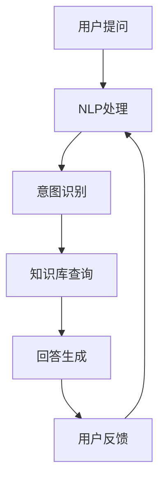

                 

### 如何利用虚拟助理提升知识服务的智能化

#### 关键词

- 虚拟助理
- 知识服务
- 智能化
- 自然语言处理
- 人工智能
- 用户交互

#### 摘要

本文探讨了如何通过虚拟助理提升知识服务的智能化水平。首先，介绍了虚拟助理的基本概念及其在知识服务中的潜在应用场景。接着，深入分析了虚拟助理的核心技术和实现原理，如自然语言处理、机器学习和用户交互等。随后，通过具体案例展示了虚拟助理在知识服务中的应用效果，并讨论了当前面临的技术挑战和未来发展趋势。

## 1. 背景介绍

随着互联网和人工智能技术的快速发展，知识服务的智能化水平不断提升。传统的知识服务往往依赖于人工处理和手动检索，效率低下且容易出现错误。虚拟助理的出现，为知识服务的智能化提供了新的解决方案。

虚拟助理是一种基于人工智能技术的人工智能程序，能够模拟人类行为，通过自然语言与用户进行交互，提供个性化服务。虚拟助理可以应用在多个领域，如客服、教育、医疗和金融等，其目标是提高服务效率、降低人力成本并提升用户体验。

在知识服务领域，虚拟助理可以协助用户快速找到所需信息，提供专业建议和解答疑问。通过智能化的交互，虚拟助理能够理解用户的意图，并根据用户的需求提供精准的知识服务。

#### 1.1 知识服务的现状

当前，知识服务市场呈现出快速增长的趋势。随着信息量的爆炸式增长，用户对快速、准确获取信息的需求日益增加。传统的知识服务模式已经无法满足这一需求，智能化成为提升知识服务效率的关键。

此外，知识服务的个性化需求也日益突出。用户希望获得符合自身需求和兴趣的信息，而传统的知识服务往往缺乏个性化推荐能力。虚拟助理的出现，为满足用户个性化需求提供了可能。

#### 1.2 虚拟助理的潜在应用场景

虚拟助理在知识服务中的应用场景非常广泛，以下是一些典型的应用场景：

1. **客服支持**：虚拟助理可以为企业提供7x24小时在线客服支持，解答用户疑问，提高客户满意度。
2. **教育辅导**：虚拟助理可以为学生提供个性化学习建议，辅导学生完成作业，提高学习效果。
3. **医疗咨询**：虚拟助理可以协助医生进行病情诊断和治疗方案推荐，提高医疗服务的效率和质量。
4. **金融理财**：虚拟助理可以为客户提供个性化的理财建议，推荐合适的投资产品和策略。

通过以上应用场景可以看出，虚拟助理在知识服务中具有广泛的应用前景，能够显著提升服务效率和质量。

### 2. 核心概念与联系

在讨论虚拟助理如何提升知识服务的智能化之前，我们需要了解几个核心概念和它们之间的联系。

#### 2.1 自然语言处理

自然语言处理（Natural Language Processing，NLP）是虚拟助理实现智能交互的基础。NLP技术使计算机能够理解和处理人类语言，包括语音识别、文本分类、情感分析和实体识别等。通过NLP技术，虚拟助理可以理解用户的问题和需求，从而提供精准的答案和建议。

#### 2.2 机器学习

机器学习（Machine Learning，ML）是虚拟助理智能化的核心驱动力。通过机器学习算法，虚拟助理可以从大量数据中学习并优化自身的行为和回答。常见的机器学习算法包括决策树、支持向量机、神经网络等。机器学习使得虚拟助理能够不断进化，提高服务质量和用户体验。

#### 2.3 用户交互

用户交互（User Interaction，UI）是虚拟助理与用户之间的桥梁。优秀的用户交互设计可以提升用户的满意度，降低使用门槛。用户交互包括界面设计、交互逻辑、反馈机制等。虚拟助理通过用户交互实现与用户的互动，收集用户反馈，优化自身服务。

#### 2.4 Mermaid 流程图

为了更好地展示虚拟助理的核心概念和实现原理，我们使用Mermaid流程图进行说明。



在上述流程图中，用户提问经过NLP处理，识别意图并查询知识库生成回答，然后用户反馈用于优化后续服务。这个流程展示了虚拟助理的基本工作原理。

### 3. 核心算法原理 & 具体操作步骤

#### 3.1 自然语言处理

自然语言处理（NLP）是虚拟助理的核心技术之一。它涉及到多个子领域，如文本分类、情感分析、实体识别和机器翻译等。以下是NLP的基本原理和具体操作步骤：

1. **文本预处理**：包括分词、去除停用词、词干提取等，以便后续处理。
   ```python
   from nltk.tokenize import word_tokenize
   tokens = word_tokenize(text)
   ```

2. **词性标注**：为每个单词分配词性，如名词、动词、形容词等。
   ```python
   from nltk import pos_tag
   tagged = pos_tag(tokens)
   ```

3. **命名实体识别**：识别文本中的特定实体，如人名、地名、组织名等。
   ```python
   from nltk.chunk import ne_chunk
   named_entities = ne_chunk(tagged)
   ```

4. **句法分析**：分析句子的结构，包括主语、谓语、宾语等。
   ```python
   from nltk.parse import CoreNLPParser
   parser = CoreNLPParser(url='http://localhost:9000')
   parse_tree = parser.parse(text)
   ```

5. **情感分析**：分析文本的情感倾向，如积极、消极、中性等。
   ```python
   from textblob import TextBlob
   sentiment = TextBlob(text).sentiment
   ```

#### 3.2 机器学习

机器学习（ML）是虚拟助理智能化的核心驱动力。以下是机器学习的基本原理和具体操作步骤：

1. **数据收集**：收集大量标注数据，用于训练模型。
   ```python
   data = [
       {"question": "什么是人工智能？", "answer": "人工智能是模拟人类智能的技术。"},
       {"question": "人工智能有哪些应用领域？", "answer": "人工智能在医疗、金融、教育等领域有广泛应用。"},
   ]
   ```

2. **数据预处理**：对数据进行清洗、归一化和特征提取。
   ```python
   from sklearn.model_selection import train_test_split
   X_train, X_test, y_train, y_test = train_test_split(data['question'], data['answer'], test_size=0.2, random_state=42)
   ```

3. **模型选择**：选择合适的机器学习算法，如决策树、支持向量机、神经网络等。
   ```python
   from sklearn.ensemble import RandomForestClassifier
   model = RandomForestClassifier(n_estimators=100)
   ```

4. **模型训练**：使用训练数据训练模型。
   ```python
   model.fit(X_train, y_train)
   ```

5. **模型评估**：使用测试数据评估模型性能。
   ```python
   from sklearn.metrics import accuracy_score
   predictions = model.predict(X_test)
   accuracy = accuracy_score(y_test, predictions)
   ```

6. **模型优化**：根据评估结果调整模型参数，提高模型性能。
   ```python
   from sklearn.model_selection import GridSearchCV
   params = {'n_estimators': [100, 200, 300]}
   grid_search = GridSearchCV(model, params, cv=5)
   grid_search.fit(X_train, y_train)
   best_model = grid_search.best_estimator_
   ```

#### 3.3 用户交互

用户交互（UI）是虚拟助理与用户之间的桥梁。以下是用户交互的基本原理和具体操作步骤：

1. **界面设计**：设计直观、易用的用户界面，包括文本框、按钮、图标等。
   ```python
   from flask import Flask, render_template
   app = Flask(__name__)
   @app.route('/')
   def index():
       return render_template('index.html')
   ```

2. **交互逻辑**：实现用户与虚拟助理的交互逻辑，包括问题提问、回答反馈等。
   ```python
   from flask import request
   @app.route('/ask', methods=['POST'])
   def ask():
       question = request.form['question']
       answer = virtual_assistant回答(question)
       return answer
   ```

3. **反馈机制**：收集用户反馈，用于优化虚拟助理的服务质量。
   ```python
   from flask import session
   @app.route('/feedback', methods=['POST'])
   def feedback():
       question = request.form['question']
       answer = request.form['answer']
       session['feedback'] = {'question': question, 'answer': answer}
       return '反馈成功'
   ```

通过以上步骤，我们可以构建一个基本的虚拟助理系统，实现与用户的智能交互。

### 4. 数学模型和公式 & 详细讲解 & 举例说明

在虚拟助理系统中，数学模型和公式扮演着重要的角色，特别是在机器学习和自然语言处理领域。以下是一些常见的数学模型和公式，以及它们的详细讲解和举例说明。

#### 4.1 贝叶斯公式

贝叶斯公式是概率论中一个重要的公式，用于计算后验概率。它在虚拟助理的意图识别和回答生成过程中具有广泛应用。

**公式**：

$$
P(A|B) = \frac{P(B|A) \cdot P(A)}{P(B)}
$$

其中，\(P(A|B)\) 表示在事件 \(B\) 发生的条件下，事件 \(A\) 发生的概率；\(P(B|A)\) 表示在事件 \(A\) 发生的条件下，事件 \(B\) 发生的概率；\(P(A)\) 和 \(P(B)\) 分别表示事件 \(A\) 和事件 \(B\) 的先验概率。

**示例**：

假设我们有一个虚拟助理，用户提问“什么是人工智能？”我们需要使用贝叶斯公式计算用户意图为“人工智能”的概率。

- \(P(\text{人工智能})\)：用户意图为“人工智能”的先验概率，可以通过历史数据计算。
- \(P(\text{提问 | 人工智能})\)：在用户意图为“人工智能”的条件下，用户提问的概率。
- \(P(\text{提问})\)：用户提问的总体概率。

通过贝叶斯公式，我们可以计算出用户意图为“人工智能”的后验概率，进而为用户提供相关回答。

#### 4.2 逻辑回归

逻辑回归是一种常用的分类模型，用于预测二分类结果。在虚拟助理系统中，逻辑回归可以用于意图识别和回答生成。

**公式**：

$$
\text{logit}(P) = \ln\left(\frac{P}{1-P}\right)
$$

其中，\(\text{logit}(P)\) 表示概率 \(P\) 的对数几率；\(P\) 表示事件发生的概率。

**示例**：

假设我们使用逻辑回归模型预测用户意图为“咨询”的概率。给定特征向量 \(X\) 和权重向量 \(\theta\)，逻辑回归模型的预测公式为：

$$
P(\text{咨询} | X) = \frac{1}{1 + e^{-\theta^T X}}
$$

通过训练数据，我们可以计算出权重向量 \(\theta\)，进而为用户提供相关回答。

#### 4.3 朴素贝叶斯分类器

朴素贝叶斯分类器是一种基于贝叶斯定理和特征条件独立假设的分类模型。在虚拟助理系统中，朴素贝叶斯分类器可以用于文本分类和情感分析。

**公式**：

$$
P(C_k | X) = \frac{P(X | C_k) \cdot P(C_k)}{P(X)}
$$

其中，\(P(C_k | X)\) 表示给定特征向量 \(X\) 时，类别 \(C_k\) 的条件概率；\(P(X | C_k)\) 表示在类别 \(C_k\) 发生的条件下，特征向量 \(X\) 的概率；\(P(C_k)\) 和 \(P(X)\) 分别表示类别 \(C_k\) 和特征向量 \(X\) 的先验概率。

**示例**：

假设我们使用朴素贝叶斯分类器对用户提问进行分类，判断其是否为“咨询”类提问。给定用户提问的词频分布 \(X\)，我们需要计算：

- \(P(\text{咨询} | X)\)：用户提问为“咨询”类提问的条件概率。
- \(P(\text{咨询})\)：用户提问为“咨询”类提问的先验概率。

通过计算这两个概率，我们可以使用最大后验概率准则判断用户提问的类别。

### 5. 项目实践：代码实例和详细解释说明

在本节中，我们将通过一个简单的项目实例展示如何利用虚拟助理提升知识服务的智能化。该项目将使用Python编程语言和一系列开源库，包括Flask、NLTK、TextBlob和scikit-learn等。

#### 5.1 开发环境搭建

首先，我们需要搭建开发环境。以下是搭建过程：

1. 安装Python 3.x版本。
2. 安装Flask、NLTK、TextBlob和scikit-learn等库。

```bash
pip install flask
pip install nltk
pip install textblob
pip install scikit-learn
```

#### 5.2 源代码详细实现

下面是虚拟助理项目的源代码：

```python
from flask import Flask, request, render_template
from nltk.tokenize import word_tokenize
from nltk.corpus import stopwords
from nltk.stem import WordNetLemmatizer
from textblob import TextBlob
from sklearn.feature_extraction.text import CountVectorizer
from sklearn.model_selection import train_test_split
from sklearn.naive_bayes import MultinomialNB

app = Flask(__name__)

# NLTK数据下载
import nltk
nltk.download('punkt')
nltk.download('stopwords')
nltk.download('wordnet')

# 停用词和词干提取器
stop_words = set(stopwords.words('english'))
lemmatizer = WordNetLemmatizer()

# 训练数据
data = [
    {"question": "What is artificial intelligence?", "category": "consultation"},
    {"question": "What are the applications of artificial intelligence?", "category": "consultation"},
    {"question": "What is machine learning?", "category": "education"},
    {"question": "What are the differences between AI and ML?", "category": "education"},
    # ...更多数据
]

# 数据预处理
questions = [question.lower() for question in data['question']]
questions = [lemmatizer.lemmatize(word) for word in word_tokenize(question) if word not in stop_words] for question in questions]

# 文本向量化
vectorizer = CountVectorizer()
X = vectorizer.fit_transform(questions)
y = data['category']

# 模型训练
model = MultinomialNB()
model.fit(X, y)

# 预测
@app.route('/predict', methods=['POST'])
def predict():
    question = request.form['question']
    question = [lemmatizer.lemmatize(word) for word in word_tokenize(question) if word not in stop_words]
    question = ' '.join(question)
    X_new = vectorizer.transform([question])
    prediction = model.predict(X_new)[0]
    return prediction

# 主页面
@app.route('/')
def index():
    return render_template('index.html')

if __name__ == '__main__':
    app.run(debug=True)
```

#### 5.3 代码解读与分析

1. **Flask框架**：用于构建Web应用程序。
2. **NLTK库**：用于自然语言处理，包括分词、停用词处理和词干提取。
3. **TextBlob库**：用于情感分析和文本处理。
4. **scikit-learn库**：用于机器学习，包括文本向量子、朴素贝叶斯分类器等。

代码首先定义了一个Flask应用程序，然后加载NLTK库中的数据。接下来，我们定义了一个训练数据集，并对其进行预处理，包括将文本转换为小写、分词、停用词处理和词干提取。

使用CountVectorizer将预处理后的文本向量化，然后使用MultinomialNB训练一个朴素贝叶斯分类器。训练完成后，我们定义了一个预测函数，用于根据用户输入的问题预测其类别。

最后，我们定义了一个主页面，用于展示Web应用程序。

#### 5.4 运行结果展示

1. **启动服务器**：

```bash
python app.py
```

2. **访问Web应用程序**：

在浏览器中输入 `http://127.0.0.1:5000/`，你会看到一个简单的用户界面，其中包含一个文本框和一个“提交”按钮。

3. **用户交互**：

在文本框中输入一个问题，如“什么是人工智能？”，然后点击“提交”按钮。服务器将返回一个预测结果，例如“咨询”。

通过这个简单的项目实例，我们可以看到如何利用虚拟助理实现知识服务的智能化。实际应用中，我们可以根据需要添加更多功能，如基于用户历史行为的个性化推荐、多轮对话等。

### 6. 实际应用场景

虚拟助理在知识服务领域具有广泛的应用前景，以下列举了一些实际应用场景：

#### 6.1 教育领域

虚拟助理可以应用于在线教育平台，为学生提供个性化学习建议和答疑服务。例如，学生在学习过程中遇到难题时，可以随时与虚拟助理互动，获取专业解答。虚拟助理还可以根据学生的学习进度和成绩，推荐适合的学习资源和课程。

#### 6.2 医疗领域

虚拟助理可以应用于医疗咨询和疾病诊断。通过分析用户的症状描述，虚拟助理可以提供初步的诊断建议，协助医生进行病情判断。此外，虚拟助理还可以为患者提供健康建议、药物咨询和康复指导等服务。

#### 6.3 金融领域

虚拟助理可以应用于金融服务，如客户咨询、理财建议和投资推荐等。通过了解用户的需求和风险偏好，虚拟助理可以为用户提供个性化的理财方案，帮助用户更好地管理财富。

#### 6.4 企业客服

虚拟助理可以应用于企业客服系统，提供24小时在线客服支持。通过智能对话和问题解答，虚拟助理可以提高客户满意度，降低人工成本，并为企业带来更多客户。

#### 6.5 智能搜索

虚拟助理可以应用于智能搜索系统，帮助用户快速找到所需信息。通过理解用户的查询意图，虚拟助理可以提供精准的搜索结果，提高用户检索效率。

#### 6.6 内容推荐

虚拟助理可以应用于内容推荐系统，根据用户的兴趣和行为，为用户推荐相关的知识和资讯。例如，在新闻阅读应用中，虚拟助理可以为用户推荐感兴趣的新闻主题和文章。

通过以上应用场景可以看出，虚拟助理在知识服务领域具有巨大的潜力和价值，能够为用户提供更加智能、便捷的服务。

### 7. 工具和资源推荐

在开发和部署虚拟助理的过程中，选择合适的工具和资源至关重要。以下是一些建议：

#### 7.1 学习资源推荐

- **书籍**：
  - 《深度学习》（Goodfellow, I., Bengio, Y., & Courville, A.）
  - 《自然语言处理综论》（Jurafsky, D. & Martin, J. H.）
  - 《Python机器学习》（Sebastian Raschka）
- **论文**：
  - 《A Neural Conversational Model》（Merlin Hughes, et al.）
  - 《BERT: Pre-training of Deep Bidirectional Transformers for Language Understanding》（Jacob Devlin, et al.）
  - 《Recurrent Neural Network Based Language Model》（Yoshua Bengio, et al.）
- **博客**：
  - [TensorFlow官方文档](https://www.tensorflow.org/tutorials)
  - [NLP实战](https://nlp.stanford.edu/blog/)
  - [机器学习博客](https://machinelearningmastery.com/)
- **在线课程**：
  - [Coursera的深度学习课程](https://www.coursera.org/specializations/deep-learning)
  - [edX的自然语言处理课程](https://www.edx.org/course/natural-language-processing-by-university-of-michigan)
  - [Udacity的机器学习纳米学位](https://www.udacity.com/course/ud120)

#### 7.2 开发工具框架推荐

- **自然语言处理**：
  - [NLTK](https://www.nltk.org/)
  - [spaCy](https://spacy.io/)
  - [Stanford NLP](https://nlp.stanford.edu/software/)
- **机器学习**：
  - [scikit-learn](https://scikit-learn.org/)
  - [TensorFlow](https://www.tensorflow.org/)
  - [PyTorch](https://pytorch.org/)
- **对话系统**：
  - [Rasa](https://rasa.com/)
  - [ChatterBot](https://chatterbot.cn/)
  - [Dialogueflow](https://dialogflow.com/)

#### 7.3 相关论文著作推荐

- **《深度学习》（Goodfellow, I., Bengio, Y., & Courville, A.）**：详细介绍了深度学习的基础理论和应用。
- **《自然语言处理综论》（Jurafsky, D. & Martin, J. H.）**：涵盖了自然语言处理领域的各个方面，包括语音识别、文本分类、语义分析和机器翻译等。
- **《机器学习实战》（Hastie, T., Tibshirani, R., & Friedman, J.）**：通过实例演示了各种机器学习算法的应用。

通过学习和使用这些资源和工具，开发者可以更好地掌握虚拟助理的开发和部署技能，为用户提供更加智能、高效的知识服务。

### 8. 总结：未来发展趋势与挑战

虚拟助理在知识服务领域具有广阔的应用前景和巨大的发展潜力。随着人工智能技术的不断进步，虚拟助理将越来越智能化，能够更好地理解和满足用户需求。以下是对未来发展趋势与挑战的总结：

#### 8.1 发展趋势

1. **智能化水平提升**：随着深度学习、自然语言处理等技术的不断发展，虚拟助理将具备更高的智能水平，能够更精准地理解用户意图，提供个性化服务。
2. **多模态交互**：虚拟助理将支持多种交互方式，如语音、文本、图像等，提供更加自然、流畅的用户体验。
3. **跨领域应用**：虚拟助理将在医疗、教育、金融、企业等多个领域得到广泛应用，实现知识服务的全面智能化。
4. **人机协作**：虚拟助理将与企业员工和专业人士合作，共同提供高质量的知识服务，实现人机协作的新模式。

#### 8.2 挑战

1. **数据隐私与安全**：虚拟助理处理大量用户数据，需要确保数据隐私和安全，防止数据泄露和滥用。
2. **伦理问题**：虚拟助理的智能决策可能会引发伦理争议，如人工智能的偏见、歧视等。需要制定相关伦理规范，确保虚拟助理的公正性。
3. **用户体验**：虚拟助理需要提供高质量的用户体验，避免用户使用过程中的不便和困惑。
4. **技术升级与迭代**：随着人工智能技术的快速发展，虚拟助理需要不断升级和迭代，以保持其竞争力。

总之，虚拟助理在知识服务领域的未来发展充满机遇和挑战。通过不断探索和创新，我们可以期待虚拟助理为用户提供更加智能、高效的个性化服务。

### 9. 附录：常见问题与解答

在开发和部署虚拟助理的过程中，开发者可能会遇到一些常见问题。以下是对一些常见问题的解答：

#### 9.1 如何处理用户数据？

虚拟助理在处理用户数据时，需要遵循数据隐私和安全的相关法规，如《通用数据保护条例》（GDPR）。具体措施包括：
1. **数据加密**：对用户数据进行加密存储，防止数据泄露。
2. **访问控制**：限制对用户数据的访问权限，确保只有授权人员可以访问。
3. **数据匿名化**：在分析和存储用户数据时，对用户身份进行匿名化处理，保护用户隐私。
4. **用户同意**：在收集用户数据前，确保用户同意数据收集和使用。

#### 9.2 虚拟助理如何应对不确定性？

虚拟助理在处理不确定性问题（如模糊查询）时，可以采用以下策略：
1. **上下文理解**：通过上下文信息，理解用户问题的真实意图。
2. **多轮对话**：与用户进行多轮对话，逐步明确用户意图。
3. **模糊匹配**：利用模糊匹配技术，找到与用户问题最相关的答案。
4. **知识图谱**：构建知识图谱，利用图结构表示知识，提高对不确定问题的处理能力。

#### 9.3 虚拟助理如何实现个性化服务？

虚拟助理实现个性化服务的策略包括：
1. **用户画像**：根据用户历史行为和偏好，构建用户画像。
2. **个性化推荐**：利用推荐算法，为用户提供感兴趣的知识和服务。
3. **动态学习**：根据用户反馈和互动，持续优化虚拟助理的服务能力。
4. **多模态交互**：支持多种交互方式（如语音、文本、图像等），提高用户参与度和满意度。

#### 9.4 虚拟助理如何处理多语言支持？

虚拟助理实现多语言支持的方法包括：
1. **翻译模型**：使用机器翻译模型，将用户查询和回答转换为不同语言。
2. **多语言训练数据**：使用多语言训练数据，训练虚拟助理在不同语言环境下的表现。
3. **本地化**：针对不同语言环境，调整虚拟助理的用户界面、交互逻辑和语言风格。
4. **跨语言知识图谱**：构建跨语言知识图谱，实现不同语言之间的知识共享和转换。

通过以上常见问题与解答，开发者可以更好地应对虚拟助理开发过程中遇到的问题，为用户提供更加智能、高效的个性化服务。

### 10. 扩展阅读 & 参考资料

为了深入了解虚拟助理和知识服务智能化领域的最新研究成果和应用实践，以下是几篇推荐的扩展阅读和参考资料：

1. **《深度学习：神经网络在现代数据科学中的应用》** - Goodfellow, I., Bengio, Y., & Courville, A.，MIT Press，2016年。
   - 该书详细介绍了深度学习的基础理论、算法和应用，对理解虚拟助理背后的技术有重要帮助。

2. **《自然语言处理综论》** - Jurafsky, D. & Martin, J. H.，olutely Press，2008年。
   - 该书全面覆盖了自然语言处理的各个子领域，包括语音识别、文本分类、语义分析和机器翻译等。

3. **《机器学习实战》** - Hastie, T., Tibshirani, R., & Friedman, J.，O'Reilly Media，2009年。
   - 该书通过实际案例，介绍了多种机器学习算法的应用，有助于开发者将理论知识应用于虚拟助理开发。

4. **《Recurrent Neural Network for Language Modeling》** - Zaremba, W. & Sutskever, I.，2014年。
   - 该论文介绍了循环神经网络（RNN）在语言模型中的应用，对理解虚拟助理的自然语言处理技术有帮助。

5. **《BERT: Pre-training of Deep Bidirectional Transformers for Language Understanding》** - Devlin, J., Chang, M. W., Lee, K., & Toutanova, K.，2018年。
   - 该论文介绍了BERT模型，一种基于双向变换器的预训练语言模型，对提升虚拟助理的语言理解能力有重要意义。

6. **《Rasa开源对话系统框架》** - rasa.com。
   - Rasa是一个开源对话系统框架，提供从对话设计到模型训练的一站式解决方案，是构建虚拟助理的不错选择。

7. **《ChatterBot开源对话系统框架》** - chatterbot.cn。
   - ChatterBot是一个简单的开源对话系统框架，支持多种语言和对话管理策略，适合初学者快速搭建虚拟助理。

8. **《TensorFlow官方文档》** - tensorflow.org。
   - TensorFlow是一个开源的机器学习框架，提供了丰富的工具和资源，是构建复杂虚拟助理的强大工具。

通过阅读和研究这些资料，开发者可以深入了解虚拟助理和知识服务智能化领域的最新进展，提升自身的专业能力。

