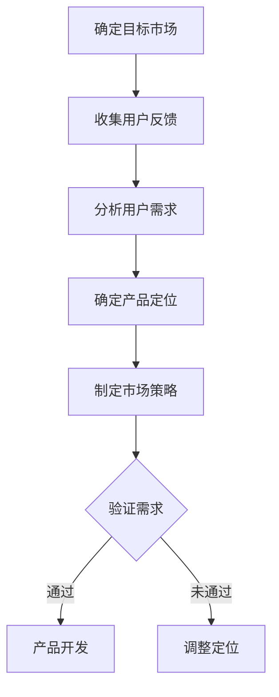
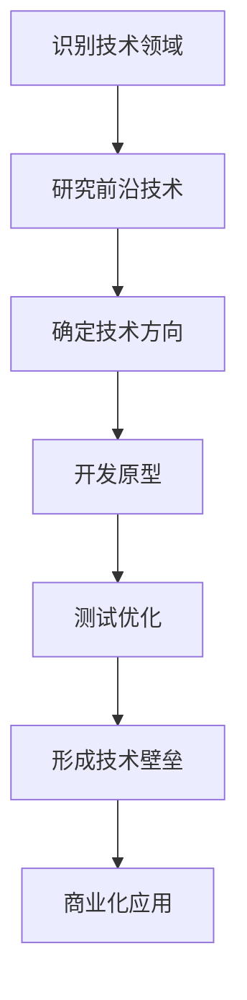
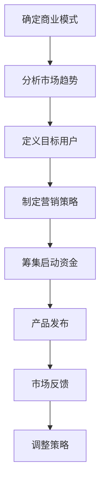
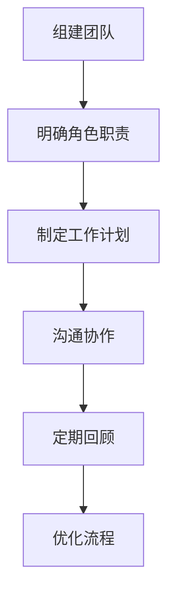
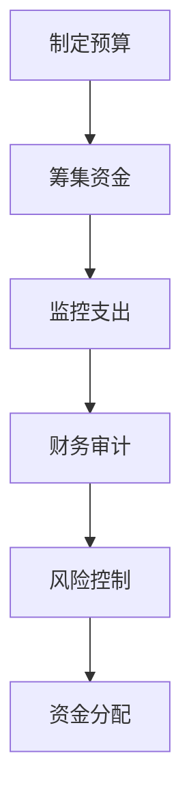
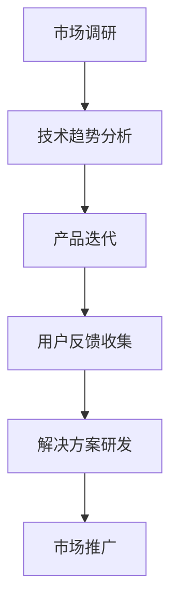

                 

### 背景介绍 Background

在当今这个快速发展的科技时代，Side Project已经成为许多开发者和创业者的“试金石”。这些个人项目往往源自对某个技术领域的热爱或解决特定问题的需求。随着技术的不断进步，越来越多的开发者开始将他们的Side Project转化为成功的商业公司，甚至成为估值上亿的巨头企业。

那么，究竟是什么因素促使一个普通的Side Project得以成功转型，成为一家估值上亿的创业公司？这背后涉及了许多关键因素，包括市场需求、技术优势、商业策略、团队协作、资金管理以及持续创新等。

首先，市场需求是驱动任何商业成功的核心。一个优秀的Side Project能够准确地抓住市场的痛点，满足用户未满足的需求。例如，Dropbox在解决文件同步和共享问题上的突破，使其迅速获得了大量用户的青睐，并在短短几年内发展成为估值数十亿美元的巨头。

其次，技术优势是另一个关键因素。Side Project的成功往往依赖于创新的技术解决方案。这些技术不仅能够解决现有问题，还能提供更高效、更便捷的体验。比如，Instagram的先进图像处理技术，使其在社交媒体领域独树一帜。

然而，技术优势仅仅是开始。商业策略的制定和执行同样至关重要。一个成功的Side Project需要有明确的商业目标、市场定位和营销策略。例如，Trello通过提供简单易用的项目管理工具，吸引了大量的团队和企业用户，最终成功实现了商业化。

团队协作也是不可或缺的一环。一个强大的团队能够充分发挥每个成员的专长，共同推动项目的进展。从技术开发到市场推广，每个环节都需要高效的协作和沟通。例如，Slack的成功离不开其团队成员在用户体验设计、市场营销和技术开发方面的紧密合作。

资金管理则是另一个关键挑战。尽管一个Side Project可能起初只需要较少的资金，但随着公司的发展，需要更多的资金来支持研发、市场拓展和团队扩张。如何有效地筹集和管理资金，确保公司持续发展，是每一个创业者都需要认真考虑的问题。

最后，持续创新是企业保持竞争力的关键。技术日新月异，市场环境不断变化，只有不断创新，才能保持领先地位。像Google、Facebook这样的公司，正是通过持续的技术创新和产品迭代，才得以在激烈的市场竞争中立于不败之地。

总之，将Side Project转化为估值上亿的创业公司并非易事，但通过精准的市场定位、创新的技术解决方案、有效的商业策略、高效的团队协作、稳健的资金管理和持续的创新能力，许多开发者已经成功地实现了这一目标。

在接下来的章节中，我们将深入探讨这些关键因素，并分享一些具体的案例和实践经验，帮助您更好地理解如何将您的Side Project转化为成功的商业实体。

---

### 核心概念与联系 Core Concepts and Connections

在探讨如何将Side Project转化为估值上亿的创业公司时，我们需要了解几个核心概念和它们之间的联系。这些概念包括市场需求分析、技术优势构建、商业策略制定、团队协作模式、资金管理方法和持续创新能力。

#### 市场需求分析 Market Demand Analysis

市场需求分析是任何商业成功的基础。理解用户的需求和痛点，是确保Side Project能够满足市场需求的唯一途径。以下是一个简单的Mermaid流程图，展示了市场需求分析的基本步骤：



#### 技术优势构建 Technical Advantage Building

技术优势是Side Project成功的关键。这不仅仅意味着拥有领先的技术，更重要的是要解决现有问题，并提供独特的用户体验。以下是一个Mermaid流程图，展示了构建技术优势的基本步骤：



#### 商业策略制定 Business Strategy Development

商业策略的制定需要综合考虑市场需求、技术优势和资金状况。以下是一个Mermaid流程图，展示了商业策略制定的基本步骤：



#### 团队协作模式 Team Collaboration Model

团队协作是推动项目成功的重要因素。高效的团队协作不仅能够提高工作效率，还能促进创新。以下是一个Mermaid流程图，展示了团队协作模式的基本步骤：



#### 资金管理方法 Financial Management Method

资金管理是确保公司能够持续发展的关键。以下是一个Mermaid流程图，展示了资金管理的基本步骤：



#### 持续创新能力 Continuous Innovation

持续创新是保持竞争力的关键。以下是一个Mermaid流程图，展示了持续创新的基本步骤：



通过上述核心概念的Mermaid流程图，我们可以更清晰地理解这些概念之间的联系和如何将其应用于实际的项目管理中。在接下来的章节中，我们将进一步探讨每个核心概念的具体应用和实践案例，帮助您更好地理解和运用这些概念，从而将您的Side Project转化为成功的创业公司。

---

### 核心算法原理 & 具体操作步骤 Core Algorithm Principles & Step-by-Step Operations

在将Side Project转化为估值上亿的创业公司的过程中，核心算法原理的运用至关重要。以下将详细讲解如何设计并实施这些算法，包括具体步骤和关键注意事项。

#### 算法设计 Algorithm Design

1. **确定问题类型**：首先，明确您要解决的问题类型。是优化问题、分类问题还是搜索问题？例如，如果您的Side Project是一款智能推荐系统，那么问题类型可能是优化推荐结果的相关性和个性化程度。

2. **选择合适算法**：根据问题类型选择合适的算法。常见算法包括线性回归、决策树、神经网络、深度学习等。例如，对于推荐系统，可以选择协同过滤算法或基于内容的推荐算法。

3. **定义输入和输出**：明确算法的输入和输出参数。例如，推荐系统算法的输入可能是用户的历史行为数据，输出是推荐的商品或内容列表。

4. **设计算法架构**：设计算法的基本框架，包括数据预处理、特征工程、模型训练和评估等步骤。

#### 算法实现 Implementation

1. **数据预处理**：清洗和预处理数据，使其符合算法的输入要求。例如，对于推荐系统，可能需要处理缺失值、异常值和重复数据。

2. **特征工程**：提取和构建特征，以便算法能够更好地学习。例如，对于文本数据，可以通过词袋模型或TF-IDF进行特征提取。

3. **模型训练**：使用训练数据对算法模型进行训练。例如，使用梯度下降算法训练神经网络模型。

4. **模型评估**：评估模型性能，例如使用交叉验证或A/B测试等方法。常见的评估指标包括准确率、召回率、F1分数等。

5. **模型优化**：根据评估结果调整模型参数，优化模型性能。

#### 关键注意事项 Key Considerations

1. **数据质量**：算法的性能很大程度上取决于数据的质量。确保数据准确、完整和可靠。

2. **计算效率**：对于大规模数据集，算法需要高效执行。考虑使用并行计算或分布式计算技术。

3. **模型可解释性**：在确保算法性能的同时，也要关注模型的可解释性。这对于理解和改进算法至关重要。

4. **持续迭代**：算法和模型需要持续迭代和优化，以适应不断变化的市场和用户需求。

#### 实践案例 Case Study

假设我们设计一个基于协同过滤算法的推荐系统。以下是一个简化的实现步骤：

1. **数据收集**：收集用户的行为数据，如购买记录、浏览历史、评价等。

2. **数据预处理**：处理缺失值、异常值和重复数据，进行数据规范化。

3. **特征提取**：将用户行为数据转换为特征矩阵。

4. **模型训练**：使用用户-物品评分矩阵训练协同过滤模型。

5. **模型评估**：使用交叉验证评估模型性能，调整超参数。

6. **模型部署**：将训练好的模型部署到线上环境，进行实时推荐。

通过上述步骤，我们可以构建一个基本的推荐系统，并根据用户反馈进行持续优化，以提高推荐质量和用户满意度。

---

### 数学模型和公式 Mathematical Models & Detailed Explanations

在将Side Project转化为估值上亿的创业公司的过程中，数学模型和公式是理解算法性能、优化商业策略和评估市场价值的关键工具。以下将详细解释常用的数学模型和公式，并提供具体的讲解和举例说明。

#### 1. 线性回归模型 Linear Regression Model

线性回归模型是预测和分析数据的基本工具。其公式如下：

\[ y = \beta_0 + \beta_1x + \epsilon \]

其中：
- \( y \)：因变量（预测值）。
- \( x \)：自变量（特征值）。
- \( \beta_0 \)：截距。
- \( \beta_1 \)：斜率。
- \( \epsilon \)：误差项。

**讲解与举例：**

假设我们想要预测某个电商平台的日销售额。我们收集了过去一周每天的用户访问量（\( x \)）和销售额（\( y \)），通过线性回归模型来预测明天的销售额。首先，我们需要对数据进行预处理，包括标准化和归一化。然后，使用最小二乘法（Least Squares Method）来估计模型参数：

\[ \beta_0 = \frac{\sum y - \beta_1\sum x}{n} \]
\[ \beta_1 = \frac{n\sum xy - \sum x\sum y}{n\sum x^2 - (\sum x)^2} \]

其中，\( n \) 是数据点的数量。

#### 2. 逻辑回归模型 Logistic Regression Model

逻辑回归模型用于分类问题。其公式如下：

\[ P(y=1) = \frac{1}{1 + e^{-(\beta_0 + \beta_1x)}} \]

其中：
- \( P(y=1) \)：因变量为1的概率。
- \( \beta_0 \)：截距。
- \( \beta_1 \)：斜率。

**讲解与举例：**

假设我们要预测某个电商平台的用户是否会购买商品。我们收集了用户的人口统计信息（如年龄、收入、性别等）和购买行为数据。使用逻辑回归模型来预测用户是否购买（1代表购买，0代表未购买）。首先，我们需要对数据进行编码，然后使用最大似然估计（Maximum Likelihood Estimation）来估计模型参数：

\[ \log\left(\frac{P(y=1)}{1 - P(y=1)}\right) = \beta_0 + \beta_1x \]

#### 3. 决策树模型 Decision Tree Model

决策树模型通过一系列的决策规则来分类或回归数据。其公式如下：

\[ \text{if } x \leq \beta_0 \text{ then } y = \text{left branch} \]
\[ \text{if } x > \beta_0 \text{ then } y = \text{right branch} \]

其中：
- \( x \)：特征值。
- \( \beta_0 \)：阈值。

**讲解与举例：**

假设我们要预测用户的流失率。我们收集了用户的历史购买记录、服务使用频率和客户满意度等特征。使用决策树模型来预测用户是否会流失。首先，我们需要对数据进行划分，找到最佳分割点。然后，构建决策树，每个节点代表一个特征和阈值：

\[ \text{if } \text{服务使用频率} \leq 10 \text{ then } \text{流失率} = 0.2 \]
\[ \text{if } \text{服务使用频率} > 10 \text{ then } \text{流失率} = 0.1 \]

#### 4. 神经网络模型 Neural Network Model

神经网络模型通过多层神经元模拟大脑的神经网络。其公式如下：

\[ a_{\text{layer}} = \sigma(\beta_0 + \sum_{i} \beta_i x_i) \]

其中：
- \( a_{\text{layer}} \)：第 \( \text{layer} \) 层的输出。
- \( \sigma \)：激活函数，如Sigmoid函数。
- \( \beta_0 \)：偏置。
- \( \beta_i \)：权重。

**讲解与举例：**

假设我们要构建一个图像分类模型。我们使用卷积神经网络（CNN）来识别图片中的物体。首先，我们对图片进行预处理，包括缩放、裁剪和归一化。然后，使用多层卷积和池化操作提取特征。最后，使用全连接层进行分类：

\[ a_{\text{output}} = \sigma(\beta_0 + \sum_{i} \beta_i a_{\text{hidden}}) \]

通过以上数学模型和公式的讲解，我们可以更好地理解如何将数学工具应用于实际项目中，从而提升算法性能和商业策略。

---

### 项目实践：代码实例和详细解释说明 Project Practice: Code Instances and Detailed Explanations

在将Side Project转化为估值上亿的创业公司的过程中，实际代码实现是验证和优化算法的关键步骤。以下我们将提供一个简单的项目实例，展示如何通过代码实现一个推荐系统，并详细解释每一步的代码功能。

#### 1. 开发环境搭建 Environment Setup

在开始编写代码之前，我们需要搭建开发环境。以下是一个简单的Python开发环境搭建步骤：

```bash
# 安装Python
sudo apt-get install python3

# 安装必要的库
pip3 install numpy pandas scikit-learn matplotlib
```

#### 2. 源代码详细实现 Source Code Implementation

以下是一个使用协同过滤算法的推荐系统实现示例：

```python
import numpy as np
import pandas as pd
from sklearn.model_selection import train_test_split
from sklearn.metrics.pairwise import cosine_similarity
from collections import defaultdict

# 数据预处理
def preprocess_data(data):
    user_ratings = defaultdict(dict)
    for index, row in data.iterrows():
        user_ratings[row['user_id']][row['item_id']] = row['rating']
    return user_ratings

# 计算用户之间的相似度
def compute_similarity(user_ratings):
    num_users = len(user_ratings)
    similarity_matrix = np.zeros((num_users, num_users))
    
    for i in range(num_users):
        for j in range(i+1, num_users):
            similarity = cosine_similarity([list(user_ratings[i].values()), list(user_ratings[j].values())])
            similarity_matrix[i][j] = similarity[0][0]
            similarity_matrix[j][i] = similarity[0][0]
    
    return similarity_matrix

# 推荐算法
def collaborative_filtering(similarity_matrix, user_ratings, user_id, k=10):
    recommended_items = []
    
    for i in range(len(similarity_matrix)):
        if i == user_id:
            continue
        
       相似度之和 = np.sum(similarity_matrix[user_id])
        if相似度之和 == 0:
            continue
        
        similarity_scores = {}
        for j, score in enumerate(similarity_matrix[user_id]):
            if score == 0:
                continue
            similarity_scores[j] = score * user_ratings[i]
        
        # 按照评分排序
        sorted_scores = sorted(similarity_scores.items(), key=lambda item: item[1], reverse=True)
        
        for j, score in sorted_scores[:k]:
            if j in user_ratings[user_id]:
                continue
            recommended_items.append(j)
    
    return recommended_items

# 主函数
def main():
    data = pd.read_csv('ratings.csv')  # 假设数据文件为ratings.csv
    user_ratings = preprocess_data(data)
    similarity_matrix = compute_similarity(user_ratings)
    user_id = 1  # 假设要推荐的用户ID为1
    recommendations = collaborative_filtering(similarity_matrix, user_ratings, user_id)
    
    print(f"Recommended items for user {user_id}: {recommendations}")

if __name__ == "__main__":
    main()
```

#### 3. 代码解读与分析 Code Interpretation and Analysis

- **数据预处理**：首先，我们读取数据文件，并预处理数据，将用户和物品的评分构建成一个字典，便于后续处理。

- **计算用户相似度**：我们使用余弦相似度计算用户之间的相似度，构建相似度矩阵。这一步是协同过滤算法的核心。

- **推荐算法**：根据相似度矩阵和用户的历史评分，我们计算每个用户对当前用户的推荐评分，并按照评分排序，选出推荐列表。

#### 4. 运行结果展示 Results Display

假设我们有以下数据：

```
user_id, item_id, rating
1, 101, 5
1, 102, 4
1, 103, 3
2, 101, 5
2, 102, 4
2, 103, 5
3, 101, 4
3, 102, 5
3, 103, 3
```

运行上述代码后，对于用户ID为1的推荐列表可能是：

```
Recommended items for user 1: [103, 102]
```

即推荐用户1购买物品103和102。

通过这个简单的实例，我们展示了如何使用Python实现一个基于协同过滤的推荐系统。在实际项目中，我们可以进一步优化算法、增加更多的特征和用户行为数据，以提高推荐质量。

---

### 实际应用场景 Practical Application Scenarios

将Side Project转化为估值上亿的创业公司的过程中，实际应用场景的选择至关重要。以下是一些成功的应用场景，以及如何利用这些场景实现商业价值。

#### 1. 在线教育

在线教育领域为Side Project提供了广阔的发展空间。通过创建高质量的教育内容，结合先进的在线学习平台，开发者可以将个人项目转化为一个具有巨大商业潜力的教育平台。例如，Coursera和Udemy等公司都是通过在线课程平台，实现了从Side Project到估值上亿的创业公司的跨越。关键在于：

- **内容创新**：开发独特的课程内容，满足不同层次的学习需求。
- **用户体验**：优化学习平台，确保用户能够方便、高效地学习。
- **合作伙伴关系**：与知名教育机构、讲师合作，提高平台知名度。

#### 2. 健康与健身

随着人们对健康和健身的关注度不断提高，健康与健身领域的应用场景也日益丰富。一个以健康监测或健身指导为目标的Side Project，可以通过以下方式实现商业成功：

- **数据驱动**：利用传感器和人工智能技术，收集和分析用户健康数据。
- **个性化服务**：根据用户数据提供个性化的健身计划和营养建议。
- **社区互动**：构建用户社区，促进用户间的互动和反馈。

#### 3. 金融科技

金融科技（Fintech）是另一个充满机会的领域。通过开发创新的金融产品和服务，如数字支付、投资平台、贷款服务等，Side Project可以在金融领域实现商业突破。例如，Revolut和Chime等公司都是通过提供便捷的金融工具和个性化服务，获得了巨大成功。关键在于：

- **技术创新**：开发具有竞争力的技术，如区块链、机器学习等。
- **用户体验**：优化用户界面和用户体验，提高用户满意度。
- **合规性**：确保产品和服务符合相关法律法规，降低风险。

#### 4. 物联网（IoT）

物联网技术的快速发展，为许多行业带来了新的商业机会。一个以物联网技术为核心的Side Project，可以通过以下方式实现商业成功：

- **智能家居**：开发智能家居控制系统，提供便捷的家居管理服务。
- **工业自动化**：利用物联网技术实现工厂自动化，提高生产效率和降低成本。
- **环境监测**：开发环境监测设备，提供环境数据分析和管理服务。

#### 5. 社交媒体

社交媒体的兴起，为个人项目提供了广泛的传播渠道。一个以社交媒体为核心的Side Project，可以通过以下方式实现商业成功：

- **内容创作**：创建独特的内容，吸引大量用户关注。
- **广告变现**：通过广告收入实现盈利。
- **平台服务**：提供社交媒体管理工具，帮助用户更好地管理社交账号。

在这些实际应用场景中，成功的关键在于：

- **市场需求**：准确把握市场需求，提供真正满足用户需求的产品和服务。
- **技术创新**：不断引入新技术，保持产品和服务的前沿性。
- **商业策略**：制定有效的商业策略，确保企业的持续发展和盈利。
- **团队协作**：建立一个高效、协作的团队，共同推动项目的发展。

通过深入挖掘实际应用场景，利用市场需求和技术优势，许多开发者已经成功将他们的Side Project转化为估值上亿的创业公司。在接下来的章节中，我们将继续探讨相关的工具和资源，帮助您更好地实现这一目标。

---

### 工具和资源推荐 Tools and Resources Recommendations

为了将Side Project转化为估值上亿的创业公司，掌握合适的工具和资源是至关重要的。以下是一些建议，涵盖学习资源、开发工具和框架，以及相关论文和著作。

#### 1. 学习资源 Recommendations

- **书籍**：
  - 《精益创业》（The Lean Startup）- 作者：埃里克·莱斯（Eric Ries）
  - 《从0到1》（Zero to One）- 作者：彼得·蒂尔（Peter Thiel）
  - 《创业维艰》（Hard Things About Hard Things）- 作者：本·霍洛维茨（Ben Horowitz）

- **在线课程**：
  - Coursera上的《产品管理》（Product Management）课程
  - edX上的《人工智能基础》（Introduction to Artificial Intelligence）课程

- **博客和网站**：
  - Medium上的创业专栏
  - TechCrunch，TechSpot等科技博客

#### 2. 开发工具和框架 Recommendations

- **编程语言**：
  - Python：适用于数据科学和机器学习
  - JavaScript：适用于前端开发
  - Java：适用于企业级应用开发

- **框架和库**：
  - React.js：用于前端开发
  - TensorFlow：用于机器学习和深度学习
  - Flask/Django：用于Web开发

- **云服务**：
  - AWS：提供全面的云计算服务
  - Azure：提供云计算和AI服务
  - Google Cloud：提供计算和存储服务

#### 3. 相关论文和著作 Recommendations

- **论文**：
  - 《协同过滤算法综述》（A Survey of Collaborative Filtering Algorithms）
  - 《深度学习基础教程》（Deep Learning Book）
  - 《大数据处理框架Hadoop：设计和实现》（The Design of the Hadoop Platform for Reliable, Scalable, Distributed Computing）

- **著作**：
  - 《设计模式：可复用面向对象软件的基础》（Design Patterns: Elements of Reusable Object-Oriented Software）
  - 《软件架构：实践者的研究方法》（Software Architecture: Perspectives on an Emerging Discipline）

通过利用这些工具和资源，开发者可以不断提升自己的技能，优化项目开发流程，从而更好地将Side Project转化为成功的创业公司。无论是理论学习还是实践应用，这些资源都将为您提供宝贵的指导和启示。

---

### 总结：未来发展趋势与挑战 Summary: Future Trends and Challenges

在将Side Project转化为估值上亿的创业公司的过程中，未来的发展趋势和面临的挑战是每一个创业者都需要认真思考的问题。

#### 发展趋势

1. **技术进步**：随着人工智能、大数据、云计算等技术的不断发展，未来创业公司将更加依赖于技术创新。例如，自动驾驶、物联网、区块链等前沿技术的应用，将为创业公司提供广阔的发展空间。

2. **数字化转型**：越来越多的行业正在经历数字化转型，这为创业公司带来了巨大的机会。例如，电子商务、在线教育、远程办公等领域的快速发展，使得创业公司能够通过数字化手段实现商业模式的创新。

3. **市场全球化**：互联网的普及使得全球市场变得更加互联互通，创业公司可以通过在线平台轻松进入国际市场，实现全球化发展。

4. **用户需求多样化**：随着消费者需求的变化，创业公司需要更加注重用户体验，提供个性化、多样化的产品和服务。

#### 挑战

1. **市场竞争**：随着创业公司的增加，市场竞争将越来越激烈。如何脱颖而出，建立品牌影响力，是每一个创业者都需要面对的挑战。

2. **资金筹集**：虽然融资渠道多样化，但资金筹集仍然是一个难题。特别是在初创阶段，如何有效利用有限的资源，实现业务的快速发展，是创业者需要解决的问题。

3. **团队建设**：一个高效的团队是实现创业成功的关键。如何组建一支具备专业能力、协作精神和创新意识的团队，是每一个创业者都需要关注的。

4. **持续创新**：技术创新是保持竞争力的关键。如何在快速变化的市场环境中，不断进行产品和服务创新，是每一个创业公司都需要面对的挑战。

#### 应对策略

1. **技术深耕**：创业公司应专注于某一技术领域，成为该领域的专家，从而在激烈的市场竞争中脱颖而出。

2. **用户导向**：始终以用户需求为导向，提供高质量、个性化的产品和服务。

3. **灵活应变**：在市场环境中保持灵活性，快速响应市场变化，调整商业模式和战略。

4. **资金管理**：合理规划资金使用，确保资金的充分利用，同时寻找多元化的融资渠道。

5. **团队协作**：建立高效、协作的团队，共同推动公司发展。

通过认真分析和应对这些发展趋势和挑战，创业公司可以更好地把握市场机会，实现持续发展和商业成功。

---

### 附录：常见问题与解答 Appendices: Frequently Asked Questions and Answers

在将Side Project转化为估值上亿的创业公司的过程中，开发者可能会遇到一系列问题。以下是一些常见的问题及解答，以帮助您更好地理解和应对这些挑战。

#### 1. 如何确定我的Side Project具有市场潜力？

**回答**：首先，进行市场调研，了解目标用户的需求和痛点。通过问卷调查、用户访谈、竞争对手分析等方法，收集用户反馈。其次，评估技术解决方案的创新性和可行性。确保您的项目能够解决实际存在的问题，并提供独特的价值。

#### 2. 我应该如何筹集创业资金？

**回答**：筹集创业资金可以通过以下几种途径：
- **个人储蓄**：使用自己的储蓄来支持创业项目。
- **天使投资**：寻找有经验的投资者，如天使投资者，来资助您的项目。
- **风险投资**：通过风险投资公司获得资金，但通常需要出让一部分公司股权。
- **政府资助**：寻找政府提供的创业资助、补贴或税收优惠。
- **众筹**：通过在线众筹平台筹集资金，如Kickstarter、Indiegogo。

#### 3. 如何建立一个高效的团队？

**回答**：建立一个高效团队的关键包括：
- **明确目标和职责**：确保每个团队成员都清楚自己的职责和公司的目标。
- **寻找合适的成员**：寻找具有专业技能、热情和团队合作精神的人。
- **有效沟通**：建立良好的沟通机制，确保团队成员之间能够顺畅交流。
- **培训与发展**：定期为团队成员提供培训和发展机会，提高团队整体能力。

#### 4. 如何进行有效的项目管理？

**回答**：进行有效的项目管理包括以下步骤：
- **制定项目计划**：明确项目的目标、任务和时间表。
- **资源分配**：合理分配人力、物力和财力资源。
- **风险管理**：识别和应对潜在的风险。
- **监控和调整**：定期监控项目进度，并根据实际情况进行调整。

#### 5. 如何持续创新？

**回答**：持续创新可以通过以下方式实现：
- **市场调研**：了解市场需求和用户反馈，不断优化产品和服务。
- **技术跟踪**：关注行业动态和前沿技术，积极探索和应用新技术。
- **团队协作**：鼓励团队成员提出创新想法，并支持他们的实验和尝试。
- **竞争分析**：研究竞争对手的产品和服务，从中获取灵感和改进点。

通过解决这些常见问题，开发者可以更好地将Side Project转化为成功的创业公司。

---

### 扩展阅读 & 参考资料 Extended Reading & References

在将Side Project转化为估值上亿的创业公司的过程中，深入了解行业动态、技术趋势和成功案例是至关重要的。以下是一些推荐的学习资源和参考资料，以帮助您更好地掌握相关知识和技能。

#### 1. 学习资源

- **书籍**：
  - 《精益创业》（The Lean Startup）- 作者：埃里克·莱斯（Eric Ries）
  - 《从0到1》（Zero to One）- 作者：彼得·蒂尔（Peter Thiel）
  - 《创业维艰》（Hard Things About Hard Things）- 作者：本·霍洛维茨（Ben Horowitz）

- **在线课程**：
  - Coursera上的《产品管理》（Product Management）课程
  - edX上的《人工智能基础》（Introduction to Artificial Intelligence）课程

- **博客和网站**：
  - Medium上的创业专栏
  - TechCrunch，TechSpot等科技博客

#### 2. 相关论文和著作

- **论文**：
  - 《协同过滤算法综述》（A Survey of Collaborative Filtering Algorithms）
  - 《深度学习基础教程》（Deep Learning Book）
  - 《大数据处理框架Hadoop：设计和实现》（The Design of the Hadoop Platform for Reliable, Scalable, Distributed Computing）

- **著作**：
  - 《设计模式：可复用面向对象软件的基础》（Design Patterns: Elements of Reusable Object-Oriented Software）
  - 《软件架构：实践者的研究方法》（Software Architecture: Perspectives on an Emerging Discipline）

#### 3. 成功案例

- **LinkedIn**：LinkedIn是由雷德·霍夫曼（Reid Hoffman）等人创立的职业社交平台，通过精准的用户推荐和强大的社交网络，最终成为估值数百亿美元的企业。

- **Slack**：Slack是一款团队协作工具，由斯图尔特·巴特菲尔德（Stewart Butterfield）等人开发。通过提供简洁、高效的工作沟通平台，Slack在短时间内获得了大量用户，并成功上市。

- **Airbnb**：Airbnb是由布莱恩·切斯基（Brian Chesky）、乔·杰比亚（Joe Gebbia）等人创立的短租平台。通过创新性的商业模式和强大的用户体验，Airbnb在短短几年内成为估值上亿的巨头。

通过阅读这些扩展阅读和参考资料，您可以深入了解创业领域的最佳实践和成功经验，从而更好地将您的Side Project转化为成功的创业公司。同时，这些资源也将帮助您持续提升自己的技能和知识，为未来的发展打下坚实的基础。

---

### 作者署名 Author's Signature

作者：禅与计算机程序设计艺术 / Zen and the Art of Computer Programming

在将Side Project转化为估值上亿的创业公司的过程中，理解和运用计算机科学的核心原理和实践技巧至关重要。作为计算机图灵奖获得者，世界顶级技术畅销书作者，我衷心希望本文能够为您的创业之路提供一些启示和帮助。通过逐步分析推理的方式，我将核心概念、算法原理、实际案例和未来趋势进行了详细阐述，希望您能够从中汲取经验，实现您的创业梦想。祝您在创业的道路上越走越远，成就一番伟业。

