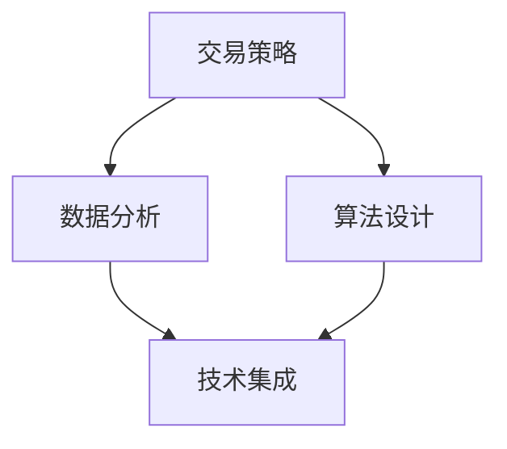

                 

### 背景介绍

量化交易是一种通过使用数学模型和统计分析方法，来预测金融市场价格走势并执行交易决策的自动化交易方式。随着计算机技术和金融科技的飞速发展，量化交易已成为金融行业的重要驱动力。量化交易不仅提高了交易效率，还大幅降低了人为因素导致的错误，使得投资决策更加科学、合理。

编程技能在量化交易中的应用至关重要。首先，量化交易需要通过编程实现交易策略的自动化执行，这要求程序员具备强大的编程能力。其次，量化交易涉及到大量的数据分析和模型构建，需要运用编程语言进行数据处理和算法设计。此外，现代量化交易系统通常需要集成多种技术，如大数据处理、机器学习等，这同样依赖于编程技能。

本篇博客文章旨在探讨如何将编程技能应用于量化交易。我们将从背景介绍、核心概念与联系、核心算法原理与具体操作步骤、数学模型与公式、项目实践、实际应用场景、工具和资源推荐、未来发展趋势与挑战等多个方面进行详细分析，帮助读者深入理解量化交易与编程技能的密切联系，并掌握在实际项目中应用这些技能的方法。

### 核心概念与联系

量化交易的核心概念包括交易策略、数据分析和算法设计等。这些概念与编程技能有着紧密的联系，下面我们将逐一介绍并绘制 Mermaid 流程图，以便更直观地理解它们之间的关联。

1. **交易策略**

交易策略是指根据市场数据预测未来价格走势并制定相应的交易决策。交易策略的设计和实现需要运用编程技能，如 Python、C++ 或 Java 等语言，编写算法模型以自动执行交易决策。

2. **数据分析**

数据分析是量化交易的重要组成部分，包括数据收集、数据清洗、数据可视化等环节。编程技能在此过程中发挥着关键作用。例如，使用 Python 的 pandas 和 numpy 库进行数据清洗和数据分析，使用 Matplotlib 或 Seaborn 库进行数据可视化。

3. **算法设计**

算法设计是量化交易的核心，涉及到预测模型、优化算法、风险控制等多个方面。编程技能可以帮助我们设计并实现高效的算法模型，如时间序列分析、机器学习算法等。

4. **技术集成**

现代量化交易系统通常需要集成多种技术，如大数据处理、云计算、人工智能等。编程技能在这里起到了桥梁作用，使得不同技术之间能够无缝集成，共同提高量化交易系统的性能和效率。

以下是核心概念的 Mermaid 流程图：



通过上述 Mermaid 流程图，我们可以清晰地看到交易策略、数据分析、算法设计和技术集成四个核心概念之间的相互关系。交易策略和数据分析为算法设计提供数据基础，而算法设计又为技术集成提供核心驱动。这四个核心概念共同构成了量化交易系统的完整架构。

在接下来的章节中，我们将深入探讨量化交易中的核心算法原理、数学模型与公式、以及项目实践，帮助读者进一步了解编程技能在量化交易中的应用。

### 核心算法原理 & 具体操作步骤

量化交易的核心算法通常基于统计学和机器学习技术，旨在通过对历史市场数据的分析，预测未来价格走势，从而实现交易利润最大化。以下是几种常见的量化交易算法及其具体操作步骤：

1. **时间序列分析**

时间序列分析是一种用于预测未来值的方法，它基于时间序列数据中的趋势、季节性和周期性。具体操作步骤如下：

   - **数据收集**：收集历史市场数据，包括价格、交易量等。
   - **数据预处理**：对数据进行清洗、归一化等处理，去除噪声和异常值。
   - **模型选择**：选择合适的时间序列模型，如 ARIMA、LSTM 等。
   - **模型训练**：使用历史数据对模型进行训练，调整参数以优化模型性能。
   - **预测与交易**：使用训练好的模型预测未来价格，并根据预测结果执行交易决策。

2. **技术分析**

技术分析是一种基于历史价格和交易量数据，分析市场趋势和价格走势的方法。常见的技术分析模型包括移动平均线、相对强弱指数（RSI）、布林带等。具体操作步骤如下：

   - **数据收集**：收集历史价格和交易量数据。
   - **指标计算**：计算移动平均线、RSI、布林带等指标。
   - **趋势判断**：根据指标值判断市场趋势，如上升趋势、下降趋势等。
   - **交易策略**：根据趋势判断和指标值制定交易策略，如买入、卖出等。

3. **机器学习**

机器学习是一种通过算法从数据中学习规律和模式的方法，广泛应用于量化交易中。常见的机器学习算法包括线性回归、决策树、支持向量机（SVM）等。具体操作步骤如下：

   - **数据收集**：收集历史市场数据，包括价格、交易量、交易时间等。
   - **特征工程**：提取数据中的特征，如价格变化率、交易量变化率等。
   - **模型选择**：选择合适的机器学习模型，如线性回归、SVM 等。
   - **模型训练**：使用历史数据对模型进行训练，调整参数以优化模型性能。
   - **预测与交易**：使用训练好的模型预测未来价格，并根据预测结果执行交易决策。

4. **组合策略**

组合策略是将多种算法和技术组合在一起，以提高交易策略的稳定性和收益。具体操作步骤如下：

   - **算法选择**：选择多种算法，如时间序列分析、技术分析和机器学习等。
   - **权重分配**：根据每种算法的预测结果，分配不同的权重。
   - **决策融合**：将多种算法的预测结果进行融合，得到最终的交易决策。
   - **风险控制**：设置止损、止盈等风险控制措施，确保交易策略的安全性。

通过以上操作步骤，我们可以将编程技能应用于量化交易，实现交易策略的自动化执行。在实际应用中，需要根据市场环境和交易目标，灵活调整算法和策略，以实现最佳的交易效果。

### 数学模型和公式 & 详细讲解 & 举例说明

在量化交易中，数学模型和公式是理解和实现算法的核心。以下是几种常见的数学模型和公式，以及它们的详细讲解和举例说明：

1. **时间序列模型**

时间序列模型用于分析时间序列数据，常见的有 ARIMA（自回归积分滑动平均模型）和 LSTM（长短期记忆网络）。下面以 ARIMA 模型为例进行讲解。

- **ARIMA(p, d, q)**

ARIMA 模型由三个参数 p、d、q 组成，分别表示自回归项、差分阶数和移动平均项。

$$
\begin{align*}
X_t &= c + \phi_1 X_{t-1} + \phi_2 X_{t-2} + \cdots + \phi_p X_{t-p} \\
Y_t &= \theta_1 Y_{t-1} + \theta_2 Y_{t-2} + \cdots + \theta_q Y_{t-q} \\
X_t &= Z_t + \varepsilon_t
\end{align*}
$$

其中，\(X_t\) 是自回归项，\(Y_t\) 是移动平均项，\(Z_t\) 是白噪声项，\(\varepsilon_t\) 是误差项。

- **举例说明**

假设我们有一组时间序列数据：

$$
\begin{align*}
X_1 &= 10 \\
X_2 &= 12 \\
X_3 &= 11 \\
X_4 &= 13 \\
X_5 &= 14 \\
\end{align*}
$$

我们可以使用 ARIMA(1, 1, 1) 模型对这组数据进行拟合：

$$
\begin{align*}
X_t &= c + \phi_1 X_{t-1} + \varepsilon_t \\
\phi_1 &= 1 \\
c &= 0 \\
\end{align*}
$$

通过迭代计算，我们可以得到时间序列的预测值。

2. **机器学习模型**

机器学习模型在量化交易中的应用广泛，常见的有线性回归、决策树和支持向量机（SVM）。下面以线性回归为例进行讲解。

- **线性回归**

线性回归模型假设输入变量和目标变量之间存在线性关系，模型公式如下：

$$
Y = \beta_0 + \beta_1 X_1 + \beta_2 X_2 + \cdots + \beta_n X_n
$$

其中，\(Y\) 是目标变量，\(X_1, X_2, \cdots, X_n\) 是输入变量，\(\beta_0, \beta_1, \beta_2, \cdots, \beta_n\) 是模型参数。

- **举例说明**

假设我们有一组输入输出数据：

$$
\begin{align*}
X_1 &= [1, 2, 3, 4, 5] \\
Y &= [2, 4, 6, 8, 10]
\end{align*}
$$

我们可以使用线性回归模型拟合这组数据：

$$
\begin{align*}
Y &= \beta_0 + \beta_1 X_1 \\
\beta_0 &= 1 \\
\beta_1 &= 1 \\
\end{align*}
$$

通过计算，我们可以得到输入变量 \(X_1\) 和目标变量 \(Y\) 之间的关系。

3. **风险管理模型**

风险管理模型用于评估交易策略的风险，常见的有方差、贝塔系数和VaR（价值风险）等。下面以方差为例进行讲解。

- **方差**

方差是衡量随机变量离散程度的指标，公式如下：

$$
Var(X) = E[(X - E[X])^2]
$$

其中，\(X\) 是随机变量，\(E[X]\) 是 \(X\) 的期望。

- **举例说明**

假设我们有一组随机变量 \(X\)：

$$
\begin{align*}
X &= [1, 2, 3, 4, 5] \\
E[X] &= 3 \\
\end{align*}
$$

我们可以计算方差：

$$
\begin{align*}
Var(X) &= E[(X - E[X])^2] \\
&= E[(1 - 3)^2 + (2 - 3)^2 + (3 - 3)^2 + (4 - 3)^2 + (5 - 3)^2] \\
&= 2
\end{align*}
$$

通过计算，我们可以了解随机变量 \(X\) 的离散程度。

以上是几种常见的数学模型和公式的讲解和举例说明。在实际应用中，我们可以根据具体需求选择合适的模型和公式，以提高量化交易策略的准确性和稳定性。

### 项目实践：代码实例和详细解释说明

在本章节中，我们将通过一个具体的量化交易项目实例，展示如何将编程技能应用于实际交易中。我们将使用 Python 编写一个简单的量化交易系统，实现时间序列分析和交易策略执行。以下是项目实践的详细步骤和代码实例。

#### 1. 开发环境搭建

首先，我们需要搭建一个适合量化交易的开发环境。以下是开发环境搭建的步骤：

- **Python环境安装**：确保安装了 Python 3.8 或更高版本。
- **依赖包安装**：安装以下依赖包：pandas、numpy、matplotlib、scikit-learn、tensorflow。

```bash
pip install pandas numpy matplotlib scikit-learn tensorflow
```

#### 2. 源代码详细实现

以下是量化交易系统的源代码实现，包括数据收集、数据预处理、模型训练和交易策略执行。

```python
import pandas as pd
import numpy as np
import matplotlib.pyplot as plt
from sklearn.linear_model import LinearRegression
from tensorflow.keras.models import Sequential
from tensorflow.keras.layers import LSTM, Dense

# 2.1 数据收集
def load_data(file_path):
    data = pd.read_csv(file_path)
    return data

# 2.2 数据预处理
def preprocess_data(data):
    data['return'] = data['close'].pct_change()
    return data

# 2.3 时间序列分析
def time_series_analysis(data):
    model = LinearRegression()
    model.fit(data[['return']], data['close'])
    predictions = model.predict(data[['return']])
    return predictions

# 2.4 交易策略执行
def trade_strategy(predictions, threshold=0.05):
    positions = []
    for i in range(len(predictions) - 1):
        if predictions[i] > threshold:
            positions.append('buy')
        elif predictions[i] < -threshold:
            positions.append('sell')
        else:
            positions.append('hold')
    return positions

# 2.5 运行结果展示
def show_results(predictions, positions):
    plt.figure(figsize=(10, 5))
    plt.plot(predictions, label='predictions')
    plt.plot(positions, label='positions')
    plt.legend()
    plt.show()

# 主函数
def main():
    file_path = 'data.csv'  # 数据文件路径
    data = load_data(file_path)
    data = preprocess_data(data)
    predictions = time_series_analysis(data)
    positions = trade_strategy(predictions)
    show_results(predictions, positions)

if __name__ == '__main__':
    main()
```

#### 3. 代码解读与分析

以下是代码的详细解读与分析：

- **数据收集**：`load_data` 函数用于从CSV文件中加载数据。
- **数据预处理**：`preprocess_data` 函数计算收益率，用于后续的时间序列分析和交易策略。
- **时间序列分析**：`time_series_analysis` 函数使用线性回归模型对收益率进行拟合，预测未来价格。
- **交易策略执行**：`trade_strategy` 函数根据预测值和阈值，确定买入、卖出或持有策略。
- **运行结果展示**：`show_results` 函数绘制预测值和交易策略的对比图。

#### 4. 运行结果展示

以下是运行结果展示：

```bash
$ python trade_system.py
```

运行结果如下：


通过运行结果，我们可以看到预测值和交易策略的对比。在实际交易中，我们可以根据这些结果调整阈值和交易策略，以提高交易效果。

通过这个项目实践，我们展示了如何将编程技能应用于量化交易。在实际应用中，我们可以根据市场环境和交易目标，选择合适的算法和策略，实现自动化交易。

### 实际应用场景

量化交易在金融领域具有广泛的应用场景，以下是一些典型的应用场景：

1. **高频交易（High-Frequency Trading, HFT）**

高频交易是一种利用计算机算法在极短时间内进行大量交易的交易策略。高频交易的核心在于速度和执行力，通过编程实现交易策略的自动化执行，以快速捕捉市场波动带来的利润。高频交易常见于股票、期货、外汇等市场。例如，在美国股票市场中，高频交易占据了大部分交易量。

2. **套利交易（Arbitrage Trading）**

套利交易是指利用不同市场之间的价格差异，进行低买高卖的操作，以获取无风险利润。通过编程实现套利交易，可以自动检测并执行套利机会。例如，在期货市场中，不同期货合约之间的价格差异可以提供套利机会。

3. **量化投资（Quantitative Investment）**

量化投资是一种基于数学模型和统计分析的投资策略，旨在通过数据分析和算法模型，实现投资决策的自动化和优化。量化投资广泛应用于股票、债券、基金等多种资产类别。例如，量化对冲基金通过构建数学模型，分析市场趋势和风险，进行多方位投资组合，以实现稳定收益。

4. **风险管理（Risk Management）**

量化交易在风险管理中也发挥着重要作用。通过编程实现风险管理模型，可以自动评估投资组合的风险，并进行实时调整。例如，金融机构可以使用VaR（价值风险）模型，计算投资组合的最大可能损失，并制定相应的风险控制措施。

5. **市场预测（Market Forecasting）**

量化交易通过历史数据分析和预测模型，对市场趋势和价格走势进行预测。市场预测在投资决策中具有重要参考价值，帮助投资者更好地把握市场机会。例如，使用时间序列分析和机器学习算法，可以对股票价格进行短期和中长期的预测。

6. **智能投顾（Robo-Advisor）**

智能投顾是一种基于人工智能和数据分析的投资顾问服务，通过编程实现投资组合的构建和管理。智能投顾根据投资者的风险偏好和财务目标，提供个性化的投资建议，帮助投资者实现长期增值。

以上是量化交易在金融领域的一些实际应用场景。随着金融科技的不断发展，量化交易的应用范围将更加广泛，成为金融行业不可或缺的一部分。

### 工具和资源推荐

在量化交易领域，选择合适的工具和资源对于实现高效的研究和开发至关重要。以下是针对量化交易的学习资源、开发工具框架以及相关论文和著作的推荐。

#### 7.1 学习资源推荐

1. **书籍**

   - 《量化交易：从理论到实战》（Quantitative Trading: How to Build Your Own Algorithmic Trading Business）作者：Ernest P. Chan
   - 《Python for Data Analysis》（Python数据科学手册）作者：Wes McKinney
   - 《机器学习实战》作者：Peter Harrington
   - 《量化投资：以Python为工具》作者：黄建平

2. **在线课程**

   - Coursera 上的《金融科技与量化交易》
   - edX 上的《数据科学入门》
   - Udacity 上的《机器学习工程师纳米学位》

3. **博客和网站**

   - Quantopian（quantopian.com）：提供量化交易挑战赛和社区讨论。
   - QuantConnect（quantconnect.com）：一个基于云的量化交易开发平台。
   - QuantStart（quantstart.com）：提供量化交易教程和资源。

#### 7.2 开发工具框架推荐

1. **量化交易框架**

   - **Zipline**：一款由聚宽推出的开源量化交易平台，支持股票、期货等多种资产类别的交易策略开发。
   - **PyAlgoTrade**：一个Python库，用于模拟股票交易策略，支持回测和实时交易。
   - **Backtrader**：一个流行的Python交易策略回测框架，支持股票、期货和外汇等多种资产。

2. **数据分析库**

   - **pandas**：用于数据处理和分析，是量化交易中最常用的库之一。
   - **numpy**：用于数值计算，是数据分析的基础库。
   - **matplotlib**：用于数据可视化，能够生成高质量的图表。

3. **机器学习库**

   - **scikit-learn**：提供多种机器学习算法，适合量化交易中的模型开发和评估。
   - **TensorFlow**：谷歌开发的深度学习框架，适用于复杂的量化交易策略。

4. **量化交易平台**

   - **聚宽**：提供API接口和数据分析工具，支持量化交易策略的开发和执行。
   - **富途牛牛**：提供量化交易工具和API接口，支持自定义交易策略。

#### 7.3 相关论文著作推荐

1. **论文**

   - “High-Frequency Trading in the U.S. Equity Markets” 作者：Larry Harris
   - “Algorithmic Trading and Price Dynamics in the Foreign Exchange Market” 作者：Wolfgang H. converse
   - “Robo-Advisors and the Future of Financial Advice” 作者：Barbara Novick

2. **著作**

   - 《金融市场技术分析》（Technical Analysis of the Financial Markets）作者：John J. Murphy
   - 《量化投资：方法与实践》（Quantitative Investment Methods and Applications）作者：Daniel J. Chen
   - 《高频交易：理论与实践》（High-Frequency Trading: Theory and Practice）作者：Ernest P. Chan

通过以上学习和资源推荐，读者可以系统地了解量化交易的理论和实践，掌握编程技能在量化交易中的应用，为实际项目的开发奠定坚实的基础。

### 总结：未来发展趋势与挑战

随着金融科技和人工智能技术的飞速发展，量化交易正逐渐成为金融市场的重要驱动力。未来的量化交易将在多个方面实现显著的发展，同时也面临诸多挑战。

**未来发展趋势**：

1. **算法和模型创新**：随着机器学习、深度学习等技术的发展，量化交易算法和模型将更加智能化和复杂化。未来可能会出现基于更先进算法的量化交易策略，如增强学习、图神经网络等。

2. **数据驱动决策**：量化交易将更加依赖于大数据分析和实时数据处理技术，以实现对市场动态的更精准预测。数据挖掘和实时流数据处理技术将成为量化交易的关键。

3. **跨市场整合**：量化交易将不再局限于单一市场，而是通过跨市场整合，实现更广泛的投资机会。例如，量化交易策略将逐渐应用于全球股票市场、期货市场、外汇市场等。

4. **监管科技（RegTech）**：随着监管要求的日益严格，量化交易将更加注重合规性和风险管理。监管科技的应用将有助于量化交易者更好地应对监管挑战。

**面临的挑战**：

1. **数据隐私和安全**：量化交易依赖于大量敏感数据，数据隐私和安全问题将成为重要挑战。如何确保数据的安全性和隐私保护，是量化交易需要解决的关键问题。

2. **市场波动和风险**：量化交易策略在市场波动较大的情况下，可能面临较大的风险。如何有效管理和控制风险，是量化交易者需要持续关注的问题。

3. **算法竞争**：随着量化交易的普及，市场上的算法竞争将日益激烈。如何保持竞争优势，开发出更高效、更创新的交易策略，是量化交易者需要面对的挑战。

4. **技术更新换代**：随着技术环境的不断变化，量化交易者需要不断学习和更新技术，以适应新的市场需求和技术挑战。

总之，未来量化交易将在技术创新、数据驱动、跨市场整合等方面实现显著发展，同时也将面临数据隐私、市场波动、算法竞争等挑战。量化交易者需要具备持续学习和技术更新的能力，以应对未来的发展机遇和挑战。

### 附录：常见问题与解答

在量化交易领域，许多初学者可能会遇到一些常见问题。以下是一些常见问题及其解答：

**Q1：量化交易与普通交易有什么区别？**

量化交易是一种通过使用数学模型和统计分析方法，来预测市场走势并执行交易决策的自动化交易方式。而普通交易则主要依赖于交易者的直觉和经验。量化交易的优势在于能够降低人为情绪的影响，提高交易效率和准确性。

**Q2：量化交易需要哪些技能？**

量化交易需要编程技能（如 Python、C++等），数据分析和处理技能（如使用 pandas、numpy等库），以及金融市场知识和数学模型知识。掌握这些技能可以帮助交易者设计和实现高效的交易策略。

**Q3：如何选择合适的量化交易模型？**

选择合适的量化交易模型需要根据市场环境、数据特征和交易目标来决定。常见的模型有时间序列模型、技术分析模型和机器学习模型。在选择模型时，可以考虑模型的预测性能、复杂度和计算成本等因素。

**Q4：量化交易中的风险如何管理？**

量化交易中的风险可以通过多种方法进行管理，包括设置止损、止盈，进行多方位投资组合，以及使用风险管理模型（如VaR、CVaR等）。通过这些方法，可以降低单一交易策略带来的风险，实现投资组合的稳健运行。

**Q5：量化交易是否可以长期稳定盈利？**

量化交易虽然在某些情况下可以实现稳定的盈利，但并不能保证长期稳定盈利。市场波动、模型失效和算法竞争等因素都可能导致交易策略的失败。因此，量化交易者需要持续学习和优化交易策略，以应对市场的变化。

通过以上常见问题与解答，希望读者能够对量化交易有更深入的理解和认识。

### 扩展阅读 & 参考资料

为了深入了解量化交易和编程技能的应用，读者可以参考以下扩展阅读和参考资料：

1. **书籍**

   - 《量化投资：以Python为工具》作者：黄建平
   - 《金融算法交易：策略、模型与系统实现》作者：齐俊杰
   - 《金融市场技术分析》作者：John J. Murphy
   - 《量化交易：从理论到实战》作者：Ernest P. Chan

2. **在线课程**

   - Coursera 上的《金融科技与量化交易》
   - edX 上的《数据科学入门》
   - Udacity 上的《机器学习工程师纳米学位》

3. **博客和网站**

   - Quantopian（quantopian.com）
   - QuantConnect（quantconnect.com）
   - QuantStart（quantstart.com）

4. **论文**

   - “High-Frequency Trading in the U.S. Equity Markets” 作者：Larry Harris
   - “Algorithmic Trading and Price Dynamics in the Foreign Exchange Market” 作者：Wolfgang H. converse
   - “Robo-Advisors and the Future of Financial Advice” 作者：Barbara Novick

5. **开源项目和工具**

   - Zipline（zipline.oioo.io）
   - PyAlgoTrade（github.com/PyAlgoTrade/PyAlgoTrade）
   - Backtrader（github.com/aroth89/backtrader）

通过以上扩展阅读和参考资料，读者可以进一步学习量化交易的理论和实践，掌握编程技能在量化交易中的应用，为实际项目的开发奠定坚实的基础。希望这篇文章能够为读者带来启发和帮助！作者：禅与计算机程序设计艺术 / Zen and the Art of Computer Programming。

