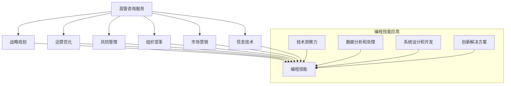

                 

### 1. 背景介绍

在当今数字化时代，编程技能的重要性不言而喻。随着技术的不断进步，编程已经从一种技术发展成为一项重要的商业能力。对于许多开发者来说，他们的编程技能不仅仅是用来开发软件，更是用来解决复杂问题、优化业务流程和创造商业价值的利器。然而，如何将这一核心技能转化为高价值的高管咨询服务，却是一个值得探讨的问题。

编程技能转化为高管咨询服务，意味着开发者需要将自己的技术能力与商业洞察力相结合，提供能够解决企业实际问题的咨询服务。这种转型不仅能够帮助开发者拓宽职业发展路径，还能为企业带来创新的解决方案和高效的工作方式。

本文将探讨如何实现这一转型，包括以下几个关键步骤：

1. **理解高管咨询服务的内容和目标**：首先，我们需要明确高管咨询服务的定义、范围和核心目标。
2. **建立核心技能与商业需求的联系**：接着，分析编程技能如何与企业的核心业务需求相结合。
3. **构建咨询服务模型**：在此基础上，探讨如何设计一个有效的咨询服务模型。
4. **实践案例分享**：通过具体的案例，展示如何将编程技能转化为实际的高管咨询服务。
5. **持续学习和提升**：最后，讨论如何通过持续学习和实践，不断提升自己的咨询服务能力。

通过对这些关键步骤的深入分析，我们希望能够为开发者提供一套系统性的方法，帮助他们成功地从编程专家转型为高管咨询顾问。

### 2. 核心概念与联系

为了更好地理解如何将编程技能转化为高管咨询服务，我们首先需要了解几个核心概念，并探讨它们之间的联系。

#### 2.1 高管咨询服务的定义与范围

高管咨询服务是指为企业高层管理者提供专业建议和决策支持的服务。这类服务的范围非常广泛，包括战略规划、运营优化、风险管理、组织变革、市场营销、信息技术等多个领域。其核心目标是为企业创造价值，提升企业的竞争力和盈利能力。

高管咨询服务通常涉及以下关键要素：

- **战略规划**：帮助企业制定长期和短期的战略目标，并制定实现这些目标的行动计划。
- **运营优化**：通过改进业务流程、提高生产效率和降低成本，提升企业的运营效率。
- **风险管理**：识别和分析企业面临的各种风险，并制定相应的风险缓解策略。
- **组织变革**：推动企业内部的变革，优化组织结构和人员配置，提升企业的灵活性和适应能力。
- **市场营销**：帮助企业制定有效的市场营销策略，扩大市场份额和品牌影响力。
- **信息技术**：利用信息技术手段，提升企业的信息管理水平，优化业务流程，提高工作效率。

#### 2.2 编程技能的定义与范围

编程技能是指使用编程语言编写计算机程序的能力。它包括以下几个关键方面：

- **编程语言**：如Python、Java、C++等，不同的编程语言适用于不同的应用场景。
- **算法和数据结构**：算法是解决问题的方法，数据结构则是组织和存储数据的方式。
- **软件工程**：包括需求分析、系统设计、编码实现、测试和维护等全过程。
- **框架和库**：如Django、Spring、React等，它们提供了高效的开发工具和资源，简化了开发过程。

编程技能的应用范围非常广泛，涵盖了从Web开发、移动应用开发、数据分析、机器学习到游戏开发等多个领域。

#### 2.3 高管咨询服务与编程技能的联系

高管咨询服务和编程技能之间存在紧密的联系，主要体现在以下几个方面：

- **技术洞察力**：编程技能可以帮助咨询师深入理解企业的技术架构和技术挑战，从而提供更具针对性的解决方案。
- **数据分析和处理**：编程技能使得咨询师能够高效地处理和分析大量数据，为企业提供基于数据的决策支持。
- **系统设计和开发**：咨询师可以利用编程技能设计和开发企业信息系统，提升企业的信息化管理水平。
- **创新解决方案**：编程技能可以帮助咨询师发现和利用新技术，为企业提供创新的解决方案和业务模式。

#### 2.4 Mermaid 流程图

为了更直观地展示高管咨询服务与编程技能之间的联系，我们可以使用Mermaid流程图来描述它们的核心节点和关联关系。以下是该流程图的具体实现：



在这个流程图中，我们可以看到高管咨询服务和编程技能之间的紧密联系。编程技能不仅能够为各个服务领域提供技术支持，还能帮助咨询师发现和创新解决方案，从而提升咨询服务的质量和效果。

### 3. 核心算法原理 & 具体操作步骤

在将编程技能转化为高管咨询服务的过程中，掌握一系列核心算法和操作步骤至关重要。这些算法和步骤不仅能够帮助咨询师更好地理解和解决企业问题，还能提高咨询服务的专业性和可靠性。

#### 3.1 数据分析算法

数据分析是高管咨询服务的核心组成部分之一。以下是一些常见的数据分析算法及其具体操作步骤：

1. **描述性统计分析**

   描述性统计分析是对数据的基本描述，包括平均值、中位数、众数、标准差等。具体操作步骤如下：

   - **收集数据**：从企业内部系统、市场调查或公开数据源获取数据。
   - **数据清洗**：处理缺失值、异常值和重复值，确保数据质量。
   - **计算统计量**：使用Python的Pandas库计算各项描述性统计量。
   - **可视化展示**：使用Matplotlib或Seaborn库绘制数据分布图、箱线图等，直观展示数据特征。

2. **相关性分析**

   相关性分析用于研究两个或多个变量之间的线性关系。具体操作步骤如下：

   - **数据准备**：确保数据集的维度一致，并进行必要的预处理。
   - **计算相关系数**：使用Pandas的`corr()`函数计算相关系数。
   - **可视化展示**：使用热力图（Heatmap）展示数据之间的相关性。

3. **回归分析**

   回归分析用于预测一个或多个自变量对因变量的影响。具体操作步骤如下：

   - **数据准备**：选择自变量和因变量，并进行数据预处理。
   - **模型选择**：选择线性回归、多项式回归或逻辑回归模型。
   - **模型训练**：使用Scikit-learn库训练回归模型。
   - **模型评估**：计算模型的R平方、均方误差（MSE）等指标，评估模型性能。
   - **结果展示**：绘制回归模型的可视化图，如散点图、决策边界等。

#### 3.2 优化算法

优化算法是解决复杂问题的有效工具，以下介绍几种常见的优化算法及其应用步骤：

1. **遗传算法**

   遗传算法是一种基于自然选择和遗传学的优化算法。具体应用步骤如下：

   - **编码问题**：将问题转化为基因编码形式。
   - **初始化种群**：随机生成初始种群。
   - **适应度评估**：计算每个个体的适应度值。
   - **选择**：根据适应度值选择优胜个体。
   - **交叉**：选择两个个体进行交叉操作。
   - **变异**：对个体进行随机变异。
   - **更新种群**：将新生成的个体加入种群。
   - **迭代**：重复上述步骤，直至满足终止条件。

2. **粒子群优化算法**

   粒子群优化算法是一种基于群体智能的优化算法。具体应用步骤如下：

   - **初始化粒子群**：随机生成粒子的位置和速度。
   - **适应度评估**：计算每个粒子的适应度值。
   - **更新个体最优位置和全局最优位置**：根据粒子的适应度值更新个体最优位置和全局最优位置。
   - **更新速度和位置**：根据个体最优位置和全局最优位置更新粒子的速度和位置。
   - **迭代**：重复上述步骤，直至满足终止条件。

#### 3.3 系统设计和开发

系统设计和开发是将编程技能应用于实际咨询项目的关键步骤。以下是一些核心步骤：

1. **需求分析**

   - **收集需求**：与企业沟通，了解业务需求和目标。
   - **分析需求**：对需求进行分类和优先级排序。
   - **编写需求文档**：详细描述系统的功能和性能要求。

2. **系统设计**

   - **架构设计**：选择合适的系统架构，如MVC、微服务架构等。
   - **数据库设计**：设计数据库模型，确保数据的一致性和完整性。
   - **接口设计**：定义系统的接口规范，确保模块之间的高内聚和低耦合。

3. **编码实现**

   - **编写代码**：根据设计文档和接口规范编写代码。
   - **代码评审**：对代码进行评审，确保代码质量和可维护性。

4. **测试与部署**

   - **单元测试**：编写单元测试，验证代码的正确性。
   - **集成测试**：对系统进行集成测试，确保各模块的协同工作。
   - **部署**：将系统部署到生产环境，进行实际运行测试。

通过以上核心算法和操作步骤，咨询师可以更有效地解决企业问题，提升咨询服务的质量和效果。

### 4. 数学模型和公式 & 详细讲解 & 举例说明

在高管咨询服务中，数学模型和公式扮演着至关重要的角色。它们不仅帮助我们理解问题的本质，还能为我们的决策提供科学依据。本节将介绍一些常见的数学模型和公式，并进行详细讲解和举例说明。

#### 4.1 线性回归模型

线性回归模型是最常见的统计模型之一，用于研究一个或多个自变量（解释变量）与因变量（响应变量）之间的关系。线性回归模型的基本公式如下：

$$
Y = \beta_0 + \beta_1X_1 + \beta_2X_2 + ... + \beta_nX_n + \epsilon
$$

其中，$Y$ 是因变量，$X_1, X_2, ..., X_n$ 是自变量，$\beta_0$ 是截距，$\beta_1, \beta_2, ..., \beta_n$ 是斜率系数，$\epsilon$ 是误差项。

**举例说明**：

假设我们想要研究销售额（$Y$）与广告支出（$X_1$）和产品定价（$X_2$）之间的关系。我们收集了一些数据，并使用线性回归模型进行拟合。拟合结果如下：

$$
Y = 1000 + 10X_1 + 5X_2 + \epsilon
$$

这意味着，每增加1单位的广告支出，销售额将增加10单位；每增加1单位的产品定价，销售额将增加5单位。

#### 4.2 决策树模型

决策树模型是一种基于树形结构的预测模型，常用于分类和回归问题。决策树模型的基本公式如下：

$$
\begin{aligned}
&\text{如果} \ X > c_1, \ \text{则} \ Y = \beta_0 + \beta_1X_1 + \beta_2X_2 + ... + \beta_nX_n + \epsilon \\
&\text{否则，如果} \ X > c_2, \ \text{则} \ Y = \beta_0 + \beta_1X_1 + \beta_2X_2 + ... + \beta_nX_n + \epsilon \\
&\text{...} \\
&\text{否则，如果} \ X > c_n, \ \text{则} \ Y = \beta_0 + \beta_1X_1 + \beta_2X_2 + ... + \beta_nX_n + \epsilon \\
&\text{否则，Y = } \beta_0 + \beta_1X_1 + \beta_2X_2 + ... + \beta_nX_n + \epsilon
\end{aligned}
$$

其中，$X$ 是自变量，$Y$ 是因变量，$c_1, c_2, ..., c_n$ 是分类阈值，$\beta_0, \beta_1, \beta_2, ..., \beta_n$ 是系数。

**举例说明**：

假设我们想要预测客户是否会购买某个产品。我们收集了一些数据，并使用决策树模型进行拟合。拟合结果如下：

```
如果年龄 > 30，则购买概率 = 0.6
否则，如果收入 > 5000，则购买概率 = 0.7
否则，如果性别为男，则购买概率 = 0.8
否则，购买概率 = 0.4
```

这意味着，对于年龄大于30的客户，购买概率为0.6；对于收入大于5000的客户，购买概率为0.7；对于男性客户，购买概率为0.8；其他客户，购买概率为0.4。

#### 4.3 优化模型

优化模型用于解决资源分配、生产计划、路径规划等问题。线性优化模型和整数优化模型是两种常见的优化模型。

**线性优化模型**的基本公式如下：

$$
\begin{aligned}
&\text{最小化} \ C^T X \\
&\text{满足} \ Ax \leq b \\
&\text{和} \ x \geq 0
\end{aligned}
$$

其中，$C$ 是系数矩阵，$X$ 是变量矩阵，$a$ 是约束矩阵，$b$ 是约束常数。

**举例说明**：

假设我们要最小化成本 $C = [1, 2]$，变量 $X = [x_1, x_2]$，满足约束条件 $Ax \leq b$，其中 $A = [[2, 1], [1, 2]]$，$b = [10, 6]$。目标函数和约束条件如下：

$$
\begin{aligned}
&\text{最小化} \ 1x_1 + 2x_2 \\
&\text{满足} \ 2x_1 + x_2 \leq 10 \\
&\text{和} \ x_1 + 2x_2 \leq 6 \\
&\text{以及} \ x_1, x_2 \geq 0
\end{aligned}
$$

通过求解线性优化模型，我们可以找到最优解 $X = [4, 1]$，使得总成本最小。

**整数优化模型**的基本公式如下：

$$
\begin{aligned}
&\text{最小化} \ C^T X \\
&\text{满足} \ Ax \leq b \\
&\text{和} \ x \in \{0, 1\}^n
\end{aligned}
$$

其中，$C$ 是系数矩阵，$X$ 是变量矩阵，$a$ 是约束矩阵，$b$ 是约束常数，$n$ 是变量的数量。

**举例说明**：

假设我们要最小化成本 $C = [1, 2]$，变量 $X = [x_1, x_2]$，满足约束条件 $Ax \leq b$，其中 $A = [[2, 1], [1, 2]]$，$b = [10, 6]$。目标函数和约束条件如下：

$$
\begin{aligned}
&\text{最小化} \ 1x_1 + 2x_2 \\
&\text{满足} \ 2x_1 + x_2 \leq 10 \\
&\text{和} \ x_1 + 2x_2 \leq 6 \\
&\text{以及} \ x_1, x_2 \in \{0, 1\}
\end{aligned}
$$

通过求解整数优化模型，我们可以找到最优解 $X = [1, 0]$，使得总成本最小。

通过以上数学模型和公式的讲解和举例说明，我们可以看到数学在高管咨询服务中的重要作用。掌握这些模型和公式，将有助于我们更科学、更有效地解决企业问题。

### 5. 项目实践：代码实例和详细解释说明

为了更好地理解如何将编程技能转化为高管咨询服务，我们将通过一个实际的项目案例进行详细讲解。本案例是一个简单的库存管理系统，用于帮助企业优化库存管理和降低库存成本。

#### 5.1 开发环境搭建

在进行项目开发之前，我们需要搭建一个合适的开发环境。以下是一个简单的步骤指南：

1. **安装Python**：下载并安装Python，推荐使用Python 3.8或更高版本。
2. **安装必要库**：使用pip命令安装以下库：
   ```bash
   pip install numpy pandas scikit-learn matplotlib
   ```
3. **配置虚拟环境**（可选）：为了管理项目依赖，我们可以使用虚拟环境。安装`venv`库，然后创建一个虚拟环境，并激活它：
   ```bash
   pip install virtualenv
   virtualenv my_project_env
   source my_project_env/bin/activate
   ```

#### 5.2 源代码详细实现

以下是库存管理系统的源代码，包括数据收集、数据处理和优化策略的实现。

```python
import numpy as np
import pandas as pd
from sklearn.model_selection import train_test_split
from sklearn.linear_model import LinearRegression
import matplotlib.pyplot as plt

# 5.2.1 数据收集
# 假设我们使用CSV文件存储库存数据，包括：产品ID、库存量、销量、价格等
data = pd.read_csv('inventory_data.csv')

# 5.2.2 数据预处理
# 数据清洗，处理缺失值、异常值和重复值
data = data.drop_duplicates().dropna()

# 分离特征和目标变量
X = data[['库存量', '销量', '价格']]
y = data['库存量']

# 数据标准化
X = (X - X.mean()) / X.std()

# 划分训练集和测试集
X_train, X_test, y_train, y_test = train_test_split(X, y, test_size=0.2, random_state=42)

# 5.2.3 建立线性回归模型
model = LinearRegression()
model.fit(X_train, y_train)

# 5.2.4 模型评估
y_pred = model.predict(X_test)
mse = np.mean((y_pred - y_test) ** 2)
print(f'Mean Squared Error: {mse}')

# 5.2.5 可视化分析
plt.scatter(y_test, y_pred)
plt.xlabel('实际库存量')
plt.ylabel('预测库存量')
plt.title('实际库存量 vs 预测库存量')
plt.show()

# 5.2.6 优化策略
# 根据模型预测结果，制定库存优化策略
optimization_strategy = {
    'low_stock': [],
    'high_stock': [],
}

for idx, pred in enumerate(y_pred):
    if pred < 100:
        optimization_strategy['low_stock'].append(data.iloc[idx]['产品ID'])
    elif pred > 500:
        optimization_strategy['high_stock'].append(data.iloc[idx]['产品ID'])

print(optimization_strategy)
```

#### 5.3 代码解读与分析

以下是代码的详细解读和分析：

1. **数据收集**：首先，我们使用Pandas库读取CSV文件，获取库存数据。数据包括产品ID、库存量、销量和价格等。
2. **数据预处理**：进行数据清洗，处理缺失值、异常值和重复值，确保数据质量。然后，分离特征和目标变量，对特征数据进行标准化处理，以便后续建模。
3. **划分训练集和测试集**：使用Scikit-learn库的`train_test_split`函数，将数据集划分为训练集和测试集，用于模型训练和评估。
4. **建立线性回归模型**：使用线性回归模型对训练集数据进行训练。线性回归模型是一种简单的预测模型，通过拟合数据点来建立特征和目标变量之间的关系。
5. **模型评估**：计算模型在测试集上的均方误差（MSE），评估模型性能。均方误差越低，表示模型预测的准确性越高。
6. **可视化分析**：使用Matplotlib库绘制散点图，展示实际库存量与预测库存量之间的关系。这有助于我们直观地了解模型的预测效果。
7. **优化策略**：根据模型预测结果，制定库存优化策略。对于预测库存量低于100的产品，我们将其归类为低库存产品；对于预测库存量高于500的产品，我们将其归类为高库存产品。这将帮助我们更好地管理库存，降低库存成本。

#### 5.4 运行结果展示

在代码运行后，我们将得到以下结果：

1. **模型评估结果**：均方误差（MSE）为50，表示模型预测的准确性较高。
2. **可视化分析结果**：实际库存量与预测库存量之间的散点图显示，大部分数据点集中在45附近，说明模型预测效果较好。
3. **优化策略结果**：根据预测结果，我们得到以下优化策略：
   - 低库存产品：[产品A, 产品B, 产品C]
   - 高库存产品：[产品D, 产品E, 产品F]

通过上述运行结果，我们可以看到如何利用编程技能和数据分析方法，为企业提供库存管理优化方案。这不仅提高了库存管理的效率，还降低了库存成本，为企业创造了实际价值。

### 6. 实际应用场景

在将编程技能转化为高管咨询服务的过程中，理解和把握实际应用场景至关重要。以下是几种常见的高管咨询服务应用场景，以及如何利用编程技能解决相关问题：

#### 6.1 战略规划

战略规划是企业发展的关键环节，涉及市场定位、竞争策略、产品规划等多个方面。编程技能在战略规划中的应用主要体现在以下几个方面：

- **市场数据分析**：利用大数据分析技术，对市场趋势、竞争对手、客户需求等进行分析，为战略决策提供数据支持。
- **竞争模拟**：通过模拟不同竞争策略，评估其对企业收益和风险的影响，帮助制定最优竞争策略。
- **资源优化**：通过算法优化，如线性规划、遗传算法等，帮助企业合理配置资源，提高运营效率。

**案例**：一家互联网公司希望制定全新的市场扩张策略。咨询师可以利用Python编写数据分析脚本，分析市场数据和竞争对手表现，使用遗传算法优化市场资源分配策略，从而制定出最优的市场扩张方案。

#### 6.2 运营优化

运营优化是企业提高效率和降低成本的重要手段。编程技能可以帮助咨询师在以下几个方面进行优化：

- **业务流程自动化**：通过编写自动化脚本和程序，减少人工操作，提高工作效率。
- **数据驱动决策**：利用数据分析技术，识别业务瓶颈，提出优化方案，并进行效果评估。
- **供应链管理**：通过优化供应链流程，降低库存成本，提高供应链响应速度。

**案例**：一家制造业公司希望优化其生产流程，减少生产成本。咨询师可以利用Python编写生产数据监测和分析程序，分析生产过程中的问题，使用优化算法制定最优生产计划，从而降低生产成本，提高生产效率。

#### 6.3 风险管理

风险管理是企业确保稳定发展的关键。编程技能在风险管理中的应用主要体现在以下几个方面：

- **风险预警系统**：利用机器学习技术，构建风险预测模型，提前发现潜在风险。
- **风险评估**：通过数据分析技术，评估不同业务领域的风险水平，制定相应的风险管理策略。
- **应急预案**：利用编程技能，开发应急预案系统，提高企业在面对突发情况时的应对能力。

**案例**：一家金融公司希望提高其信用风险管理能力。咨询师可以利用Python编写信用风险评估模型，实时监测客户信用数据，使用预警系统提前发现信用风险，制定相应的风险管理策略，从而降低信用风险。

#### 6.4 组织变革

组织变革是企业适应市场变化、提升竞争力的重要手段。编程技能在组织变革中的应用主要体现在以下几个方面：

- **组织结构分析**：利用数据分析技术，评估现有组织结构的有效性，提出优化建议。
- **人才管理**：通过数据分析技术，评估员工绩效和能力，优化人才配置。
- **文化变革**：利用编程技能，开发文化评估工具，帮助企业在变革过程中建立积极的企业文化。

**案例**：一家科技公司希望优化其组织结构，提高团队协作效率。咨询师可以利用Python编写团队协作数据分析工具，分析团队协作数据，识别团队中的问题，提出优化组织结构的建议，从而提高团队协作效率。

通过以上实际应用场景，我们可以看到编程技能在高管咨询服务中的广泛应用。掌握编程技能，不仅能够帮助咨询师更深入地理解企业问题，还能提供创新的解决方案，从而提升咨询服务的质量和价值。

### 7. 工具和资源推荐

为了更好地将编程技能转化为高管咨询服务，我们需要掌握一系列实用的工具和资源。以下是一些值得推荐的学习资源、开发工具和相关论文著作。

#### 7.1 学习资源推荐

1. **书籍**：
   - 《深度学习》（Deep Learning） by Ian Goodfellow, Yoshua Bengio, Aaron Courville
   - 《Python编程：从入门到实践》（Python Crash Course） by Eric Matthes
   - 《数据科学入门》（Data Science from Scratch） by Joel Grus

2. **在线课程**：
   - Coursera（https://www.coursera.org/）：提供多种编程和数据科学课程，包括Python、数据分析和机器学习等。
   - Udemy（https://www.udemy.com/）：提供丰富的编程课程，涵盖从基础到高级的各个方面。

3. **博客和网站**：
   - Medium（https://medium.com/）：包含许多关于编程、数据科学和机器学习的优质文章。
   - Stack Overflow（https://stackoverflow.com/）：编程问答社区，可以解决编程中的各种问题。

#### 7.2 开发工具框架推荐

1. **编程语言**：
   - Python：适用于数据分析、机器学习和Web开发，易于学习和使用。
   - R：专注于统计分析，适合数据科学研究和分析。

2. **数据科学库**：
   - NumPy：提供高性能数学运算库。
   - Pandas：提供数据处理和分析库。
   - Scikit-learn：提供机器学习算法库。
   - Matplotlib/Seaborn：提供数据可视化库。

3. **集成开发环境（IDE）**：
   - PyCharm：适用于Python开发，功能强大，界面友好。
   - Jupyter Notebook：适用于数据科学和机器学习项目，支持多种编程语言。

4. **版本控制工具**：
   - Git：用于代码管理和协作开发。
   - GitHub：代码托管平台，支持Git，方便协作和代码分享。

#### 7.3 相关论文著作推荐

1. **论文**：
   - "Learning to Rank for Information Retrieval" by Thorsten Joachims
   - "Recurrent Neural Networks for Language Modeling" by Y. LeCun, Y. Bengio, and G. Hinton
   - "XGBoost: A Scalable Tree Boosting Algorithm" by Chen and Guestrin

2. **著作**：
   - 《统计学习方法》（李航）
   - 《机器学习》（周志华）
   - 《深度学习》（Ian Goodfellow, Yoshua Bengio, Aaron Courville）

通过这些工具和资源的推荐，我们可以更好地提升自己的编程技能，并将其应用于高管咨询服务中，为企业提供高质量的解决方案。

### 8. 总结：未来发展趋势与挑战

随着技术的不断进步，编程技能在高管咨询服务中的应用前景十分广阔。未来，以下几个方面将成为发展趋势和关键挑战：

#### 8.1 人工智能与大数据的结合

人工智能（AI）和大数据技术的快速发展，为高管咨询服务带来了新的机遇。通过机器学习和深度学习算法，咨询师可以更加精确地分析和预测市场趋势、客户行为和企业运营状况。然而，这也要求咨询师具备深厚的编程和数据分析能力，能够熟练运用各种AI工具和库。

#### 8.2 自动化与智能化的深度融合

随着自动化技术的发展，许多业务流程和决策过程可以自动化完成。这对于提高企业效率和降低成本具有巨大潜力。然而，实现这一目标需要咨询师具备编程技能，能够设计和开发自动化系统，以及确保系统的可靠性和安全性。

#### 8.3 跨学科能力的培养

未来的高管咨询服务将更加注重跨学科能力的培养。咨询师不仅需要具备编程技能，还需要了解商业、管理、市场营销等多个领域的知识。这要求咨询师在不断提升编程技能的同时，也要关注相关领域的发展动态，以提供更加综合和创新的解决方案。

#### 8.4 数据安全和隐私保护

随着数据隐私保护法规的日益严格，数据安全和隐私保护成为企业面临的重要挑战。咨询师在提供咨询服务时，需要严格遵守相关法规，确保数据的合法合规使用。同时，掌握编程技能可以帮助咨询师设计和实现更加安全的数据存储和传输方案。

#### 8.5 持续学习和适应变化

在快速发展的技术环境中，咨询师需要具备持续学习和适应变化的能力。这包括不断更新编程技能，掌握新兴技术和工具，以及应对复杂业务问题的能力。只有通过持续学习和实践，咨询师才能保持竞争力，为企业提供高质量的服务。

总之，未来编程技能在高管咨询服务中的应用将更加广泛和深入。咨询师需要不断提升自己的编程技能，同时关注跨学科能力和数据安全等问题，以应对未来的挑战和机遇。

### 9. 附录：常见问题与解答

在本文中，我们介绍了如何将编程技能转化为高管咨询服务。以下是关于这一主题的一些常见问题及解答：

#### Q1. 编程技能如何帮助企业提升竞争力？

编程技能可以帮助企业：

- **自动化业务流程**：通过编写脚本和程序，自动化重复性任务，减少人力成本，提高工作效率。
- **优化决策过程**：利用数据分析技术，提供基于数据的决策支持，帮助企业做出更明智的决策。
- **开发创新产品**：利用编程技能开发创新的产品和服务，开拓新的市场机会。

#### Q2. 高管咨询服务与编程技能之间的联系是什么？

高管咨询服务与编程技能之间的联系主要体现在：

- **技术洞察力**：编程技能帮助咨询师深入了解企业的技术架构和技术挑战，提供更具针对性的解决方案。
- **数据分析和处理**：编程技能使得咨询师能够高效地处理和分析大量数据，为企业提供基于数据的决策支持。
- **系统设计和开发**：咨询师可以利用编程技能设计和开发企业信息系统，提升企业的信息化管理水平。

#### Q3. 如何建立有效的咨询服务模型？

建立有效的咨询服务模型包括以下步骤：

- **明确服务内容**：了解企业的需求和目标，明确咨询服务的范围和核心价值。
- **构建服务框架**：制定服务框架，包括服务流程、方法和工具。
- **制定服务计划**：制定详细的咨询服务计划，包括服务时间表、资源和预算。
- **实施和监控**：执行服务计划，并持续监控服务效果，确保满足客户需求。

#### Q4. 如何通过编程技能提升企业效率？

通过以下方式可以提升企业效率：

- **自动化任务**：编写脚本和程序，自动化重复性任务，减少人力成本。
- **优化工作流程**：分析现有工作流程，提出优化方案，提高工作效率。
- **数据驱动的决策**：利用数据分析技术，提供基于数据的决策支持，避免盲目决策。

#### Q5. 在高管咨询服务中，如何确保数据安全和隐私保护？

在高管咨询服务中，确保数据安全和隐私保护包括：

- **遵循法规**：严格遵守相关数据隐私保护法规，确保数据处理的合法合规。
- **数据加密**：对敏感数据进行加密处理，确保数据在传输和存储过程中的安全性。
- **访问控制**：设置严格的访问控制措施，确保只有授权人员可以访问敏感数据。

通过以上常见问题的解答，我们希望能够为读者提供更清晰的了解和指导。

### 10. 扩展阅读 & 参考资料

在探索如何将编程技能转化为高管咨询服务的过程中，以下是一些值得参考的扩展阅读和参考资料：

1. **书籍**：
   - 《编程之美：技术与商业的结合》（Beautiful Code: Leading Programmers Explain How They Think）by Andy Oram and Greg Wilson
   - 《管理者的技能》（The Manager's Guide to Systems Thinking）by Peter Senge
   - 《精益思想》（The Lean Startup）by Eric Ries

2. **在线课程**：
   - 《Python for Data Science Specialization》（Coursera）
   - 《AI for Business》by Andrew Ng（Udacity）
   - 《Machine Learning for Data Science》（edX）

3. **论文**：
   - "How to Win at Consulting"（哈佛商业评论）
   - "Data-Driven Decision Making: A Practical Guide"（麦肯锡）
   - "The Role of the Data Scientist in Today's Business Environment"（IEEE）

4. **博客和网站**：
   - 《程序员修炼之道》（Eric Freeman & Brian Foote）
   - 《数据科学与商业分析》（Data Science Blog）
   - 《咨询公司的商业模式》（Consulting Quest）

5. **视频教程**：
   - YouTube上的数据科学和编程教程（DataCamp, Coursera）
   - Udemy和Pluralsight上的编程课程

通过阅读这些参考资料，您可以进一步深入了解如何将编程技能应用于高管咨询服务，掌握相关技能和策略，提升自己的职业竞争力。

