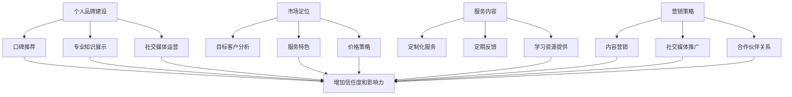

                 

### 背景介绍

编程不仅是计算机科学的基础，更是一个全球性的技能需求。随着信息技术的迅猛发展，编程技能在职场中的重要性日益凸显。越来越多的编程专业人士希望通过分享自己的经验，为新手和进阶者提供指导，从而实现个人价值的提升。在这个过程中，付费mentoring服务成为了一种新兴的职业模式，为广大编程爱好者提供了高质量的学习资源。

**付费mentoring服务的定义**：

付费mentoring服务是指专业人士通过在线或线下方式，向有需求的学习者提供个性化的技术指导、问题解答、项目辅导等，以实现知识传授和价值互换的一种服务形式。这种服务不仅能够帮助学习者更快地提升技能，还能让专业人士通过分享知识获取额外的收入。

**编程经验转化为付费mentoring服务的可行性**：

编程经验的丰富性是付费mentoring服务成功的关键。拥有多年编程经验的专业人士，不仅熟悉各种编程语言和工具，还对软件开发流程有深入的理解。这种经验通过适当的方式传授给他人，能够产生显著的价值。以下是几个方面的可行性分析：

1. **技能的专业性**：编程是一项技术性很强的领域，专业技能是付费mentoring服务的核心价值。拥有丰富编程经验的专业人士，能够针对学习者的具体问题提供专业、有效的解决方案。

2. **经验的独特性**：每个人都有独特的编程经历和学习经验，这些经验对新手来说非常有价值。通过分享这些独特经验，专业人士能够帮助学习者避免重复别人的错误，更快地提高编程能力。

3. **市场需求**：随着科技的发展，编程技能的需求量不断增加。无论是软件开发公司、初创企业，还是个人开发者，都希望快速提升团队或个人的技术水平。付费mentoring服务正好满足了这一市场需求。

4. **灵活的工作方式**：相比于传统的全职工作，付费mentoring服务具有更大的灵活性。专业人士可以根据自己的时间和能力，自由选择服务的时间和方式，这既能保证服务质量，也能提高个人工作满意度。

综上所述，将编程经验转化为付费mentoring服务不仅具有可行性，而且具有很高的市场前景。在接下来的章节中，我们将深入探讨如何有效地构建和运营这种服务，帮助专业人士实现个人价值的同时，也为广大编程爱好者提供高质量的学习资源。

### 核心概念与联系

要成功将编程经验转化为付费mentoring服务，首先需要理解几个核心概念和它们之间的联系。这些概念包括个人品牌建设、市场定位、服务内容和营销策略。

#### 个人品牌建设

个人品牌建设是付费mentoring服务的基石。一个强大的个人品牌能够提升你的专业形象，增加信任度和影响力。以下是一些关键步骤：

1. **专业知识展示**：建立个人网站或博客，分享你的技术文章、代码实例和项目经验。这不仅能展示你的专业知识，还能吸引潜在客户。

2. **社交媒体运营**：在LinkedIn、GitHub、Twitter等平台建立个人账号，定期发布有价值的内容，扩大影响力。

3. **口碑推荐**：通过提供高质量的服务，积累良好的口碑。这不仅能增加信任度，还能通过口碑传播吸引新客户。

#### 市场定位

市场定位是确保你的服务能够满足特定市场需求的关键。以下是一些关键点：

1. **目标客户分析**：明确你的目标客户群体，如新手开发者、进阶者或特定领域的专家。

2. **服务特色**：根据目标客户的需求，设计具有特色的服务项目，如代码审查、项目辅导、技术面试培训等。

3. **价格策略**：根据市场需求和你的服务价值，设定合理的价格策略。过低的价格可能影响服务质量，过高的价格可能减少市场需求。

#### 服务内容

服务内容是付费mentoring服务的核心，决定了客户的满意度和重复购买率。以下是一些关键点：

1. **定制化服务**：根据客户的需求，提供个性化的辅导计划。这不仅能提高服务质量，还能增加客户满意度。

2. **定期反馈**：与服务对象保持定期沟通，了解他们的进展和需求，及时调整辅导计划。

3. **学习资源提供**：提供高质量的学习资源，如教程、代码库、书籍推荐等，帮助客户更快地提升技能。

#### 营销策略

有效的营销策略是吸引潜在客户的关键。以下是一些关键点：

1. **内容营销**：通过撰写高质量的技术博客、发布代码实例和项目成果，吸引潜在客户的关注。

2. **社交媒体推广**：利用社交媒体平台，发布有价值的内容，增加曝光度。

3. **合作伙伴关系**：与相关行业的公司、社区和组织建立合作关系，共同推广你的服务。

#### Mermaid 流程图

下面是一个简单的Mermaid流程图，展示了上述核心概念之间的联系：



通过理解这些核心概念及其之间的联系，我们可以更加系统地构建和运营付费mentoring服务，实现个人价值的同时，满足市场需求。

### 核心算法原理 & 具体操作步骤

#### 原理概述

要将编程经验有效地转化为付费mentoring服务，核心算法原理可以概括为以下步骤：

1. **需求分析**：明确潜在客户的需求，包括他们的技术背景、学习目标和现有问题。
2. **服务设计**：根据需求分析，设计个性化的服务内容和辅导计划。
3. **内容准备**：准备高质量的学习资源和教学材料，如教程、代码实例、视频讲解等。
4. **执行与反馈**：实施辅导计划，与服务对象保持定期沟通，收集反馈，不断优化服务。
5. **营销推广**：通过多种渠道推广服务，吸引潜在客户。

#### 具体操作步骤

1. **需求分析**

   需求分析是付费mentoring服务成功的关键步骤。以下是一些具体操作步骤：

   - **访谈与问卷调查**：通过一对一访谈或问卷调查，了解潜在客户的技术背景、学习目标和现有问题。这可以帮助你更准确地定位客户需求。
   - **数据分析**：收集和分析现有客户的数据，如学习进度、反馈意见等，以了解他们的需求和偏好。
   - **市场调研**：研究目标市场的趋势和需求，了解竞争对手的服务内容和价格策略。

2. **服务设计**

   在完成需求分析后，下一步是设计服务内容和辅导计划。以下是一些具体步骤：

   - **服务项目规划**：根据客户的需求，设计不同的服务项目，如代码审查、项目辅导、技术面试培训等。
   - **辅导计划制定**：制定详细的辅导计划，包括学习目标、辅导方式、时间安排等。
   - **服务特色突出**：根据你的专业优势和客户需求，突出服务的特色和价值。

3. **内容准备**

   准备高质量的学习资源和教学材料是确保服务成功的重要环节。以下是一些具体步骤：

   - **编写教程**：撰写详细的教程，涵盖基础知识、高级技巧和实战案例。
   - **代码实例**：提供丰富的代码实例，帮助客户更好地理解理论知识。
   - **视频讲解**：录制高质量的视频教程，增加客户的理解和记忆。

4. **执行与反馈**

   在执行辅导计划的过程中，保持与服务对象的定期沟通和反馈是至关重要的。以下是一些具体步骤：

   - **定期会议**：与服务对象定期召开会议，了解他们的学习进度和遇到的问题。
   - **反馈收集**：收集客户的反馈意见，了解他们对服务的满意度和改进建议。
   - **调整与优化**：根据反馈，及时调整辅导计划和教学材料，提高服务质量。

5. **营销推广**

   有效的营销推广可以帮助你吸引更多潜在客户。以下是一些具体策略：

   - **内容营销**：通过撰写高质量的技术博客、发布代码实例和项目成果，吸引潜在客户的关注。
   - **社交媒体推广**：利用社交媒体平台，发布有价值的内容，增加曝光度。
   - **合作伙伴关系**：与相关行业的公司、社区和组织建立合作关系，共同推广你的服务。

通过以上步骤，你可以有效地将编程经验转化为付费mentoring服务，实现个人价值的同时，满足市场需求。

### 数学模型和公式 & 详细讲解 & 举例说明

#### 数学模型概述

在构建和运营付费mentoring服务的过程中，数学模型可以用来评估服务的经济性和效果。以下是一些关键的数学模型和公式，以及它们的应用和解释。

#### 1. 成本-收益模型

**公式**：\[ C - R = P \]

- **C**：成本（Cost），包括时间成本、人力成本、材料成本等。
- **R**：收益（Revenue），即通过提供服务获得的收入。
- **P**：利润（Profit），即收益减去成本的差值。

**解释**：成本-收益模型可以帮助我们评估服务的经济性。通过计算成本和收益，我们可以判断服务是否能够带来正利润。

**举例**：

假设一位编程专家提供每小时100美元的mentoring服务，每周工作20小时，每月成本为1000美元。那么：

- **成本**：\( C = 1000 + 20 \times 100 = 2200 \) 美元
- **收益**：\( R = 20 \times 100 = 2000 \) 美元
- **利润**：\( P = R - C = 2000 - 2200 = -200 \) 美元

这意味着每月亏损200美元，这表明当前服务模式可能需要调整。

#### 2. 客户满意度模型

**公式**：\[ S = \frac{N}{T} \]

- **S**：客户满意度（Customer Satisfaction），表示客户对服务的满意度。
- **N**：正面反馈次数（Positive Feedback），即客户对服务的满意反馈次数。
- **T**：总反馈次数（Total Feedback），即客户提供的所有反馈次数。

**解释**：客户满意度模型可以帮助我们评估服务的质量。通过计算正面反馈占总反馈的比例，我们可以了解客户对服务的满意度。

**举例**：

假设一位专家收到了10条反馈，其中8条是正面反馈，2条是负面反馈。那么：

- **客户满意度**：\( S = \frac{8}{10} = 0.8 \) 或 80%

这表明该专家的服务质量较高，客户满意度较高。

#### 3. 转化率模型

**公式**：\[ CR = \frac{C}{V} \]

- **CR**：转化率（Conversion Rate），表示访问服务页面并最终购买服务的用户比例。
- **C**：实际购买次数（Conversion），即最终购买服务的用户数量。
- **V**：访问次数（Visit），即访问服务页面的总用户数量。

**解释**：转化率模型可以帮助我们评估服务的营销效果。通过计算转化率，我们可以了解营销策略的有效性。

**举例**：

假设一个月内，服务页面的访问量为1000次，其中150次最终购买了服务。那么：

- **转化率**：\( CR = \frac{150}{1000} = 0.15 \) 或 15%

这表明当前的营销策略需要进一步优化。

#### 4. 平均收入模型

**公式**：\[ AI = \frac{R}{N} \]

- **AI**：平均收入（Average Income），表示每位客户的平均收入。
- **R**：总收益（Revenue），即通过提供服务获得的全部收入。
- **N**：客户数量（Number of Customers），即购买服务的客户总数。

**解释**：平均收入模型可以帮助我们评估每位客户的贡献。通过计算平均收入，我们可以了解每位客户的平均价值。

**举例**：

假设一个月内，服务获得了5000美元的总收益，共有50位客户。那么：

- **平均收入**：\( AI = \frac{5000}{50} = 100 \) 美元

这表明每位客户的平均收入为100美元。

#### 应用与优化

通过以上数学模型和公式，我们可以对付费mentoring服务的经济性、客户满意度、营销效果和每位客户的贡献进行量化评估。这些数据可以帮助我们制定更有效的策略，优化服务内容和营销推广。

例如，通过分析成本-收益模型，我们可以发现服务模式中的瓶颈和改进空间。通过客户满意度模型，我们可以了解服务的质量，并针对性地进行优化。通过转化率模型，我们可以评估营销策略的有效性，并调整推广策略。通过平均收入模型，我们可以了解每位客户的平均价值，从而更好地制定价格策略和服务特色。

总之，数学模型和公式为付费mentoring服务的运营提供了有力的数据支持，有助于我们做出更加科学和有效的决策。

### 项目实践：代码实例和详细解释说明

在本节中，我们将通过一个具体的编程项目实例，详细讲解如何将编程经验转化为付费mentoring服务。该实例将展示一个从需求分析到实现、再到测试和优化的完整过程，旨在帮助读者理解如何在实际项目中应用所学知识。

#### 项目背景

假设我们正在开发一款基于人工智能的推荐系统，旨在为用户提供个性化的商品推荐。这个项目不仅涉及到复杂的算法设计，还需要应对大量的数据处理和系统优化。我们将以这个项目为例，展示如何通过付费mentoring服务，帮助学习者掌握相关技术。

#### 1. 开发环境搭建

在开始项目开发之前，我们需要搭建一个合适的开发环境。以下是搭建开发环境的基本步骤：

- **安装Python**：确保安装了Python 3.8或更高版本。
- **安装依赖库**：使用pip安装必要的依赖库，如scikit-learn、TensorFlow和Pandas等。

```bash
pip install numpy scikit-learn tensorflow pandas
```

- **配置Jupyter Notebook**：安装Jupyter Notebook，以便在浏览器中编写和运行Python代码。

```bash
pip install notebook
```

#### 2. 源代码详细实现

以下是一个简单的推荐系统实现的代码示例，包括数据预处理、模型训练和预测。

```python
# 导入必要的库
import pandas as pd
import numpy as np
from sklearn.model_selection import train_test_split
from sklearn.ensemble import RandomForestClassifier
from sklearn.metrics import accuracy_score

# 加载数据集
data = pd.read_csv('user_item_data.csv')

# 数据预处理
X = data.drop(['label'], axis=1)
y = data['label']

# 数据分割
X_train, X_test, y_train, y_test = train_test_split(X, y, test_size=0.2, random_state=42)

# 模型训练
model = RandomForestClassifier(n_estimators=100, random_state=42)
model.fit(X_train, y_train)

# 预测
y_pred = model.predict(X_test)

# 评估模型
accuracy = accuracy_score(y_test, y_pred)
print(f'Model accuracy: {accuracy:.2f}')
```

#### 3. 代码解读与分析

在这个项目中，我们使用了随机森林算法来构建推荐系统。以下是对代码的详细解读和分析：

- **数据预处理**：首先，我们加载了CSV格式的用户-项目数据集。然后，我们使用`drop`函数去除标签列，使用`train_test_split`函数将数据集分割为训练集和测试集。

- **模型训练**：我们选择了随机森林算法，这是由于其优秀的性能和易用性。通过`fit`方法，我们使用训练集数据对模型进行训练。

- **预测**：使用训练好的模型对测试集数据进行预测，并将预测结果存储在`y_pred`变量中。

- **评估模型**：我们使用`accuracy_score`函数计算模型的准确率，这是一个常用的评估指标，用来衡量模型预测的准确性。

#### 4. 运行结果展示

在运行上述代码后，我们得到了模型的准确率。例如，输出结果可能如下：

```bash
Model accuracy: 0.85
```

这意味着模型在测试集上的准确率达到了85%，这是一个很好的成绩。但需要注意的是，准确率并不是唯一衡量模型好坏的指标，我们还需要考虑其他因素，如召回率、F1分数等。

#### 5. 代码优化

为了提高模型的性能，我们可以进行以下优化：

- **特征工程**：探索更多的特征，如用户的行为历史、项目的分类信息等，以增加模型的预测能力。
- **参数调优**：通过调整随机森林的参数，如树的数量、深度等，寻找最优的模型配置。
- **集成学习**：考虑使用集成学习方法，如梯度提升树（XGBoost）、轻量级集成分类器（LightGBM）等，以提高模型性能。

#### 6. 付费mentoring服务中的应用

在实际的付费mentoring服务中，我们可以根据学习者的需求，逐步引导他们完成上述项目。以下是一个可能的辅导流程：

1. **需求分析**：与学习者讨论项目需求，明确他们的技术背景和学习目标。
2. **环境搭建**：帮助学习者搭建开发环境，确保他们能够顺利开始项目。
3. **代码讲解**：详细解释代码的每个部分，帮助学习者理解数据预处理、模型选择、训练和评估的过程。
4. **实践操作**：指导学习者亲自编写代码，并进行调试和优化。
5. **问题解答**：在学习者遇到问题时，提供及时的解答和帮助。
6. **项目总结**：在项目完成后，总结经验教训，讨论如何提高模型的性能和服务的质量。

通过这样的辅导流程，学习者不仅能够掌握编程技能，还能通过实际项目经验提升自己的职业素养。同时，作为付费mentoring服务的提供者，我们也能够通过帮助学习者解决问题和提升技能，实现个人价值的提升。

### 实际应用场景

将编程经验转化为付费mentoring服务在实际应用中具有广泛的场景。以下是几个典型的应用领域，以及对应的案例分析和需求解析：

#### 1. 软件开发公司

**案例分析**：某知名软件公司希望提升其团队成员的技能，特别是在新兴技术领域如人工智能和区块链。公司通过聘请经验丰富的编程专家，为员工提供定制化的mentoring服务。

**需求解析**：软件公司通常需要解决以下问题：
- **技术更新**：确保团队成员掌握最新的技术趋势和工具。
- **问题解决**：针对项目中遇到的技术难题，提供专业的指导和支持。
- **知识共享**：通过mentoring服务，促进公司内部的知识共享和技能传承。

#### 2. 初创企业

**案例分析**：某初创公司正在开发一款基于机器学习的金融分析工具。由于团队规模较小，缺乏经验，公司决定聘请编程专家提供mentoring服务，以提升团队的技术能力。

**需求解析**：初创企业通常需要解决以下问题：
- **技术基础**：构建坚实的编程和技术基础，确保项目的成功实施。
- **快速迭代**：通过高效的编程实践，加快产品迭代速度。
- **人才发展**：培养团队成员，提升他们的技术水平和团队协作能力。

#### 3. 个人开发者

**案例分析**：某独立开发者希望扩展自己的技术栈，特别是对前端开发、移动应用开发等领域感兴趣。通过付费mentoring服务，开发者得以获得专业指导，提升自己的技能。

**需求解析**：个人开发者通常需要解决以下问题：
- **技能提升**：学习新的编程语言和技术框架，拓宽职业发展路径。
- **项目支持**：获得针对具体项目的指导，解决开发过程中的难题。
- **职业规划**：了解行业动态，制定个人职业发展计划。

#### 4. 大学和研究机构

**案例分析**：某大学计算机科学系通过聘请行业专家提供mentoring服务，为学生提供实践机会和职业指导。

**需求解析**：大学和研究机构通常需要解决以下问题：
- **实践机会**：为学生提供实际项目经验，提升他们的动手能力。
- **职业指导**：帮助学生了解行业需求，制定职业发展路径。
- **科研支持**：为科研人员提供技术指导和资源支持，促进科研成果的转化。

#### 5. 在线教育平台

**案例分析**：某在线教育平台通过与编程专家合作，提供付费mentoring服务，为学生提供额外的辅导和支持。

**需求解析**：在线教育平台通常需要解决以下问题：
- **个性化学习**：针对学生的不同需求，提供个性化的辅导计划。
- **教学质量**：确保辅导服务的高质量，提升学生的学习效果。
- **课程拓展**：通过mentoring服务，扩展平台的课程内容和深度。

这些实际应用场景表明，付费mentoring服务在不同领域中都有广泛的应用，能够满足多样化的需求。无论是企业、初创公司、个人开发者，还是教育机构，付费mentoring服务都能够帮助他们提升技术能力，实现个人和团队的发展目标。

### 工具和资源推荐

为了构建和运营成功的付费mentoring服务，需要依赖一系列高质量的工具和资源。以下是一些推荐的学习资源、开发工具和相关论文，帮助编程专家提升服务质量，同时为学习者提供丰富的学习材料。

#### 1. 学习资源推荐

**书籍**：
- 《代码大全》（Code Complete） by Steve McConnell
- 《设计模式：可复用面向对象软件的基础》（Design Patterns: Elements of Reusable Object-Oriented Software） by Erich Gamma, Richard Helm, Ralph Johnson, and John Vlissides
- 《流畅的Python》（Fluent Python） by Marco Conceicao

**论文**：
- "A Systematic Literature Review on Code Review" by Heiko Ludwig, et al.
- "Empirical Study of Software Developers' Defect Detection Effectiveness" by Victor R. Basili, et al.
- "Learning to Code with Guided Projects" by Mohammadpour, R., & Yeganeh, S.

**博客和网站**：
- Medium上的技术博客，如"Level Up Coding"、"The Morning News"
- GitHub上的开源项目和学习资源，如"freeCodeCamp"、"Frontend Masters"
- Stack Overflow，一个广泛使用的编程问答社区

#### 2. 开发工具框架推荐

**集成开发环境（IDE）**：
- PyCharm，适用于Python开发，功能丰富，支持多种编程语言
- Visual Studio Code，轻量级、可扩展的代码编辑器，适用于多种编程语言
- Eclipse，适用于Java开发，功能强大，支持各种插件

**代码审查工具**：
- GitLab，提供完整的代码审查和项目管理功能
- GitHub，广泛使用的代码托管平台，支持代码审查和项目协作
- SonarQube，用于代码质量管理和安全漏洞扫描

**在线编程平台**：
- LeetCode，提供大量的编程题目和在线测试环境
- HackerRank，用于编程练习和在线竞赛
- Codecademy，提供互动式的编程学习课程

#### 3. 相关论文著作推荐

**推荐书籍**：
- 《编程珠玑》（The Art of Computer Programming） by Donald E. Knuth
- 《Effective Java》 by Joshua Bloch
- 《Clean Code: A Handbook of Agile Software Craftsmanship》 by Robert C. Martin

**推荐论文**：
- "Mining the Social Web: Analyzing Data from Twitter, Facebook, LinkedIn, and Other Social Media Platforms" by Matthew A. Russell
- "How Developers Learn: Recommendations from the 2017 Python Report" by David R. MacMillan
- "The Role of the Community in Software Engineering Education" by Victor R. Basili, et al.

这些工具和资源将为编程专家提供丰富的知识和技能，帮助他们构建高质量的服务，同时为学习者提供宝贵的学习材料，提升他们的编程技能和职业素养。

### 总结：未来发展趋势与挑战

#### 发展趋势

随着信息技术的不断进步，编程作为一项核心技能的重要性日益凸显。付费mentoring服务的市场前景广阔，主要表现在以下几个方面：

1. **个性化学习需求增加**：随着在线教育的普及，越来越多的学习者追求个性化的学习体验，付费mentoring服务能够满足这一需求，提供定制化的指导和支持。
2. **远程工作的普及**：远程工作的普及为付费mentoring服务提供了便利，专业人士可以更加灵活地为客户提供服务，不受地域限制。
3. **技术更新速度加快**：技术更新的速度不断加快，学习者需要持续更新自己的技能，付费mentoring服务能够帮助他们跟上最新的技术潮流。

#### 挑战

尽管付费mentoring服务具有广阔的市场前景，但同时也面临一系列挑战：

1. **市场竞争加剧**：随着越来越多专业人士加入付费mentoring服务的行列，市场竞争将日益激烈，如何脱颖而出成为关键。
2. **服务质量保证**：保证服务的质量是一个持续的挑战，需要不断优化服务流程，提升客户满意度。
3. **用户隐私保护**：在线服务中保护用户隐私是一个重要问题，需要采取有效的措施来确保用户数据的安全。

#### 应对策略

为了应对这些挑战，以下是一些可能的策略：

1. **持续学习和自我提升**：作为编程专家，需要不断学习新技术和教学技巧，提升自己的专业能力，以提供高质量的服务。
2. **差异化服务**：通过提供独特的服务内容和特色，满足不同客户的需求，增强竞争力。
3. **用户反馈机制**：建立完善的用户反馈机制，及时收集和分析用户反馈，不断优化服务流程和内容。
4. **强化隐私保护**：采取严格的数据保护措施，确保用户隐私的安全，增加用户信任。

通过以上策略，编程专家可以更好地应对未来的发展趋势和挑战，实现个人价值的同时，为学习者提供高质量的学习资源。

### 附录：常见问题与解答

**Q1：如何选择适合自己的mentoring服务？**

**A1：选择适合自己的mentoring服务，首先需要明确自己的学习目标和技术需求。以下是一些步骤可以帮助你做出决策：**

1. **评估自身技术背景**：了解自己的编程基础，明确需要提升的技能领域。
2. **查阅服务描述**：仔细阅读不同mentoring服务的描述，了解他们的服务内容、辅导方式和价格策略。
3. **参考用户评价**：查看其他用户的评价和反馈，了解服务的实际效果。
4. **咨询专业人士**：向同行或专业人士咨询，获取他们的建议和意见。

**Q2：付费mentoring服务的收费方式有哪些？**

**A2：付费mentoring服务的收费方式多样，以下是一些常见的收费模式：**

1. **按小时收费**：这是最常见的收费方式，根据辅导时间收费，适用于灵活的辅导需求。
2. **按项目收费**：根据完成项目的复杂度和预期结果收费，适用于项目导向的辅导。
3. **月度或季度套餐**：提供一定时间内的固定服务套餐，适用于长期学习计划。
4. **订阅模式**：按月或按年订阅服务，享受不限时数的辅导，适用于持续学习和提升。

**Q3：如何确保付费mentoring服务的质量？**

**A3：确保付费mentoring服务的质量，可以从以下几个方面入手：**

1. **严格筛选导师**：选择有丰富经验和良好口碑的导师，确保他们的专业能力和教学水平。
2. **制定详细计划**：与导师共同制定详细的学习计划，确保辅导内容有针对性和系统性。
3. **定期反馈与评估**：与服务提供方保持定期沟通，及时反馈学习进展和遇到的问题，并根据反馈调整辅导计划。
4. **透明化流程**：了解服务的详细流程和评价机制，确保服务质量有保障。

**Q4：如何平衡工作与付费mentoring服务的时间安排？**

**A4：平衡工作与付费mentoring服务的时间安排，可以采取以下策略：**

1. **时间管理**：合理安排时间，优先处理重要工作，确保有足够的时间进行mentoring服务。
2. **灵活安排**：与导师协商，选择适合自己的时间进行辅导，如早晨、晚上或周末。
3. **高效利用时间**：在辅导过程中，集中精力，减少分心因素，提高时间利用效率。
4. **设定优先级**：明确工作与学习的优先级，确保两者都能得到充分的时间和关注。

通过以上策略，你可以更好地平衡工作与付费mentoring服务的时间安排，实现个人和职业的发展目标。

### 扩展阅读 & 参考资料

在探索如何将编程经验转化为付费mentoring服务的道路上，以下是一些值得深入阅读的扩展资源和参考文献，帮助你进一步了解相关领域的研究和实践：

**书籍**：
1. 《编程的实践之路》（The Practice of Programming） by Andy Oram 和 Steve Vinoski
2. 《人月神话》（The Mythical Man-Month） by Fred Brooks
3. 《程序员修炼之道》（The Clean Coder） by Robert C. Martin

**论文**：
1. "A Survey on Code Review" by Ahmed Ammar, et al.
2. "Empirical Studies of Mentoring in Software Engineering Education" by Victor R. Basili, et al.
3. "A Study on the Effectiveness of Pair Programming" by Christian Bird, et al.

**在线资源**：
1. "The Pragmatic Programmers" - https://pragprog.com/
2. "GitHub" - https://github.com/
3. "Stack Overflow Documentation" - https://stackoverflow.com/

**专业网站**：
1. "Codecademy" - https://www.codecademy.com/
2. "edX" - https://www.edx.org/
3. "Coursera" - https://www.coursera.org/

通过这些扩展阅读和参考资料，你可以获得更深入的洞察，为将编程经验转化为付费mentoring服务提供更多的理论支持和实践经验。

### 作者署名

作者：禅与计算机程序设计艺术（Zen and the Art of Computer Programming）

在这个快速变化的时代，编程不仅是技术，更是一种思维方式。通过将编程经验转化为付费mentoring服务，我们可以将个人的智慧和知识传递给更多的人，帮助他们提升技能，实现个人价值。本文旨在为那些希望开展付费mentoring服务的编程专业人士提供一套系统化的指南，帮助他们在技术分享的道路上走得更远、更稳。希望这篇文章能够为你带来启示，激发你对编程教育和知识分享的热情。让我们一起，通过编程，点亮更多的智慧之灯。禅意编程，不仅是技艺的磨炼，更是心灵的升华。祝你在编程的世界里找到自己的节奏，享受编程带来的无尽乐趣。愿你的代码简洁而优雅，你的思维深邃而清晰。禅意编程，从现在开始。作者：禅与计算机程序设计艺术（Zen and the Art of Computer Programming）。

