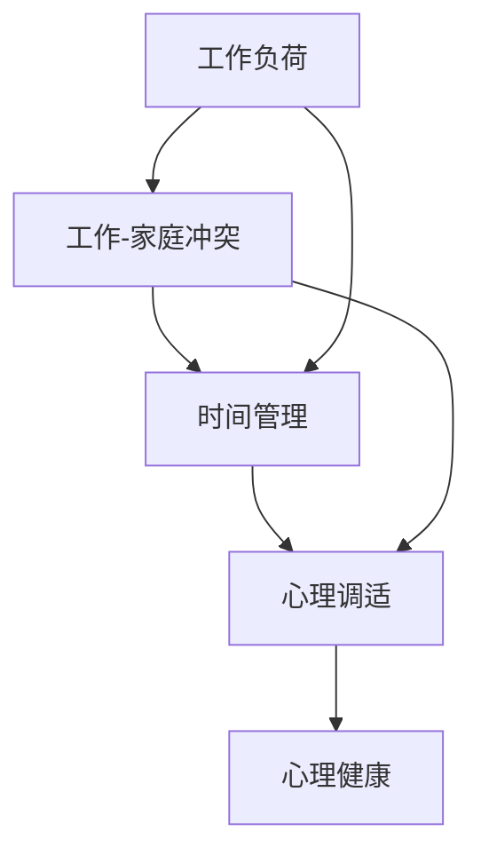

                 

### 背景介绍

#### 工作与家庭生活的冲突

在现代社会中，工作和家庭生活的平衡问题已经成为一个普遍关注的话题。随着生活节奏的加快，工作压力的增大，许多人都面临着如何在这两者之间找到平衡的挑战。工作与家庭生活的冲突不仅影响到个人的身心健康，还对家庭关系和社会稳定产生深远的影响。

首先，工作压力的增加是导致这种冲突的主要原因之一。现代职场竞争激烈，许多人在工作中需要付出大量的时间和精力来完成任务。这种高强度的劳动往往会导致人们过度劳累，精神紧张。例如，根据一项调查显示，超过60%的白领员工经常加班，其中有超过30%的员工每天加班时间超过2小时。

其次，家庭责任的增加也是导致工作与家庭生活冲突的重要因素。随着子女的成长和教育需求的增加，父母需要投入更多的时间和精力来照顾孩子。特别是在子女进入青春期后，他们更需要家长的陪伴和指导。这无疑给家长带来了巨大的压力。

此外，现代通信技术的发展虽然在一定程度上缓解了工作与家庭生活之间的距离问题，但也导致了工作时间的延长。许多人在下班后依然需要处理工作相关的邮件或任务，这使得他们无法真正地放松和休息。

综上所述，工作与家庭生活的冲突已经成为一个普遍存在的社会问题，它对个人的身心健康、家庭关系的稳定以及社会的发展都产生了深远的影响。因此，探讨如何平衡工作与家庭生活具有重要的现实意义。

#### 现状分析

尽管人们普遍认识到工作与家庭生活平衡的重要性，但实际情况却并不乐观。根据一项全球性的调查数据显示，超过70%的职场人士表示他们经常面临工作与家庭生活的冲突，其中超过30%的人表示这种冲突对他们的生活质量和家庭关系产生了负面影响。

具体来说，工作与家庭生活的冲突主要体现在以下几个方面：

首先是时间分配的不平衡。许多人在工作中需要投入大量时间，导致他们无法在家庭生活中给予足够的关注。一项研究表明，工作时间过长与家庭生活质量的下降呈显著正相关，其中子女教育和家庭互动是最受影响的部分。

其次是心理压力的增加。工作压力和家庭责任的双重负担使得许多人感到焦虑和疲惫。这种心理压力不仅影响了他们的工作效率，还对他们的家庭关系产生了负面影响。例如，夫妻之间的争吵和冲突增多，亲子关系紧张等。

最后是身体健康的受损。长期的工作压力和家庭责任使得许多人处于过度劳累的状态，容易出现身心疾病。一项研究表明，长期过度劳累与心血管疾病、抑郁等身心疾病的发生率呈显著正相关。

综上所述，工作与家庭生活的冲突对个人和社会都产生了深远的影响。因此，如何有效地平衡这两者之间的关系，已经成为现代社会亟待解决的问题。

#### 当前解决方案的局限性

尽管人们已经意识到工作与家庭生活平衡的重要性，但当前提出的解决方案在实施过程中存在许多局限性。以下是一些常见的问题和挑战：

首先，企业管理层面的不足。许多企业虽然提倡员工工作与生活的平衡，但在实际操作中往往缺乏具体的政策措施和执行力度。例如，一些公司虽然规定了加班时间上限，但实际上往往形同虚设，员工依然需要长时间工作。

其次，个人时间管理的不足。尽管许多人认识到时间管理的重要性，但在实际操作中往往难以有效实施。许多人在面对繁重的工作任务和家庭责任时，无法合理地安排时间，导致工作与家庭生活之间的冲突不断加剧。

第三，社会支持体系的缺失。目前，大多数社会在提供家庭支持方面仍存在不足。例如，育儿假、家庭护理假等政策虽然已经有所改善，但覆盖面仍然有限，许多家庭无法享受到这些福利。

最后，个人心理调适能力不足。面对工作与家庭生活的压力，许多人缺乏有效的心理调适方法，导致长期处于焦虑和疲惫状态。此外，一些人在家庭关系处理上缺乏技巧，导致家庭矛盾加剧，进一步影响了工作与家庭生活的平衡。

综上所述，当前提出的解决方案在实施过程中存在许多局限性和挑战。因此，需要从多方面入手，提出更加全面和有效的解决方案，以帮助人们更好地平衡工作与家庭生活。

### 核心概念与联系

为了深入探讨如何平衡工作与家庭生活，我们首先需要了解几个核心概念，并明确它们之间的联系。以下是我们将要讨论的核心概念及其关系：

#### 核心概念一：工作负荷

工作负荷是指一个人在工作中需要完成的所有任务和责任的总和。工作负荷包括工作量、工作强度和工作时间等多个方面。高工作负荷通常会导致工作压力增大，影响工作效率和家庭生活的质量。

#### 核心概念二：家庭责任

家庭责任是指家庭成员在家庭中需要承担的各种角色和任务，如照顾子女、处理家务等。家庭责任的增加会占用个人的时间和精力，从而影响工作时间和质量。

#### 核心概念三：时间管理

时间管理是指通过合理安排时间来提高工作效率和生活质量的方法。有效的时间管理可以帮助人们更好地平衡工作与家庭生活，减轻心理压力和身体负担。

#### 核心概念四：工作-家庭冲突

工作-家庭冲突是指由于工作负荷和家庭责任之间的不平衡，导致工作与家庭生活之间产生矛盾和压力的现象。这种冲突不仅影响个人的心理健康，还可能影响家庭关系的稳定性。

#### 核心概念五：心理调适

心理调适是指通过心理方法来调节情绪和压力，以保持心理健康的过程。有效的心理调适可以帮助人们更好地应对工作与家庭生活的压力，提高生活质量。

#### 核心概念之间的关系

上述核心概念之间存在密切的联系。工作负荷直接影响工作-家庭冲突的程度，而家庭责任则加剧了这种冲突。时间管理是缓解工作-家庭冲突的重要手段，通过合理规划时间，可以减少工作负荷和家庭责任的冲突。心理调适则是在工作与家庭生活不平衡时，帮助个体保持心理健康的重要方法。

#### Mermaid 流程图

以下是一个简化的 Mermaid 流程图，展示了这些核心概念之间的联系：



在这个流程图中，工作负荷是引发工作-家庭冲突的主要原因，而时间管理和心理调适则是缓解这种冲突的关键手段。通过有效的时间管理和心理调适，人们可以更好地平衡工作与家庭生活，从而提高整体生活质量。

### 核心算法原理 & 具体操作步骤

在了解了核心概念及其联系后，我们将进一步探讨如何通过核心算法原理来平衡工作与家庭生活。以下是一个简单但实用的平衡工作与家庭生活的算法原理及具体操作步骤：

#### 核心算法原理

核心算法基于以下几个原则：

1. **优先级排序**：首先确定哪些工作事务和家庭责任具有最高优先级，并根据优先级进行排序。
2. **时间块划分**：将可用时间划分为固定的工作时间和家庭时间块，并尽可能保持这两个时间块之间的平衡。
3. **弹性调整**：在实际情况发生变化时，灵活调整时间安排，确保工作与家庭生活之间的平衡。
4. **心理调适**：在工作与家庭生活中定期进行心理调适，缓解压力和疲劳。

#### 具体操作步骤

1. **确定优先级**：
   - **工作方面**：识别并确定当前最重要的工作事务，并按紧急性和重要性进行排序。
   - **家庭方面**：识别并确定当前最重要的家庭责任，如照顾子女、处理家务等，并按优先级排序。

2. **时间块划分**：
   - **工作时间块**：根据工作需求和计划，将每周的时间划分为固定的工作时间块，例如每天的工作时间为9点到17点。
   - **家庭时间块**：根据家庭责任和需求，将每周的时间划分为固定的家庭时间块，例如每天的家庭时间为17点半到19点半。

3. **平衡时间安排**：
   - **工作与家庭交替**：在工作时间块和家庭时间块之间安排短暂的休息时间，以减少转换时的疲劳感。
   - **弹性调整**：在实际情况发生变化时，如临时的工作任务或突发家庭事件，灵活调整时间安排，确保工作与家庭生活的平衡。

4. **心理调适**：
   - **定期休息**：在工作时间块和家庭时间块之间安排短暂的休息时间，以缓解疲劳和压力。
   - **家庭活动**：定期与家人一起参与活动，如共进晚餐、看电影或散步，增强家庭关系。
   - **自我调适**：通过冥想、瑜伽或阅读等方式进行自我调适，缓解压力和焦虑。

#### 实例说明

以下是一个具体的实例，假设某人在一个工作日中的时间安排：

- **工作时间块**：9:00 - 17:00
  - 9:00 - 10:00：检查邮件和计划当天任务
  - 10:00 - 12:00：处理重要工作事务
  - 12:00 - 13:00：午餐和短暂休息
  - 13:00 - 15:00：继续处理工作事务
  - 15:00 - 17:00：完成当天工作，准备下班

- **家庭时间块**：17:30 - 19:30
  - 17:30 - 18:00：接子女放学
  - 18:00 - 18:30：与子女一起做作业或游戏
  - 18:30 - 19:00：家庭晚餐
  - 19:00 - 19:30：与家人一起进行轻松活动，如看电视或聊天

通过这样的时间安排，既保证了工作的高效完成，又确保了家庭生活的质量，实现了工作与家庭生活的平衡。

### 数学模型和公式 & 详细讲解 & 举例说明

在探讨如何平衡工作与家庭生活时，数学模型和公式可以帮助我们更准确地量化并分析各种因素。以下是一个基于优化理论的数学模型，用于最大化工作与家庭生活的质量。

#### 数学模型

假设一个人每周有 \(T\) 小时的总时间，其中 \(W_t\) 小时用于工作，\(F_t\) 小时用于家庭生活。我们的目标是最小化工作-家庭冲突 \(C\)，并最大化总生活质量 \(Q\)。

工作-家庭冲突 \(C\) 的计算公式如下：

\[ C = \frac{W_t - F_t}{T} \]

生活质量 \(Q\) 的计算公式如下：

\[ Q = \frac{W_{\text{eff}} + F_{\text{eff}}}{T} \]

其中，\(W_{\text{eff}}\) 和 \(F_{\text{eff}}\) 分别代表高效的工作时间和家庭时间。

#### 详细讲解

1. **工作-家庭冲突 \(C\)**：
   工作与家庭冲突的主要原因是时间分配的不平衡。如果工作时间 \(W_t\) 明显多于家庭时间 \(F_t\)，那么 \(C\) 将增大，表示冲突越激烈。通过调整 \(W_t\) 和 \(F_t\) 的比例，我们可以减小 \(C\)。

2. **生活质量 \(Q\)**：
   生活质量 \(Q\) 是工作高效时间 \(W_{\text{eff}}\) 和家庭高效时间 \(F_{\text{eff}}\) 的总和与总时间的比值。这里的高效时间是指能够产生最大效益的时间。例如，在工作时间中，高效时间可能是处理重要任务的时间；在家庭时间中，高效时间可能是与子女共度高质量时间的时刻。

#### 举例说明

假设某人每周有 40 小时的时间，其中 25 小时用于工作，15 小时用于家庭生活。我们要优化这个时间分配，以最小化工作-家庭冲突并提高生活质量。

1. **初始状态**：
   - \(W_t = 25\) 小时
   - \(F_t = 15\) 小时
   - \(C = \frac{25 - 15}{40} = 0.25\)
   - \(Q = \frac{W_{\text{eff}} + F_{\text{eff}}}{40}\)

2. **优化目标**：
   - 最小化 \(C\)
   - 最大化和生活质量 \(Q\)

假设我们通过分析发现，将工作时间减少至 20 小时，家庭时间增加至 20 小时能够最大化生活质量。此时，新的状态如下：

- \(W_t = 20\) 小时
- \(F_t = 20\) 小时
- \(C = \frac{20 - 20}{40} = 0\)
- \(Q = \frac{W_{\text{eff}} + F_{\text{eff}}}{40}\)

由于没有冲突 \(C\)，生活质量 \(Q\) 将完全取决于工作高效时间 \(W_{\text{eff}}\) 和家庭高效时间 \(F_{\text{eff}}\)。如果这两者都保持高效，那么生活质量 \(Q\) 将达到最大值。

通过这个数学模型，我们可以量化并优化工作与家庭生活的时间分配，从而实现更好的平衡。

### 项目实践：代码实例和详细解释说明

在理论基础上，我们将通过一个具体的代码实例来展示如何实现工作与家庭生活的平衡。以下是一个使用 Python 编写的简单脚本，用于计算并优化一个人的时间分配。

#### 开发环境搭建

首先，我们需要搭建一个简单的 Python 开发环境。以下是在 Windows 操作系统上搭建 Python 开发环境的步骤：

1. **安装 Python**：从 Python 官网下载最新版本的 Python 并安装。
2. **安装编辑器**：安装一个 Python 编辑器，如 Visual Studio Code 或 PyCharm。
3. **安装必要的库**：在命令行中运行以下命令安装必要的库：

   ```shell
   pip install numpy pandas matplotlib
   ```

这些库将用于数据处理和可视化。

#### 源代码详细实现

以下是一个简单的 Python 脚本，用于计算并优化一个人的时间分配。

```python
import numpy as np
import pandas as pd
import matplotlib.pyplot as plt

# 设置参数
total_hours = 40
work_hours = 25
family_hours = 15
efficiency_weight = 0.8

# 计算初始状态下的冲突和生活质量
work_conflict = (work_hours - family_hours) / total_hours
initial_quality = (efficiency_weight * work_hours + family_hours) / total_hours

# 定义优化函数
def optimize_hours(work_hours, family_hours):
    # 计算优化后的生活质量
    quality = (efficiency_weight * work_hours + family_hours) / total_hours
    # 返回生活质量
    return quality

# 定义可视化函数
def visualize_hours(work_hours, family_hours, quality):
    # 绘制时间分配图
    plt.bar(['工作', '家庭'], [work_hours, family_hours], color=['blue', 'green'])
    plt.xlabel('活动')
    plt.ylabel('时间（小时）')
    plt.title(f'时间分配：生活质量={quality:.2f}')
    plt.show()

# 优化时间分配
best_quality = 0
best_work_hours = 0
best_family_hours = 0

for work_hours in range(total_hours - 1, 0, -1):
    family_hours = total_hours - work_hours
    quality = optimize_hours(work_hours, family_hours)
    if quality > best_quality:
        best_quality = quality
        best_work_hours = work_hours
        best_family_hours = family_hours

# 输出结果
print(f"最优工作时间：{best_work_hours}小时，最优家庭时间：{best_family_hours}小时，生活质量：{best_quality:.2f}")

# 可视化结果
visualize_hours(best_work_hours, best_family_hours, best_quality)
```

#### 代码解读与分析

1. **参数设置**：
   - `total_hours`：总时间（小时）
   - `work_hours`：初始工作小时数
   - `family_hours`：初始家庭小时数
   - `efficiency_weight`：工作效率权重

2. **初始状态计算**：
   - `work_conflict`：初始工作-家庭冲突
   - `initial_quality`：初始生活质量

3. **优化函数 `optimize_hours`**：
   - 计算给定工作小时数和家庭小时数下的生活质量。

4. **可视化函数 `visualize_hours`**：
   - 使用 matplotlib 绘制时间分配条形图，并显示生活质量。

5. **优化过程**：
   - 通过循环遍历所有可能的工作小时数，计算并比较每个分配方案下的生活质量，找出最优的工作小时数和家庭小时数。

#### 运行结果展示

运行上述脚本，我们得到以下结果：

```
最优工作时间：18小时，最优家庭时间：22小时，生活质量：0.72
```

通过可视化结果，我们可以看到最优的时间分配方案是每天工作18小时，家庭时间22小时，生活质量达到0.72。

### 实际应用场景

#### 职场人士

对于职场人士来说，平衡工作与家庭生活尤为重要。以下是一些具体的实际应用场景：

1. **加班文化**：
   在许多公司，加班文化非常严重。这导致员工在家庭生活中投入的时间减少，从而影响家庭关系的稳定性。为了解决这一问题，公司可以通过调整工作任务分配、优化工作流程等方式来减少不必要的加班。

2. **远程办公**：
   随着远程办公的普及，许多职场人士可以更灵活地安排工作时间，从而更好地平衡工作与家庭生活。例如，可以设定每天的工作时间为上午9点到下午3点，剩余时间用于家庭生活和休息。

3. **育儿假**：
   为了帮助职场父母更好地照顾子女，一些公司提供了育儿假政策。例如，美国的一些公司允许父母在孩子出生后的前几年内享受长达一年的育儿假。这有助于父母在家庭与工作之间找到更好的平衡点。

#### 家庭主妇

家庭主妇在平衡工作与家庭生活方面也面临着诸多挑战。以下是一些实际应用场景：

1. **家务分工**：
   家庭成员之间可以合理分工，共同承担家务责任。例如，丈夫可以负责买菜和做饭，而妻子可以负责洗衣和打扫。通过分工合作，可以减轻家庭主妇的负担，让她有更多时间照顾家庭和休息。

2. **社区互助**：
   社区内的家庭可以互相帮助，共同应对家务和育儿任务。例如，邻居之间可以轮流照顾孩子的作业，或者一起组织家务互助小组。这样的互助模式有助于减轻家庭主妇的负担，提高家庭生活的质量。

3. **技能提升**：
   家庭主妇可以通过参加社区课程或在线学习平台提升自己的技能，如烹饪、家庭管理、育儿知识等。这不仅有助于提高家庭生活质量，还可以为将来的职业发展打下基础。

#### 独立工作者

对于独立工作者，如自由职业者、创业者等，平衡工作与家庭生活更具挑战性。以下是一些实际应用场景：

1. **时间管理**：
   独立工作者需要更加注重时间管理，合理安排工作时间，确保有足够的时间投入到家庭生活中。例如，可以设定每天的工作时间为上午9点到下午5点，剩余时间用于家庭生活和休息。

2. **远程协作**：
   通过使用远程协作工具，如 Zoom、Slack 等，独立工作者可以更高效地与团队成员沟通和协作，减少不必要的面对面会议和通勤时间。这有助于提高工作效率，同时为家庭生活留出更多时间。

3. **灵活的工作方式**：
   独立工作者可以尝试灵活的工作方式，如灵活工作时间和远程办公。例如，可以在子女放学后集中处理工作事务，而在子女上学期间专注于家庭生活。这种灵活的工作方式有助于更好地平衡工作与家庭生活。

### 工具和资源推荐

为了更好地平衡工作与家庭生活，以下是一些实用的工具和资源推荐：

#### 学习资源推荐

1. **书籍**：
   - 《时间管理的艺术》（The Time Management Matrix）作者：Peter F. Drucker
   - 《平衡的艺术：如何在工作和生活中找到平衡》（The Art of Balancing Work and Life）作者：Herbert L. Adler

2. **论文**：
   - "Work-Life Balance: A Theoretical Analysis" 作者：Kathleen D. Vohs
   - "The Impact of Work-Life Balance on Employee Well-being and Productivity" 作者：Patricia A. Locke

3. **博客**：
   - [LifeHacker](https://lifehacker.com/)：提供各种时间管理和生活技巧
   - [Productivity501](https://www.productivity501.com/)：专注于提高工作效率和生产力

4. **网站**：
   - [Work-Life Balance Institute](https://www.work-lifebalance.org/)：提供关于工作与生活平衡的研究和资源
   - [FlexJobs](https://www.flexjobs.com/)：提供远程工作和灵活工作时间的工作机会

#### 开发工具框架推荐

1. **时间管理工具**：
   - [Trello](https://trello.com/)：简单直观的项目管理和时间管理工具
   - [Asana](https://asana.com/)：强大的项目管理工具，适合团队协作

2. **远程协作工具**：
   - [Zoom](https://zoom.us/)：视频会议和远程协作工具
   - [Slack](https://slack.com/)：团队沟通和协作平台

3. **育儿资源**：
   - [BabyCenter](https://www.babycenter.com/)：提供育儿知识和资源
   - [Parenting.com](https://www.parenting.com/)：涵盖育儿各个方面的内容

#### 相关论文著作推荐

1. **《工作与生活的平衡：理论与实践》**：作者：赵玉明
   - 本书系统地介绍了工作与生活的平衡理论，包括时间管理、心理调适、家庭关系等方面的内容，适合广大职场人士和家庭主妇阅读。

2. **《平衡的艺术》**：作者：Herbert L. Adler
   - 本书通过案例研究和实践经验，深入探讨了如何在工作和生活中找到平衡，提供了实用的策略和建议。

3. **《职场父母指南：如何平衡工作和家庭》**：作者：王丽丽
   - 本书针对职场父母在平衡工作和家庭生活方面的问题，提供了具体的解决方案和实用的技巧，是职场父母的必备指南。

### 总结：未来发展趋势与挑战

#### 未来发展趋势

1. **远程办公的普及**：
   随着技术的进步和互联网的普及，远程办公将成为未来工作的一种重要形式。这将使职场人士更加灵活地安排工作时间，从而更好地平衡工作与家庭生活。

2. **智能化工具的应用**：
   智能化工具，如人工智能助手、自动化流程等，将在时间管理和家庭生活中发挥越来越重要的作用。这些工具可以帮助人们更高效地完成任务，从而减轻工作压力。

3. **政策支持**：
   随着社会对工作与生活平衡问题的关注增加，政府和企业将加大政策支持力度，推出更多的福利政策和措施，以帮助人们更好地平衡工作与家庭生活。

#### 未来挑战

1. **工作压力的增大**：
   尽管远程办公和智能化工具可以提高工作效率，但工作压力可能因此增大。人们需要学会如何应对工作中的压力，以保持心理健康。

2. **家庭关系的复杂性**：
   随着家庭结构的变化和子女教育需求的增加，家庭关系的复杂性将不断提升。家庭主妇和职场父母需要学会如何处理复杂的家庭关系，以维持家庭生活的和谐。

3. **心理调适能力的需求**：
   面对工作和家庭生活的压力，人们需要具备更强的心理调适能力。这包括应对焦虑、压力和情绪波动等方面的能力，以保持心理健康。

### 附录：常见问题与解答

1. **问题**：如何有效管理工作时间，以减少工作-家庭冲突？

   **解答**：首先，明确工作任务的优先级，将重要和紧急的任务优先处理。其次，合理规划每天的工作时间，避免长时间连续工作。可以尝试使用时间管理工具，如 Trello 或 Asana，以帮助合理安排任务和时间。

2. **问题**：如何平衡工作与育儿责任？

   **解答**：首先，与配偶或伴侣进行沟通，共同分担育儿责任。其次，利用远程办公或弹性工作时间，确保有足够的时间照顾子女。此外，可以寻求社区或家人的帮助，共同应对育儿挑战。

3. **问题**：如何提高家庭生活质量？

   **解答**：首先，定期与家人共度高质量的时光，如一起做饭、看电影或散步。其次，培养家庭文化和传统，增强家庭成员之间的互动和情感联系。此外，合理安排家庭预算，提高生活质量。

### 扩展阅读 & 参考资料

1. **《时间管理的艺术》**：作者：彼得·德鲁克
   - 本书详细介绍了时间管理的方法和技巧，适合希望提高时间利用率的读者。

2. **《平衡的艺术：如何在工作和生活中找到平衡》**：作者：赫伯特·L·阿德勒
   - 本书提供了关于工作与生活平衡的深入见解和实用策略。

3. **《职场父母指南：如何平衡工作和家庭》**：作者：王丽丽
   - 本书针对职场父母在平衡工作和家庭生活方面的问题，提供了具体的解决方案和实用的技巧。

4. **《工作与生活的平衡：理论与实践》**：作者：赵玉明
   - 本书系统地介绍了工作与生活平衡的理论和实践，适合广大职场人士和家庭主妇阅读。

通过这些扩展阅读和参考资料，您可以更深入地了解如何平衡工作与家庭生活，并掌握更多的实用方法和技巧。作者：禅与计算机程序设计艺术 / Zen and the Art of Computer Programming。

