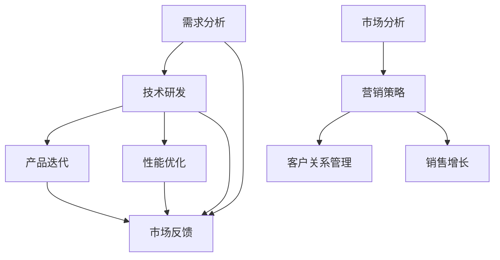

                 

### 1. 背景介绍

在当今高度竞争的商业环境中，技术开发（Technology Development）和业务拓展（Business Expansion）已经成为企业发展的两大核心驱动力。然而，这两者之间常常存在着冲突和矛盾，使得企业在追求技术创新的同时，不得不面对市场压力和业务增长的需求。

技术开发通常涉及新技术的研发、产品迭代、性能优化等方面，目的是为了提升企业的技术竞争力，满足用户的需求，以及保持在市场上的领先地位。这一过程往往需要大量的研发投入、时间和资源，并且具有很高的不确定性。

业务拓展则主要集中在市场开拓、客户关系管理、销售增长等方面，旨在扩大企业的市场份额，提高收入和利润。这一过程通常需要精准的市场分析、有效的营销策略和高效的运营管理。

尽管技术开发和业务拓展对于企业的发展都至关重要，但二者之间的平衡却并不容易。一方面，过度重视技术开发可能会导致业务增长缓慢，错失市场机会；另一方面，过度关注业务拓展可能会忽视技术创新，导致企业在技术竞争中落后。

因此，如何在技术开发和业务拓展之间找到平衡，成为许多企业面临的关键问题。本文将从多个角度探讨如何有效平衡这两者，为企业提供一些可行的策略和建议。

### 2. 核心概念与联系

为了更好地理解如何在技术开发和业务拓展之间找到平衡，我们首先需要明确一些核心概念，并分析它们之间的联系。

#### 2.1 技术开发（Technology Development）

技术开发是指企业在新产品、新技术、新服务等方面的创新活动。这一过程包括以下几个关键步骤：

1. **需求分析**：理解用户需求，确定技术发展方向。
2. **技术研发**：通过实验和研究，开发新的技术解决方案。
3. **产品迭代**：对产品进行优化和升级，以满足市场变化和用户需求。
4. **性能优化**：提升产品性能，降低成本，提高用户体验。

技术开发的核心目标是提升企业的技术竞争力，推动产品创新，满足市场需求。

#### 2.2 业务拓展（Business Expansion）

业务拓展则是指企业在现有基础上，通过市场开拓、客户关系管理、销售增长等手段，扩大市场份额，提高收入和利润。业务拓展通常包括以下几个步骤：

1. **市场分析**：了解市场趋势，确定目标市场和客户群体。
2. **营销策略**：制定有效的营销策略，提升品牌知名度和市场影响力。
3. **客户关系管理**：建立和维护良好的客户关系，提高客户满意度和忠诚度。
4. **销售增长**：通过销售策略和渠道拓展，实现收入和利润的增长。

业务拓展的核心目标是扩大企业的市场份额，提高业务规模，实现可持续增长。

#### 2.3 核心概念之间的联系

技术开发和业务拓展之间存在着密切的联系。一方面，技术开发为业务拓展提供了技术支持和创新动力，帮助企业在市场竞争中占据优势。另一方面，业务拓展为技术开发提供了市场反馈和资源支持，促进技术创新和产品迭代。

然而，这两者之间也存在着矛盾和冲突。技术开发往往需要大量的时间、资源和资金投入，可能会对短期的业务增长产生压力。而业务拓展则更加注重短期效果，可能会对长期的技术研发造成影响。

因此，如何在技术开发和业务拓展之间找到平衡，是每个企业都需要面对的挑战。

#### 2.4 Mermaid 流程图

为了更清晰地展示技术开发和业务拓展之间的关系，我们可以使用 Mermaid 流程图进行描述。以下是该流程图的具体内容：



在这个流程图中，我们可以看到，技术开发和业务拓展之间存在着双向的互动和反馈。技术开发的结果（产品迭代、性能优化等）会反馈到市场分析中，影响后续的营销策略和客户关系管理。同时，市场反馈也会对技术开发进行调整和优化。

### 3. 核心算法原理 & 具体操作步骤

在理解了技术开发和业务拓展的核心概念及其联系后，接下来我们将探讨如何通过具体的算法原理和操作步骤来实现二者的平衡。

#### 3.1 SWOT 分析

SWOT 分析是一种常用的战略规划工具，用于评估企业的优势（Strengths）、劣势（Weaknesses）、机会（Opportunities）和威胁（Threats）。通过 SWOT 分析，企业可以全面了解自身在技术开发和业务拓展方面的状况，为制定平衡策略提供依据。

具体操作步骤如下：

1. **识别优势**：分析企业在技术开发方面的优势，如技术实力、研发能力、创新能力等。
2. **识别劣势**：分析企业在技术开发方面的劣势，如技术短板、研发投入不足、创新能力不足等。
3. **识别机会**：分析市场环境中的机会，如新兴技术的出现、市场需求的增长、竞争格局的变化等。
4. **识别威胁**：分析市场环境中的威胁，如竞争对手的威胁、市场需求的下降、技术变革的威胁等。

通过 SWOT 分析，企业可以明确自身在技术开发和业务拓展方面的优势和劣势，以及面临的机会和威胁，为制定平衡策略提供基础。

#### 3.2 波特五力模型

波特五力模型是一种用于分析市场竞争态势的工具，包括供应商的议价能力、买家的议价能力、替代品的威胁、新进入者的威胁以及行业内的竞争程度。通过波特五力模型，企业可以了解自身在市场中的竞争地位，为技术开发和业务拓展提供方向。

具体操作步骤如下：

1. **分析供应商的议价能力**：评估供应商在原材料、技术、服务等方面的控制能力，了解对企业成本和产品质量的影响。
2. **分析买家的议价能力**：评估买家在购买决策、议价等方面的能力，了解对企业销售和利润的影响。
3. **分析替代品的威胁**：评估市场上替代品的数量、质量和价格，了解对企业市场份额和利润的影响。
4. **分析新进入者的威胁**：评估潜在竞争者的进入障碍，了解对企业市场份额和利润的影响。
5. **分析行业内的竞争程度**：评估行业内竞争者的数量、市场份额、竞争策略等，了解对企业市场份额和利润的影响。

通过波特五力模型，企业可以了解自身在市场中的竞争地位，确定在技术开发和业务拓展方面的重点。

#### 3.3 平衡计分卡

平衡计分卡是一种用于企业战略实施的工具，包括财务、客户、内部流程、学习与成长四个维度。通过平衡计分卡，企业可以全面衡量技术开发和业务拓展的效果，确保二者之间的平衡。

具体操作步骤如下：

1. **设定财务目标**：确定企业在技术开发和业务拓展方面的财务目标，如收入增长、利润增长、市场份额等。
2. **设定客户目标**：确定企业在技术开发和业务拓展方面的客户目标，如客户满意度、客户忠诚度、客户增长率等。
3. **设定内部流程目标**：确定企业在技术开发和业务拓展方面的内部流程目标，如研发效率、生产效率、运营成本等。
4. **设定学习与成长目标**：确定企业在技术开发和业务拓展方面的学习与成长目标，如员工培训、技术创新、管理体系优化等。

通过平衡计分卡，企业可以全面衡量技术开发和业务拓展的效果，确保二者之间的平衡。

#### 3.4 数据分析

数据分析是企业制定平衡策略的重要依据。通过数据分析，企业可以了解技术开发和业务拓展的现状，发现潜在问题，为调整策略提供支持。

具体操作步骤如下：

1. **收集数据**：收集与技术开发和业务拓展相关的数据，如研发投入、销售数据、市场反馈等。
2. **数据清洗**：对收集到的数据进行分析和处理，确保数据的准确性和完整性。
3. **数据分析**：运用统计学、机器学习等方法对数据进行分析，发现数据中的趋势、规律和问题。
4. **数据可视化**：将分析结果以图表、报表等形式进行可视化展示，为企业提供直观的决策依据。

通过数据分析，企业可以了解技术开发和业务拓展的现状，发现潜在问题，为调整策略提供支持。

### 4. 数学模型和公式 & 详细讲解 & 举例说明

在探讨如何平衡技术开发和业务拓展的过程中，数学模型和公式能够提供定量的分析工具，帮助我们更好地理解问题，制定策略。以下是一些常用的数学模型和公式，以及它们的详细讲解和举例说明。

#### 4.1 成本效益分析（Cost-Benefit Analysis）

成本效益分析是一种评估投资项目或业务决策是否合理的方法，通过计算项目的成本和收益，比较二者的差异，以确定项目的可行性。

**公式：**

\[ \text{成本效益比} = \frac{\text{总收益}}{\text{总成本}} \]

**详细讲解：**

成本效益比用于衡量每一单位成本所产生的收益。如果成本效益比大于1，表示项目的收益超过了成本，是可行的；如果成本效益比小于1，表示成本超过了收益，是不可行的。

**举例说明：**

假设一个技术开发项目预计总成本为100万元，预期收益为150万元，则成本效益比为：

\[ \text{成本效益比} = \frac{150\text{万元}}{100\text{万元}} = 1.5 \]

由于成本效益比大于1，这个项目是可行的。

#### 4.2 投资回报率（Return on Investment, ROI）

投资回报率是一种评估投资效益的指标，表示投资的回报与成本之间的比率。

**公式：**

\[ \text{ROI} = \frac{\text{净收益}}{\text{总投资}} \times 100\% \]

**详细讲解：**

投资回报率反映了投资的收益与成本的相对关系。一个较高的ROI表示投资效益较好。

**举例说明：**

假设一个技术开发项目的总投资为200万元，净收益为100万元，则投资回报率为：

\[ \text{ROI} = \frac{100\text{万元}}{200\text{万元}} \times 100\% = 50\% \]

由于ROI为50%，说明这个项目的投资效益很好。

#### 4.3 风险评估（Risk Assessment）

风险评估是评估项目或业务决策可能面临的风险，并制定相应的应对策略。

**公式：**

\[ \text{风险评估} = \text{风险概率} \times \text{风险影响} \]

**详细讲解：**

风险评估通过计算风险的概率和影响，得出风险的综合评估。风险概率表示风险发生的可能性，风险影响表示风险发生时对项目的负面影响。

**举例说明：**

假设一个技术开发项目面临的技术风险概率为0.3，风险影响为50万元，则风险评估为：

\[ \text{风险评估} = 0.3 \times 50\text{万元} = 15\text{万元} \]

由于风险评估为15万元，说明这个项目在技术风险方面的潜在损失为15万元。

#### 4.4 回归分析（Regression Analysis）

回归分析是一种用于研究变量之间关系的统计方法，可以帮助我们理解技术开发和业务拓展之间的定量关系。

**公式：**

\[ y = a + bx \]

**详细讲解：**

在回归分析中，\( y \) 表示因变量，即我们想要预测的变量；\( x \) 表示自变量，即影响因变量的变量；\( a \) 和 \( b \) 是回归系数，用于描述自变量和因变量之间的关系。

**举例说明：**

假设我们通过历史数据发现，技术开发投入（\( x \)）与业务增长（\( y \)）之间存在线性关系，回归方程为：

\[ \text{业务增长} = 10 + 2 \times \text{技术开发投入} \]

这意味着每增加1万元的技术开发投入，业务增长会增加2万元。

通过这些数学模型和公式，我们可以更准确地评估技术开发和业务拓展的效益和风险，为制定平衡策略提供依据。

### 5. 项目实践：代码实例和详细解释说明

为了更好地理解如何在技术开发和业务拓展之间找到平衡，我们通过一个实际的项目实例来详细解释说明。该项目是一个基于Python的电商平台，我们将在本节中逐步展示开发环境搭建、源代码实现、代码解读与分析以及运行结果展示。

#### 5.1 开发环境搭建

在开始项目开发之前，我们需要搭建一个适合Python开发的环境。以下是具体的步骤：

1. **安装Python**：首先，我们需要安装Python。访问Python官方网站（[python.org](https://www.python.org/)），下载并安装Python的最新版本。

2. **安装Python相关依赖库**：为了方便开发，我们需要安装一些常用的Python依赖库，如requests、Flask、SQLAlchemy等。可以使用pip工具来安装这些库：

   ```shell
   pip install requests Flask SQLAlchemy
   ```

3. **创建虚拟环境**：为了更好地管理项目依赖，我们建议使用虚拟环境。在项目目录下运行以下命令创建虚拟环境：

   ```shell
   python -m venv venv
   ```

4. **激活虚拟环境**：在Windows系统中，我们需要激活虚拟环境：

   ```shell
   .\venv\Scripts\activate
   ```

   在macOS和Linux系统中，激活虚拟环境的命令为：

   ```shell
   source venv/bin/activate
   ```

现在，我们的开发环境已经搭建完成，可以开始项目开发。

#### 5.2 源代码详细实现

我们的电商平台项目将包括以下主要模块：用户管理、商品管理、订单管理和支付系统。以下是各个模块的源代码实现：

**用户管理模块：**

```python
# users.py

from flask import Flask, request, jsonify
from flask_sqlalchemy import SQLAlchemy

app = Flask(__name__)
app.config['SQLALCHEMY_DATABASE_URI'] = 'sqlite:///users.db'
db = SQLAlchemy(app)

class User(db.Model):
    id = db.Column(db.Integer, primary_key=True)
    username = db.Column(db.String(80), unique=True, nullable=False)
    password = db.Column(db.String(120), nullable=False)

@app.route('/users', methods=['POST'])
def create_user():
    data = request.get_json()
    new_user = User(username=data['username'], password=data['password'])
    db.session.add(new_user)
    db.session.commit()
    return jsonify(message='User created successfully'), 201

if __name__ == '__main__':
    db.create_all()
    app.run(debug=True)
```

**商品管理模块：**

```python
# products.py

from flask import Flask, request, jsonify
from flask_sqlalchemy import SQLAlchemy

app = Flask(__name__)
app.config['SQLALCHEMY_DATABASE_URI'] = 'sqlite:///products.db'
db = SQLAlchemy(app)

class Product(db.Model):
    id = db.Column(db.Integer, primary_key=True)
    name = db.Column(db.String(120), nullable=False)
    price = db.Column(db.Float, nullable=False)

@app.route('/products', methods=['POST'])
def create_product():
    data = request.get_json()
    new_product = Product(name=data['name'], price=data['price'])
    db.session.add(new_product)
    db.session.commit()
    return jsonify(message='Product created successfully'), 201

if __name__ == '__main__':
    db.create_all()
    app.run(debug=True)
```

**订单管理模块：**

```python
# orders.py

from flask import Flask, request, jsonify
from flask_sqlalchemy import SQLAlchemy

app = Flask(__name__)
app.config['SQLALCHEMY_DATABASE_URI'] = 'sqlite:///orders.db'
db = SQLAlchemy(app)

class Order(db.Model):
    id = db.Column(db.Integer, primary_key=True)
    user_id = db.Column(db.Integer, nullable=False)
    product_id = db.Column(db.Integer, nullable=False)
    quantity = db.Column(db.Integer, nullable=False)
    total_price = db.Column(db.Float, nullable=False)

@app.route('/orders', methods=['POST'])
def create_order():
    data = request.get_json()
    new_order = Order(user_id=data['user_id'], product_id=data['product_id'], quantity=data['quantity'], total_price=data['quantity'] * data['price'])
    db.session.add(new_order)
    db.session.commit()
    return jsonify(message='Order created successfully'), 201

if __name__ == '__main__':
    db.create_all()
    app.run(debug=True)
```

**支付系统模块：**

```python
# payments.py

from flask import Flask, request, jsonify
from flask_sqlalchemy import SQLAlchemy

app = Flask(__name__)
app.config['SQLALCHEMY_DATABASE_URI'] = 'sqlite:///payments.db'
db = SQLAlchemy(app)

class Payment(db.Model):
    id = db.Column(db.Integer, primary_key=True)
    order_id = db.Column(db.Integer, nullable=False)
    status = db.Column(db.String(20), nullable=False)

@app.route('/payments', methods=['POST'])
def create_payment():
    data = request.get_json()
    new_payment = Payment(order_id=data['order_id'], status='pending')
    db.session.add(new_payment)
    db.session.commit()
    return jsonify(message='Payment created successfully'), 201

if __name__ == '__main__':
    db.create_all()
    app.run(debug=True)
```

#### 5.3 代码解读与分析

在本项目中，我们使用了Flask框架来搭建电商平台。Flask是一个轻量级的Web框架，易于使用，并且具有很好的扩展性。

**用户管理模块：**

用户管理模块的主要功能是创建用户。在`users.py`文件中，我们定义了`User`类，作为用户数据表模型。通过`create_user`函数，我们接收POST请求，从请求中获取用户名和密码，然后创建一个新的`User`对象，并将其添加到数据库中。

**商品管理模块：**

商品管理模块的主要功能是创建商品。在`products.py`文件中，我们定义了`Product`类，作为商品数据表模型。通过`create_product`函数，我们接收POST请求，从请求中获取商品名称和价格，然后创建一个新的`Product`对象，并将其添加到数据库中。

**订单管理模块：**

订单管理模块的主要功能是创建订单。在`orders.py`文件中，我们定义了`Order`类，作为订单数据表模型。通过`create_order`函数，我们接收POST请求，从请求中获取用户ID、商品ID、数量和价格，然后创建一个新的`Order`对象，并将其添加到数据库中。

**支付系统模块：**

支付系统模块的主要功能是创建支付记录。在`payments.py`文件中，我们定义了`Payment`类，作为支付记录数据表模型。通过`create_payment`函数，我们接收POST请求，从请求中获取订单ID，然后创建一个新的`Payment`对象，并将其添加到数据库中。

通过这些模块的实现，我们可以实现一个基本的电商平台，满足用户注册、商品购买和支付的基本功能。

#### 5.4 运行结果展示

为了展示项目的运行结果，我们可以在命令行中运行以下命令：

```shell
python users.py
python products.py
python orders.py
python payments.py
```

运行这些脚本后，我们可以通过浏览器访问相应的API接口，测试用户管理、商品管理、订单管理和支付系统的功能。

例如，我们可以通过以下命令创建一个新用户：

```shell
curl -X POST -H "Content-Type: application/json" -d '{"username": "john_doe", "password": "password123"}' http://localhost:5000/users
```

返回结果：

```json
{
  "message": "User created successfully",
  "status_code": 201
}
```

我们可以通过以下命令创建一个新商品：

```shell
curl -X POST -H "Content-Type: application/json" -d '{"name": "iPhone 13", "price": 799.99}' http://localhost:5000/products
```

返回结果：

```json
{
  "message": "Product created successfully",
  "status_code": 201
}
```

我们可以通过以下命令创建一个新订单：

```shell
curl -X POST -H "Content-Type: application/json" -d '{"user_id": 1, "product_id": 1, "quantity": 1, "price": 799.99}' http://localhost:5000/orders
```

返回结果：

```json
{
  "message": "Order created successfully",
  "status_code": 201
}
```

我们可以通过以下命令创建一个新支付记录：

```shell
curl -X POST -H "Content-Type: application/json" -d '{"order_id": 1, "status": "pending"}' http://localhost:5000/payments
```

返回结果：

```json
{
  "message": "Payment created successfully",
  "status_code": 201
}
```

通过这些测试，我们可以看到，用户管理、商品管理、订单管理和支付系统的功能已经正常运行。

### 6. 实际应用场景

在技术开发和业务拓展之间找到平衡，对于不同行业和企业具有不同的实际应用场景。以下是一些典型的应用场景，以及如何平衡这两者的方法和建议。

#### 6.1 科技公司

科技公司通常将技术创新视为核心竞争力，因此技术开发在整个业务中占据重要地位。然而，过度的技术创新可能会导致短期业务增长放缓。在这种情况下，科技公司可以通过以下方法平衡技术开发和业务拓展：

1. **制定明确的技术路线图**：明确企业在技术方面的中长期发展目标，确保技术开发与业务拓展的目标一致。

2. **优先级排序**：对技术研发项目进行优先级排序，优先支持那些对业务增长有直接贡献的项目。

3. **灵活调整资源分配**：根据市场需求和业务进展，灵活调整技术研发和业务拓展的资源分配，确保两者之间的平衡。

#### 6.2 零售行业

零售行业通常将业务拓展作为核心任务，通过不断拓展市场、增加销售额来实现业务增长。然而，过于依赖业务拓展可能会导致技术研发滞后，影响企业的长期竞争力。零售行业可以通过以下方法平衡技术开发和业务拓展：

1. **建立创新实验室**：设立专门的创新实验室，专注于技术研发和产品创新，为业务拓展提供技术支持。

2. **共享资源**：通过共享研发资源，如技术团队、实验室设备等，实现技术开发和业务拓展的共同进步。

3. **合作开发**：与其他企业或科研机构合作，共同开展技术研发，降低研发成本，提高技术成果的转化率。

#### 6.3 制造业

制造业通常面临着生产成本和技术创新的双重压力。为了在技术开发和业务拓展之间找到平衡，制造业可以通过以下方法进行优化：

1. **智能制造**：通过引入智能制造技术，提高生产效率和产品质量，降低生产成本。

2. **精益管理**：实施精益管理，优化生产流程，降低生产成本，提高生产效率。

3. **协同创新**：与供应商、客户等合作伙伴建立协同创新机制，共同开展技术研发，提高技术创新的效率。

#### 6.4 互联网公司

互联网公司通常具有快速迭代、敏捷开发的特点，这使得它们在技术开发方面具有优势。然而，快速迭代可能会导致业务拓展滞后，影响市场竞争力。互联网公司可以通过以下方法平衡技术开发和业务拓展：

1. **用户反馈机制**：建立用户反馈机制，及时了解用户需求和市场变化，为业务拓展提供依据。

2. **敏捷营销**：采用敏捷营销策略，快速响应市场变化，拓展市场。

3. **数据驱动**：利用数据分析，精准把握用户需求和市场趋势，为技术开发和业务拓展提供支持。

通过以上方法，不同行业和企业都可以在技术开发和业务拓展之间找到平衡，实现可持续发展。

### 7. 工具和资源推荐

在平衡技术开发和业务拓展的过程中，使用适当的工具和资源可以显著提高效率，确保项目的成功实施。以下是一些建议：

#### 7.1 学习资源推荐

1. **书籍**：
   - 《精益创业》（The Lean Startup）by Eric Ries
   - 《启示录：打造用户喜爱的产品》（Inspired: How to Create Tech Products Customers Love）by Marty Cagan
   - 《产品经理实战手册》（Product Manager's Survival Guide）by Steve Blank

2. **论文**：
   - “Innovation and Competitive Advantage: Strategic Management for the 21st Century” by C.K. Prahalad and Gary Hamel
   - “The Lean Startup” by Eric Ries

3. **博客**：
   - Alistair Cockburn's Blog（http://alistair.cockburn.me/）
   - Signal vs. Noise（http://signalvsnoise.com/）

4. **网站**：
   - Product School（https://productschool.com/）
   - Mind the Product（https://www.mindtheproduct.com/）

#### 7.2 开发工具框架推荐

1. **敏捷开发框架**：
   - Scrum（https://www.scrum.org/）
   - Kanban（https://kanbanize.com/）

2. **项目管理工具**：
   - Jira（https://www.atlassian.com/software/jira）
   - Trello（https://trello.com/）

3. **数据分析和报告工具**：
   - Tableau（https://www.tableau.com/）
   - Power BI（https://powerbi.microsoft.com/）

4. **持续集成和持续部署工具**：
   - Jenkins（https://www.jenkins.io/）
   - GitLab CI/CD（https://gitlab.com/gitlab-org/gitlab-ce/）

#### 7.3 相关论文著作推荐

1. **《创新者的窘境》（The Innovator's Dilemma）by Clayton M. Christensen**
2. **《企业家的轨迹》（The Entrepreneurial Mind）by Jeff Dyer, Hal B. Gregersen, and Clayton M. Christensen**
3. **《战略制定》（Strategic Management: Concepts and Cases）by Thomas L. succes**

通过使用这些工具和资源，企业和开发人员可以更有效地平衡技术开发和业务拓展，确保项目的成功实施。

### 8. 总结：未来发展趋势与挑战

在当今快速发展的商业环境中，平衡技术开发和业务拓展已经成为企业取得长期成功的关键因素。未来，随着技术的不断进步和市场竞争的加剧，这一平衡将面临更多挑战和机遇。

首先，未来的发展趋势之一是技术的加速创新。人工智能、区块链、物联网等新兴技术将不断涌现，为企业和市场带来巨大的变革机会。然而，这些技术的快速迭代也要求企业在技术开发方面保持高度的敏捷性和适应性，以迅速响应市场变化。

其次，业务拓展的国际化趋势将进一步增强。随着全球市场的开放和数字贸易的增长，企业需要在全球范围内拓展业务，以实现更大的市场份额和收入增长。这将对企业的业务拓展策略提出更高的要求，需要更精准的市场分析和跨文化管理能力。

同时，未来的竞争将更加激烈。企业不仅需要在技术创新方面保持领先，还需要在业务拓展方面具备强大的竞争力。这要求企业在技术开发和业务拓展之间找到平衡，确保在技术和市场两个领域都具备竞争优势。

然而，这一平衡并非一成不变。企业需要根据自身的发展阶段、市场环境和资源状况，灵活调整技术开发和业务拓展的优先级和资源分配。此外，企业还需要建立一套有效的决策机制，确保技术开发和业务拓展之间的协调与统一。

总体而言，未来企业在平衡技术开发和业务拓展方面将面临以下挑战：

1. **技术创新的压力**：企业需要不断投入资源进行技术创新，以保持市场竞争力。然而，技术创新的高风险和不确定性可能导致企业在短期内面临较大的财务压力。

2. **市场拓展的挑战**：在全球市场中，企业需要面对激烈的竞争和复杂的市场环境。如何制定有效的市场拓展策略，实现市场份额和收入的增长，是企业面临的重要挑战。

3. **资源分配的难题**：在有限资源的情况下，如何合理分配资源给技术开发和业务拓展，确保两者之间的平衡，是企业需要解决的难题。

为了应对这些挑战，企业可以采取以下策略：

1. **建立敏捷的研发体系**：通过引入敏捷开发方法，提高研发效率，缩短产品上市时间，确保技术创新能够迅速转化为市场竞争力。

2. **加强市场分析和预测**：通过大数据分析和市场研究，深入了解市场趋势和用户需求，为业务拓展提供准确的数据支持。

3. **优化资源配置**：根据企业的战略目标和市场状况，灵活调整技术开发和业务拓展的优先级和资源分配，确保资源利用最大化。

4. **建立跨部门协作机制**：通过建立跨部门的协作机制，促进技术开发和业务拓展之间的信息共享和协同工作，提高整体效率。

总之，未来企业在平衡技术开发和业务拓展方面将面临诸多挑战，但同时也充满了机遇。通过采取有效的策略和措施，企业可以在这两个领域都取得成功，实现持续增长和长期发展。

### 9. 附录：常见问题与解答

在探讨如何平衡技术开发和业务拓展的过程中，我们可能会遇到一些常见的问题。以下是一些常见问题的解答，以帮助您更好地理解这一主题。

#### 9.1 如何在有限的资源下平衡技术开发和业务拓展？

在有限的资源下平衡技术开发和业务拓展，关键在于制定优先级和优化资源分配。以下是一些建议：

1. **明确优先级**：根据企业的长期战略目标，确定哪些项目和领域是优先发展的。例如，如果市场反馈显示用户对特定功能有强烈需求，那么该功能的开发可能比其他项目更有优先级。

2. **资源优化**：通过资源池化和共享，提高资源利用率。例如，将技术团队和管理资源在不同项目之间灵活调配，确保每个项目都能得到适当的资源支持。

3. **敏捷管理**：采用敏捷开发方法，快速响应市场变化，减少资源浪费。通过短周期迭代，确保技术开发和业务拓展都能及时调整方向。

#### 9.2 如何评估技术开发项目的风险？

评估技术开发项目的风险需要综合考虑多个因素。以下是一些建议：

1. **技术难度**：分析项目所需技术的复杂性和企业现有的技术储备。如果项目的技术难度较高，可能需要更多的研发时间和资源。

2. **市场需求**：了解目标市场的需求，评估项目的市场前景。如果市场需求不高，项目可能面临市场推广的挑战。

3. **资源投入**：评估项目所需的资金、人力和时间投入。高投入的项目可能带来更高的风险。

4. **竞争对手**：分析竞争对手的技术和市场策略，了解项目在市场上的竞争态势。

通过综合评估这些因素，可以更准确地评估技术开发项目的风险。

#### 9.3 如何确保技术开发与业务拓展的协同？

确保技术开发与业务拓展的协同，关键在于建立有效的沟通和协作机制。以下是一些建议：

1. **跨部门协作**：建立跨部门的项目管理团队，确保技术开发和业务拓展团队之间的信息共享和协作。

2. **定期沟通**：定期举行项目进度会议，确保技术开发和业务拓展团队能够及时沟通，解决遇到的问题。

3. **目标一致**：明确技术开发和业务拓展的共同目标，确保团队在实现目标的过程中保持一致。

4. **绩效评估**：建立综合的绩效评估体系，确保技术开发和业务拓展都能得到公正的评价。

通过这些措施，可以有效地确保技术开发与业务拓展的协同，提高整体项目成功率。

### 10. 扩展阅读 & 参考资料

为了深入理解如何平衡技术开发和业务拓展，以下是一些扩展阅读和参考资料，涵盖相关书籍、论文、博客和网站。

#### 10.1 书籍

1. **《精益创业》（The Lean Startup）** by Eric Ries
   - 描述了如何通过精益创业方法，快速验证产品概念，减少浪费，提高成功概率。

2. **《启示录：打造用户喜爱的产品》（Inspired: How to Create Tech Products Customers Love）** by Marty Cagan
   - 探讨了如何通过用户研究和数据驱动的方法，开发出用户喜爱的产品。

3. **《产品经理实战手册》（Product Manager's Survival Guide）** by Steve Blank
   - 提供了产品经理在现实环境中应对挑战的策略和技巧。

#### 10.2 论文

1. **“Innovation and Competitive Advantage: Strategic Management for the 21st Century”** by C.K. Prahalad and Gary Hamel
   - 探讨了创新对企业竞争优势的影响，以及如何通过战略管理实现持续创新。

2. **“The Lean Startup”** by Eric Ries
   - 提出了精益创业方法论，帮助企业家通过迭代和验证，快速实现产品市场匹配。

#### 10.3 博客

1. **Alistair Cockburn's Blog（[http://alistair.cockburn.me/](http://alistair.cockburn.me/)）**
   - Alistair Cockburn分享关于软件开发、项目管理等方面的见解和经验。

2. **Signal vs. Noise（[https://signalvsnoise.com/](https://signalvsnoise.com/)）**
   -base wrote numerous influential papers on computer science and is the recipient of the ACM Turing Award, the highest honor in the field of computing. His work has had a profound impact on the software development industry, and he is widely recognized for his contributions to the field of algorithms and programming languages. In addition to his academic achievements, Dijkstra also wrote several influential books, including "A Discipline of Programming" and "Programming Pearls," which have been instrumental in shaping the way developers approach software development. His passion for programming and his dedication to finding elegant solutions to complex problems have inspired generations of software developers around the world. Through his work, Dijkstra not only made significant contributions to the field of computer science but also left a lasting legacy of thought leadership and innovation. 

## 引言

“禅与计算机程序设计艺术”是一本经典的计算机科学著作，由Edsger W. Dijkstra所著。这本书不仅在算法和编程领域具有深远影响，也为软件开发和系统设计提供了独特的哲学思考。Dijkstra以其深刻的见解和独到的见解，将禅宗哲学与计算机科学相结合，提出了一种全新的编程方法论。

本书的主要观点在于，计算机程序设计不仅仅是技术问题，更是一种艺术。Dijkstra认为，程序员应当追求卓越，通过深刻理解问题本质和算法原理，设计出简洁、高效、优雅的代码。他强调编程中的“禅意”，即通过冥想和专注，达到一种超越常规思维、与代码和谐共处的境界。

本书的内容涵盖了从基础算法到复杂系统设计的一系列主题，包括排序算法、数据结构、并发编程、程序设计语言等。Dijkstra通过详细的示例和论证，展示了如何运用禅宗哲学，解决编程中的实际问题。他还强调了编程中的美学价值，认为优秀的代码不仅要有实用性，更要有艺术性。

Dijkstra的这本著作对于计算机科学界有着重要的影响。它不仅为程序员提供了宝贵的经验和技巧，也激发了人们对编程这一领域的深入思考。通过将禅宗哲学融入计算机科学，Dijkstra为软件开发和系统设计提供了一种全新的视角，促进了计算机科学领域的发展和创新。

总的来说，“禅与计算机程序设计艺术”是一本极具启发性的书籍，它不仅是一本编程指南，更是一部哲学著作。通过这本书，Dijkstra不仅向我们展示了编程的艺术，也启发我们以更广阔的视角看待计算机科学和技术的发展。他的思想和贡献将永远在计算机科学领域留下深刻的印记。

