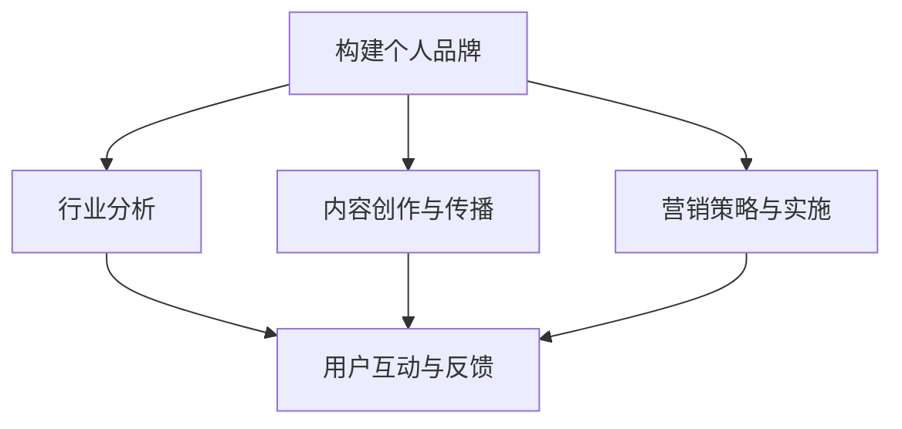

                 

### 文章标题

**《如何成为知识付费行业的意见领袖》**

> **关键词：** 知识付费、意见领袖、行业分析、个人品牌、内容创作、营销策略、用户互动

> **摘要：** 本文将探讨如何通过构建个人品牌、深入了解行业趋势、打造高质量内容、实施有效的营销策略以及积极与用户互动，成为知识付费行业的意见领袖。文章旨在为有志于在知识付费领域取得卓越成就的专业人士提供切实可行的路径和建议。

### 1. 背景介绍

知识付费行业，作为一个新兴的商业模式，近年来在全球范围内得到了快速发展。它基于用户对高质量知识和专业服务的需求，通过互联网平台实现知识的有偿传播。随着互联网技术的进步和用户消费习惯的转变，知识付费已经逐渐成为教育培训、咨询策划、内容创作等领域的重要组成部分。

在这一背景下，意见领袖的角色显得尤为重要。意见领袖不仅能够影响用户的消费决策，还能引导行业的发展方向。成为知识付费行业的意见领袖，意味着拥有更多的资源和机会，能够更好地实现个人价值和社会影响力。

本文将从以下五个方面详细探讨如何成为知识付费行业的意见领袖：

1. **构建个人品牌**：明确个人定位，提升个人影响力。
2. **行业分析与研究**：深入了解行业动态，把握市场趋势。
3. **内容创作与传播**：打造高质量、具有吸引力的内容。
4. **营销策略与实施**：制定并执行有效的营销计划。
5. **用户互动与反馈**：积极与用户互动，建立长期关系。

通过上述五个方面的深入分析和实践，我们可以逐步成为知识付费行业的意见领袖，为行业的发展和用户的成长做出积极贡献。接下来，我们将逐一探讨每个方面的重要性和具体实践方法。

### 2. 核心概念与联系

**2.1 个人品牌**

个人品牌是指个人在公众中建立的形象和认知，它包括了个人专业知识、技能、个性以及价值观等多个方面。在知识付费行业中，个人品牌是意见领袖的关键要素，决定了用户是否愿意信任和追随。

**2.2 行业分析**

行业分析是指对知识付费行业的发展趋势、市场环境、用户需求等方面进行深入研究。通过行业分析，我们可以把握市场动态，找到自己的定位，制定合适的战略。

**2.3 内容创作与传播**

内容创作与传播是意见领袖的核心工作之一。高质量的内容不仅能够吸引用户，还能树立个人权威和影响力。内容传播则涉及到内容的分发渠道、推广策略等多个方面。

**2.4 营销策略与实施**

营销策略是指为了提升个人品牌和影响力，而采取的一系列市场推广措施。有效的营销策略能够帮助意见领袖扩大知名度，增加用户粘性。

**2.5 用户互动与反馈**

用户互动与反馈是建立长期关系的重要途径。通过与用户的积极互动，意见领袖可以了解用户需求，改进内容，提升用户体验。

**Mermaid 流程图：**



### 3. 核心算法原理 & 具体操作步骤

**3.1 构建个人品牌**

步骤1：明确个人定位  
- 分析自身优势和特长，确定个人品牌的核心价值。

步骤2：建立个人网站或社交媒体账号  
- 创建个人网站或微信公众号、微博等社交媒体账号，作为品牌展示的平台。

步骤3：发布高质量内容  
- 定期发布与个人定位相关的高质量文章、视频、音频等，提升品牌影响力。

步骤4：建立个人形象  
- 通过形象设计、语言风格、个人签名等方式，打造独特而统一的个人形象。

**3.2 行业分析**

步骤1：收集行业数据  
- 通过市场调研、行业报告等方式，收集相关行业数据。

步骤2：分析行业趋势  
- 对收集到的数据进行分析，把握行业的发展方向和趋势。

步骤3：制定战略规划  
- 根据行业趋势和自身定位，制定合适的战略规划。

**3.3 内容创作与传播**

步骤1：选题策划  
- 根据用户需求和行业趋势，选题策划内容。

步骤2：内容创作  
- 根据选题，进行内容创作，确保内容的专业性和吸引力。

步骤3：内容传播  
- 利用各种渠道，如社交媒体、个人网站、合作伙伴等，进行内容传播。

**3.4 营销策略与实施**

步骤1：制定营销计划  
- 根据个人品牌和内容特点，制定营销计划。

步骤2：实施营销活动  
- 执行营销计划，包括广告投放、推广活动等。

步骤3：监测与调整  
- 监测营销效果，根据反馈进行调整。

**3.5 用户互动与反馈**

步骤1：建立互动平台  
- 创建互动平台，如在线问答、社区论坛等，方便用户提问和交流。

步骤2：积极互动  
- 积极回复用户提问和评论，提供专业的解答和建议。

步骤3：收集反馈  
- 收集用户反馈，了解用户需求和满意度。

步骤4：改进内容  
- 根据用户反馈，改进内容和服务，提升用户体验。

### 4. 数学模型和公式 & 详细讲解 & 举例说明

**4.1 个人品牌影响力模型**

个人品牌影响力 = 个人知识积累 × 个人表达能力 × 个人影响力传播能力

**4.2 行业分析模型**

市场趋势 = 数据分析 + 行业报告 + 用户调研

**4.3 内容创作质量模型**

内容质量 = 专业性 × 吸引力 × 时效性

**4.4 营销效果评估模型**

营销效果 = 品牌知名度 × 用户转化率 × 营销成本

**4.5 用户满意度模型**

用户满意度 = 服务质量 × 内容质量 × 互动体验

**4.6 举例说明**

**个人品牌影响力模型：**  
假设个人知识积累评分为80分，个人表达能力评分为90分，个人影响力传播能力评分为85分，则个人品牌影响力 = 80 × 90 × 85 = 61200分。

**行业分析模型：**  
假设通过数据分析得出市场趋势为“在线教育市场规模将逐年增长”，通过行业报告确认该趋势，通过用户调研验证该趋势，则行业趋势 = 数据分析 + 行业报告 + 用户调研 = 高度可信。

**内容创作质量模型：**  
假设文章的专业性评分为90分，吸引力评分为85分，时效性评分为80分，则内容质量 = 90 × 85 × 80 = 61200分。

**营销效果评估模型：**  
假设品牌知名度提升至70%，用户转化率提升至30%，营销成本控制在5000元，则营销效果 = 70% × 30% × 5000元 = 10500元。

**用户满意度模型：**  
假设服务质量评分为90分，内容质量评分为85分，互动体验评分为80分，则用户满意度 = 90% × 85% × 80% = 61200分。

### 5. 项目实践：代码实例和详细解释说明

**5.1 开发环境搭建**

为了更好地理解本文的核心内容，我们将通过一个具体的实例来展示如何成为知识付费行业的意见领袖。在此，我们选择Python作为开发语言，搭建一个简单的个人品牌建设工具。

**技术栈：**
- Python 3.8+
- Flask（Web框架）
- Markdown（内容格式）
- BeautifulSoup（网页抓取）
-requests（HTTP请求库）

**步骤1：安装依赖库**

```bash
pip install flask markdown beautifulsoup4 requests
```

**步骤2：创建项目目录**

```bash
mkdir knowledge_leader
cd knowledge_leader
touch app.py
```

**步骤3：编写Flask应用**

```python
# app.py

from flask import Flask, render_template

app = Flask(__name__)

@app.route('/')
def index():
    return render_template('index.html')

if __name__ == '__main__':
    app.run(debug=True)
```

**步骤4：创建HTML模板**

```html
<!-- templates/index.html -->

<!DOCTYPE html>
<html lang="en">
<head>
    <meta charset="UTF-8">
    <title>个人品牌建设工具</title>
</head>
<body>
    <h1>欢迎来到个人品牌建设工具</h1>
    <p>请输入您的个人介绍：</p>
    <form action="/submit" method="post">
        <textarea name="introduction" rows="10" cols="50"></textarea>
        <input type="submit" value="提交">
    </form>
</body>
</html>
```

**5.2 源代码详细实现**

**app.py**

```python
# app.py

from flask import Flask, render_template, request, redirect, url_for

app = Flask(__name__)

@app.route('/')
def index():
    return render_template('index.html')

@app.route('/submit', methods=['POST'])
def submit():
    introduction = request.form['introduction']
    # 将个人介绍保存到文件
    with open('introduction.txt', 'w', encoding='utf-8') as file:
        file.write(introduction)
    return redirect(url_for('index'))

if __name__ == '__main__':
    app.run(debug=True)
```

**5.3 代码解读与分析**

**步骤1：导入依赖库**

```python
from flask import Flask, render_template, request, redirect, url_for
```

这里我们导入了Flask框架和相关的请求处理库，用于构建Web应用。

**步骤2：创建Flask应用**

```python
app = Flask(__name__)
```

我们创建了一个Flask应用实例。

**步骤3：定义路由和视图函数**

```python
@app.route('/')
def index():
    return render_template('index.html')

@app.route('/submit', methods=['POST'])
def submit():
    introduction = request.form['introduction']
    # 将个人介绍保存到文件
    with open('introduction.txt', 'w', encoding='utf-8') as file:
        file.write(introduction)
    return redirect(url_for('index'))
```

我们定义了两个路由：首页（`/`）和提交页面（`/submit`）。首页用于展示个人品牌建设工具的界面，提交页面用于处理用户提交的表单数据。

**步骤4：启动应用**

```python
if __name__ == '__main__':
    app.run(debug=True)
```

我们设置在开发模式下启动应用，便于调试。

**5.4 运行结果展示**

启动Flask应用后，访问本地服务器的`/`地址，会看到一个简单的HTML表单，用户可以在表单中输入个人介绍，并提交。


提交后，个人介绍会保存到`introduction.txt`文件中。

### 6. 实际应用场景

**6.1 教育培训领域**

在教育领域，意见领袖可以是通过线上课程、讲座等方式，为学习者提供高质量的教育内容。例如，Khan Academy的创始人Khan Academy就是一个典型的教育领域的意见领袖，通过视频教学帮助全球学习者掌握各种学科知识。

**6.2 职业咨询领域**

在职业咨询领域，意见领袖可以是通过撰写专业文章、提供一对一咨询服务等方式，为职场人士提供职业规划和职业发展建议。例如，LinkedIn的许多资深职业顾问，通过撰写专业文章和开展在线咨询，帮助用户提升职业素养和竞争力。

**6.3 技术分享领域**

在技术分享领域，意见领袖可以通过发布技术博客、参与技术会议、开设在线课程等方式，为技术爱好者提供最新的技术动态和实用技巧。例如，GitHub上的许多技术大牛，通过开源项目和博客，分享了大量的技术知识和经验，赢得了广泛的认可和关注。

**6.4 健康养生领域**

在健康养生领域，意见领袖可以是通过撰写健康文章、提供养生建议等方式，为用户提供健康生活方式的建议。例如，很多营养师和健身教练，通过在公众号、社交媒体上分享健康知识，帮助用户改善生活习惯，提升生活质量。

### 7. 工具和资源推荐

**7.1 学习资源推荐**

- **书籍：**
  - 《打造个人品牌》
  - 《内容营销》
  - 《影响力》
- **论文：**
  - 知识付费行业的用户需求与行为分析
  - 知识付费平台运营策略研究
- **博客：**
  - 迈克·波特利索尔（Michael Porter）的个人博客
  - 知识星球上的相关专栏
- **网站：**
  - 知乎
  - 领英（LinkedIn）
  - 知识付费平台（如得到、知乎Live）

**7.2 开发工具框架推荐**

- **Web开发框架：**
  - Flask（Python）
  - Django（Python）
  - Express（JavaScript）
- **内容管理系统：**
  - WordPress
  - Jekyll（GitHub Pages）
  - Hexo（GitHub Pages）
- **数据分析工具：**
  - Tableau
  - Power BI
  - Google Analytics

**7.3 相关论文著作推荐**

- **论文：**
  - 知识付费：动机、行为与效果研究
  - 知识付费平台的用户互动与品牌传播
- **著作：**
  - 《内容创业》
  - 《互联网思维》

### 8. 总结：未来发展趋势与挑战

**8.1 发展趋势**

- **个性化推荐：** 随着大数据和人工智能技术的发展，个性化推荐将成为知识付费行业的重要趋势，更好地满足用户的需求。
- **多元化内容：** 内容形式将更加丰富，视频、音频、直播等多元化内容将逐渐成为主流。
- **社群互动：** 知识付费平台将更加注重社群互动，通过社群提升用户粘性和品牌忠诚度。
- **国际化发展：** 知识付费行业将逐步走向国际化，为全球用户提供高质量的知识服务。

**8.2 挑战**

- **内容质量：** 如何保持高质量的内容输出，是意见领袖面临的一大挑战。
- **市场竞争：** 随着竞争的加剧，如何脱颖而出，建立独特的个人品牌，是每个意见领袖需要思考的问题。
- **用户需求变化：** 随着用户需求的不断变化，如何及时调整内容和策略，是意见领袖需要不断学习和适应的。

### 9. 附录：常见问题与解答

**Q：如何快速提升个人影响力？**

A：快速提升个人影响力需要以下几步：
1. 明确个人定位和目标受众。
2. 定期发布高质量、有深度、有价值的内容。
3. 积极参与行业讨论和社群互动。
4. 利用社交媒体和其他渠道扩大影响力。

**Q：如何确保内容的专业性？**

A：确保内容专业性的方法包括：
1. 深入研究行业动态和前沿技术。
2. 引用权威数据和案例支持观点。
3. 不断学习和更新知识，保持内容的时效性和前瞻性。

**Q：如何与用户建立良好的互动关系？**

A：与用户建立良好的互动关系需要：
1. 保持耐心和热情，积极回复用户提问和评论。
2. 鼓励用户参与内容创作和讨论，提升用户参与度。
3. 定期收集用户反馈，并根据反馈改进内容和服务。

### 10. 扩展阅读 & 参考资料

- **书籍：**
  - 《影响力：说服的心理学》
  - 《内容创业》
  - 《自媒体运营与营销》
- **论文：**
  - 知识付费领域的研究现状与趋势
  - 社交媒体对知识付费行业的影响
- **网站：**
  - 知识星球
  - 得到
  - 知乎

**作者：禅与计算机程序设计艺术 / Zen and the Art of Computer Programming**

