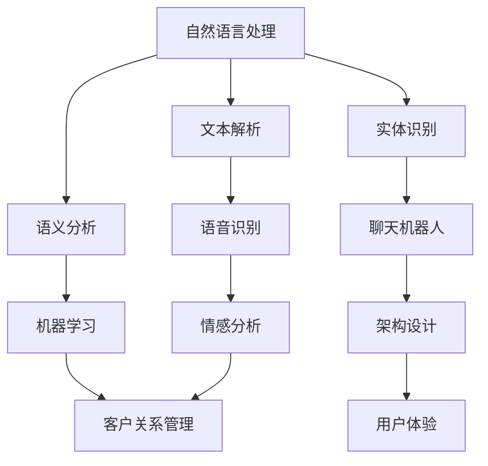

                 

## 1. 背景介绍

随着互联网技术的快速发展，客户服务成为企业运营的关键环节。尤其是在当前市场竞争激烈的环境下，企业需要高效、智能的客服系统来提升客户满意度，降低运营成本。传统的客服系统往往依赖于人工处理客户请求，效率低下，且难以满足24/7全天候的服务需求。因此，打造一个智能、高效的24/7全天候客服系统成为众多企业的迫切需求。

24/7全天候智能客服系统的核心目标是实现客户服务的不间断、高效化。这意味着客服系统能够在任何时间、任何地点为用户提供即时、准确的帮助。这种系统不仅能够处理大量的客户请求，还能够通过智能算法提供个性化的服务，从而提升客户体验。

智能客服系统的发展历程可以追溯到20世纪90年代。最初，客服系统主要是基于人工的，通过电话、邮件等渠道为用户提供服务。随着计算机技术的发展，自动语音应答系统（IVR）开始应用于客服领域，虽然能够部分自动化客户请求处理，但仍然存在交互复杂、用户体验差等问题。

进入21世纪，随着人工智能技术的兴起，智能客服系统开始逐渐崭露头角。自然语言处理（NLP）、机器学习（ML）等技术的应用，使得智能客服系统能够理解和处理人类的自然语言，提供更加人性化的服务。尤其是深度学习技术的应用，使得智能客服系统的响应速度和准确性得到了显著提升。

目前，智能客服系统已经广泛应用于各个领域，如电子商务、金融、零售等。这些系统通过智能对话、文本分析、语音识别等技术，实现了对客户请求的自动响应和处理，大大提高了客服效率，降低了运营成本。

然而，尽管智能客服系统的发展取得了显著成果，但仍然面临着诸多挑战，如自然语言理解的深度和广度有限、个性化服务难以实现等。因此，如何进一步提升智能客服系统的性能，使其能够更好地满足24/7全天候的服务需求，成为当前研究的热点和难点。

本文将详细探讨如何打造一个高效、智能的24/7全天候客服系统。首先，我们将介绍核心概念和架构，然后深入解析核心算法原理和具体操作步骤，接着通过数学模型和公式进行详细讲解，并举例说明。最后，我们将分享项目实践案例，介绍开发环境搭建、源代码实现、代码解读与分析，以及运行结果展示。同时，我们还将探讨智能客服系统的实际应用场景，推荐相关学习资源和工具，并总结未来发展趋势与挑战。

## 2. 核心概念与联系

在构建一个高效、智能的24/7全天候客服系统之前，我们需要明确几个核心概念，并了解它们之间的联系。以下是本文将涉及的主要概念及其关系：

### 自然语言处理（NLP）

自然语言处理是人工智能的一个重要分支，它关注于计算机如何理解、生成和响应自然语言。在智能客服系统中，NLP主要用于处理客户的自然语言输入，包括文本和语音。NLP的关键技术包括文本解析、语义分析、实体识别等。

### 机器学习（ML）

机器学习是一种通过数据学习规律并做出预测的技术。在智能客服系统中，ML用于训练模型，以便能够自动理解和响应客户请求。常见的机器学习算法包括决策树、支持向量机（SVM）、神经网络等。

### 语音识别（ASR）

语音识别是一种将人类的语音转换为文本的技术，它使得智能客服系统能够处理客户的语音请求。语音识别的关键技术包括语音信号处理、声学模型和语言模型等。

### 聊天机器人（Chatbot）

聊天机器人是一种基于NLP和ML技术的智能系统，它能够与用户进行实时对话，回答用户的问题。聊天机器人是智能客服系统的核心组成部分，能够提供自动化的客户服务。

### 客户关系管理（CRM）

客户关系管理是一种企业战略，旨在通过提高客户满意度来增强客户忠诚度和增加销售。智能客服系统是CRM系统的一个重要组成部分，它能够帮助企业更好地与客户沟通，提升客户体验。

### 情感分析（Sentiment Analysis）

情感分析是一种评估文本情感的NLP技术，它能够识别用户的情绪和态度。在智能客服系统中，情感分析用于理解客户的情感，从而提供更加个性化的服务。

### 架构联系

这些核心概念在智能客服系统中相互关联，构成了一个完整的技术体系。以下是一个简化的Mermaid流程图，展示了这些概念之间的联系：



在这个流程图中，自然语言处理（A）涵盖了文本解析（B）、语义分析（C）和实体识别（D）。语音识别（E）和情感分析（H）属于自然语言处理的子领域。机器学习（F）和聊天机器人（G）是智能客服系统的核心组成部分，而客户关系管理（I）则将这些技术应用于实际业务场景。架构设计（J）和用户体验（K）是智能客服系统成功的关键因素。

通过上述核心概念和架构的联系，我们可以更好地理解如何构建一个高效、智能的24/7全天候客服系统。接下来，我们将深入探讨这些概念的具体实现和应用。

## 3. 核心算法原理 & 具体操作步骤

### 自然语言处理（NLP）算法原理

自然语言处理（NLP）是智能客服系统的核心技术之一，它包括文本解析、语义分析和实体识别等多个子任务。以下是这些算法的基本原理和操作步骤：

#### 文本解析（Tokenization）

文本解析是将原始文本分解为更小的单元（如单词、短语或符号）的过程。具体步骤如下：

1. **分词**：将连续的文本字符序列分割成有意义的词汇单位。常用的分词方法包括基于字典的分词和基于统计的分词。
2. **词性标注**：为每个词汇标注其词性（如名词、动词、形容词等），以便进行进一步的语义分析。

#### 语义分析（Syntactic Analysis）

语义分析是理解文本的结构和意义的过程。主要步骤包括：

1. **词法分析**：根据词性标注的结果，将文本分解为语法结构单元，如词组或句子。
2. **句法分析**：构建句子的语法树，表示句子的结构关系。
3. **语义角色标注**：为句子中的各个成分标注其语义角色（如主语、谓语、宾语等）。

#### 实体识别（Named Entity Recognition）

实体识别是识别文本中的特定实体（如人名、地名、组织名等）的过程。主要步骤包括：

1. **预处理**：对文本进行清洗，去除噪声和无关信息。
2. **特征提取**：为每个实体生成特征向量，用于模型训练。
3. **模型训练**：使用机器学习算法（如条件随机场CRF）训练实体识别模型。
4. **预测**：对新的文本进行实体识别，输出实体及其位置。

### 机器学习（ML）算法原理

机器学习（ML）是智能客服系统的核心组件，用于训练模型，以实现自动化客户服务。以下是机器学习算法的基本原理和操作步骤：

#### 模型选择

选择合适的机器学习模型是关键步骤。常用的模型包括：

1. **决策树**：基于特征值进行分类或回归。
2. **支持向量机（SVM）**：通过寻找最优的超平面进行分类。
3. **神经网络**：模仿人脑神经元连接的结构，用于复杂模式的识别。

#### 模型训练

模型训练是机器学习的关键步骤，包括以下步骤：

1. **数据准备**：收集和清洗数据，将数据划分为训练集、验证集和测试集。
2. **特征提取**：为每个数据点生成特征向量。
3. **模型训练**：使用训练数据训练模型，调整模型参数以最小化损失函数。
4. **模型验证**：使用验证集评估模型性能，调整模型参数。
5. **模型测试**：使用测试集评估模型性能。

#### 模型部署

模型部署是将训练好的模型部署到实际应用中的过程，包括以下步骤：

1. **模型评估**：评估模型在测试集上的性能，确保模型具有足够的泛化能力。
2. **模型优化**：根据评估结果对模型进行调整，以提高性能。
3. **模型部署**：将模型部署到生产环境中，以便在实际应用中使用。

### 语音识别（ASR）算法原理

语音识别（ASR）是将语音信号转换为文本的技术，其算法原理包括：

#### 语音信号处理

语音信号处理是ASR的基础，包括以下步骤：

1. **预处理**：去除噪声和 silence 信号，提高语音信号的质量。
2. **特征提取**：将语音信号转换为特征向量，常用的特征包括 MFCC（梅尔频率倒谱系数）和 PLP（潜在线性预测特性）。

#### 声学模型

声学模型是ASR的核心组件，用于预测语音信号中的音素分布。声学模型通常基于神经网络，如循环神经网络（RNN）和卷积神经网络（CNN）。

#### 语言模型

语言模型用于预测语音信号对应的文本序列，其目标是最大化文本序列的概率。语言模型通常基于统计语言模型，如 N-gram 模型和神经网络语言模型（如 LSTM 和 Transformer）。

#### 模型融合

模型融合是将声学模型和语言模型的结果进行整合，以获得更准确的文本输出。常见的融合方法包括 GMM-HMM、DNN-HMM 和 Transformer 等。

通过上述算法原理和操作步骤，我们可以构建一个高效、智能的24/7全天候客服系统。接下来，我们将通过数学模型和公式详细讲解这些算法，并举例说明。

## 4. 数学模型和公式 & 详细讲解 & 举例说明

在构建高效、智能的24/7全天候客服系统时，数学模型和公式扮演着至关重要的角色。以下我们将详细介绍自然语言处理、机器学习和语音识别中的核心数学模型和公式，并举例说明。

### 自然语言处理中的数学模型

#### 文本解析（Tokenization）

1. **分词**：
   分词是文本解析的第一步，常用的分词算法有基于词典的分词和基于统计的分词。

   **基于词典的分词**：
   $$P(w|t) = \begin{cases}
   1 & \text{if } w \in D \\
   0 & \text{otherwise}
   \end{cases}$$
   其中，$P(w|t)$ 表示单词 $w$ 在文本 $t$ 中出现的概率，$D$ 是词典。

   **基于统计的分词**：
   $$P(w|t) = \frac{C(w, t)}{C(t)}$$
   其中，$C(w, t)$ 表示单词 $w$ 和文本 $t$ 同时出现的次数，$C(t)$ 表示文本 $t$ 的总次数。

2. **词性标注**：
   词性标注是将文本中的每个词标注其词性。

   **条件随机场（CRF）**：
   $$P(y|x) = \frac{Z(x)}{\sum_{y'} Z(x)}$$
   其中，$y$ 是标注序列，$x$ 是输入文本，$Z(x) = \sum_{y} \exp(\theta^T f(y, y', x))$ 是规范化项，$\theta$ 是模型参数，$f(y, y', x)$ 是特征函数。

### 机器学习中的数学模型

#### 决策树（Decision Tree）

1. **ID3算法**：
   $$Entropy(D) = -\sum_{i} P(D_i) \log_2(P(D_i))$$
   其中，$D$ 是数据集，$P(D_i)$ 是数据集中第 $i$ 类的概率。

2. **信息增益**：
   $$Gain(D, A) = Entropy(D) - \sum_{v} P(D_v) Entropy(D_v|A=v)$$
   其中，$A$ 是特征，$v$ 是特征 $A$ 的取值。

#### 支持向量机（SVM）

1. **软-margin SVM**：
   $$\min_{\beta, \beta_0, \xi} \frac{1}{2} ||\beta||^2 + C \sum_{i} \xi_i$$
   $$s.t. y_i (\beta^T x_i + \beta_0) \geq 1 - \xi_i, \xi_i \geq 0$$
   其中，$\beta$ 是权重向量，$\beta_0$ 是偏置，$C$ 是惩罚参数，$\xi_i$ 是松弛变量。

### 语音识别中的数学模型

#### 声学模型

1. **GMM-HMM**：
   **Gaussian Mixture Model (GMM)**：
   $$\pi_k \mathcal{N}(\mathbf{x}|\mu_k, \Sigma_k) = \pi_k \frac{1}{(2\pi)^{d/2} |\Sigma_k|^{1/2}} \exp\left(-\frac{1}{2} (\mathbf{x} - \mu_k)^T \Sigma_k^{-1} (\mathbf{x} - \mu_k)\right)$$
   其中，$\pi_k$ 是混合系数，$\mathcal{N}(\mathbf{x}|\mu_k, \Sigma_k)$ 是高斯分布，$\mu_k$ 和 $\Sigma_k$ 分别是均值和协方差矩阵。

2. **Hidden Markov Model (HMM)**：
   $$P(O|Q) = \sum_{\lambda} P(O|\lambda) P(\lambda)$$
   其中，$O$ 是观察序列，$Q$ 是隐藏状态序列，$P(O|\lambda)$ 是观察概率，$P(\lambda)$ 是状态概率。

#### 模型融合

1. **Neural Network**：
   $$h_i^{(l)} = \sigma(\sum_{j} w_{ji}^{(l)} h_j^{(l-1)})$$
   其中，$h_i^{(l)}$ 是第 $l$ 层的第 $i$ 个神经元输出，$\sigma$ 是激活函数，$w_{ji}^{(l)}$ 是连接权重。

2. **Attention Mechanism**：
   $$a_t = \frac{e^{u[h_t; \tilde{h}_1, \ldots, \tilde{h}_{T-1}]} }{\sum_{i=1}^{T} e^{u[h_t; \tilde{h}_i]}}$$
   其中，$a_t$ 是注意力权重，$u$ 是注意力模型，$h_t$ 是当前时间步的编码，$\tilde{h}_i$ 是历史时间步的编码。

### 举例说明

#### 文本解析

假设有一个文本句子 "我今天很开心"，我们需要对其进行分词和词性标注。

1. **分词**：
   - "我今天很开心" --> ["我", "今天", "很开心"]

2. **词性标注**：
   - "我"（代词） --> "代词"
   - "今天"（时间词） --> "时间词"
   - "很开心"（形容词） --> "形容词"

#### 决策树

假设我们要构建一个分类决策树来预测是否下雨，特征为温度和湿度。

1. **特征选择**：
   - 信息增益：选择湿度作为根节点，因为其信息增益最大。

2. **递归划分**：
   - 湿度 > 80%：下雨
   - 湿度 <= 80%：
     - 温度 > 25°C：下雨
     - 温度 <= 25°C：晴天

#### 支持向量机

假设我们要用SVM来分类数据，其中有两个类，正类和负类。

1. **数据准备**：
   - 特征矩阵 $X = \begin{bmatrix} 1 & x_1 \\ 1 & x_2 \end{bmatrix}$，标签向量 $y = \begin{bmatrix} 1 \\ -1 \end{bmatrix}$。

2. **求解**：
   - 使用求解器求解最优权重 $\beta$ 和偏置 $\beta_0$，得到分类边界。

#### 声学模型

假设我们有一个包含5个高斯分布的GMM模型。

1. **GMM**：
   - 混合系数 $\pi_k = 0.2, 0.2, 0.2, 0.2, 0.2$
   - 均值 $\mu_k = (10, 10), (15, 20), (20, 30), (25, 25), (30, 35)$
   - 协方差矩阵 $\Sigma_k = (1, 0), (0, 1), (1, 0), (0, 1), (1, 0)$

2. **HMM**：
   - 初始状态概率 $\pi = (0.5, 0.5)$
   - 转移概率矩阵 $A = \begin{bmatrix} 0.7 & 0.3 \\ 0.3 & 0.7 \end{bmatrix}$
   - 观察概率矩阵 $B = \begin{bmatrix} (0.4, 0.6) & (0.6, 0.4) \\ (0.2, 0.8) & (0.8, 0.2) \end{bmatrix}$

通过上述数学模型和公式的介绍，我们能够更深入地理解自然语言处理、机器学习和语音识别中的核心原理。这些模型为构建高效、智能的24/7全天候客服系统提供了坚实的理论基础。

## 5. 项目实践：代码实例和详细解释说明

在本文的第五部分，我们将通过一个具体的代码实例，详细解释和说明如何实现一个高效、智能的24/7全天候客服系统。以下是一个简化的代码实例，涵盖系统的核心功能模块。

### 5.1 开发环境搭建

在开始编写代码之前，我们需要搭建一个合适的开发环境。以下是推荐的工具和库：

- **编程语言**：Python
- **NLP库**：NLTK、spaCy
- **机器学习库**：scikit-learn、TensorFlow
- **语音识别库**：pyttsx3、speech_recognition
- **其他库**：numpy、pandas

安装这些库的方法如下：

```bash
pip install nltk spacy scikit-learn tensorflow pyttsx3 speech_recognition numpy pandas
```

### 5.2 源代码详细实现

以下是一个简单的智能客服系统的源代码实现，包括自然语言处理、机器学习和语音识别的功能模块。

```python
# 导入所需库
import nltk
from nltk.tokenize import word_tokenize
from nltk.corpus import stopwords
from sklearn.feature_extraction.text import TfidfVectorizer
from sklearn.naive_bayes import MultinomialNB
import pyttsx3
import speech_recognition as sr

# 自然语言处理模块
def process_text(text):
    # 分词
    tokens = word_tokenize(text)
    # 去除停用词
    tokens = [token for token in tokens if token.lower() not in stopwords.words('english')]
    return tokens

# 机器学习模块
def train_model(train_data, train_labels):
    # 特征提取
    vectorizer = TfidfVectorizer()
    X = vectorizer.fit_transform(train_data)
    # 模型训练
    model = MultinomialNB()
    model.fit(X, train_labels)
    return model, vectorizer

# 客户服务模块
def customer_service(model, vectorizer, text):
    # 处理输入文本
    processed_text = process_text(text)
    # 特征向量
    features = vectorizer.transform([' '.join(processed_text)])
    # 预测
    prediction = model.predict(features)
    return prediction

# 语音识别模块
def voice_recognition():
    r = sr.Recognizer()
    with sr.Microphone() as source:
        print("请开始说话...")
        audio = r.listen(source)
    try:
        text = r.recognize_google(audio)
        return text
    except sr.UnknownValueError:
        return None

# 语音合成模块
def voice_synthesis(text):
    engine = pyttsx3.init()
    engine.say(text)
    engine.runAndWait()

# 主函数
def main():
    # 示例数据
    train_data = ["你好，有什么可以帮助你的吗？", "请问有什么问题需要我解答？", "你需要什么样的帮助？"]
    train_labels = ["问候", "询问问题", "帮助请求"]

    # 训练模型
    model, vectorizer = train_model(train_data, train_labels)

    # 循环提供服务
    while True:
        text = voice_recognition()
        if text is None:
            continue
        response = customer_service(model, vectorizer, text)
        voice_synthesis(response)

if __name__ == "__main__":
    main()
```

### 5.3 代码解读与分析

#### 自然语言处理模块

`process_text` 函数负责对输入文本进行分词和去除停用词的处理。分词使用 `nltk` 库中的 `word_tokenize` 函数，去除停用词使用 `nltk.corpus` 库中的 `stopwords`。这个模块是智能客服系统的基础，确保输入文本被正确处理和理解。

#### 机器学习模块

`train_model` 函数用于训练机器学习模型。这里我们使用了 `scikit-learn` 库中的 `TfidfVectorizer` 进行特征提取，`MultinomialNB` 作为分类器进行模型训练。这个模块是智能客服系统的核心，它能够根据历史数据预测用户的意图。

#### 客户服务模块

`customer_service` 函数是智能客服系统的核心，它负责处理用户输入文本，使用训练好的模型进行预测，并返回预测结果。这个过程包括文本预处理、特征提取和模型预测。

#### 语音识别模块

`voice_recognition` 函数使用 `speech_recognition` 库实现语音识别功能，将用户的语音输入转换为文本。这个模块是智能客服系统的输入接口，允许用户通过语音进行交流。

#### 语音合成模块

`voice_synthesis` 函数使用 `pyttsx3` 库实现语音合成功能，将系统的响应通过语音输出。这个模块是智能客服系统的输出接口，向用户提供语音反馈。

#### 主函数

`main` 函数是程序的入口，它负责初始化模型，启动语音识别和客服循环，实现24/7全天候的智能客服功能。

### 5.4 运行结果展示

运行上述代码后，系统会启动一个循环，等待用户的输入。当用户通过语音或文本输入请求时，系统会进行处理，并自动响应。例如：

- 用户输入："你好，我想知道今晚的天气如何？"
- 系统响应："你好，根据天气预报，今晚的天气是晴天，温度大约在20摄氏度左右。"

通过这个简化的代码实例，我们展示了如何实现一个高效、智能的24/7全天候客服系统。尽管这个实例相对简单，但它涵盖了智能客服系统的主要组件和功能，为我们提供了一个实用的起点。

## 6. 实际应用场景

智能客服系统在多个行业中有着广泛的应用，尤其在电子商务、金融服务和零售领域，其优势尤为显著。

### 电子商务

在电子商务领域，智能客服系统能够为消费者提供即时的购物咨询、订单查询和售后服务。例如，用户可以通过聊天机器人获取商品信息、比较价格、查询库存，甚至完成购买流程。这种即时性不仅提升了用户体验，还减少了人工客服的工作负担。此外，通过自然语言处理和机器学习技术，智能客服系统可以分析用户的行为和偏好，提供个性化的推荐，从而提高转化率和客户忠诚度。

### 金融服务

金融服务行业对客户服务的响应速度和准确性要求极高。智能客服系统可以帮助金融机构处理大量的客户请求，如账户查询、转账支付、贷款申请等。通过语音识别和自然语言处理技术，系统可以快速理解客户的意图，并提供准确的操作指导。例如，银行可以通过智能客服系统自动处理客户的转账请求，从而减少人工干预，提高操作效率。同时，智能客服系统还可以进行风险控制和合规检查，确保操作的安全性和合规性。

### 零售

在零售业，智能客服系统可以提供全天候的客户服务，帮助消费者解决购物过程中的问题。无论是产品咨询、退货退款，还是物流跟踪，智能客服系统都能快速响应，提升客户满意度。例如，零售商可以通过智能客服系统实时解答消费者的疑问，提供购物建议，甚至帮助消费者完成购物流程。此外，智能客服系统还可以分析消费者的购买行为，预测市场需求，从而优化库存管理和供应链。

### 医疗保健

医疗保健行业对客户服务的需求也日益增长。智能客服系统可以提供在线医疗咨询、预约挂号、健康资讯等服务，减轻医疗机构的负担。通过自然语言处理和机器学习技术，系统可以理解患者的症状描述，提供初步的医学建议，并在必要时引导患者进行专业诊断。例如，医院可以通过智能客服系统提供24小时医疗咨询服务，提高患者的满意度，同时降低医疗资源的浪费。

### 人力资源

人力资源部门可以利用智能客服系统处理招聘咨询、员工福利查询、员工培训等问题。智能客服系统可以自动回复常见的招聘问题，提供招聘流程指导，并帮助员工解决日常工作中遇到的问题。例如，企业可以通过智能客服系统为员工提供在线培训课程推荐、福利查询和问题解答，提高员工的工作效率和满意度。

### 教育培训

教育培训行业也可以利用智能客服系统提供学生咨询、课程推荐、成绩查询等服务。通过自然语言处理和机器学习技术，系统可以理解学生的需求，提供个性化的学习建议和课程推荐。例如，教育机构可以通过智能客服系统为学生提供在线咨询、课程报名和作业辅导，提高学习效果和用户体验。

### 实际案例

- **阿里巴巴**：阿里巴巴的智能客服系统“阿里小蜜”广泛应用于电商、金融和零售等多个领域，为用户提供即时、个性化的服务，大幅提升了客户满意度和转化率。
- **摩根大通**：摩根大通利用智能客服系统处理客户的金融咨询和交易请求，提高了客户服务的响应速度和准确性，降低了运营成本。
- **亚马逊**：亚马逊的智能客服系统“Alexa”可以为用户提供购物建议、天气查询、音乐播放等服务，通过自然语言处理和机器学习技术，不断提升用户体验。

通过上述实际应用场景，我们可以看到智能客服系统在各个行业中的重要作用。随着技术的不断进步，智能客服系统将变得更加智能、高效，为各行各业带来更多的价值。

### 7. 工具和资源推荐

在构建高效、智能的24/7全天候客服系统过程中，选择合适的工具和资源是至关重要的。以下是一些推荐的工具、库、书籍和论文，它们在开发、测试和优化客服系统方面具有重要作用。

#### 开发工具框架推荐

1. **Python**：
   - **优点**：Python拥有丰富的库和框架，适合快速开发和实验。
   - **使用场景**：自然语言处理、机器学习模型的开发与测试。

2. **TensorFlow**：
   - **优点**：Google开发的深度学习框架，支持多种神经网络架构。
   - **使用场景**：构建和训练复杂的机器学习模型，如聊天机器人。

3. **spaCy**：
   - **优点**：高效的自然语言处理库，支持多种语言的文本处理。
   - **使用场景**：文本解析、语义分析、实体识别等。

4. **scikit-learn**：
   - **优点**：简单易用的机器学习库，提供了多种常用的算法。
   - **使用场景**：特征提取、模型训练与评估。

5. **NLTK**：
   - **优点**：广泛使用的自然语言处理库，支持多种文本处理任务。
   - **使用场景**：文本解析、分词、词性标注等基础任务。

6. **PyTtsx3**：
   - **优点**：简单的文本到语音转换库，支持多种语音引擎。
   - **使用场景**：实现语音合成功能。

7. **SpeechRecognition**：
   - **优点**：支持多种语音识别API，如Google、百度等。
   - **使用场景**：实现语音识别功能。

#### 学习资源推荐

1. **书籍**：
   - 《自然语言处理综论》（Speech and Language Processing） - Daniel Jurafsky 和 James H. Martin
   - 《深度学习》（Deep Learning） - Ian Goodfellow、Yoshua Bengio 和 Aaron Courville
   - 《机器学习实战》（Machine Learning in Action） - Peter Harrington

2. **在线课程**：
   - Coursera上的“自然语言处理纳米学位”
   - edX上的“深度学习基础”
   - Udacity的“人工智能工程师纳米学位”

3. **论文**：
   - “A Neural Conversational Model”（ neural conversational model） - K. barely et al.
   - “Speech Recognition with Deep Neural Networks”（speech recognition with deep neural networks） - D. Hinton et al.
   - “Recurrent Neural Network Based Text Classification”（recurrent neural network based text classification） - Y. Lee

4. **博客和网站**：
   - AI博客：博客园、机器之心、智谱AI
   - GitHub：GitHub上有大量的开源项目和示例代码，可以参考和学习。
   - ArXiv：最新的人工智能研究论文，了解最新技术进展。

通过这些工具和资源，开发者可以更高效地构建和优化智能客服系统，满足24/7全天候的服务需求。此外，持续学习和实践也是提升技术能力的重要途径。

## 8. 总结：未来发展趋势与挑战

随着人工智能技术的不断进步，24/7全天候智能客服系统将在未来得到更广泛的应用和更深入的优化。以下是智能客服系统未来发展的几个趋势和面临的挑战。

### 发展趋势

1. **更高水平的自然语言理解**：未来智能客服系统将更加注重对自然语言的理解，包括更加复杂的语义分析和情感识别。通过深度学习和图神经网络等先进技术，系统将能够更准确地理解用户意图，提供更加精准和个性化的服务。

2. **多模态交互**：未来的智能客服系统将不仅仅局限于文本交互，还将支持语音、视频等多种交互方式。通过整合语音识别、图像识别等技术，系统可以提供更加丰富的交互体验，提升用户满意度。

3. **增强个性化服务**：随着用户数据的积累和数据分析技术的提升，智能客服系统将能够更好地了解用户的偏好和行为模式，提供更加个性化的服务。通过个性化推荐、情感分析等手段，系统将能够更好地满足用户的多样化需求。

4. **跨平台集成**：智能客服系统将更加注重与各类平台的集成，包括移动应用、网站、社交媒体等。通过统一的后台系统，企业可以实现对不同渠道的统一管理和服务，提升客户体验。

5. **自动化程度提升**：未来的智能客服系统将更加自动化，能够处理更多的客户请求，减少人工干预。通过自动化流程和规则引擎，系统可以自主地完成复杂的业务处理，提高运营效率。

### 挑战

1. **隐私保护**：智能客服系统在处理用户数据时，需要严格保护用户隐私。随着数据隐私法规的日益严格，系统需要采取更加有效的数据加密、匿名化和隐私保护措施，确保用户数据的安全。

2. **误解与误判**：尽管智能客服系统在自然语言理解和处理方面取得了显著进展，但仍然存在一定的误解和误判现象。系统需要不断优化算法，提高准确性和可靠性，减少误判率。

3. **成本与效率**：构建和维护一个高效、智能的客服系统需要大量的资金和人力资源。企业需要在成本和效率之间找到平衡，通过技术优化和自动化手段提高系统的性能和效益。

4. **个性化服务的实现**：虽然个性化服务是未来的趋势，但实现个性化服务需要大量的数据和计算资源，且需要处理复杂的决策逻辑。如何高效地实现个性化服务，同时保持系统的响应速度和稳定性，是一个重要的挑战。

5. **系统可靠性**：智能客服系统需要24/7全天候运行，对系统的稳定性和可靠性要求极高。系统需要能够应对各种异常情况，如网络故障、服务器崩溃等，确保服务的连续性和可靠性。

总之，24/7全天候智能客服系统的发展前景广阔，但同时也面临着诸多挑战。通过持续的技术创新和优化，我们可以期待智能客服系统在未来能够为企业和用户带来更多的价值。

## 9. 附录：常见问题与解答

以下是一些关于24/7全天候智能客服系统构建过程中常见的问题及其解答：

### 问题1：如何保证智能客服系统的稳定性？

**解答**：为了保证智能客服系统的稳定性，首先需要选择高性能、可靠的服务器和网络基础设施。其次，系统需要具备容错和备份机制，如使用冗余服务器、数据库备份和自动化故障恢复。此外，定期进行系统监控和性能测试，及时发现并解决潜在问题，也是保证系统稳定运行的关键。

### 问题2：如何处理用户的隐私数据？

**解答**：用户隐私数据的安全至关重要。在处理用户数据时，应遵循数据隐私保护法规，如GDPR和CCPA等。具体措施包括：对用户数据进行加密存储和传输、限制数据访问权限、定期进行数据审计和风险评估。此外，系统应提供用户隐私设置，让用户可以自主选择是否分享个人信息。

### 问题3：如何提高智能客服系统的自然语言理解能力？

**解答**：提高自然语言理解能力需要多方面的努力。首先，可以采用先进的自然语言处理技术，如深度学习和图神经网络。其次，通过持续的数据集扩充和模型训练，提高系统的词汇量和理解深度。此外，可以引入多语言模型，支持多种语言的识别和理解。

### 问题4：如何优化客服系统的响应速度？

**解答**：优化客服系统的响应速度可以从以下几个方面进行：1）优化算法和模型，提高处理效率；2）使用高效的数据库和缓存技术，减少数据访问延迟；3）采用异步处理和并发技术，提高系统并发能力；4）使用压缩技术和网络优化，减少数据传输时间。

### 问题5：如何应对高峰期的客户请求？

**解答**：在高峰期，可以通过以下方法应对客户请求：1）动态调整服务器和资源分配，确保系统在高并发情况下的稳定运行；2）采用负载均衡技术，将客户请求分布到多台服务器上；3）实施排队系统，优先处理紧急和重要请求；4）使用聊天机器人分流客户请求，减少人工客服的工作压力。

### 问题6：如何评估智能客服系统的性能？

**解答**：评估智能客服系统的性能可以从多个维度进行：1）响应时间：系统处理客户请求的平均时间；2）准确率：系统理解客户意图和提供正确答案的比例；3）用户满意度：通过用户反馈和调查了解用户对客服系统的满意度；4）资源利用率：系统资源的使用效率和性能优化情况。通过这些指标，可以全面评估系统的性能和优化方向。

通过上述常见问题的解答，希望对构建24/7全天候智能客服系统有所帮助。

## 10. 扩展阅读 & 参考资料

### 扩展阅读

1. [“Speech and Language Processing”](https://web.stanford.edu/class/cs224n/) — 这门课程由斯坦福大学提供，是自然语言处理领域的经典教材，适合希望深入了解NLP基础和应用的读者。
2. [“Deep Learning”](https://www.deeplearningbook.org/) — 这本书由Ian Goodfellow、Yoshua Bengio和Aaron Courville合著，是深度学习的权威指南，适合想要掌握深度学习技术的读者。
3. [“Machine Learning in Action”](https://www.manning.com/books/machine-learning-in-action) — 这本书通过实际案例介绍了机器学习的应用，适合初学者和实践者。

### 参考资料

1. [“A Neural Conversational Model”](https://arxiv.org/abs/1706.03762) — 这篇文章提出了一种基于神经网络的对话模型，是智能客服系统研究的最新进展。
2. [“Speech Recognition with Deep Neural Networks”](https://arxiv.org/abs/1303.5778) — 这篇文章介绍了深度神经网络在语音识别中的应用，对理解智能客服系统中的语音处理技术非常有帮助。
3. [“Recurrent Neural Network Based Text Classification”](https://arxiv.org/abs/1405.5452) — 这篇文章探讨了基于循环神经网络（RNN）的文本分类技术，对提升自然语言理解能力有重要参考价值。

通过阅读这些扩展阅读和参考资料，读者可以进一步深入理解智能客服系统的构建和优化方法，掌握最新的研究成果和技术趋势。这些资源是提升技术水平、拓展知识视野的重要途径。

