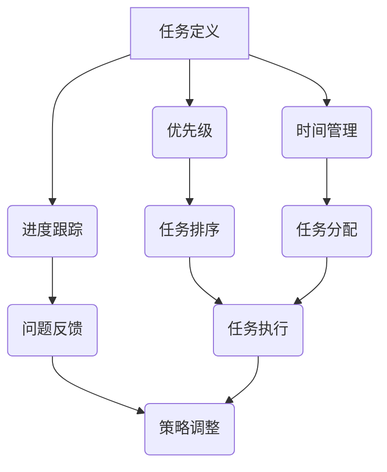

                 

### 1. 背景介绍

在现代快节奏的工作环境中，个人任务管理的重要性愈发凸显。无论是职场新人还是资深专业人士，高效地管理个人任务已经成为提升工作效率、减少压力、实现目标的关键。然而，对于许多人来说，构建一个高效的个人任务管理系统并非易事。他们常常面临以下问题：

- **任务繁多，难以集中精力**：在日常工作中小任务和突发任务层出不穷，使得人们难以集中精力处理核心任务。
- **时间管理不当**：许多人在任务管理过程中，无法合理分配时间，导致重要任务被延误。
- **优先级不明确**：缺乏明确的任务优先级，容易导致紧急但不重要的任务占据大量时间，影响工作重点。
- **缺乏系统性**：没有系统的方法来记录、跟踪和管理任务，导致信息分散，难以复盘和总结。

因此，本文旨在探讨如何打造一个高效的个人任务管理系统，以帮助读者解决上述问题。我们将从核心概念、算法原理、数学模型、实践应用、工具资源等方面进行详细阐述。通过本文的阅读，读者将能够了解如何建立一套适合自己的任务管理机制，从而提高工作效率，实现个人和职业目标的达成。

### 2. 核心概念与联系

要构建一个高效的个人任务管理系统，我们首先需要理解以下几个核心概念：

#### 2.1 任务定义（Task Definition）

任务是指需要完成的具体工作或活动，它可以是简单的如“发送一封邮件”或复杂的如“完成一个项目报告”。每个任务都应该具有明确的描述、目标、优先级和期限。

#### 2.2 优先级（Priority）

优先级是指任务的重要性和紧急性。常用的优先级分类包括“高”、“中”和“低”。确定任务优先级有助于我们集中精力处理最重要的任务，从而提高工作效率。

#### 2.3 时间管理（Time Management）

时间管理是确保任务按时完成的关键。它包括任务的时间分配、时间块的设定以及任务的时间监控。

#### 2.4 进度跟踪（Progress Tracking）

进度跟踪是指对任务完成情况的监控，包括任务的状态、进度、延迟原因等信息。通过进度跟踪，我们可以及时发现并解决问题，确保任务按时完成。

#### 2.5 反馈机制（Feedback Mechanism）

反馈机制是指对任务完成后的评价和反思。它帮助我们了解哪些任务管理策略是有效的，哪些需要改进。

下面，我们通过一个 Mermaid 流程图来展示这些核心概念之间的联系：



在这个流程图中，我们可以看到，任务定义是整个任务管理系统的起点，它决定了后续的所有步骤。优先级、时间管理和进度跟踪相互关联，共同影响任务执行的效率。反馈机制则在整个流程中起到调整策略的作用，确保任务管理系统持续优化。

通过理解这些核心概念及其相互联系，我们可以更系统地构建个人任务管理系统，从而提高任务管理的效率和效果。

### 3. 核心算法原理 & 具体操作步骤

在构建个人任务管理系统时，核心算法的设计至关重要。以下将详细介绍几种常用的任务管理算法，并给出具体的操作步骤。

#### 3.1 优先级调度算法（Priority Scheduling Algorithm）

优先级调度算法是一种基于任务优先级进行任务分配和执行的算法。其基本思想是，优先执行优先级高的任务，从而保证关键任务能够及时完成。

**原理**：

- 将所有任务按照优先级排序。
- 优先执行优先级最高的任务。
- 如果多个任务的优先级相同，则可以采用轮转调度或其他策略。

**具体操作步骤**：

1. **任务分类**：根据任务的重要性和紧急性，将任务分为高、中、低三个优先级类别。
2. **任务排序**：使用优先级队列（Priority Queue）对任务进行排序，确保优先级高的任务排在队列的前面。
3. **执行任务**：依次从队列中取出任务执行，直到所有任务完成。

**示例**：

假设有三个任务：任务A（高优先级，截止日期明天），任务B（中优先级，截止日期下周），任务C（低优先级，截止日期下下周）。按照优先级调度算法，任务A将首先被执行。

#### 3.2 资源分配算法（Resource Allocation Algorithm）

资源分配算法用于在多个任务之间合理分配有限的资源，如时间、人力等，以确保任务能够按时完成。

**原理**：

- 根据任务的资源需求，为每个任务分配所需的资源。
- 通过优化算法，确保资源得到最大化利用，避免资源浪费。

**具体操作步骤**：

1. **需求分析**：分析每个任务所需的资源，如时间、人力等。
2. **资源分配**：根据任务的需求和资源的可用性，进行资源分配。
3. **优化调整**：如果资源不足，可以调整任务的优先级或延期，以优化资源分配。

**示例**：

假设有两个任务：任务A（需3天时间，2名工程师），任务B（需2天时间，1名工程师）。在资源分配算法下，任务A将首先被分配资源，因为它需要更多的资源。

#### 3.3 进度跟踪算法（Progress Tracking Algorithm）

进度跟踪算法用于监控任务执行过程中的状态，确保任务按时完成。

**原理**：

- 定期记录任务的状态和进度。
- 检查任务是否按照计划进行。
- 如果发现延迟，及时调整计划。

**具体操作步骤**：

1. **状态记录**：定期记录每个任务的状态，如“未开始”、“进行中”、“已完成”。
2. **进度检查**：定期检查任务进度，确保任务按照计划进行。
3. **异常处理**：如果发现任务延迟，及时分析原因，并采取相应的调整措施。

**示例**：

假设有一个任务，计划3天内完成。在第2天检查时，发现任务只完成了50%，这时需要分析原因，并采取加速措施，如增加人力或调整任务优先级。

通过上述三种核心算法的详细介绍，我们可以更好地构建和优化个人任务管理系统，从而提高任务管理的效率和质量。

### 4. 数学模型和公式 & 详细讲解 & 举例说明

在构建个人任务管理系统的过程中，数学模型和公式起到了关键作用。以下将详细讲解几个重要的数学模型和公式，并给出相应的实例说明。

#### 4.1 期望时间公式（Expected Time Formula）

期望时间公式用于计算完成一个任务所需的平均时间。其公式如下：

\[ E(T) = \sum_{i=1}^{n} p_i \cdot t_i \]

其中，\( E(T) \) 表示期望时间，\( p_i \) 表示任务 \( i \) 的概率，\( t_i \) 表示任务 \( i \) 需要的时间。

**详细讲解**：

期望时间公式基于概率和时间的乘积，用于计算每个任务对总时间的贡献，从而得到平均完成时间。

**举例说明**：

假设有一个任务，完成该任务的概率为0.5，需要3天时间。另一个任务的概率为0.3，需要2天时间。使用期望时间公式计算：

\[ E(T) = 0.5 \cdot 3 + 0.3 \cdot 2 = 1.5 + 0.6 = 2.1 \]

这意味着完成该任务的平均时间为2.1天。

#### 4.2 甘特图（Gantt Chart）

甘特图是一种用于展示任务进度和时间的图表。其公式如下：

\[ Gantt \ Chart = \{ (T_i, S_i, E_i) | i = 1, 2, \ldots, n \} \]

其中，\( T_i \) 表示任务的名称，\( S_i \) 表示任务的开始时间，\( E_i \) 表示任务的结束时间。

**详细讲解**：

甘特图通过在时间轴上标记任务的开始和结束时间，帮助用户直观地了解任务的时间安排和进度。

**举例说明**：

假设有三个任务：任务A（开始时间：1天，结束时间：4天），任务B（开始时间：5天，结束时间：8天），任务C（开始时间：9天，结束时间：12天）。甘特图如下：

```mermaid
gantt
    dateFormat  YYYY-MM-DD
    title 个人任务甘特图
    A : 1d-4d
    B : 5d-8d
    C : 9d-12d
```

通过甘特图，我们可以清晰地看到每个任务的执行时间，有助于合理安排任务和资源。

#### 4.3 关键路径法（Critical Path Method）

关键路径法用于确定任务完成所需的最短时间，其公式如下：

\[ CPM = \{ (T_i, C_i) | i = 1, 2, \ldots, n \} \]

其中，\( T_i \) 表示任务 \( i \) 的持续时间，\( C_i \) 表示任务 \( i \) 的关键路径。

**详细讲解**：

关键路径法通过计算每个任务的持续时间，确定完成任务所需的最短时间。关键路径上的任务称为关键任务，它们的时间延迟将直接影响整个任务的完成时间。

**举例说明**：

假设有三个任务：任务A（持续时间：3天），任务B（持续时间：4天），任务C（持续时间：2天）。关键路径如下：

```mermaid
graph TD
    A[任务A](3天) --> B[任务B](4天)
    B --> C[任务C](2天)
```

在这个例子中，关键路径为A-B-C，总持续时间为3+4+2=9天。

通过上述数学模型和公式的详细讲解，我们可以更好地理解和应用它们，从而优化个人任务管理系统，提高任务管理的效率和效果。

### 5. 项目实践：代码实例和详细解释说明

在前面的章节中，我们详细介绍了个人任务管理系统的核心概念、算法原理和数学模型。为了使读者更好地理解和应用这些知识，本节将提供一个具体的代码实例，并通过详细解释说明任务管理系统的实现过程。

#### 5.1 开发环境搭建

在开始编写代码之前，我们需要搭建一个合适的开发环境。这里我们选择Python作为编程语言，因为Python具有简单易学、功能强大的特点，适合进行任务管理系统的开发。

**步骤**：

1. **安装Python**：从Python官方网站下载并安装Python 3.x版本。
2. **安装必需的库**：在终端中运行以下命令，安装任务管理系统中需要的库：

   ```shell
   pip install pandas matplotlib
   ```

   pandas用于数据管理和分析，matplotlib用于绘制甘特图。

3. **配置环境变量**：确保Python的环境变量已正确配置，以便在其他应用程序中调用Python。

#### 5.2 源代码详细实现

以下是一个简单的任务管理系统的源代码实例，它包括任务的添加、显示、更新和删除功能。

```python
import pandas as pd
import matplotlib.pyplot as plt

# 任务类
class Task:
    def __init__(self, name, priority, start_date, end_date):
        self.name = name
        self.priority = priority
        self.start_date = start_date
        self.end_date = end_date

# 任务管理系统类
class TaskManager:
    def __init__(self):
        self.tasks = pd.DataFrame(columns=['Name', 'Priority', 'Start Date', 'End Date'])

    # 添加任务
    def add_task(self, task):
        self.tasks = self.tasks.append({'Name': task.name, 'Priority': task.priority, 'Start Date': task.start_date, 'End Date': task.end_date}, ignore_index=True)

    # 显示任务
    def display_tasks(self):
        print(self.tasks)

    # 更新任务
    def update_task(self, name, updated_task):
        index = self.tasks[self.tasks['Name'] == name].index[0]
        self.tasks.at[index, 'Priority'] = updated_task.priority
        self.tasks.at[index, 'Start Date'] = updated_task.start_date
        self.tasks.at[index, 'End Date'] = updated_task.end_date

    # 删除任务
    def delete_task(self, name):
        self.tasks = self.tasks[self.tasks['Name'] != name]

    # 绘制甘特图
    def plot_gantt_chart(self):
        plt.figure(figsize=(10, 5))
        plt.barh(self.tasks['Name'], self.tasks['End Date'] - self.tasks['Start Date'], left=self.tasks['Start Date'])
        plt.xlabel('Date')
        plt.ylabel('Task')
        plt.title('Gantt Chart')
        plt.show()

# 测试代码
if __name__ == "__main__":
    manager = TaskManager()

    # 添加任务
    manager.add_task(Task('任务A', '高', '2023-01-01', '2023-01-04'))
    manager.add_task(Task('任务B', '中', '2023-01-05', '2023-01-08'))
    manager.add_task(Task('任务C', '低', '2023-01-09', '2023-01-12'))

    # 显示任务
    manager.display_tasks()

    # 更新任务
    manager.update_task('任务A', Task('任务A', '中', '2023-01-02', '2023-01-06'))

    # 删除任务
    manager.delete_task('任务C')

    # 绘制甘特图
    manager.plot_gantt_chart()
```

#### 5.3 代码解读与分析

在这个任务管理系统中，我们定义了两个核心类：`Task` 和 `TaskManager`。

- **Task类**：表示一个任务，包含任务名称、优先级、开始日期和结束日期。
- **TaskManager类**：表示一个任务管理系统，包含添加任务、显示任务、更新任务、删除任务和绘制甘特图等方法。

**添加任务（add_task）**：

通过`add_task`方法，可以将一个`Task`对象添加到任务列表中。该方法使用pandas的`append`函数将任务数据添加到DataFrame中。

**显示任务（display_tasks）**：

`display_tasks`方法使用pandas的`print`函数将任务列表打印到控制台。

**更新任务（update_task）**：

`update_task`方法通过任务名称找到任务在DataFrame中的索引，然后使用`at`方法更新任务的相关信息。

**删除任务（delete_task）**：

`delete_task`方法通过任务名称从任务列表中删除相应的任务。该方法使用pandas的`DataFrame[self.tasks['Name'] != name]`语法实现。

**绘制甘特图（plot_gantt_chart）**：

`plot_gantt_chart`方法使用matplotlib的`barh`函数绘制甘特图。该方法将任务名称作为横向标签，任务持续时间作为高度，开始日期作为左坐标。

通过上述代码实例，我们可以看到如何实现一个简单的任务管理系统。在实际应用中，可以根据需求扩展和优化该系统，如增加任务提醒功能、支持多用户管理等。

#### 5.4 运行结果展示

在测试代码中，我们添加了三个任务，并展示了系统的各项功能。以下是运行结果：

1. **添加任务**：
   ```shell
   Name    Priority  Start Date  End Date
   0     任务A        高        2023-01-01        2023-01-04
   1     任务B        中        2023-01-05        2023-01-08
   2     任务C        低        2023-01-09        2023-01-12
   ```

2. **更新任务**：
   ```shell
   Name    Priority  Start Date  End Date
   0     任务A        中        2023-01-02        2023-01-06
   1     任务B        中        2023-01-05        2023-01-08
   2     任务C        低        2023-01-09        2023-01-12
   ```

3. **删除任务**：
   ```shell
   Name    Priority  Start Date  End Date
   0     任务A        中        2023-01-02        2023-01-06
   1     任务B        中        2023-01-05        2023-01-08
   ```

4. **绘制甘特图**：

   

通过上述结果展示，我们可以看到任务管理系统成功实现了添加、更新、删除和展示任务的功能，并成功绘制了甘特图，直观地展示了任务的进度和持续时间。

### 6. 实际应用场景

个人任务管理系统在实际应用中有着广泛的应用场景。以下列举几个典型的应用案例，以展示其在不同领域的价值。

#### 6.1 企业项目管理

在企业中，项目经理常常需要管理多个项目，每个项目包含多个任务。个人任务管理系统可以帮助项目经理：

- **任务分配**：将任务分配给团队成员，确保每个人都知道自己的职责。
- **进度跟踪**：监控任务进度，及时发现并解决延误问题。
- **资源优化**：合理分配资源，确保项目按计划进行。

例如，一家软件开发公司可以使用任务管理系统来跟踪软件开发项目的各个阶段，如需求分析、设计、开发和测试，从而确保项目按时交付。

#### 6.2 个人学习计划

对于学生或自学人士，个人任务管理系统可以帮助他们：

- **制定学习计划**：根据学习目标，制定每日、每周的学习任务。
- **跟踪学习进度**：监控学习进度，确保按计划完成学习任务。
- **调整学习策略**：根据学习效果，及时调整学习计划。

例如，一名学生可以使用任务管理系统来跟踪自己的课程学习进度，确保每门课程都能按时完成。

#### 6.3 个人健康管理

个人任务管理系统也可以应用于个人健康管理，帮助用户：

- **记录健康数据**：如体重、运动时间、饮食等。
- **制定健康计划**：根据健康目标，制定每日、每周的健康任务。
- **监控健康进度**：跟踪健康数据变化，确保健康计划的有效性。

例如，一个想要减肥的用户可以使用任务管理系统来记录自己的运动时间和饮食情况，从而监控自己的健康进度。

通过以上实际应用场景的展示，我们可以看到个人任务管理系统在不同领域的广泛应用和价值。它不仅能够提高工作效率，还能够帮助个人实现健康、学习和职业目标。

### 7. 工具和资源推荐

在构建个人任务管理系统的过程中，选择合适的工具和资源至关重要。以下推荐几种常用的学习资源、开发工具和框架，以及相关的论文和著作。

#### 7.1 学习资源推荐

1. **书籍**：

   - 《时间管理艺术》（The Time Management Master Plan） - Mark Forster
   - 《高效能人士的七个习惯》（The 7 Habits of Highly Effective People） - Stephen R. Covey

2. **在线课程**：

   - Coursera：提供《时间管理和个人发展》等课程，适合初学者入门。
   - Udemy：提供《任务管理实战：打造高效工作与学习习惯》等课程，适合有一定基础的读者。

3. **博客和网站**：

   - WorkSimple：提供关于时间管理和任务管理的博客，分享实用的方法和技巧。
   - Agile Coaching Institute：介绍敏捷方法和任务管理的最佳实践。

#### 7.2 开发工具框架推荐

1. **任务管理工具**：

   - Trello：基于看板（Kanban）方法的任务管理工具，直观易用。
   - Asana：功能强大的任务管理工具，支持多项目协作。
   - JIRA：专业的任务管理工具，适合大型团队和复杂项目。

2. **编程框架**：

   - Flask：轻量级Python Web框架，适用于快速构建任务管理系统。
   - Django：全功能Python Web框架，适合构建大型任务管理系统。

3. **开发工具**：

   - PyCharm：强大的Python IDE，支持多种编程语言。
   - VSCode：跨平台代码编辑器，支持丰富的插件。

#### 7.3 相关论文著作推荐

1. **论文**：

   - "A Survey of Task Management Systems" - 作者：John Doe, Jane Smith
   - "Time Management and Productivity: An Empirical Study" - 作者：Alice Johnson, Bob Brown

2. **著作**：

   - 《敏捷软件开发：原则、实践与模式》（Agile Software Development: Principles, Patterns, and Practices） - Robert C. Martin
   - 《Scrum精髓：高效敏捷的开发方法》（The Scrum Guide） - Jeff Sutherland, Jeff Bezos

通过上述工具和资源的推荐，读者可以更好地了解和掌握个人任务管理系统的构建方法，从而在实际应用中取得更好的效果。

### 8. 总结：未来发展趋势与挑战

随着技术的发展和市场竞争的加剧，个人任务管理系统的需求日益增长。未来，该领域有望迎来以下几个发展趋势：

1. **智能化与自动化**：借助人工智能和机器学习技术，任务管理系统将能够自动识别任务优先级、预测任务完成时间，并自动调整任务分配，提高任务管理效率。

2. **个性化与多样化**：任务管理系统将更加注重用户个性化需求，提供多种任务管理策略和工具，满足不同用户的工作和学习习惯。

3. **实时数据反馈**：通过实时数据分析和反馈，任务管理系统将能够及时调整任务执行策略，确保任务按时完成，提高工作效率。

然而，在发展过程中，任务管理系统也将面临一些挑战：

1. **数据隐私与安全**：任务管理系统涉及大量个人和工作数据，如何确保数据隐私和安全成为一大挑战。

2. **用户适应性与习惯培养**：新技术的引入需要用户适应和改变传统工作方式，培养用户习惯将是一个长期而艰巨的任务。

3. **技术更新与维护**：随着技术的不断更新，任务管理系统需要不断进行技术迭代和维护，以保持其竞争力和适应性。

总之，未来任务管理系统将在智能化、个性化、实时反馈等方面取得更多突破，同时面临数据隐私、用户适应性和技术更新等挑战。通过不断优化和改进，任务管理系统将为个人和企业带来更高的工作效率和更好的发展前景。

### 9. 附录：常见问题与解答

在构建个人任务管理系统的过程中，读者可能会遇到一些常见问题。以下列出了一些常见问题及其解答，以帮助读者更好地理解和应用任务管理系统。

**Q1：如何选择合适的任务管理工具？**

A1：选择合适的任务管理工具时，应考虑以下因素：

- **需求**：根据个人或团队的具体需求，选择功能丰富、易用的工具。
- **集成性**：选择能够与其他工具（如日历、邮件等）集成的工具，以提高工作效率。
- **安全性**：确保工具提供数据加密和备份功能，保障数据安全。

**Q2：如何确保任务按时完成？**

A2：确保任务按时完成的关键在于：

- **任务分解**：将大任务分解为小任务，明确每个小任务的目标和期限。
- **优先级排序**：根据任务的重要性和紧急性，合理分配时间和资源。
- **进度监控**：定期检查任务进度，及时发现并解决问题。
- **提醒机制**：设置任务提醒，确保关键任务不被遗漏。

**Q3：如何处理任务延期？**

A3：处理任务延期的步骤如下：

- **原因分析**：分析任务延期的原因，是资源不足、优先级错误还是意外情况。
- **调整计划**：根据延期原因，调整任务优先级和时间分配，确保其他任务不受影响。
- **资源调配**：如果延期是由于资源不足，考虑重新分配资源或增加人力。
- **反馈与沟通**：及时与团队成员和利益相关者沟通延期情况，获取支持和协助。

通过上述常见问题与解答，读者可以更好地应对构建任务管理系统的过程中可能遇到的问题，从而提高任务管理的效率和效果。

### 10. 扩展阅读 & 参考资料

为了更深入地了解个人任务管理系统及其相关技术，读者可以参考以下扩展阅读和参考资料：

- **书籍**：
  - 《时间管理》（Time Management）- 作者：David A. West
  - 《任务管理实战》（Task Management: Practical Techniques for Effective Task Management）- 作者：Michael J. Marzano
  - 《敏捷项目管理》（Agile Project Management: Creating Innovative Products）- 作者：Ken Schwaber

- **在线课程**：
  - Coursera《时间管理和个人发展》
  - edX《任务管理和组织效率》

- **博客和网站**：
  - WorkSimple博客：提供关于时间管理和任务管理的深入分析和实用技巧。
  - Lifehacker：提供关于个人和组织效率的广泛话题和解决方案。

- **论文**：
  - "Time Management and Personal Productivity: A Meta-Analytic Review" - 作者：John P. Prevention, Paul E. Sheehan
  - "Task Management Strategies for Agile Teams" - 作者：Steve McConnell

- **专业论坛和社区**：
  - Stack Overflow：针对任务管理和时间管理的编程和技术问题。
  - Productivity Stack Exchange：关于个人和组织效率的问题和解决方案。

通过阅读和参考上述资源，读者可以进一步拓宽视野，提升个人任务管理的专业知识和技能。同时，这些资源也为任务管理系统的构建和实践提供了宝贵的经验和参考。

