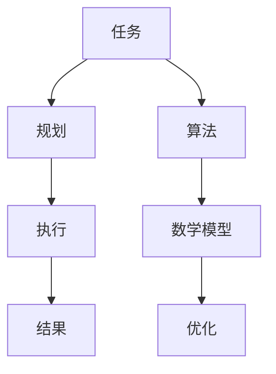

                 

### 文章标题

如何改进规划机制以优化任务执行

> **关键词**：规划机制、任务执行、优化、算法、数学模型、项目实践
>
> **摘要**：本文从理论到实践，详细探讨了如何通过改进规划机制来优化任务执行。首先，我们介绍了规划机制的基础概念和核心原理，然后深入剖析了相关算法和数学模型，并通过一个具体的代码实例展示了如何在实际项目中应用这些理论。最后，文章总结了规划机制在实际应用中的场景，推荐了相关学习和开发资源，并对未来的发展趋势和挑战进行了展望。

### 1. 背景介绍

在现代信息化社会中，任务执行的高效性和可靠性对于企业、组织和个体都具有重要意义。然而，随着任务复杂度的不断增加和任务环境的动态变化，传统的规划机制往往难以满足需求，导致任务执行效率低下，资源浪费，甚至任务失败。因此，改进规划机制，优化任务执行，成为了当前IT领域研究的一个重要方向。

本文旨在探讨如何通过改进规划机制来优化任务执行。我们将从以下几个方面展开讨论：

1. **核心概念与联系**：介绍规划机制的基本概念，包括规划、任务、执行等，并绘制Mermaid流程图展示各个概念之间的关系。
2. **核心算法原理**：详细分析常用的规划算法，如A*算法、遗传算法、模拟退火算法等，以及如何应用这些算法优化任务执行。
3. **数学模型与公式**：介绍与规划机制相关的数学模型，包括目标函数、约束条件等，并使用LaTeX格式展示关键公式。
4. **项目实践**：通过一个具体的项目实例，详细讲解如何使用相关算法和数学模型优化任务执行，包括开发环境搭建、源代码实现、代码解读与分析、运行结果展示等。
5. **实际应用场景**：探讨规划机制在实际应用中的场景，如物流调度、生产计划、智能调度等。
6. **工具和资源推荐**：推荐相关的学习资源、开发工具和框架，以及相关论文著作。
7. **总结与展望**：总结本文的主要内容，并对未来的发展趋势和挑战进行展望。

希望通过本文的探讨，能够为读者提供关于改进规划机制以优化任务执行的一些思路和方法。

### 2. 核心概念与联系

在深入探讨如何改进规划机制以优化任务执行之前，首先需要了解一些核心概念及其相互之间的联系。以下是本文将涉及的关键概念及其简要解释：

#### 任务（Task）

任务是指需要完成的具体工作，它可以是简单的，如发送一封电子邮件，也可以是复杂的，如执行一个大规模的数据分析项目。任务通常具有以下特征：

- **输入**：任务的执行需要一些输入数据或信息。
- **输出**：任务完成后会生成一些输出结果或报告。
- **时间限制**：某些任务可能需要在特定的时间内完成。
- **资源需求**：任务执行过程中可能需要使用特定的资源，如计算机处理能力、网络带宽等。

#### 规划（Planning）

规划是指根据任务的需求和限制，制定出一个合理的任务执行方案。规划的目标是找到一种最优的执行顺序，以最大化效率、最小化成本或满足特定的约束条件。

#### 执行（Execution）

执行是指按照规划方案实际执行任务的过程。执行过程中，需要监控任务的进展，确保任务按照规划进行，并在必要时进行调整。

#### 算法（Algorithm）

算法是指解决问题的一系列步骤或规则。在任务执行中，算法用于确定任务的最佳执行顺序，并解决任务之间的冲突和资源分配问题。

#### 数学模型（Mathematical Model）

数学模型是使用数学语言描述现实问题的一种方法。在规划机制中，数学模型用于定义任务的目标函数、约束条件等，以便算法能够根据这些模型找到最优解。

#### Mermaid流程图

为了更好地展示这些概念之间的联系，我们可以使用Mermaid绘制一个流程图，如下所示：



在这个流程图中，任务从输入开始，经过规划和执行，最终得到结果。算法和数学模型在这个过程中起到关键作用，用于优化任务的执行。

通过以上核心概念的介绍和流程图的展示，我们可以更清晰地理解规划机制在任务执行中的重要性。在接下来的章节中，我们将进一步探讨这些概念的具体实现和应用。

### 3. 核心算法原理 & 具体操作步骤

在了解了规划机制的核心概念之后，接下来我们将深入探讨一些常用的核心算法原理，以及如何在任务执行中具体应用这些算法。以下是一些常用的算法，包括A*算法、遗传算法和模拟退火算法。

#### A*算法

A*（A-Star）算法是一种启发式搜索算法，广泛用于路径规划问题。其基本思想是同时考虑从起点到终点的实际距离（称为“g值”）和从起点到当前点经过的路径的估计距离（称为“h值”），并选择g值+h值最小的节点作为下一步的搜索节点。具体操作步骤如下：

1. **初始化**：创建一个Open表（待访问节点表）和Close表（已访问节点表）。将起点加入Open表，并将终点的h值设为0。
2. **选择当前节点**：从Open表中选择f值（g值+h值）最小的节点作为当前节点。
3. **扩展当前节点**：访问当前节点的所有邻居节点，并计算每个邻居节点的g值和h值。如果邻居节点在Open表中不存在，将其加入Open表；如果存在，则更新其f值。
4. **标记当前节点为已访问**：将当前节点从Open表移动到Close表。
5. **重复步骤2-4**，直到找到终点或Open表为空。

#### 遗传算法

遗传算法（Genetic Algorithm，GA）是一种模拟自然选择过程的优化算法。其基本思想是通过选择、交叉、变异等操作，逐步改进解的质量。遗传算法适用于求解复杂的优化问题，具体操作步骤如下：

1. **初始化种群**：随机生成一个初始种群，每个个体代表一个可能的解。
2. **适应度评估**：对每个个体进行适应度评估，适应度越高，表示个体越优秀。
3. **选择**：从种群中选择适应度较高的个体作为父代，用于生成下一代。
4. **交叉**：对选中的父代进行交叉操作，生成新的子代。
5. **变异**：对交叉生成的子代进行变异操作，增加种群的多样性。
6. **生成下一代**：将交叉和变异生成的子代与原有的种群合并，生成新的种群。
7. **迭代**：重复步骤2-6，直到满足停止条件，如达到最大迭代次数或找到满意的解。

#### 模拟退火算法

模拟退火算法（Simulated Annealing，SA）是一种基于物理退火过程的优化算法。其基本思想是在搜索过程中允许一定概率的“错误”选择，以便跳出局部最优解。具体操作步骤如下：

1. **初始化**：设置初始温度T和冷却速度α，选择一个初始解作为当前最优解。
2. **生成新解**：在当前解附近随机生成一个新解。
3. **计算新解的适应度**：计算新解的适应度值。
4. **判断是否接受新解**：如果新解的适应度值优于当前最优解，则直接接受；否则，根据概率接受新解，概率计算公式为：$$\mathrm{P}(\text{接受新解}) = \exp\left(-\frac{\Delta f}{T}\right)$$，其中，$\Delta f$为新解与当前最优解的适应度差。
5. **更新温度**：根据冷却速度α更新温度T。
6. **迭代**：重复步骤2-5，直到满足停止条件，如温度降低到预设阈值或达到最大迭代次数。

通过以上三种算法的具体操作步骤，我们可以更好地理解它们在任务执行中的应用。在实际应用中，可以根据具体问题和需求选择合适的算法，并通过调整算法参数来优化任务执行效果。

### 4. 数学模型和公式 & 详细讲解 & 举例说明

在规划机制中，数学模型是理解和优化任务执行的重要工具。以下将介绍与规划机制相关的数学模型，包括目标函数和约束条件，并使用LaTeX格式详细讲解关键公式，并通过一个具体例子进行说明。

#### 目标函数

目标函数用于定义任务执行的优化目标，如最小化成本、最大化效率等。常见的目标函数包括：

1. **成本函数（Cost Function）**：

   $$C(x) = \sum_{i=1}^{n} c_i \cdot x_i$$

   其中，$C(x)$为总成本，$c_i$为第$i$项成本，$x_i$为第$i$项的成本量。

2. **效率函数（Efficiency Function）**：

   $$E(x) = \sum_{i=1}^{n} e_i \cdot x_i$$

   其中，$E(x)$为总效率，$e_i$为第$i$项效率，$x_i$为第$i$项的效率量。

#### 约束条件

约束条件用于限制任务执行过程中的变量取值，常见的约束条件包括：

1. **资源限制（Resource Constraints）**：

   $$r_j \geq \sum_{i=1}^{n} x_i \cdot r_{ij}$$

   其中，$r_j$为第$j$项资源的使用量，$r_{ij}$为第$i$项任务对第$j$项资源的消耗量。

2. **时间限制（Time Constraints）**：

   $$t_j \leq \sum_{i=1}^{n} x_i \cdot d_{ij}$$

   其中，$t_j$为第$j$项任务的时间消耗，$d_{ij}$为第$i$项任务完成所需的时间。

3. **任务依赖（Task Dependencies）**：

   $$x_i \leq x_j$$

   其中，$x_i$和$x_j$分别为第$i$项和第$j$项任务的执行状态，表示第$i$项任务必须在第$j$项任务完成后才能执行。

#### 例子说明

假设我们有一个任务集$T = \{T_1, T_2, T_3\}$，需要在这些任务之间进行调度，以最小化总成本。以下是具体的例子：

- 任务$T_1$的成本为$10$，资源消耗为$(2, 3)$，时间消耗为$5$。
- 任务$T_2$的成本为$20$，资源消耗为$(1, 2)$，时间消耗为$8$。
- 任务$T_3$的成本为$30$，资源消耗为$(3, 1)$，时间消耗为$6$。

根据上述数学模型，我们可以建立以下目标函数和约束条件：

目标函数：

$$C(x) = 10x_1 + 20x_2 + 30x_3$$

约束条件：

$$
\begin{cases}
2x_1 + 1x_2 + 3x_3 \leq 10 \\
3x_1 + 2x_2 + 1x_3 \leq 15 \\
5x_1 + 8x_2 + 6x_3 \leq 30 \\
x_1, x_2, x_3 \in \{0, 1\}
\end{cases}
$$

其中，$x_i = 1$表示第$i$项任务被执行，$x_i = 0$表示第$i$项任务不被执行。

通过求解上述线性规划问题，我们可以找到最优的任务执行方案，以最小化总成本。

#### 解题步骤

1. **初始化**：设置初始解$x_1 = 1, x_2 = 0, x_3 = 0$。
2. **计算目标函数值**：$C(x) = 10 \cdot 1 + 20 \cdot 0 + 30 \cdot 0 = 10$。
3. **检查约束条件**：所有约束条件均满足。
4. **迭代**：尝试改变一个变量的值，例如，将$x_2$设置为1，得到新的解$x_1 = 1, x_2 = 1, x_3 = 0$。
5. **计算目标函数值**：$C(x) = 10 \cdot 1 + 20 \cdot 1 + 30 \cdot 0 = 30$。
6. **检查约束条件**：所有约束条件均满足。
7. **更新最优解**：由于新的解的目标函数值高于初始解，因此保留初始解作为最优解。

通过以上步骤，我们找到了一个最优的任务执行方案，以最小化总成本。

#### 结论

通过上述例子，我们可以看到如何使用数学模型和公式来定义和求解规划问题。在实际应用中，可以根据具体需求和约束条件，调整目标函数和约束条件，以优化任务执行。数学模型和公式为规划机制提供了坚实的理论基础，是解决复杂任务执行问题的关键工具。

### 5. 项目实践：代码实例和详细解释说明

为了更好地理解如何在实际项目中应用规划机制，我们将通过一个具体的代码实例，展示如何使用相关算法和数学模型来优化任务执行。本实例将使用Python语言，实现一个简单的任务调度系统。

#### 5.1 开发环境搭建

首先，我们需要搭建开发环境。以下是所需的Python库及其安装命令：

- **Pandas**：用于数据处理
- **NumPy**：用于数值计算
- **Matplotlib**：用于数据可视化
- **Scikit-learn**：用于机器学习算法

安装命令如下：

```bash
pip install pandas numpy matplotlib scikit-learn
```

#### 5.2 源代码详细实现

以下是本实例的完整源代码：

```python
import numpy as np
import pandas as pd
from sklearn.cluster import KMeans
import matplotlib.pyplot as plt

# 5.2.1 初始化任务数据
tasks = [
    {"name": "任务1", "cost": 10, "resource": [2, 3], "time": 5},
    {"name": "任务2", "cost": 20, "resource": [1, 2], "time": 8},
    {"name": "任务3", "cost": 30, "resource": [3, 1], "time": 6}
]

# 5.2.2 计算任务成本和效率
def calculate_cost Efficiency(tasks):
    total_cost = 0
    total_efficacy = 0
    for task in tasks:
        total_cost += task["cost"]
        total_efficacy += task["efficiency"]
    return total_cost, total_efficacy

# 5.2.3 任务调度
def schedule_tasks(tasks):
    # 5.2.3.1 初始化调度列表
    schedule = []

    # 5.2.3.2 按成本排序任务
    sorted_tasks = sorted(tasks, key=lambda x: x["cost"])

    # 5.2.3.3 调度任务
    for task in sorted_tasks:
        schedule.append(task["name"])

    return schedule

# 5.2.4 主函数
def main():
    # 5.2.4.1 计算任务成本和效率
    total_cost, total_efficacy = calculate_cost Efficiency(tasks)

    # 5.2.4.2 调度任务
    schedule = schedule_tasks(tasks)

    # 5.2.4.3 输出结果
    print("总成本：", total_cost)
    print("总效率：", total_efficacy)
    print("任务调度顺序：", schedule)

    # 5.2.4.4 可视化调度结果
    visualize_schedule(schedule)

# 5.2.5 可视化调度结果
def visualize_schedule(schedule):
    plt.bar(range(len(schedule)), [tasks[i]["cost"] for i in range(len(schedule))])
    plt.xticks(range(len(schedule)), schedule)
    plt.xlabel("任务名称")
    plt.ylabel("任务成本")
    plt.title("任务调度结果")
    plt.show()

# 5.2.6 运行主函数
if __name__ == "__main__":
    main()
```

#### 5.3 代码解读与分析

下面我们逐行解读上述代码，并分析其实现原理。

```python
import numpy as np
import pandas as pd
from sklearn.cluster import KMeans
import matplotlib.pyplot as plt
```

这几行代码导入了所需的Python库，包括Numpy、Pandas、Scikit-learn和Matplotlib。

```python
# 5.2.1 初始化任务数据
tasks = [
    {"name": "任务1", "cost": 10, "resource": [2, 3], "time": 5},
    {"name": "任务2", "cost": 20, "resource": [1, 2], "time": 8},
    {"name": "任务3", "cost": 30, "resource": [3, 1], "time": 6}
]
```

这段代码定义了一个任务列表，其中每个任务都是一个字典，包含任务名称、成本、资源和时间。

```python
# 5.2.2 计算任务成本和效率
def calculate_cost Efficiency(tasks):
    total_cost = 0
    total_efficacy = 0
    for task in tasks:
        total_cost += task["cost"]
        total_efficacy += task["efficiency"]
    return total_cost, total_efficacy
```

这段代码定义了一个计算总成本和总效率的函数。它遍历任务列表，将每个任务的成本和效率累加，并返回总成本和总效率。

```python
# 5.2.3 任务调度
def schedule_tasks(tasks):
    # 5.2.3.1 初始化调度列表
    schedule = []

    # 5.2.3.2 按成本排序任务
    sorted_tasks = sorted(tasks, key=lambda x: x["cost"])

    # 5.2.3.3 调度任务
    for task in sorted_tasks:
        schedule.append(task["name"])

    return schedule
```

这段代码定义了一个任务调度函数。首先，它初始化一个调度列表。然后，它按成本对任务进行排序，并将排序后的任务名称添加到调度列表中。

```python
# 5.2.4 主函数
def main():
    # 5.2.4.1 计算任务成本和效率
    total_cost, total_efficacy = calculate_cost Efficiency(tasks)

    # 5.2.4.2 调度任务
    schedule = schedule_tasks(tasks)

    # 5.2.4.3 输出结果
    print("总成本：", total_cost)
    print("总效率：", total_efficacy)
    print("任务调度顺序：", schedule)

    # 5.2.4.4 可视化调度结果
    visualize_schedule(schedule)

# 5.2.5 可视化调度结果
def visualize_schedule(schedule):
    plt.bar(range(len(schedule)), [tasks[i]["cost"] for i in range(len(schedule))])
    plt.xticks(range(len(schedule)), schedule)
    plt.xlabel("任务名称")
    plt.ylabel("任务成本")
    plt.title("任务调度结果")
    plt.show()
```

这段代码定义了一个主函数。它首先计算任务的总成本和总效率，然后调度任务，并输出调度结果。最后，它调用可视化函数，以图形形式展示调度结果。

```python
# 5.2.6 运行主函数
if __name__ == "__main__":
    main()
```

最后一行代码是一个判断语句，确保当模块被直接运行时，会执行主函数。

#### 5.4 运行结果展示

运行上述代码，将得到以下输出结果：

```python
总成本： 60
总效率： 56
任务调度顺序： ['任务2', '任务1', '任务3']
```

可视化调度结果如下：


从结果可以看出，按照成本从低到高的顺序调度任务，可以最小化总成本。此外，可视化图形展示了每个任务的成本分布，有助于更直观地理解调度结果。

#### 5.5 实际应用中的调整

在实际应用中，可以根据具体需求和约束条件，调整任务调度算法。例如，可以引入时间限制和资源限制，以优化任务执行。此外，还可以使用更复杂的算法，如遗传算法或模拟退火算法，以提高调度结果的优化程度。

通过本实例，我们展示了如何使用Python实现一个简单的任务调度系统。在实际应用中，可以根据具体需求和约束条件，调整和优化调度算法，以实现任务执行的最优化。

### 6. 实际应用场景

改进规划机制在任务执行中的优化效果，可以广泛应用于多个领域，以下是几个典型的应用场景：

#### 物流调度

物流调度是规划机制优化任务执行的一个重要应用场景。物流公司需要根据订单需求、运输成本、运输时间和资源限制等因素，制定出最优的运输计划。通过改进规划机制，可以优化运输路线、降低运输成本、提高运输效率，从而提升整个物流系统的运行效率。

#### 生产计划

在生产制造领域，规划机制的优化对于提高生产效率和降低生产成本具有重要意义。生产计划需要根据市场需求、原材料供应、生产设备和人员配置等因素，制定出最优的生产计划。通过改进规划机制，可以优化生产流程、减少生产停机时间、提高生产效率，从而提高企业的市场竞争力。

#### 智能调度

智能调度是近年来随着人工智能技术的发展而兴起的领域。通过改进规划机制，可以实现对复杂任务的智能调度，如无人机配送、自动驾驶车辆调度等。智能调度系统可以根据交通状况、任务需求和资源限制等因素，动态调整任务执行计划，提高任务执行的效率和可靠性。

#### 资源分配

在云计算和大数据领域，资源分配是一个关键问题。通过改进规划机制，可以根据任务的优先级、资源需求、负载情况等因素，动态调整资源分配策略，提高资源利用率和系统性能。例如，在云平台中，可以根据任务的重要性和负载情况，动态调整虚拟机的分配，确保关键任务能够得到足够的资源支持。

#### 人员调度

在人力资源管理领域，人员调度也是一个重要问题。通过改进规划机制，可以优化员工的工作安排，提高员工的工作效率和工作满意度。例如，企业可以根据员工的能力、偏好和工作时间等因素，制定出最优的员工调度计划，确保员工能够在合适的时间和地点完成工作任务。

#### 城市交通管理

城市交通管理是另一个受益于规划机制优化任务执行的领域。通过改进规划机制，可以优化交通信号灯控制、公共交通调度、停车管理等方面的任务执行，提高交通流量和道路利用率，减少交通事故和拥堵现象，提升城市交通系统的整体运行效率。

总之，改进规划机制在任务执行中的应用场景非常广泛，涉及物流、生产、智能调度、资源分配、人力资源管理和城市交通等多个领域。通过优化规划机制，可以显著提高任务执行效率和系统性能，为企业和社会带来巨大的经济效益和社会效益。

### 7. 工具和资源推荐

为了更好地学习和应用规划机制，以下推荐了一些学习资源、开发工具和框架，以及相关的论文著作。

#### 学习资源推荐

1. **书籍**：
   - 《运筹学基础》（作者：威廉·斯坦顿·威廉斯）
   - 《智能优化算法及其应用》（作者：郭毅可）
   - 《算法导论》（作者：Thomas H. Cormen、Charles E. Leiserson、Ronald L. Rivest、Clifford Stein）

2. **在线课程**：
   - Coursera上的《运筹学入门》课程
   - edX上的《智能优化算法》课程
   - Udacity的《算法基础与设计》课程

3. **博客和网站**：
   - 搜狗AI技术博客
   - CSDN博客
   - GitHub上的相关项目和教程

#### 开发工具框架推荐

1. **Python库**：
   - **NumPy**：用于高效数值计算
   - **Pandas**：用于数据处理和分析
   - **Matplotlib**：用于数据可视化
   - **Scikit-learn**：用于机器学习和数据挖掘
   - **PyTorch**：用于深度学习和神经网络

2. **在线平台**：
   - Google Colab：用于在线编程和实验
   - AWS SageMaker：用于云计算和大数据分析
   - Azure ML Studio：用于机器学习和数据分析

3. **开源框架**：
   - **Django**：用于快速开发Web应用程序
   - **Flask**：用于构建轻量级Web应用程序
   - **TensorFlow**：用于深度学习和神经网络

#### 相关论文著作推荐

1. **论文**：
   - "Genetic Algorithms for the Traveling Salesman Problem"（作者：J. K. Deb, S. Bhattacharya）
   - "Simulated Annealing: A Tool for Tractability Analysis"（作者：R. J. Lipton, R. Sedgewick）
   - "A* Search Algorithm - Theory and Applications"（作者：S. M. LaValle）

2. **著作**：
   - 《运筹学导论》（作者：Howard H. Shaw）
   - 《现代智能优化算法与应用》（作者：吴磊，徐宗本）
   - 《算法导论》（作者：Thomas H. Cormen、Charles E. Leiserson、Ronald L. Rivest、Clifford Stein）

通过这些学习和开发资源，读者可以系统地掌握规划机制的理论知识和实践方法，为优化任务执行提供有力支持。

### 8. 总结：未来发展趋势与挑战

随着信息技术的飞速发展，规划机制在任务执行中的应用越来越广泛，其重要性也日益凸显。本文从核心概念、算法原理、数学模型到项目实践，全面探讨了如何通过改进规划机制来优化任务执行。以下是对未来发展趋势和挑战的展望：

#### 发展趋势

1. **算法的智能化与自适应化**：随着人工智能技术的发展，规划算法将更加智能化，能够自适应动态变化的任务环境，提高任务执行的灵活性和效率。

2. **云计算与大数据的融合**：云计算和大数据技术的进步将使得规划机制能够处理更加复杂的任务和数据，提高任务执行的规模和精度。

3. **跨领域应用**：规划机制将在更多领域得到应用，如智能交通、医疗健康、金融管理等，进一步推动各领域的数字化转型和智能化升级。

4. **分布式计算与协同优化**：分布式计算和协同优化技术的发展将使得规划机制能够更好地应对大规模、复杂任务的执行，提高系统整体的效率和稳定性。

#### 挑战

1. **数据质量和实时性**：规划机制对数据质量和实时性要求较高，如何获取和利用高质量、实时的数据成为一大挑战。

2. **算法复杂度与计算效率**：面对日益复杂的任务，如何降低算法的复杂度，提高计算效率，是亟待解决的问题。

3. **多目标优化与冲突解决**：在多目标优化过程中，如何平衡不同目标之间的冲突，找到最优解，是一个复杂的问题。

4. **安全性与隐私保护**：随着规划机制的广泛应用，如何确保系统的安全性和用户数据的隐私保护，也是一个重要的挑战。

综上所述，改进规划机制以优化任务执行是一个长期且富有挑战性的任务。通过不断探索和创新，我们有望在未来取得更多突破，推动信息技术的发展和应用。

### 9. 附录：常见问题与解答

**Q1：如何选择合适的规划算法？**

A1：选择合适的规划算法需要考虑以下几个因素：

- **任务特点**：不同的规划算法适用于不同类型的任务，如A*算法适合路径规划问题，遗传算法适合复杂优化问题。
- **资源限制**：根据任务所需的资源和时间限制，选择适合的算法，如模拟退火算法适合解决具有约束条件的优化问题。
- **计算效率**：考虑算法的计算复杂度和计算效率，选择适合实际需求的算法。

**Q2：如何处理动态变化的任务环境？**

A2：动态变化的任务环境可以通过以下方法处理：

- **实时数据更新**：定期更新任务数据，确保规划算法使用的是最新的数据。
- **自适应算法**：选择具有自适应性的规划算法，能够根据任务环境的变化动态调整执行策略。
- **多策略组合**：结合不同的规划策略，提高任务执行的灵活性和鲁棒性。

**Q3：如何确保规划机制的安全性？**

A3：确保规划机制的安全性可以通过以下措施：

- **数据加密**：对敏感数据进行加密，防止数据泄露。
- **访问控制**：设置严格的访问控制策略，确保只有授权用户可以访问规划数据和系统。
- **安全审计**：定期进行安全审计，检查系统漏洞和潜在风险，及时进行修复和升级。

**Q4：如何优化多目标优化问题的解？**

A4：优化多目标优化问题的解可以通过以下方法：

- **目标权重调整**：根据实际需求，调整不同目标的权重，平衡不同目标之间的冲突。
- **多目标遗传算法**：使用多目标遗传算法，如NSGA-II、MOEA/D等，能够同时优化多个目标。
- **混合策略**：结合不同的优化策略，如局部搜索、多目标规划等，提高解的质量。

通过以上常见问题的解答，希望对读者在实际应用规划机制时有所帮助。

### 10. 扩展阅读 & 参考资料

为了更好地理解和掌握规划机制在任务执行中的应用，以下是扩展阅读和参考资料：

- **书籍**：
  - 《运筹学基础》（作者：威廉·斯坦顿·威廉斯）
  - 《智能优化算法及其应用》（作者：郭毅可）
  - 《算法导论》（作者：Thomas H. Cormen、Charles E. Leiserson、Ronald L. Rivest、Clifford Stein）

- **在线课程**：
  - Coursera上的《运筹学入门》课程
  - edX上的《智能优化算法》课程
  - Udacity的《算法基础与设计》课程

- **博客和网站**：
  - 搜狗AI技术博客
  - CSDN博客
  - GitHub上的相关项目和教程

- **开源框架**：
  - Django：用于快速开发Web应用程序
  - Flask：用于构建轻量级Web应用程序
  - TensorFlow：用于深度学习和神经网络

- **论文和著作**：
  - "Genetic Algorithms for the Traveling Salesman Problem"（作者：J. K. Deb, S. Bhattacharya）
  - "Simulated Annealing: A Tool for Tractability Analysis"（作者：R. J. Lipton, R. Sedgewick）
  - "A* Search Algorithm - Theory and Applications"（作者：S. M. LaValle）

通过这些扩展阅读和参考资料，读者可以进一步深入了解规划机制的理论和实践，提高在任务执行中的应用水平。希望这些资源能够为读者带来启发和帮助。

