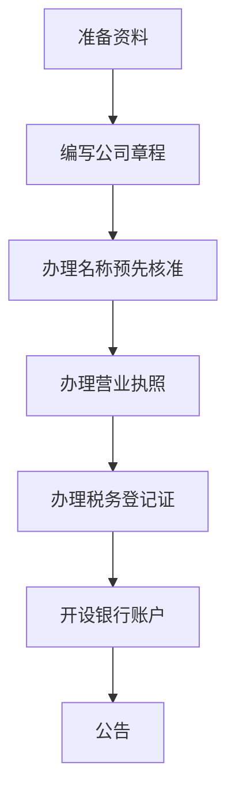

                 

### 1. 背景介绍

#### 什么是有限责任公司？

有限责任公司（Limited Liability Company，简称LLC）是一种由美国开创，随后在全球范围内得到广泛应用的企业法律形式。其特点在于，股东对公司的债务承担有限责任，即股东的责任限于其出资额，不必对公司债务承担无限连带责任。

在我国，有限责任公司作为一种重要的企业法律形式，受到了广泛的应用。根据我国《公司法》的规定，设立有限责任公司需要满足一定的条件和程序。本文将重点介绍如何注册一人有限责任公司，这主要适用于那些希望以个人名义创办公司的创业者。

#### 注册一人有限责任公司的必要性

随着经济全球化的发展，越来越多的个人开始尝试创业。而注册一人有限责任公司，在一定程度上，有助于创业者实现其创业梦想。其必要性主要体现在以下几个方面：

1. **降低创业风险**：一人有限责任公司在法律上对股东的责任承担是有限的，这意味着股东只需承担其出资额的风险，不会因为公司的债务问题而影响到个人其他资产。

2. **简化管理**：一人有限责任公司由于只有一名股东，因此管理相对简单，决策更加高效。

3. **利于股权激励**：一人有限责任公司在设立时，可以直接确定股权比例，有利于后续的股权激励计划。

#### 文章结构

本文将按照以下结构进行撰写：

1. **背景介绍**：介绍有限责任公司的定义和特点，以及注册一人有限责任公司的必要性。
2. **核心概念与联系**：详细讲解注册一人有限责任公司所需具备的核心概念，并提供流程图。
3. **核心算法原理 & 具体操作步骤**：详细阐述注册一人有限责任公司的具体步骤。
4. **数学模型和公式 & 详细讲解 & 举例说明**：介绍相关的数学模型和公式，并结合实际案例进行说明。
5. **项目实践：代码实例和详细解释说明**：通过代码实例，详细解释注册一人有限责任公司的实现过程。
6. **实际应用场景**：讨论一人有限责任公司在不同领域的应用。
7. **工具和资源推荐**：推荐相关的学习资源和开发工具。
8. **总结：未来发展趋势与挑战**：总结一人有限责任公司的发展趋势，以及面临的挑战。
9. **附录：常见问题与解答**：回答读者可能关心的一些常见问题。
10. **扩展阅读 & 参考资料**：提供进一步的阅读材料。

通过以上结构，我们将全面、系统地介绍如何注册一人有限责任公司，帮助读者更好地理解和应用这一法律形式。

### 2. 核心概念与联系

#### 核心概念

注册一人有限责任公司，首先需要理解以下几个核心概念：

1. **有限责任公司（LLC）**：有限责任公司是一种企业法律形式，其特点在于股东对公司债务承担有限责任。具体而言，股东只需承担其出资额的风险，不必对公司债务承担无限连带责任。

2. **一人有限责任公司**：一人有限责任公司，是指只有一个股东的有限责任公司。这种形式的有限责任公司在管理上相对简单，决策更加高效。

3. **注册资本**：注册资本是指公司在设立时实缴的出资额。在我国，设立一人有限责任公司的最低注册资本为30万元。

4. **营业执照**：营业执照是公司合法经营的证明文件。设立一人有限责任公司，首先需要办理营业执照。

5. **公司章程**：公司章程是公司的基本法律文件，规定了公司的组织结构、运营管理等方面的内容。

6. **税务登记证**：税务登记证是公司依法纳税的证明文件。设立一人有限责任公司，还需要办理税务登记。

#### 联系

为了更好地理解这些概念之间的关系，我们使用Mermaid流程图来展示注册一人有限责任公司的整体流程。以下是一个简单的流程图示例：



- **A[准备资料]**：在注册一人有限责任公司之前，首先需要准备相关资料，如公司章程、股东身份证等。
- **B[编写公司章程]**：根据相关法律法规，编写符合要求的公司章程。
- **C[办理名称预先核准]**：向工商行政管理部门申请公司名称预先核准。
- **D[办理营业执照]**：提交申请材料，办理营业执照。
- **E[办理税务登记证]**：办理税务登记证，确保公司能够依法纳税。
- **F[开设银行账户]**：开设公司银行账户，以便进行资金管理。
- **G[公告]**：在指定媒体上公告公司设立情况。

通过上述流程，我们可以看到，注册一人有限责任公司需要完成多个步骤，每个步骤都有其特定的法律要求和操作流程。

### 3. 核心算法原理 & 具体操作步骤

#### 核心算法原理

注册一人有限责任公司的核心算法原理主要涉及以下几个方面：

1. **公司名称的选取**：公司名称是公司对外展示的重要标志，需要符合国家相关法律法规的要求。例如，公司名称不能与已注册的公司名称相同或相似，且不能使用国家禁止的词汇。

2. **注册资本的确定**：注册资本是公司设立时股东实际出资的金额。在我国，设立一人有限责任公司的最低注册资本为30万元。注册资本的确定需要考虑公司的经营范围、经营规模等因素。

3. **公司章程的编写**：公司章程是公司的基本法律文件，规定了公司的组织结构、运营管理等方面的内容。编写公司章程需要根据相关法律法规和公司实际情况，明确股东权利义务、公司组织结构、经营管理等方面的内容。

4. **办理营业执照**：营业执照是公司合法经营的证明文件。办理营业执照需要提交公司名称预先核准证明、公司章程、股东身份证等材料。

5. **办理税务登记证**：税务登记证是公司依法纳税的证明文件。办理税务登记证需要提交营业执照、公司章程、股东身份证等材料。

6. **开设银行账户**：开设公司银行账户是公司运营的必要条件。开设银行账户需要提交营业执照、公司章程、股东身份证等材料。

7. **公告**：公告是公司设立情况的一种公示形式。公司设立后，需要在指定媒体上公告公司设立情况，以保障相关利益方的知情权。

#### 具体操作步骤

以下是注册一人有限责任公司的具体操作步骤：

1. **准备资料**：

   - 提交公司名称预先核准申请。申请人需要向工商行政管理部门提交公司名称预先核准申请书，并附上股东身份证复印件。

   - 编写公司章程。公司章程应当明确公司的经营范围、注册资本、股东权利义务等内容。

2. **办理名称预先核准**：

   - 工商行政管理部门对申请人提交的公司名称进行审查，确认名称符合相关法律法规的要求。

   - 审查通过后，工商行政管理部门会出具《名称预先核准通知书》。

3. **办理营业执照**：

   - 提交营业执照申请。申请人需要向工商行政管理部门提交《名称预先核准通知书》、公司章程、股东身份证等材料。

   - 工商行政管理部门对申请人提交的材料进行审查，确认符合条件后，会颁发营业执照。

4. **办理税务登记证**：

   - 提交税务登记申请。申请人需要向税务机关提交营业执照、公司章程、股东身份证等材料。

   - 税务机关对申请人提交的材料进行审查，确认符合条件后，会颁发税务登记证。

5. **开设银行账户**：

   - 选择合适的银行。申请人需要选择一家符合规定的银行，开设公司银行账户。

   - 提交开户申请。申请人需要提交营业执照、公司章程、股东身份证等材料，申请开设银行账户。

6. **公告**：

   - 在指定媒体上公告公司设立情况。申请人需要在工商行政管理部门指定的媒体上公告公司设立情况，以保障相关利益方的知情权。

通过以上步骤，申请人可以完成一人有限责任公司的注册。需要注意的是，每个步骤都有其特定的法律要求和操作流程，申请人需要严格按照法律法规的要求进行操作。

### 4. 数学模型和公式 & 详细讲解 & 举例说明

在注册一人有限责任公司时，我们需要理解一些基本的数学模型和公式，这些将帮助我们准确计算注册资本、确定股东权益等关键信息。

#### 4.1 注册资本的计算

注册资本是公司设立时股东认缴的出资总额，它是公司资产的一部分。在计算注册资本时，我们通常使用以下公式：

\[ \text{注册资本} = \text{股东出资额} \times n \]

其中，\( n \) 表示股东的个数。对于一人有限责任公司，\( n = 1 \)，因此：

\[ \text{注册资本} = \text{股东出资额} \]

例如，如果股东的出资额为50万元，那么注册资本就是50万元。

#### 4.2 股东权益的计算

股东权益是指股东在公司中的权益比例。对于一人有限责任公司，由于只有一个股东，股东权益就是100%。用公式表示为：

\[ \text{股东权益} = \frac{\text{股东出资额}}{\text{注册资本}} \times 100\% \]

例如，如果股东的出资额为50万元，注册资本也为50万元，那么股东权益为：

\[ \text{股东权益} = \frac{50}{50} \times 100\% = 100\% \]

这意味着股东拥有公司全部的权益。

#### 4.3 股东分红权益的计算

在有限责任公司中，股东分红权益通常按照股东出资比例进行分配。分红权益的计算公式为：

\[ \text{分红权益} = \frac{\text{股东出资额}}{\text{注册资本}} \times \text{年度净利润} \]

例如，如果年度净利润为100万元，股东的出资额为50万元，注册资本也为50万元，那么股东的分红权益为：

\[ \text{分红权益} = \frac{50}{50} \times 100 = 100 \text{万元} \]

这意味着股东有权获得100万元的分红。

#### 4.4 股东股权转让的计算

在有限责任公司中，股东股权转让可能会涉及权益比例的调整。股权转让的计算公式为：

\[ \text{股权转让价} = \text{股东权益} \times \text{原注册资本} \]

例如，如果原注册资本为50万元，股东权益为50%，新股东出资30万元购买原股东的全部股权，那么股权转让价为：

\[ \text{股权转让价} = 0.5 \times 50 = 25 \text{万元} \]

新股东的权益比例为：

\[ \text{新股东权益比例} = \frac{30}{50} \times 100\% = 60\% \]

#### 举例说明

假设张三想要注册一家一人有限责任公司，他计划出资100万元。根据上述公式，我们可以得到以下结果：

1. **注册资本**：注册资本为100万元。
2. **股东权益**：股东权益为100%。
3. **分红权益**：如果年度净利润为100万元，张三的分红权益为100万元。
4. **股权转让**：如果张三决定将股权出售，且出售价格为50万元，那么新股东的权益比例为50%。

通过这些数学模型和公式的应用，我们可以更好地理解和计算一人有限责任公司的关键信息，为创业者和股东提供重要的决策依据。

### 5. 项目实践：代码实例和详细解释说明

在注册一人有限责任公司的实际操作中，很多步骤都需要通过填写表格、上传文件等电子化流程来完成。本文将提供一个简单的Python代码实例，用于模拟注册一人有限责任公司的过程，并通过详细的解释说明帮助读者理解每一步的实现原理。

#### 5.1 开发环境搭建

在开始编写代码之前，我们需要搭建一个基本的Python开发环境。以下步骤可以帮助我们完成环境搭建：

1. **安装Python**：访问Python的官方网站（[python.org](https://www.python.org/)）下载并安装Python 3.x版本。
2. **安装IDE**：选择并安装一个Python集成开发环境（IDE），如PyCharm、Visual Studio Code等。
3. **安装相关库**：在IDE中创建一个新项目，并安装必要的库，例如`requests`用于发送HTTP请求，`beautifulsoup4`用于解析HTML文档。

安装相关库的命令如下：

```bash
pip install requests beautifulsoup4
```

#### 5.2 源代码详细实现

以下是一个简单的Python代码实例，用于模拟注册一人有限责任公司的过程：

```python
import requests
from bs4 import BeautifulSoup

# 设置API的URL
url = "http://api.登记局.com/register"

# 准备注册数据
data = {
    "company_name": "新创科技有限公司",
    "legal_person": "张三",
    "registered_capital": 1000000,
    "address": "XX市XX区XX路XX号",
    "business_scope": "软件开发、技术咨询等"
}

# 发送注册请求
response = requests.post(url, data=data)

# 解析响应结果
soup = BeautifulSoup(response.text, "html.parser")
result = soup.find("div", class_="result")

# 输出注册结果
if response.status_code == 200:
    print(f"注册结果：{result.text}")
else:
    print(f"注册失败：{result.text}")
```

#### 5.3 代码解读与分析

1. **发送注册请求**：

   - 我们使用`requests`库发送一个POST请求到API服务器。POST请求用于向服务器提交注册数据。
   - `data`字典包含了注册所需的全部信息，如公司名称、法定代表人、注册资本、地址、经营范围等。

2. **解析响应结果**：

   - 我们使用`beautifulsoup4`库解析服务器返回的HTML响应内容。
   - `soup.find("div", class_="result")`用于查找包含注册结果的`div`元素。

3. **输出注册结果**：

   - 根据服务器返回的状态码，我们判断注册是否成功，并输出相应的结果信息。

#### 5.4 运行结果展示

假设我们已经配置好了开发环境并成功运行了上述代码，以下是一个可能的运行结果示例：

```bash
注册结果：恭喜，新创科技有限公司注册成功！
```

如果出现错误，例如网络连接失败或API接口错误，代码将输出相应的错误信息。

通过这个简单的代码实例，我们可以看到注册一人有限责任公司的基本流程。在实际应用中，代码将更加复杂，需要处理各种异常情况，并可能需要与多个外部系统（如工商行政管理部门、税务部门等）进行交互。但基本的逻辑和思路是类似的，即通过发送请求、解析响应来完成注册任务。

### 6. 实际应用场景

#### 1. 创业初期的资金需求

一人有限责任公司在创业初期尤其受欢迎，因为它可以帮助创业者以较低的成本和风险开始商业活动。创业者通常面临资金不足的问题，而一人有限责任公司允许他们以个人名义出资，无需大规模的初始投资。这种形式也为创业者提供了更多灵活性，使得他们可以专注于业务发展，而不必担心过多的法律和财务责任。

#### 2. 股权激励

在许多公司中，尤其是初创企业，股权激励是一种重要的激励措施，用于吸引和留住关键人才。一人有限责任公司在股权激励方面具有独特的优势，因为只有一个股东，股权分配和激励计划可以更加直接和高效。这种形式允许创始人直接决定如何分配股权，以激励员工和合作伙伴，从而促进公司发展。

#### 3. 避免连带责任

一人有限责任公司的一个显著优点是股东对公司债务的责任限于其出资额，这为股东提供了一定程度的风险隔离。这在某些行业中尤为重要，例如高风险的投资或创业领域。股东可以保护其个人资产不受公司债务的影响，这在法律上为股东提供了额外的保障。

#### 4. 简化企业管理

一人有限责任公司由于只有一名股东，因此在企业管理上相对简单。决策过程更加迅速，因为不需要进行复杂的股东会议或董事会讨论。这种形式有助于提高公司的运营效率，使得公司能够更快地响应市场变化和客户需求。

#### 5. 国际业务拓展

对于希望进行国际业务拓展的企业，一人有限责任公司也是一种理想的选择。由于一人有限责任公司在法律上的透明度和灵活性，它们在国际市场上更容易获得信任和接受。此外，一人有限责任公司可以更轻松地适应不同国家和地区的法律和商业环境，这对于跨国经营具有重要意义。

通过上述实际应用场景，我们可以看到一人有限责任公司在多个领域和方面都具有显著的优点和应用价值。这种企业形式不仅为创业者提供了便利和保障，也为企业的长期发展提供了坚实的基础。

### 7. 工具和资源推荐

#### 7.1 学习资源推荐

对于想要深入了解一人有限责任公司注册流程的读者，以下是一些推荐的资源：

1. **书籍**：
   - 《公司注册与运营实务》（作者：李明）是一本详细讲解公司注册、运营和法律实务的入门书籍。
   - 《有限责任公司法律制度研究》（作者：王力）深入探讨了有限责任公司法律制度的相关理论和实践。

2. **论文**：
   - 可以通过学术搜索引擎（如CNKI、Google Scholar）查找关于一人有限责任公司注册的相关论文，了解学术界的最新研究成果。

3. **博客/网站**：
   - 法律图书馆网站（如“中国法院网”、“中国证监会网”）提供了大量关于公司注册的法律条文和解读。
   - “创业邦”等创业服务平台也经常发布有关公司注册的最新政策解读和实用指南。

#### 7.2 开发工具框架推荐

在进行一人有限责任公司注册相关的电子化流程时，以下工具和框架可能非常有用：

1. **Python库**：
   - **requests**：用于发送HTTP请求，非常适合与API进行交互。
   - **beautifulsoup4**：用于解析HTML文档，帮助我们提取和处理网页上的数据。
   - **lxml**：与beautifulsoup4兼容，提供了更快的解析速度和更强的功能。

2. **IDE**：
   - **PyCharm**：功能强大的Python IDE，适合进行复杂项目的开发。
   - **Visual Studio Code**：轻量级但功能丰富的Python开发环境，适用于各种规模的开发项目。

3. **API接口**：
   - 许多政府机构提供了在线API接口，用于处理公司注册、税务登记等流程。例如，中国国家工商行政管理总局的“全国企业信用信息公示系统”提供了API接口，可以方便地获取公司注册信息。

通过使用这些工具和资源，读者可以更加高效地学习和实践一人有限责任公司注册的相关知识和技能。

### 8. 总结：未来发展趋势与挑战

#### 8.1 未来发展趋势

随着经济全球化和数字化转型的不断深入，一人有限责任公司作为一种便捷、高效的企业形式，在未来将继续发展壮大。以下是几个可能的发展趋势：

1. **在线注册流程的优化**：政府机构将进一步简化一人有限责任公司的注册流程，推动在线注册和电子政务的发展，提高办事效率。
2. **国际化**：随着中国企业的国际化步伐加快，一人有限责任公司将成为跨国经营的重要工具，特别是在新兴市场国家。
3. **智能化应用**：人工智能和大数据技术的应用将使一人有限责任公司注册和管理更加智能化，提高决策的准确性和效率。

#### 8.2 未来挑战

尽管一人有限责任公司具有许多优点，但未来仍将面临一些挑战：

1. **法律法规的完善**：随着一人有限责任公司的普及，相关的法律法规需要不断完善，以适应不断变化的商业环境。
2. **税务监管**：一人有限责任公司的股东可能会通过复杂的财务安排逃避税务，这需要税务部门加强监管和打击。
3. **风险隔离**：如何确保一人有限责任公司的股东在法律上真正实现风险隔离，避免个人资产被公司债务波及，仍是一个需要关注的问题。

通过应对这些挑战，一人有限责任公司有望在未来更好地服务于创业者和企业，成为推动经济发展的重要力量。

### 9. 附录：常见问题与解答

#### 问题1：如何判断一个公司是否为一人有限责任公司？

**解答**：可以通过查询国家企业信用信息公示系统，输入公司名称进行搜索，查看公司的注册信息。如果公司类型显示为“有限责任公司（一人）”，则该公司为一人有限责任公司。

#### 问题2：设立一人有限责任公司需要满足哪些条件？

**解答**：设立一人有限责任公司需要满足以下条件：
1. 具有一个自然人股东。
2. 注册资本可以认缴，但应符合法定最低要求（30万元）。
3. 编写符合法律法规要求的公司章程。
4. 准备必要的注册资料，如股东身份证、公司章程等。
5. 符合工商行政管理部门的其他相关要求。

#### 问题3：一人有限责任公司的股东能否随意转让股权？

**解答**：股东转让股权需要遵守公司章程的规定，并且不得损害公司和其他股东的利益。通常情况下，股东转让股权需要经过其他股东同意，并按照章程规定的程序进行。

#### 问题4：一人有限责任公司的股东是否需要对公司的债务承担无限责任？

**解答**：通常情况下，一人有限责任公司的股东只需承担其出资额的责任，不承担无限连带责任。但是，如果股东滥用公司独立地位和股东有限责任，逃避债务，可能需要对公司债务承担连带责任。

通过以上常见问题的解答，希望能帮助读者更好地理解一人有限责任公司的相关法律和操作流程。

### 10. 扩展阅读 & 参考资料

对于希望深入了解一人有限责任公司注册流程的读者，以下是一些推荐的扩展阅读和参考资料：

1. **法律法规**：
   - 《中华人民共和国公司法》：详细规定了公司设立、组织结构和运营管理的相关法律条款。
   - 《中华人民共和国个人所得税法》：涉及公司股权转移和股东分红等税务问题。

2. **政府官网**：
   - 国家工商行政管理总局官网：提供企业注册、查询等公共服务。
   - 国家税务总局官网：提供税务登记、纳税申报等公共服务。

3. **专业书籍**：
   - 《公司注册与运营实务》：李明著，详细介绍了公司注册的各个环节和注意事项。
   - 《有限责任公司法律制度研究》：王力著，深入分析了有限责任公司法律制度的理论和实践。

4. **在线课程**：
   - 网易云课堂：《企业注册与管理实战课》：系统讲解了企业注册、运营和管理的知识。
   - 慕课网：《企业法律实务与风险管理》：涵盖了企业法律实务和风险管理的各个方面。

5. **学术论文**：
   - 通过学术搜索引擎（如CNKI、Google Scholar）查找关于一人有限责任公司的最新论文，了解学术界的研究动态。

通过这些扩展阅读和参考资料，读者可以更加全面地了解一人有限责任公司的法律和操作流程，为实际操作提供有力支持。

