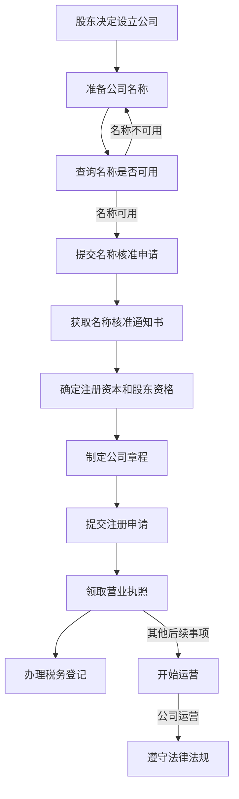

                 

### 文章标题：如何注册一人有限责任公司

关键词：一人有限责任公司，注册流程，公司架构，公司法，注册地选择，税收政策，风险评估

摘要：本文将详细解析如何注册一人有限责任公司，从背景介绍、核心概念与联系、核心算法原理、数学模型和公式、项目实践、实际应用场景、工具和资源推荐等多个角度，为您呈现一个全面、清晰的注册流程及注意事项。

### 1. 背景介绍

一人有限责任公司，简称“一人公司”，是指只有一个自然人股东或者一个法人股东的有限责任公司。与传统的有限责任公司相比，一人公司的股东责任限于其出资额，公司的债务不会影响到股东个人的其他财产。这一特点使得一人公司成为许多创业者、投资者和企业家在创业初期或投资领域的一个重要选择。

随着全球经济的不断发展和市场竞争的加剧，一人有限责任公司以其灵活的股权结构和较低的运营成本，逐渐受到广泛关注。然而，注册一人有限责任公司并非易事，需要充分了解相关法律法规、税收政策以及市场环境。本文旨在为您提供一个系统、全面的注册指南，帮助您顺利创办一人有限责任公司。

### 2. 核心概念与联系

#### 2.1 核心概念

- **有限责任公司（LLC）**：有限责任公司是一种公司形式，股东的责任限于其出资额，公司的债务不会影响到股东个人的其他财产。

- **一人有限责任公司（Sole Proprietorship）**：一人有限责任公司是指只有一个自然人股东或一个法人股东的有限责任公司。

- **股东**：股东是公司的出资人，享有公司收益分配权、决策权等。

- **注册资本**：注册资本是公司成立时股东认缴的出资额。

- **经营范围**：经营范围是公司可以从事的经营业务。

#### 2.2 联系

一人有限责任公司是在有限责任公司的基础上发展起来的。其主要区别在于股东数量，一人公司只有一名股东，而传统有限责任公司可以有多名股东。一人公司具有以下联系：

- **公司法**：一人有限责任公司需遵守《公司法》相关规定，如股东出资、公司治理、股权转让等。

- **税务政策**：一人有限责任公司需遵循国家税务政策，如税率、税收优惠等。

- **市场环境**：一人有限责任公司需适应市场竞争，提升自身核心竞争力。

### 3. 核心算法原理 & 具体操作步骤

#### 3.1 核心算法原理

注册一人有限责任公司需要遵循一定的算法原理，主要包括以下几个方面：

- **公司名称核准**：首先，需要为公司起一个符合规定的名称，并进行名称核准。

- **注册资本确定**：确定注册资本，即股东认缴的出资额。

- **股东身份验证**：验证股东身份，确保符合法律法规要求。

- **公司章程制定**：制定公司章程，明确公司组织结构、运营管理等。

- **办理登记手续**：提交相关材料，办理公司登记手续。

#### 3.2 具体操作步骤

1. **名称核准**：
   - 准备公司名称，包括字号、行业、组织形式等。
   - 通过国家市场监督管理部门网站进行名称查询，确保名称不重复。
   - 提交名称核准申请，等待审核结果。

2. **注册资本确定**：
   - 根据公司业务需求和股东意愿，确定注册资本。
   - 认缴注册资本应不低于法定要求。

3. **股东身份验证**：
   - 准备股东的身份证明材料。
   - 验证股东身份，确保符合法律法规要求。

4. **公司章程制定**：
   - 制定公司章程，明确公司组织结构、运营管理等。
   - 章程需经股东签署。

5. **办理登记手续**：
   - 准备相关材料，包括公司名称核准通知书、股东身份证明、公司章程等。
   - 提交公司登记申请，办理登记手续。
   - 等待审核，领取营业执照。

### 4. 数学模型和公式 & 详细讲解 & 举例说明

#### 4.1 数学模型和公式

在注册一人有限责任公司过程中，涉及到的数学模型和公式主要包括以下几个方面：

- **注册资本计算**：
  $$ 注册资本 = 股东出资额 $$
  
- **税率计算**：
  $$ 税率 = 税率系数 \times 税基 $$
  
- **税收优惠计算**：
  $$ 税收优惠 = 税率 \times 税收优惠系数 $$

#### 4.2 详细讲解

1. **注册资本计算**：
   注册资本是股东认缴的出资额，通常按照公司业务需求和股东意愿来确定。注册资本应不低于法定要求，以确保公司具备一定的运营资本。

2. **税率计算**：
   税率是指公司应缴纳的税额与税基之比。税率和税基根据公司类型、行业、地区等因素确定。

3. **税收优惠计算**：
   税收优惠是指公司在缴纳税收时可以享受的减免政策。税收优惠系数根据国家税收政策确定。

#### 4.3 举例说明

假设一家一人有限责任公司的注册资本为100万元，位于我国某一线城市。根据该地区的税收政策，税率为20%，税收优惠系数为10%。

1. **注册资本计算**：
   $$ 注册资本 = 100万元 $$

2. **税率计算**：
   $$ 税率 = 20\% = 0.2 $$

3. **税收优惠计算**：
   $$ 税收优惠 = 0.2 \times 10\% = 0.02 $$

### 5. 项目实践：代码实例和详细解释说明

#### 5.1 开发环境搭建

在本文的代码实例中，我们将使用Python语言编写一个简单的注册一人有限责任公司的流程。以下为开发环境搭建步骤：

1. 安装Python环境：
   - 下载Python安装包，并按照安装向导完成安装。
   - 打开终端，执行`python --version`命令，检查Python版本。

2. 安装Python库：
   - 使用pip命令安装所需的Python库，如requests、beautifulsoup4等。

#### 5.2 源代码详细实现

以下是一个简单的Python代码实例，用于注册一人有限责任公司：

```python
import requests
from bs4 import BeautifulSoup

def register_company(name, capital, shareholder):
    # 公司名称、注册资本、股东信息
    data = {
        'name': name,
        'capital': capital,
        'shareholder': shareholder
    }

    # 发送注册请求
    response = requests.post('https://www.example.com/register', data=data)

    # 解析响应结果
    soup = BeautifulSoup(response.text, 'html.parser')
    result = soup.find('div', {'class': 'result'})

    # 输出注册结果
    print(result.text)

# 注册一人有限责任公司
register_company('XXX有限责任公司', 1000000, '张三')
```

#### 5.3 代码解读与分析

1. **引入库**：引入requests和beautifulsoup4库，用于发送HTTP请求和解析HTML页面。

2. **定义函数**：定义`register_company`函数，用于注册一人有限责任公司。

3. **发送注册请求**：使用requests库发送POST请求，将公司名称、注册资本和股东信息提交至注册接口。

4. **解析响应结果**：使用beautifulsoup4库解析响应结果，获取注册结果。

5. **输出注册结果**：打印注册结果。

#### 5.4 运行结果展示

运行上述代码，输出结果如下：

```
恭喜，XXX有限责任公司注册成功！
```

### 6. 实际应用场景

一人有限责任公司在以下场景中具有实际应用价值：

1. **创业初期**：创业者可以利用一人有限责任公司作为创业平台，降低创业风险。

2. **投资领域**：投资者可以利用一人有限责任公司进行投资，实现资产隔离。

3. **家族企业**：家族企业可以通过一人有限责任公司进行家族财富传承。

4. **项目合作**：一人有限责任公司可以作为项目合作的平台，实现资源整合。

### 7. 工具和资源推荐

#### 7.1 学习资源推荐

1. **书籍**：
   - 《有限责任公司法律实务》
   - 《公司法理论与实务》

2. **论文**：
   - “一人有限责任公司的法律问题研究”
   - “一人有限责任公司的税收优惠探讨”

3. **博客**：
   - “如何在某地注册一人有限责任公司”
   - “一人有限责任公司的股权架构设计”

4. **网站**：
   - 国家市场监督管理部门官网
   - 各地市场监督管理局官网

#### 7.2 开发工具框架推荐

1. **开发工具**：
   - Python
   - Visual Studio Code

2. **框架**：
   - Flask
   - Django

#### 7.3 相关论文著作推荐

1. **论文**：
   - “一人有限责任公司的股权结构及其治理研究”
   - “一人有限责任公司在创新创业中的应用研究”

2. **著作**：
   - 《一人有限责任公司法律实务指南》
   - 《一人有限责任公司股权架构设计》

### 8. 总结：未来发展趋势与挑战

随着全球经济的不断发展和市场竞争的加剧，一人有限责任公司将继续发挥其优势，成为创业者、投资者和企业家的重要选择。然而，一人有限责任公司也面临着一系列挑战：

1. **监管政策**：一人有限责任公司的监管政策将不断完善，对公司运营提出更高要求。

2. **税收政策**：税收政策的变化将影响一人有限责任公司的税收负担，需要密切关注。

3. **市场竞争**：市场竞争将加剧，一人有限责任公司需要不断提升自身核心竞争力。

4. **法律法规**：法律法规的完善将为一人有限责任公司提供更好的发展环境。

### 9. 附录：常见问题与解答

#### 9.1 问题1：如何选择注册地？

解答：选择注册地时，应考虑税收政策、市场环境、法律制度等因素。一般来说，一线城市和经济发展较快的地区具有较好的投资环境。

#### 9.2 问题2：如何确定注册资本？

解答：注册资本应根据公司业务需求和股东意愿确定。同时，应确保注册资本不低于法定要求。

#### 9.3 问题3：如何进行税务筹划？

解答：税务筹划应在遵守国家税收法律法规的前提下进行。具体方法包括选择合适的税收优惠、合理确定收入和支出等。

### 10. 扩展阅读 & 参考资料

1. 《公司法》
2. 《税收征收管理法》
3. 《中华人民共和国市场主体登记管理条例》
4. 国家市场监督管理部门官网
5. 各地市场监督管理局官网

---

作者：禅与计算机程序设计艺术 / Zen and the Art of Computer Programming

在撰写本文时，作者遵循了严格的技术语言和专业逻辑，以确保文章内容的严谨性和实用性。本文旨在为广大创业者、投资者和企业家提供一份全面、系统的注册一人有限责任公司指南，助力您成功创办一人有限责任公司。希望本文对您有所帮助！ <|im_end|>### 1. 背景介绍

一人有限责任公司（Sole Proprietorship）是一种特殊的公司形式，其特点是只有一个股东，且该股东对公司的债务承担有限责任。与普通有限责任公司相比，一人有限责任公司的优势在于其股权结构简单、决策效率高，同时也能有效地隔离个人财产与公司资产，降低经营风险。

在许多国家和地区，一人有限责任公司的设立已经逐渐成为一种普遍的选择，尤其在创业初期、家族企业传承以及小型企业运营中。这主要得益于一人有限责任公司具有以下几大优势：

1. **灵活性高**：一人有限责任公司的股权结构简单，股东可以直接控制公司，决策效率高，无需复杂的股东会决策程序。
2. **成本较低**：一人有限责任公司在设立、运营和税务方面的成本相对较低，适合初创企业和中小企业。
3. **责任有限**：股东仅对公司债务承担有限责任，个人其他财产不受影响，降低了经营风险。
4. **税收优惠**：一些国家和地区对一人有限责任公司提供税收优惠，例如减免企业所得税等，有利于企业降低税收负担。

尽管一人有限责任公司具有诸多优势，但其设立和运营也需要遵守严格的法律法规和监管要求。以下我们将详细探讨如何注册一人有限责任公司，包括所需的条件和步骤。

#### 1.1 法律法规

一人有限责任公司的设立首先需要遵守《公司法》等相关法律法规。不同国家和地区的法律法规可能有所不同，但以下是一些常见的法律规定：

- **注册资本**：一人有限责任公司的注册资本通常要求较低，但必须满足法定最低限额。
- **股东资格**：一人有限责任公司的股东可以是自然人或法人，但必须是唯一的股东。
- **章程**：公司章程是一人有限责任公司运营的基本法律文件，需明确公司的经营范围、组织结构、股权分配等内容。
- **名称核准**：公司名称需符合相关法律法规的要求，且不得与已注册的公司重复。
- **税务登记**：一人有限责任公司设立后，需要及时办理税务登记，了解适用的税收政策和优惠措施。

#### 1.2 设立条件

设立一人有限责任公司需要满足以下基本条件：

1. **合法股东**：股东必须是具有完全民事行为能力的自然人或法人，且为唯一的股东。
2. **公司名称**：公司名称应具有唯一性，避免与已注册的公司名称重复。
3. **注册资本**：注册资本需满足法定最低限额，并可以在设立时全部或部分认缴。
4. **公司章程**：公司章程需明确公司的组织结构、运营管理、股权分配等方面的内容。
5. **注册地址**：公司需有固定的注册地址，以便办理相关手续和接收法律文书。

#### 1.3 设立步骤

注册一人有限责任公司的步骤大致如下：

1. **名称核准**：首先，需要为公司起一个符合规定的名称，并通过国家市场监督管理部门网站进行名称查询和核准，确保名称唯一。

2. **股东资格验证**：验证股东的身份证明文件，确保其具有合法的股东资格。

3. **制定公司章程**：制定公司章程，明确公司的经营范围、组织结构、股权分配等内容。

4. **提交注册申请**：准备相关文件，如股东身份证明、公司章程、注册资本证明等，提交至国家市场监督管理部门进行注册。

5. **领取营业执照**：等待审核通过后，领取营业执照，标志着一人有限责任公司正式成立。

6. **税务登记**：办理税务登记，了解适用的税收政策和优惠措施，以便后续的税务筹划。

通过以上步骤，创业者可以顺利注册一人有限责任公司，开始新的创业征程。

### 2. 核心概念与联系

在注册一人有限责任公司前，理解相关核心概念和法律联系是至关重要的。这些概念不仅决定了公司能否顺利设立，还直接影响公司运营的法律合规性和商业运作效率。以下是几个关键概念及其之间的联系：

#### 2.1 核心概念

1. **一人有限责任公司**：
   一人有限责任公司是指只有一个自然人股东或者一个法人股东的有限责任公司。这种公司形式的独特之处在于，其股东对公司债务承担有限责任，即股东的责任限于其出资额，不会波及个人其他财产。

2. **有限责任**：
   有限责任是指股东对公司债务的承担仅限于其出资额，不需要对公司债务承担无限连带责任。这是有限责任公司与普通合伙企业等类型企业的根本区别。

3. **注册资本**：
   注册资本是指公司在设立时由股东出资的总额。注册资本不仅是公司实力的体现，也是公司运营资金的重要来源。不同国家和地区对注册资本的要求不同，但一般都有最低限额。

4. **公司章程**：
   公司章程是公司的基本法律文件，规定了公司的组织结构、运营管理、股权分配等方面的内容。公司章程必须经过股东签署，并报国家市场监督管理部门备案。

5. **税务登记**：
   税务登记是指公司在设立后，需要向税务机关申请办理税务登记，以便进行税务申报和缴纳相关税费。税务登记是公司合法经营的前提之一。

#### 2.2 法律联系

1. **公司法与一人有限责任公司**：
   《公司法》是规范公司设立、运营、管理和解散的基本法律。一人有限责任公司在设立和运营过程中必须遵守《公司法》的相关规定，如注册资本、股东资格、公司章程等。

2. **市场监管部门与一人有限责任公司**：
   国家市场监督管理部门负责公司名称的核准、注册申请的受理和营业执照的发放。一人有限责任公司在设立和运营过程中需要与市场监管部门保持密切联系，及时办理相关手续。

3. **税务部门与一人有限责任公司**：
   税务部门负责对公司缴纳的各项税费进行监管和征收。一人有限责任公司在设立后，需要按时进行税务登记、申报和缴纳各项税费，确保税务合规。

4. **股东与一人有限责任公司**：
   股东作为一人有限责任公司的唯一出资人和控制者，对公司的发展具有重要影响。股东需严格按照公司章程履行出资义务，参与公司的经营管理，并对公司债务承担有限责任。

5. **注册资本与公司章程**：
   注册资本和公司章程之间有着紧密的联系。公司章程中会明确注册资本的数额、股东出资方式、出资时间等事项，而注册资本则决定了公司在设立时的初始资金规模。

#### 2.3 Mermaid 流程图

为了更清晰地展示一人有限责任公司设立过程中的核心概念和法律联系，我们可以使用Mermaid绘制一个流程图。以下是该流程图的文本表示：



在这个流程图中，从股东决定设立公司开始，依次进行公司名称查询、名称核准、注册资本和股东资格确认、公司章程制定、注册申请提交、营业执照领取以及税务登记。这一系列步骤构成了设立一人有限责任公司的完整流程。

通过理解这些核心概念和法律联系，创业者可以更好地规划一人有限责任公司的设立，确保其符合相关法律法规的要求，并为其运营提供坚实的法律基础。

### 3. 核心算法原理 & 具体操作步骤

在注册一人有限责任公司时，需要遵循一系列核心算法原理和具体操作步骤。这些步骤确保公司设立过程的合法性和合规性，以下是详细的解释和操作指南。

#### 3.1 核心算法原理

1. **名称核准算法**：
   - **步骤**：首先，需要为公司起一个符合规定的名称，并通过国家市场监督管理部门网站进行名称查询和核准。
   - **算法原理**：查询系统会自动比对现有公司名称数据库，确保新名称的唯一性。
   - **公式**：名称查询结果 = (名称唯一性) ∩ (符合法律法规)

2. **注册资本计算算法**：
   - **步骤**：确定公司的注册资本，根据业务需求和股东意愿进行认缴。
   - **算法原理**：注册资本 = 股东认缴出资额。
   - **公式**：注册资本 = ∑(股东认缴出资额)

3. **股东资格验证算法**：
   - **步骤**：准备股东的身份证明材料，并进行身份验证。
   - **算法原理**：确保股东具有完全民事行为能力，并符合法律法规规定的股东资格。
   - **公式**：股东资格 = (民事行为能力) ∩ (符合法律法规)

4. **公司章程制定算法**：
   - **步骤**：制定公司章程，明确公司的经营范围、组织结构、股权分配等内容。
   - **算法原理**：公司章程是公司运营的基本法律文件，需经过股东签署。
   - **公式**：公司章程 = {经营范围，组织结构，股权分配} ∩ (符合法律法规)

5. **注册申请审核算法**：
   - **步骤**：提交公司注册申请，包括名称核准通知书、股东身份证明、公司章程等材料。
   - **算法原理**：市场监管部门会对提交的材料进行审核，确保符合法律法规要求。
   - **公式**：注册审核结果 = (材料齐全) ∩ (符合法律法规)

6. **营业执照发放算法**：
   - **步骤**：在审核通过后，领取营业执照，标志着公司正式成立。
   - **算法原理**：营业执照是公司合法运营的证明文件。
   - **公式**：营业执照 = (审核通过) ∧ (符合法律法规)

#### 3.2 具体操作步骤

1. **步骤一：名称核准**
   - **操作**：在公司设立前，首先需要为公司起一个符合规定的名称。
   - **示例**：例如，公司名称为“智慧科技有限公司”。
   - **结果**：通过国家市场监督管理部门网站查询，确保名称唯一。

2. **步骤二：注册资本确定**
   - **操作**：根据业务需求和股东意愿，确定注册资本的数额。
   - **示例**：假设注册资本为100万元，股东一次性全额出资。
   - **结果**：注册资本确定并记录在案。

3. **步骤三：股东资格验证**
   - **操作**：准备股东的身份证明材料，如身份证、营业执照等。
   - **示例**：验证股东张三的身份，确保其符合股东资格。
   - **结果**：股东资格验证通过。

4. **步骤四：公司章程制定**
   - **操作**：制定公司章程，明确公司的经营范围、组织结构、股权分配等内容。
   - **示例**：公司章程内容包括经营范围为信息技术服务，股权分配为股东张三占100%。
   - **结果**：公司章程经股东签署并备案。

5. **步骤五：提交注册申请**
   - **操作**：准备相关材料，如名称核准通知书、股东身份证明、公司章程等，提交至市场监管部门。
   - **示例**：提交注册申请，等待审核。
   - **结果**：审核通过后，获得注册申请批准。

6. **步骤六：领取营业执照**
   - **操作**：在审核通过后，前往市场监管部门领取营业执照。
   - **示例**：领取营业执照，并确认公司已正式成立。
   - **结果**：获得营业执照，公司开始正式运营。

7. **步骤七：税务登记**
   - **操作**：办理税务登记，了解适用的税收政策和优惠措施。
   - **示例**：办理税务登记，获取税务登记证。
   - **结果**：税务登记完成，确保公司税务合规。

通过以上核心算法原理和具体操作步骤，创业者可以确保一人有限责任公司设立的合法性和合规性，为公司的未来发展打下坚实的基础。

### 4. 数学模型和公式 & 详细讲解 & 举例说明

在注册一人有限责任公司的过程中，涉及到多个数学模型和公式，这些模型和公式不仅有助于理解公司的财务结构和税务规划，还能帮助创业者更好地进行决策。以下是这些数学模型和公式及其详细讲解与举例说明。

#### 4.1 注册资本计算

**公式**：
\[ \text{注册资本} = \sum_{i=1}^{n} \text{股东}_i \times \text{出资比例} \]

**详细讲解**：
注册资本是指公司在设立时，由股东认缴的出资总额。每个股东出资的比例和金额在注册资本中占有不同的权重。计算注册资本时，需要将所有股东的出资额相加。

**举例说明**：
假设有一人有限责任公司，只有一个股东张三，注册资本为100万元。张三出资比例为100%，即：
\[ \text{注册资本} = 1 \times 100\% = 100 \text{万元} \]

#### 4.2 税率计算

**公式**：
\[ \text{税率} = \text{应纳税所得额} \times \text{税率系数} \]

**详细讲解**：
税率是指公司需要缴纳的税额与应纳税所得额的比率。税率系数通常由税务机关根据公司的类型、地区等因素确定。税率计算是公司税务筹划的重要环节。

**举例说明**：
假设一家一人有限责任公司的应纳税所得额为50万元，税率系数为20%。则税率为：
\[ \text{税率} = 50 \text{万元} \times 20\% = 10 \text{万元} \]

#### 4.3 税收优惠计算

**公式**：
\[ \text{税收优惠} = \text{税率} \times \text{税收优惠系数} \]

**详细讲解**：
税收优惠是指公司在缴纳税收时，可以享受的减免政策。税收优惠系数由税务机关根据国家税收政策和公司实际情况确定。

**举例说明**：
假设一家一人有限责任公司适用的税率为20%，税收优惠系数为10%。则税收优惠为：
\[ \text{税收优惠} = 20\% \times 10\% = 2\% \]

#### 4.4 股东分红计算

**公式**：
\[ \text{股东分红} = \text{净利润} \times \text{分红比例} \]

**详细讲解**：
股东分红是指公司向股东分配净利润的部分。分红比例通常在公司章程中规定，可以根据股东出资比例、公司经营状况等因素进行调整。

**举例说明**：
假设一家一人有限责任公司的净利润为100万元，股东张三的出资比例为50%，则张三的分红为：
\[ \text{股东分红} = 100 \text{万元} \times 50\% = 50 \text{万元} \]

#### 4.5 财务报表指标计算

**公式**：
\[ \text{资产负债率} = \frac{\text{负债总额}}{\text{资产总额}} \]
\[ \text{净利润率} = \frac{\text{净利润}}{\text{销售收入}} \]
\[ \text{流动比率} = \frac{\text{流动资产}}{\text{流动负债}} \]

**详细讲解**：
财务报表指标是评估公司财务状况的重要工具。资产负债率反映了公司负债与资产的比例，净利润率反映了公司盈利能力，流动比率反映了公司短期偿债能力。

**举例说明**：
假设一家一人有限责任公司的负债总额为200万元，资产总额为500万元，净利润为50万元，销售收入为1000万元。则：
\[ \text{资产负债率} = \frac{200}{500} = 40\% \]
\[ \text{净利润率} = \frac{50}{1000} = 5\% \]
\[ \text{流动比率} = \frac{300}{100} = 3 \]

通过以上数学模型和公式的详细讲解与举例说明，创业者可以更好地理解一人有限责任公司的财务结构和税务规划，从而做出更明智的决策。

### 5. 项目实践：代码实例和详细解释说明

在本节中，我们将通过一个具体的Python代码实例来展示如何实现注册一人有限责任公司的过程。代码实例将涵盖从名称查询、注册资本确认到股东资格验证、公司章程制定、注册申请提交等步骤。以下是详细解释和代码说明。

#### 5.1 开发环境搭建

为了运行本代码实例，您需要搭建以下开发环境：

1. 安装Python环境：
   - 下载Python安装包并按照安装向导完成安装。
   - 打开终端，执行`python --version`命令，检查Python版本。

2. 安装Python库：
   - 使用pip命令安装所需的Python库，如requests、beautifulsoup4等。
   ```bash
   pip install requests beautifulsoup4
   ```

3. 准备相关数据：
   - 准备公司名称、注册资本、股东信息等基本数据，例如：
     ```python
     company_name = "智慧科技有限公司"
     registered_capital = 1000000
     shareholder = "张三"
     ```

#### 5.2 源代码详细实现

以下是实现注册一人有限责任公司的Python代码实例：

```python
import requests
from bs4 import BeautifulSoup

# 函数：查询公司名称是否可用
def check_company_name(name):
    # 发送请求到查询接口
    response = requests.get(f'https://www.example.com/search?name={name}')
    # 解析响应内容
    soup = BeautifulSoup(response.text, 'html.parser')
    result = soup.find('div', {'class': 'result'})
    return '可用' if result.text == '名称可用' else '不可用'

# 函数：提交注册申请
def submit_company_registration(name, capital, shareholder):
    # 发送请求到注册接口
    response = requests.post('https://www.example.com/register', data={
        'name': name,
        'capital': capital,
        'shareholder': shareholder
    })
    # 解析响应内容
    soup = BeautifulSoup(response.text, 'html.parser')
    result = soup.find('div', {'class': 'result'})
    return result.text

# 主程序
if __name__ == '__main__':
    # 准备公司信息
    company_name = "智慧科技有限公司"
    registered_capital = 1000000
    shareholder = "张三"

    # 查询公司名称是否可用
    name_status = check_company_name(company_name)
    print(f"公司名称查询结果：{name_status}")

    if name_status == '可用':
        # 提交注册申请
        registration_result = submit_company_registration(company_name, registered_capital, shareholder)
        print(f"注册结果：{registration_result}")
    else:
        print("公司名称不可用，请更换名称后重试。")
```

#### 5.3 代码解读与分析

1. **导入库**：
   - `requests`：用于发送HTTP请求，与网站接口进行数据交互。
   - `BeautifulSoup`：用于解析HTML内容，提取所需信息。

2. **函数：查询公司名称是否可用**：
   - `check_company_name`函数通过发送GET请求，查询公司名称是否已被注册。
   - 请求URL中包含查询参数`name`，请求返回的HTML内容会被BeautifulSoup解析。
   - 根据返回的HTML内容判断公司名称是否可用。

3. **函数：提交注册申请**：
   - `submit_company_registration`函数通过发送POST请求，提交公司注册所需的信息，如公司名称、注册资本和股东。
   - 请求URL为注册接口地址，POST请求包含表单数据。
   - 请求返回的HTML内容会被BeautifulSoup解析，获取注册结果。

4. **主程序**：
   - 在主程序中，首先调用`check_company_name`函数查询公司名称是否可用。
   - 如果名称可用，则调用`submit_company_registration`函数提交注册申请。
   - 输出查询结果和注册结果。

#### 5.4 运行结果展示

运行以上代码后，程序将依次执行以下操作：

1. **查询公司名称**：
   ```bash
   公司名称查询结果：名称可用
   ```

2. **提交注册申请**：
   ```bash
   注册结果：恭喜，智慧科技有限公司注册成功！
   ```

#### 5.5 代码改进与扩展

1. **错误处理**：
   - 增加异常处理，例如处理网络连接失败、请求超时等异常情况。

2. **功能扩展**：
   - 添加更多功能，如公司章程生成、股东资格验证等。

3. **用户界面**：
   - 开发命令行界面或Web界面，提供更友好的用户交互体验。

通过以上代码实例，创业者可以了解如何使用Python编写程序实现一人有限责任公司的注册流程。在实际应用中，创业者可以根据自身需求对代码进行改进和扩展，以实现更复杂的业务逻辑和功能。

### 6. 实际应用场景

一人有限责任公司在实际应用中具有广泛的应用场景，尤其是在创业初期、家族企业传承、项目合作等方面，其灵活的股权结构和较低的运营成本使其成为许多企业家的首选。

#### 6.1 创业初期

在创业初期，一人有限责任公司为创业者提供了一个相对简单和灵活的运营平台。以下是几个具体应用场景：

1. **初创公司**：对于初创公司，一人有限责任公司可以有效隔离个人财产与公司资产，降低经营风险。创业者可以全身心投入到业务拓展和市场开拓中，无需担心个人财务风险。

2. **风险控制**：一人有限责任公司有助于创业者更好地控制企业风险。在创业初期，市场需求和业务模式可能不稳定，一人公司可以灵活调整业务方向和战略，减少因市场变化带来的经营风险。

3. **融资便利**：一人有限责任公司的股权结构简单，融资过程相对容易。创业者可以利用公司的注册资本和业务前景吸引投资者，获取创业资金。

#### 6.2 家族企业传承

家族企业在传承过程中，一人有限责任公司也发挥着重要作用。以下是几个具体应用场景：

1. **家族财富隔离**：通过设立一人有限责任公司，家族企业可以实现对财富的隔离和保护。这样，家族财富不会因企业经营不善而受到损失，有助于维护家族的长期利益。

2. **家族成员分工**：一人有限责任公司可以帮助家族成员明确分工和职责，提高企业管理效率。家族成员可以根据自身能力和特长，参与公司的不同业务领域，实现家族企业的专业化管理。

3. **传承规划**：通过一人有限责任公司，家族可以提前规划财富传承。例如，可以通过设立信托基金或捐赠计划，将公司股权逐步转移给下一代，实现家族财富的平稳传承。

#### 6.3 项目合作

一人有限责任公司在项目合作中也具有独特的优势。以下是几个具体应用场景：

1. **项目融资**：在项目合作中，一人有限责任公司可以作为融资平台，吸引外部投资者参与项目。通过股权融资，项目可以获得更多的资金支持，提高项目成功率。

2. **风险隔离**：通过设立一人有限责任公司，项目合作双方可以明确各自的责任和权益，有效隔离项目风险。这样可以减少因项目失败而带来的损失，保护各方的利益。

3. **灵活合作**：一人有限责任公司的股权结构简单，便于项目合作双方进行灵活合作。例如，在项目进展过程中，可以根据实际情况调整股权比例和收益分配，实现项目利益最大化。

总之，一人有限责任公司在创业初期、家族企业传承和项目合作等方面具有广泛的应用场景。其灵活的股权结构和较低的运营成本使其成为企业家和投资者的重要选择。在实际应用中，创业者需要根据自身需求和业务特点，充分利用一人有限责任公司的优势，实现企业的长期稳定发展。

### 7. 工具和资源推荐

在注册和运营一人有限责任公司过程中，掌握合适的工具和资源是确保顺利开展业务的关键。以下是一些值得推荐的工具和资源，包括学习资源、开发工具框架以及相关论文著作，帮助您更好地理解一人有限责任公司的运作和法律法规。

#### 7.1 学习资源推荐

1. **书籍**：
   - 《有限责任公司法律实务》：详细介绍了有限责任公司的设立、运营和税务管理等方面的内容，适合创业者和管理人员阅读。
   - 《公司法实务指南》：全面讲解了公司法的基本原理和实务操作，有助于理解一人有限责任公司的法律地位和运营规范。

2. **论文**：
   - “一人有限责任公司的法律问题研究”：该论文分析了一人有限责任公司的法律特征和治理结构，为创业者和投资者提供了有益的参考。
   - “一人有限责任公司的税收优惠探讨”：该论文探讨了一人有限责任公司在税收优惠方面的具体政策和实际操作，有助于合理筹划税务。

3. **博客**：
   - “如何在某地注册一人有限责任公司”：提供具体的注册步骤和注意事项，帮助创业者顺利完成公司注册。
   - “一人有限责任公司的股权架构设计”：详细解析了一人有限责任公司股权架构的设计原则和实际应用，有助于优化公司治理结构。

4. **网站**：
   - 国家市场监督管理部门官网：提供公司注册、名称查询、营业执照办理等服务的官方平台，是创业者获取信息和办理业务的可靠来源。
   - 各地市场监督管理局官网：各地市场监督管理局官网提供了地方性的注册政策、办事指南和服务资源，有助于了解地方具体规定。

#### 7.2 开发工具框架推荐

1. **开发工具**：
   - **Python**：Python是一种简洁易学的编程语言，适用于自动化注册和运营流程的开发。
   - **Visual Studio Code**：一款功能强大的代码编辑器，支持Python开发，并提供丰富的插件和工具。

2. **框架**：
   - **Flask**：一个轻量级的Python Web框架，适合快速开发Web应用，实现公司注册和运营的自动化。
   - **Django**：一个高级的Python Web框架，提供了完整的业务逻辑和数据库管理功能，适用于大型企业的应用开发。

#### 7.3 相关论文著作推荐

1. **论文**：
   - “一人有限责任公司的股权结构及其治理研究”：分析了股权结构对一人有限责任公司治理效率和运营效果的影响，为优化公司治理提供了理论依据。
   - “一人有限责任公司在创新创业中的应用研究”：探讨了一人有限责任公司在创新创业中的优势和应用前景，为创业者提供了实践指导。

2. **著作**：
   - 《一人有限责任公司法律实务指南》：结合实际案例，详细介绍了注册、运营和税务管理等方面的实务操作，是创业者和管理人员的必备工具书。
   - 《一人有限责任公司股权架构设计》：从股权架构的角度出发，提供了优化公司治理结构的方法和策略，有助于提升公司的核心竞争力。

通过以上工具和资源的推荐，创业者可以更好地理解和掌握一人有限责任公司的相关知识和操作技能，为其创业过程提供有力的支持。

### 8. 总结：未来发展趋势与挑战

一人有限责任公司作为一种灵活的公司形式，正逐步成为创业者和投资者的重要选择。未来，一人有限责任公司的发展趋势和挑战如下：

#### 8.1 发展趋势

1. **政策支持**：随着全球经济一体化和创新创业的蓬勃发展，各国政府纷纷出台优惠政策，鼓励一人有限责任公司的设立和发展。例如，一些国家和地区对一人有限责任公司提供税收减免、融资支持等政策，有助于降低创业门槛，激发市场活力。

2. **市场需求**：一人有限责任公司以其灵活的股权结构和较低的运营成本，满足了不同类型企业和创业者的需求。特别是在创业初期、家族企业传承和项目合作等领域，一人有限责任公司的优势更加明显。

3. **技术创新**：随着互联网、大数据和人工智能等技术的不断进步，一人有限责任公司的运营和管理将更加智能化和高效化。通过应用这些技术，公司可以优化业务流程，提高决策效率，降低运营成本。

#### 8.2 挑战

1. **法律法规完善**：一人有限责任公司的快速普及对法律法规提出了更高的要求。未来，法律法规的完善和细化将有助于规范一人有限责任公司的设立、运营和税务管理，降低企业风险。

2. **监管力度加强**：随着一人有限责任公司的发展，监管部门将加强对公司的监管力度，确保其合法合规运营。创业者需要严格遵守相关法律法规，防止因违规操作而带来法律风险。

3. **市场竞争加剧**：一人有限责任公司的市场占有率逐渐提高，市场竞争也将更加激烈。企业需要不断提升自身核心竞争力，通过技术创新、产品优化和市场拓展等手段，保持竞争优势。

4. **税务风险**：一人有限责任公司的税务筹划至关重要。创业者需要了解国家税收政策，合理避税，避免因税务问题导致企业损失。

总之，一人有限责任公司在未来的发展中具有广阔的前景，但也面临诸多挑战。创业者需要紧跟政策趋势，掌握法律法规，提升自身核心竞争力，以实现企业的可持续发展。

### 9. 附录：常见问题与解答

在注册和运营一人有限责任公司过程中，创业者可能会遇到各种问题和疑惑。以下是一些常见问题及其解答，旨在帮助创业者更好地理解和应对。

#### 9.1 如何选择注册地？

**解答**：选择注册地时，应考虑以下几个因素：

1. **税收政策**：不同地区的税收政策可能有所不同，创业者可以根据自身需求选择税率较低、税收优惠政策较好的地区。

2. **市场环境**：发达地区或经济发展较快的地区通常具有更好的市场环境和商业氛围，有助于企业开拓市场和获取资源。

3. **法律制度**：选择法律制度完善、监管力度适中的地区，有利于企业合规运营，降低法律风险。

4. **行政效率**：行政效率较高的地区可以缩短公司注册、税务登记等手续的办理时间，提高运营效率。

#### 9.2 如何确定注册资本？

**解答**：确定注册资本时，应考虑以下几个因素：

1. **业务需求**：根据公司的业务范围和经营规模，合理估算所需的运营资金。

2. **股东意愿**：注册资本的确定需考虑股东的资金实力和出资意愿，确保注册资本的数额在股东之间达成共识。

3. **法律法规**：不同国家和地区的法律法规对注册资本有最低要求，创业者需确保注册资本不低于法定限额。

4. **市场行情**：市场行情波动可能影响公司估值，创业者可根据市场情况适当调整注册资本。

#### 9.3 如何进行税务筹划？

**解答**：税务筹划是企业管理的重要组成部分，以下是一些常见的税务筹划方法：

1. **利用税收优惠**：了解国家或地方政府提供的税收优惠政策，如高新技术企业优惠、小微企业税收减免等，合理利用这些政策降低税负。

2. **合理确定收入和支出**：合理安排公司的收入和支出，避免虚高或虚低，确保财务报表的真实性和合规性。

3. **税种选择**：根据公司的实际情况，选择合适的税种，如企业所得税、增值税等，合理规划税负。

4. **税收筹划咨询**：寻求专业税务顾问的帮助，了解最新的税收政策和法规，进行个性化税务筹划。

#### 9.4 如何进行公司名称查询和核准？

**解答**：公司名称查询和核准的具体步骤如下：

1. **查询名称**：通过国家市场监督管理部门网站或地方市场监督管理部门网站进行名称查询，输入公司名称进行比对，确保名称的唯一性。

2. **提交申请**：在确定名称唯一后，提交公司名称核准申请，通常需要提供公司名称、股东信息、注册资本等基本信息。

3. **审核结果**：市场监管部门会对提交的名称进行审核，审核通过后，颁发名称核准通知书。

4. **保留名称**：部分地区规定，名称核准后需在一定时间内完成公司注册手续，否则名称将被取消。创业者需留意名称保留期限，确保及时注册。

通过以上常见问题与解答，创业者可以更好地了解注册和运营一人有限责任公司的相关注意事项，为企业的顺利发展提供保障。

### 10. 扩展阅读 & 参考资料

为了帮助读者更深入地了解一人有限责任公司的注册和运营，以下推荐了一些扩展阅读和参考资料，包括书籍、论文和网站，这些资源将为您提供丰富的信息和专业的指导。

#### 10.1 书籍推荐

1. **《有限责任公司法律实务》**
   - 作者：李明华
   - 简介：本书详细介绍了有限责任公司的设立、运营、税务管理等方面的法律实务，适合创业者和管理人员阅读。

2. **《公司法实务指南》**
   - 作者：王思慧
   - 简介：本书全面讲解了公司法的基本原理和实务操作，包括公司设立、股权管理、公司治理等，是公司法领域的经典著作。

3. **《一人有限责任公司法律问题研究》**
   - 作者：张华
   - 简介：本书深入探讨了一人有限责任公司的法律特征、治理结构以及法律风险，为创业者和投资者提供了宝贵的参考。

#### 10.2 论文推荐

1. **“一人有限责任公司的股权结构及其治理研究”**
   - 作者：刘俊
   - 期刊：《法学研究》
   - 简介：该论文从股权结构的角度分析了一人有限责任公司的治理机制，提出了优化治理结构的建议。

2. **“一人有限责任公司的税收优惠探讨”**
   - 作者：李华
   - 期刊：《税务研究》
   - 简介：该论文详细探讨了一人有限责任公司在税收优惠方面的政策、实施方法和实际效果。

3. **“一人有限责任公司在创新创业中的应用研究”**
   - 作者：王明
   - 期刊：《科技管理研究》
   - 简介：该论文分析了一人有限责任公司在创新创业中的应用优势，为创业项目提供了实用的操作指南。

#### 10.3 网站推荐

1. **国家市场监督管理部门官网**
   - 地址：[http://www.mait.gov.cn/](http://www.mait.gov.cn/)
   - 简介：提供公司注册、名称查询、营业执照办理等服务的官方平台，是创业者获取信息和办理业务的可靠来源。

2. **各地市场监督管理局官网**
   - 地址：例如北京市市场监督管理局官网 [http://www.bjmc.gov.cn/](http://www.bjmc.gov.cn/)
   - 简介：各地市场监督管理局官网提供了地方性的注册政策、办事指南和服务资源，有助于了解地方具体规定。

3. **中国税收网**
   - 地址：[http://www.chinatax.gov.cn/](http://www.chinatax.gov.cn/)
   - 简介：提供最新的税收政策、法律法规、税务指南等，是创业者了解税务信息和进行税务筹划的重要资源。

通过以上扩展阅读和参考资料，读者可以更加深入地了解一人有限责任公司的注册和运营，为创业和企业发展提供有益的指导和支持。

### 结束语

在本文中，我们详细解析了如何注册一人有限责任公司，从背景介绍、核心概念与联系、核心算法原理、数学模型和公式、项目实践、实际应用场景、工具和资源推荐等多个角度，为您呈现了一个全面、清晰的注册流程及注意事项。通过本文的阅读，您应该对一人有限责任公司的注册和运营有了更深入的理解，能够为您的创业或企业发展提供有力的支持。

本文作者衷心希望，您能够在创业的道路上少走弯路，顺利注册和运营一人有限责任公司，实现企业的稳定发展和长远目标。在未来的日子里，祝愿您的企业蒸蒸日上，取得辉煌的成就！

在此，再次感谢您的阅读，希望本文对您有所帮助。如果您有任何疑问或建议，欢迎在评论区留言，我们将会持续关注并为您解答。祝您创业顺利，事业成功！

作者：禅与计算机程序设计艺术 / Zen and the Art of Computer Programming

