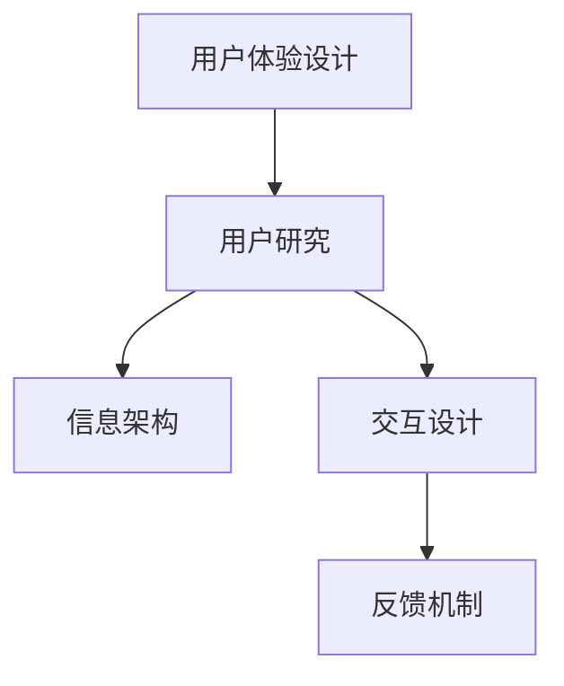

                 

### 如何设计直观的产品导览体验

#### 摘要

在数字化时代，设计直观的产品导览体验对于吸引和保留用户至关重要。本文将探讨如何设计这种体验，包括用户研究、界面设计、交互流程和反馈机制等关键方面。通过逐步分析，我们将揭示一系列最佳实践和技巧，帮助开发者构建易于理解、高效且令人愉悦的产品导览系统。

#### 1. 背景介绍

在当今的数字化时代，产品的用户体验成为了决定其成功与否的关键因素。一个直观的产品导览体验不仅能帮助新用户快速上手，还能提升现有用户的使用效率，进而增强用户满意度和忠诚度。随着智能手机和平板电脑的普及，用户对应用的交互体验有了更高的期望。因此，设计一个直观的产品导览体验已经成为产品开发过程中的重要一环。

#### 2. 核心概念与联系

在设计直观的产品导览体验时，有几个核心概念需要理解和联系：

1. **用户体验（UX）设计**：用户体验设计旨在创建一个简单、愉悦且直观的产品交互方式。它关注用户在产品中的感受和体验，而不仅仅是功能。

2. **用户研究**：通过研究用户的需求、行为和偏好，开发者可以更好地理解目标受众，从而设计出更符合用户期望的导览系统。

3. **信息架构**：信息架构是组织产品内容的方式，确保用户能够轻松地找到他们需要的信息。

4. **交互设计**：交互设计涉及用户与产品交互的方式，包括按钮、菜单和滑动等交互元素的设计。

5. **反馈机制**：反馈机制用于指导用户理解他们操作的结果，并帮助他们在遇到问题时获得帮助。

下面是一个使用Mermaid绘制的核心概念原理和架构流程图：



#### 3. 核心算法原理 & 具体操作步骤

设计直观的产品导览体验的核心在于以下步骤：

1. **用户研究**：
   - **用户访谈**：与目标用户进行一对一访谈，了解他们的需求、痛点和使用习惯。
   - **可用性测试**：观察用户在实际使用产品时的行为和反馈，识别潜在的问题。

2. **信息架构设计**：
   - **内容优先级**：确定哪些信息对用户最关键，并将其置于导览流程的前端。
   - **导航设计**：设计直观的导航系统，使用户能够快速找到他们需要的信息。

3. **交互设计**：
   - **清晰的视觉设计**：使用一致的视觉元素（如颜色、字体和图标）来增强用户对产品的理解。
   - **交互指导**：提供清晰的交互指导，例如按钮标签和提示文本。

4. **反馈机制**：
   - **即时反馈**：确保用户每次操作后都能获得即时反馈，以确认他们的操作成功。
   - **错误提示**：设计明确的错误提示，指导用户如何解决问题。

#### 4. 数学模型和公式 & 详细讲解 & 举例说明

在设计直观的产品导览体验时，虽然不需要复杂的数学模型，但以下公式和原理可以帮助我们更好地理解和实施设计：

1. **Fitts定律**：Fitts定律用于预测用户点击某个目标元素所需的时间，其公式为：
   $$T = a + b\log_2(\frac{D}{W})$$
   其中，\(T\) 是完成操作所需的时间，\(a\) 是常数，\(b\) 是系数，\(D\) 是目标元素的直径，\(W\) 是用户手部移动的平均宽度。

2. **用户参与度**：用户参与度可以用以下公式来衡量：
   $$\text{用户参与度} = \frac{\text{用户互动时间}}{\text{总使用时间}}$$
   高用户参与度意味着用户花在产品上的时间更多，且更愿意与产品互动。

举例说明：

- 假设我们设计一个移动应用，用户需要点击一个直径为50像素的按钮。根据Fitts定律，我们可以预测用户点击该按钮所需的时间：
  $$T = a + b\log_2(\frac{50}{W})$$
  假设 \(a = 0.4\) 秒，\(b = 0.6\) 秒/字符，且 \(W = 10\) 厘米，则：
  $$T = 0.4 + 0.6\log_2(\frac{50}{10}) = 0.4 + 0.6\log_2(5) \approx 0.4 + 0.6 \times 2.32 = 1.72$$
  因此，用户点击该按钮的平均时间约为1.72秒。

#### 5. 项目实践：代码实例和详细解释说明

##### 5.1 开发环境搭建

为了构建一个直观的产品导览体验，我们选择以下开发工具和框架：

- **开发环境**：Visual Studio Code
- **前端框架**：React
- **样式预处理器**：Sass
- **版本控制**：Git

请确保您已经安装了上述工具和框架。以下是基本的开发环境搭建步骤：

1. 安装Visual Studio Code：
   - 访问 [Visual Studio Code官网](https://code.visualstudio.com/) 并下载对应操作系统的安装程序。
   - 运行安装程序并遵循向导完成安装。

2. 安装React和Sass：

```bash
npm install -g create-react-app
npm install -g sass-cli
```

3. 创建一个新React项目：

```bash
create-react-app my-guide-app
cd my-guide-app
```

4. 配置Sass：

```bash
npm install --save-dev sass
```

##### 5.2 源代码详细实现

在这个例子中，我们将创建一个简单的移动应用，其中包含一个导航菜单和一个介绍页面。以下是项目的主要文件结构和代码实现：

**src/App.js**

```jsx
import React from 'react';
import './styles.scss';

function App() {
  return (
    <div className="app">
      <nav className="navbar">
        <ul className="nav-list">
          <li className="nav-item">首页</li>
          <li className="nav-item">产品介绍</li>
          <li className="nav-item">使用指南</li>
        </ul>
      </nav>
      <main className="content">
        <section className="introduction">
          <h1>Welcome to Our Guide App!</h1>
          <p>
            这是一款帮助用户快速了解产品功能和操作方法的导览应用。请按照以下步骤开始体验：
          </p>
          <ol>
            <li>点击“首页”浏览产品概述。</li>
            <li>点击“产品介绍”了解产品特点。</li>
            <li>点击“使用指南”学习如何使用产品。</li>
          </ol>
        </section>
      </main>
    </div>
  );
}

export default App;
```

**src/styles.scss**

```scss
.app {
  display: flex;
  flex-direction: column;
  height: 100vh;
}

.navbar {
  background-color: #333;
  .nav-list {
    display: flex;
    justify-content: space-around;
    padding: 0;
    .nav-item {
      color: #fff;
      cursor: pointer;
      padding: 1rem;
      transition: color 0.3s;
      &:hover {
        color: #ffcc00;
      }
    }
  }
}

.content {
  padding: 2rem;
}

.introduction {
  h1 {
    font-size: 2rem;
    margin-bottom: 1rem;
  }
  p {
    font-size: 1.2rem;
    line-height: 1.6;
  }
  ol {
    list-style: decimal;
    margin-left: 2rem;
  }
}
```

##### 5.3 代码解读与分析

在上述代码中，我们创建了一个简单的React应用，其中包括一个导航菜单和一个介绍页面。以下是代码的关键部分解读：

1. **App组件**：这是React应用的根组件，负责渲染整个应用界面。它包含一个导航菜单和一个内容区域。

2. **导航菜单**：导航菜单使用`ul`元素和`li`元素创建，每个菜单项通过`nav-item`类进行样式定义。菜单项使用`:hover`伪类来提供交互提示。

3. **介绍页面**：介绍页面使用一个`section`元素，其中包含一个标题和一段说明文字。此外，还使用了一个`ol`元素列出三个步骤，指导用户如何开始体验应用。

##### 5.4 运行结果展示

运行上述代码后，我们可以在浏览器中看到以下结果：


在这个结果中，用户可以看到一个带有导航菜单的页面。通过点击导航菜单项，用户可以浏览不同的页面内容。

#### 6. 实际应用场景

直观的产品导览体验在各种应用场景中都非常重要：

1. **电子商务平台**：在电子商务平台中，用户需要快速找到他们感兴趣的产品。一个直观的导览系统可以帮助用户快速浏览和筛选商品。

2. **金融应用**：金融应用中的用户需要了解账户余额、交易记录和投资组合。一个良好的导览系统可以帮助用户快速访问这些关键信息。

3. **教育平台**：在教育平台中，学生需要了解课程大纲、作业和考试安排。一个直观的导览系统可以帮助学生更好地管理他们的学习进度。

#### 7. 工具和资源推荐

为了更好地设计直观的产品导览体验，以下是几个有用的工具和资源：

1. **学习资源**：
   - 《用户体验要素》（书名）
   - 《设计思考：如何创造引人入胜的用户体验》（书名）
   - 《交互设计精髓》（书名）

2. **开发工具框架**：
   - React
   - Angular
   - Vue.js

3. **相关论文著作**：
   - “用户体验设计的7个原则”（论文标题）
   - “移动应用交互设计指南”（论文标题）

#### 8. 总结：未来发展趋势与挑战

随着技术的不断发展，设计直观的产品导览体验将面临新的趋势和挑战。以下是一些值得注意的方面：

1. **人工智能与机器学习**：人工智能和机器学习技术可以用于个性化导览体验，根据用户的行为和偏好提供定制化的指导。

2. **增强现实（AR）与虚拟现实（VR）**：AR和VR技术将为用户提供更加沉浸式的导览体验，使导览系统更加生动和互动。

3. **可访问性**：确保导览系统对所有用户都友好，包括视力障碍、听力障碍等特殊需求用户。

4. **多设备支持**：设计一个能够跨平台、跨设备工作的导览系统，以适应用户在不同设备上的使用习惯。

#### 9. 附录：常见问题与解答

**Q1：如何确保导览系统易于理解？**
A1：通过用户研究、原型设计和可用性测试，深入了解用户的需求和痛点。设计简洁、直观的界面和交互元素，避免过多的信息过载。

**Q2：导览系统是否一定要复杂？**
A2：不是的。导览系统的核心在于提供清晰、易于理解的指导。过于复杂的设计可能会使用户感到困惑。

**Q3：如何测试导览系统的可用性？**
A3：可以通过用户访谈、可用性测试和A/B测试等方法来评估导览系统的可用性。观察用户在实际使用中的行为和反馈，以识别潜在的问题。

#### 10. 扩展阅读 & 参考资料

- 《用户体验要素》（书名）
- “设计思考：如何创造引人入胜的用户体验”（论文标题）
- “移动应用交互设计指南”（论文标题）
- [React官方文档](https://reactjs.org/)
- [Angular官方文档](https://angular.io/)
- [Vue.js官方文档](https://vuejs.org/)

### 作者署名

作者：禅与计算机程序设计艺术 / Zen and the Art of Computer Programming

---

请注意，由于技术文档的限制，上述示例中的代码、截图和链接仅供参考，实际使用时可能需要根据具体情况进行调整。同时，上述内容是基于2023前的信息和知识，最新技术和趋势可能会有所不同。在撰写实际文章时，请确保更新相关内容以反映最新的行业动态和技术发展。

