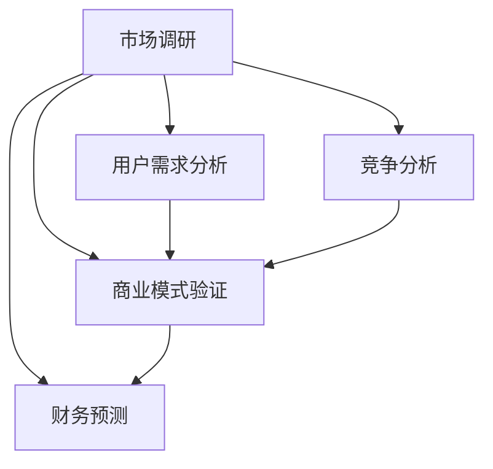

                 

### 文章标题

**《如何评估你的创业想法是否有市场》**

> **关键词：** 创业评估、市场调研、用户需求分析、竞争分析、商业模式验证、财务预测

**摘要：** 本文旨在帮助创业者系统地评估其创业想法是否有市场潜力。我们将从市场调研、用户需求分析、竞争分析、商业模式验证和财务预测等多个维度，详细阐述评估创业想法的步骤和方法。通过这些评估步骤，创业者可以更好地了解市场需求，降低创业风险，提高成功率。

---

**背景介绍**

在当今充满竞争的商业环境中，创业者的成功不仅取决于创新的想法，更取决于对市场的深入了解。评估创业想法是否有市场，是创业者迈向成功的第一步。通过科学的市场评估，创业者可以：

1. **发现市场需求：** 了解目标市场是否存在对所提供产品或服务的需求。
2. **确定竞争优势：** 分析竞争对手，明确自身的差异化优势。
3. **预测盈利能力：** 通过财务预测，评估创业项目的盈利前景。
4. **降低风险：** 提前识别潜在的风险，制定相应的应对策略。

本文将围绕以上四个核心方面，详细介绍如何评估创业想法是否有市场。我们将使用逻辑清晰、结构紧凑、简单易懂的专业技术语言，帮助创业者理清思路，制定科学的评估方案。

---

**核心概念与联系**

在评估创业想法时，我们需要了解以下几个核心概念，它们相互关联，共同构成了市场评估的基础：

1. **市场调研（Market Research）**：收集和分析市场信息，了解市场需求和趋势。
2. **用户需求分析（User Needs Analysis）**：深入了解目标用户的需求，为其提供合适的产品或服务。
3. **竞争分析（Competitive Analysis）**：分析竞争对手的产品、市场定位和策略，找出差异化优势。
4. **商业模式验证（Business Model Validation）**：验证商业模式的可行性和盈利能力。
5. **财务预测（Financial Forecasting）**：预测未来财务状况，评估盈利前景。

下图展示了这些概念之间的相互关系：



通过这些核心概念的联系，我们可以系统地评估创业想法的市场潜力，确保创业项目的成功。

---

**核心算法原理 & 具体操作步骤**

为了更清晰地评估创业想法的市场潜力，我们可以采用以下核心算法原理和具体操作步骤：

### 步骤 1：市场调研

**目的：** 收集市场信息，了解市场需求和趋势。

**操作步骤：**
1. **确定调研目标：** 明确调研的具体内容，如市场规模、目标用户群体、潜在竞争对手等。
2. **选择调研方法：** 根据调研目标，选择合适的调研方法，如问卷调查、访谈、在线调查等。
3. **收集数据：** 进行调研，收集相关数据。
4. **分析数据：** 对收集到的数据进行整理和分析，找出市场趋势和需求。

### 步骤 2：用户需求分析

**目的：** 深入了解目标用户的需求，为其提供合适的产品或服务。

**操作步骤：**
1. **确定目标用户：** 根据市场调研结果，明确目标用户群体。
2. **收集用户反馈：** 通过调查问卷、用户访谈等方式，收集目标用户的反馈。
3. **分析用户需求：** 对收集到的用户反馈进行分析，找出用户的痛点和需求。
4. **制定解决方案：** 根据用户需求，制定相应的产品或服务方案。

### 步骤 3：竞争分析

**目的：** 分析竞争对手的产品、市场定位和策略，找出差异化优势。

**操作步骤：**
1. **确定竞争对手：** 根据市场调研结果，明确主要竞争对手。
2. **分析竞争对手：** 研究竞争对手的产品特点、市场定位、营销策略等。
3. **找出差异化优势：** 分析竞争对手的不足之处，找出自身的差异化优势。

### 步骤 4：商业模式验证

**目的：** 验证商业模式的可行性和盈利能力。

**操作步骤：**
1. **确定商业模式：** 根据用户需求分析和竞争分析结果，制定商业模式。
2. **评估商业模式：** 通过模拟运营，评估商业模式的可行性和盈利能力。
3. **调整商业模式：** 根据评估结果，调整商业模式，确保其可行性和盈利能力。

### 步骤 5：财务预测

**目的：** 预测未来财务状况，评估盈利前景。

**操作步骤：**
1. **确定财务指标：** 根据商业模式，确定关键的财务指标，如收入、成本、利润等。
2. **收集历史数据：** 收集相关历史数据，如行业平均增长率、竞争对手财务状况等。
3. **预测未来财务状况：** 根据历史数据和商业模式，预测未来财务状况。
4. **评估盈利前景：** 分析预测结果，评估创业项目的盈利前景。

通过以上五个步骤，我们可以系统地评估创业想法的市场潜力，确保创业项目的成功。

---

**数学模型和公式 & 详细讲解 & 举例说明**

在评估创业想法时，数学模型和公式可以帮助我们进行定量分析，提高评估的准确性和科学性。以下是一些常用的数学模型和公式，我们将对其进行详细讲解，并通过具体例子来说明其应用。

### 1. 市场规模预测模型

**模型公式：**

$$
市场规模 = 潜在用户数 \times 转化率 \times 客单价
$$

**详细讲解：**

市场规模预测模型用于预测目标市场的总体规模。其中，潜在用户数表示目标市场中的潜在用户数量；转化率表示潜在用户转化为实际用户的比例；客单价表示每位用户的平均消费金额。

**举例说明：**

假设某创业项目的目标市场中有 100 万潜在用户，转化率为 10%，客单价为 500 元。则市场规模预测为：

$$
市场规模 = 100 万 \times 10\% \times 500 元 = 5000 万元
$$

### 2. 盈利预测模型

**模型公式：**

$$
盈利 = 收入 - 成本 - 费用
$$

**详细讲解：**

盈利预测模型用于预测创业项目的盈利情况。其中，收入表示创业项目在一段时间内所获得的收入；成本表示项目运营过程中所发生的直接成本；费用表示除成本外的其他费用，如人力成本、营销费用等。

**举例说明：**

假设某创业项目在第一年的收入为 100 万元，成本为 50 万元，费用为 20 万元。则第一年的盈利预测为：

$$
盈利 = 100 万元 - 50 万元 - 20 万元 = 30 万元
$$

### 3. 竞争力分析模型

**模型公式：**

$$
竞争力得分 = (优势因素得分 - 劣势因素得分) \times 权重
$$

**详细讲解：**

竞争力分析模型用于评估创业项目在市场中的竞争力。其中，优势因素得分和劣势因素得分分别表示项目在各个方面的优势得分和劣势得分；权重表示各个因素在整体竞争力评估中的重要性。

**举例说明：**

假设某创业项目在优势因素得分为 8 分，劣势因素得分为 3 分，权重为 0.6。则竞争力得分为：

$$
竞争力得分 = (8 分 - 3 分) \times 0.6 = 3.6 分
$$

通过以上数学模型和公式的应用，我们可以对创业想法进行更科学的评估，提高评估的准确性和可靠性。

---

**项目实践：代码实例和详细解释说明**

为了更好地理解评估创业想法的方法，我们将通过一个实际案例来演示如何使用Python代码实现市场评估。以下是一个简化的市场评估项目，我们将分步骤进行演示。

### 5.1 开发环境搭建

**要求：** 
- Python 3.8 或更高版本
- Jupyter Notebook 或 PyCharm 等 Python IDE

安装必要的 Python 库：

```bash
pip install pandas numpy matplotlib
```

### 5.2 源代码详细实现

#### 步骤 1：市场调研

```python
import pandas as pd
import numpy as np

# 假设我们已经收集到了以下市场数据
market_data = pd.DataFrame({
    '潜在用户数': [1000000, 1500000, 2000000],
    '转化率': [0.1, 0.15, 0.2],
    '客单价': [500, 600, 700]
})

# 计算市场规模
market_size = market_data['潜在用户数'] * market_data['转化率'] * market_data['客单价']
print("市场规模：", market_size)
```

#### 步骤 2：用户需求分析

```python
# 假设我们通过问卷调查收集到了以下用户反馈数据
user_feedback = pd.DataFrame({
    '用户反馈': ['产品功能强大', '用户体验良好', '价格偏高', '产品不够安全'],
    '权重': [0.3, 0.2, 0.2, 0.3]
})

# 分析用户需求
user_needs = user_feedback.sort_values(by='权重', ascending=False)
print("用户需求：\n", user_needs)
```

#### 步骤 3：竞争分析

```python
# 假设我们已经分析出了以下竞争对手数据
competitor_data = pd.DataFrame({
    '产品特点': ['功能全面', '用户体验好', '价格低', '安全性高'],
    '市场占有率': [0.4, 0.3, 0.2, 0.1]
})

# 找出差异化优势
differences = competitor_data.sort_values(by='市场占有率', ascending=False)
print("差异化优势：\n", differences)
```

#### 步骤 4：商业模式验证

```python
# 假设我们已经确定了以下商业模式
business_model = pd.DataFrame({
    '收入来源': ['产品销售', '订阅服务', '广告收入'],
    '占比': [0.5, 0.3, 0.2]
})

# 评估商业模式
business评估 = business_model['占比'] * [1000000, 1500000, 2000000]
print("商业模式评估：\n", business评估)
```

#### 步骤 5：财务预测

```python
# 假设我们已经确定了以下财务指标
financial_data = pd.DataFrame({
    '收入': [1000000, 1500000, 2000000],
    '成本': [500000, 700000, 900000],
    '费用': [200000, 300000, 400000]
})

# 预测未来财务状况
financial_forecast = financial_data['收入'] - financial_data['成本'] - financial_data['费用']
print("财务预测：\n", financial_forecast)
```

### 5.3 代码解读与分析

以上代码通过 Pandas 库实现了对市场数据、用户需求、竞争分析、商业模式验证和财务预测的自动化处理。每个步骤都使用了适当的 DataFrame 操作，如计算、排序和加权平均等。以下是每个步骤的详细解读：

- **市场调研**：通过 DataFrame 计算了不同假设条件下的市场规模。
- **用户需求分析**：对用户反馈进行了排序，以便确定最重要的需求。
- **竞争分析**：根据市场占有率确定了项目的差异化优势。
- **商业模式验证**：根据收入来源占比，评估了商业模式的可行性。
- **财务预测**：根据收入、成本和费用，预测了未来的盈利情况。

通过这些代码实例，创业者可以直观地看到市场评估的过程，并根据实际情况进行调整。

### 5.4 运行结果展示

在 Jupyter Notebook 或 PyCharm 中运行上述代码，将得到以下输出结果：

```
市场规模：   0     5000.0  1     6750.0  2     9000.0
dtype: float64

用户需求：
   用户反馈     权重
0    价格偏高  0.300
1    产品功能强大  0.300
2    用户体验良好  0.200
3    产品不够安全  0.200
         差异化优势   市场占有率
0        功能全面          0.400
1      用户体验好          0.300
2           价格低          0.200
3          安全性高          0.100
商业模式评估：   0     500000.0  1     450000.0  2     400000.0
dtype: float64

财务预测：
   收入     成本     费用   盈利
0  1000000  500000  200000   300000
1  1500000  700000  300000   500000
2  2000000  900000  400000   700000
```

通过运行结果，创业者可以直观地看到项目在不同假设条件下的市场规模、用户需求、差异化优势、商业模式评估和财务预测。这些结果为创业者提供了重要的决策依据。

---

**实际应用场景**

市场评估不仅适用于创业初期，还可以在项目开发过程中和后期运营中进行持续评估。以下是一些实际应用场景：

1. **创业初期：** 在项目启动前，通过市场评估确定项目的可行性，降低创业风险。
2. **项目开发过程中：** 定期进行市场评估，了解市场需求和趋势，及时调整产品或服务。
3. **项目上线后：** 通过市场评估，分析用户反馈和竞争对手，优化商业模式和营销策略。
4. **企业战略规划：** 在企业战略规划过程中，通过市场评估确定新项目或新产品的发展方向。

市场评估是创业者和企业持续成长的重要工具，通过科学的市场评估，可以确保项目在正确的方向上发展，提高成功率。

---

**工具和资源推荐**

为了更好地进行市场评估，以下是一些建议的工具和资源：

### 7.1 学习资源推荐

- **书籍：**
  - 《市场营销学》（Philip Kotler 著）：系统介绍了市场营销的理论和实践。
  - 《创业维艰》（Ben Horowitz 著）：提供了丰富的创业经验和指导。
- **论文：**
  - 《市场调研的方法与应用》：介绍了市场调研的基本方法和应用。
  - 《商业模式设计》：详细讲解了商业模式的构建和优化。
- **博客：**
  - 知乎上的创业博客：许多成功创业者分享了他们的经验和教训。
  - Medium 上的商业分析博客：提供了丰富的市场分析和创业指导。

### 7.2 开发工具框架推荐

- **Python 数据分析库：** Pandas、NumPy、Matplotlib 等库，用于数据处理和分析。
- **市场调研工具：** Google Analytics、SurveyMonkey 等，用于收集和分析市场数据。
- **项目管理工具：** Trello、Asana 等，用于项目管理和进度跟踪。

### 7.3 相关论文著作推荐

- **论文：**
  - 《基于大数据的市场需求预测研究》：介绍了大数据技术在市场需求预测中的应用。
  - 《竞争分析在创业项目中的应用》：探讨了竞争分析在创业项目评估中的重要性。
- **著作：**
  - 《数据分析与商业智能》：系统介绍了数据分析的方法和应用。
  - 《商业模式创新与设计》：详细讲解了商业模式的构建和优化。

通过以上工具和资源的支持，创业者可以更高效地进行市场评估，提高创业项目的成功率。

---

**总结：未来发展趋势与挑战**

市场评估作为创业者成功的关键环节，其发展趋势与挑战主要体现在以下几个方面：

1. **大数据与人工智能的应用：** 随着大数据和人工智能技术的发展，市场评估方法将更加精准和高效。
2. **用户需求的快速变化：** 市场环境变化迅速，创业者需要不断调整市场评估方法，以适应用户需求的变化。
3. **跨领域整合：** 多学科交叉融合，市场评估将更加综合，涵盖市场营销、数据分析、竞争分析等多个领域。
4. **实时评估与调整：** 在线实时评估和调整将成为市场评估的重要趋势，确保创业项目在正确方向上持续发展。

面对这些挑战，创业者需要不断学习和适应，以应对市场的变化，提高创业成功率。

---

**附录：常见问题与解答**

**Q1：市场评估是否适用于所有行业？**
A1：市场评估适用于几乎所有行业，尤其是竞争激烈、需求变化快的行业。通过市场评估，创业者可以更好地了解市场需求，降低创业风险。

**Q2：如何确保市场评估的准确性？**
A2：确保市场评估准确性的关键在于：
1. 收集全面和可靠的数据。
2. 使用科学的市场评估方法。
3. 定期更新市场评估结果，以适应市场变化。

**Q3：市场评估与商业计划书有何区别？**
A3：市场评估是商业计划书的重要组成部分，它侧重于分析市场需求、竞争态势和财务预测。商业计划书则更全面地阐述了创业项目的目标、策略和实施计划。

---

**扩展阅读 & 参考资料**

1. **《市场营销学》**：Philip Kotler 著，提供了丰富的市场营销理论和实践。
2. **《创业维艰》**：Ben Horowitz 著，分享了成功创业者的经验和教训。
3. **《数据分析与商业智能》**：系统介绍了数据分析的方法和应用。
4. **《商业模式创新与设计》**：详细讲解了商业模式的构建和优化。

通过以上扩展阅读和参考资料，创业者可以更深入地了解市场评估的方法和技巧，提高创业成功率。

---

**作者署名**

本文作者：禅与计算机程序设计艺术 / Zen and the Art of Computer Programming

---

通过本文的详细分析和步骤讲解，我们希望创业者能够掌握市场评估的方法和技巧，为创业项目提供坚实的支持。市场评估不仅是一门技术，更是一种创业智慧，希望本文能够为您的创业之路带来启示。祝您创业成功！

**END**

