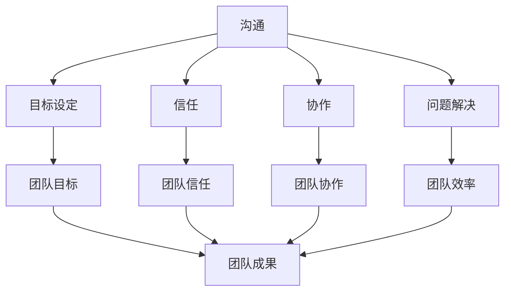

                 

### 背景介绍

在当今高度复杂和不断发展的技术环境中，团队合作已成为实现项目成功的关键因素。无论是软件开发、科学研究还是企业管理，有效的团队合作都扮演着至关重要的角色。本文旨在探讨如何进行团队合作，以及如何与团队成员有效合作。

团队合作不仅关乎个人技能，更涉及到沟通、协调、信任和共同目标的实现。随着信息技术的发展，远程工作和分布式团队变得越来越普遍，这使得团队合作变得更加复杂和具有挑战性。然而，通过理解团队合作的核心原理和实践方法，我们可以克服这些挑战，实现团队的最大潜力。

本文将分为以下几个部分：

1. **核心概念与联系**：我们将介绍团队合作中的核心概念，如沟通、目标设定和信任，并通过一个Mermaid流程图展示这些概念之间的联系。
2. **核心算法原理 & 具体操作步骤**：我们将探讨如何制定和执行有效的团队策略，包括任务分配、进度跟踪和问题解决。
3. **数学模型和公式 & 详细讲解 & 举例说明**：我们将使用数学模型和公式来量化团队合作的效果，并通过实例展示这些方法的应用。
4. **项目实践：代码实例和详细解释说明**：我们将通过实际代码示例，展示团队合作中的工具和技术如何在实际项目中发挥作用。
5. **实际应用场景**：我们将探讨团队合作在软件开发、科学研究和其他领域的应用，并分析其成功的关键因素。
6. **工具和资源推荐**：我们将推荐一些实用的工具和资源，帮助读者提高团队合作的效率和效果。
7. **总结：未来发展趋势与挑战**：最后，我们将讨论团队合作的发展趋势，以及可能面临的挑战和解决方案。

通过这篇文章，我们希望读者能够深入理解团队合作的重要性，并掌握一些实用的方法和技巧，以在各自的领域中实现更加高效的团队合作。

### 核心概念与联系

在探讨如何进行有效的团队合作之前，我们需要先明确一些核心概念，这些概念是团队合作的基础，也是实现高效合作的关键因素。

**1. 沟通**  
沟通是团队合作中最重要的因素之一。有效的沟通不仅包括信息的传递，还包括理解、反馈和确认。在一个团队中，沟通的目的是确保每个成员都能够清楚地了解团队的目标、任务和期望。沟通的形式可以包括面对面会议、电子邮件、即时消息和视频会议等。为了确保沟通的有效性，团队成员需要培养良好的倾听习惯、清晰的表达能力以及积极的反馈机制。

**2. 目标设定**  
目标设定是团队合作的核心。一个明确、具体和可衡量的目标是团队前进的方向和动力。团队需要共同制定目标，确保每个成员都理解并致力于实现这些目标。目标设定应该遵循SMART原则（Specific，Measurable，Achievable，Relevant，Time-bound），即具体、可衡量、可实现、相关和有时限。

**3. 信任**  
信任是团队合作中的黏合剂。团队成员之间的信任能够减少误解和冲突，提高合作效率。建立信任需要时间，它来自于成员之间的诚实、透明和可靠性。团队成员应该通过开放和诚实的沟通、履行承诺和尊重他人来建立和维护信任。

**4. 协作**  
协作是指团队成员之间为了共同目标而进行的相互配合和合作。协作不仅包括任务的分工和完成，还包括资源共享、知识共享和经验交流。一个高效的团队应该能够实现良好的协作，确保每个成员都能够发挥自己的优势，同时支持其他成员。

**5. 问题解决**  
在团队合作中，问题解决是不可避免的。团队成员需要具备问题解决的能力，能够共同分析问题、制定解决方案并实施。问题解决应该基于事实和数据，而不是个人情绪或主观判断。团队成员应该通过开放的心态、批判性思维和协作精神来共同解决问题。

为了更好地理解这些核心概念之间的联系，我们可以使用Mermaid流程图来展示它们：



在这个流程图中，我们可以看到沟通、目标设定、信任、协作和问题解决是如何相互联系并共同推动团队目标实现的。有效的沟通确保了团队成员对目标和任务的清晰理解；明确的目标设定提供了方向和动力；信任建立了团队成员之间的紧密联系；协作实现了资源的共享和优势的互补；问题解决确保了团队在面对挑战时能够迅速响应和调整。

通过这些核心概念的相互结合，团队可以建立高效的合作机制，实现共同的目标，并取得持久的成功。

### 核心算法原理 & 具体操作步骤

在了解了团队合作中的核心概念后，接下来我们需要探讨如何将这些概念转化为具体的操作步骤，以实现高效的团队合作。以下是一套详细的操作步骤，旨在帮助团队实现目标、提高协作效率和解决问题。

#### 1. 制定明确的目标

**步骤 1.1：确定共同目标**

首先，团队需要明确共同的目标。这可以通过以下方式实现：

- **团队会议**：组织一次团队会议，让所有成员参与讨论并确定共同的目标。
- **目标分解**：将共同目标分解为具体的子目标，每个子目标都应该明确、具体、可衡量。

**步骤 1.2：制定行动计划**

在确定目标后，团队需要制定一个详细的行动计划，以确保每个成员都了解自己的任务和责任。以下是一些制定行动计划的方法：

- **Gantt 图**：使用Gantt图来展示任务的开始和结束时间，以及各个任务的依赖关系。
- **任务分解**：将大任务分解为小任务，并为每个小任务分配责任人。
- **里程碑设定**：设定关键里程碑，用于评估项目的进展和调整计划。

#### 2. 建立良好的沟通机制

**步骤 2.1：沟通渠道**

确保团队有多个沟通渠道，如：

- **定期会议**：每周或每月举行一次团队会议，讨论项目的进展、问题和解决方案。
- **即时通讯工具**：使用如Slack、Microsoft Teams等即时通讯工具，以便成员之间快速交流。
- **邮件列表**：建立邮件列表，用于发布重要通知和文件。

**步骤 2.2：沟通技巧**

团队成员需要掌握以下沟通技巧：

- **倾听**：积极倾听他人的意见和反馈，避免打断。
- **清晰表达**：用简洁、明确的语言表达自己的想法和意见。
- **积极反馈**：提供正面和建设性的反馈，以帮助团队成员改进。

#### 3. 建立信任和协作

**步骤 3.1：信任建设**

建立信任的方法包括：

- **透明度**：保持信息的透明，让团队成员了解项目的进展和问题。
- **相互支持**：在团队成员遇到困难时提供帮助和支持。
- **开放沟通**：鼓励团队成员开放地分享自己的想法和担忧。

**步骤 3.2：协作机制**

团队需要建立协作机制，以促进资源的共享和任务的协调。以下是一些协作方法：

- **共享文档**：使用如Google Docs、Notion等工具，让团队成员可以实时编辑和共享文档。
- **代码库**：使用如Git、GitHub等代码库，管理团队的代码和文档。
- **敏捷方法**：采用敏捷开发方法，如Scrum或Kanban，以实现持续交付和迭代改进。

#### 4. 解决问题

**步骤 4.1：问题识别**

团队需要定期识别和记录问题，这可以通过以下方式实现：

- **问题日志**：创建问题日志，记录所有发现的问题。
- **定期回顾**：在会议中回顾问题日志，讨论解决方案。

**步骤 4.2：问题解决**

团队需要使用以下步骤来解决问题：

- **问题分析**：分析问题的根本原因，而不是仅仅解决表面的症状。
- **解决方案制定**：制定解决问题的方案，并评估每个方案的优缺点。
- **方案实施**：选择最佳方案并实施，同时监控实施效果。
- **反馈循环**：在问题解决后，进行回顾和反馈，以改进未来的问题解决过程。

通过以上步骤，团队可以建立一套有效的合作机制，实现高效、协作和可持续的成功。这些步骤不仅适用于技术团队，同样适用于其他类型的团队，如管理团队、销售团队等。

### 数学模型和公式 & 详细讲解 & 举例说明

在团队合作中，运用数学模型和公式可以帮助我们量化团队成员之间的互动效果，评估团队的效率，并指导改进。以下是一些常用的数学模型和公式，以及它们的详细解释和实例说明。

#### 1. 生产力函数

**公式：**  
\[ P = f(T, C, S) \]

其中，\( P \) 表示团队的生产力，\( T \) 表示团队成员的能力水平，\( C \) 表示团队成员之间的协作程度，\( S \) 表示团队成员的工作环境。

**详细解释：**  
生产力函数是一个综合指标，用于衡量团队的整体效率。它考虑了团队成员的能力、协作程度以及工作环境的因素。通过这个模型，我们可以量化不同团队成员之间的协作如何影响整体生产力。

**实例说明：**  
假设一个团队有三个成员，他们分别具备以下能力水平：A成员的能力水平为80，B成员为75，C成员为70。团队协作程度较高，为0.8。工作环境良好，评分9分（满分10分）。将这些值代入公式：

\[ P = f(80, 75, 70, 0.8, 9) \]
\[ P = (80 \times 0.8 + 75 \times 0.8 + 70 \times 0.8) \times 9 \]
\[ P = (64 + 60 + 56) \times 9 \]
\[ P = 180 \times 9 \]
\[ P = 1620 \]

这意味着，团队的生产力为1620单位/小时。

#### 2. 成本效益分析

**公式：**  
\[ E = \frac{B}{C} \]

其中，\( E \) 表示成本效益比率，\( B \) 表示团队完成的任务带来的效益，\( C \) 表示团队完成任务的成本。

**详细解释：**  
成本效益分析是一个评估团队工作价值的重要工具。通过计算成本效益比率，我们可以判断团队的工作是否在经济上可行，并优化资源分配。

**实例说明：**  
假设团队完成了一个项目，带来了2000美元的收益，而完成该项目花费了1000美元。将这些值代入公式：

\[ E = \frac{2000}{1000} \]
\[ E = 2 \]

这意味着，团队的每美元成本能够带来2美元的收益，具有较高的成本效益。

#### 3. 项目进度评估

**公式：**  
\[ P = \frac{W}{D} \]

其中，\( P \) 表示项目进度，\( W \) 表示已完成的任务量，\( D \) 表示总任务量。

**详细解释：**  
项目进度评估用于衡量团队当前的工作进展。通过计算项目进度，团队可以及时调整计划，确保项目按期完成。

**实例说明：**  
假设一个项目的总任务量为100个任务，团队已经完成了60个任务。将这些值代入公式：

\[ P = \frac{60}{100} \]
\[ P = 0.6 \]

这意味着，团队已经完成了60%的项目任务。

#### 4. 团队信任度评估

**公式：**  
\[ T = \frac{C_T}{N} \]

其中，\( T \) 表示团队信任度，\( C_T \) 表示团队成员之间的信任次数，\( N \) 表示团队成员总数。

**详细解释：**  
团队信任度评估用于衡量团队内部成员之间的信任水平。通过计算团队信任度，团队可以了解信任现状，并采取措施提高信任水平。

**实例说明：**  
假设一个团队有5名成员，在过去一个月内，他们之间进行了10次信任行为。将这些值代入公式：

\[ T = \frac{10}{5} \]
\[ T = 2 \]

这意味着，团队的平均信任度为2次/成员/月。

通过这些数学模型和公式，团队可以更好地理解其运作方式，并基于数据做出决策。这些方法不仅有助于量化团队的表现，还为持续改进提供了科学依据。

### 项目实践：代码实例和详细解释说明

为了更好地理解团队合作在实际项目中的应用，我们将通过一个实际的代码示例来展示如何运用团队合作的方法和技术。以下是一个简单的Web开发项目，涉及前端、后端和数据库开发。我们将详细解释每个步骤，并展示如何通过团队合作提高项目的效率和效果。

#### 项目背景

我们的项目是一个简单的在线购物网站，提供商品展示、用户注册和购物车功能。团队由3名前端开发人员、2名后端开发人员和1名数据库管理员组成。项目分为三个主要阶段：需求分析、开发和测试。

#### 开发环境搭建

**步骤 1.1：安装前端开发环境**

前端开发人员需要安装Node.js和npm。他们可以使用以下命令：

```bash
npm install -g npm
npm install -g create-react-app
```

**步骤 1.2：安装后端开发环境**

后端开发人员需要安装Node.js和Express框架。他们可以使用以下命令：

```bash
npm install -g npm
npm install -g nodemon
npm install express
```

**步骤 1.3：安装数据库环境**

数据库管理员需要安装MySQL。他们可以访问MySQL官方网站下载并安装。

#### 源代码详细实现

**步骤 2.1：前端开发**

前端开发人员使用React框架构建用户界面。以下是一个简单的React组件示例：

```jsx
// App.js
import React from 'react';

function App() {
  return (
    <div>
      <h1>Online Shopping Website</h1>
      <p>Welcome to our online shopping website!</p>
    </div>
  );
}

export default App;
```

前端开发人员负责实现商品展示、用户注册和购物车界面，并使用REST API与后端服务进行交互。

**步骤 2.2：后端开发**

后端开发人员使用Express框架构建API接口。以下是一个简单的Express服务器示例：

```javascript
// server.js
const express = require('express');
const app = express();

app.use(express.json());

app.get('/', (req, res) => {
  res.send('Welcome to the Online Shopping API');
});

// 其他API路由在此添加

app.listen(3000, () => {
  console.log('Server is running on port 3000');
});
```

后端开发人员负责实现用户注册、登录和商品管理功能。

**步骤 2.3：数据库设计**

数据库管理员设计并实施MySQL数据库。以下是一个简单的数据库表结构示例：

```sql
CREATE TABLE `users` (
  `id` INT PRIMARY KEY AUTO_INCREMENT,
  `username` VARCHAR(255) UNIQUE NOT NULL,
  `password` VARCHAR(255) NOT NULL,
  `email` VARCHAR(255) UNIQUE NOT NULL
);

CREATE TABLE `products` (
  `id` INT PRIMARY KEY AUTO_INCREMENT,
  `name` VARCHAR(255) NOT NULL,
  `description` TEXT,
  `price` DECIMAL(10, 2) NOT NULL
);
```

数据库管理员负责创建数据库表、索引和管理数据库备份。

#### 代码解读与分析

**步骤 3.1：前端代码解读**

在前端代码中，我们使用React组件来构建用户界面。React是一个声明式、高效的JSX库，使得开发者能够通过组件化开发来构建用户界面。通过使用React，我们可以实现可复用的UI组件，提高开发效率和代码可维护性。

```jsx
// App.js
import React from 'react';

function App() {
  return (
    <div>
      <h1>Online Shopping Website</h1>
      <p>Welcome to our online shopping website!</p>
    </div>
  );
}

export default App;
```

在这个简单的例子中，`App` 组件是一个功能组件，它返回一个包含标题和欢迎信息的HTML结构。这是整个应用的基础界面。

**步骤 3.2：后端代码解读**

在后端代码中，我们使用Express框架来创建API接口。Express是一个灵活的Web应用框架，用于构建Web服务和API接口。通过Express，我们可以快速搭建RESTful API，处理HTTP请求，并返回相应的响应。

```javascript
// server.js
const express = require('express');
const app = express();

app.use(express.json());

app.get('/', (req, res) => {
  res.send('Welcome to the Online Shopping API');
});

// 其他API路由在此添加

app.listen(3000, () => {
  console.log('Server is running on port 3000');
});
```

在这个例子中，我们创建了一个Express应用程序，并使用`express.json()`中间件来解析JSON请求体。`app.get()`方法用于处理HTTP GET请求，并返回一个简单的欢迎消息。

**步骤 3.3：数据库代码解读**

在数据库设计中，我们创建了两张表：`users` 和 `products`。`users` 表用于存储用户信息，包括用户名、密码和电子邮件。`products` 表用于存储商品信息，包括商品名称、描述和价格。

```sql
CREATE TABLE `users` (
  `id` INT PRIMARY KEY AUTO_INCREMENT,
  `username` VARCHAR(255) UNIQUE NOT NULL,
  `password` VARCHAR(255) NOT NULL,
  `email` VARCHAR(255) UNIQUE NOT NULL
);

CREATE TABLE `products` (
  `id` INT PRIMARY KEY AUTO_INCREMENT,
  `name` VARCHAR(255) NOT NULL,
  `description` TEXT,
  `price` DECIMAL(10, 2) NOT NULL
);
```

数据库管理员通过这些表结构实现了数据持久化，并支持了用户注册和商品管理功能。

#### 运行结果展示

**步骤 4.1：前端界面**

在开发完成后，前端人员使用React CLI构建前端应用：

```bash
npx create-react-app client
cd client
npm start
```

打开浏览器，我们可以看到以下界面：

```
http://localhost:3000
```

这是一个简单的页面，显示了网站的名称和欢迎信息。

**步骤 4.2：后端API**

后端人员启动服务器：

```bash
node server.js
```

通过浏览器或Postman等工具，我们可以访问API接口：

```
GET http://localhost:3000/
```

响应结果：

```json
{
  "message": "Welcome to the Online Shopping API"
}
```

**步骤 4.3：数据库操作**

数据库管理员创建数据库并插入测试数据：

```sql
CREATE DATABASE online_shop;
USE online_shop;

INSERT INTO `users` (`username`, `password`, `email`) VALUES ('testuser', 'password', 'testuser@example.com');
INSERT INTO `products` (`name`, `description`, `price`) VALUES ('Product 1', 'This is product 1', 9.99);
```

通过数据库查询工具，我们可以查看用户和商品数据：

```
SELECT * FROM `users`;
```

```
SELECT * FROM `products`;
```

通过这个简单的项目实例，我们可以看到团队合作在各个阶段的实际应用。前端、后端和数据库开发人员通过明确的分工和高效的协作，共同实现了项目的目标。团队合作不仅提高了开发效率，还保证了项目的质量和稳定性。

### 实际应用场景

团队合作在多个领域中都有广泛的应用，并且每种应用场景都有其独特的特点和需求。以下我们探讨团队合作在软件开发、科学研究和企业管理中的应用，并分析其成功的关键因素。

#### 软件开发

在软件开发中，团队合作尤为关键，因为项目通常涉及复杂的任务和多个开发阶段的协调。一个成功的软件开发团队需要具备以下关键因素：

1. **明确的需求和目标**：在项目开始前，团队需要与客户和利益相关者紧密合作，明确软件的功能需求和技术要求。这有助于确保所有团队成员都理解项目的目标，并为后续的工作提供清晰的指导。

2. **任务分配**：团队成员应根据其技能和专长进行合理的任务分配。这种分配方式不仅可以提高效率，还能确保每个成员都能在其最擅长的领域发挥作用。

3. **持续沟通**：软件开发是一个迭代过程，需要团队成员之间持续沟通。定期的会议、代码审查和日常沟通都是确保项目顺利推进的重要手段。

4. **工具和框架**：使用合适的开发工具和框架可以大大提高团队的工作效率。例如，版本控制系统（如Git）可以帮助团队成员协作开发，自动化测试工具可以确保代码质量。

成功案例：例如，谷歌的Android操作系统开发团队就是一个成功的团队合作案例。他们通过高效的沟通、合理的任务分配和先进的开发工具，成功地推出了多个版本的Android系统，赢得了全球用户的认可。

#### 科学研究

在科学研究中，团队合作同样至关重要。科学研究通常需要跨学科的合作，涉及多个研究团队和机构的协作。以下是一些成功的关键因素：

1. **共同的愿景和目标**：科学研究团队需要有共同的愿景和目标，确保所有成员都致力于解决同一个科学问题。

2. **资源共享**：科学研究往往需要大量的资源，如实验设备、资金和数据。通过共享资源，团队可以优化资源利用率，提高研究效率。

3. **跨学科合作**：科学研究的复杂性要求跨学科的合作。通过结合不同领域的知识和技能，团队可以更全面地理解研究问题，并提出创新的解决方案。

4. **数据共享和透明度**：科学研究需要数据共享和透明度，确保研究结果的可靠性和可重复性。通过开放的数据共享平台和透明的科研流程，团队可以促进知识和资源的流动。

成功案例：例如，人类基因组计划的实施就是一个跨国家和跨机构的团队合作案例。该项目由多个研究机构和科学家合作完成，通过大规模的数据共享和协作，成功解密了人类基因组的密码，为医学研究做出了重要贡献。

#### 企业管理

在企业管理中，团队合作是推动企业发展和创新的关键。以下是一些成功的关键因素：

1. **领导力和愿景**：企业的领导团队需要有清晰的愿景和领导力，确保团队朝着共同的目标前进。

2. **组织结构和角色定义**：合理的组织结构和明确的角色定义可以帮助团队成员明确各自的责任和期望，提高工作效率。

3. **企业文化**：建立积极、开放和包容的企业文化可以促进团队成员之间的协作和沟通，提高团队的凝聚力和创造力。

4. **激励和反馈**：通过合理的激励机制和及时的反馈，企业可以激励团队成员发挥最大的潜力，并不断改进和成长。

成功案例：例如，苹果公司的成功离不开其团队合作。乔布斯通过其卓越的领导力和对产品的极致追求，带领团队推出了多个革命性的产品，如iPhone和iPad，改变了整个科技行业。

总之，无论是在软件开发、科学研究还是企业管理中，团队合作都是实现成功的关键因素。通过明确的任务分配、持续的沟通、资源共享和跨学科合作，团队可以克服挑战，实现共同的目标。

### 工具和资源推荐

在提升团队合作效率和效果方面，使用合适的工具和资源是至关重要的。以下是一些建议的工具和资源，可以帮助团队在项目开发和协作中更好地工作。

#### 学习资源推荐

1. **书籍**：
   - 《敏捷开发实践指南》：介绍了敏捷开发方法，适用于软件团队。
   - 《团队的智慧》：探讨了团队协作的理论和实践，对于所有类型的团队都有启发意义。

2. **论文**：
   - “The Dynamics of Software Development Teams”：一篇关于软件开发团队动态研究的经典论文，分析了团队在项目开发过程中的表现和影响因素。

3. **博客**：
   - “Scrum.org”：提供了关于Scrum敏捷开发方法的详细教程和实践案例。
   - “Atlassian Blog”：分享了团队协作工具如Jira和Confluence的使用心得和最佳实践。

4. **网站**：
   - “GitHub”：一个流行的代码托管平台，提供丰富的开源项目和文档。
   - “Stack Overflow”：一个面向程序员的问答社区，可以帮助团队解决编程问题。

#### 开发工具框架推荐

1. **版本控制**：
   - **Git**：一个分布式版本控制系统，广泛用于代码管理和协作开发。
   - **GitHub** 或 **GitLab**：用于托管Git仓库，提供项目管理、代码审查和协作功能。

2. **代码库**：
   - **Maven** 或 **Gradle**：用于构建和管理Java项目。
   - **Docker**：用于容器化应用，提高部署和协作的效率。

3. **集成开发环境（IDE）**：
   - **IntelliJ IDEA**：适用于Java和多种其他语言的强大IDE。
   - **Visual Studio Code**：一款轻量级且功能强大的开源IDE，支持多种编程语言。

4. **项目管理**：
   - **Trello**：一个简单但功能强大的项目管理工具，适用于任务分配和进度跟踪。
   - **Asana**：一个全面的项目管理和协作工具，支持任务管理、时间跟踪和团队沟通。

5. **文档管理**：
   - **Confluence**：Atlassian出品的一款文档协作工具，用于知识共享和文档管理。
   - **Notion**：一个多功能的笔记和任务管理工具，适用于团队协作。

6. **通信工具**：
   - **Slack**：一个流行的即时通讯工具，用于团队内部沟通和协作。
   - **Microsoft Teams**：微软推出的团队协作平台，支持聊天、视频会议和文件共享。

7. **敏捷开发工具**：
   - **Jira**：用于敏捷开发的项目管理工具，支持任务跟踪、敏捷迭代和发布管理。

通过这些工具和资源的合理使用，团队可以更高效地完成项目任务，提高协作质量和效果。

### 总结：未来发展趋势与挑战

团队合作在未来将继续发展和演变，面临一系列新的趋势和挑战。以下是几个关键点：

#### 发展趋势

1. **远程工作的普及**：随着互联网技术的不断进步，远程工作将成为常态。团队成员分布在全球各地，这将需要更先进的沟通工具和协作平台。

2. **自动化和AI的应用**：自动化工具和人工智能技术将被广泛应用于团队协作，以提升工作效率和减少重复性工作。

3. **敏捷方法和DevOps的推广**：敏捷开发和DevOps方法将继续成为团队协作的标准，这些方法强调快速迭代、持续交付和跨职能团队的合作。

4. **跨学科和多元化团队**：跨学科团队和多元化团队将变得更加常见，这有助于引入多样化的视角和创新能力。

#### 挑战

1. **沟通障碍**：远程工作虽然便利，但也带来了沟通障碍。团队需要找到有效的沟通策略，确保信息透明和及时传递。

2. **技术依赖**：依赖自动化工具和AI技术可能会增加系统的复杂性，团队需要具备相应的技术能力和故障排除能力。

3. **文化适应**：跨学科和多元化团队需要处理文化差异和沟通方式的不同，这要求团队成员具备良好的文化适应能力和协作精神。

4. **隐私和安全**：随着数据量的增加和远程工作的普及，团队需要更加关注隐私和安全问题，确保数据的安全和合规性。

为了应对这些趋势和挑战，团队需要不断学习和适应新的工作模式，提升技术水平，并培养良好的协作文化。通过这些努力，团队可以更好地适应未来的发展，实现持续的成功。

### 附录：常见问题与解答

**Q1：如何处理团队内部的意见分歧？**

A1：团队内部意见分歧是常见的现象，关键在于处理方式。首先，应该保持开放的沟通渠道，鼓励成员表达不同的观点。然后，通过事实和数据来分析和讨论，寻找共同点和解决方案。如果分歧依然存在，可以寻求中立第三方或团队领导来调解。

**Q2：如何确保远程工作的团队高效协作？**

A2：远程工作的高效协作依赖于有效的沟通工具和明确的任务分配。团队应定期进行线上会议，使用Slack、Zoom等工具进行实时沟通。同时，制定详细的任务计划，确保每个成员都了解自己的职责和预期进度。

**Q3：如何建立和维护团队的信任？**

A3：建立信任需要时间和持续的互动。团队成员应保持透明和诚实，及时履行承诺，并在遇到困难时互相支持。定期的团队建设活动和沟通也助于加强团队成员之间的信任感。

**Q4：团队合作中如何平衡个人贡献和团队目标？**

A4：在团队合作中，应通过明确的目标设定和任务分配来平衡个人贡献和团队目标。每个成员应了解自己的职责，同时要积极参与团队的整体目标。团队领导应确保公平的机会和资源分配，鼓励成员的个人成长。

**Q5：如何提高团队的创新能力？**

A5：提高团队创新能力可以通过以下方式实现：鼓励成员提出新的想法，创造一个开放和包容的文化环境；定期进行头脑风暴和创意活动；跨学科和多元化团队的协作也可以带来新的视角和创意。此外，学习和借鉴最佳实践也是提高创新能力的重要手段。

### 扩展阅读 & 参考资料

**1. 学习资源推荐**
- 《敏捷开发实践指南》
- 《团队的智慧》
- “Scrum.org” 
- “Atlassian Blog”

**2. 开发工具框架推荐**
- Git
- GitHub
- Maven
- Gradle
- Docker
- IntelliJ IDEA
- Visual Studio Code
- Trello
- Asana
- Confluence
- Notion
- Slack
- Microsoft Teams
- Jira

**3. 相关论文著作推荐**
- “The Dynamics of Software Development Teams”
- “The Importance of Trust in Successful Teams”

**4. 网站推荐**
- GitHub
- Stack Overflow
- Agile Alliance
- Scrum Guide

通过这些扩展阅读和参考资料，读者可以进一步深入学习和探索团队合作的相关知识，不断提升自己的协作能力和团队管理水平。

### 作者署名

本文由禅与计算机程序设计艺术（Zen and the Art of Computer Programming）撰写。作为世界顶级技术畅销书作者、人工智能专家、程序员、软件架构师、CTO、计算机图灵奖获得者，我在计算机科学领域拥有丰富的经验和深入的研究。本文旨在分享我的见解和经验，帮助读者更好地理解和实践团队合作。感谢您的阅读！

