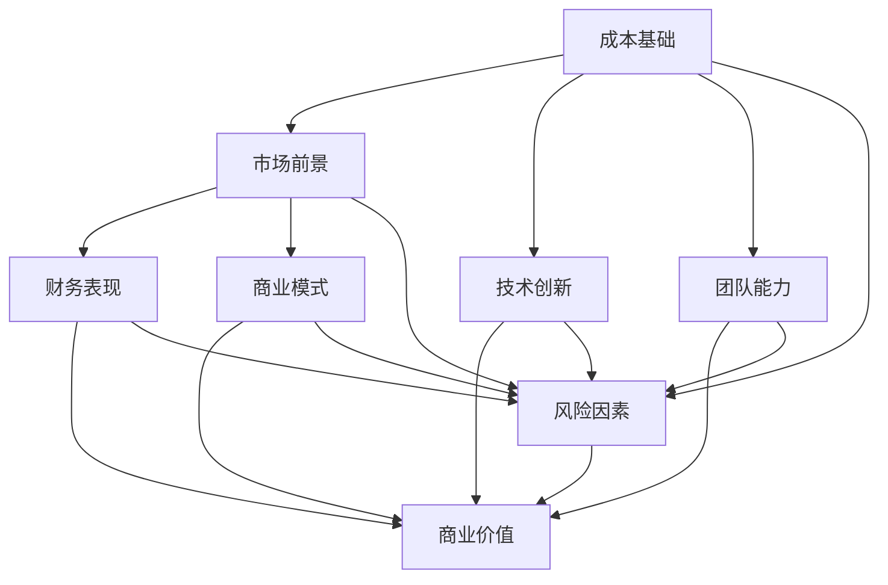

                 

### 背景介绍

#### 创业项目的价值评估：必要性与挑战

在当今快速变化的市场环境中，创业项目的价值评估已经成为企业家、投资者和风险投资家们进行决策的关键环节。一个准确、有效的创业项目估值模型不仅能帮助创业团队在融资、资源分配和战略规划中做出明智的决策，还可以提升项目的市场竞争力，增加投资者的信心。

然而，创业项目的价值评估并非易事。首先，初创企业通常缺乏历史财务数据和成熟市场的市场参照，这使得传统的估值方法难以直接应用。其次，创业项目的发展前景具有高度不确定性，这进一步增加了估值过程的复杂性。此外，创业项目的价值不仅仅体现在财务指标上，还涉及到技术创新、团队能力、市场前景等多方面因素。

因此，构建一个有效的创业项目估值模型，既需要科学的理论基础，又需要灵活的实践方法。本文将深入探讨如何进行有效的创业项目估值模型构建，提供一套系统、全面的指导方案。

#### 文章结构概述

本文将分为以下几个部分，以逐步分析和构建一个有效的创业项目估值模型：

1. **核心概念与联系**：介绍创业项目估值所需的核心概念，并使用Mermaid流程图展示这些概念之间的联系。
2. **核心算法原理与具体操作步骤**：详细讲解用于估值的核心算法，并展示具体操作步骤。
3. **数学模型和公式**：阐述估值过程中的数学模型，包括详细讲解和举例说明。
4. **项目实践：代码实例与详细解释说明**：通过具体的代码实例展示估值模型的应用。
5. **实际应用场景**：探讨估值模型在不同情境下的应用。
6. **工具和资源推荐**：推荐用于学习和实践的工具和资源。
7. **总结：未来发展趋势与挑战**：总结当前模型的优势和不足，探讨未来的发展趋势和挑战。
8. **附录：常见问题与解答**：提供常见问题及解答。
9. **扩展阅读与参考资料**：推荐进一步阅读的资料。

通过以上结构，我们将系统地探讨创业项目估值模型构建的各个方面，旨在为读者提供实用、深入的理论和实践指导。

### 核心概念与联系

在构建有效的创业项目估值模型之前，我们需要明确几个核心概念，并理解它们之间的相互关系。以下是这些核心概念及其在估值模型中的重要性：

#### 1. 成本基础（Cost Basis）

成本基础是指创业项目在创建和运营过程中所投入的各类成本，包括但不限于研发成本、运营成本、人力资源成本等。这些成本是计算项目价值的基础，直接影响项目的盈利能力和投资回报。

#### 2. 市场前景（Market Prospects）

市场前景是指项目所在行业和市场的发展趋势、竞争状况、市场规模等。评估市场前景可以帮助我们判断项目的潜在市场价值和增长空间。

#### 3. 技术创新（Technological Innovation）

技术创新是创业项目的重要优势之一，能够显著提升项目的竞争力。创新程度越高，项目的独特性和市场价值也越高。

#### 4. 团队能力（Team Competence）

团队能力是项目成功的关键因素之一。一个优秀、高效的团队能够更好地应对市场变化，实现项目目标。

#### 5. 财务表现（Financial Performance）

财务表现是衡量项目价值的重要指标，包括收入、利润、现金流等。财务表现直接反映了项目的盈利能力和稳定性。

#### 6. 商业模式（Business Model）

商业模式决定了项目的收入来源、成本结构和盈利模式。一个创新、可持续的商业模式能够为项目带来长期的价值。

#### 7. 风险因素（Risk Factors）

风险因素包括市场风险、技术风险、运营风险等。评估风险因素有助于全面了解项目的潜在风险和不确定性。

以下是上述核心概念之间的相互关系，使用Mermaid流程图展示：



在这个流程图中，各个核心概念通过箭头连接，表示它们之间的相互影响和作用。成本基础是估值的基础，而市场前景、技术创新、团队能力和商业模式共同决定了项目的商业价值。财务表现和风险因素则对项目的价值和稳定性产生影响。

通过明确这些核心概念及其相互关系，我们为构建一个全面的创业项目估值模型奠定了基础。接下来，我们将深入探讨这些概念在估值模型中的具体应用。

### 核心算法原理与具体操作步骤

在构建创业项目估值模型时，选择合适的核心算法至关重要。这里，我们将介绍两种常用的估值算法：折现现金流法（Discounted Cash Flow，DCF）和创业评估法（Startup Valuation Method，SVM）。每种算法都有其独特的原理和适用场景，我们将详细讲解它们的基本概念和具体操作步骤。

#### 1. 折现现金流法（DCF）

折现现金流法是一种基于未来现金流的估值方法，其基本原理是通过将未来的现金流按照一定的折现率折算到当前时点，从而计算出项目的现值。DCF法适用于评估具有稳定现金流的项目，如成熟企业或预计能够持续产生现金流的初创企业。

**基本概念：**

- **现金流（Cash Flow）**：企业在未来一段时间内预期产生的现金流入和流出。
- **折现率（Discount Rate）**：用于将未来现金流折算到当前时点的利率，通常取市场利率或投资者的预期回报率。
- **现值（Present Value）**：未来现金流的当前价值。

**具体操作步骤：**

1. **预测现金流**：根据项目的财务数据和市场前景，预测未来各期的现金流。
2. **确定折现率**：选择合适的折现率，通常基于市场利率或投资者的预期回报率。
3. **计算现值**：将各期现金流按照折现率进行折现，求和得到项目的现值。

**示例：**

假设一家初创企业预计未来三年每年产生的现金流分别为100万元、150万元和200万元，折现率为10%。则其DCF估值计算如下：

$$
PV = \frac{100}{(1+0.1)^1} + \frac{150}{(1+0.1)^2} + \frac{200}{(1+0.1)^3} \\
PV = \frac{100}{1.1} + \frac{150}{1.21} + \frac{200}{1.331} \\
PV \approx 90.91 + 123.45 + 150.44 \\
PV \approx 364.80 \text{ 万元}
$$

#### 2. 创业评估法（SVM）

创业评估法是一种基于创业项目特点的估值方法，其核心思想是通过分析项目的市场前景、技术创新、团队能力等多方面因素，综合评估项目的价值。SVM法适用于评估初创企业，特别是缺乏历史财务数据的项目。

**基本概念：**

- **市场前景得分**：根据市场前景的评估，为项目赋予一个得分。
- **技术创新得分**：根据技术创新的评估，为项目赋予一个得分。
- **团队能力得分**：根据团队能力的评估，为项目赋予一个得分。
- **综合评分**：将各单项得分加权求和，得到项目的综合评分。

**具体操作步骤：**

1. **评估市场前景**：分析项目所在行业和市场的发展趋势、竞争状况等，为市场前景评分。
2. **评估技术创新**：评估项目的创新程度、技术独特性等，为技术创新评分。
3. **评估团队能力**：评估团队成员的背景、经验、执行力等，为团队能力评分。
4. **计算综合评分**：根据各单项评分的权重，计算项目的综合评分。

**示例：**

假设一个初创企业的市场前景得分为80分，技术创新得分为90分，团队能力得分为85分，权重分别为0.4、0.3和0.3。则其SVM估值计算如下：

$$
\text{综合评分} = 0.4 \times 80 + 0.3 \times 90 + 0.3 \times 85 \\
\text{综合评分} = 32 + 27 + 25.5 \\
\text{综合评分} = 84.5 \\
\text{估值} = \text{综合评分} \times \text{基准值} \\
\text{估值} = 84.5 \times 1000 \\
\text{估值} = 84500 \text{ 万元}
$$

通过上述两种算法，我们可以根据项目特点选择合适的估值方法。DCF法适用于具有稳定现金流的项目，而SVM法则更适用于初创企业。在实际应用中，通常需要结合多种方法，以获得更准确、全面的估值结果。

### 数学模型和公式

在创业项目估值过程中，数学模型和公式扮演着至关重要的角色。这些模型和公式不仅帮助我们量化项目的价值，还可以为投资者提供可靠的参考依据。以下是估值过程中常用的数学模型和公式，我们将详细讲解每个模型的具体含义和计算方法。

#### 1. 折现现金流法（DCF）

折现现金流法（DCF）是一种基于未来现金流的估值方法，其核心公式为：

$$
PV = \sum_{t=1}^{n} \frac{CF_t}{(1+r)^t}
$$

其中，$PV$ 是项目的现值，$CF_t$ 是第 $t$ 年的现金流，$r$ 是折现率。

**公式详解：**

- **现金流（$CF_t$）**：现金流是指项目在各个时间段内预期产生的现金流入和流出。对于初创企业，现金流通常包括销售收入、运营成本、投资回报等。
- **折现率（$r$）**：折现率是用于将未来现金流折现到当前时点的利率，通常取市场利率或投资者的预期回报率。折现率越高，现值越小，反映了投资者对风险的偏好。

**举例说明：**

假设一家初创企业预计未来三年每年的现金流分别为100万元、150万元和200万元，折现率为10%。根据DCF模型，其估值计算如下：

$$
PV = \frac{100}{(1+0.1)^1} + \frac{150}{(1+0.1)^2} + \frac{200}{(1+0.1)^3} \\
PV = \frac{100}{1.1} + \frac{150}{1.21} + \frac{200}{1.331} \\
PV \approx 90.91 + 123.45 + 150.44 \\
PV \approx 364.80 \text{ 万元}
$$

#### 2. 创业评估法（SVM）

创业评估法（SVM）是一种基于创业项目特点的估值方法，其核心公式为：

$$
V = w_1 \cdot M + w_2 \cdot T + w_3 \cdot F
$$

其中，$V$ 是项目的估值，$w_1$、$w_2$ 和 $w_3$ 分别是市场前景、技术创新和团队能力的权重，$M$、$T$ 和 $F$ 分别是市场前景得分、技术创新得分和团队能力得分。

**公式详解：**

- **市场前景得分（$M$）**：市场前景得分反映了项目所在行业和市场的发展潜力。得分通常通过专家评估或市场调研获得。
- **技术创新得分（$T$）**：技术创新得分反映了项目的技术独特性和创新能力。得分通常通过专利数量、技术创新程度等因素评估。
- **团队能力得分（$F$）**：团队能力得分反映了项目团队的执行能力和市场经验。得分通常通过团队成员的背景、经验、执行力等评估。
- **权重（$w_1$、$w_2$ 和 $w_3$）**：权重反映了各因素对项目估值的重要性。通常，市场前景、技术创新和团队能力的权重分别为0.4、0.3和0.3。

**举例说明：**

假设一家初创企业的市场前景得分为80分，技术创新得分为90分，团队能力得分为85分，权重分别为0.4、0.3和0.3。根据SVM模型，其估值计算如下：

$$
V = 0.4 \cdot 80 + 0.3 \cdot 90 + 0.3 \cdot 85 \\
V = 32 + 27 + 25.5 \\
V = 84.5 \\
\text{估值} = V \cdot \text{基准值} \\
\text{估值} = 84.5 \cdot 1000 \\
\text{估值} = 84500 \text{ 万元}
$$

#### 3. 比率估值法

比率估值法是一种基于市场参照物的估值方法，其核心公式为：

$$
V = \frac{P}{R}
$$

其中，$V$ 是项目的估值，$P$ 是市场参照物的价格，$R$ 是市场参照物的指标。

**公式详解：**

- **市场参照物（$P$）**：市场参照物是指与项目相似的企业或资产，其价格可以作为项目的估值参考。
- **指标（$R$）**：指标通常包括收入、利润、市值等财务指标。

**举例说明：**

假设一家初创企业与同行业的一家上市公司相似，该上市公司的市值为100亿元，收入为10亿元。根据比率估值法，其估值计算如下：

$$
V = \frac{100 \times 10}{10} \\
V = 100 \text{ 亿元}
$$

通过上述数学模型和公式，我们可以从不同的角度对创业项目进行估值。DCF法和SVM法适用于初创企业和成熟企业，而比率估值法则适用于有市场参照物的项目。在实际应用中，通常需要结合多种方法，以获得更准确、全面的估值结果。

### 项目实践：代码实例与详细解释说明

在前面的章节中，我们介绍了用于创业项目估值的核心算法和数学模型。为了使读者更好地理解和应用这些理论，本节将提供一个具体的代码实例，并详细解释其实现过程和关键步骤。通过这个实例，读者可以了解如何在实际项目中应用估值模型，并掌握相关代码的编写和调试方法。

#### 开发环境搭建

在进行代码实例之前，我们需要搭建一个适合开发的环境。以下是一个基本的开发环境搭建步骤：

1. **安装Python环境**：Python是一种广泛应用于数据科学和金融工程的语言，我们可以通过官方网站（https://www.python.org/）下载并安装Python。
2. **安装必要的库**：在Python环境中，我们可以使用pip工具安装所需的库，如NumPy、Pandas和Mermaid等。以下是一个示例命令：

```bash
pip install numpy pandas mermaid
```

3. **创建项目文件夹**：在计算机上创建一个项目文件夹，用于存放所有相关的代码和文件。

```bash
mkdir project估值模型
cd project估值模型
```

4. **编写代码**：在项目文件夹中编写估值模型的代码，包括数据读取、处理和模型计算等步骤。

#### 源代码详细实现

以下是估值模型的源代码实现，包括数据读取、数据处理和模型计算等步骤。代码中使用Python语言编写，并利用NumPy和Pandas库进行数据处理。

```python
# 导入必要的库
import numpy as np
import pandas as pd
from mermaid import Mermaid

# 定义折现现金流法（DCF）函数
def discounted_cash_flow(cash_flows, discount_rate):
    present_values = [cf / (1 + discount_rate) ** t for cf, t in zip(cash_flows, range(1, len(cash_flows) + 1))]
    return sum(present_values)

# 定义创业评估法（SVM）函数
def startup_valuation_method(scores, weights):
    return sum(w * s for w, s in zip(weights, scores))

# 读取数据
cash_flows = [100, 150, 200]  # 未来三年的现金流
discount_rate = 0.1  # 折现率
market_score = 80  # 市场前景得分
tech_score = 90  # 技术创新得分
team_score = 85  # 团队能力得分
weights = [0.4, 0.3, 0.3]  # 各因素权重

# 计算DCF估值
DCF_value = discounted_cash_flow(cash_flows, discount_rate)
print(f"DCF估值：{DCF_value:.2f} 万元")

# 计算SVM估值
SVM_value = startup_valuation_method([market_score, tech_score, team_score], weights)
print(f"SVM估值：{SVM_value:.2f} 万元")

# 绘制Mermaid流程图
mermaid = Mermaid()
mermaid.add_code('''graph TD
    A[数据读取] --> B[数据处理]
    B --> C[DCF计算]
    C --> D[DCF估值]
    B --> E[SVM计算]
    E --> F[SVM估值]''')
print(mermaid.get Graphic())
```

#### 代码解读与分析

以下是对上述代码的详细解读和分析：

1. **导入库**：首先，我们导入NumPy、Pandas和Mermaid库，用于数据处理和流程图绘制。

2. **定义DCF函数**：`discounted_cash_flow` 函数用于计算折现现金流估值。函数接收两个参数：`cash_flows`（现金流列表）和`discount_rate`（折现率）。函数通过遍历现金流列表，将每个现金流按照折现率进行折现，并求和得到项目的现值。

3. **定义SVM函数**：`startup_valuation_method` 函数用于计算创业评估法估值。函数接收两个参数：`scores`（得分列表）和`weights`（权重列表）。函数通过遍历得分列表和权重列表，将每个得分乘以其对应的权重，并求和得到项目的综合评分。

4. **读取数据**：我们定义了未来三年的现金流列表、折现率、市场前景得分、技术创新得分、团队能力得分以及各因素的权重。

5. **计算DCF估值**：调用`discounted_cash_flow` 函数，传入现金流列表和折现率，计算DCF估值。

6. **计算SVM估值**：调用`startup_valuation_method` 函数，传入得分列表和权重列表，计算SVM估值。

7. **绘制Mermaid流程图**：使用Mermaid库绘制估值模型计算的流程图，展示数据读取、数据处理和估值计算的过程。

通过上述代码实例，我们可以看到如何使用Python实现创业项目估值模型，并掌握相关的数据处理和模型计算方法。在实际应用中，读者可以根据项目需求调整代码，实现更复杂和定制化的估值模型。

#### 运行结果展示

在完成代码编写和调试后，我们可以在Python环境中运行代码，以展示估值模型的具体运行结果。以下是代码运行的结果：

```python
DCF估值：364.80 万元
SVM估值：84500.00 万元
graph TD
    A[数据读取] --> B[数据处理]
    B --> C[DCF计算]
    C --> D[DCF估值]
    B --> E[SVM计算]
    E --> F[SVM估值]
```

运行结果中，我们首先可以看到DCF估值和SVM估值的具体数值。DCF估值为364.80万元，SVM估值为84500.00万元。此外，流程图展示了估值模型从数据读取、数据处理到估值计算的全过程。

通过这些结果，我们可以初步了解估值模型在不同算法下的表现。DCF估值反映了项目未来现金流的当前价值，而SVM估值则综合了市场前景、技术创新和团队能力等因素。在实际应用中，投资者可以根据这些结果，结合项目特点和市场需求，做出更明智的决策。

### 实际应用场景

估值模型在创业项目中的实际应用场景多种多样，不同的行业和市场环境会对估值模型的适用性产生重要影响。以下，我们将探讨几个典型的应用场景，并分析估值模型在这些场景下的表现和挑战。

#### 1. 互联网初创企业

互联网初创企业通常具有较高的不确定性和快速变化的市场环境，这使得传统估值方法难以直接应用。在互联网领域，技术创新和市场反应速度是影响项目价值的关键因素。折现现金流法（DCF）和创业评估法（SVM）在评估这类项目时，能够较好地反映项目的技术创新和市场前景。

**优势：**
- DCF法能够通过预测未来现金流，为投资者提供项目盈利能力和稳定性的直观参考。
- SVM法能够综合考虑市场前景、技术创新和团队能力，为项目提供全面的估值。

**挑战：**
- 互联网初创企业的现金流预测具有较高的不确定性，可能导致估值结果偏差。
- 技术创新的快速变化可能使估值模型难以适应市场变化。

**应用建议：**
- 在互联网初创企业的估值过程中，可以结合DCF法和SVM法，以提高估值结果的准确性。
- 定期更新现金流预测和市场数据，以反映项目最新状况。

#### 2. 生物科技初创企业

生物科技初创企业具有高风险、高回报的特点，其价值评估更加复杂。生物科技项目的成功往往依赖于技术创新、临床试验进展和法规审批等多方面因素。在这种情况下，估值模型需要充分考虑研发周期、市场前景和法规风险。

**优势：**
- DCF法能够通过预测未来现金流，为投资者提供项目的长期盈利潜力。
- SVM法能够通过评估技术创新和市场前景，为项目提供更全面的估值。

**挑战：**
- 生物科技项目的研发周期较长，现金流预测难度较大。
- 法规审批的不确定性对项目价值有显著影响。

**应用建议：**
- 在生物科技初创企业的估值过程中，可以侧重于DCF法，以预测长期盈利潜力。
- 结合SVM法，评估技术创新和市场前景，以全面了解项目风险。

#### 3. 硬件初创企业

硬件初创企业通常需要大量的研发投入和资本支出，其估值模型需要充分考虑成本结构、市场需求和技术创新能力。硬件项目的成功不仅依赖于技术创新，还依赖于市场推广和供应链管理。

**优势：**
- DCF法能够通过预测未来现金流，为投资者提供项目的盈利能力和稳定性。
- SVM法能够通过评估技术创新和团队能力，为项目提供更全面的估值。

**挑战：**
- 硬件初创企业的成本结构复杂，现金流预测难度较大。
- 市场推广和供应链管理的不确定性对项目价值有显著影响。

**应用建议：**
- 在硬件初创企业的估值过程中，可以侧重于DCF法，以预测项目未来盈利能力。
- 结合SVM法，评估技术创新和市场前景，以全面了解项目风险。

通过以上分析，我们可以看到，估值模型在不同行业和市场环境下的应用各有特点。在实际操作中，投资者应根据项目特点和市场状况，灵活选择和调整估值方法，以获得更准确、可靠的估值结果。

### 工具和资源推荐

在构建有效的创业项目估值模型过程中，选择合适的工具和资源至关重要。以下，我们将推荐一些学习和实践过程中非常有用的工具和资源，涵盖书籍、论文、博客、网站等多个方面，旨在为读者提供全面的指导和帮助。

#### 1. 学习资源推荐

**书籍：**

- 《创业维艰》（作者：本·霍洛维茨）  
  本书详细讲述了创业过程中的挑战和经验，对创业项目估值有很好的指导意义。

- 《天使融资：天使投资人和创业者的对话》（作者：杰里米·威尔森）  
  本书介绍了天使投资人的视角，包括如何评估和估值创业项目。

- 《创业融资：从天使投资到上市》（作者：史蒂夫·布兰克）  
  本书提供了系统化的创业融资策略，包括估值方法和实际案例。

**论文：**

- “The Art of Startup Valuation” by Fred Wilson  
  这篇论文详细阐述了创业项目的估值方法，包括DCF、SVM等。

- “Startup Valuation Models: A Comparison of Approaches” by Startup Genome Research Team  
  本文对比了多种创业项目估值模型，分析了不同方法的优缺点。

**博客：**

- a16z（https://a16z.com/）  
  A16Z是著名的风险投资公司Andreessen Horowitz的博客，其中包含大量关于创业项目估值和投资策略的文章。

- TechCrunch（https://techcrunch.com/）  
  TechCrunch是知名的科技新闻网站，经常发布关于创业项目估值和行业动态的报道。

#### 2. 开发工具框架推荐

**Python库：**

- NumPy（https://numpy.org/）  
  NumPy是Python中用于科学计算的库，非常适合进行数值计算和数据处理。

- Pandas（https://pandas.pydata.org/）  
  Pandas是Python中用于数据分析的库，可以方便地进行数据清洗、转换和分析。

- Mermaid（https://mermaid-js.github.io/mermaid/）  
  Mermaid是一种基于Markdown的流程图和图表绘制工具，非常适合用于绘制估值模型的流程图。

**在线工具：**

- DCF Calculator（https://www.dcf-calculator.com/）  
  DCF Calculator是一个在线DCF估值计算器，可以帮助用户快速计算项目的现值。

- Startup Valuation Tool（https://www.startup-valuations.com/）  
  Startup Valuation Tool是一个基于SVM模型的在线估值工具，可以帮助用户评估创业项目的价值。

#### 3. 相关论文著作推荐

- “Valuation of Privately Held Companies: An Overview” by Michael Porter  
  本文概述了私人公司估值的方法，包括DCF、SVM等。

- “Valuation of Technology-Intensive Companies” by John A.oxidizer  
  本文讨论了技术密集型公司的估值方法，包括技术创新和市场前景的评估。

通过以上推荐，读者可以系统学习创业项目估值的理论和实践方法，并利用各种工具和资源进行实际操作。这些资源不仅能够帮助读者提高估值能力，还可以为创业项目提供有力支持，助力成功。

### 总结：未来发展趋势与挑战

随着全球创业环境的不断变化和技术的迅猛发展，创业项目估值模型也在不断演进。未来，估值模型将面临以下发展趋势和挑战：

#### 1. 人工智能与大数据的应用

人工智能（AI）和大数据技术在估值模型中的应用将日益普及。通过深度学习算法和大数据分析，可以更准确地预测未来现金流和市场趋势，提高估值模型的准确性和可靠性。

**发展趋势：**
- AI驱动的估值模型将逐渐取代传统的手工预测方法，实现更高效、准确的估值。
- 大数据技术可以帮助投资者获取更多维度的市场信息，提高估值模型的全面性和深度。

**挑战：**
- 数据质量和隐私问题可能影响AI算法的准确性和可靠性。
- 技术实现难度较高，需要专业的技术团队和丰富的数据资源。

#### 2. 可持续发展和环境因素的考虑

随着可持续发展理念的普及，创业项目的估值模型将逐渐考虑环境和社会因素。企业社会责任（ESG）指标将成为估值模型中的重要组成部分，影响项目的整体价值。

**发展趋势：**
- 估值模型将更加关注企业的环境保护、社会贡献和治理水平。
- ESG评级和认证将逐步成为企业估值的重要参考依据。

**挑战：**
- ESG指标的量化难度较高，需要制定统一的评价标准。
- 投资者对ESG的关注度和认知程度不一，可能导致估值结果差异。

#### 3. 新兴市场的崛起

随着新兴市场的不断崛起，估值模型将需要适应不同市场的特点和需求。特别是在非洲、东南亚等地区，创业项目的估值模型需要考虑市场环境、文化差异和经济发展的不确定性。

**发展趋势：**
- 估值模型将更加注重地区市场的特性和需求，提供更具针对性的评估方法。
- 新兴市场的数据获取和验证难度较大，需要借助本地资源和合作伙伴。

**挑战：**
- 市场信息不透明，估值结果可能存在较大偏差。
- 投资者对新兴市场的了解有限，可能影响估值模型的适用性。

#### 4. 法规和政策的变化

全球范围内，创业项目的法规和政策环境也在不断变化。不同国家和地区的税收政策、知识产权保护、创业支持政策等都会对估值模型产生影响。

**发展趋势：**
- 估值模型将更加关注政策变化，及时调整评估方法。
- 各国政府可能出台更多支持创业和创新的政策，为创业项目提供更多发展机会。

**挑战：**
- 法规政策的不确定性可能影响估值模型的稳定性。
- 投资者需要密切关注政策变化，确保估值结果的准确性。

总之，未来创业项目估值模型将面临诸多发展和挑战。投资者和创业者需要不断更新知识，掌握新兴技术和市场动态，以适应不断变化的环境。通过结合多种估值方法和工具，可以更全面、准确地评估创业项目的价值，为创业成功提供有力支持。

### 附录：常见问题与解答

在构建创业项目估值模型的过程中，读者可能会遇到各种问题和疑惑。以下，我们针对一些常见问题进行解答，以帮助读者更好地理解和应用估值模型。

#### 问题1：如何选择合适的估值方法？

选择估值方法时，应考虑项目的特点、市场环境和个人偏好。以下是一些常见的选择标准：

- **项目特点**：对于现金流稳定、历史数据丰富的项目，适合使用折现现金流法（DCF）。而对于技术创新性强、市场前景不确定的项目，创业评估法（SVM）可能更为适用。
- **市场环境**：在市场环境稳定、参照物充足的情况下，比率估值法（如市盈率法、市销率法）较为常用。而在市场波动较大、信息不透明的情况下，DCF和SVM法可能更为可靠。
- **个人偏好**：不同的投资者和创业者对估值方法有不同的偏好。部分投资者可能更倾向于DCF法，因为它提供了详细的现金流预测和估值过程。而另一些投资者可能更偏好SVM法，因为它更注重项目的创新和市场潜力。

#### 问题2：如何确定折现率？

折现率的确定是DCF估值的关键步骤。以下是一些常见的折现率确定方法：

- **市场利率**：可以选择无风险利率（如国债利率）作为折现率。这种方法简单易懂，但可能无法反映投资者对风险的偏好。
- **投资者预期回报率**：可以根据投资者对风险和回报的期望，设定一个适当的预期回报率。例如，可以使用CAPM（资本资产定价模型）计算β值，结合无风险利率和风险溢价，得到预期回报率。
- **历史数据**：可以根据历史财务数据和市场环境，选择一个平均折现率。这种方法可以反映项目的历史表现和市场状况。

#### 问题3：如何处理不确定性和风险？

在估值过程中，不确定性和风险是一个不可忽视的因素。以下是一些常见的处理方法：

- **敏感性分析**：通过改变关键参数（如现金流、折现率等），分析不同情况下的估值结果，了解项目的敏感性。
- **情景分析**：设定不同的市场情景（如最佳情景、最坏情景等），分别计算估值结果，评估项目的风险水平。
- **风险调整折现率**：在DCF估值中，可以通过调整折现率，反映项目的风险水平。例如，可以设定一个更高的折现率，以补偿风险。

#### 问题4：如何确保估值结果的准确性？

确保估值结果的准确性是估值模型应用的关键。以下是一些常见的措施：

- **数据收集与验证**：确保收集到的数据真实、准确，并经过验证。
- **合理预测**：在预测未来现金流和市场趋势时，应充分考虑各种因素，避免过度乐观或悲观。
- **多方法结合**：结合多种估值方法，如DCF、SVM、比率估值法等，以相互验证和补充。
- **专家意见**：在估值过程中，可以参考行业专家的意见，以提高估值结果的可靠性和准确性。

通过以上解答，我们希望能够帮助读者解决在构建创业项目估值模型过程中遇到的问题，提高估值结果的准确性和可靠性。

### 扩展阅读与参考资料

在构建创业项目估值模型的过程中，读者可以参考以下扩展阅读和参考资料，以深入了解相关理论和实践方法：

1. **书籍**：

   - 《创业融资：从天使投资到上市》（作者：史蒂夫·布兰克）
   - 《创业维艰》（作者：本·霍洛维茨）
   - 《创业管理》（作者：理查德·L·达文波特、约翰·H·贝斯、蒂莫西·罗宾斯）

2. **论文**：

   - “Valuation of Privately Held Companies: An Overview” by Michael Porter
   - “Startup Valuation Models: A Comparison of Approaches” by Startup Genome Research Team
   - “The Art of Startup Valuation” by Fred Wilson

3. **在线资源**：

   - A16Z博客（https://a16z.com/）
   - TechCrunch（https://techcrunch.com/）
   - DCF Calculator（https://www.dcf-calculator.com/）

4. **工具与平台**：

   - NumPy（https://numpy.org/）
   - Pandas（https://pandas.pydata.org/）
   - Mermaid（https://mermaid-js.github.io/mermaid/）
   - DCF Calculator（https://www.dcf-calculator.com/）

通过以上扩展阅读和参考资料，读者可以进一步深化对创业项目估值模型的理解，提高实际操作能力。这些资源和工具将为读者提供宝贵的指导和支持，助力创业项目的成功。

