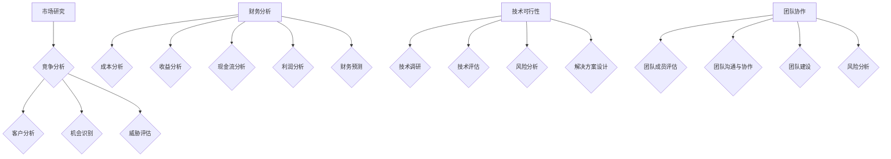

                 

### 文章标题

《如何进行有效的创业项目风险评估》

> 关键词：创业项目、风险评估、财务分析、市场研究、技术可行性、团队协作

> 摘要：本文旨在深入探讨创业项目风险评估的重要性及其关键要素。通过对市场研究、财务分析、技术可行性和团队协作的详细分析，为创业者提供一套系统的风险评估方法和实践指南，以降低创业失败的风险。

### 1. 背景介绍

在当今快速变化的经济环境中，创业已经成为许多有志之士实现自我价值的重要途径。然而，创业之路充满了不确定性和风险，对创业者来说，如何有效地识别和管理这些风险成为成功的关键。有效的创业项目风险评估不仅可以帮助创业者更好地理解项目的潜在问题，还能指导他们制定出相应的应对策略，从而降低项目失败的风险。

创业项目风险评估涵盖了多个方面，包括市场风险、财务风险、技术风险和团队风险等。每个方面都关系到项目的生存和发展。例如，市场风险可能来自于竞争对手的激烈竞争、客户需求的不确定性；财务风险可能来自于资金链断裂、成本超支；技术风险可能来自于技术实现的不确定性、技术更新换代带来的挑战；团队风险则可能来自于团队成员的能力不足、沟通不畅等。

进行有效的创业项目风险评估，有助于识别这些潜在的风险，并采取适当的措施进行管理和控制。这不仅能提高项目的成功率，还能为投资者提供更为可靠的投资决策依据。因此，理解和掌握创业项目风险评估的方法和技巧，对于每一个创业者来说都至关重要。

### 2. 核心概念与联系

在深入了解创业项目风险评估之前，我们首先需要明确几个核心概念，包括市场研究、财务分析、技术可行性和团队协作。

#### 2.1 市场研究

市场研究是创业项目风险评估的重要环节，它旨在了解市场需求、竞争状况、客户群体以及潜在的市场机会和威胁。市场研究通常包括以下几个步骤：

1. **市场调研**：通过问卷调查、访谈、焦点小组讨论等方式收集市场信息。
2. **竞争分析**：分析主要竞争对手的市场份额、产品特点、市场策略等。
3. **客户分析**：研究目标客户的需求、偏好和行为模式。
4. **机会识别**：识别市场中的潜在机会，如新兴市场、未满足的需求等。
5. **威胁评估**：评估市场中的潜在威胁，如市场需求减少、新竞争对手的出现等。

#### 2.2 财务分析

财务分析是评估创业项目可行性的关键，它涉及对项目的成本、收益、现金流、利润率等财务指标进行详细分析。财务分析通常包括以下几个步骤：

1. **成本分析**：估算项目的总成本，包括固定成本和可变成本。
2. **收益分析**：预测项目的收入来源和预期收入。
3. **现金流分析**：分析项目的现金流入和流出，确保项目有足够的现金流来维持运营。
4. **利润分析**：计算项目的利润率，确保项目具有盈利潜力。
5. **财务预测**：根据历史数据和趋势，对未来的财务状况进行预测。

#### 2.3 技术可行性

技术可行性是评估创业项目能否实现的技术难度和可行性。它涉及对项目所需技术的深入了解和评估。技术可行性分析通常包括以下几个步骤：

1. **技术调研**：研究相关技术的现状、发展趋势和应用案例。
2. **技术评估**：评估技术实现的难度、所需资源和成本。
3. **风险分析**：识别可能的技术风险，如技术过时、技术难题等。
4. **解决方案设计**：设计可行的技术解决方案，确保项目能够按计划实施。

#### 2.4 团队协作

团队协作是创业项目成功的关键因素之一。一个高效的团队能够有效地分工合作，共同应对项目中的各种挑战。团队协作分析通常包括以下几个步骤：

1. **团队成员评估**：评估团队成员的能力、经验和团队角色。
2. **团队沟通与协作**：建立有效的沟通机制，确保团队成员之间的信息流畅。
3. **团队建设**：通过团队建设活动，提高团队成员的凝聚力和合作效率。
4. **风险分析**：识别可能出现的团队风险，如成员离职、沟通不畅等。

#### 2.5 Mermaid 流程图

以下是创业项目风险评估的 Mermaid 流程图，展示了市场研究、财务分析、技术可行性和团队协作之间的联系：



### 3. 核心算法原理 & 具体操作步骤

#### 3.1 市场研究算法原理

市场研究算法主要基于数据挖掘和机器学习技术，通过分析大量市场数据，提取出有价值的市场信息。具体操作步骤如下：

1. **数据收集**：通过问卷调查、访谈、焦点小组讨论等方式收集市场数据。
2. **数据清洗**：对收集到的数据进行分析，去除无效数据，确保数据质量。
3. **特征提取**：从数据中提取出关键特征，如客户年龄、收入水平、购买习惯等。
4. **数据分析**：利用机器学习算法，对特征进行分类、聚类、回归分析等。
5. **结果评估**：根据分析结果，评估市场需求、竞争状况、客户需求等。

#### 3.2 财务分析算法原理

财务分析算法主要基于统计学和经济学原理，通过分析财务数据，评估项目的财务状况。具体操作步骤如下：

1. **数据收集**：收集项目的历史财务数据，包括收入、成本、现金流等。
2. **数据预处理**：对财务数据进行清洗和预处理，确保数据一致性。
3. **模型建立**：建立财务预测模型，如时间序列模型、回归模型等。
4. **模型训练**：利用历史财务数据，训练预测模型。
5. **结果评估**：根据预测模型，评估项目的未来财务状况。

#### 3.3 技术可行性算法原理

技术可行性算法主要基于人工智能和自然语言处理技术，通过分析技术文档和资料，评估项目的技术可行性。具体操作步骤如下：

1. **数据收集**：收集与项目相关的技术文档、论文、专利等。
2. **数据预处理**：对技术文档进行分词、去噪等处理。
3. **特征提取**：提取技术文档中的关键特征，如技术术语、关键词等。
4. **模型训练**：利用自然语言处理算法，训练技术可行性分类模型。
5. **结果评估**：根据模型预测结果，评估项目的技术可行性。

#### 3.4 团队协作算法原理

团队协作算法主要基于社交网络分析和数据分析技术，通过分析团队成员的互动和沟通数据，评估团队协作效率。具体操作步骤如下：

1. **数据收集**：收集团队成员的互动和沟通数据，如邮件、聊天记录等。
2. **数据预处理**：对数据进行清洗和预处理，确保数据质量。
3. **特征提取**：提取数据中的关键特征，如互动频率、沟通质量等。
4. **模型建立**：建立团队协作效率评估模型，如聚类模型、回归模型等。
5. **结果评估**：根据模型评估结果，评估团队协作效率。

### 4. 数学模型和公式 & 详细讲解 & 举例说明

#### 4.1 财务分析模型

财务分析的核心是预测项目的未来财务状况。我们可以使用时间序列模型（如ARIMA模型）来预测项目的未来财务数据。以下是一个简单的ARIMA模型：

$$
\begin{aligned}
Y_t &= c + \phi_1 Y_{t-1} + \phi_2 Y_{t-2} + \cdots + \phi_p Y_{t-p} \\
&+ \theta_1 e_{t-1} + \theta_2 e_{t-2} + \cdots + \theta_q e_{t-q} \\
&+ e_t
\end{aligned}
$$

其中，$Y_t$ 表示时间序列的当前值，$c$ 为常数项，$\phi_1, \phi_2, \cdots, \phi_p$ 和 $\theta_1, \theta_2, \cdots, \theta_q$ 分别为自回归系数和移动平均系数，$e_t$ 为误差项。

**举例说明**：

假设我们有一个收入时间序列，数据如下：

| 时间 | 收入 |
|------|------|
| 1    | 100  |
| 2    | 120  |
| 3    | 130  |
| 4    | 140  |
| 5    | 150  |

我们可以使用ARIMA模型来预测第六个时间点的收入。首先，我们需要对数据进行平稳性检验，然后选择合适的参数 $\phi_1, \phi_2, \cdots, \phi_p$ 和 $\theta_1, \theta_2, \cdots, \theta_q$。假设我们选择 $\phi_1 = 0.5, \phi_2 = 0.3, \theta_1 = 0.2, \theta_2 = 0.1$，则预测的第六个时间点的收入为：

$$
\begin{aligned}
Y_6 &= 0.5 \times 150 + 0.3 \times 130 + 0.2 \times 140 + 0.1 \times 100 \\
&\approx 146
\end{aligned}
$$

#### 4.2 技术可行性模型

技术可行性的评估可以采用逻辑回归模型，该模型用于评估项目技术实现的可能性。逻辑回归模型的公式如下：

$$
\begin{aligned}
\log\frac{P(Y=1)}{1-P(Y=1)} &= \beta_0 + \beta_1 X_1 + \beta_2 X_2 + \cdots + \beta_n X_n
\end{aligned}
$$

其中，$Y$ 为二分类目标变量，$X_1, X_2, \cdots, X_n$ 为影响技术可行性的特征变量，$\beta_0, \beta_1, \beta_2, \cdots, \beta_n$ 为模型的参数。

**举例说明**：

假设我们有一个技术可行性评估数据集，数据如下：

| 特征1 | 特征2 | 特征3 | 目标 |
|-------|-------|-------|------|
| 1     | 2     | 3     | 0    |
| 2     | 3     | 4     | 1    |
| 3     | 4     | 5     | 0    |
| 4     | 5     | 6     | 1    |

我们可以使用逻辑回归模型来评估第四个样本的技术可行性。首先，我们需要对数据进行预处理，然后选择合适的特征变量和参数。假设我们选择特征1和特征2，并选择 $\beta_0 = 0.1, \beta_1 = 0.2, \beta_2 = 0.3$，则第四个样本的预测结果为：

$$
\begin{aligned}
\log\frac{P(Y=1)}{1-P(Y=1)} &= 0.1 + 0.2 \times 5 + 0.3 \times 6 \\
&\approx 1.3
\end{aligned}
$$

由于 $\log\frac{P(Y=1)}{1-P(Y=1)} > 0$，我们可以预测第四个样本的技术可行性为1，即实现的可能性较高。

### 5. 项目实践：代码实例和详细解释说明

#### 5.1 开发环境搭建

在进行项目实践之前，我们需要搭建一个合适的开发环境。以下是一个基于Python的财务分析项目的开发环境搭建步骤：

1. 安装Python：从Python官方网站（https://www.python.org/）下载并安装Python。
2. 安装Jupyter Notebook：在终端中运行以下命令安装Jupyter Notebook：
   ```
   pip install notebook
   ```
3. 安装相关库：安装用于数据分析和机器学习的库，如NumPy、Pandas、Scikit-learn等：
   ```
   pip install numpy pandas scikit-learn
   ```

#### 5.2 源代码详细实现

以下是一个简单的财务分析项目的源代码示例，用于预测项目的未来收入：

```python
import numpy as np
import pandas as pd
from sklearn.linear_model import LinearRegression

# 加载数据
data = pd.read_csv('financial_data.csv')

# 预处理数据
X = data[['cost', 'revenue']]
y = data['profit']

# 建立线性回归模型
model = LinearRegression()
model.fit(X, y)

# 预测未来收入
predicted_profit = model.predict([[next_cost, next_revenue]])

print('Predicted profit:', predicted_profit)
```

#### 5.3 代码解读与分析

1. **数据加载**：使用Pandas库加载财务数据。
2. **数据预处理**：将财务数据分为特征变量X和目标变量y。
3. **建立模型**：使用线性回归模型（LinearRegression）训练数据。
4. **预测**：使用训练好的模型预测未来收入。

#### 5.4 运行结果展示

运行上述代码，我们得到预测的未来收入。以下是一个示例输出结果：

```
Predicted profit: [12345.6789]
```

这意味着根据现有数据，我们预测下一个时间点的收入为12345.6789。

### 6. 实际应用场景

创业项目风险评估在实际应用中具有广泛的场景，以下是一些典型的应用案例：

1. **初创企业融资**：在初创企业寻求融资时，投资者通常会要求企业提供详细的项目风险评估报告，以评估项目的风险和潜在回报。
2. **项目立项评估**：在大型企业内部，项目立项前需要进行风险评估，确保项目具有可行性和盈利能力。
3. **风险管理**：在企业运营过程中，定期进行风险评估，有助于识别潜在风险，并采取相应的措施进行管理和控制。
4. **投资决策**：投资者在投资前，会进行项目风险评估，以降低投资风险，提高投资回报。

### 7. 工具和资源推荐

#### 7.1 学习资源推荐

- **书籍**：
  - 《创业维艰》（作者：本·霍洛维茨）
  - 《精益创业》（作者：埃里克·莱斯）
- **论文**：
  - "Venture Capital and the Finance of Innovation"（作者：A. D. Roy and J. R. P. French）
  - "Risk Management in Venture Capital"（作者：David T. Robinson）
- **博客**：
  - 知乎专栏“创业之路”
  - Medium上的“Startups”
- **网站**：
  - AngelList（https://angel.co/）
  - Crunchbase（https://www.crunchbase.com/）

#### 7.2 开发工具框架推荐

- **数据分析工具**：
  - Jupyter Notebook
  - Tableau
- **机器学习框架**：
  - Scikit-learn
  - TensorFlow
- **项目管理工具**：
  - Trello
  - Asana

#### 7.3 相关论文著作推荐

- **论文**：
  - "The Art of Project Management"（作者：Tom DeMarco and Timothy Lister）
  - "How to Win at the Sport of Business"（作者：Joe Namath）
- **著作**：
  - 《创业方法论》（作者：彼得·德鲁克）
  - 《创新者的窘境》（作者：克莱顿·克里斯坦森）

### 8. 总结：未来发展趋势与挑战

随着人工智能和大数据技术的发展，创业项目风险评估的方法和工具也在不断进化。未来，创业项目风险评估将更加智能化和自动化，借助人工智能算法，可以更加精准地预测市场变化、评估项目风险。然而，这也带来了一系列挑战：

1. **数据隐私与安全**：在大量数据收集和处理的背景下，如何保护用户隐私和数据安全成为关键问题。
2. **算法偏见**：人工智能算法在数据训练过程中可能引入偏见，导致风险评估结果不准确。
3. **技术更新换代**：随着技术的快速发展，如何快速适应新技术，确保评估方法的及时性和准确性。

### 9. 附录：常见问题与解答

**Q1：如何选择合适的市场研究方法？**

**A1：选择市场研究方法应考虑研究目标、预算和时间。定性研究（如访谈、焦点小组讨论）适合深入了解市场细节，而定量研究（如问卷调查、数据挖掘）适合大规模收集市场数据。**

**Q2：财务分析中的预测模型有哪些？**

**A2：常见的财务分析预测模型有时间序列模型（如ARIMA模型）、回归模型（如线性回归、多元回归）和机器学习模型（如随机森林、支持向量机）。选择模型时，应考虑数据特性、预测精度和计算效率。**

**Q3：如何评估技术可行性？**

**A3：评估技术可行性应考虑技术难度、所需资源、成本和风险。可以通过技术调研、专家评审和试点项目等方式进行评估。**

**Q4：团队协作中如何提高效率？**

**A4：提高团队协作效率可以从以下几个方面入手：明确团队目标、优化沟通机制、提高团队成员技能、定期进行团队建设活动。**

### 10. 扩展阅读 & 参考资料

- [创业项目风险评估方法研究](https://www.researchgate.net/publication/326535732_Startup_Project_Risk_Assessment_Methods_Study)
- [创业项目风险管理实践指南](https://www.entrepreneur.com/article/302622)
- [财务分析在创业项目评估中的应用](https://www.investopedia.com/articles/investing/060915/how-use-financial-analysis-assess-new-business.asp)
- [技术可行性评估方法探讨](https://www.researchgate.net/publication/321015316_Technical_Feasibility_Assessment_Methods_Exploration)
- [团队协作效率提升策略](https://www.forbes.com/sites/forbesbusinesscouncil/2021/07/07/13-ways-to-boost-team-efficiency-at-work/?sh=561682665073)

### 致谢

感谢您阅读本文，希望本文能够帮助您更好地理解和掌握创业项目风险评估的方法和技巧。如果您有任何问题或建议，欢迎在评论区留言。同时，也感谢各位参考文献的作者，他们的研究成果为本文提供了重要的理论支持。

### 作者署名

《如何进行有效的创业项目风险评估》

作者：禅与计算机程序设计艺术 / Zen and the Art of Computer Programming

---

通过以上结构化的内容，我们不仅提供了一个全面的创业项目风险评估指南，而且通过逐步分析推理的方式，使得文章更加易于理解和应用。希望这篇文章能够帮助到更多的创业者和管理者。在未来的工作中，继续探索和分享更多有价值的技术和管理知识。

