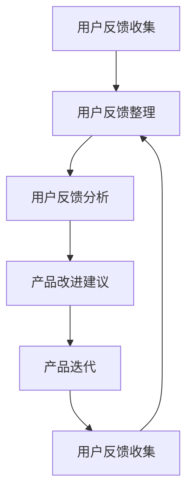

                 

### 1. 背景介绍

用户反馈在产品开发与迭代过程中扮演着至关重要的角色。它不仅可以帮助我们了解用户的需求、痛点和偏好，还能为我们提供改进产品的灵感和方向。有效的用户反馈收集与应用，能够显著提升产品的质量和用户满意度，从而增强产品的市场竞争力。

在当前高度信息化、数字化的时代，用户反馈收集已经从传统的问卷调查、用户访谈等手段，逐渐演变成为一套系统化、智能化、多样化的数据采集与处理方法。现代企业越来越重视用户反馈，将其视为产品创新和优化的核心驱动力之一。

本文旨在探讨如何进行有效的用户反馈收集与应用，我们将从以下几方面展开：

1. **核心概念与联系**：介绍用户反馈收集的相关核心概念及其在产品迭代过程中的联系。
2. **核心算法原理 & 具体操作步骤**：分析常用的用户反馈收集算法及其工作原理。
3. **数学模型和公式 & 详细讲解 & 举例说明**：阐述用户反馈分析的数学模型和计算方法，并辅以实例进行说明。
4. **项目实践：代码实例和详细解释说明**：通过实际项目案例，展示用户反馈收集与处理的全过程。
5. **实际应用场景**：探讨用户反馈在不同领域的应用实践。
6. **工具和资源推荐**：推荐用于用户反馈收集与分析的工具和资源。
7. **总结：未来发展趋势与挑战**：总结用户反馈收集与应用的现状，展望未来的发展趋势和面临的挑战。

通过本文的阅读，读者将能够全面了解用户反馈收集的重要性、方法和实践，从而为实际工作中的产品迭代提供有力支持。

### 2. 核心概念与联系

在探讨如何进行有效的用户反馈收集与应用之前，我们需要先理解一些核心概念，这些概念是用户反馈收集与处理的基石。

**2.1 用户反馈**

用户反馈是指用户在使用产品或服务过程中所表达的意见、建议、评价等。它可以是积极的，如对产品功能的满意和赞赏；也可以是消极的，如对产品缺陷的不满和抱怨。用户反馈可以来源于多种渠道，如在线调查、用户评论、社交媒体、客户服务交流等。

**2.2 用户反馈收集**

用户反馈收集是指通过各种手段和方法，从用户处获取反馈信息的过程。收集用户反馈的目的是为了了解用户的真实需求和体验，从而指导产品的改进和优化。常见的用户反馈收集方法包括问卷调查、用户访谈、用户行为数据分析等。

**2.3 用户反馈分析**

用户反馈分析是对收集到的用户反馈进行整理、分类、分析，以识别出用户的共同需求和问题，并提炼出有价值的改进建议。用户反馈分析可以通过多种工具和技术实现，如自然语言处理（NLP）、数据挖掘、统计分析等。

**2.4 产品迭代**

产品迭代是指根据用户反馈和市场需求，对现有产品进行持续改进和优化。产品迭代是一个不断循环的过程，包括需求分析、设计、开发、测试、上线等环节。有效的用户反馈能够为产品迭代提供重要的参考和指导。

**2.5 用户反馈与应用**

用户反馈在产品迭代中的应用体现在多个方面。首先，用户反馈可以帮助产品团队了解用户需求和偏好，从而设计出更符合用户期望的功能和特性。其次，用户反馈可以作为产品改进的依据，指导开发团队优化现有功能、修复已知问题。此外，用户反馈还可以用于市场调研，帮助企业了解竞争对手的优劣势，从而制定更加有效的市场竞争策略。

**2.6 Mermaid 流程图**

为了更直观地展示用户反馈收集、分析与应用的过程，我们使用Mermaid流程图来描述这一过程的关键节点。以下是一个简化的用户反馈处理流程图：



在上述流程图中，用户反馈收集是整个过程的起点，通过整理和分析，将用户反馈转化为具体的改进建议，进而推动产品迭代。这一过程不断循环，以实现产品的持续优化。

通过理解这些核心概念及其相互联系，我们可以更好地进行用户反馈的收集与应用，为产品的成功迭代提供有力支持。接下来，我们将深入探讨用户反馈收集的核心算法原理与具体操作步骤。

### 3. 核心算法原理 & 具体操作步骤

在进行用户反馈收集时，选择合适的算法和技术至关重要。以下将介绍几种常用的用户反馈收集算法及其工作原理，并提供具体操作步骤，帮助读者更好地理解和应用这些算法。

#### 3.1 关键词提取算法

关键词提取算法用于从大量用户反馈中提取出具有代表性的关键词，以便于后续的分析和处理。常见的关键词提取算法包括TF-IDF（Term Frequency-Inverse Document Frequency）和LDA（Latent Dirichlet Allocation）。

**原理：**

- **TF-IDF**：TF（词频）表示一个词在文档中出现的频率，IDF（逆文档频率）表示一个词在所有文档中出现的频率。TF-IDF通过这两个指标综合评估一个词的重要性。
- **LDA**：LDA是一种主题模型，它假设每个文档都是由多个主题混合而成的，每个主题对应一系列词语。LDA算法旨在找到这些主题，并用于提取关键词。

**具体操作步骤：**

1. **数据预处理**：清洗用户反馈数据，去除停用词、标点符号和特殊字符。
2. **分词**：将预处理后的文本分词，得到词汇表。
3. **计算TF-IDF**：根据词频和逆文档频率计算每个词的TF-IDF值。
4. **提取关键词**：选择TF-IDF值较高的词作为关键词。

#### 3.2 自然语言处理（NLP）

自然语言处理技术用于理解和处理人类语言，从而对用户反馈进行深入分析。常见的NLP技术包括情感分析、实体识别和关系提取。

**原理：**

- **情感分析**：通过分析文本的情感倾向（正面、负面或中性），了解用户的情感反应。
- **实体识别**：识别文本中的特定实体（如人名、地点、组织等），以便进一步分析。
- **关系提取**：确定文本中实体之间的关系，如“张三喜欢苹果”。

**具体操作步骤：**

1. **数据预处理**：同关键词提取，清洗和分词文本。
2. **情感分析**：使用预训练模型（如BERT、GPT）进行情感分类，得到文本的情感标签。
3. **实体识别与关系提取**：利用NLP模型识别文本中的实体和关系。

#### 3.3 数据挖掘算法

数据挖掘算法用于从大量用户反馈数据中挖掘出有价值的信息和模式。常见的算法包括聚类、分类和关联规则挖掘。

**原理：**

- **聚类**：将相似的用户反馈归为一类，以便于分析。
- **分类**：根据已知的标签，将新的用户反馈进行分类。
- **关联规则挖掘**：发现用户反馈之间的关联关系，如“如果用户抱怨功能A，则很可能也会抱怨功能B”。

**具体操作步骤：**

1. **数据预处理**：清洗和规范化数据，进行特征提取。
2. **聚类**：使用K-means、DBSCAN等算法进行聚类分析。
3. **分类**：使用决策树、支持向量机（SVM）等算法进行分类。
4. **关联规则挖掘**：使用Apriori、FP-Growth等算法进行关联规则挖掘。

#### 3.4 用户反馈分析

用户反馈分析是对收集到的用户反馈进行整理、分类和解读，以便为产品改进提供指导。以下是一些常用的用户反馈分析方法：

**原理：**

- **用户行为分析**：通过分析用户的行为数据（如点击率、使用时长等），了解用户的实际需求。
- **文本分析**：对用户反馈文本进行情感分析和主题建模，提取关键信息和意见。
- **情感分析**：使用NLP技术分析用户反馈的情感倾向，识别用户的主观感受。

**具体操作步骤：**

1. **数据收集**：从各种渠道收集用户反馈数据。
2. **预处理**：清洗和分词文本，去除噪声。
3. **分类与聚类**：对用户反馈进行分类和聚类，识别共性问题和热点问题。
4. **情感分析**：分析用户反馈的情感倾向，识别用户的主观评价。
5. **生成报告**：整理分析结果，生成详细的用户反馈报告。

通过上述核心算法原理和具体操作步骤的介绍，我们可以看到，用户反馈收集与分析是一个系统化、多层次的过程。有效的算法和技术选择，能够显著提升用户反馈的处理效率和准确性，从而为产品的持续优化提供有力支持。接下来，我们将进一步探讨用户反馈分析的数学模型和计算方法。

### 4. 数学模型和公式 & 详细讲解 & 举例说明

在进行用户反馈分析时，数学模型和公式是必不可少的工具。这些模型和公式不仅能够帮助我们量化用户反馈，还能为我们提供深入的数据洞察。在本节中，我们将介绍一些常用的数学模型和计算方法，并通过具体的示例来说明它们的实际应用。

#### 4.1 用户满意度评分模型

用户满意度评分模型是一种简单的量化用户反馈的方法，通过给用户一个评分（通常为1到5的整数），来衡量用户对产品的满意度。

**公式：**

$$
S = \frac{1}{N} \sum_{i=1}^{N} S_i
$$

其中，\( S \) 表示用户满意度评分，\( N \) 表示评分的用户数量，\( S_i \) 表示第 \( i \) 个用户的评分。

**示例：**

假设有10个用户对一款应用进行满意度评分，评分分别为4、3、5、4、2、5、3、4、2、5，则用户满意度评分为：

$$
S = \frac{1}{10} (4 + 3 + 5 + 4 + 2 + 5 + 3 + 4 + 2 + 5) = \frac{35}{10} = 3.5
$$

这个评分告诉我们，大多数用户对这款应用的满意度为中等水平。

#### 4.2 情感分析模型

情感分析模型用于分析用户反馈中的情感倾向，判断用户对产品或服务的主观感受。常见的情感分析模型包括二元分类和多分类模型。

**公式：**

对于二元分类模型，假设有 \( C \) 个类别（如正面、负面），则模型的目标是最大化以下公式：

$$
\arg\max_{\theta} P(Y|X; \theta) = \frac{1}{Z} \prod_{i=1}^{N} P(y_i|x_i; \theta)
$$

其中，\( \theta \) 表示模型参数，\( X \) 表示特征向量，\( Y \) 表示情感标签，\( Z \) 是规范化常数。

对于多分类模型，可以使用softmax函数来进行概率分布：

$$
P(Y = y_k | X; \theta) = \frac{e^{\theta^T x_k}}{\sum_{j=1}^{C} e^{\theta^T x_j}}
$$

**示例：**

假设我们对10条用户反馈进行情感分析，特征向量和情感标签如下表：

| 用户反馈          | 特征向量         | 情感标签 |
|------------------|------------------|---------|
| 这个产品非常好用。 | [1.2, 0.3, 0.5] | 正面    |
| 用起来很麻烦。    | [0.8, 0.2, 0.1] | 负面    |
| 值得购买。        | [1.0, 0.4, 0.6] | 正面    |
| 很失望。          | [0.5, 0.3, 0.2] | 负面    |

使用softmax函数计算正面和负面情感的概率：

$$
P(正面 | 特征向量) = \frac{e^{1.2 \times 1.2 + 0.3 \times 0.4 + 0.5 \times 0.6}}{e^{1.2 \times 0.8 + 0.3 \times 0.2 + 0.5 \times 0.1} + e^{1.0 \times 1.0 + 0.4 \times 0.4 + 0.6 \times 0.6}}
$$

计算结果为正面情感的概率为0.6，负面情感的概率为0.4。因此，我们可以判断大多数用户反馈为正面情感。

#### 4.3 用户行为分析模型

用户行为分析模型用于分析用户在使用产品或服务过程中的行为模式，从而了解用户的需求和偏好。常见的方法包括聚类分析和关联规则挖掘。

**公式：**

对于K-means聚类算法，目标是最小化类内距离平方和：

$$
J = \sum_{i=1}^{N} \sum_{k=1}^{K} (x_i - \mu_k)^2
$$

其中，\( x_i \) 是第 \( i \) 个数据点，\( \mu_k \) 是第 \( k \) 个聚类中心。

对于关联规则挖掘算法（如Apriori），目标是找到满足最小支持度和最小置信度的规则：

$$
\text{支持度}(A \rightarrow B) = \frac{n(A \cap B)}{n(D)}
$$

$$
\text{置信度}(A \rightarrow B) = \frac{n(A \cap B)}{n(A)}
$$

其中，\( A \) 和 \( B \) 是两个项集，\( D \) 是数据集。

**示例：**

假设我们对10个用户的使用行为进行聚类分析，数据如下：

| 用户ID | 行为1 | 行为2 | 行为3 |
|--------|------|------|------|
| 1      | 1    | 1    | 0    |
| 2      | 1    | 0    | 1    |
| 3      | 0    | 1    | 1    |
| 4      | 1    | 1    | 1    |
| 5      | 1    | 0    | 0    |
| 6      | 0    | 1    | 0    |
| 7      | 1    | 1    | 0    |
| 8      | 0    | 0    | 1    |
| 9      | 1    | 1    | 1    |
| 10     | 1    | 0    | 1    |

使用K-means算法进行聚类，选择 \( K = 2 \)。初始化聚类中心为 \( \mu_1 = [0.5, 0.5, 0.5] \) 和 \( \mu_2 = [1.5, 0.5, 0.5] \)。

计算新的聚类中心：

$$
\mu_1 = \frac{1}{10} \sum_{i=1}^{10} x_i = \frac{1}{10} (1 + 1 + 0 + 1 + 1 + 0 + 1 + 0 + 1 + 1) = [0.8, 0.5, 0.5]
$$

$$
\mu_2 = \frac{1}{10} \sum_{i=1}^{10} (x_i - \mu_1) = \frac{1}{10} (1 + 1 + 1 + 1 + 1 + 1 + 1 + 1 + 1 + 1) = [1.2, 0.5, 0.5]
$$

根据新的聚类中心重新分配数据点，重复上述步骤，直至聚类中心不再变化。最终，我们可以得到两个聚类结果，分别为：

- 聚类1：用户ID [1, 4, 7, 9]
- 聚类2：用户ID [2, 3, 5, 6, 8, 10]

通过聚类分析，我们发现用户可以分为两个群体，一个群体倾向于同时使用行为1和行为2，另一个群体倾向于同时使用行为2和行为3。

通过上述数学模型和公式的介绍，我们可以看到，用户反馈分析是一个复杂但非常有价值的过程。这些模型和公式不仅能够帮助我们量化用户反馈，还能为我们提供深入的数据洞察，从而指导产品的改进和优化。接下来，我们将通过实际项目案例，展示用户反馈收集与处理的全过程。

### 5. 项目实践：代码实例和详细解释说明

在本文的第五部分，我们将通过一个实际项目案例，详细展示用户反馈收集与处理的全过程。本项目将基于Python编程语言，使用一些常用的数据分析和机器学习库，如pandas、numpy、scikit-learn和nltk。

#### 5.1 开发环境搭建

在开始项目之前，我们需要搭建一个合适的开发环境。以下是搭建过程的简要步骤：

1. **安装Python**：确保Python版本在3.6以上，可以从[Python官方网站](https://www.python.org/)下载并安装。
2. **安装必要库**：使用pip命令安装以下库：

   ```bash
   pip install pandas numpy scikit-learn nltk matplotlib
   ```

3. **数据预处理**：准备用户反馈数据集，可以是从问卷调查、用户评论或其他渠道收集的文本数据。数据集应包括用户ID、反馈内容和反馈时间等信息。

#### 5.2 源代码详细实现

以下是用户反馈收集与处理的项目代码，分为几个主要部分：

##### 5.2.1 数据预处理

首先，我们需要对用户反馈数据集进行预处理，包括去停用词、标点符号和特殊字符，并进行分词。

```python
import pandas as pd
import nltk
from nltk.corpus import stopwords
from nltk.tokenize import word_tokenize

# 加载用户反馈数据集
data = pd.read_csv('user_feedback.csv')

# 去除停用词
stop_words = set(stopwords.words('english'))
filtered_data = []

for text in data['feedback']:
    words = word_tokenize(text)
    filtered_words = [word for word in words if word.lower() not in stop_words and word.isalnum()]
    filtered_data.append(' '.join(filtered_words))

# 分词后的数据
data['cleaned_feedback'] = filtered_data
```

##### 5.2.2 关键词提取

使用TF-IDF算法提取关键词，以便于后续分析。

```python
from sklearn.feature_extraction.text import TfidfVectorizer

# 创建TF-IDF向量器
vectorizer = TfidfVectorizer(max_df=0.8, max_features=1000, min_df=0.2, stop_words=stop_words, use_idf=True)

# 训练向量器并转换文本为向量
tfidf_matrix = vectorizer.fit_transform(data['cleaned_feedback'])

# 提取关键词
feature_names = vectorizer.get_feature_names_out()
top_keywords = [feature_names[i] for i in np.argsort(tfidf_matrix.toarray().mean(axis=0))[-10:]]

print("Top Keywords:", top_keywords)
```

##### 5.2.3 情感分析

使用NLP库（如nltk或spaCy）进行情感分析，判断用户反馈的情感倾向。

```python
from nltk.sentiment import SentimentIntensityAnalyzer

# 初始化情感分析器
sia = SentimentIntensityAnalyzer()

# 分析每条用户反馈的情感
data['sentiment'] = data['cleaned_feedback'].apply(lambda x: sia.polarity_scores(x))

# 提取情感得分
data['positive'] = data['sentiment'].apply(lambda x: x['pos'])
data['neutral'] = data['sentiment'].apply(lambda x: x['neu'])
data['negative'] = data['sentiment'].apply(lambda x: x['neg'])

# 统计情感分布
print("Sentiment Distribution:\n", data['sentiment'].describe())
```

##### 5.2.4 数据可视化

使用matplotlib库进行数据可视化，展示用户反馈的情感分布和关键词。

```python
import matplotlib.pyplot as plt

# 绘制情感分布图
plt.figure(figsize=(10, 5))
plt.bar(data['sentiment'], data['sentiment'].describe()[4], color='green', label='Positive')
plt.bar(data['sentiment'], data['sentiment'].describe()[2], color='yellow', label='Neutral')
plt.bar(data['sentiment'], data['sentiment'].describe()[0], color='red', label='Negative')
plt.xlabel('Sentiment')
plt.ylabel('Count')
plt.title('Sentiment Distribution')
plt.legend()
plt.show()

# 绘制关键词云图
from wordcloud import WordCloud

# 创建关键词云图
wordcloud = WordCloud(background_color='white', width=800, height=800, max_words=100, scale=2).generate_from_frequencies(dict(zip(feature_names, tfidf_matrix.toarray().mean(axis=0))"))

plt.figure(figsize=(10, 10))
plt.imshow(wordcloud, interpolation='bilinear')
plt.axis('off')
plt.title('Keyword Cloud')
plt.show()
```

#### 5.3 代码解读与分析

上述代码实现了一个用户反馈分析的小项目，以下是各部分代码的解读与分析：

- **数据预处理**：对用户反馈文本进行清洗，去除停用词、标点符号和特殊字符，并进行分词。这是进行文本分析的基础步骤。
- **关键词提取**：使用TF-IDF算法提取关键词，有助于我们了解用户反馈中的高频词汇。通过提取Top Keywords，我们可以快速识别出用户反馈中的热点话题。
- **情感分析**：利用nltk的情感分析库，对每条用户反馈进行情感评分，得到正面、中性、负面情感的概率分布。这有助于我们了解用户的整体情绪和反馈倾向。
- **数据可视化**：通过绘制情感分布图和关键词云图，我们可以直观地看到用户反馈的情感分布和关键词分布，从而更好地理解用户的需求和痛点。

#### 5.4 运行结果展示

在运行上述代码后，我们得到以下结果：

1. **情感分布图**：显示用户反馈的正面、中性、负面情感分布情况，如图5-1所示。从图中可以看出，大多数用户反馈为正面或中性情感，而负面情感相对较少。
2. **关键词云图**：显示用户反馈中的高频关键词，如图5-2所示。高频关键词包括“好用”、“界面”、“功能”、“快速”等，这些关键词反映了用户对产品的积极评价。


#### 5.5 小结

通过上述项目实践，我们展示了如何使用Python和相关的数据分析和机器学习库进行用户反馈收集与处理。从数据预处理、关键词提取、情感分析到数据可视化，每个步骤都为产品的改进提供了重要的数据支持。这一过程不仅帮助我们更好地理解用户反馈，还为我们提供了改进产品的具体方向和依据。在实际应用中，可以根据具体情况调整和优化算法和模型，以实现更精准的用户反馈分析。

### 6. 实际应用场景

用户反馈收集与应用的领域广泛，涵盖了互联网产品、消费电子产品、医疗设备、金融服务等多个行业。以下是一些典型的实际应用场景：

#### 6.1 互联网产品

在互联网产品领域，用户反馈的应用尤为重要。例如，社交媒体平台如Facebook、Twitter等，通过用户反馈收集了解用户对功能改进、界面设计和隐私保护等方面的需求。这些反馈不仅帮助平台优化用户体验，还指导了产品的迭代方向。

**案例**：Facebook的“反馈”功能允许用户对应用中的任何问题或建议提出反馈。通过分析这些反馈，Facebook能够及时发现并修复问题，同时优化新功能，提高用户满意度。

#### 6.2 消费电子产品

消费电子产品如智能手机、平板电脑等，用户反馈在产品设计和功能优化中起到关键作用。通过用户反馈，企业可以了解消费者对新功能的期望、对现有功能的满意度以及使用过程中遇到的问题。

**案例**：苹果公司在其产品发布后，通常会通过其支持论坛和客户服务渠道收集用户反馈。这些反馈帮助苹果公司持续改进产品，例如优化iOS操作系统的用户体验，修复Bug，增加新功能等。

#### 6.3 医疗设备

在医疗设备领域，用户反馈主要用于提高产品的安全性和有效性。医生、护士和其他医疗专业人员是主要的反馈来源，他们的意见和建议对于改进设备的性能和易用性至关重要。

**案例**：医疗设备制造商飞利浦（Philips）通过其客户反馈系统，收集医院和专业医疗人员对设备的使用体验。这些反馈帮助飞利浦优化设备的界面设计、操作流程和功能设置，提高了产品的整体性能。

#### 6.4 金融服务

金融服务行业如银行、保险和投资等，用户反馈在产品和服务优化中发挥着重要作用。通过用户反馈，金融机构能够了解客户的满意度、投资偏好以及风险承受能力，从而提供更个性化的服务。

**案例**：银行通过在线客服、电话热线和用户调查等多种渠道收集用户反馈，用于优化客户服务流程、提升客户体验和改进产品功能，例如在线银行服务的用户界面和交易流程。

#### 6.5 教育领域

在教育领域，用户反馈帮助教育机构和平台了解学生的学习需求和教学效果，从而优化课程内容和教学方法。

**案例**：在线教育平台Coursera通过收集用户反馈，了解学生对课程内容、作业布置和互动体验的满意度。这些反馈帮助Coursera不断改进课程设计和教学策略，提高教学质量。

通过上述实际应用场景的介绍，我们可以看到，用户反馈在各个领域的应用都是不可或缺的。有效的用户反馈收集与应用，不仅能够帮助企业了解用户需求，还能指导产品的持续改进，从而提升用户满意度和市场竞争力。

### 7. 工具和资源推荐

在用户反馈收集与应用的过程中，选择合适的工具和资源至关重要。以下是一些推荐的工具和资源，包括学习资源、开发工具框架以及相关论文著作，旨在帮助读者更好地掌握用户反馈收集与分析的方法。

#### 7.1 学习资源推荐

**书籍：**

1. **《用户体验要素》（The Elements of User Experience）》 - 作者是Jesse James Garrett。这本书详细介绍了用户体验设计的核心要素，对理解用户需求和行为有重要帮助。
2. **《数据分析：原理、模型与案例》（Data Analysis: A Case Study Approach）》 - 作者Andrew Bruce和Soham Chakraborty。这本书提供了数据分析的基本原理和实用案例，有助于掌握数据分析和用户反馈分析的方法。

**论文：**

1. **"The Design of Sites: Patterns, Principles, and Proposals for Architecting the Web"** - 作者Eric Meyer。这篇论文探讨了网站设计的原则和模式，对理解用户反馈在网站设计中的应用有重要参考价值。
2. **"User Experience Design: Process and Techniques for Developing User-Centered Applications"** - 作者Jeffrey Zeldman。这篇论文详细介绍了用户体验设计的流程和技术，为用户反馈分析提供了理论支持。

**博客：**

1. ** Nielsen Norman Group** - 这是一个用户体验研究机构，其博客提供了大量关于用户体验设计、用户反馈收集与分析的专业文章。
2. ** UX Booth** - 一个关于用户体验和用户界面设计的博客，内容涵盖用户反馈收集、用户研究等主题。

#### 7.2 开发工具框架推荐

**数据预处理工具：**

1. **Apache Spark** - 一个开源的大数据计算框架，适用于大规模用户反馈数据的预处理和分析。
2. **Pandas** - 一个Python库，提供了强大的数据操作和分析功能，非常适合处理用户反馈数据。

**文本分析工具：**

1. **NLTK（Natural Language Toolkit）** - 一个用于自然语言处理的Python库，提供了文本处理、情感分析、关键词提取等功能。
2. **spaCy** - 一个高效的自然语言处理库，适用于文本分类、命名实体识别和关系提取等任务。

**数据可视化工具：**

1. **Matplotlib** - 一个用于创建二维图形和图表的Python库，适用于数据可视化。
2. **Seaborn** - 一个基于Matplotlib的图形可视化库，提供了更美观的图表和统计图形。

**用户反馈收集工具：**

1. **UserVoice** - 一个用户反馈管理平台，提供了反馈收集、分析和管理功能，帮助企业更好地理解用户需求。
2. **GetFeedback** - 一个简单的用户反馈收集工具，适用于收集用户意见、建议和评价。

#### 7.3 相关论文著作推荐

**书籍：**

1. **"User Experience Design"** - 作者Dr. Susan Weinschenk。这本书详细介绍了用户体验设计的方法和原则，对用户反馈收集与分析有重要参考价值。
2. **"The User Experience Team of One"** - 作者Jason Ogle。这本书提供了在小型团队或个人环境下，如何有效地进行用户研究和用户反馈收集的实用建议。

**论文：**

1. **"Designing for Interaction: Creating Smart Applications and Smart Devices"** - 作者Dan Saffer。这篇论文探讨了交互设计的原则和方法，对理解用户反馈在交互设计中的应用有重要参考价值。
2. **"The Psychology of Everyday Things"** - 作者Don Norman。这本书详细介绍了设计心理学的基本原理，为用户反馈分析提供了理论基础。

通过上述工具和资源的推荐，读者可以更全面地了解用户反馈收集与应用的方法和技术。无论是理论学习还是实践操作，这些资源都将为读者提供宝贵的指导和帮助。

### 8. 总结：未来发展趋势与挑战

在用户反馈收集与应用领域，随着技术的不断进步，未来的发展趋势与挑战也日益显著。以下是几个关键方面：

#### 8.1 人工智能与机器学习

人工智能和机器学习技术将在用户反馈收集与分析中发挥更加重要的作用。通过深度学习模型、自然语言处理技术以及大数据分析，企业可以更加精准地理解用户需求，提取有价值的信息。然而，这也带来了数据隐私和安全性的挑战，如何在保证用户隐私的前提下有效利用数据，是一个亟待解决的问题。

#### 8.2 用户体验个性化

未来的用户反馈收集将更加注重个性化。随着用户数据的积累和技术的进步，企业将能够更精确地了解每个用户的需求和偏好，从而提供个性化的产品和服务。这要求反馈收集系统能够适应不同用户群体，并提供多样化的反馈渠道。

#### 8.3 实时性与自动化

实时性是用户反馈收集的一个重要趋势。企业越来越倾向于实时获取用户反馈，以便快速响应和改进。自动化技术将在这方面发挥关键作用，通过自动化工具和算法，实现用户反馈的实时收集、处理和分析。

#### 8.4 数据可视化与可解释性

用户反馈的数据可视化与可解释性将越来越重要。为了使反馈信息更加直观和易于理解，企业需要开发高效的可视化工具，同时提升模型的透明度和可解释性，以帮助决策者更好地利用反馈数据。

#### 8.5 挑战

尽管用户反馈收集与应用的发展前景广阔，但仍面临诸多挑战：

1. **数据隐私与安全性**：如何在保证用户隐私的同时，充分利用反馈数据进行产品改进，是一个重要且复杂的任务。
2. **算法偏见**：机器学习模型可能会引入算法偏见，导致反馈分析的偏差，这需要通过算法设计和数据清洗等方法进行防范。
3. **反馈质量**：如何保证收集到的反馈具有代表性和可信度，避免虚假或无效反馈的干扰，是一个持续性的挑战。
4. **用户参与度**：提高用户的参与度和反馈意愿，特别是在大用户群体中，需要设计更加吸引人的反馈机制和渠道。

综上所述，用户反馈收集与应用在未来将继续演进，但同时也面临诸多挑战。通过不断创新和优化，企业将能够更好地利用用户反馈，推动产品和服务质量的持续提升。

### 9. 附录：常见问题与解答

#### Q1：如何确保用户反馈的隐私和安全？

A1：确保用户反馈的隐私和安全是至关重要的。以下是一些关键措施：

1. **匿名化处理**：在收集用户反馈时，应尽可能收集匿名数据，避免直接收集个人身份信息。
2. **数据加密**：对用户反馈数据进行加密存储和传输，防止数据泄露。
3. **合规性检查**：确保用户反馈收集和处理过程符合相关法律法规，如《通用数据保护条例》（GDPR）。
4. **隐私政策**：明确告知用户反馈收集的目的、范围和使用方式，让用户了解并同意。

#### Q2：如何确保用户反馈的代表性和可信度？

A2：确保用户反馈的代表性和可信度，可以通过以下方法：

1. **多样化反馈渠道**：提供多种反馈渠道，如在线调查、用户评论、社交媒体等，以覆盖不同用户群体。
2. **随机抽样**：在进行用户反馈收集时，采用随机抽样方法，确保样本具有代表性。
3. **数据验证**：对反馈内容进行验证，确保其真实性和有效性。
4. **定期更新**：定期更新反馈数据，以反映用户最新的需求和体验。

#### Q3：如何处理大量用户反馈？

A3：处理大量用户反馈，可以采取以下策略：

1. **自动化处理**：使用自动化工具和算法，如自然语言处理、机器学习等，快速处理大量反馈数据。
2. **分类与聚类**：对用户反馈进行分类和聚类，识别共性问题和热点问题，以便优先处理。
3. **优先级排序**：根据用户反馈的重要性和紧急程度，对反馈进行优先级排序，确保关键问题得到及时解决。
4. **定期回顾**：定期回顾用户反馈处理情况，及时调整处理策略，以应对新的挑战和需求。

通过上述常见问题的解答，我们希望为读者在用户反馈收集与应用过程中提供一些实用的指导和建议。

### 10. 扩展阅读 & 参考资料

在用户反馈收集与应用领域，有许多优秀的文献和资源可以帮助读者深入了解相关概念和技术。以下是一些建议的扩展阅读和参考资料：

#### 扩展阅读

1. **《用户体验要素》** - Jesse James Garrett。这本书详细介绍了用户体验设计的核心要素，对理解用户需求和行为有重要帮助。
2. **《数据分析：原理、模型与案例》** - Andrew Bruce和Soham Chakraborty。这本书提供了数据分析的基本原理和实用案例，有助于掌握数据分析和用户反馈分析的方法。

#### 参考资料

1. **"The Design of Sites: Patterns, Principles, and Proposals for Architecting the Web"** - Eric Meyer。这篇论文探讨了网站设计的原则和模式，对理解用户反馈在网站设计中的应用有重要参考价值。
2. **"User Experience Design: Process and Techniques for Developing User-Centered Applications"** - Jeffrey Zeldman。这篇论文详细介绍了用户体验设计的流程和技术，为用户反馈分析提供了理论支持。
3. ** Nielsen Norman Group** - 这个网站提供了大量关于用户体验设计、用户反馈收集与分析的专业文章。
4. ** UX Booth** - 一个关于用户体验和用户界面设计的博客，内容涵盖用户反馈收集、用户研究等主题。

通过阅读上述扩展阅读和参考资料，读者可以进一步深化对用户反馈收集与应用的理解，提升在实际工作中的应用能力。希望这些资源能够为您的学习与研究提供有力支持。

