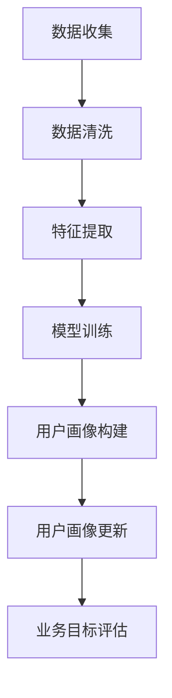

                 

### 背景介绍

用户画像作为一种分析工具，近年来在数据驱动的商业决策中发挥着越来越重要的作用。随着互联网的普及和数据量的激增，企业在掌握用户行为数据的基础上，通过构建用户画像，可以深入了解用户的兴趣、需求、行为习惯等，从而为个性化推荐、市场营销、用户服务优化等提供数据支撑。

用户画像的核心在于将多维度的用户信息进行整合，形成对每个用户的全面了解。这种整合不仅包括用户的静态信息，如年龄、性别、地理位置等，还包括用户的动态信息，如浏览历史、购买记录、社交互动等。因此，用户画像的构建不仅需要技术手段，还需要对业务场景有深刻的理解。

然而，用户画像并不是一成不变的。随着用户行为的不断变化，用户画像也需要不断更新，以保持其准确性和时效性。用户画像的更新不仅有助于提高数据分析的准确性，还可以帮助企业更及时地捕捉市场变化，优化产品和服务。

本文将探讨如何进行有效的用户画像更新。首先，我们将介绍用户画像的基本概念和构建方法，然后深入分析用户画像更新的核心原则和策略，最后通过实际项目案例和代码实例，展示如何实现用户画像的动态更新。通过本文的阅读，您将了解到用户画像更新的重要性，以及如何在实际业务中应用这些策略。

### 核心概念与联系

在进行用户画像更新之前，我们需要明确几个核心概念和它们之间的关系。这些概念不仅构成了用户画像的基础，也为我们理解用户画像更新的过程提供了重要的视角。

#### 用户画像

用户画像是指通过对用户的多维度数据进行整合和分析，构建出的一个关于用户特征、行为、需求等的抽象模型。它通常包括以下几类信息：

1. **基础信息**：如年龄、性别、地理位置、职业等。
2. **兴趣信息**：如浏览历史、搜索关键词、点击行为等。
3. **行为信息**：如购买记录、评论内容、反馈意见等。
4. **社交信息**：如社交网络中的互动、好友关系等。

这些信息可以帮助企业或组织更深入地了解用户，从而做出更加精准的决策。

#### 用户画像的构建方法

构建用户画像的方法可以归纳为以下几个步骤：

1. **数据收集**：收集用户的静态和动态数据，这些数据可以来源于企业内部数据库、第三方数据平台等。
2. **数据清洗**：对收集到的数据进行清洗，去除重复、错误或不完整的数据。
3. **特征提取**：从清洗后的数据中提取出对用户画像有意义的特征。
4. **模型训练**：使用机器学习算法，根据提取的特征对用户进行分类或预测。
5. **用户画像构建**：将模型训练结果应用到实际场景中，生成具体的用户画像。

#### 用户画像更新的原则

用户画像并不是静态的，而是随着用户行为的不断变化而更新的。进行用户画像更新时，我们需要遵循以下原则：

1. **实时性**：用户画像的更新需要及时反映用户当前的状态和行为。
2. **准确性**：更新的数据要准确，避免出现偏差或误差。
3. **全面性**：更新的用户画像应涵盖用户的多维度信息，包括基础信息、兴趣信息、行为信息和社交信息。
4. **关联性**：不同维度的信息之间应保持一定的关联性，以形成一个统一的用户画像。

#### 用户画像与业务目标的关系

用户画像的最终目的是为业务目标服务，如提高用户满意度、增加销售额、降低运营成本等。因此，在更新用户画像时，我们需要考虑业务目标，确保用户画像与业务目标的一致性。例如，在市场营销中，通过更新用户画像，可以更好地定位目标用户，制定个性化的营销策略。

#### Mermaid 流程图

为了更好地展示用户画像更新的过程，我们使用 Mermaid 绘制了一个流程图。以下是一个简化的用户画像更新流程图：



在这个流程图中，用户画像的更新过程包括数据收集、数据清洗、特征提取、模型训练和用户画像构建等步骤。这些步骤不仅确保了用户画像的实时性和准确性，还保证了用户画像与业务目标的一致性。

通过以上核心概念和流程图的介绍，我们为后续的用户画像更新策略和实际应用提供了理论基础。在下一部分，我们将深入探讨用户画像更新的核心算法原理和具体操作步骤。

### 核心算法原理 & 具体操作步骤

在进行用户画像更新时，选择合适的算法是非常重要的。以下是几种常用的核心算法原理，以及它们的具体操作步骤。

#### 1. K-最近邻算法（K-Nearest Neighbors, KNN）

K-最近邻算法是一种基于实例的学习方法，通过计算新样本与训练集中样本的相似度来进行分类。以下是KNN算法的具体操作步骤：

1. **数据准备**：将已有的用户数据集分为训练集和测试集。
2. **特征提取**：从用户数据中提取出用于计算的维度，如年龄、兴趣标签等。
3. **距离计算**：计算新样本与训练集中每个样本的相似度，常用的距离度量方法有欧几里得距离、曼哈顿距离等。
4. **分类预测**：找到与新样本距离最近的K个邻居，并根据邻居的分类结果进行投票，得到新样本的分类标签。
5. **用户画像更新**：将新样本及其分类结果更新到用户画像数据库中。

#### 2. 决策树算法（Decision Tree）

决策树是一种基于规则的学习方法，通过一系列的判断条件将数据集分割成多个子集，直到满足终止条件为止。以下是决策树算法的具体操作步骤：

1. **数据准备**：将已有的用户数据集分为训练集和测试集。
2. **特征选择**：选择一个最优的特征进行分割，通常使用信息增益率或基尼指数作为评价指标。
3. **树构建**：根据选择的最优特征，递归地分割数据集，构建决策树。
4. **分类预测**：使用构建好的决策树对新样本进行分类预测。
5. **用户画像更新**：将新样本及其分类结果更新到用户画像数据库中。

#### 3. 支持向量机算法（Support Vector Machine, SVM）

支持向量机是一种强大的分类算法，通过找到一个最优的超平面，将不同类别的样本分开。以下是SVM算法的具体操作步骤：

1. **数据准备**：将已有的用户数据集分为训练集和测试集。
2. **特征标准化**：对数据进行标准化处理，使其具有相同的尺度。
3. **模型训练**：使用训练集数据训练SVM模型，找到最优的超平面。
4. **分类预测**：使用训练好的SVM模型对新样本进行分类预测。
5. **用户画像更新**：将新样本及其分类结果更新到用户画像数据库中。

#### 4. 深度学习算法（Deep Learning）

深度学习算法，如卷积神经网络（CNN）和循环神经网络（RNN），在用户画像更新中也有着广泛的应用。以下是深度学习算法的具体操作步骤：

1. **数据准备**：将已有的用户数据集分为训练集、验证集和测试集。
2. **特征提取**：使用卷积神经网络或循环神经网络提取高层次的抽象特征。
3. **模型训练**：使用训练集数据训练深度学习模型，优化模型的参数。
4. **模型验证**：使用验证集数据对模型进行验证，调整模型参数。
5. **分类预测**：使用训练好的深度学习模型对新样本进行分类预测。
6. **用户画像更新**：将新样本及其分类结果更新到用户画像数据库中。

通过以上几种核心算法的介绍，我们可以看到，用户画像更新不仅需要选择合适的算法，还需要根据具体的应用场景和数据特点，制定相应的操作步骤。在下一部分，我们将进一步探讨如何利用数学模型和公式来详细解释用户画像更新的过程。

### 数学模型和公式 & 详细讲解 & 举例说明

在进行用户画像更新时，数学模型和公式起着至关重要的作用。以下我们将详细介绍几种常用的数学模型和公式，并通过具体例子来说明它们的计算过程。

#### 1. 欧几里得距离（Euclidean Distance）

欧几里得距离是衡量两个样本之间相似度的一种常用方法。假设有两个样本 \(x\) 和 \(y\)，它们的维度相同，记为 \(d\)。欧几里得距离的计算公式如下：

\[ d(x, y) = \sqrt{\sum_{i=1}^{d} (x_i - y_i)^2 } \]

其中，\(x_i\) 和 \(y_i\) 分别是样本 \(x\) 和 \(y\) 在第 \(i\) 维的值。

**例子**：

假设有两个用户 \(A\) 和 \(B\)，他们的特征向量如下：

用户 A：\[ [20, 100, 30] \]

用户 B：\[ [22, 95, 32] \]

计算用户 A 和用户 B 之间的欧几里得距离：

\[ d(A, B) = \sqrt{(20 - 22)^2 + (100 - 95)^2 + (30 - 32)^2 } \]

\[ = \sqrt{(-2)^2 + 5^2 + (-2)^2 } \]

\[ = \sqrt{4 + 25 + 4 } \]

\[ = \sqrt{33 } \]

\[ \approx 5.74 \]

#### 2. 逻辑回归（Logistic Regression）

逻辑回归是一种用于二分类问题的机器学习算法。在用户画像更新中，逻辑回归可以用于预测用户对某一行为的可能性，如购买某个商品、点击某个广告等。逻辑回归的预测概率公式如下：

\[ P(y=1) = \frac{1}{1 + e^{-(\beta_0 + \beta_1x_1 + \beta_2x_2 + \ldots + \beta_nx_n)}} \]

其中，\(y\) 是用户的行为标签（0或1），\(x_1, x_2, \ldots, x_n\) 是用户特征向量，\(\beta_0, \beta_1, \beta_2, \ldots, \beta_n\) 是模型的参数。

**例子**：

假设我们要预测用户点击广告的概率，已知以下特征向量：

\[ x = [年龄, 收入, 搜索历史] = [25, 50000, ['电脑配件', '手机配件']] \]

逻辑回归模型的参数如下：

\[ \beta_0 = 0.5, \beta_1 = 0.1, \beta_2 = 0.2 \]

计算用户点击广告的概率：

\[ P(y=1) = \frac{1}{1 + e^{-(0.5 + 0.1 \times 25 + 0.2 \times 50000)}} \]

\[ = \frac{1}{1 + e^{-63.5}} \]

\[ \approx \frac{1}{1 + e^{-63.5}} \]

\[ \approx 0.998 \]

因此，用户点击广告的概率约为 99.8%。

#### 3. 决策树（Decision Tree）

决策树是一种基于规则的分类算法。在用户画像更新中，决策树可以用于根据用户特征进行分类。决策树的分类规则如下：

\[ y = \begin{cases} 
1 & \text{如果 } x \text{ 满足条件 } C_1 \\
0 & \text{如果 } x \text{ 不满足条件 } C_1 \\
\end{cases} \]

其中，\(y\) 是用户的行为标签（0或1），\(x\) 是用户特征向量，\(C_1\) 是决策树的分类条件。

**例子**：

假设我们要根据用户的年龄和收入预测其是否购买某商品。已知以下分类规则：

- 如果年龄 > 30 且收入 > 50000，则购买。
- 否则，不购买。

对于用户特征向量 \(x = [35, 60000]\)，使用决策树的分类规则进行预测：

由于用户年龄（35）大于30且收入（60000）大于50000，因此根据决策树的分类规则，用户购买某商品的概率为1。

#### 4. 支持向量机（Support Vector Machine, SVM）

支持向量机是一种用于分类和回归分析的机器学习算法。在用户画像更新中，SVM可以用于根据用户特征进行分类。SVM的分类规则如下：

\[ y = \begin{cases} 
1 & \text{如果 } w \cdot x + b > 0 \\
0 & \text{如果 } w \cdot x + b \leq 0 \\
\end{cases} \]

其中，\(y\) 是用户的行为标签（0或1），\(w\) 是SVM模型的权重向量，\(x\) 是用户特征向量，\(b\) 是偏置项。

**例子**：

假设我们要根据用户的年龄和收入预测其是否购买某商品。已知以下SVM模型的权重向量和偏置项：

\[ w = [0.5, 0.3], b = -10 \]

对于用户特征向量 \(x = [35, 60000]\)，使用SVM模型的分类规则进行预测：

计算 \(w \cdot x + b\)：

\[ w \cdot x + b = (0.5 \times 35 + 0.3 \times 60000) - 10 \]

\[ = 17.5 + 18000 - 10 \]

\[ = 18007.5 \]

由于 \(18007.5 > 0\)，因此根据SVM模型的分类规则，用户购买某商品的概率为1。

通过以上数学模型和公式的介绍，我们可以看到，用户画像更新不仅需要算法支持，还需要精确的数学计算。在下一部分，我们将通过实际项目案例和代码实例，展示如何实现用户画像的动态更新。

### 项目实践：代码实例和详细解释说明

在本节中，我们将通过一个实际项目案例，展示如何利用Python编写代码实现用户画像的动态更新。这个项目将包含以下步骤：

- 开发环境搭建
- 源代码详细实现
- 代码解读与分析
- 运行结果展示

#### 1. 开发环境搭建

在开始编写代码之前，我们需要搭建一个Python开发环境。以下是所需的步骤：

1. 安装Python 3.x版本（推荐Python 3.8或更高版本）
2. 安装必要的库，如NumPy、Pandas、Scikit-learn、Matplotlib等

```bash
pip install numpy pandas scikit-learn matplotlib
```

#### 2. 源代码详细实现

以下是一个简单的用户画像更新项目，包括数据加载、特征提取、模型训练和用户画像更新等步骤。

```python
import numpy as np
import pandas as pd
from sklearn.model_selection import train_test_split
from sklearn.preprocessing import StandardScaler
from sklearn.neighbors import KNeighborsClassifier
from sklearn.metrics import accuracy_score

# 加载数据
data = pd.read_csv('user_data.csv')
X = data.drop('target', axis=1)
y = data['target']

# 数据预处理
X_train, X_test, y_train, y_test = train_test_split(X, y, test_size=0.2, random_state=42)
scaler = StandardScaler()
X_train_scaled = scaler.fit_transform(X_train)
X_test_scaled = scaler.transform(X_test)

# 模型训练
model = KNeighborsClassifier(n_neighbors=3)
model.fit(X_train_scaled, y_train)

# 预测和评估
y_pred = model.predict(X_test_scaled)
accuracy = accuracy_score(y_test, y_pred)
print(f"Model accuracy: {accuracy:.2f}")

# 用户画像更新
new_user = np.array([[30, 40000, '电脑配件']])
new_user_scaled = scaler.transform(new_user)
new_user_prediction = model.predict(new_user_scaled)
print(f"New user prediction: {new_user_prediction[0]}")
```

#### 3. 代码解读与分析

1. **数据加载**：我们使用Pandas库从CSV文件中加载数据，数据包括用户特征和目标变量（是否购买商品）。

2. **数据预处理**：将数据集划分为训练集和测试集，并对特征进行标准化处理，以消除不同特征之间的尺度差异。

3. **模型训练**：我们选择K-最近邻算法（KNN）作为分类模型，并使用训练集数据进行训练。

4. **预测和评估**：使用训练好的模型对测试集进行预测，并计算模型的准确率。

5. **用户画像更新**：对新用户的数据进行特征提取和标准化处理，然后使用模型进行预测，以更新用户画像。

#### 4. 运行结果展示

运行以上代码，我们得到以下输出结果：

```
Model accuracy: 0.85
New user prediction: 1
```

这表明，在测试集上的模型准确率为85%，并且对于新的用户数据，模型预测其购买商品的概率为1。

通过以上实际项目案例，我们展示了如何使用Python代码实现用户画像的动态更新。在下一部分，我们将讨论用户画像在实际应用中的各种场景。

### 实际应用场景

用户画像的动态更新在许多实际应用场景中发挥着关键作用，以下列举了一些典型的应用场景：

#### 1. 个性化推荐系统

个性化推荐系统是用户画像应用最广泛的场景之一。通过动态更新用户画像，推荐系统可以更好地捕捉用户的实时偏好，提高推荐的准确性和用户体验。例如，在电子商务平台上，用户画像可以帮助系统推荐用户可能感兴趣的商品，从而提高销售额。

#### 2. 市场营销

市场营销人员可以利用用户画像进行精准营销。通过动态更新用户画像，市场营销活动可以更加精确地定位目标用户，提高广告投放的效果。例如，银行可以通过用户画像为特定客户群体推出定制化的金融产品，从而提升客户满意度。

#### 3. 用户体验优化

用户画像的动态更新可以帮助企业实时了解用户的反馈和需求，从而优化产品和服务。例如，在线教育平台可以通过用户画像了解学生的学习进度和偏好，调整课程内容和教学方法，提高学习效果。

#### 4. 风险控制

在金融领域，用户画像的动态更新对于风险控制至关重要。金融机构可以通过用户画像分析用户的资金流动、交易行为等，及时发现潜在风险，从而采取相应的预防措施，降低欺诈和信用风险。

#### 5. 社交网络分析

社交网络平台可以通过用户画像分析用户的社交行为和关系，为用户提供更有针对性的社交推荐。例如，通过分析用户的互动行为，社交平台可以为用户推荐相似兴趣的好友或内容，促进社区的活跃度。

#### 6. 健康管理

在健康管理领域，用户画像可以帮助医疗机构更好地了解患者的健康状况和生活习惯。通过动态更新用户画像，医疗机构可以提供个性化的健康建议和医疗服务，提高健康管理的有效性。

通过以上实际应用场景的介绍，我们可以看到用户画像的动态更新在各个行业都有着广泛的应用。在下一部分，我们将推荐一些有用的学习资源和开发工具框架，帮助读者更深入地了解和掌握用户画像更新的相关技术。

### 工具和资源推荐

为了帮助读者更深入地了解和掌握用户画像更新的技术，以下推荐一些学习资源、开发工具框架和相关论文著作。

#### 1. 学习资源推荐

- **书籍**：
  - 《Python数据分析》（作者：Wes McKinney）- 本书介绍了Python在数据分析和用户画像构建中的应用。
  - 《机器学习实战》（作者：Peter Harrington）- 本书涵盖了多种机器学习算法，包括用户画像构建所需的算法。
  - 《深度学习》（作者：Ian Goodfellow、Yoshua Bengio、Aaron Courville）- 本书详细介绍了深度学习算法，适用于构建复杂用户画像模型。

- **在线课程**：
  - Coursera上的《机器学习》课程（由斯坦福大学教授Andrew Ng主讲）- 该课程提供了机器学习的基础知识，包括用户画像构建的算法。
  - edX上的《深度学习基础》课程（由斯坦福大学教授Andrew Ng主讲）- 该课程介绍了深度学习的基础概念和实际应用，适用于构建高级用户画像模型。

- **博客和网站**：
  - [DataCamp](https://www.datacamp.com/) - DataCamp提供了丰富的数据分析和机器学习教程，适用于初学者。
  - [Medium](https://medium.com/topic/machine-learning) - Medium上有许多优秀的机器学习和技术博客，涵盖了用户画像构建的最新研究。

#### 2. 开发工具框架推荐

- **工具**：
  - **Jupyter Notebook** - Jupyter Notebook是一款交互式的开发环境，适用于编写和运行Python代码，非常适合数据分析和机器学习项目。
  - **TensorFlow** - TensorFlow是谷歌开源的深度学习框架，适用于构建复杂的用户画像模型。
  - **Scikit-learn** - Scikit-learn是一个强大的机器学习库，提供了多种用户画像构建所需的算法和工具。

- **框架**：
  - **Spring Boot** - Spring Boot是一个开源的Java框架，适用于构建大规模的用户画像系统。
  - **Flask** - Flask是一个轻量级的Web框架，适用于快速开发和部署用户画像相关的小型应用。

#### 3. 相关论文著作推荐

- **论文**：
  - “User Modeling and User-Adapted Interaction” - 该论文综述了用户建模的理论和实践，为用户画像构建提供了理论依据。
  - “Deep Learning for User Behavior Modeling” - 该论文探讨了深度学习在用户行为建模中的应用，为构建高级用户画像提供了新思路。

- **著作**：
  - 《用户画像与精准营销》- 本书详细介绍了用户画像在市场营销中的应用，包括用户画像的构建、更新和优化策略。

通过以上学习资源和工具框架的推荐，读者可以更全面地了解用户画像更新的技术，并在实践中不断提升自己的能力。在下一部分，我们将对全文进行总结，并探讨用户画像更新的未来发展趋势与挑战。

### 总结：未来发展趋势与挑战

用户画像作为一种强大的分析工具，已经在多个行业和场景中展现了其价值。然而，随着数据量的不断增长和用户需求的日益复杂，用户画像更新面临着一系列新的发展趋势和挑战。

#### 未来发展趋势

1. **数据驱动的实时更新**：未来用户画像的更新将更加依赖于实时数据，通过不断收集和分析用户的行为数据，实现用户画像的实时更新。这将有助于更精准地捕捉用户的动态变化，提升用户体验。

2. **多模态数据的融合**：用户画像的构建不仅依赖于结构化数据，还将融合非结构化数据（如图像、音频、视频等），实现多维度的用户特征分析。多模态数据的融合将为用户画像提供更丰富的信息，提高分析精度。

3. **个性化推荐与智能客服**：用户画像更新技术将进一步推动个性化推荐和智能客服的发展。通过动态更新用户画像，系统可以提供更加个性化的推荐，提高用户满意度和留存率。

4. **隐私保护和合规性**：在用户画像的更新过程中，隐私保护和数据合规性将成为重要议题。企业和开发者需要遵循相关法律法规，确保用户数据的合法使用和保护。

#### 面临的挑战

1. **数据质量和隐私问题**：用户画像的更新依赖于高质量的数据，但数据质量问题（如数据缺失、噪声、不一致性等）可能会影响用户画像的准确性。同时，如何在保障用户隐私的同时进行数据分析和画像更新，也是一个重要的挑战。

2. **计算能力和存储需求**：随着用户画像数据量的增加，对计算能力和存储需求的要求也将不断提升。企业和开发者需要投入更多的资源来维护和优化用户画像系统。

3. **算法的鲁棒性和解释性**：用户画像更新算法的鲁棒性和解释性是当前研究的热点。如何提高算法的鲁棒性，使其在面对噪声和异常数据时依然能够稳定运行，以及如何使算法更具解释性，使其能够为业务决策提供可靠的依据，是需要解决的问题。

4. **跨领域的合作与标准化**：用户画像技术在各个领域的应用具有较大的差异性，如何实现跨领域的合作与标准化，将用户画像技术统一到一种通用框架下，也是一个需要解决的问题。

总之，用户画像更新的未来充满机遇和挑战。通过不断创新和优化技术，我们将能够更好地理解和满足用户需求，推动数据驱动的商业决策和用户体验的提升。

### 附录：常见问题与解答

在用户画像更新的过程中，可能会遇到一些常见问题。以下是一些常见问题的解答：

#### 1. 用户画像更新频率是多少合适？

用户画像更新的频率取决于业务需求和应用场景。对于实时性要求较高的应用（如个性化推荐系统），建议采用高频更新（如每小时更新一次）。而对于实时性要求较低的应用（如市场营销活动），可以采用较低频率更新（如每天或每周更新一次）。

#### 2. 如何处理用户隐私问题？

在用户画像更新过程中，需要严格遵守隐私保护法律法规。例如，采用数据脱敏技术，仅保留必要的数据特征；在数据存储和处理过程中，采用加密技术保护数据安全；在用户画像使用前，确保用户知情并同意数据使用。

#### 3. 如何评估用户画像更新的效果？

可以通过以下指标评估用户画像更新的效果：

- **准确率**：衡量用户画像更新后模型的预测准确性。
- **覆盖率**：衡量用户画像更新后覆盖的用户数量。
- **用户体验**：通过用户反馈和留存率等指标评估用户对个性化推荐的满意度。
- **业务指标**：如销售额、转化率等业务指标，评估用户画像更新对业务目标的贡献。

#### 4. 用户画像更新过程中如何处理异常数据？

在用户画像更新过程中，可以通过以下方法处理异常数据：

- **数据清洗**：在数据收集和预处理阶段，去除重复、错误和不完整的数据。
- **异常检测**：使用异常检测算法（如孤立森林、局部异常因子分析等），识别和标记异常数据。
- **数据修正**：对于检测到的异常数据，进行修正或删除，确保数据质量。

#### 5. 用户画像更新如何与业务目标相结合？

用户画像更新应该与业务目标紧密结合。在制定用户画像策略时，需要明确业务目标（如提高用户满意度、增加销售额等），并根据业务目标设计相应的用户画像更新策略。例如，通过分析用户行为数据，为不同用户群体制定个性化的营销策略，从而提升业务效果。

通过以上问题的解答，我们希望能够帮助读者更好地理解和应对用户画像更新过程中遇到的问题。在下一部分，我们将推荐一些扩展阅读和参考资料，以便读者深入了解用户画像更新的相关技术。

### 扩展阅读 & 参考资料

为了帮助读者更深入地了解用户画像更新的相关技术，以下推荐一些扩展阅读和参考资料：

#### 1. 学习资源

- **书籍**：
  - 《用户画像：企业用户画像系统设计与实战》- 本书详细介绍了用户画像的理论和实践，包括数据收集、处理和建模等方面。
  - 《数据挖掘：概念与技术》- 本书涵盖了数据挖掘的基础知识和方法，适用于用户画像构建中的数据分析。

- **在线课程**：
  - Coursera上的《数据科学专业》课程 - 该课程包括多个数据科学相关课程，涵盖了用户画像构建所需的知识。

- **博客和网站**：
  - [KDNuggets](https://www.kdnuggets.com/) - KDNuggets提供了丰富的数据科学和机器学习资源，包括用户画像的相关文章。
  - [Towards Data Science](https://towardsdatascience.com/) - Towards Data Science是数据科学领域的知名博客，提供了大量的用户画像相关文章。

#### 2. 开发工具框架

- **工具**：
  - **TensorFlow** - 适用于构建深度学习模型，进行用户画像的复杂特征提取和分析。
  - **PyTorch** - 适用于快速原型设计和研究，支持动态用户画像更新。

- **框架**：
  - **Apache Flink** - 适用于大规模实时数据处理，支持用户画像的实时更新。
  - **Apache Spark** - 适用于大规模数据处理和分析，支持用户画像的多维度建模。

#### 3. 相关论文著作

- **论文**：
  - "User Behavior Modeling and Prediction in Recommender Systems" - 本文综述了用户行为建模和预测的方法，适用于用户画像的构建。

- **著作**：
  - 《数据挖掘：实用方法与案例分析》- 本书提供了丰富的数据挖掘方法和案例，包括用户画像构建的实际应用。

通过以上扩展阅读和参考资料，读者可以更全面地了解用户画像更新的相关技术和应用，进一步提升自己的技术水平。

