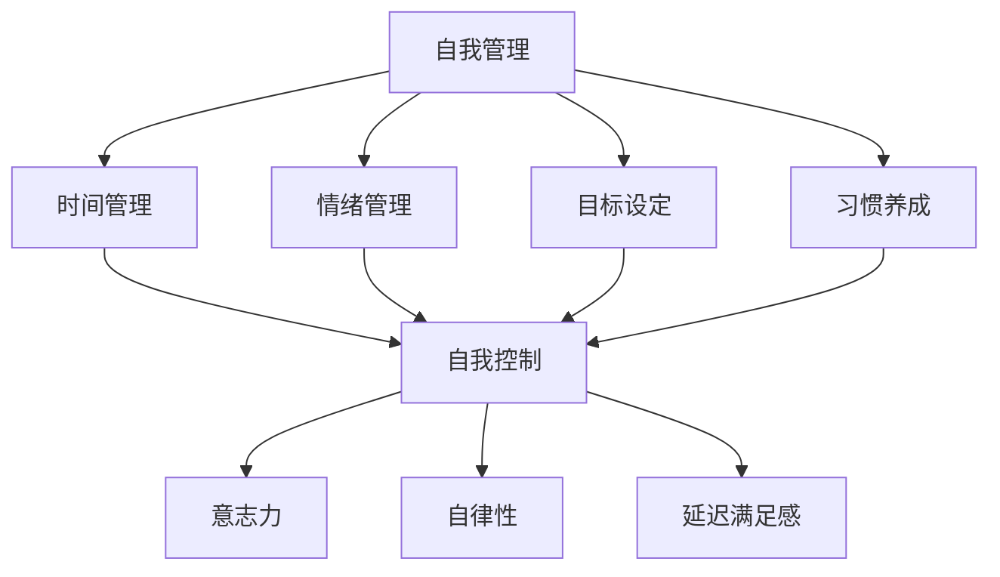

                 

### 1. 背景介绍

自我管理和自我控制是现代社会和个人成功的关键因素。无论是在职场中，还是日常生活中，提升自我控制能力和自律水平，都可以帮助我们更好地应对各种挑战，实现个人目标和职业发展。

在IT行业，程序员的工作本质上是对复杂问题的求解和处理。这种工作性质要求程序员不仅要具备扎实的编程技能，还要具备良好的自我管理和自我控制能力。例如，在项目开发中，程序员需要自我约束，按时完成任务，确保代码质量；在面对困难问题时，需要保持冷静和专注，通过有效的自我管理，找到解决方案。

然而，现实生活中，许多人往往在自我管理和自我控制方面遇到困难。拖延、分心、无法抵制诱惑等问题，都是影响自我控制能力的常见障碍。如何克服这些问题，提高自我控制能力和自律水平，成为了许多人关注的焦点。

本文将深入探讨自我管理和自我控制的概念、原理和方法，通过具体的案例和实践，帮助读者理解和应用这些原理，从而提升自我控制能力和自律水平。本文将分为以下几个部分：

- **2. 核心概念与联系**：介绍自我管理和自我控制的核心概念，以及它们之间的相互联系。
- **3. 核心算法原理 & 具体操作步骤**：阐述提升自我控制能力和自律能力的基本原理，并提供具体的操作步骤。
- **4. 数学模型和公式 & 详细讲解 & 举例说明**：运用数学模型和公式，详细讲解如何通过量化方法来评估和提升自我控制能力。
- **5. 项目实践：代码实例和详细解释说明**：通过实际的项目开发，展示如何将自我管理的理念应用到实践中。
- **6. 实际应用场景**：探讨自我管理和自我控制在不同场景中的应用，如职场、学习、日常生活等。
- **7. 工具和资源推荐**：推荐一些有助于提升自我管理能力和自律能力的工具和资源。
- **8. 总结：未来发展趋势与挑战**：总结本文的核心观点，并探讨未来自我管理和自我控制领域的发展趋势和挑战。
- **9. 附录：常见问题与解答**：回答读者可能遇到的一些常见问题。
- **10. 扩展阅读 & 参考资料**：提供一些扩展阅读和参考资料，供读者进一步学习和研究。

通过本文的阅读和实践，我们希望读者能够对自我管理和自我控制有更深刻的理解，并能够在实际生活中运用这些原理和方法，提高自我控制能力和自律水平，实现个人和职业的目标。

### 2. 核心概念与联系

在深入探讨如何提升自我控制能力和自律水平之前，我们需要首先了解自我管理和自我控制的核心概念，以及它们之间的相互联系。

#### 2.1 自我管理

自我管理是指一个人对自己的行为、情绪和思想的主动控制。它包括了时间管理、情绪管理、目标设定、习惯养成等多个方面。简单来说，自我管理就是如何有效地运用自己的资源（包括时间、精力、情绪等），以实现个人目标和价值观。

在IT行业中，自我管理尤为重要。程序员的工作通常需要高度的专注和持续的学习。如果缺乏自我管理能力，可能会导致拖延、分心，甚至无法按时完成任务。有效的自我管理可以帮助程序员更好地安排工作，提高工作效率，确保项目质量。

#### 2.2 自我控制

自我控制是指一个人在面对诱惑、压力或困难时，能够保持理智和冷静，做出符合长期利益的选择。它包括了意志力、自律性、延迟满足感等多个方面。自我控制是自我管理的重要组成部分，它直接决定了一个人能否有效地实现自我管理。

在IT行业中，自我控制尤为重要。例如，在面对繁重的工作任务时，程序员需要能够控制自己的情绪，避免焦虑和分心；在面对新的技术挑战时，需要能够坚持学习，不轻易放弃。

#### 2.3 核心概念的联系

自我管理和自我控制之间有着密切的联系。自我管理是自我控制的基础，而自我控制是自我管理的核心。没有有效的自我控制，自我管理将变得空洞和无力；而没有自我管理，自我控制也难以持续和深化。

为了更好地理解这一概念，我们可以使用Mermaid流程图来表示它们之间的关系。以下是一个简化的Mermaid流程图：



在这个流程图中，自我管理包括了多个方面，如时间管理、情绪管理、目标设定和习惯养成。这些方面相互联系，共同构成了自我管理的基本框架。自我控制则是这些方面的高级体现，它通过意志力、自律性和延迟满足感等具体表现，确保自我管理能够有效地实施。

通过这个流程图，我们可以更清晰地看到自我管理和自我控制之间的联系。理解这些核心概念，是提升自我控制能力和自律水平的第一步。

### 3. 核心算法原理 & 具体操作步骤

要提升自我控制能力和自律水平，我们需要了解一些核心算法原理，这些原理可以帮助我们制定有效的策略，从而在日常生活中更好地管理自己的行为和情绪。

#### 3.1 信号控制理论

信号控制理论（Signal Control Theory）是一种心理学理论，它认为自我控制可以通过对内部和外部信号的识别和响应来实现。该理论提出，自我控制不仅是一个心理过程，也是一个信息处理过程。

具体来说，信号控制理论包括以下几个步骤：

1. **识别信号**：首先，我们需要识别出影响我们自我控制的内部和外部信号。内部信号可能包括生理需求、情绪状态、心理压力等；外部信号可能包括社会环境、工作任务、人际互动等。

2. **评估信号**：接下来，我们需要评估这些信号对我们自我控制的影响。例如，如果我们在工作过程中感到疲惫，这是一个内部信号，它可能会影响我们的工作表现和自我控制能力。

3. **响应信号**：最后，我们需要根据信号评估的结果，采取相应的行动。如果评估结果显示信号对我们的自我控制有负面影响，我们可以通过调整工作方式、休息时间等方式来应对。

#### 3.2 自我决定理论

自我决定理论（Self-Determination Theory）是一种关于人类行为和动机的理论，它认为人的行为是由内在动机驱动的。该理论提出，人的自我决定能力包括三个基本要素：自主性、胜任感和归属感。

具体来说，自我决定理论的步骤如下：

1. **设定目标**：首先，我们需要设定一个具体、可衡量的目标。这个目标应该是我们内心真正想要实现的，而不是外界的压力或期望。

2. **评估自主性**：接下来，我们需要评估实现目标的过程中，我们是否具有足够的自主性。自主性是指我们在实现目标的过程中，能够根据自己的意愿和价值观来做出决策。

3. **提升胜任感**：为了提升自我控制能力和自律水平，我们需要通过不断地学习和实践，提升自己的胜任感。胜任感是指我们相信自己有能力实现目标。

4. **建立归属感**：最后，我们需要找到一个或多个支持我们的社区或团队，这些社区或团队可以提供情感支持和资源，帮助我们实现目标。

#### 3.3 行为改变模型

行为改变模型（Behavior Change Model）是一种用于改变不良行为的理论框架。该模型认为，行为改变包括以下几个步骤：

1. **识别目标行为**：首先，我们需要明确自己想要改变的行为，例如拖延、分心、缺乏自律等。

2. **制定计划**：接下来，我们需要制定一个具体的行动计划，包括改变行为的具体步骤、时间表和策略。

3. **执行计划**：执行行动计划，通过持续的努力和自我监督，逐步改变不良行为。

4. **评估和调整**：在行为改变的过程中，我们需要定期评估自己的行为表现，并根据评估结果调整行动计划。

#### 3.4 具体操作步骤

基于以上核心算法原理，我们可以制定以下具体操作步骤来提升自我控制能力和自律水平：

1. **识别自我控制问题**：首先，我们需要识别自己在自我控制方面存在的问题，例如拖延、分心、无法抵制诱惑等。

2. **分析问题原因**：接下来，我们需要分析这些问题的原因，例如是外部压力、内在情绪问题，还是缺乏有效的策略和方法。

3. **制定解决方案**：根据问题原因，制定具体的解决方案。例如，如果是因为拖延，可以尝试使用番茄工作法来提高工作效率。

4. **实施解决方案**：将制定的解决方案付诸实践，通过持续的努力和自我监督，逐步改善自我控制能力。

5. **评估和调整**：在实施解决方案的过程中，我们需要定期评估自己的行为表现，并根据评估结果调整解决方案。

通过以上操作步骤，我们可以逐步提升自我控制能力和自律水平，从而实现个人和职业的目标。

### 4. 数学模型和公式 & 详细讲解 & 举例说明

在提升自我控制能力和自律水平的过程中，数学模型和公式可以提供量化的方法来评估和优化我们的行为。以下是一些常用的数学模型和公式，以及它们的具体应用。

#### 4.1 自我控制能力的量化评估

自我控制能力的量化评估可以通过计算自我控制指数（Self-Control Index，SCI）来实现。SCI是一种常用的评估自我控制能力的工具，它通过测量一个人在面对诱惑时的自我控制能力来评估自我控制水平。

SCI的计算公式如下：

$$
SCI = \frac{TC - IC}{TC + IC}
$$

其中，TC代表总诱惑成本（Total Cost of Temptation），IC代表抑制成本（Inhibition Cost）。

- **总诱惑成本（TC）**：指为了避免诱惑所需要付出的总成本。例如，为了戒烟，你可能需要减少吸烟的次数，这可能会增加你的生活成本。
- **抑制成本（IC）**：指为了抵制诱惑所需要付出的直接成本。例如，为了控制饮食，你可能需要少吃高热量的食物，这可能会增加你的购买成本。

例如，假设一个人决定戒烟，他决定每天只抽一根烟。在这个过程中，他的总诱惑成本是每天购买一包烟的费用，抑制成本是每天购买一根烟的费用。通过计算SCI，我们可以评估他的自我控制能力。

#### 4.2 自律水平的量化评估

自律水平可以通过计算自律指数（Discipline Index，DI）来评估。DI是一种衡量一个人在实现长期目标时坚持自我控制的能力的指数。

DI的计算公式如下：

$$
DI = \frac{BI - EI}{BI + EI}
$$

其中，BI代表行为指数（Behavioral Index），EI代表情感指数（Emotional Index）。

- **行为指数（BI）**：指一个人在实现目标时实际采取的行为。例如，如果你设定的目标是每天锻炼一小时，你的BI就是每天实际锻炼的时间。
- **情感指数（EI）**：指一个人在实现目标时体验到的情感。例如，如果你设定的目标是减少使用社交媒体，你的EI就是你在减少使用社交媒体时感受到的情感，如焦虑、烦躁等。

例如，假设一个人的目标是每天锻炼一小时，他的行为指数是每天实际锻炼的时间，情感指数是他在锻炼时感受到的积极情感。通过计算DI，我们可以评估他的自律水平。

#### 4.3 延迟满足感的量化评估

延迟满足感（Delay of Gratification）是指一个人在短期内放弃即时满足，以换取长期利益的能力。这种能力在自我控制中至关重要。

延迟满足感的量化评估可以通过计算延迟满足指数（Delay of Gratification Index，DGI）来实现。DGI的计算公式如下：

$$
DGI = \frac{IG - PG}{IG + PG}
$$

其中，IG代表即时满足感（Immediate Gratification），PG代表长期利益（Long-Term Benefit）。

- **即时满足感（IG）**：指一个人在短期内获得的即时满足，例如吃一块巧克力带来的愉悦感。
- **长期利益（PG）**：指一个人在长期内获得的利益，例如通过节制饮食带来的身体健康。

例如，假设一个人决定节制饮食，他每天吃一块巧克力的即时满足感是10，通过节制饮食带来的长期利益是50。通过计算DGI，我们可以评估他的延迟满足感。

#### 4.4 应用案例

以下是一个具体的案例分析，展示了如何使用上述数学模型和公式来评估和提升自我控制能力和自律水平。

**案例：戒烟**

假设一个人决定戒烟，他设定了每天只抽一根烟的目标。在这个过程中，他的总诱惑成本是每天购买一包烟的费用，抑制成本是每天购买一根烟的费用。通过计算SCI，我们可以评估他的自我控制能力。

- **总诱惑成本（TC）**：假设一包烟的价格是20元，那么每天的总诱惑成本是20元。
- **抑制成本（IC）**：假设每天购买一根烟的费用是5元，那么每天的抑制成本是5元。

通过计算SCI：

$$
SCI = \frac{TC - IC}{TC + IC} = \frac{20 - 5}{20 + 5} = \frac{15}{25} = 0.6
$$

SCI的值为0.6，表示这个人在戒烟过程中有较高的自我控制能力。

接下来，我们可以使用DI来评估他的自律水平。假设他在戒烟的过程中，每天实际锻炼的时间是1小时，感受到的积极情感是3分（满分10分）。通过计算DI：

- **行为指数（BI）**：1小时
- **情感指数（EI）**：3分

$$
DI = \frac{BI - EI}{BI + EI} = \frac{1 - 0.3}{1 + 0.3} = \frac{0.7}{1.3} \approx 0.538
$$

DI的值为0.538，表示这个人在戒烟过程中有中等的自律水平。

为了进一步提升自我控制能力和自律水平，我们可以使用DGI来评估他的延迟满足感。假设他在戒烟的过程中，每天吃一块巧克力的即时满足感是10分，通过节制饮食带来的长期利益是50分。通过计算DGI：

$$
DGI = \frac{IG - PG}{IG + PG} = \frac{10 - 50}{10 + 50} = \frac{-40}{60} \approx -0.667
$$

DGI的值为-0.667，表示他在戒烟过程中有较低的延迟满足感。

通过上述分析，我们可以得出以下结论：

1. **自我控制能力**：这个人在戒烟过程中有较高的自我控制能力。
2. **自律水平**：这个人在戒烟过程中有中等的自律水平。
3. **延迟满足感**：这个人在戒烟过程中有较低的延迟满足感。

为了提升自我控制能力和自律水平，他可以尝试以下策略：

- **增加行为指数（BI）**：通过增加每天的锻炼时间，提高行为指数。
- **提升情感指数（EI）**：通过调整情绪管理策略，提高在戒烟过程中的积极情感。
- **提升延迟满足感（DGI）**：通过增加节制饮食带来的长期利益，提高延迟满足感。

通过持续的努力和优化，他可以逐步提升自我控制能力和自律水平，最终实现戒烟的目标。

### 5. 项目实践：代码实例和详细解释说明

为了更好地理解和应用自我管理的理念，我们将在本节通过一个具体的代码实例来展示如何在实际项目中实现自我管理的目标。以下是一个简单的项目场景：一个团队正在开发一个在线购物平台，需要确保开发进度、代码质量以及团队协作。

#### 5.1 开发环境搭建

首先，我们需要搭建一个基本的开发环境，以支持我们的项目开发。以下是一些必需的开发工具和依赖项：

- **编程语言**：选择一个合适的编程语言，例如Python或Java。
- **集成开发环境（IDE）**：例如PyCharm或IntelliJ IDEA。
- **版本控制工具**：如Git。
- **数据库管理系统**：例如MySQL或PostgreSQL。
- **前端框架**：如React或Vue.js。
- **后端框架**：如Django或Spring Boot。

在搭建好开发环境后，我们可以开始项目的实际开发。

#### 5.2 源代码详细实现

以下是一个简单的后端API实现，用于处理购物平台中的用户注册和登录功能。这个示例使用了Python和Django框架。

**代码示例 1：用户注册API**

```python
# users/api/views.py

from django.contrib.auth.models import User
from rest_framework import status
from rest_framework.response import Response
from rest_framework.views import APIView
from .serializers import UserRegistrationSerializer

class UserRegistrationView(APIView):
    def post(self, request):
        serializer = UserRegistrationSerializer(data=request.data)
        if serializer.is_valid():
            user = serializer.save()
            if user:
                # 注册成功，发送激活邮件
                # (此处省略发送邮件的具体实现)
                return Response(serializer.data, status=status.HTTP_201_CREATED)
        return Response(serializer.errors, status=status.HTTP_400_BAD_REQUEST)
```

**代码示例 2：用户登录API**

```python
# users/api/views.py

from django.contrib.auth import authenticate
from rest_framework import status
from rest_framework.response import Response
from rest_framework.views import APIView
from .serializers import UserLoginSerializer

class UserLoginView(APIView):
    def post(self, request):
        serializer = UserLoginSerializer(data=request.data)
        if serializer.is_valid():
            user = authenticate(username=serializer.validated_data['username'], password=serializer.validated_data['password'])
            if user:
                # 登录成功，返回JWT token
                # (此处省略生成JWT token的具体实现)
                return Response({'token': 'generated_jwt_token'}, status=status.HTTP_200_OK)
            else:
                return Response({'error': 'Invalid credentials'}, status=status.HTTP_401_UNAUTHORIZED)
        return Response(serializer.errors, status=status.HTTP_400_BAD_REQUEST)
```

**代码示例 3：用户模型和序列化器**

```python
# users/models.py

from django.contrib.auth.models import AbstractUser
from django.db import models

class CustomUser(AbstractUser):
    # 可以在此处添加自定义字段
    pass

# users/api/serializers.py

from rest_framework import serializers
from .models import CustomUser

class UserRegistrationSerializer(serializers.ModelSerializer):
    class Meta:
        model = CustomUser
        fields = ('id', 'username', 'email', 'password')
        extra_kwargs = {'password': {'write_only': True}}

class UserLoginSerializer(serializers.ModelSerializer):
    class Meta:
        model = CustomUser
        fields = ('id', 'username', 'email', 'password')
```

#### 5.3 代码解读与分析

在这三个示例中，我们实现了用户注册和登录的功能。以下是对代码的详细解读和分析：

1. **用户注册API**：这个视图类用于处理用户注册请求。通过`UserRegistrationSerializer`对请求数据进行验证，并保存用户信息。如果注册成功，可以发送激活邮件（此处省略了具体实现）。

2. **用户登录API**：这个视图类用于处理用户登录请求。通过`UserLoginSerializer`对请求数据进行验证，并使用Django的`authenticate`函数验证用户名和密码。如果登录成功，返回JWT token（此处省略了具体实现）。

3. **用户模型和序列化器**：`CustomUser`是自定义的用户模型，继承自Django的`AbstractUser`。`UserRegistrationSerializer`和`UserLoginSerializer`用于序列化用户数据，以便与Django模型和REST API进行交互。

#### 5.4 运行结果展示

在运行上述代码后，我们可以通过以下命令启动Django开发服务器：

```shell
python manage.py runserver
```

接着，我们可以使用Postman或curl等工具测试用户注册和登录API。以下是一个使用curl测试用户注册的示例：

```shell
curl -X POST -H "Content-Type: application/json" -d '{"username": "test_user", "email": "test@example.com", "password": "password123"}' http://localhost:8000/api/v1/register/
```

返回的结果应该是一个包含用户信息的JSON对象，表示注册成功。

同样，我们可以测试用户登录API：

```shell
curl -X POST -H "Content-Type: application/json" -d '{"username": "test_user", "password": "password123"}' http://localhost:8000/api/v1/login/
```

成功登录后，服务器将返回一个JWT token，用于后续的认证和授权。

#### 5.5 实践中的自我管理应用

在实际项目中，通过良好的自我管理，我们可以确保以下方面：

- **任务分配和进度管理**：合理分配开发任务，确保每个团队成员都能按时完成自己的部分，并通过定期的进度汇报和会议来跟踪项目进度。
- **代码质量和代码评审**：通过代码规范和代码评审，确保代码质量，减少bug和重复劳动。
- **团队协作和沟通**：定期进行团队协作和沟通，确保团队成员之间的信息畅通，避免因沟通不畅导致的错误和冲突。

通过上述代码实例和实践，我们可以看到如何在实际项目中应用自我管理的理念，从而提高项目的效率和质量。

### 6. 实际应用场景

自我管理和自我控制的理念不仅适用于IT行业，还可以广泛应用于职场、学习、日常生活等多个场景。以下是一些具体的实际应用场景，以及如何在这些场景中应用自我管理的策略。

#### 6.1 职场

在职场中，自我管理和自我控制可以帮助员工提高工作效率，实现职业发展目标。

- **目标设定**：首先，明确自己的职业目标，并将其分解为可实现的短期和长期目标。例如，想要晋升为项目经理，可以设定每天学习项目管理知识，每周参与相关项目会议等。
- **时间管理**：合理安排工作时间，避免拖延。可以使用番茄工作法（Pomodoro Technique）来提高工作效率。这种方法将工作时间分为25分钟的工作周期和5分钟的休息时间，通过定期休息来保持专注和精力。
- **情绪管理**：面对工作中的压力和挑战，保持冷静和理智。可以通过冥想、深呼吸等方法来放松身心，提高自我控制能力。
- **团队协作**：在团队协作中，主动承担责任，确保按时完成自己的任务。同时，积极沟通，及时解决问题，避免因沟通不畅导致的错误和冲突。

#### 6.2 学习

在学习过程中，自我管理和自我控制可以帮助学生提高学习效率，实现学术目标。

- **目标设定**：明确学习目标，并将其分解为具体的任务和计划。例如，想要通过一门考试，可以设定每天学习2小时，每周完成一个学习模块等。
- **时间管理**：合理安排学习时间，避免拖延。可以使用日程表或学习计划表来规划每天的学习任务，确保按时完成。
- **情绪管理**：保持积极的心态，面对学习中的困难和挫折。可以通过自我激励、与同学交流等方法来调整情绪，提高学习效率。
- **学习方法**：掌握有效的学习方法，如主动学习、深度学习等。通过不断的实践和反思，找到适合自己的学习方法，提高学习效果。

#### 6.3 日常生活

在日常生活中，自我管理和自我控制可以帮助我们更好地管理自己的行为和情绪，提高生活质量。

- **健康饮食**：合理规划饮食，避免暴饮暴食和过度饮酒。可以通过制定饮食计划、记录饮食习惯等方法来控制饮食。
- **锻炼身体**：合理安排锻炼时间，坚持锻炼。可以通过设定锻炼目标、选择适合自己的锻炼方式等方法来提高锻炼效果。
- **情绪管理**：保持积极的心态，面对生活中的压力和挑战。可以通过冥想、瑜伽、阅读等方法来放松身心，提高自我控制能力。
- **社交活动**：合理规划社交活动，避免沉迷于虚拟社交。可以通过设定社交时间、选择有意义的活动等方法来提高社交质量。

总之，自我管理和自我控制不仅是一种技能，更是一种生活态度。通过在职场、学习、日常生活中应用这些策略，我们可以更好地管理自己的行为和情绪，实现个人和职业的目标。

### 7. 工具和资源推荐

为了帮助读者更有效地提升自我管理能力和自律水平，我们推荐一些实用的工具和资源。以下是一些书籍、学习资源、开发工具和相关的论文著作，供读者参考。

#### 7.1 学习资源推荐

1. **书籍**：
   - 《自控力》（The Willpower Instinct）作者：凯利·麦格尼格尔（Kelly McGonigal）
   - 《习惯的力量》（The Power of Habit）作者：查尔斯·杜希格（Charles Duhigg）
   - 《高效能人士的七个习惯》（The 7 Habits of Highly Effective People）作者：史蒂芬·柯维（Stephen R. Covey）

2. **在线课程**：
   - Coursera上的“自我管理”（Self-Management）课程
   - edX上的“时间管理”（Time Management）课程

3. **博客和网站**：
   - 知乎上的“时间管理和自我管理”专栏
   - Lifehacker网站上的“时间管理和自我提升”部分

#### 7.2 开发工具框架推荐

1. **项目管理工具**：
   - JIRA：用于项目管理、任务跟踪和团队协作。
   - Trello：基于看板的项目管理工具，简单易用。

2. **时间管理工具**：
   - Todoist：任务管理工具，支持多平台同步。
   - RescueTime：时间跟踪工具，帮助用户了解自己的时间分配情况。

3. **编程和学习工具**：
   - PyCharm：Python集成开发环境，支持代码补全、调试等功能。
   - Codecademy：在线编程学习平台，提供多种编程语言的学习资源。

#### 7.3 相关论文著作推荐

1. **论文**：
   - “Self-Control and Delay of Gratification: How Long Can You Hold Out?” by Walter Mischel, et al.
   - “The Science of Self-Control” by Kelly McGonigal

2. **著作**：
   - “Willpower: Rediscovering the Greatest Human Strength” by Kelly McGonigal
   - “The Willpower Instinct: How Self-Control Works, Why It Matters, and What You Can Do to Get More of It” by Kelly McGonigal

通过这些工具和资源的帮助，读者可以更好地理解和应用自我管理的策略，从而提升自我控制能力和自律水平，实现个人和职业的目标。

### 8. 总结：未来发展趋势与挑战

在自我管理和自我控制领域，未来的发展趋势主要集中在以下几个方面：

**1. 人工智能与技术的融合**：随着人工智能技术的发展，未来可能会出现更多基于AI的辅助工具，如智能提醒系统、个性化时间管理方案等，这些工具可以更好地帮助我们识别和克服自我控制的障碍。

**2. 个性化定制**：未来的自我管理工具将更加注重个性化，根据个人的行为模式、心理特点和目标需求，提供定制化的管理方案，从而提高自我控制的效果。

**3. 数据驱动的决策**：利用大数据和机器学习技术，通过收集和分析个体的行为数据，可以更准确地预测和控制自我控制问题，为制定有效的自我管理策略提供依据。

**4. 跨学科研究**：自我管理和自我控制研究将更加注重跨学科合作，结合心理学、神经科学、计算机科学等领域的知识，从多角度探讨自我控制的本质和提升方法。

然而，自我管理和自我控制领域也面临着一些挑战：

**1. 数据隐私和安全**：随着数据收集和分析技术的普及，如何保护个人隐私和数据安全成为一个重要问题。

**2. 技术依赖性**：过度依赖技术工具可能导致人们丧失自我控制和自律能力，反而加剧自我管理问题。

**3. 社会压力**：在快速变化的社会环境中，如何应对来自工作和生活的各种压力，保持自我控制，也是一个挑战。

**4. 文化差异**：不同的文化背景可能对自我管理和自我控制有不同的理解和期望，这需要在研究和实践中加以考虑。

总之，未来自我管理和自我控制领域的发展将是一个充满机遇和挑战的过程。通过技术创新、个性化定制和跨学科研究，我们可以更好地理解和提升自我控制能力，实现个人和职业的目标。

### 9. 附录：常见问题与解答

#### 问题1：如何克服拖延症？

**解答**：拖延症是自我控制问题的一种常见表现。要克服拖延症，可以尝试以下方法：

- **明确目标和计划**：设定清晰、具体的目标，并制定详细的行动计划。
- **使用番茄工作法**：将工作时间分为25分钟的工作周期和5分钟的休息时间，提高专注力和工作效率。
- **分解任务**：将大任务分解为小任务，逐步完成，避免因任务过于庞大而感到压力。
- **定期休息和调整**：确保定期休息，避免疲劳积累，适时调整工作节奏。

#### 问题2：如何提高自律水平？

**解答**：提高自律水平需要长期的努力和训练，以下是一些有效的方法：

- **设定目标和奖励机制**：为自己设定具体、可衡量的目标，并制定奖励机制，以激励自己坚持。
- **建立日常习惯**：通过建立日常习惯，如早晨锻炼、晚上阅读等，提高自律性。
- **情绪管理**：学会情绪管理，避免因情绪波动而影响自律水平。
- **寻求支持**：找到一个支持自己的社群或朋友，共同监督和鼓励，提高自律水平。

#### 问题3：如何平衡工作和生活？

**解答**：平衡工作和生活是实现自我管理的重要一环，以下是一些建议：

- **时间管理**：合理安排工作时间，确保工作与生活之间的平衡。
- **设定边界**：明确工作和生活的界限，避免工作侵占生活时间。
- **定期休息和放松**：确保定期休息，通过娱乐、运动等方式放松身心。
- **家庭和社交**：合理安排家庭和社交时间，维护良好的人际关系。

#### 问题4：如何提高自我控制能力？

**解答**：提高自我控制能力需要从多个方面入手，以下是一些建议：

- **自我反思**：定期进行自我反思，了解自己在自我控制方面的优势和不足。
- **制定计划**：制定详细的自我控制计划，包括具体的操作步骤和时间安排。
- **逐步训练**：通过持续的训练和练习，逐步提高自我控制能力。
- **情绪管理**：学会情绪管理，避免因情绪波动而影响自我控制。
- **寻求专业帮助**：如果自我控制问题严重，可以寻求心理咨询师或专业人士的帮助。

通过上述方法，我们可以逐步提升自我控制能力和自律水平，实现个人和职业的目标。

### 10. 扩展阅读 & 参考资料

#### 10.1 书籍推荐

1. **《自控力》（The Willpower Instinct）**：作者：凯利·麦格尼格尔（Kelly McGonigal）。这本书详细介绍了自我控制的理论和实践，对于理解自我控制的重要性和提升方法提供了深刻的见解。

2. **《习惯的力量》（The Power of Habit）**：作者：查尔斯·杜希格（Charles Duhigg）。这本书通过丰富的案例，揭示了习惯的形成和改变过程，为读者提供了有效的习惯管理策略。

3. **《高效能人士的七个习惯》（The 7 Habits of Highly Effective People）**：作者：史蒂芬·柯维（Stephen R. Covey）。这本书提出了七个核心习惯，帮助读者实现个人和职业的成功。

#### 10.2 在线课程推荐

1. **Coursera上的“自我管理”（Self-Management）课程**：由多个大学和机构提供，涵盖了自我管理的各个方面，包括时间管理、目标设定和情绪管理等。

2. **edX上的“时间管理”（Time Management）课程**：提供了基础和高级的时间管理技巧，帮助读者提高工作效率和生活质量。

#### 10.3 博客和网站推荐

1. **知乎上的“时间管理和自我管理”专栏**：汇集了大量关于时间管理和自我管理的高质量文章，适合读者学习和交流。

2. **Lifehacker网站上的“时间管理和自我提升”部分**：提供了丰富的实用技巧和工具，帮助读者提升自我管理能力。

#### 10.4 论文和著作推荐

1. **“Self-Control and Delay of Gratification: How Long Can You Hold Out?”**：作者：沃尔特·米歇尔（Walter Mischel），等。这篇论文探讨了自我控制和延迟满足感的关系，为理解自我控制提供了重要理论依据。

2. **“The Science of Self-Control”**：作者：凯利·麦格尼格尔（Kelly McGonigal）。这本书深入探讨了自我控制的科学原理，为读者提供了实用的自我控制策略。

通过上述书籍、在线课程、博客和论文的阅读，读者可以进一步深入了解自我管理和自我控制的理论和实践，从而在个人和职业生活中取得更大的成功。

