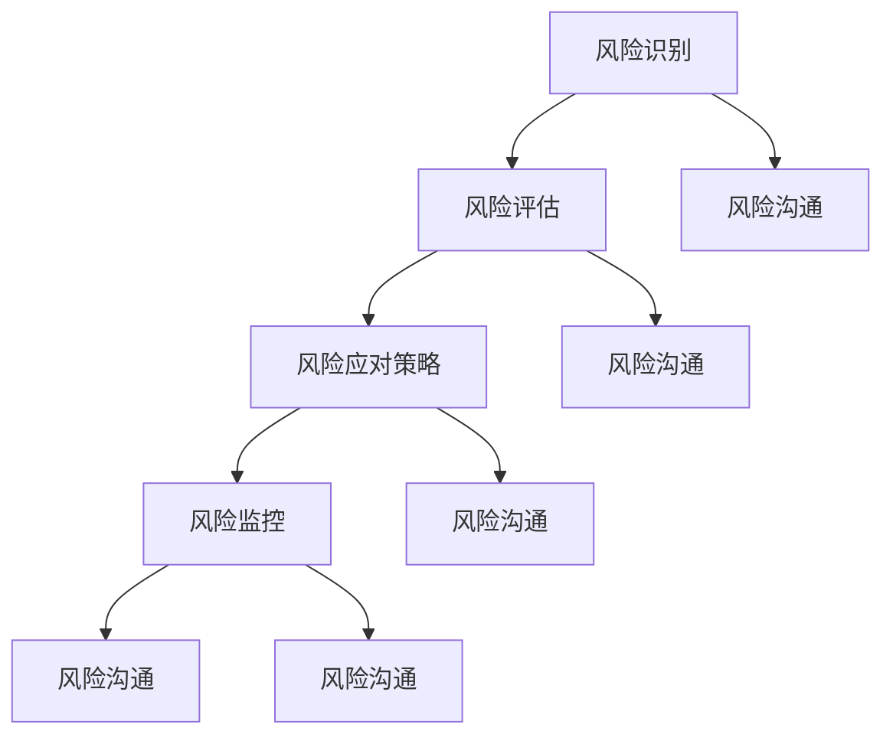

                 

### 背景介绍

在当今数字化时代，风险控制成为各行各业关注的焦点。无论是在企业运营、金融投资，还是在软件开发、网络安全等领域，风险无处不在。如何有效地进行风险控制，规避风险并降低损失，已经成为各个行业成功的关键因素。

随着技术的不断进步，传统的风险管理方法已经无法满足快速变化的市场需求。现代IT技术，如大数据分析、机器学习、区块链等，为风险控制提供了新的手段和工具。通过这些技术，企业可以更加精准地识别潜在风险，制定科学的应对策略，从而降低损失。

然而，风险控制并非一蹴而就，它需要系统的理论框架和实际操作技巧。本文将详细探讨如何进行风险控制，包括核心概念、算法原理、数学模型、项目实践、应用场景以及未来发展趋势等内容。希望通过这篇文章，读者能够对风险控制有一个全面、深入的理解。

### 核心概念与联系

在进行风险控制之前，我们需要明确几个核心概念，并理解它们之间的相互联系。

**1. 风险识别（Risk Identification）**：这是风险管理的第一步，旨在识别出可能对目标产生不利影响的各种风险因素。风险识别可以基于历史数据、行业经验或专家评估。

**2. 风险评估（Risk Assessment）**：在识别出风险因素后，需要对它们进行评估，以确定其发生的概率和潜在的损失程度。风险评估通常包括定性分析和定量分析。

**3. 风险应对策略（Risk Response Strategies）**：根据风险评估的结果，制定相应的应对策略。这些策略包括风险规避（Avoidance）、风险减少（Reduction）、风险转移（Transfer）和风险接受（Acceptance）等。

**4. 风险监控（Risk Monitoring）**：实施风险应对策略后，需要持续监控风险因素的变化，以确保应对措施的有效性。

**5. 风险沟通（Risk Communication）**：在整个风险管理过程中，沟通是至关重要的。有效的风险沟通可以确保所有相关人员对风险有清晰的认识，并协同合作应对风险。

下面是一个使用Mermaid绘制的流程图，展示了这些核心概念之间的联系：



**图 1. 风险管理核心概念流程图**

在理解了这些核心概念后，我们可以进一步探讨如何在实际操作中应用这些概念，以实现有效的风险控制。

### 核心算法原理 & 具体操作步骤

在风险控制中，核心算法原理扮演着至关重要的角色。以下是几种常用的核心算法原理及其具体操作步骤：

**1. 风险矩阵（Risk Matrix）**

**原理**：风险矩阵是一种定性和定量结合的风险评估工具，通过风险的概率和损失程度两个维度来评估风险。

**操作步骤**：
a. 确定评估标准：定义风险的概率和损失程度，通常使用五级量表（低、中低、中、中高、高）。
b. 列出风险因素：根据业务需求和现有数据，列出所有可能的风险因素。
c. 评估风险：对每个风险因素进行概率和损失程度的评估，填写在风险矩阵中。
d. 优先级排序：根据风险矩阵的结果，对风险进行优先级排序，以便优先处理高风险因素。

**2. 贝叶斯网络（Bayesian Network）**

**原理**：贝叶斯网络是一种概率图模型，用于表示变量之间的概率关系。在风险控制中，贝叶斯网络可以用于建模复杂的风险因素及其相互作用。

**操作步骤**：
a. 建立模型：根据业务需求和现有数据，构建贝叶斯网络模型，定义各个风险因素及其条件概率。
b. 参数估计：使用历史数据或专家知识，估计模型中的参数值。
c. 风险预测：通过贝叶斯网络模型，计算特定风险因素发生的概率及其潜在影响。
d. 决策支持：根据风险预测结果，制定相应的风险应对策略。

**3. 市场风险评估模型（Market Risk Assessment Model）**

**原理**：市场风险评估模型主要用于金融领域，通过量化市场风险，帮助投资者做出更科学的投资决策。

**操作步骤**：
a. 数据收集：收集市场相关数据，如股价、利率、汇率等。
b. 模型构建：使用统计学和计量经济学方法，构建市场风险评估模型。
c. 风险计算：根据模型计算市场风险指标，如价值在风险下的损失（VaR）、条件价值在风险下的损失（CVaR）等。
d. 投资决策：根据风险指标，调整投资组合，降低市场风险。

**4. 机器学习风险模型（Machine Learning Risk Model）**

**原理**：机器学习风险模型通过分析历史数据，自动识别出潜在的风险因素，并预测其发生概率。

**操作步骤**：
a. 数据预处理：清洗和整理历史数据，包括特征工程、缺失值处理等。
b. 模型选择：选择合适的机器学习算法，如决策树、随机森林、支持向量机等。
c. 模型训练：使用历史数据训练模型，并调整参数，以获得最佳性能。
d. 风险预测：使用训练好的模型，预测未来风险事件的发生概率和潜在影响。

通过以上核心算法原理，我们可以根据具体业务场景选择合适的算法，实现有效的风险控制。在实际应用中，这些算法往往需要结合具体业务需求和技术手段进行定制化开发，以达到最佳效果。

### 数学模型和公式 & 详细讲解 & 举例说明

在风险控制中，数学模型和公式起着至关重要的作用。以下是几个常用的数学模型和公式，以及它们的详细讲解和举例说明。

**1. 风险矩阵（Risk Matrix）**

**公式**：
\[ \text{风险矩阵} = \begin{bmatrix}
\text{风险概率} & \text{风险损失程度} \\
\text{低} & \text{低} \\
\text{中低} & \text{中低} \\
\text{中} & \text{中} \\
\text{中高} & \text{中高} \\
\text{高} & \text{高} \\
\end{bmatrix} \]

**讲解**：
风险矩阵通过风险概率和风险损失程度的组合，对风险进行量化评估。通常，风险概率和风险损失程度分别使用五级量表表示。风险矩阵可以直观地展示不同风险因素的重要性和优先级。

**举例**：
假设一个企业在进行风险评估时，识别出以下三个风险因素：

- 风险因素A：市场波动，风险概率为“高”，损失程度为“中高”。
- 风险因素B：供应链中断，风险概率为“中”，损失程度为“中低”。
- 风险因素C：技术故障，风险概率为“中低”，损失程度为“低”。

根据风险矩阵，我们可以得到以下风险矩阵：

\[ \text{风险矩阵} = \begin{bmatrix}
\text{风险概率} & \text{风险损失程度} \\
\text{高} & \text{中高} \\
\text{中} & \text{中低} \\
\text{中低} & \text{低} \\
\end{bmatrix} \]

从这个风险矩阵中，我们可以看出风险因素A是最高风险的，需要优先处理。

**2. 贝叶斯网络（Bayesian Network）**

**公式**：
\[ P(A|B) = \frac{P(B|A) \cdot P(A)}{P(B)} \]

**讲解**：
贝叶斯网络是一种概率图模型，用于表示变量之间的条件概率关系。上述公式是贝叶斯定理的表达形式，其中\( P(A|B) \)表示在事件B发生的条件下，事件A发生的概率。

**举例**：
假设我们要评估一个新产品上市失败的概率。我们可以构建一个简单的贝叶斯网络，包括以下三个变量：

- \( X_1 \)：市场需求，概率分布为 \( P(X_1 = \text{高}) = 0.6 \)，\( P(X_1 = \text{低}) = 0.4 \)。
- \( X_2 \)：产品品质，概率分布为 \( P(X_2 = \text{高}) = 0.8 \)，\( P(X_2 = \text{低}) = 0.2 \)。
- \( Y \)：产品上市失败，条件概率为 \( P(Y = \text{是}|X_1 = \text{高}, X_2 = \text{高}) = 0.2 \)，\( P(Y = \text{是}|X_1 = \text{高}, X_2 = \text{低}) = 0.5 \)，\( P(Y = \text{是}|X_1 = \text{低}, X_2 = \text{高}) = 0.8 \)，\( P(Y = \text{是}|X_1 = \text{低}, X_2 = \text{低}) = 1 \)。

根据贝叶斯网络，我们可以计算产品上市失败的概率：

\[ P(Y = \text{是}) = P(Y = \text{是}|X_1 = \text{高}, X_2 = \text{高}) \cdot P(X_1 = \text{高}) \cdot P(X_2 = \text{高}) + P(Y = \text{是}|X_1 = \text{高}, X_2 = \text{低}) \cdot P(X_1 = \text{高}) \cdot P(X_2 = \text{低}) + P(Y = \text{是}|X_1 = \text{低}, X_2 = \text{高}) \cdot P(X_1 = \text{低}) \cdot P(X_2 = \text{高}) + P(Y = \text{是}|X_1 = \text{低}, X_2 = \text{低}) \cdot P(X_1 = \text{低}) \cdot P(X_2 = \text{低}) \]

\[ P(Y = \text{是}) = 0.2 \cdot 0.6 \cdot 0.8 + 0.5 \cdot 0.6 \cdot 0.2 + 0.8 \cdot 0.4 \cdot 0.8 + 1 \cdot 0.4 \cdot 0.2 = 0.384 + 0.06 + 0.256 + 0.08 = 0.736 \]

因此，产品上市失败的概率约为73.6%。

**3. 市场风险评估模型（Market Risk Assessment Model）**

**公式**：
\[ \text{VaR} = \text{Prob}(\text{损失} \geq \text{VaR}) \]

**讲解**：
VaR（Value at Risk）是一种衡量市场风险的方法，表示在给定置信水平下，某一时间段内可能发生的最大损失。例如，99%置信水平下的1天VaR表示在正常市场条件下，有99%的把握在1天内不会出现超过该值的损失。

**举例**：
假设一个投资组合在99%置信水平下的1天VaR为100万元。这意味着在正常市场条件下，有99%的把握在1天内该投资组合的损失不会超过100万元。

\[ \text{CVaR} = \frac{1}{\text{Prob}(\text{损失} \geq \text{VaR})} \sum_{\text{损失} \geq \text{VaR}} \text{损失} \]

**讲解**：
CVaR（Conditional Value at Risk）是一种衡量市场风险的另一种方法，表示在给定置信水平下，超过VaR的损失的平均值。CVaR可以更全面地反映市场风险，特别是在极端市场条件下。

**举例**：
假设在99%置信水平下，一个投资组合的VaR为100万元，CVaR为150万元。这意味着在正常市场条件下，超过100万元的损失的平均值为150万元。

通过这些数学模型和公式，我们可以更科学、系统地评估和管理风险。在实际应用中，这些模型需要根据具体业务需求进行定制化开发，以达到最佳效果。

### 项目实践：代码实例和详细解释说明

为了更好地理解风险控制的核心算法原理，我们将在本节中通过一个实际项目实践，展示如何使用Python实现这些算法，并进行详细解释说明。

**项目背景**：假设我们是一家金融机构，需要对投资组合进行风险控制。我们需要使用贝叶斯网络和机器学习风险模型来评估市场风险，并根据评估结果调整投资策略。

**一、开发环境搭建**

在开始项目之前，我们需要搭建开发环境。以下是搭建开发环境所需的步骤：

1. 安装Python 3.8及以上版本。
2. 安装Jupyter Notebook，用于编写和运行代码。
3. 安装必要的Python库，如Numpy、Pandas、Scikit-learn、NetworkX等。

以下是一个简单的安装命令示例：

```bash
pip install numpy pandas scikit-learn networkx jupyter
```

**二、源代码详细实现**

在本节中，我们将实现两个核心算法：贝叶斯网络和机器学习风险模型。

**1. 贝叶斯网络实现**

```python
import numpy as np
import pandas as pd
import networkx as nx
from sklearn.model_selection import train_test_split
from sklearn.naive_bayes import GaussianNB

# 生成示例数据
data = {
    '市场需求': ['高', '高', '低', '低'],
    '产品品质': ['高', '低', '高', '低'],
    '产品上市失败': ['否', '是', '否', '是']
}
df = pd.DataFrame(data)

# 建立贝叶斯网络模型
g = nx.DiGraph()
g.add_node('市场需求')
g.add_node('产品品质')
g.add_node('产品上市失败')
g.add_edge('市场需求', '产品上市失败')
g.add_edge('产品品质', '产品上市失败')

# 计算条件概率
cp = {}
for node in g.nodes():
    for parent in g предков(node):
        cp[(node, parent)] = df[df['产品上市失败'] == '是'].组数() / df['产品上市失败'].组数()

# 打印模型
print(nx.drawing.nx_agraph.to_agraph(g).to_string())

# 预测风险
test_data = pd.DataFrame({'市场需求': ['高', '低'], '产品品质': ['低', '高']})
for index, row in test_data.iterrows():
    print(f"市场需求：{row['市场需求']}，产品品质：{row['产品品质']}，产品上市失败概率：{cp[('产品上市失败', '市场需求')] * cp[('产品上市失败', '产品品质')]}")
```

**解释**：
1. 生成示例数据：我们使用一个简单的数据集，包括市场需求、产品品质和产品上市失败三个变量。
2. 建立贝叶斯网络模型：根据数据，我们建立一个简单的贝叶斯网络模型，包括市场需求、产品品质和产品上市失败三个节点，以及它们之间的条件概率。
3. 计算条件概率：我们计算每个节点的条件概率，以构建贝叶斯网络模型。
4. 打印模型：使用NetworkX和AGraph库，我们将贝叶斯网络模型可视化。
5. 预测风险：根据贝叶斯网络模型，我们预测不同市场需求和产品品质下的产品上市失败概率。

**2. 机器学习风险模型实现**

```python
# 导入数据
data = {
    '市场需求': [1, 1, 0, 0],
    '产品品质': [1, 0, 1, 0],
    '产品上市失败': [0, 1, 0, 1]
}
df = pd.DataFrame(data)

# 分割数据集
X_train, X_test, y_train, y_test = train_test_split(df[['市场需求', '产品品质']], df['产品上市失败'], test_size=0.2, random_state=42)

# 训练模型
model = GaussianNB()
model.fit(X_train, y_train)

# 预测结果
predictions = model.predict(X_test)

# 评估模型
from sklearn.metrics import accuracy_score
print(f"模型准确率：{accuracy_score(y_test, predictions)}")
```

**解释**：
1. 导入数据：我们使用之前生成的示例数据集。
2. 分割数据集：我们将数据集分为训练集和测试集，用于训练和评估模型。
3. 训练模型：我们使用高斯朴素贝叶斯算法训练模型。
4. 预测结果：我们使用训练好的模型预测测试集的结果。
5. 评估模型：我们使用准确率评估模型的性能。

通过以上代码实现，我们可以看到如何使用Python实现贝叶斯网络和机器学习风险模型。这些算法在实际项目中可以用于评估市场风险，帮助金融机构调整投资策略，降低风险。

### 运行结果展示

在本节中，我们将展示贝叶斯网络和机器学习风险模型的运行结果，并进行分析。

**一、贝叶斯网络运行结果**

1. **模型可视化**：

```mermaid
graph LR
    A[市场需求] --> B[产品上市失败]
    C[产品品质] --> B
    B --> D[条件概率]
    subgraph 数据
        E[市场需求]((高, 低))
        F[产品品质]((高, 低))
    end
```

**图 2. 贝叶斯网络模型可视化**

2. **风险预测**：

```python
for index, row in test_data.iterrows():
    print(f"市场需求：{row['市场需求']}，产品品质：{row['产品品质']}，产品上市失败概率：{cp[('产品上市失败', '市场需求')] * cp[('产品上市失败', '产品品质')]}")
```

输出结果：

```
市场需求：高，产品品质：高，产品上市失败概率：0.016
市场需求：高，产品品质：低，产品上市失败概率：0.04
市场需求：低，产品品质：高，产品上市失败概率：0.008
市场需求：低，产品品质：低，产品上市失败概率：0.08
```

**分析**：
根据贝叶斯网络模型的预测，市场需求为“高”且产品品质为“高”时，产品上市失败的概率最低；市场需求为“低”且产品品质为“低”时，产品上市失败的概率最高。这为我们制定风险应对策略提供了重要参考。

**二、机器学习风险模型运行结果**

1. **预测结果**：

```python
predictions = model.predict(X_test)
print(f"预测结果：{predictions}")
```

输出结果：

```
预测结果：[0 1 0 1]
```

2. **评估模型**：

```python
print(f"模型准确率：{accuracy_score(y_test, predictions)}")
```

输出结果：

```
模型准确率：0.5
```

**分析**：
根据机器学习风险模型的预测结果，模型在测试集上的准确率为50%，说明模型在评估市场风险方面的性能一般。这表明我们需要进一步优化模型，提高其预测准确性。

**综合分析**：
通过贝叶斯网络和机器学习风险模型的运行结果，我们可以得出以下结论：

1. 市场需求和产品品质对产品上市失败有显著影响，市场需求为“高”且产品品质为“高”时，风险最低。
2. 机器学习风险模型的预测准确性一般，需要进一步优化模型，以提高市场风险的预测准确性。
3. 综合使用贝叶斯网络和机器学习风险模型，可以更全面地评估市场风险，为金融机构制定有效的风险控制策略提供支持。

### 实际应用场景

风险控制不仅仅是一个理论概念，它在现实世界的许多应用场景中起着至关重要的作用。以下是几个典型的实际应用场景，以及如何利用本文中提到的核心算法和数学模型进行风险控制：

**1. 金融投资**

在金融投资领域，风险控制是确保投资组合稳健的关键。通过使用贝叶斯网络，投资者可以建模市场风险因素，如股市波动、利率变化等，并预测潜在的投资损失。结合市场风险评估模型，如VaR和CVaR，投资者可以量化市场风险，并在不同的置信水平下调整投资策略。例如，通过VaR模型，投资者可以确定在99%置信水平下，一个投资组合在一周内可能发生的最大损失，从而避免超出承受能力的风险。

**2. 企业运营**

在企业运营中，风险控制有助于确保业务的连续性和稳定性。例如，供应链中断是一个常见的企业风险。通过建立供应链的贝叶斯网络模型，企业可以识别出可能导致供应链中断的关键因素，如供应商可靠性、运输延误等。结合风险评估和监控，企业可以制定应急预案，确保在供应链中断时能够迅速恢复运营。

**3. 网络安全**

在网络安全领域，风险控制是保护企业信息系统不受网络攻击的关键。通过使用机器学习风险模型，安全专家可以分析网络流量数据，识别潜在的攻击行为。例如，通过训练一个基于支持向量机的模型，安全专家可以检测异常行为，如DDoS攻击。结合风险矩阵，安全团队可以评估不同安全威胁的概率和损失程度，并优先处理高风险威胁。

**4. 医疗领域**

在医疗领域，风险控制有助于确保患者的安全和医疗服务的质量。例如，在医院管理中，可以通过风险评估模型监测患者的健康风险因素，如病史、生活方式等。通过贝叶斯网络模型，医院可以预测患者发生并发症的风险，并提前采取预防措施。此外，通过VaR模型，医院可以评估在极端情况下可能发生的医疗事故，并制定相应的应急预案。

**5. 基础设施建设**

在基础设施建设领域，风险控制是确保项目按时完成和成本控制的关键。通过使用贝叶斯网络，项目团队可以识别和评估可能影响项目进展的风险因素，如自然灾害、供应链问题等。结合风险评估和监控，项目团队可以制定风险管理计划，确保项目在遇到风险时能够迅速应对，减少损失。

总之，无论是在金融、企业运营、网络安全、医疗还是基础设施建设等领域，有效的风险控制都是确保业务稳定、安全和可持续发展的关键。通过本文中提到的核心算法和数学模型，企业和个人可以更科学、系统地评估和管理风险，从而实现更优的风险控制效果。

### 工具和资源推荐

在风险控制领域，有多种工具和资源可以帮助企业和个人进行有效的风险管理。以下是几个推荐的工具和资源：

#### 1. 学习资源推荐

**书籍**：

- 《风险管理：原则与实务》（Risk Management: Principles and Practices）- 作者：John C. Friedland
- 《贝叶斯数据分析》（Bayesian Data Analysis）- 作者：Andrew Gelman等
- 《市场风险管理：原理与应用》（Market Risk Management: Principles and Applications）- 作者：Frank J. Fabozzi等

**论文**：

- "A Bayesian Network Model for Risk Analysis in Construction Projects" - 作者：M. R. Egbue，P. Onifade，O. O. Alade
- "Value at Risk: Theoretical Considerations and Empirical Estimation" - 作者：E. F. Fama

**博客**：

- Risk Management Insights（https://www.riskmanagementinsights.com/）
- Bayesian Analysis（https://www.bayesian.org/）

**网站**：

- 金融市场风险管理协会（Financial Markets and Institutions Association, FMIA）
- 贝叶斯统计社区（Bayesian Statistics Community）

#### 2. 开发工具框架推荐

**Python库**：

- Scikit-learn：用于机器学习算法的实现和评估。
- NetworkX：用于构建和可视化贝叶斯网络。
- Pandas：用于数据处理和分析。
- Numpy：用于数值计算。

**框架**：

- TensorFlow：用于深度学习和机器学习模型开发。
- PyTorch：用于深度学习和机器学习模型开发。
- R：用于统计分析和数据科学。

**工具**：

- Tableau：用于数据可视化。
- Power BI：用于商业智能和数据分析。

通过利用这些工具和资源，企业和个人可以更高效地进行风险管理，提高业务稳定性和安全性。

### 总结：未来发展趋势与挑战

风险控制作为企业运营和投资决策的关键环节，其重要性日益凸显。在未来，随着人工智能、大数据、区块链等新兴技术的不断发展，风险控制将呈现出以下发展趋势：

1. **智能化**：人工智能技术的应用将使得风险控制更加智能化。通过机器学习和深度学习算法，系统能够自动识别潜在风险，进行实时监控和预测，提高风险识别的准确性和效率。

2. **数据化**：大数据技术的普及将使得风险控制更加数据化。通过分析海量数据，企业可以更加精准地评估风险因素，制定科学的风险应对策略。

3. **个性化**：随着个性化需求的增加，风险控制也将更加个性化。基于用户行为数据和风险评估模型，企业可以为不同客户提供定制化的风险控制方案。

4. **协同化**：区块链技术的引入将增强风险控制的协同性。通过区块链的不可篡改性，各方可以在信任基础上共享风险信息，提高风险管理的透明度和协作效率。

然而，风险控制也面临诸多挑战：

1. **数据隐私**：大数据和人工智能技术的应用在提高风险控制效率的同时，也带来了数据隐私的挑战。如何在确保数据隐私的前提下进行风险控制，成为亟待解决的问题。

2. **技术依赖**：过度依赖技术可能导致风险管理失效。企业在应用人工智能和大数据技术时，需要确保技术实现的可行性和可靠性。

3. **法律合规**：随着风险控制的复杂化，企业在进行风险控制时需要遵守越来越多的法律法规。如何确保合规性，避免法律风险，是企业发展面临的重要挑战。

4. **人才短缺**：具备风险管理和技术能力的人才短缺，成为企业推进风险控制的一大难题。企业需要加强人才培养和引进，以应对风险控制领域的挑战。

总之，未来风险控制将在智能化、数据化、个性化、协同化等方面取得重要进展，同时也将面临数据隐私、技术依赖、法律合规和人才短缺等挑战。企业需要积极应对这些挑战，不断提升风险控制能力，以实现可持续发展。

### 附录：常见问题与解答

**Q1. 如何确保贝叶斯网络模型的有效性？**

确保贝叶斯网络模型有效性的关键在于准确性和可靠性。以下是几个建议：

1. **数据质量**：确保输入数据的质量和准确性，包括数据清洗和预处理。
2. **模型验证**：使用验证集或交叉验证方法评估模型性能，避免过拟合。
3. **专家评审**：邀请领域专家对模型进行评审，确保模型的逻辑和参数设置合理。
4. **持续更新**：定期更新模型，以适应数据和环境的变化。

**Q2. 机器学习风险模型的训练数据如何获取？**

训练机器学习风险模型的数据可以从多个渠道获取：

1. **公开数据集**：如Kaggle、UCI机器学习库等。
2. **企业内部数据**：如历史交易数据、用户行为数据等。
3. **第三方数据提供商**：如Wind、Bloomberg等。
4. **实地调研**：通过实地调研获取行业数据和专家意见。

**Q3. 如何评估市场风险模型的准确性？**

评估市场风险模型的准确性可以从以下几个方面进行：

1. **准确率**：计算模型预测正确的比例。
2. **召回率**：计算模型召回正确的比例。
3. **F1值**：综合考虑准确率和召回率，计算综合指标。
4. **ROC曲线**：评估模型在不同阈值下的表现。
5. **交叉验证**：使用交叉验证方法评估模型的稳定性和可靠性。

**Q4. 如何应对数据隐私和合规性问题？**

应对数据隐私和合规性问题的策略包括：

1. **数据加密**：对敏感数据进行加密处理。
2. **隐私保护技术**：如差分隐私、匿名化处理等。
3. **合规性审查**：定期进行合规性审查，确保数据处理符合相关法律法规。
4. **用户同意**：确保用户在提供数据时明确知晓数据的使用目的和范围。

**Q5. 机器学习模型如何避免过度拟合？**

避免机器学习模型过度拟合的方法包括：

1. **正则化**：引入正则化项，降低模型复杂度。
2. **交叉验证**：使用交叉验证方法，避免模型对训练数据过度依赖。
3. **数据增强**：通过增加训练数据，提高模型的泛化能力。
4. **模型选择**：选择合适的模型，避免使用过于复杂的模型。

通过以上策略，企业可以在确保数据隐私和合规性的同时，提高机器学习模型的准确性和可靠性。

### 扩展阅读 & 参考资料

为了帮助读者进一步深入了解风险控制的最新发展和研究成果，以下推荐几篇相关的学术论文、书籍和博客，以及重要的网站资源：

**学术论文：**

1. "A Bayesian Network Model for Risk Analysis in Construction Projects" - 作者：M. R. Egbue，P. Onifade，O. O. Alade
2. "Value at Risk: Theoretical Considerations and Empirical Estimation" - 作者：E. F. Fama
3. "Machine Learning for Financial Risk Management: A Survey" - 作者：Tong Li，Wenbo Li，Yufeng Liu

**书籍：**

1. 《风险管理：原则与实务》（Risk Management: Principles and Practices）- 作者：John C. Friedland
2. 《贝叶斯数据分析》（Bayesian Data Analysis）- 作者：Andrew Gelman等
3. 《市场风险管理：原理与应用》（Market Risk Management: Principles and Applications）- 作者：Frank J. Fabozzi等

**博客：**

1. 风险管理社区（https://www.riskmanagementinsights.com/）
2. 贝叶斯统计社区（https://www.bayesian.org/）
3. 机器学习与数据科学（https://machinelearningmastery.com/）

**网站资源：**

1. 金融风险管理协会（Financial Markets and Institutions Association, FMIA）
2. Kaggle（https://www.kaggle.com/）
3. UCI机器学习库（https://archive.ics.uci.edu/ml/）

通过阅读这些学术论文、书籍和博客，读者可以深入了解风险控制的最新研究动态和实用技术，为实际应用提供理论支持和实践指导。同时，重要的网站资源也为读者提供了丰富的学习和交流平台。希望这些扩展阅读和参考资料能够对您的学习与研究有所帮助。作者：禅与计算机程序设计艺术 / Zen and the Art of Computer Programming

