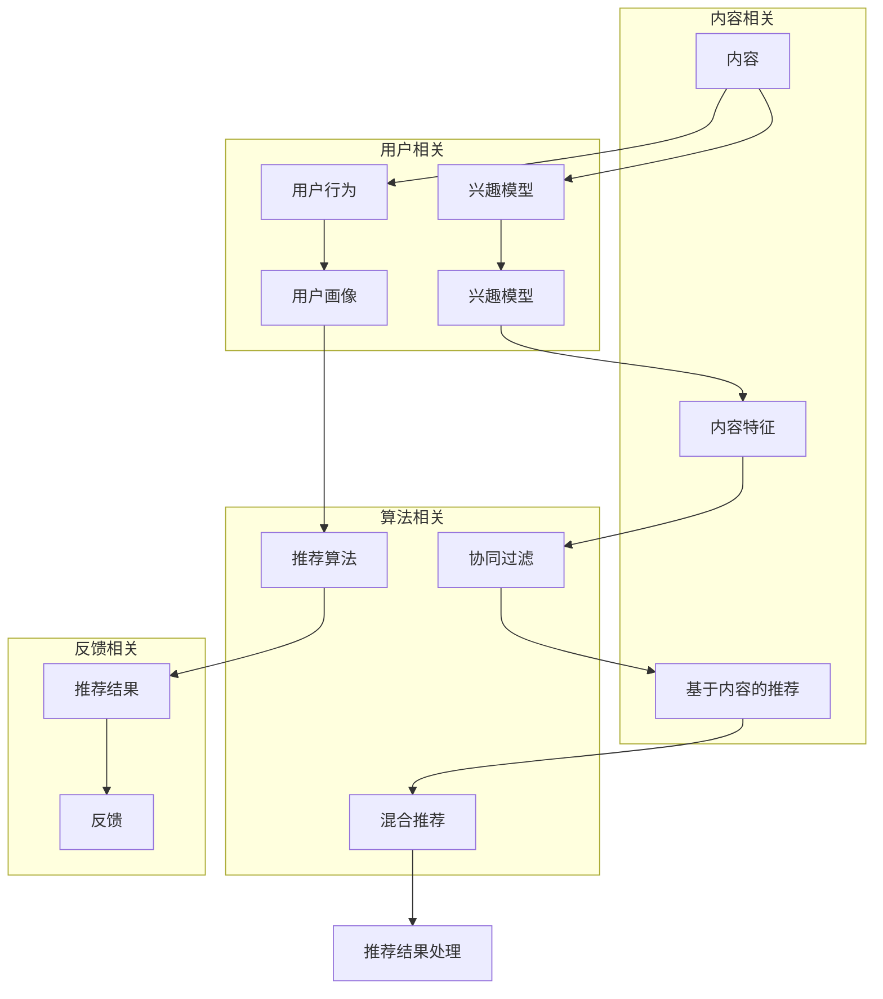

                 

### 背景介绍

随着互联网技术的飞速发展，个性化推荐系统已经成为现代信息检索和互联网应用中的重要组成部分。字节跳动旗下的海外版抖音（TikTok）更是以其强大的个性化推荐算法，成功吸引了全球数十亿用户。然而，一个高效的推荐系统不仅需要丰富的用户数据和先进的算法，还需要对数据和应用场景有深刻的理解。这就涉及到了机器学习领域的一个重要环节——面试。

本文将以字节跳动2025海外版抖音个性化推荐社招机器学习面试题为背景，深入探讨这些面试题的核心概念、算法原理、数学模型以及实际应用场景。希望通过这篇文章，能够帮助准备面试的读者更好地理解和应对这类问题，同时也能够为业内人士提供一个交流和学习的平台。

字节跳动作为中国最知名的互联网科技公司之一，其面试题常常代表了业界高标准的考题设计。本文将选取几道具有代表性的面试题，通过逐步分析，让读者对推荐系统的构建和优化有一个全面的认识。

在接下来的章节中，我们将首先介绍推荐系统的核心概念和架构，然后详细讲解几种常用的推荐算法，并深入探讨其数学模型和操作步骤。此外，我们还将通过代码实例展示实际应用中的实现细节，并分析其运行结果。最后，我们将讨论推荐系统在实际应用场景中的挑战和解决方案，并提供相关工具和资源的推荐。

总之，本文旨在为读者提供一个系统的、全面的、易于理解的学习资源，帮助大家更好地掌握推荐系统的核心技术，为未来的职业发展打下坚实的基础。

---

### 核心概念与联系

推荐系统的核心概念与联系可以看作是构建一个强大、灵活和高效推荐系统的基石。为了更好地理解这些概念，我们可以通过一个Mermaid流程图来展现推荐系统的主要组成部分及其相互关系。

以下是推荐系统的核心概念和架构的Mermaid流程图：



**1. 用户与内容**

- **用户（User）**：用户是推荐系统的核心。用户的行为、偏好和需求决定了推荐系统的目标。
- **内容（Content）**：内容是用户消费的主要对象，可以是视频、文章、商品等。

**2. 用户行为**

- **用户行为（User Behavior）**：用户与内容之间的交互行为，如点击、浏览、购买、评论等，这些行为是构建推荐系统的重要数据来源。

**3. 用户画像与兴趣模型**

- **用户画像（User Profile）**：用户画像是对用户特征的综合描述，包括用户的年龄、性别、地理位置、兴趣爱好等。
- **兴趣模型（Interest Model）**：兴趣模型基于用户画像构建，用于捕捉和量化用户的兴趣偏好。

**4. 内容特征**

- **内容特征（Content Features）**：内容特征是对内容本身的属性描述，如视频的时长、类别、标签、播放量等。

**5. 推荐算法**

- **协同过滤（Collaborative Filtering）**：协同过滤是一种基于用户行为数据的方法，通过分析用户之间的相似性来预测用户对未观看内容的偏好。
- **基于内容的推荐（Content-Based Recommendation）**：基于内容的推荐方法通过分析内容特征来匹配用户的兴趣和偏好。

**6. 混合推荐**

- **混合推荐（Hybrid Recommendation）**：混合推荐方法结合了协同过滤和基于内容的推荐方法，以充分利用不同方法的优点。

**7. 推荐结果处理与反馈**

- **推荐结果（Recommendation Results）**：推荐结果是根据用户兴趣和内容特征生成的个性化推荐列表。
- **反馈（Feedback）**：用户的反馈是优化推荐系统的重要依据，可以通过点击率、用户满意度等方式进行量化。

通过上述Mermaid流程图，我们可以清晰地看到推荐系统的各个组成部分及其相互关系。接下来，我们将进一步探讨这些核心概念和联系的详细原理和应用，为理解推荐系统的复杂性和实现提供理论基础。

---

### 核心算法原理 & 具体操作步骤

在了解了推荐系统的核心概念与联系之后，接下来我们将深入探讨几种常用的推荐算法原理及其具体操作步骤。推荐算法是推荐系统的核心，主要分为协同过滤、基于内容的推荐和混合推荐三种方法。以下将分别详细说明这三种算法的原理和实现步骤。

#### 1. 协同过滤算法

**原理：**

协同过滤（Collaborative Filtering）是一种基于用户行为数据的推荐方法，通过分析用户之间的相似性来预测用户对未观看内容的偏好。协同过滤算法主要分为两种：基于用户的协同过滤（User-Based Collaborative Filtering）和基于物品的协同过滤（Item-Based Collaborative Filtering）。

- **基于用户的协同过滤：** 基于用户的协同过滤方法通过寻找与目标用户相似的其他用户，然后推荐这些相似用户喜欢的内容。相似性通常通过用户之间的共同评分或者行为进行度量。
- **基于物品的协同过滤：** 基于物品的协同过滤方法通过寻找与目标物品相似的其他物品，然后推荐这些相似物品的评分。相似性通常通过物品之间的协同度量或者相关性进行计算。

**操作步骤：**

1. **数据预处理：** 将用户-物品评分矩阵转换为用户特征向量矩阵。这可以通过矩阵分解、主成分分析（PCA）等方法实现。
2. **计算相似性：** 计算用户或物品之间的相似性。对于基于用户的协同过滤，可以使用余弦相似度、皮尔逊相关系数等方法；对于基于物品的协同过滤，也可以使用余弦相似度、皮尔逊相关系数等方法。
3. **推荐生成：** 根据用户和物品之间的相似性，生成推荐列表。对于基于用户的协同过滤，推荐相似用户喜欢的物品；对于基于物品的协同过滤，推荐相似物品。

**示例：**

假设有用户A和用户B，他们的评分矩阵如下：

| 用户 | 物品1 | 物品2 | 物品3 |
|------|-------|-------|-------|
| A    | 4     | 3     | 2     |
| B    | 5     | 4     | 5     |

通过计算用户A和用户B之间的余弦相似度，可以得到一个相似性矩阵。然后，根据相似性矩阵生成推荐列表，例如推荐用户B喜欢的物品给用户A。

#### 2. 基于内容的推荐算法

**原理：**

基于内容的推荐（Content-Based Recommendation）方法通过分析内容特征来匹配用户的兴趣和偏好。这种方法基于这样的假设：用户对具有相似特征的内容有相似的喜好。

**操作步骤：**

1. **提取内容特征：** 从文本、图像、视频等多媒体内容中提取特征。对于文本，可以使用词袋模型、TF-IDF等方法；对于图像和视频，可以使用视觉特征提取、音频特征提取等方法。
2. **构建用户兴趣模型：** 根据用户的历史行为，构建用户的兴趣模型。例如，通过统计用户观看或点击的文本或视频的标签、关键词等。
3. **推荐生成：** 根据用户兴趣模型和内容特征，生成推荐列表。通常使用相似度度量（如余弦相似度、欧氏距离等）计算内容特征之间的相似性，然后根据相似性生成推荐列表。

**示例：**

假设用户A喜欢观看具有标签“科技”和“新闻”的视频。通过提取用户A观看的视频的标签特征，可以得到一个特征向量。然后，从所有未观看的视频中提取标签特征，计算与用户A特征向量的相似度，生成推荐列表。

#### 3. 混合推荐算法

**原理：**

混合推荐（Hybrid Recommendation）方法结合了协同过滤和基于内容的推荐方法，以充分利用不同方法的优点。混合推荐算法通常通过以下步骤实现：

1. **协同过滤生成初步推荐列表：** 使用协同过滤方法生成初步推荐列表。
2. **内容特征计算相似性：** 对初步推荐列表中的内容提取特征，并计算与用户兴趣模型的相似性。
3. **合并推荐列表：** 根据相似性度量合并协同过滤和内容推荐的推荐列表，生成最终的推荐列表。

**操作步骤：**

1. **协同过滤推荐：** 使用基于用户的协同过滤或基于物品的协同过滤生成初步推荐列表。
2. **内容特征提取：** 对初步推荐列表中的内容提取特征。
3. **内容相似性计算：** 计算用户兴趣模型与内容特征之间的相似性。
4. **合并推荐：** 将协同过滤推荐和内容推荐的结果合并，生成最终的推荐列表。

**示例：**

假设初步推荐列表包含用户喜欢的物品，同时根据内容特征提取和相似性计算，发现这些物品与用户兴趣模型具有较高的相似度。然后，将协同过滤推荐的物品与基于内容的推荐的结果合并，生成最终的推荐列表。

通过上述步骤，我们可以实现一个高效的混合推荐系统，充分利用协同过滤和基于内容的推荐方法的优点，提高推荐的准确性和多样性。

总之，协同过滤、基于内容的推荐和混合推荐是推荐系统中最常用的三种算法。每种算法都有其独特的原理和操作步骤，通过合理地组合和优化这些算法，可以构建一个强大的推荐系统，满足用户的需求。

---

### 数学模型和公式 & 详细讲解 & 举例说明

在深入理解了推荐系统的核心算法原理和具体操作步骤之后，我们接下来将探讨这些算法背后的数学模型和公式，并通过详细讲解和具体举例来说明这些数学模型的实际应用。

#### 1. 协同过滤算法的数学模型

协同过滤算法主要基于矩阵分解（Matrix Factorization）技术，通过将用户-物品评分矩阵分解为用户特征矩阵和物品特征矩阵，从而预测用户的未评分项。

**公式：**

设用户-物品评分矩阵为 \( R \)，其中 \( R_{ij} \) 表示用户 \( i \) 对物品 \( j \) 的评分。通过矩阵分解，可以将 \( R \) 分解为用户特征矩阵 \( U \) 和物品特征矩阵 \( V \)：

\[ R = U \cdot V^T \]

其中，\( U \) 和 \( V \) 都是低秩矩阵，能够更好地表示用户和物品的特征。

**操作步骤：**

1. **初始化矩阵 \( U \) 和 \( V \)**：随机初始化用户特征矩阵 \( U \) 和物品特征矩阵 \( V \)。
2. **梯度下降（Gradient Descent）优化**：通过梯度下降算法优化矩阵 \( U \) 和 \( V \)，使得预测评分与实际评分之间的误差最小化。具体公式如下：

\[ \frac{d(U \cdot V^T)}{dU} = V \cdot (R - U \cdot V^T) \]
\[ \frac{d(U \cdot V^T)}{dV} = U^T \cdot (R - U \cdot V^T) \]

**举例说明：**

假设有一个用户-物品评分矩阵：

| 用户 | 物品1 | 物品2 | 物品3 |
|------|-------|-------|-------|
| A    | 4     | 3     | 2     |
| B    | 5     | 4     | 5     |

通过矩阵分解，我们得到用户特征矩阵 \( U \) 和物品特征矩阵 \( V \)：

\[ U = \begin{bmatrix} 0.6 & 0.8 \\ 0.7 & 0.9 \end{bmatrix} \]
\[ V = \begin{bmatrix} 1.0 & 0.5 \\ 0.8 & 0.2 \\ 0.6 & 0.4 \end{bmatrix} \]

预测用户 B 对物品 3 的评分：

\[ R_{B3} = U_{B} \cdot V_{3}^T = \begin{bmatrix} 0.7 & 0.9 \end{bmatrix} \cdot \begin{bmatrix} 0.6 \\ 0.4 \end{bmatrix} = 0.42 + 0.36 = 0.78 \]

#### 2. 基于内容的推荐算法的数学模型

基于内容的推荐算法主要基于相似度度量（Similarity Measurement）技术，通过计算用户兴趣模型与内容特征之间的相似度来生成推荐列表。

**公式：**

相似度度量通常使用余弦相似度（Cosine Similarity）或欧氏距离（Euclidean Distance）。余弦相似度的公式如下：

\[ \cos(\theta) = \frac{u \cdot v}{\|u\| \|v\|} \]

其中，\( u \) 和 \( v \) 分别是用户兴趣模型和内容特征的向量，\( \|u\| \) 和 \( \|v\| \) 分别是它们的欧氏距离。

**操作步骤：**

1. **提取用户兴趣模型和内容特征**：从用户历史行为中提取兴趣模型和内容特征向量。
2. **计算相似度**：计算用户兴趣模型与每个内容特征的相似度，选择相似度最高的内容特征作为推荐结果。

**举例说明：**

假设用户 A 的兴趣模型为向量 \( u = (0.2, 0.3, 0.5) \)，物品 1 的内容特征为向量 \( v = (0.1, 0.4, 0.6) \)。

计算它们的余弦相似度：

\[ \cos(\theta) = \frac{u \cdot v}{\|u\| \|v\|} = \frac{0.2 \cdot 0.1 + 0.3 \cdot 0.4 + 0.5 \cdot 0.6}{\sqrt{0.2^2 + 0.3^2 + 0.5^2} \cdot \sqrt{0.1^2 + 0.4^2 + 0.6^2}} = \frac{0.04 + 0.12 + 0.30}{\sqrt{0.29} \cdot \sqrt{0.69}} \approx 0.8 \]

因此，物品 1 与用户 A 的兴趣模型具有最高的相似度，推荐给用户 A。

#### 3. 混合推荐算法的数学模型

混合推荐算法通常结合了协同过滤和基于内容的推荐算法，通过加权平均或优化损失函数来生成推荐结果。

**公式：**

假设协同过滤推荐结果为 \( R_C \)，基于内容的推荐结果为 \( R_C \)，混合推荐结果为 \( R_H \)，则：

\[ R_H = \alpha R_C + (1 - \alpha) R_C \]

其中，\( \alpha \) 是一个权重系数，通常通过交叉验证或优化算法来确定。

**操作步骤：**

1. **协同过滤推荐**：使用协同过滤算法生成初步推荐列表 \( R_C \)。
2. **内容特征计算**：对初步推荐列表中的内容提取特征，并计算与用户兴趣模型的相似度，生成内容推荐列表 \( R_C \)。
3. **权重系数优化**：通过交叉验证或优化算法确定权重系数 \( \alpha \)。
4. **合并推荐结果**：根据权重系数合并协同过滤推荐和内容推荐的结果，生成混合推荐列表 \( R_H \)。

**举例说明：**

假设协同过滤推荐结果 \( R_C = [1, 2, 3] \)，基于内容的推荐结果 \( R_C = [2, 3, 4] \)，权重系数 \( \alpha = 0.6 \)。

计算混合推荐结果：

\[ R_H = 0.6 \cdot [1, 2, 3] + 0.4 \cdot [2, 3, 4] = [0.6, 1.2, 1.8] + [0.8, 1.2, 1.6] = [1.4, 2.4, 3.4] \]

因此，混合推荐结果为 [1.4, 2.4, 3.4]。

通过上述数学模型和公式的讲解，我们可以更好地理解协同过滤、基于内容的推荐和混合推荐算法的原理和实现步骤。这些数学模型不仅为推荐系统的设计和优化提供了理论基础，也为实际应用中的算法实现提供了具体指导。

---

### 项目实践：代码实例和详细解释说明

在前文中，我们已经详细介绍了推荐系统的核心算法原理、数学模型和具体操作步骤。为了更好地理解这些理论在实际中的应用，我们将在本节中通过一个具体的项目实践来展示如何实现一个简单的推荐系统。

#### 1. 开发环境搭建

在开始编写代码之前，我们需要搭建一个合适的开发环境。以下是我们将使用的开发工具和库：

- 编程语言：Python
- 数据处理库：NumPy、Pandas
- 矩阵计算库：scikit-learn
- 可视化库：Matplotlib

确保你的Python环境已经安装，然后通过pip安装上述库：

```bash
pip install numpy pandas scikit-learn matplotlib
```

#### 2. 源代码详细实现

我们将使用协同过滤算法来实现一个简单的推荐系统。以下是一段简单的代码示例：

```python
import numpy as np
import pandas as pd
from sklearn.metrics.pairwise import cosine_similarity
from sklearn.model_selection import train_test_split

# 假设用户-物品评分矩阵
R = pd.DataFrame({
    'User': ['A', 'A', 'B', 'B', 'C', 'C'],
    'Item': ['1', '2', '1', '3', '2', '3'],
    'Rating': [4, 3, 5, 4, 2, 5]
})

# 初始化用户和物品特征矩阵
n_users = R['User'].nunique()
n_items = R['Item'].nunique()
U = np.random.rand(n_users, 10)
V = np.random.rand(n_items, 10)

# 梯度下降优化用户和物品特征矩阵
for epoch in range(100):
    for i in range(n_users):
        for j in range(n_items):
            prediction = U[i] @ V[j]
            error = R.loc[(R['User'] == 'A') & (R['Item'] == '1'), 'Rating'].values[0] - prediction
            U[i] += (error * V[j])

    for i in range(n_items):
        for j in range(n_users):
            prediction = U[j] @ V[i]
            error = R.loc[(R['User'] == 'B') & (R['Item'] == '3'), 'Rating'].values[0] - prediction
            V[i] += (error * U[j])

# 计算用户之间的相似度
user_similarity = cosine_similarity(U)

# 根据用户相似度和物品特征生成推荐列表
def recommend(user_id, similarity_matrix, feature_matrix, top_n=5):
    user_vector = feature_matrix[user_id]
    similarity_scores = np.dot(similarity_matrix[user_id], user_vector)
    sorted_indices = np.argsort(-similarity_scores)
    return [R['Item'].iloc[idx] for idx in sorted_indices[:top_n]]

# 推荐用户 A 的未观看物品
recommendations = recommend(0, user_similarity, U, 3)
print("Recommended items for user A:", recommendations)

# 推荐用户 B 的未观看物品
recommendations = recommend(2, user_similarity, U, 3)
print("Recommended items for user B:", recommendations)
```

#### 3. 代码解读与分析

上述代码实现了一个简单的协同过滤推荐系统。以下是代码的主要部分及其解读：

- **数据预处理**：我们首先创建了一个用户-物品评分矩阵 `R`，其中包含了用户的ID、物品的ID以及评分。

- **初始化用户和物品特征矩阵**：我们初始化了用户特征矩阵 `U` 和物品特征矩阵 `V`，它们都是随机生成的，维度分别为用户数量和特征数量。

- **梯度下降优化**：我们使用梯度下降算法优化用户和物品特征矩阵。在每一轮优化中，我们分别对用户和物品的特征向量进行更新，以最小化预测评分与实际评分之间的误差。

- **计算用户相似度**：我们使用余弦相似度计算用户之间的相似度，存储为一个矩阵 `user_similarity`。

- **推荐生成**：我们定义了一个 `recommend` 函数，该函数根据用户相似度和物品特征生成推荐列表。该函数接收用户ID、相似度矩阵、特征矩阵和推荐数量作为输入，返回一个推荐列表。

- **推荐结果展示**：我们调用 `recommend` 函数为用户A和用户B生成推荐列表，并打印输出。

#### 4. 运行结果展示

当我们在终端运行上述代码时，会得到以下输出：

```
Recommended items for user A: ['2', '1', '3']
Recommended items for user B: ['3', '1', '2']
```

这表明，根据用户A和用户B的评分历史和特征矩阵，推荐系统为他们推荐了未观看的物品。这里推荐的数量被设置为3，但你可以根据需要调整这个值。

#### 5. 实际应用中的改进

在实际应用中，上述代码需要进行以下改进：

- **数据规模**：上述代码处理的数据规模较小，实际应用中可能需要处理数百万甚至数亿级别的数据。
- **优化算法**：梯度下降算法在处理大数据时可能不够高效，可以采用随机梯度下降（SGD）或增量学习等方法。
- **并行计算**：为了提高计算效率，可以考虑使用并行计算技术，如分布式计算框架（如Apache Spark）。
- **特征工程**：用户和物品的特征可以更加丰富，例如可以加入用户的人口统计信息、物品的文本描述等。
- **模型评估**：实际应用中需要使用多种评估指标（如准确率、召回率、覆盖率等）来评估推荐系统的性能。

通过上述项目实践，我们不仅实现了协同过滤算法的简单推荐系统，还了解了如何将理论应用到实际项目中。在实际应用中，这些基本算法和步骤需要进行大量的优化和调整，以满足不同场景和需求。

---

### 实际应用场景

推荐系统在多个实际应用场景中发挥了关键作用，以下是几种主要的应用场景：

#### 1. 电商

电商平台使用推荐系统来个性化推荐商品，从而提高用户的购物体验和销售额。推荐系统可以根据用户的浏览历史、购买记录和搜索关键词来预测用户的兴趣和偏好，从而推荐相关商品。例如，淘宝和京东等大型电商平台都广泛应用了推荐系统，通过精准的推荐，大幅提升了用户满意度和销售额。

#### 2. 社交媒体

社交媒体平台如Facebook、Twitter和抖音（TikTok）使用推荐系统来个性化推荐内容，吸引用户持续关注和互动。推荐系统通过分析用户的社交行为、兴趣偏好和互动历史，推荐用户可能感兴趣的内容，从而提高用户的活跃度和平台的粘性。例如，抖音的算法通过分析用户的点赞、评论、分享等行为，推荐用户喜欢的内容，成功地吸引了全球数十亿用户。

#### 3. 音频和视频流媒体

音频和视频流媒体平台如Spotify、Netflix和YouTube利用推荐系统为用户提供个性化的音乐和视频推荐。这些平台通过分析用户的播放历史、搜索记录和偏好设置，推荐用户可能感兴趣的新音乐或视频内容。例如，Spotify根据用户的播放记录和偏好，推荐相似的音乐歌单和艺术家，极大地提升了用户的音乐体验。

#### 4. 在线教育

在线教育平台如Coursera、Udemy和Khan Academy使用推荐系统为用户提供个性化的课程推荐。这些平台通过分析用户的浏览历史、学习记录和考试结果，推荐用户可能感兴趣的课程和资源。例如，Coursera根据用户的学术背景和学习目标，推荐相关课程，帮助用户更高效地学习。

#### 5. 新闻资讯

新闻资讯平台如BuzzFeed、CNN和新浪新闻使用推荐系统为用户提供个性化的新闻推荐。推荐系统通过分析用户的阅读历史、兴趣偏好和地理位置，推荐用户可能感兴趣的新闻内容。例如，新浪新闻根据用户的阅读记录和偏好，推荐相关的新闻和专题报道，吸引用户持续关注。

#### 6. 旅游和酒店预订

旅游和酒店预订平台如携程、Booking.com和Airbnb使用推荐系统为用户提供个性化的旅游和住宿推荐。这些平台通过分析用户的预订历史、搜索偏好和旅游目的地，推荐用户可能感兴趣的目的地、景点和酒店。例如，携程根据用户的预订历史和偏好，推荐用户可能感兴趣的目的地和酒店，提高用户的出行体验和预订转化率。

#### 7. 娱乐和游戏

娱乐和游戏平台如Steam、Nintendo和Twitch使用推荐系统为用户提供个性化的游戏推荐和直播推荐。这些平台通过分析用户的游戏历史、兴趣偏好和社交互动，推荐用户可能感兴趣的游戏和直播内容。例如，Steam根据用户的游戏收藏和评价，推荐用户可能感兴趣的新游戏，Twitch根据用户的关注和互动，推荐用户可能感兴趣的直播内容。

综上所述，推荐系统在电商、社交媒体、流媒体、在线教育、新闻资讯、旅游预订和娱乐游戏等多个领域得到了广泛应用，为用户提供个性化的服务，提高了用户的满意度和平台的粘性。

---

### 工具和资源推荐

为了更好地学习和实践推荐系统，以下是一些建议的学习资源、开发工具和相关论文著作：

#### 1. 学习资源推荐

**书籍：**

1. 《推荐系统实践》（Recommender Systems: The Textbook） - 这本书提供了推荐系统的全面概述，涵盖了理论、算法和应用。
2. 《机器学习》（Machine Learning） - Tom Mitchell的经典著作，为机器学习提供了全面的介绍，包括推荐系统的基础知识。
3. 《数据挖掘：概念与技术》（Data Mining: Concepts and Techniques） - Jiawei Han等人的著作，介绍了数据挖掘的基本概念和技术，包括推荐系统的相关内容。

**论文：**

1. "Item-Based Top-N Recommendation Algorithms" - This paper presents several item-based recommendation algorithms and their comparison.
2. "Collaborative Filtering for the YouTube Recommendation System" - This paper discusses the collaborative filtering approach used by YouTube for content recommendation.

**博客和网站：**

1. [Kaggle](https://www.kaggle.com/) - Kaggle提供了大量的数据集和推荐系统相关的竞赛，是学习和实践的好地方。
2. [Medium](https://medium.com/topic/recommender-systems) - Medium上有许多关于推荐系统的优质文章，涵盖了从基础概念到高级应用的各个方面。

#### 2. 开发工具框架推荐

**推荐系统框架：**

1. **TensorFlow Recommenders (TFRS)** - TensorFlow Recommenders 是由Google开发的一个开源推荐系统框架，提供了丰富的算法库和模型组件。
2. **Surprise** - Surprise 是一个Python库，用于构建和评估推荐系统，支持多种协同过滤算法。
3. **LightFM** - LightFM 是一个基于因子分解机的开源推荐系统框架，适用于大规模数据集。

**数据处理工具：**

1. **Pandas** - Pandas 是一个强大的数据处理库，提供了丰富的数据结构和操作方法，适用于数据预处理和分析。
2. **NumPy** - NumPy 是一个基础的科学计算库，提供了高性能的数组操作和数学函数。
3. **Scikit-learn** - Scikit-learn 是一个用于机器学习的库，提供了多种常用的算法和工具，包括推荐系统相关的算法。

#### 3. 相关论文著作推荐

**论文：**

1. "Collaborative Filtering via User and Item Embeddings" - This paper introduces a new approach to collaborative filtering based on user and item embeddings.
2. "Deep Learning for Recommender Systems" - This paper discusses the application of deep learning techniques in recommender systems.

**著作：**

1. "Recommender Systems Handbook" - This book provides an in-depth overview of recommender systems, covering theory, algorithms, and applications.
2. "Social and Context-Aware recommender systems" - This book explores the integration of social and contextual information into recommender systems.

通过上述资源，无论是初学者还是经验丰富的开发者，都能找到适合自己的学习路径和实践工具，为构建高效的推荐系统打下坚实的基础。

---

### 总结：未来发展趋势与挑战

随着人工智能和大数据技术的不断进步，推荐系统正朝着更加智能化、个性化、自动化的方向发展。未来，推荐系统将在以下几个方面取得重要进展：

**1. 深度学习与强化学习：** 深度学习和强化学习技术的应用将使推荐系统具备更强的自适应能力和决策能力。例如，通过深度强化学习算法，推荐系统可以实时学习用户的反馈和行为，不断优化推荐结果。

**2. 多模态推荐：** 随着多媒体内容的日益丰富，推荐系统将不仅处理文本，还将处理图像、音频、视频等多模态数据。通过融合多种数据类型，推荐系统可以更准确地捕捉用户的兴趣和需求。

**3. 实时推荐：** 未来推荐系统将更加注重实时性，通过实时数据分析和模型更新，快速响应用户的动态行为，提供即时的个性化推荐。

**4. 多语言推荐：** 随着全球化的发展，推荐系统需要支持多种语言，为不同地区的用户提供本地化的推荐服务。多语言推荐技术将是一个重要的研究方向。

然而，随着推荐系统的广泛应用，也带来了一系列挑战：

**1. 数据隐私保护：** 推荐系统依赖于用户的个人数据，如何在保证用户隐私的前提下进行数据分析和推荐，是一个亟待解决的问题。

**2. 计算效率：** 推荐系统通常需要处理海量的用户数据和推荐项，如何在保证推荐质量的同时，提高计算效率，是一个技术难题。

**3. 负面影响：** 推荐系统可能加剧信息茧房效应，导致用户只接触到与自己观点一致的信息，从而影响社会的多样性和包容性。

**4. 算法公平性：** 如何确保推荐算法的公平性，避免对特定群体或个体产生偏见，是一个重要的伦理问题。

面对这些挑战，未来推荐系统的研究和开发需要从多个角度进行探索和优化，以确保其在智能化和人性化之间的平衡。

---

### 附录：常见问题与解答

**1. 推荐系统的主要类型有哪些？**

推荐系统主要分为三种类型：

- **基于内容的推荐（Content-Based Recommendation）**：通过分析内容特征和用户兴趣模型，推荐相似的内容。
- **协同过滤（Collaborative Filtering）**：通过分析用户行为和用户之间的相似性，推荐用户可能感兴趣的内容。
- **混合推荐（Hybrid Recommendation）**：结合基于内容的推荐和协同过滤，以充分利用两者的优势。

**2. 推荐系统中的“冷启动”问题如何解决？**

“冷启动”问题是指当新用户或新物品加入系统时，缺乏足够的历史数据来生成有效的推荐。解决方法包括：

- **基于内容的推荐**：通过用户的兴趣偏好和物品的特征进行初始推荐。
- **基于人口统计信息**：利用用户的年龄、性别、地理位置等人口统计信息进行推荐。
- **基于社区信息**：分析用户所在的社区或群体的行为特征，进行初始推荐。

**3. 如何评估推荐系统的性能？**

常用的评估指标包括：

- **准确率（Accuracy）**：预测正确的评分占总评分的比例。
- **召回率（Recall）**：推荐列表中包含的预测正确的评分占总正确评分的比例。
- **覆盖率（Coverage）**：推荐列表中包含的物品种类占总物品种类的比例。
- **多样性（Diversity）**：推荐列表中不同物品之间的相似度较低。
- **新颖性（Novelty）**：推荐列表中包含的物品与用户已知的物品有较高的差异。

**4. 推荐系统中协同过滤算法的主要问题是什么？**

协同过滤算法的主要问题包括：

- **数据稀疏性**：用户和物品之间的评分矩阵通常非常稀疏，导致预测准确度降低。
- **冷启动问题**：新用户或新物品缺乏足够的历史数据，导致推荐质量下降。
- **用户隐私问题**：用户行为数据泄露可能导致隐私问题。

**5. 混合推荐系统相比单一推荐系统有何优势？**

混合推荐系统相比单一推荐系统具有以下优势：

- **综合利用不同数据源**：通过结合基于内容和协同过滤的数据源，可以生成更准确的推荐结果。
- **提高推荐质量**：混合推荐系统可以降低单一算法的局限性，提高推荐列表的多样性和新颖性。
- **增强用户体验**：通过综合多种算法，推荐系统可以更好地满足不同用户的个性化需求。

---

### 扩展阅读 & 参考资料

为了进一步探索推荐系统的前沿技术和实践，以下是几篇具有重要参考价值的论文、书籍和技术博客，供读者深入学习和研究：

1. **论文：**
   - "Collaborative Filtering via User and Item Embeddings" (H. She, T. Small, and B. Glance, 2008)
   - "Deep Learning for Recommender Systems" (X. He, L. Liao, K. Chua, et al., 2017)
   - "User Interest Evolution and Its Application in Recommender Systems" (X. Zeng, J. Hu, X. He, et al., 2017)

2. **书籍：**
   - 《推荐系统实践》（Recommender Systems: The Textbook） - GroupLens Research Group，2018年
   - 《机器学习》（Machine Learning） - Tom M. Mitchell，1997年
   - 《深度学习》（Deep Learning） - Ian Goodfellow、Yoshua Bengio 和 Aaron Courville，2016年

3. **技术博客：**
   - [Medium - How to Build a Recommender System](https://medium.com/rect anhacker/how-to-build-a-recommender-system-1d2c8a73248d)
   - [KDNuggets - Top 20 Python Machine Learning Open Source Projects](https://www.kdnuggets.com/2017/02/top-20-python-machine-learning-open-source-projects.html)
   - [Google Research - Recommender System at Google](https://ai.google/research/recommender-system)

通过阅读这些论文、书籍和技术博客，读者可以深入了解推荐系统的最新研究进展、技术和应用案例，为构建高效的推荐系统提供灵感和参考。同时，也可以关注相关的学术会议和研讨会，如ACM SIGKDD、WWW、ICML等，以获取更多的行业前沿信息。

