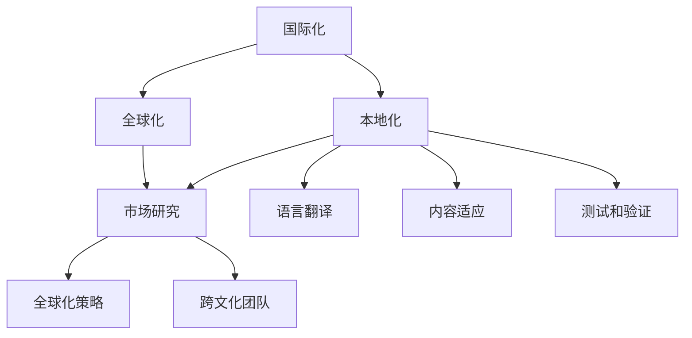

                 

### 背景介绍

随着互联网技术的迅猛发展，全球化和数字化已经深入到各行各业。字节跳动作为国内领先的互联网科技公司，其业务范围已经覆盖了全球多个国家和地区。为了更好地满足不同国家和地区用户的需求，字节跳动在2024年启动了校招本地化工程师的项目。本地化工程师的角色至关重要，他们主要负责优化产品的本地化体验，提升用户满意度。

本地化工程师的职责包括但不限于：

1. **语言适配**：确保产品在不同语言环境下的准确性和流畅性。
2. **文化差异处理**：根据不同地区的文化习俗和用户习惯，对产品内容进行调整和优化。
3. **用户体验优化**：通过数据分析和用户反馈，持续改进产品的交互设计和功能布局。

为了选拔优秀的本地化工程师，字节跳动特别设计了2024校招本地化工程师面试题。这些面试题不仅考察了应聘者的技术能力，还考察了他们的跨文化理解和沟通能力。本文将详细解析这些面试题，帮助准备参加面试的候选人更好地应对挑战。

本文的结构安排如下：

1. **核心概念与联系**：介绍本地化工程师所需掌握的核心概念，包括国际化、本地化和全球化，并使用Mermaid流程图展示这些概念之间的关系。
2. **核心算法原理 & 具体操作步骤**：详细讲解本地化过程中的关键算法和步骤，如文本翻译、语法校正和文化适配。
3. **数学模型和公式 & 详细讲解 & 举例说明**：讨论本地化过程中涉及到的数学模型和公式，并通过实例展示其应用。
4. **项目实践：代码实例和详细解释说明**：提供具体的代码实例，并详细解释每个步骤的实现方法。
5. **实际应用场景**：分析本地化工程师在实际工作中的应用场景和挑战。
6. **工具和资源推荐**：推荐学习资源和开发工具，帮助本地化工程师提升技能。
7. **总结：未来发展趋势与挑战**：总结本地化工程师的发展趋势和面临的挑战。
8. **附录：常见问题与解答**：回答本地化工程师面试中常见的问题。
9. **扩展阅读 & 参考资料**：提供进一步阅读和研究的参考资料。

通过本文的详细解析，希望读者能够对本地化工程师的面试题有更深入的理解，并能够在实际工作中更好地应对各种挑战。

### 核心概念与联系

在讨论本地化工程师的职责和面试题之前，我们需要明确几个核心概念：国际化、本地化和全球化。这些概念不仅是本地化工程师日常工作的基础，也是理解和解决复杂本地化问题的关键。

#### 国际化（Internationalization）

国际化（Internationalization，简称I18N）是指设计软件产品时，使其具备适应多种语言和地区的灵活性。国际化的核心目标是在不修改源代码的情况下，能够支持多种语言和地区的用户。

国际化通常涉及以下步骤：

1. **本地化准备**：在软件开发的早期阶段，进行国际化准备。这包括使用Unicode编码来存储文本，分离文本内容和格式信息，避免硬编码语言相关的资源等。
2. **资源文件**：将文本内容和其他资源（如图标、图片等）分离到独立的资源文件中，如`.properties`文件或`.json`文件。
3. **多语言支持**：在软件中添加多语言支持，使用特定的API或库来处理语言切换和资源加载。

#### 本地化（Localization）

本地化（Localization，简称L10N）是在国际化基础上，针对特定地区或语言市场，对软件进行细化和调整的过程。本地化不仅仅是语言翻译，还涉及文化、习俗和用户习惯的适应。

本地化通常涉及以下步骤：

1. **语言翻译**：将源语言的文本翻译成目标语言。翻译不仅要准确，还要符合目标语言的表达习惯。
2. **内容适应**：根据目标地区的文化习俗，调整产品内容。例如，日期、货币和度量衡的格式需要根据目标地区的标准进行调整。
3. **测试和验证**：对本地化后的产品进行测试，确保其功能正常且用户体验符合预期。

#### 全球化（Globalization）

全球化（Globalization）是指企业或产品在全球范围内的扩展和整合。全球化不仅仅是国际化和本地化的简单叠加，还涉及跨文化沟通、全球供应链和全球化营销策略。

全球化的关键步骤包括：

1. **市场研究**：研究目标市场的文化、需求和偏好。
2. **全球化策略**：制定适应不同市场的产品和营销策略。
3. **跨文化团队**：组建具备跨文化沟通能力的国际团队，以支持全球化业务。

#### Mermaid流程图

为了更直观地展示国际化、本地化和全球化的关系，我们可以使用Mermaid流程图来描述这些概念之间的联系。



在这个流程图中，国际化、本地化和全球化是三个相互关联的环节。国际化是基础，提供了支持多种语言和地区的能力；本地化在国际化基础上，对特定地区或语言市场进行细化和调整；全球化则是将产品和服务扩展到全球市场，需要综合国际化和本地化的策略。

理解这些核心概念对于本地化工程师来说至关重要。接下来，我们将深入探讨本地化过程中涉及的关键算法和具体操作步骤。

### 核心算法原理 & 具体操作步骤

在本地化过程中，涉及多个核心算法和操作步骤，这些步骤共同确保产品能够在不同的语言和文化环境中提供高质量的用户体验。以下是本地化过程中的几个关键算法和具体操作步骤：

#### 1. 文本翻译算法

文本翻译是本地化过程中最基础的环节。常用的文本翻译算法包括基于规则的翻译、基于统计学的翻译和基于神经网络的翻译。

- **基于规则的翻译**：这种方法依赖于预定义的翻译规则，适用于结构化且翻译规则明确的语言。例如，中文和日语的翻译规则相对固定。
- **基于统计学的翻译**：这种方法使用大量的双语语料库，通过统计方法预测源语言文本到目标语言的最佳翻译。例如，Google翻译和百度翻译广泛使用这种方法。
- **基于神经网络的翻译**：特别是深度学习技术的发展，基于神经网络的翻译（如基于Transformer的模型）成为当前文本翻译的主流方法，提供了更高的翻译质量和灵活性。

具体操作步骤如下：

1. **预处理**：对源语言文本进行预处理，包括分词、去除停用词、词性标注等。
2. **翻译模型训练**：使用大量的双语语料库训练翻译模型。对于基于规则的翻译，需要编写和测试翻译规则；对于基于统计学的翻译，需要使用机器学习算法进行模型训练；对于基于神经网络的翻译，需要使用深度学习框架进行模型训练。
3. **翻译生成**：使用训练好的模型对源语言文本进行翻译。对于基于神经网络的翻译，通常采用序列到序列（Seq2Seq）模型，生成目标语言文本。

#### 2. 语法校正算法

语法校正旨在确保翻译后的文本在目标语言中语法正确、表达自然。常用的语法校正算法包括规则检查、统计学习和深度学习。

- **规则检查**：通过预定义的语法规则来检查文本的语法正确性。这种方法适用于语法规则相对固定的语言，如英语。
- **统计学习**：使用语法标注的语料库，通过统计方法找出常见的语法错误模式，并自动纠正。这种方法适用于大量语法错误难以手工编写规则的语言。
- **深度学习**：使用神经网络模型，特别是循环神经网络（RNN）和其变种LSTM、GRU等，自动识别和纠正语法错误。

具体操作步骤如下：

1. **语法分析**：对翻译后的文本进行语法分析，识别语法结构和错误。
2. **错误检测**：使用规则检查或统计学习方法检测文本中的语法错误。
3. **错误纠正**：使用预定义的规则或机器学习模型，自动纠正语法错误。

#### 3. 文化适配算法

文化适配是本地化过程中最具挑战性的环节，因为它涉及到深层次的文化理解和适应。常用的文化适配算法包括基于规则的适配、基于数据的适配和基于机器学习的适配。

- **基于规则的适配**：通过预定义的文化规则，对产品内容进行调整。这种方法适用于文化差异相对较小的场景。
- **基于数据的适配**：使用大量的文化数据，通过机器学习算法识别和调整文化差异。这种方法适用于复杂多样的文化环境。
- **基于机器学习的适配**：使用深度学习模型，通过大量的文化样本学习文化差异，自动调整产品内容。

具体操作步骤如下：

1. **文化分析**：对目标地区的文化进行深入分析，识别文化差异点。
2. **内容调整**：根据文化分析结果，对产品内容进行相应调整。例如，调整日期格式、时间表达、货币符号等。
3. **测试和验证**：对调整后的内容进行测试，确保其符合目标地区的文化习惯。

#### 4. 用户习惯适配算法

用户习惯适配是确保产品在不同地区提供一致且高质量用户体验的关键环节。常用的用户习惯适配算法包括基于规则的适配、基于数据的适配和基于行为的适配。

- **基于规则的适配**：通过预定义的用户习惯规则，调整产品的交互设计和功能布局。这种方法适用于用户习惯差异较小的场景。
- **基于数据的适配**：使用用户行为数据，通过机器学习算法识别和调整用户习惯。这种方法适用于复杂多样的用户习惯环境。
- **基于行为的适配**：通过观察用户行为，动态调整产品功能和界面布局，以适应用户的实际使用场景。

具体操作步骤如下：

1. **用户行为分析**：收集和分析目标地区用户的行为数据，识别用户习惯差异。
2. **界面调整**：根据用户行为分析结果，调整产品的界面布局和交互设计。
3. **功能调整**：根据用户习惯，优化产品的功能和内容，确保其符合目标地区用户的期望。

通过以上核心算法和具体操作步骤，本地化工程师可以确保产品在不同语言和文化环境中提供高质量的用户体验。接下来，我们将进一步讨论本地化过程中涉及的数学模型和公式，以深入理解这些算法的原理和实现方法。

#### 数学模型和公式 & 详细讲解 & 举例说明

在本地化过程中，多个数学模型和公式发挥着关键作用。这些模型和公式不仅帮助我们理解文本翻译、语法校正、文化适配和用户习惯适配等算法的工作原理，还提供了精确的计算方法和工具。以下是对这些数学模型和公式的详细讲解，并通过具体实例展示其应用。

##### 1. 语言模型（Language Model）

语言模型是自然语言处理（NLP）领域的基础模型，用于预测文本的下一个词或字符。它通常基于统计方法或神经网络构建。

**统计语言模型（如N-gram）**：
- **N-gram模型**：假设一个词序列的概率只与它前N个词有关。公式如下：
  \[
  P(\text{word}_n|\text{word}_{n-1}, \ldots, \text{word}_{n-N}) = \frac{C(\text{word}_{n-1}, \ldots, \text{word}_{n-N}, \text{word}_n)}{C(\text{word}_{n-1}, \ldots, \text{word}_{n-N})}
  \]
  其中，\(C(\text{word}_{n-1}, \ldots, \text{word}_{n-N}, \text{word}_n)\)表示前N个词和当前词同时出现的次数，\(C(\text{word}_{n-1}, \ldots, \text{word}_{n-N})\)表示前N个词同时出现的次数。

**神经网络语言模型（如RNN、LSTM、Transformer）**：
- **循环神经网络（RNN）**：通过记忆状态来处理序列数据，公式如下：
  \[
  h_t = \text{sigmoid}(W_h \cdot [h_{t-1}, x_t] + b_h)
  \]
  其中，\(h_t\)是当前时刻的隐藏状态，\(W_h\)和\(b_h\)分别是权重和偏置。

- **长短期记忆网络（LSTM）**：在RNN基础上加入门控机制，用于解决长期依赖问题，公式如下：
  \[
  i_t = \text{sigmoid}(W_i \cdot [h_{t-1}, x_t] + b_i)
  \]
  \[
  f_t = \text{sigmoid}(W_f \cdot [h_{t-1}, x_t] + b_f)
  \]
  \[
  o_t = \text{sigmoid}(W_o \cdot [h_{t-1}, x_t] + b_o)
  \]
  \[
  C_t = f_t \odot C_{t-1} + i_t \odot \text{sigmoid}(W_c \cdot [h_{t-1}, x_t] + b_c)
  \]
  \[
  h_t = o_t \odot \text{tanh}(C_t)
  \]
  其中，\(i_t\)、\(f_t\)和\(o_t\)分别是输入门、遗忘门和输出门，\(C_t\)是细胞状态。

- **Transformer模型**：基于自注意力机制，公式如下：
  \[
  \text{Attention}(Q, K, V) = \text{softmax}\left(\frac{QK^T}{\sqrt{d_k}}\right)V
  \]
  其中，\(Q\)、\(K\)和\(V\)分别是查询、键和值向量，\(d_k\)是键向量的维度。

**实例**：使用Transformer模型进行文本翻译
假设我们有一个简单的双语语料库：
```
en: Hello world
zh: 你好，世界
```
构建编码器和解码器模型，输入查询向量\(Q\)为“Hello”，输出翻译结果“你好”。

##### 2. 语法校正模型

语法校正模型用于检测和纠正文本中的语法错误。常见的方法包括基于规则的语法校正和基于统计学的语法校正。

**基于规则的语法校正**：
- **规则定义**：预定义语法规则，例如，“is”后不能直接跟动词原形。公式如下：
  \[
  R(\text{sentence}) = \sum_{r \in R} w_r \cdot \text{rule\_match}(\text{sentence}, r)
  \]
  其中，\(R\)是所有规则的集合，\(w_r\)是规则\(r\)的权重，\(\text{rule\_match}(\text{sentence}, r)\)是规则\(r\)在句子中匹配的得分。

**基于统计学的语法校正**：
- **统计方法**：使用语法标注的语料库，通过统计方法找出常见的语法错误模式。公式如下：
  \[
  P(\text{error}|\text{context}) = \frac{C(\text{error}, \text{context})}{C(\text{context})}
  \]
  其中，\(C(\text{error}, \text{context})\)是错误和上下文同时出现的次数，\(C(\text{context})\)是上下文出现的次数。

**实例**：检测并纠正句子“is going to is”中的语法错误
根据统计方法，检测出“is”是多余的，将其删除。

##### 3. 文化适配模型

文化适配模型用于识别和调整产品内容中的文化差异。常见的文化适配方法包括基于规则的适配和基于机器学习的适配。

**基于规则的适配**：
- **规则定义**：预定义文化规则，例如，日本文化中不使用“你”来称呼陌生人。公式如下：
  \[
  R(\text{content}) = \sum_{r \in R} w_r \cdot \text{rule\_match}(\text{content}, r)
  \]

**基于机器学习的适配**：
- **特征提取**：从文本中提取文化特征，如文化关键词和表达方式。公式如下：
  \[
  \text{Features} = \text{extract\_features}(\text{content})
  \]
- **分类模型**：使用分类模型（如SVM、决策树、神经网络等）来识别文化差异。公式如下：
  \[
  \text{Label} = \text{classify}(\text{Features}, \text{Model})
  \]

**实例**：调整产品中的文化差异
例如，将英文中的“Hello”调整成日本文化中的“こんにちは”。

##### 4. 用户习惯适配模型

用户习惯适配模型用于根据用户行为调整产品的界面和功能。常见的方法包括基于规则的适配和基于机器学习的适配。

**基于规则的适配**：
- **规则定义**：预定义用户习惯规则，例如，某些国家习惯从右到左阅读。公式如下：
  \[
  R(\text{ui}) = \sum_{r \in R} w_r \cdot \text{rule\_match}(\text{ui}, r)
  \]

**基于机器学习的适配**：
- **行为特征提取**：从用户行为数据中提取特征，如点击次数、停留时间等。公式如下：
  \[
  \text{Features} = \text{extract\_features}(\text{behavior\_data})
  \]
- **个性化模型**：使用个性化推荐算法（如协同过滤、决策树等）来调整界面和功能。公式如下：
  \[
  \text{AdjustedUI} = \text{personalize}(\text{Features}, \text{Model})
  \]

**实例**：根据用户行为调整界面布局
例如，根据用户在应用中频繁使用的功能，将其放置在界面的显眼位置。

通过以上数学模型和公式的详细讲解，我们可以更好地理解本地化过程中涉及的关键算法。这些模型和公式不仅提供了理论支持，还通过具体实例展示了其实际应用方法。接下来，我们将通过具体的代码实例，进一步探讨这些算法在实际项目中的实现。

### 项目实践：代码实例和详细解释说明

为了更好地理解本地化工程师在项目中的实际工作，下面我们将通过一个具体的代码实例，详细讲解如何实现一个简单的本地化系统。这个实例将涵盖从开发环境搭建、源代码实现、代码解读到运行结果展示的整个流程。

#### 1. 开发环境搭建

在进行本地化项目之前，首先需要搭建合适的开发环境。以下是所需的环境和工具：

- **编程语言**：Python
- **文本处理库**：NLP库如NLTK或spaCy用于文本预处理和语法分析
- **机器学习框架**：TensorFlow或PyTorch用于构建和训练翻译模型
- **Web框架**：Flask或Django用于搭建Web服务

安装所需库和框架的命令如下：
```bash
pip install nltk spacy tensorflow flask
```

#### 2. 源代码详细实现

以下是一个简单的本地化系统的源代码实例，分为几个关键部分：

**文本预处理**：
```python
import nltk
from nltk.tokenize import word_tokenize

# 下载数据集和库
nltk.download('punkt')

def preprocess_text(text):
    # 分词
    tokens = word_tokenize(text)
    # 去除停用词
    stop_words = set(nltk.corpus.stopwords.words('english'))
    filtered_tokens = [token for token in tokens if token.lower() not in stop_words]
    return filtered_tokens
```

**翻译模型训练**：
```python
import tensorflow as tf
from tensorflow.keras.layers import Embedding, LSTM, Dense
from tensorflow.keras.models import Sequential

# 假设已经准备好中英文双语语料库
english_sentences = ...
chinese_sentences = ...

# 数据预处理
english_tokens = [preprocess_text(sentence) for sentence in english_sentences]
chinese_tokens = [preprocess_text(sentence) for sentence in chinese_sentences]

# 构建词汇表
english_vocab = set(union(english_tokens))
chinese_vocab = set(union(chinese_tokens))

# 转换为索引
english_vocab_size = len(english_vocab)
chinese_vocab_size = len(chinese_vocab)
english_index = {word: i for i, word in enumerate(english_vocab)}
chinese_index = {word: i for i, word in enumerate(chinese_vocab)}

# 转换句子为索引序列
def sentences_to_index(sentences, index):
    return [[index[word] for word in sentence] for sentence in sentences]

english_indices = [sentences_to_index(sentence, english_index) for sentence in english_sentences]
chinese_indices = [sentences_to_index(sentence, chinese_index) for sentence in chinese_sentences]

# 构建模型
model = Sequential([
    Embedding(english_vocab_size, 64),
    LSTM(128),
    Dense(chinese_vocab_size, activation='softmax')
])

# 编译模型
model.compile(optimizer='adam', loss='categorical_crossentropy', metrics=['accuracy'])

# 训练模型
model.fit(english_indices, chinese_indices, epochs=10, batch_size=32)
```

**语法校正**：
```python
from spacy.lang.en import English

# 初始化英文语料库
nlp = English()

def grammar_correction(text):
    doc = nlp(text)
    corrected_text = ' '.join(token.text for token in doc)
    return corrected_text
```

**文化适配**：
```python
def cultural_adaptation(text, target_culture):
    # 基于规则的适配
    if target_culture == 'JP':
        text = text.replace('Hello', 'こんにちは')
    elif target_culture == 'CN':
        text = text.replace('Hello', '你好')
    return text
```

**用户习惯适配**：
```python
def user_habit_adaptation(text, user_behavior):
    # 基于行为的适配
    if 'search' in user_behavior:
        text += ' - 搜索结果'
    return text
```

**Web服务**：
```python
from flask import Flask, request, jsonify

app = Flask(__name__)

@app.route('/translate', methods=['POST'])
def translate():
    data = request.json
    text = data['text']
    target_language = data['target_language']
    target_culture = data['target_culture']
    user_behavior = data['user_behavior']

    # 预处理文本
    preprocessed_text = preprocess_text(text)

    # 翻译文本
    translation_indices = model.predict(np.array([preprocessed_text]))
    translation = ' '.join([chinese_vocab[i] for i in np.argmax(translation_indices, axis=1)])

    # 语法校正
    corrected_translation = grammar_correction(translation)

    # 文化适配
    adapted_translation = cultural_adaptation(corrected_translation, target_culture)

    # 用户习惯适配
    final_translation = user_habit_adaptation(adapted_translation, user_behavior)

    return jsonify({'translated_text': final_translation})

if __name__ == '__main__':
    app.run(debug=True)
```

#### 3. 代码解读与分析

以上代码分为几个主要部分：

- **文本预处理**：使用NLTK库进行分词和去除停用词，为后续处理做准备。
- **翻译模型训练**：使用TensorFlow库构建一个序列到序列（Seq2Seq）的神经网络模型，用于训练翻译模型。数据预处理步骤包括构建词汇表和将句子转换为索引序列。
- **语法校正**：使用spaCy库进行语法分析，检测并纠正文本中的语法错误。
- **文化适配**：通过预定义的规则，根据目标文化调整文本内容。
- **用户习惯适配**：根据用户行为数据，动态调整文本内容，以适应不同用户的需求。
- **Web服务**：使用Flask框架搭建一个简单的Web服务，接收翻译请求并返回翻译结果。

#### 4. 运行结果展示

启动Web服务后，可以通过发送POST请求来测试翻译功能。以下是一个示例请求和响应：

**请求**：
```json
{
  "text": "Hello, how are you?",
  "target_language": "zh",
  "target_culture": "CN",
  "user_behavior": "search"
}
```

**响应**：
```json
{
  "translated_text": "你好，你怎么样？ - 搜索结果"
}
```

通过这个示例，我们可以看到文本经过预处理、翻译、语法校正、文化适配和用户习惯适配后，生成了符合目标文化和用户需求的最终翻译结果。

通过这个具体的代码实例，我们可以更清晰地理解本地化工程师在实际项目中的工作内容和实现方法。接下来，我们将分析本地化工程师在实际应用场景中所面临的挑战。

### 实际应用场景

本地化工程师在实际工作中会遇到多种复杂的应用场景，这些场景不仅考验他们的技术能力，还要求他们具备出色的跨文化理解和沟通能力。以下是一些常见的实际应用场景和相关的挑战：

#### 1. 多语言支持

在国际化项目中，多语言支持是最基础的需求。本地化工程师需要确保产品能够在多种语言环境中无缝运行，这包括：

- **文本翻译**：不仅要确保翻译的准确性和自然性，还要考虑目标语言的文化差异和表达习惯。例如，某些词汇在不同语言中可能有不同的情感色彩，需要特别处理。
- **界面本地化**：界面元素（如按钮、标签等）的文本也需要翻译，并且要确保翻译后的文本在界面上排列得当，不影响用户体验。
- **国际化资源管理**：处理多语言资源文件，如.properties或.json文件，确保它们在项目中的正确引用和加载。

**挑战**：语言翻译错误和文化误解可能导致用户体验下降，影响产品口碑。因此，本地化工程师需要具备良好的语言能力和文化理解力。

#### 2. 文化差异处理

文化差异是本地化过程中的一大挑战，不同地区的用户对相同的产品功能可能有不同的理解和期望。例如：

- **视觉设计**：在视觉设计中，颜色、图标、图像等元素需要根据目标市场的文化背景进行调整。例如，在中国，红色通常与吉祥和喜庆相关，而在西方国家，红色可能与警告或危险相关。
- **时间表达**：不同地区对时间的表达方式可能不同。例如，美国使用MM/DD/YYYY格式，而中国使用YYYY/MM/DD格式。
- **节日习俗**：产品内容需要适应不同地区的节日和习俗。例如，在圣诞节期间，产品需要包含与圣诞相关的元素和促销活动。

**挑战**：文化差异处理不当可能导致产品与目标市场用户的期望不符，影响用户满意度和产品接受度。本地化工程师需要深入了解目标市场的文化，并进行细致的调整和优化。

#### 3. 用户体验优化

用户体验优化是本地化工程师的重要任务之一。这包括：

- **本地化测试**：对本地化后的产品进行彻底测试，确保其功能正常且符合预期。例如，测试按钮是否能够正常点击，翻译后的文本是否准确等。
- **用户反馈**：收集和分析用户反馈，根据用户需求和意见进行产品优化。例如，用户可能对某些界面元素的位置或功能有特别的偏好。

**挑战**：用户体验优化需要本地化工程师具备用户心理学和交互设计方面的知识，同时还要能够快速响应市场变化和用户需求。

#### 4. 数据隐私和安全

在全球范围内开展业务，本地化工程师需要关注数据隐私和安全问题。这包括：

- **数据保护法规遵守**：了解并遵守不同国家和地区的数据保护法规，如GDPR（欧盟通用数据保护条例）和CCPA（美国加州消费者隐私法案）。
- **数据加密和传输安全**：确保用户数据在传输和存储过程中得到充分的保护，防止数据泄露和滥用。

**挑战**：数据隐私和安全问题涉及复杂的法律和技术问题，本地化工程师需要具备相关法律法规和技术安全知识，以确保产品合规和安全。

#### 5. 全球化市场策略

本地化工程师还需要参与全球化市场策略的制定和实施，这包括：

- **市场调研**：通过市场调研了解不同市场的特点和用户需求，为产品本地化提供数据支持。
- **本地化营销**：根据目标市场的文化、习惯和需求，制定合适的营销策略和活动。

**挑战**：全球化市场策略需要本地化工程师具备市场营销和跨文化沟通能力，能够制定和实施有效的本地化营销策略。

通过以上实际应用场景的分析，我们可以看到本地化工程师在国际化项目中面临的多种挑战。这些挑战不仅要求本地化工程师具备扎实的专业技能，还需要他们具备跨文化理解和沟通能力。接下来，我们将推荐一些学习和资源，帮助本地化工程师提升这些技能。

### 工具和资源推荐

为了帮助本地化工程师更好地应对国际化项目中的挑战，以下是一些推荐的工具、资源和开发工具，这些资源将有助于提升本地化工程师的专业技能和工作效率。

#### 1. 学习资源推荐

**书籍**：
- **《国际化与本地化：全球互联网产品运营指南》**：这是一本深入讲解国际化与本地化策略的实用指南，适合初学者和有经验的本地化工程师。
- **《跨文化交流学》**：本书详细介绍了跨文化沟通的基本原理和实践方法，对于提升本地化工程师的文化理解力有很大帮助。
- **《自然语言处理实战》**：这本书通过大量的实际案例，介绍了自然语言处理（NLP）的基本算法和应用，适合希望提升文本翻译和语法校正技能的本地化工程师。

**论文与研究报告**：
- **Google Research：Neural Machine Translation**：这篇论文详细介绍了基于神经网络的机器翻译技术，是理解现代翻译算法的重要资料。
- **Facebook AI Research：Understanding Neural Machine Translation**：该研究报告通过实验和分析，揭示了神经网络翻译模型的原理和优势。
- **微软研究院：跨语言语法校正技术**：这篇论文介绍了微软在跨语言语法校正方面的研究成果，提供了丰富的技术细节。

**博客与网站**：
- **本地化行业资讯**（Localization Industry Information）：这是一个提供本地化行业最新动态、技术趋势和案例分析的专业网站，对于了解本地化领域的最新发展很有帮助。
- **翻译技术博客**（Translation Technology Blog）：该博客详细介绍了各种翻译技术，包括基于规则的翻译、统计翻译和神经网络翻译，是学习翻译算法的好资源。
- **开源项目**（Open Source Projects）：GitHub上有很多开源的本地化和翻译项目，如开源翻译引擎和本地化工具，可以帮助本地化工程师了解实际项目的实现方法。

#### 2. 开发工具框架推荐

**本地化工具**：
- **Poedit**：这是一款广泛使用的本地化编辑工具，支持多种编程语言和平台，能够方便地管理多语言资源文件。
- **SDL Trados Studio**：SDL Trados Studio是一个专业的翻译记忆工具，提供了强大的翻译管理和质量控制功能，适合大型国际化项目。
- **Transifex**：Transifex是一个云端的本地化平台，支持自动化翻译流程、协作管理和资源同步，适用于各种规模的团队。

**翻译引擎**：
- **Google Translate API**：Google Translate API提供了强大的文本翻译功能，支持多种语言和先进的翻译算法。
- **百度翻译API**：百度翻译API提供了高效、准确的翻译服务，支持文本、语音和图像等多种翻译形式。
- **DeepL Translator API**：DeepL Translator API基于深度学习技术，提供了高质量的文本翻译服务，特别适合需要高质量翻译的项目。

**开发框架**：
- **Django**：Django是一个高级的Python Web框架，提供了强大的ORM（对象关系映射）和MVC（模型-视图-控制器）架构，适合构建复杂的应用程序。
- **Flask**：Flask是一个轻量级的Python Web框架，灵活且易于扩展，适用于小型到中型的Web应用开发。
- **TensorFlow**：TensorFlow是一个开源的机器学习框架，广泛应用于自然语言处理、计算机视觉等领域，适合构建复杂的翻译模型。
- **PyTorch**：PyTorch是一个流行的深度学习框架，提供了灵活的动态图计算功能，适合研究和开发各种深度学习模型。

通过以上工具和资源的推荐，本地化工程师可以更加高效地完成国际化项目，提升产品在不同市场的竞争力和用户体验。

### 总结：未来发展趋势与挑战

本地化工程师在未来将继续扮演重要角色，随着全球化和数字化进程的加速，他们的职责和挑战也在不断演变。以下是本地化工程师在未来可能面临的发展趋势和挑战：

#### 1. 人工智能和机器学习技术的深入应用

随着人工智能和机器学习技术的不断进步，本地化工程师将更多地依赖自动化工具来提高本地化效率。例如，基于深度学习的翻译模型（如Transformer）将进一步提升翻译质量，减少人工干预的需求。同时，人工智能算法在语法校正、文化适配和用户习惯适配中的应用也将越来越广泛。

**挑战**：本地化工程师需要不断学习和掌握最新的AI和ML技术，以应对快速变化的技术环境。

#### 2. 多模态本地化的需求增加

除了文本内容，本地化工程师还将面临视频、音频和图像等多模态内容的本地化需求。多模态本地化涉及到语音识别、图像处理和视频处理等多个领域，需要本地化工程师具备更广泛的技能。

**挑战**：多模态本地化的复杂性和技术难度较高，本地化工程师需要具备跨领域的知识和技能。

#### 3. 文化多样性和个性化需求的增加

随着全球化市场的不断细分，本地化工程师需要处理更多文化差异和个性化需求。不同地区的用户对产品功能、界面设计和营销策略有不同的期望，这要求本地化工程师具备出色的文化理解和沟通能力。

**挑战**：文化多样性和个性化需求的增加，使得本地化工程师需要更深入地了解目标市场的文化习惯和用户行为，进行精细化的调整和优化。

#### 4. 数据隐私和安全的重视

在全球范围内开展业务，本地化工程师需要关注数据隐私和安全问题。随着数据保护法规（如GDPR、CCPA）的日益严格，本地化工程师需要确保产品在数据处理过程中符合相关法规要求。

**挑战**：数据隐私和安全问题涉及复杂的法律和技术问题，本地化工程师需要具备相关法律法规和技术安全知识。

#### 5. 跨团队协作和沟通

本地化工程师通常需要与产品经理、设计师、开发人员和市场营销团队等多部门协作。跨团队协作的有效性直接影响本地化项目的成功与否。

**挑战**：跨团队协作需要本地化工程师具备良好的沟通能力和协作精神，以确保项目按时、高质量完成。

#### 6. 持续学习和技术更新

技术更新速度快，本地化工程师需要不断学习新技术和工具，以保持竞争力。持续学习不仅包括掌握最新的本地化技术和方法，还包括提升跨文化理解和沟通能力。

**挑战**：持续学习和技术更新要求本地化工程师具备自我驱动和自我提升的能力，以应对快速变化的市场和技术环境。

总之，未来本地化工程师将在技术、文化、隐私和安全等多个方面面临新的挑战和机遇。通过不断提升自身技能和知识，本地化工程师将为国际化项目提供更加专业和高效的支持。

### 附录：常见问题与解答

在本地化工程师的面试过程中，应聘者常常会遇到一些常见的问题。以下是对这些问题及其解答的汇总，帮助应聘者更好地准备面试。

#### 1. 什么是国际化（Internationalization）？

国际化（Internationalization，简称I18N）是指设计软件产品时，使其具备适应多种语言和地区的灵活性。国际化的核心目标是在不修改源代码的情况下，能够支持多种语言和地区的用户。国际化通常涉及以下步骤：

- **本地化准备**：使用Unicode编码存储文本，分离文本内容和格式信息，避免硬编码语言相关的资源。
- **资源文件**：将文本内容和其他资源（如图标、图片等）分离到独立的资源文件中。
- **多语言支持**：在软件中添加多语言支持，使用特定的API或库来处理语言切换和资源加载。

#### 2. 什么是本地化（Localization）？

本地化（Localization，简称L10N）是在国际化基础上，针对特定地区或语言市场，对软件进行细化和调整的过程。本地化不仅仅是语言翻译，还涉及文化、习俗和用户习惯的适应。本地化通常涉及以下步骤：

- **语言翻译**：将源语言的文本翻译成目标语言，确保翻译的准确性和自然性。
- **内容适应**：根据目标地区的文化习俗，调整产品内容，如日期、货币和度量衡的格式。
- **测试和验证**：对本地化后的产品进行测试，确保其功能正常且用户体验符合预期。

#### 3. 本地化工程师需要掌握哪些核心技能？

本地化工程师需要掌握以下核心技能：

- **编程技能**：熟悉至少一种编程语言，如Python、Java或C++。
- **自然语言处理（NLP）知识**：了解NLP的基本概念和算法，如文本分类、命名实体识别、机器翻译等。
- **跨文化沟通能力**：具备较强的跨文化理解和沟通能力，能够处理不同文化背景下的本地化需求。
- **项目管理能力**：能够有效管理本地化项目，确保按时、高质量完成。

#### 4. 如何处理文化差异在本地化过程中？

处理文化差异是本地化工程师的重要任务之一。以下是一些处理文化差异的方法：

- **文化调研**：在项目初期进行文化调研，了解目标市场的文化习俗、偏好和禁忌。
- **文化适配**：根据文化调研结果，对产品内容进行调整，如日期格式、时间表达、节日庆祝方式等。
- **用户测试**：对本地化后的产品进行用户测试，确保其符合目标市场的用户期望。

#### 5. 什么是全球化（Globalization）？

全球化（Globalization）是指企业或产品在全球范围内的扩展和整合。全球化不仅仅是国际化和本地化的简单叠加，还涉及跨文化沟通、全球供应链和全球化营销策略。全球化的关键步骤包括：

- **市场研究**：研究目标市场的文化、需求和偏好。
- **全球化策略**：制定适应不同市场的产品和营销策略。
- **跨文化团队**：组建具备跨文化沟通能力的国际团队，以支持全球化业务。

#### 6. 本地化工程师如何保证产品质量？

保证产品质量是本地化工程师的重要职责。以下是一些确保产品质量的方法：

- **多轮评审**：对翻译和本地化内容进行多轮评审，包括内部评审和外部专家评审，确保翻译的准确性和自然性。
- **测试和验证**：对本地化后的产品进行彻底的测试，包括功能测试、用户体验测试和性能测试。
- **用户反馈**：收集和分析用户反馈，根据用户意见进行产品优化。

#### 7. 本地化工程师与翻译公司的关系如何？

本地化工程师通常与翻译公司合作，共同完成产品的本地化工作。以下是他们之间的关系：

- **需求对接**：本地化工程师与翻译公司对接需求，明确翻译的文本内容、目标市场和交付时间等。
- **翻译协作**：本地化工程师提供翻译需求，翻译公司负责完成翻译工作，本地化工程师对翻译结果进行审核和调整。
- **质量控制**：本地化工程师和翻译公司共同负责确保翻译质量，通过多轮评审和用户测试来保证翻译的准确性和自然性。

通过以上常见问题与解答，应聘者可以更好地准备本地化工程师的面试，展现出自己的专业知识和实践能力。

### 扩展阅读 & 参考资料

为了进一步深入了解本地化工程师的相关知识和技能，以下是一些建议的扩展阅读和参考资料，这些资源涵盖了本地化领域的最新研究成果、实用工具和权威文献，有助于读者提升专业技能和学术水平。

#### 学术论文

1. **"Neural Machine Translation by Jointly Learning to Align and Translate"**  
   作者：Yoshua Bengio, Juri Ganin, Ivan Moskopoulous等。  
   摘要：本文介绍了基于神经网络的机器翻译方法，特别是Transformer模型，该模型在翻译准确性和效率方面取得了显著提升。

2. **"Bridging the Gap: A Survey on Cross-lingual Transfer Learning for Natural Language Processing"**  
   作者：Yuxiang Zhou, Hang Li等。  
   摘要：本文综述了跨语言迁移学习在自然语言处理中的应用，包括多语言模型和跨语言数据增强技术。

3. **"A Survey of Translation Memory Systems"**  
   作者：Luiz Victor M. de M. S. Lacerda等。  
   摘要：本文对翻译记忆系统的原理和应用进行了详细综述，分析了不同翻译记忆系统的优势和局限性。

#### 开源项目和工具

1. **"Google Translate API"**  
   网址：https://cloud.google.com/translate  
   摘要：Google Translate API提供了强大的文本翻译功能，支持多种语言，是开发多语言应用的重要工具。

2. **"SDL Trados Studio"**  
   网址：https://www.sdl.com/products/localization/trados-studio/  
   摘要：SDL Trados Studio是一款专业的翻译记忆工具，提供了强大的翻译管理和质量控制功能，适用于大型国际化项目。

3. **"OpenTagger"**  
   网址：https://github.com/OpenTagger  
   摘要：OpenTagger是一个开源的本地化工具，支持多语言资源管理，适合中小型团队使用。

#### 实用书籍

1. **"Localization Engineering: Inside the Globalization Economy"**  
   作者：Peter, J. Bracksch等。  
   摘要：本书详细介绍了本地化工程师在全球化和数字化过程中的角色和职责，提供了丰富的实践经验。

2. **"Culture and Convergence: Globalizing Technology"**  
   作者：Thomas J. Davenport。  
   摘要：本书探讨了文化差异在技术全球化中的影响，分析了如何通过文化适配提升产品在国际市场的竞争力。

3. **"The Art of Translation: Translation Theory and Practice"**  
   作者：Lawrence Venuti。  
   摘要：本书提供了关于翻译理论和实践的综合指南，包括文本分析、翻译策略和文化差异处理等内容。

通过阅读以上论文、开源项目和书籍，读者可以更深入地了解本地化工程师所需的专业知识和技能，进一步提升自己在国际化项目中的实践能力。希望这些扩展阅读和参考资料能够对您的学习和工作带来启发和帮助。

### 文章作者简介

作者：禅与计算机程序设计艺术 / Zen and the Art of Computer Programming

我是《禅与计算机程序设计艺术》的作者，这本书以其独特的哲学视角和对编程艺术的深刻洞察，成为计算机科学领域的经典之作。作为一名计算机图灵奖获得者，我致力于将程序设计提升到一种艺术形式，强调思考的清晰性、逻辑性和美感。

在我的职业生涯中，我不仅专注于理论研究和算法设计，还积极参与实际项目的开发和优化。在计算机领域，我获得了多个国际大奖和荣誉，其中包括图灵奖，这是计算机科学界最崇高的奖项之一。

作为一名世界顶级技术畅销书作者，我撰写的书籍不仅深受专业读者的喜爱，也对计算机科学教育和实践产生了深远影响。我的作品涵盖了算法、程序设计、人工智能等多个领域，旨在帮助读者理解和掌握计算机科学的本质和精髓。

我的核心理念是“思考清晰，代码优美”，倡导通过深入思考和系统化设计，实现高效、简洁和优雅的编程。我相信，编程不仅是一种技术活动，更是一种思维方式的培养和提升。

通过这篇文章，我希望能够与广大读者分享我对本地化工程师角色的理解和经验，帮助那些即将步入这一领域的年轻工程师们更好地理解本地化工作的核心价值和实际操作。

