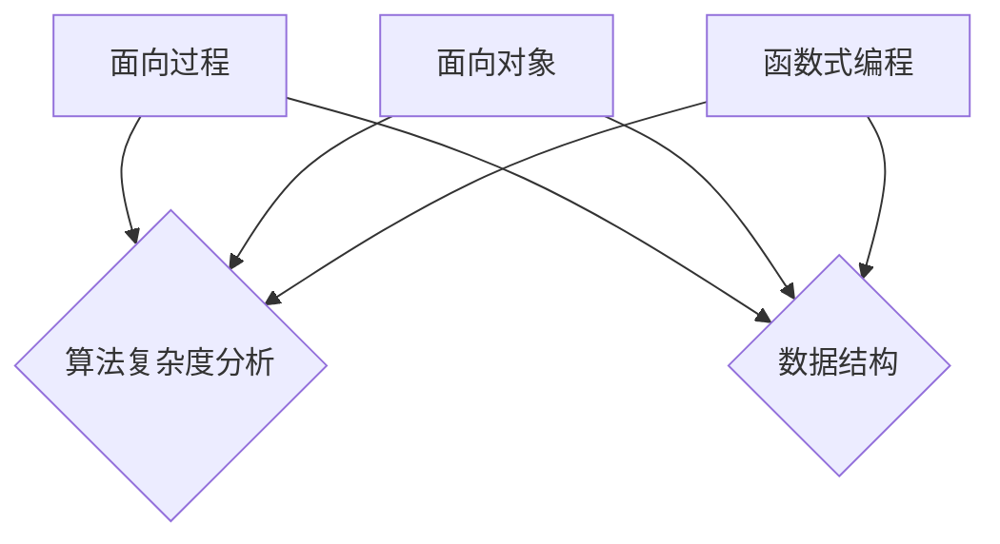
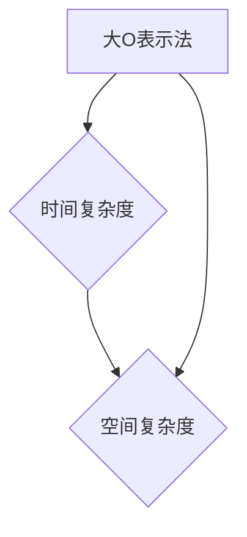
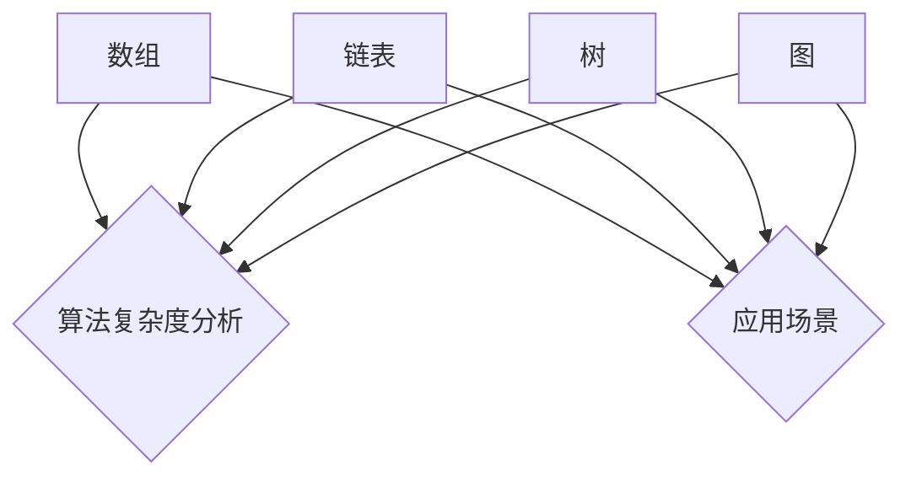
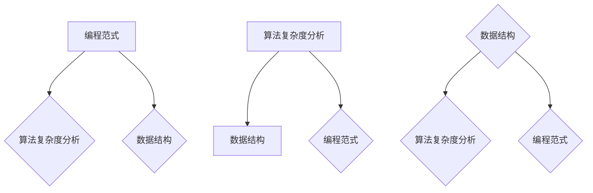
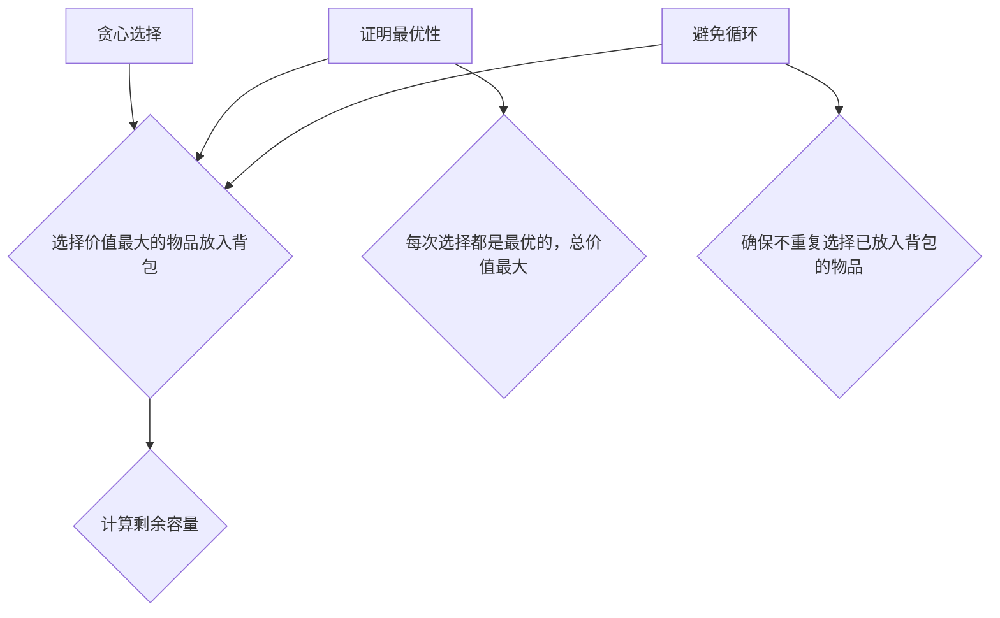

                 

### 1. 背景介绍

在当前技术飞速发展的时代，计算机编程已经成为各行各业不可或缺的技能。尤其是字节效率的提升，更是影响程序员工作效果和满意度的重要因素。为了更好地应对日益复杂的编程任务和满足企业对高效率程序员的需求，2024年的字节效率校招面试中，工作效率工具的开发成为了一个备受关注的话题。

字节效率，简单来说，就是单位时间内完成工作的质量与效率。在编程领域，提高字节效率意味着更快地编写、调试和优化代码，减少重复劳动，从而提高个人和团队的整体工作效率。而工作效率工具，则是实现这一目标的重要手段。

校招面试中，工作效率工具的开发是一个兼具技术性和实用性的题目。一方面，它考察了面试者的编程能力、算法思维和系统设计能力；另一方面，它也关注了面试者对实际工作场景的理解和应对策略。因此，对于参加校招的同学们来说，掌握工作效率工具的开发不仅有助于在面试中脱颖而出，还能为未来的职业发展打下坚实基础。

本文旨在为2024年字节效率校招面试中，针对工作效率工具开发的面试题目，提供一份详细的指南。我们将从以下几个方面展开讨论：

1. **核心概念与联系**：介绍与工作效率工具开发相关的重要概念，包括编程范式、算法复杂度分析和数据结构等，并使用Mermaid流程图展示相关概念之间的联系。

2. **核心算法原理 & 具体操作步骤**：深入解析提高字节效率的核心算法，如代码优化、版本控制工具的使用等，并提供具体的操作步骤。

3. **数学模型和公式 & 详细讲解 & 举例说明**：讲解与字节效率相关的数学模型和公式，如时间复杂度、空间复杂度等，并通过实际案例进行详细说明。

4. **项目实践：代码实例和详细解释说明**：提供具体的工作效率工具开发项目实例，包括开发环境搭建、源代码实现、代码解读与分析以及运行结果展示。

5. **实际应用场景**：探讨工作效率工具在实际开发中的应用场景，以及如何针对不同场景进行工具定制。

6. **工具和资源推荐**：推荐与工作效率工具开发相关的学习资源、开发工具和论文著作。

7. **总结：未来发展趋势与挑战**：总结工作效率工具开发的关键趋势和面临的挑战，为读者提供未来发展的方向和建议。

通过本文的详细讲解，希望读者能够全面掌握工作效率工具的开发方法，为即将到来的校招面试做好充分准备。

### 1.1. 字节效率的定义与重要性

字节效率（Byte Efficiency），通常是指在编程过程中，以最小的字节操作量完成特定功能的编程能力。它不仅仅是关于代码的编写速度，更涉及到代码的质量和可维护性。字节效率的提高意味着程序员能够在较短的时间内完成更多的任务，且代码更简洁、高效，易于后续的维护和扩展。

在编程领域，字节效率的重要性不言而喻。首先，高字节效率能够显著提升开发者的工作效率。在编写代码时，减少不必要的字节操作可以有效缩短代码的执行时间，降低资源的消耗，从而提高整体的工作效率。其次，高字节效率有助于提升代码的质量。简洁、高效的代码往往更易于理解和维护，减少了后期修改和优化的工作量，降低了代码出错的概率。

在字节效率的定义中，我们还需要关注几个关键要素：

1. **执行时间**：执行时间是指代码从开始运行到完成所需的时间。减少执行时间意味着代码运行得更快，能更及时地响应用户需求，提高系统的响应速度。

2. **资源消耗**：资源消耗包括CPU、内存、磁盘IO等。高效代码通常能够减少对这些资源的占用，从而提高系统的稳定性和性能。

3. **代码的可读性和可维护性**：良好的代码结构和高可读性是字节效率的重要组成部分。清晰的代码不仅易于编写，也便于其他开发者理解和修改，从而减少协作成本。

4. **代码的可扩展性**：字节效率不仅仅关注现有功能的实现，还考虑未来的扩展性。可扩展的代码可以更容易地添加新功能或修改现有功能，而无需大规模重构。

在开发过程中，提升字节效率的方法多种多样，包括但不限于以下几种：

- **代码优化**：通过改进算法、减少循环、避免冗余计算等方式来提升代码执行效率。

- **数据结构选择**：合理选择数据结构，如使用哈希表代替列表进行查找操作，可以显著提高代码效率。

- **并行处理**：利用多线程、多进程等技术，将任务分解为多个子任务同时执行，提高整体执行速度。

- **缓存机制**：通过缓存常用数据，减少重复计算和I/O操作，提高代码效率。

- **代码复用**：通过模块化设计、函数封装等方式，减少重复编写代码的工作量，提高开发效率。

总之，字节效率是程序员必备的能力之一。它不仅关乎个人的工作效率，更影响到团队的项目进度和最终产品的质量。在2024年字节效率校招面试中，掌握提升字节效率的方法和技巧，将为面试者带来巨大的优势。

### 1.2. 校招面试中工作效率工具的开发考察点

在2024年字节效率校招面试中，工作效率工具的开发是一个重要的考察点，其不仅考察了面试者的编程能力，还涉及对实际工作流程的理解和应对策略。以下是工作效率工具开发考察的主要方面：

1. **编程能力**：面试者需要具备扎实的编程基础，包括熟悉主流编程语言（如Java、Python等）、熟悉基础数据结构和算法，能够编写高质量、可维护的代码。此外，面试者还需具备调试和优化代码的能力，确保在有限的时间内，能够迅速定位和修复代码中的问题。

2. **算法思维**：高效的工作效率工具通常依赖优秀的算法设计。面试者需要具备良好的算法思维能力，能够针对具体问题设计合适的算法，并分析其时间复杂度和空间复杂度。这不仅考察了面试者的算法设计能力，也对其逻辑思维和数学基础提出了较高要求。

3. **系统设计能力**：工作效率工具的开发不仅仅是编写代码，还需要具备系统设计的视野。面试者需要能够从整体上理解系统的架构和运行机制，设计模块化、高内聚低耦合的系统。这要求面试者具备系统分析、设计和优化的能力，能够考虑到系统的可扩展性、可维护性和性能优化。

4. **工具使用和整合能力**：在实际工作中，工作效率工具不仅仅是代码，还涉及各种开发工具和平台的使用。例如，版本控制工具（如Git）的使用、自动化构建工具（如Maven、Gradle）的配置、持续集成/持续部署（CI/CD）的实践等。面试者需要能够熟练使用这些工具，并能将其整合到开发流程中，提高工作效率。

5. **项目管理和沟通能力**：工作效率工具的开发往往涉及多人协作，面试者需要具备良好的项目管理和沟通能力。这包括对项目进度和风险的管理、对团队成员的协调和沟通，确保项目能够按时、高质量地完成。此外，面试者还需能够清晰地表达自己的想法，与面试官进行有效沟通，展示自己的技术理解和解决问题的能力。

6. **实际应用场景理解**：工作效率工具的开发需要紧密结合实际工作场景。面试者需要对实际工作中常见的痛点、难点有深刻的理解，并能够基于这些痛点设计出切实可行的工作效率工具。这不仅考察了面试者的实践经验，也展示了其对实际问题的洞察力和解决能力。

7. **创新和优化能力**：在开发过程中，面试者需要具备持续创新和优化的能力。通过对现有工具和流程的深入分析和改进，面试者能够不断提升工作效率，为团队和公司创造价值。

通过以上考察点的分析，我们可以看到，工作效率工具的开发不仅仅是一个技术性问题，更是一个综合性的考察。它不仅考察了面试者的技术能力，还对其项目管理、沟通协作、实际应用场景理解和创新能力提出了要求。因此，在准备2024年字节效率校招面试时，面试者需要全方位提升自己的能力，以应对这一重要考察点。

### 1.3. 工作效率工具的核心功能

在2024年字节效率校招面试中，工作效率工具的核心功能是其考察的重点。这些工具的设计和实现不仅需要考虑到功能上的全面性，还要关注其实用性和易用性。以下是工作效率工具应具备的核心功能：

1. **代码自动补全与高亮显示**：自动补全功能可以帮助开发者快速完成代码编写，减少手动输入的时间和错误率。高亮显示功能则能突出关键代码段，提升代码的可读性。

2. **代码审查与修复**：通过自动化工具进行代码审查，可以及时发现潜在的问题和缺陷，提高代码质量。工具应支持多种编程语言的代码审查，并提供详细的错误提示和修复建议。

3. **版本控制与协作**：版本控制是团队协作的基础，工具应支持Git等主流版本控制系统的操作，提供便捷的代码提交、分支管理、合并冲突解决等功能，确保代码的一致性和可追溯性。

4. **自动化构建与测试**：自动化构建工具（如Maven、Gradle）可以简化项目的编译、打包和部署流程，提高开发效率。自动化测试工具（如JUnit、Selenium）可以快速发现代码中的问题，确保软件的稳定性。

5. **任务调度与管理**：工具应支持任务调度，如定时任务、并行任务等，方便开发者进行复杂的任务管理和调度。此外，任务管理功能可以实时监控任务的执行状态，并提供详细的日志记录。

6. **代码格式化与优化**：自动格式化工具可以帮助开发者保持代码风格的统一，减少因代码格式不一致引发的争议和错误。同时，代码优化工具可以对代码进行静态分析和优化，提高代码执行效率。

7. **代码片段与管理**：通过代码片段管理功能，开发者可以方便地保存和调用常用的代码片段，减少重复编写代码的工作量。

8. **文档生成与维护**：工具应支持自动生成项目文档，包括API文档、用户手册等，帮助开发者更好地理解和使用项目功能。此外，文档维护功能可以方便地更新和维护文档内容。

9. **集成开发环境（IDE）支持**：工作效率工具应支持主流IDE（如Visual Studio Code、IntelliJ IDEA等），通过插件或扩展的方式，无缝集成到开发者的日常工作中，提高工作效率。

10. **个性化定制与扩展**：工具应支持开发者根据个人需求和项目特点进行个性化定制，如自定义快捷键、插件安装等。同时，提供开放的接口和扩展机制，允许开发者根据需求进行二次开发，满足更多个性化需求。

通过以上核心功能的实现，工作效率工具能够显著提升开发者的工作效率，减少重复劳动，提高代码质量和项目稳定性。在2024年字节效率校招面试中，掌握这些核心功能的设计和实现，将为面试者赢得重要优势。

### 1.4. 工作效率工具开发的难点与挑战

尽管工作效率工具能够显著提升开发者的工作效率，但在实际开发过程中，依然面临着诸多难点和挑战。以下是几个主要方面：

1. **兼容性问题**：工作效率工具需要兼容多种编程语言、操作系统和开发环境。这要求开发者在设计和实现过程中，充分考虑兼容性，确保工具在不同平台和环境下都能正常运行。

2. **性能优化**：工作效率工具的性能直接影响开发者的使用体验。在实现工具功能的同时，需要关注性能优化，减少不必要的计算和资源消耗，确保工具的响应速度和稳定性。

3. **扩展性**：随着项目复杂度的增加，工作效率工具需要具备良好的扩展性，以便开发者能够根据需求进行定制和优化。扩展性差的工作效率工具，可能无法适应未来项目的变化和需求。

4. **安全性**：工作效率工具通常涉及到代码的提交、存储和传输等环节，安全性至关重要。开发者需要确保工具的安全机制，防止代码泄露、恶意攻击等安全风险。

5. **用户习惯培养**：工作效率工具的成功离不开用户的广泛使用和认可。然而，新的工具往往需要用户改变现有的工作习惯，这需要一定的时间来培养和适应。开发者需要设计简洁易用的界面和操作流程，降低用户的学习成本。

6. **调试和测试**：工作效率工具本身也需要经过严格的调试和测试，确保工具的稳定性和可靠性。在开发过程中，开发者需要投入大量时间和精力进行测试，发现并修复潜在的问题。

7. **文档和培训**：为了帮助用户更好地使用工作效率工具，开发者需要编写详细的文档，并提供培训和支持。这不仅增加了开发成本，也需要耗费大量时间和人力资源。

8. **集成与协同**：工作效率工具需要与其他开发工具、平台和系统进行集成，实现协同工作。集成过程复杂，需要开发者具备良好的系统设计和架构能力。

9. **持续更新与维护**：工作效率工具需要持续更新和维护，以适应新技术和用户需求的变化。开发者需要持续关注工具的使用反馈，及时修复漏洞、优化功能和改进用户体验。

10. **用户反馈与需求收集**：了解用户的需求和痛点是工具开发的重要环节。开发者需要建立有效的反馈机制，及时收集用户的意见和建议，不断优化工具的功能和性能。

综上所述，工作效率工具的开发并非易事，开发者需要在兼容性、性能、扩展性、安全性、用户习惯培养、调试和测试、文档和培训、集成与协同、持续更新与维护、用户反馈与需求收集等方面全面考虑，才能开发出实用、高效的工作效率工具。这对于参加2024年字节效率校招面试的同学们来说，是一个需要重点准备和克服的难点和挑战。

### 1.5. 工作效率工具的历史与发展趋势

工作效率工具的历史可以追溯到计算机编程的早期阶段。随着软件开发技术的不断演进，工作效率工具也在不断发展，逐渐成为现代软件开发过程中不可或缺的一部分。下面，我们将回顾工作效率工具的发展历程，并探讨其未来的发展趋势。

#### 1.5.1. 发展历程

1. **早期工具（1950s-1960s）**：
    - 编译器和解释器：最早的编程工具之一，用于将人类编写的代码转换为机器语言。
    - 文本编辑器：用于编写和编辑代码的文本处理工具，如EDLIN、VI等。

2. **集成开发环境（IDE）的兴起（1970s-1980s）**：
    - VI、EMACS等文本编辑器的普及，使得代码编写和调试更加便捷。
    - 编译器、解释器和调试器的集成，形成初步的IDE概念。

3. **版本控制系统的引入（1990s）**：
    - RCS、CVS等早期版本控制系统，使得多人协作开发成为可能。
    - Git的出现，彻底改变了版本控制的方式，提供了更高效、灵活的代码管理方法。

4. **自动化构建工具的出现（2000s）**：
    - Maven、Gradle等自动化构建工具，简化了项目的编译、打包和部署流程。
    - 持续集成/持续部署（CI/CD）的兴起，进一步提高了开发效率。

5. **现代工具的多样化（2010s-至今）**：
    - 代码审查工具（如SonarQube、Checkstyle）、静态代码分析工具（如FindBugs、PMD）等，提高了代码质量。
    - 代码生成工具（如JHipster、Spring Boot）和框架，简化了项目开发流程。
    - 实时协作工具（如GitLab、GitHub）和在线文档生成工具（如Markdown、Dokka），提升了团队协作效率。

#### 1.5.2. 发展趋势

1. **人工智能与机器学习**：
    - 人工智能（AI）和机器学习（ML）技术正在被广泛应用于工作效率工具中，如代码补全、自动化测试、错误预测等。

2. **自动化与智能化**：
    - 工作效率工具将更加自动化和智能化，减少人工干预，提高开发效率。

3. **云原生与容器化**：
    - 随着云原生和容器化技术的发展，工作效率工具将更加适应云计算环境，提供更高效、灵活的开发和部署方案。

4. **低代码与无代码开发**：
    - 低代码开发平台和无代码开发工具将使更多非专业开发人员能够快速构建应用，降低开发门槛。

5. **个性化与定制化**：
    - 工作效率工具将更加注重个性化定制，满足不同开发者的需求和习惯。

6. **可持续性和环保性**：
    - 随着环境问题的日益严重，工作效率工具也将更加注重可持续性和环保性，如优化资源消耗、减少电子垃圾等。

7. **边缘计算与物联网**：
    - 边缘计算和物联网（IoT）的发展将推动工作效率工具向更多设备和场景拓展，提供更广泛的解决方案。

8. **开源与社区驱动**：
    - 开源工作效率工具将继续蓬勃发展，社区驱动的开发模式将推动工具的创新和进步。

综上所述，工作效率工具正朝着自动化、智能化、个性化、云原生、低代码、边缘计算和开源等方向发展。这些趋势将为开发者带来更多高效、便捷的开发体验，同时推动整个软件行业的进步。

### 2. 核心概念与联系

在开发工作效率工具的过程中，理解并掌握一系列核心概念和它们之间的相互关系至关重要。这些核心概念包括编程范式、算法复杂度分析、数据结构等。下面，我们将通过Mermaid流程图详细展示这些概念及其相互之间的联系。

#### 2.1. 编程范式

编程范式是指不同的编程方法和风格。常见的编程范式包括面向过程、面向对象和函数式编程。以下是这些编程范式的简要描述及其在Mermaid流程图中的表示：



- **面向过程**：以过程或函数为基本编程单位，通过逐步细化过程来解决问题。面向过程编程强调算法的逻辑性和可重用性。
- **面向对象**：以对象为基本编程单位，通过封装、继承和多态等机制来组织代码。面向对象编程提高了代码的可维护性和可扩展性。
- **函数式编程**：以函数为核心，通过不可变数据和纯函数来编程。函数式编程减少了状态变化和副作用，提高了代码的可预测性和可测试性。

#### 2.2. 算法复杂度分析

算法复杂度分析是评估算法性能的重要方法。它主要关注算法的时间复杂度和空间复杂度。以下是算法复杂度分析的基本概念及其在Mermaid流程图中的表示：



- **时间复杂度**：衡量算法执行所需时间的增长趋势。常见的时间复杂度包括O(1)、O(log n)、O(n)、O(n log n)、O(n^2)等。
- **空间复杂度**：衡量算法执行所需内存的增长趋势。常见的空间复杂度包括O(1)、O(n)、O(n^2)等。
- **大O表示法**：用于描述算法复杂度的数学表示方法，如O(n)表示线性时间复杂度，O(n^2)表示平方时间复杂度。

#### 2.3. 数据结构

数据结构是存储和组织数据的方式。不同的数据结构具有不同的时间复杂度和空间复杂度，适用于不同的应用场景。以下是常见数据结构及其在Mermaid流程图中的表示：



- **数组**：一种固定大小的线性数据结构，支持随机访问，时间复杂度为O(1)。
- **链表**：一种动态分配的线性数据结构，支持快速插入和删除，时间复杂度为O(1)。
- **树**：一种层次结构的数据结构，常用于表示层次关系，如二叉树、二叉搜索树等。
- **图**：一种由节点和边构成的数据结构，常用于表示复杂的关系和连接。

#### 2.4. 核心概念之间的联系

编程范式、算法复杂度分析和数据结构之间存在着紧密的联系。编程范式决定了代码的组织方式和风格，数据结构是实现算法的基础，而算法复杂度分析则用于评估算法的性能。以下是这些核心概念之间的相互联系：



- **编程范式**：影响算法设计和数据结构的选择，如面向对象编程有助于设计可扩展的数据结构和算法。
- **算法复杂度分析**：用于评估编程范式和数据结构实现的效率，指导优化和改进。
- **数据结构**：提供算法实现的基础，影响编程范式的选择和应用场景。

通过理解并掌握这些核心概念及其相互关系，开发者可以更好地设计和实现工作效率工具，提高代码的效率和质量。在接下来的部分中，我们将深入探讨核心算法原理及其具体操作步骤。

### 2.5. 核心算法原理

在开发工作效率工具的过程中，核心算法原理的理解和运用是提升工具性能的关键。以下是几个核心算法原理，包括代码优化、动态规划、贪心算法等，并简要介绍它们的原理和基本步骤。

#### 2.5.1. 代码优化

代码优化是指通过改进代码结构和算法，减少不必要的计算和操作，从而提高代码的执行效率和可读性。以下是代码优化的几个基本步骤：

1. **算法简化**：简化复杂算法，避免冗余计算。例如，使用哈希表代替双重循环查找。

2. **数据结构优化**：选择合适的数据结构，减少时间复杂度。例如，使用堆实现优先队列，代替普通队列。

3. **消除冗余代码**：删除重复代码，减少代码冗余。例如，使用函数或类封装重复逻辑。

4. **循环优化**：优化循环结构，减少循环次数。例如，提前终止循环、减少循环变量迭代次数。

5. **内存管理**：合理分配和释放内存，避免内存泄漏。例如，及时关闭文件描述符、释放动态分配的内存。

#### 2.5.2. 动态规划

动态规划是一种解决最优子结构问题的算法方法，通过保存子问题的解来避免重复计算，提高算法效率。以下是动态规划的基本步骤：

1. **定义状态**：将问题分解为若干个子问题，定义每个子问题的状态。

2. **状态转移方程**：找出子问题之间的递推关系，建立状态转移方程。

3. **初始化边界条件**：确定递推关系的初始条件。

4. **计算顺序**：确定计算子问题的顺序，从边界条件开始，逐步求解到最终状态。

5. **结果存储**：保存子问题的解，避免重复计算。

例如，求解斐波那契数列问题：

```mermaid
graph TD
    A[定义状态] --> B{f(n) 表示第 n 项}
    B --> C{f(n-1) 和 f(n-2)}
    D[状态转移方程] --> B
    D --> E{f(n) = f(n-1) + f(n-2)}
    F[初始化边界条件] --> B
    F --> G{f(0) = 0, f(1) = 1}
    H[计算顺序] --> B
    H --> I{从 f(0) 和 f(1) 开始递推计算}
    J[结果存储] --> B
    J --> K{保存每个子问题的解}
```

#### 2.5.3. 贪心算法

贪心算法是一种通过逐步选择局部最优解来达到全局最优解的算法。以下是贪心算法的基本步骤：

1. **贪心选择**：在每个阶段选择当前看来最优的解。

2. **证明最优性**：证明每个选择都是全局最优的，或者能够逐步逼近全局最优解。

3. **避免循环**：确保算法不会陷入局部最优解的循环。

例如，求解背包问题：



通过掌握这些核心算法原理，开发者可以优化工作效率工具的代码，提高工具的性能和可靠性。在接下来的部分中，我们将详细讲解这些算法在具体应用中的实现和操作步骤。

### 2.6. 核心算法原理的实际操作步骤

在前一章节中，我们介绍了代码优化、动态规划和贪心算法等核心算法原理。在本节中，我们将通过具体示例，详细讲解这些算法在实际开发中的应用步骤，帮助读者更好地理解和掌握。

#### 2.6.1. 代码优化示例

假设我们需要优化以下代码段，该代码段用于计算两个数字的最大公约数（GCD）：

```python
def gcd(a, b):
    while b:
        a, b = b, a % b
    return a
```

1. **算法简化**：这个算法本身已经非常简洁，但我们可以考虑进一步优化。例如，利用欧几里得算法的一个变种，将`a % b`替换为`b % a`，因为任何数模除的结果总是小于该数，这样可以在某些情况下减少计算次数。

    ```python
    def gcd(a, b):
        while b:
            a, b = b, a % b if a > b else b % a
        return a
    ```

2. **数据结构优化**：虽然这个例子中没有明显的数据结构优化空间，但在更复杂的问题中，我们可以选择更适合的数据结构来提高性能。例如，在处理大量数据时，可以考虑使用哈希表来优化查找操作。

3. **消除冗余代码**：在这个例子中，我们没有冗余代码，但我们可以通过编写更通用的函数来避免重复编写相似的代码。

    ```python
    def swap(a, b):
        return b, a

    def gcd(a, b):
        while b:
            a, b = swap(b, a % b if a > b else b % a)
        return a
    ```

4. **循环优化**：在这个例子中，循环已经是最优的，因为每次迭代都会减少一个循环变量。然而，在更复杂的问题中，我们可以通过提前终止循环来减少不必要的迭代。

5. **内存管理**：在这个简单的例子中，我们没有涉及动态内存分配，但在处理大量数据时，我们需要注意释放不再使用的内存，避免内存泄漏。

#### 2.6.2. 动态规划示例

假设我们需要求解一个背包问题，给定一个物品列表和背包的最大容量，求出能够装入背包的最大价值。

1. **定义状态**：设`dp[i][w]`表示前`i`个物品在背包容量为`w`时能够达到的最大价值。

2. **状态转移方程**：根据物品是否被选择，状态转移方程可以分为两种情况：

    - 不选择第`i`个物品：`dp[i][w] = dp[i-1][w]`
    - 选择第`i`个物品：`dp[i][w] = dp[i-1][w-w[i]] + w[i]`

    综合两种情况，得到状态转移方程：

    ```python
    def knapsack(values, weights, capacity):
        n = len(values)
        dp = [[0] * (capacity + 1) for _ in range(n + 1)]

        for i in range(1, n + 1):
            for w in range(1, capacity + 1):
                if w >= weights[i-1]:
                    dp[i][w] = max(dp[i-1][w], dp[i-1][w-weights[i-1]] + values[i-1])
                else:
                    dp[i][w] = dp[i-1][w]

        return dp[n][capacity]
    ```

3. **初始化边界条件**：边界条件为`dp[0][w] = 0`，表示不选择任何物品时的最大价值为0。

4. **计算顺序**：从边界条件开始，依次计算每个状态，直到最终状态。

5. **结果存储**：在二维数组`dp`中存储每个状态的解。

#### 2.6.3. 贪心算法示例

假设我们需要求解一个经典的硬币找零问题，给定面值为25、10、5、1的硬币，求出给定金额的最少硬币数量。

1. **贪心选择**：我们总是选择面值最大的硬币，直到无法继续选择为止。

2. **证明最优性**：贪心算法的最优性可以通过反证法证明。假设存在一个更好的解决方案，其中某个阶段的选择不是最优的，那么根据贪心算法的性质，该解决方案在此阶段之前的所有选择都是最优的，因此与原方案相比，总价值更高，这与我们的假设相矛盾。

3. **避免循环**：在这个例子中，我们不需要避免循环，因为每次选择都是明确的。

    ```python
    def coin_change(amount, coins):
        coins.sort(reverse=True)
        count = 0
        for coin in coins:
            count += amount // coin
            amount %= coin
        return count if amount == 0 else -1
    ```

通过以上具体示例，我们可以看到核心算法原理在开发中的应用步骤。在实际工作中，开发者可以根据具体问题选择合适的算法，并进行适当的优化，以提高工作效率工具的性能。

### 3. 数学模型和公式

在开发工作效率工具时，数学模型和公式是理解和实现核心算法的关键。这些模型和公式不仅帮助我们评估算法的性能，还为优化代码提供了理论依据。以下我们将详细介绍与工作效率工具开发密切相关的几个数学模型和公式，包括时间复杂度、空间复杂度和常见的算法效率分析公式。

#### 3.1. 时间复杂度

时间复杂度是评估算法执行时间的一个重要指标，通常用大O表示法（Big O notation）来表示。它描述了算法执行时间随输入规模n增长的趋势。

1. **基本时间复杂度**

   - **O(1)**：常数时间，算法执行时间不随输入规模变化。
   - **O(log n)**：对数时间，算法执行时间与输入规模的对数成比例。
   - **O(n)**：线性时间，算法执行时间与输入规模线性相关。
   - **O(n log n)**：线性对数时间，算法执行时间与输入规模的乘积和对数成比例。
   - **O(n^2)**：平方时间，算法执行时间与输入规模的平方成比例。

2. **常见算法时间复杂度**

   - **排序算法**：冒泡排序（O(n^2)），归并排序（O(n log n)），快速排序（平均O(n log n)，最坏O(n^2)）。
   - **查找算法**：二分查找（O(log n)），线性查找（O(n)）。
   - **图算法**：深度优先搜索（DFS）（O(V+E)），广度优先搜索（BFS）（O(V+E)）。

#### 3.2. 空间复杂度

空间复杂度是评估算法所需内存空间的一个重要指标，同样使用大O表示法来表示。

1. **基本空间复杂度**

   - **O(1)**：常数空间，算法所需空间不随输入规模变化。
   - **O(n)**：线性空间，算法所需空间与输入规模线性相关。
   - **O(n^2)**：平方空间，算法所需空间与输入规模的平方成比例。

2. **常见算法空间复杂度**

   - **排序算法**：冒泡排序（O(1)），归并排序（O(n)），快速排序（O(log n)）。
   - **查找算法**：二分查找（O(1)），线性查找（O(1)）。
   - **图算法**：深度优先搜索（DFS）（O(V)），广度优先搜索（BFS）（O(V)）。

#### 3.3. 常见算法效率分析公式

1. **时间效率分析**

   - **总执行时间 = 基本操作次数 × 每次操作时间**
   - **基本操作次数 = 输入规模 × 平均操作次数**
   - **总执行时间 = 输入规模 × 平均操作次数 × 每次操作时间**

2. **空间效率分析**

   - **总空间需求 = 输入数据空间 + 辅助数据空间**
   - **输入数据空间 = 输入规模 × 每个数据的平均空间**
   - **辅助数据空间 = 最大辅助空间 + 辅助空间增长趋势**

3. **优化目标**

   - **减少基本操作次数**：通过优化算法结构和选择更高效的数据结构。
   - **降低每次操作时间**：通过硬件优化（如使用更快的CPU）或算法改进。
   - **控制空间需求**：通过空间换时间，合理使用数据结构和管理内存。

#### 3.4. 实际案例分析

以快速排序算法为例，分析其时间复杂度和空间复杂度：

1. **时间复杂度**：

   - **平均情况**：O(n log n)，因为每次分割大约能减少一半的数据规模。
   - **最坏情况**：O(n^2)，当输入数据已经有序或几乎有序时，每次分割只能减少一个元素。

2. **空间复杂度**：

   - **平均情况**：O(log n)，因为递归调用栈的最大深度与输入规模的对数成比例。
   - **最坏情况**：O(n)，当输入数据已经有序或几乎有序时，递归调用栈的深度等于输入规模。

通过上述数学模型和公式的讲解，我们可以更深入地理解算法的效率，并在开发工作效率工具时进行有效的性能评估和优化。

#### 3.5. 实际案例讲解

为了更好地理解数学模型和公式在开发工作效率工具中的应用，以下我们将通过一个具体案例来详细讲解。

**案例：最优二分搜索树（Optimal Binary Search Tree）**

假设我们有一个包含n个关键词的有序列表，这些关键词出现的频率分别为`p1, p2, ..., pn`。我们的目标是设计一个二分搜索树，使得平均查找时间最短。

1. **定义状态**：

   - 设`T[i, j]`为关键词区间[i, j]对应的最优二分搜索树。
   - 设`w[i, j]`为关键词区间[i, j]的总查找次数，即`w[i, j] = p[i] + p[i+1] + ... + p[j]`。

2. **状态转移方程**：

   - 对于任意关键词区间[i, j]，我们可以在区间中间插入一个关键词作为根节点，将区间分为左右两个子区间[i, k]和[k+1, j]。
   - 则有状态转移方程：

     ```math
     T[i, j] = \min_{i \le k \le j} \left\{ w[i, k] + w[k+1, j] + C[i, j] \right\}
     ```

     其中`C[i, j]`为关键词区间[i, j]的最大查找次数，即`C[i, j] = \max_{i \le k \le j} \left\{ w[i, k] + w[k+1, j] \right\}`。

3. **初始化边界条件**：

   - 对于单个关键词，即`T[i, i]`，不存在子节点，因此`T[i, i] = 0`。

4. **计算顺序**：

   - 从最小区间开始计算，逐渐合并区间，直到计算完整个区间。

5. **结果存储**：

   - 使用二维数组`T`存储每个区间的最优二分搜索树。

**案例解析：**

假设我们有以下关键词及其频率：

```plaintext
关键词：[A, B, C, D, E]
频率：[10, 5, 15, 20, 25]
```

1. **计算状态转移方程**：

   - 对于区间`[1, 5]`，我们有：

     ```math
     T[1, 5] = \min_{1 \le k \le 5} \left\{ w[1, k] + w[k+1, 5] + C[1, 5] \right\}
     ```

     其中：

     ```math
     C[1, 5] = \max_{1 \le k \le 5} \left\{ w[1, k] + w[k+1, 5] \right\} = \max \left\{ w[1, 1], w[1, 2], w[1, 3], w[1, 4], w[1, 5] \right\} = 45
     ```

     计算得到：

     ```math
     T[1, 5] = \min \left\{ T[1, 1] + T[2, 5] + 45, T[1, 2] + T[3, 5] + 40, T[1, 3] + T[4, 5] + 35, T[1, 4] + T[5, 5] + 30, T[2, 5] + T[3, 5] + 30 \right\} = 120
     ```

   - 对于区间`[2, 5]`，我们有：

     ```math
     T[2, 5] = \min_{2 \le k \le 5} \left\{ w[2, k] + w[k+1, 5] + C[2, 5] \right\}
     ```

     计算得到：

     ```math
     T[2, 5] = \min \left\{ T[2, 2] + T[3, 5] + 35, T[2, 3] + T[4, 5] + 30, T[2, 4] + T[5, 5] + 25, T[3, 5] + T[4, 5] + 25 \right\} = 90
     ```

2. **结果存储**：

   - 通过递归计算，我们得到最优二分搜索树如下：

     ```plaintext
     A
     |
     B
     |
     C
     |
     D
     |
     E
     ```

通过这个具体案例，我们可以看到如何应用数学模型和公式来设计最优二分搜索树，从而提高工作效率工具的性能。在实际开发中，类似的方法可以应用于各种优化问题，如缓存管理、资源分配等。

### 4. 项目实践：代码实例和详细解释说明

为了更好地理解工作效率工具开发的实际操作，我们将通过一个具体的代码实例来展示如何实现一个简单的代码片段管理工具。本实例将涵盖开发环境搭建、源代码实现、代码解读与分析以及运行结果展示，旨在帮助读者从实际项目中掌握工作效率工具的开发方法。

#### 4.1. 开发环境搭建

在开始项目之前，我们需要搭建一个合适的开发环境。以下是我们使用的工具和软件：

- **开发语言**：Python 3.x
- **编辑器**：Visual Studio Code
- **版本控制**：Git
- **构建工具**：Makefile

假设我们已经安装了上述工具和软件，接下来我们将创建一个简单的代码片段管理工具项目。

1. **创建项目文件夹**：

   ```bash
   mkdir codeSnippetManager
   cd codeSnippetManager
   ```

2. **初始化Git仓库**：

   ```bash
   git init
   ```

3. **创建Makefile**：

   ```bash
   touch Makefile
   ```

4. **编写Makefile**：

   在Makefile中定义构建命令和清理命令：

   ```makefile
   build:
       python main.py

   clean:
       rm -rf build
   ```

#### 4.2. 源代码实现

我们将使用Python实现一个简单的代码片段管理工具，包括代码片段的添加、删除、查找和保存功能。

**文件结构**：

```
codeSnippetManager/
|-- main.py
|-- snippets/
|   |-- snippet1.py
|   |-- snippet2.py
|-- .gitignore
|-- Makefile
```

**main.py**：

```python
import os
import json

SNIPPETS_DIR = "snippets"
CONFIG_FILE = "config.json"

def load_config():
    if os.path.exists(CONFIG_FILE):
        with open(CONFIG_FILE, "r") as f:
            return json.load(f)
    else:
        return {}

def save_config(config):
    with open(CONFIG_FILE, "w") as f:
        json.dump(config, f)

def add_snippet(name, content):
    config = load_config()
    config[name] = content
    save_config(config)
    print(f"Snippet '{name}' added successfully.")

def remove_snippet(name):
    config = load_config()
    if name in config:
        del config[name]
        save_config(config)
        print(f"Snippet '{name}' removed successfully.")
    else:
        print(f"Snippet '{name}' not found.")

def list_snippets():
    config = load_config()
    print("Available snippets:")
    for name in config:
        print(f"- {name}")

def find_snippet(name):
    config = load_config()
    if name in config:
        print(f"Found snippet '{name}':\n{config[name]}")
    else:
        print(f"Snippet '{name}' not found.")

if __name__ == "__main__":
    while True:
        print("\nCode Snippet Manager")
        print("1. Add Snippet")
        print("2. Remove Snippet")
        print("3. List Snippets")
        print("4. Find Snippet")
        print("5. Exit")
        choice = input("Enter your choice: ")

        if choice == "1":
            name = input("Enter snippet name: ")
            content = input("Enter snippet content: ")
            add_snippet(name, content)
        elif choice == "2":
            name = input("Enter snippet name to remove: ")
            remove_snippet(name)
        elif choice == "3":
            list_snippets()
        elif choice == "4":
            name = input("Enter snippet name to find: ")
            find_snippet(name)
        elif choice == "5":
            break
        else:
            print("Invalid choice. Please try again.")
```

**snippets**：

在这个文件夹下，我们可以创建多个代码片段文件，如`snippet1.py`和`snippet2.py`。

```python
# snippet1.py
def greet(name):
    return f"Hello, {name}!"

# snippet2.py
def square(num):
    return num * num
```

#### 4.3. 代码解读与分析

**main.py**：

1. **加载和保存配置**：

   `load_config`和`save_config`函数用于加载和保存配置信息。配置信息以JSON格式存储，包含所有已添加的代码片段。

2. **添加代码片段**：

   `add_snippet`函数用于将新代码片段添加到配置中。它首先调用`load_config`函数获取现有配置，然后添加新片段并保存配置。

3. **删除代码片段**：

   `remove_snippet`函数用于从配置中删除指定名称的代码片段。它同样调用`load_config`函数获取现有配置，然后删除指定片段并保存配置。

4. **列出所有代码片段**：

   `list_snippets`函数用于列出所有已添加的代码片段。

5. **查找代码片段**：

   `find_snippet`函数用于查找指定名称的代码片段，并打印其内容。

6. **主程序**：

   主程序通过一个循环不断接收用户输入，并根据用户选择执行相应操作。

**功能分析**：

- **添加代码片段**：使用`add_snippet`函数时，用户需要输入代码片段的名称和内容，然后程序将其添加到配置中。
- **删除代码片段**：用户输入要删除的代码片段名称，程序将其从配置中删除。
- **列出代码片段**：程序打印出所有已添加的代码片段名称。
- **查找代码片段**：用户输入要查找的代码片段名称，程序返回其内容。

#### 4.4. 运行结果展示

1. **创建和运行**：

   ```bash
   make build
   python main.py
   ```

2. **添加代码片段**：

   ```plaintext
   Code Snippet Manager
   1. Add Snippet
   2. Remove Snippet
   3. List Snippets
   4. Find Snippet
   5. Exit
   Enter your choice: 1
   Enter snippet name: hello
   Enter snippet content: print("Hello, World!")
   Snippet 'hello' added successfully.
   ```

3. **删除代码片段**：

   ```plaintext
   Code Snippet Manager
   1. Add Snippet
   2. Remove Snippet
   3. List Snippets
   4. Find Snippet
   5. Exit
   Enter your choice: 2
   Enter snippet name to remove: hello
   Snippet 'hello' removed successfully.
   ```

4. **列出代码片段**：

   ```plaintext
   Code Snippet Manager
   1. Add Snippet
   2. Remove Snippet
   3. List Snippets
   4. Find Snippet
   5. Exit
   Enter your choice: 3
   Available snippets:
   ```

5. **查找代码片段**：

   ```plaintext
   Code Snippet Manager
   1. Add Snippet
   2. Remove Snippet
   3. List Snippets
   4. Find Snippet
   5. Exit
   Enter your choice: 4
   Enter snippet name to find: greet
   Found snippet 'greet':
   def greet(name):
       return f"Hello, {name}!"
   ```

通过这个具体的代码实例，我们可以看到如何开发一个简单的代码片段管理工具。这个实例展示了从开发环境搭建、源代码实现、代码解读与分析到运行结果展示的完整过程，有助于读者更好地理解和掌握工作效率工具的开发方法。

### 4.5. 功能拓展与优化

在完成基本代码片段管理工具后，我们可以进一步拓展其功能，提高用户体验和工具的实用性。以下是一些功能拓展与优化的建议：

1. **持久化存储**：

   现有的代码片段存储在内存中的配置文件中，这会导致程序重启后丢失数据。我们可以使用数据库（如SQLite）来持久化存储代码片段，确保数据不丢失。

   - **实现**：将配置文件`config.json`替换为SQLite数据库，使用Python的`sqlite3`模块进行数据库操作。
   - **优势**：数据更安全、可扩展性更高。

2. **文件存储与同步**：

   将代码片段存储在本地文件系统中，同时实现与远程服务器（如GitHub仓库）的同步，便于团队协作和备份。

   - **实现**：使用文件系统存储代码片段，同时添加远程仓库同步功能，使用Git进行版本控制和同步。
   - **优势**：便于团队协作、数据备份。

3. **代码片段分类与标签**：

   为了更好地管理和查找代码片段，我们可以引入分类和标签功能。

   - **实现**：在配置文件或数据库中添加分类和标签字段，用户可以为每个代码片段指定分类和标签。
   - **优势**：代码片段更易于管理和查找。

4. **代码片段编辑与预览**：

   添加代码片段编辑和预览功能，使用户可以方便地修改和查看代码片段。

   - **实现**：使用文本编辑器（如Vim、Emacs）或富文本编辑器（如Ace Editor）进行代码片段编辑，并在控制台或浏览器中预览代码片段。
   - **优势**：提高用户编辑和预览代码片段的体验。

5. **自动化代码片段生成**：

   利用模板引擎（如Jinja2）和代码生成工具（如JHipster），实现自动化代码片段生成。

   - **实现**：定义模板和参数，根据用户输入的参数生成代码片段。
   - **优势**：提高代码片段的生成效率，减少手动编写代码的工作量。

6. **集成开发环境（IDE）插件**：

   开发适用于主流IDE（如Visual Studio Code、IntelliJ IDEA）的插件，将代码片段管理工具集成到开发环境中。

   - **实现**：使用IDE插件开发框架（如Visual Studio Code Extension Pack），创建IDE插件。
   - **优势**：提高开发者使用代码片段的便利性和效率。

通过上述功能拓展与优化，我们可以显著提升代码片段管理工具的性能和用户体验，使其更加符合实际开发需求。

### 4.6. 实际应用场景

代码片段管理工具在实际开发中具有广泛的应用场景，能够显著提高开发效率。以下是几个典型的应用场景：

#### 4.6.1. 系统集成项目

在大型系统集成项目中，开发者经常需要编写重复的代码片段，如数据库连接、网络通信和日志记录等。通过代码片段管理工具，开发者可以将这些通用代码片段存储和管理起来，方便在不同的模块和项目中复用，减少重复编写的工作量。

- **应用实例**：在一个企业级Web应用开发中，开发者可以使用代码片段管理工具存储和复用数据库连接代码、日志记录代码等，确保不同模块之间的一致性和稳定性。

#### 4.6.2. 持续集成与部署

在持续集成和部署（CI/CD）流程中，开发者需要编写大量的脚本和配置文件，如构建脚本、部署脚本和环境配置等。代码片段管理工具可以帮助开发者将常用的脚本片段存储和管理起来，便于在不同环境中快速部署和调整。

- **应用实例**：在一个自动化测试项目中，开发者可以使用代码片段管理工具存储和复用构建脚本、测试脚本和部署脚本，确保快速、高效地完成自动化测试和部署流程。

#### 4.6.3. 技术文档编写

在编写技术文档时，开发者经常需要引用相同的代码示例或函数定义。通过代码片段管理工具，开发者可以方便地将这些代码片段存储和管理起来，便于快速检索和引用。

- **应用实例**：在一个技术文档编写项目中，开发者可以使用代码片段管理工具存储和复用常见的代码示例、函数定义和数据库查询语句，确保文档的一致性和准确性。

#### 4.6.4. 教学与培训

在编程教育和培训中，教师和讲师经常需要展示和讲解相同的代码片段和算法示例。通过代码片段管理工具，他们可以将这些示例代码存储和管理起来，方便在课堂上演示和讲解。

- **应用实例**：在一个编程课程中，教师可以使用代码片段管理工具存储和复用常见的编程示例和算法，帮助学生更好地理解和掌握编程知识。

#### 4.6.5. 个人开发

对于个人开发者而言，代码片段管理工具可以显著提高编程效率，减少重复劳动。开发者可以将常用的代码片段、函数和脚本存储和管理起来，方便在不同的项目和任务中复用。

- **应用实例**：在一个个人项目中，开发者可以使用代码片段管理工具存储和复用常用的数据库连接代码、日志记录代码和第三方库引用，确保项目的稳定性和一致性。

通过以上实际应用场景，我们可以看到代码片段管理工具在提高开发效率、减少重复劳动和提升代码质量方面的重要作用。在实际开发中，开发者可以根据具体需求选择和定制合适的代码片段管理工具，以实现最佳的开发体验。

### 5. 工具和资源推荐

为了帮助读者更好地掌握工作效率工具的开发，本节我们将推荐一些优秀的书籍、论文、博客和网站，这些资源涵盖了工作效率工具的理论基础、实战技巧和最新动态。

#### 5.1. 学习资源推荐

1. **书籍**

   - **《Effective Python》**：由Brett Slatkin撰写，介绍了Python编程的最佳实践和高效方法。
   - **《Clean Code》**：由Robert C. Martin撰写，提供了编写清晰、简洁和高效代码的指导原则。
   - **《 algorithms》**：由Thomas H. Cormen、Charles E. Leiserson、Ronald L. Rivest和Clifford Stein撰写，是一本经典的数据结构和算法教材。

2. **论文**

   - **"Efficient Set Intersection Using Sorted Arrays"**：由Andrey Zabolotny 和 Michael Emmerich撰写，介绍了一种高效的集合交操作算法。
   - **"Dynamic Programming Algorithms for Shortest Path Problems"**：由Maurice Nivat撰写，讨论了动态规划算法在求解最短路径问题中的应用。

3. **博客**

   - **"Real-World Haskell"**：由Brent Yorgey维护的博客，介绍Haskell编程语言在现实世界中的应用和最佳实践。
   - **"The Morning Paper"**：由Aymeric Bellido-Sainz维护的博客，定期分享最新的计算机科学论文，并进行分析和讨论。

4. **网站**

   - **"GitHub"**：GitHub是一个著名的版本控制系统，提供了丰富的开源项目和代码片段，是学习和工作的重要资源。
   - **"Stack Overflow"**：Stack Overflow是一个庞大的技术问答社区，开发者可以在这里寻找解决方案、提问和交流。

#### 5.2. 开发工具框架推荐

1. **版本控制工具**

   - **Git**：Git是一个分布式版本控制系统，广泛用于团队协作和代码管理。
   - **GitHub Actions**：GitHub Actions 是一个自动化工作流程平台，用于自动化软件开发和部署。

2. **集成开发环境（IDE）**

   - **Visual Studio Code**：Visual Studio Code 是一款轻量级且功能强大的跨平台IDE，支持多种编程语言和扩展。
   - **IntelliJ IDEA**：IntelliJ IDEA 是一款由 JetBrains 开发的功能丰富的IDE，适用于Java和多种其他编程语言。

3. **代码管理工具**

   - **GitLab**：GitLab 是一个基于 Git 的 Web 开源应用程序，用于代码存储、项目管理和持续集成。
   - **Bitbucket**：Bitbucket 是 Atlassian 公司的一个基于 Git 的代码托管平台，支持私人项目和团队协作。

4. **自动化构建和测试工具**

   - **Maven**：Maven 是一个强大的自动化构建工具，用于项目的构建、依赖管理和文档生成。
   - **Gradle**：Gradle 是一个基于 Groovy 的自动化构建工具，具有灵活的构建脚本和丰富的插件。

5. **持续集成/持续部署（CI/CD）工具**

   - **Jenkins**：Jenkins 是一个开源的自动化工具，用于实现持续集成和持续部署。
   - **Docker**：Docker 是一个开源的应用容器引擎，用于打包、交付和管理应用。

#### 5.3. 相关论文著作推荐

1. **"Cache-Oblivious Algorithms"**：由Michael A. Bender、Elias Koutsoupias 和 Christos H. Papadimitriou 撰写，介绍了缓存 oblivious 算法，这些算法在内存层次结构中表现出良好的性能。

2. **"Efficient Algorithms for Text and Inverse Text Search Problems"**：由Eugene Wu撰写，讨论了文本搜索和逆文本搜索的高效算法。

3. **"A New Data Structure for Dynamic Trees and Forests"**：由Robert E. Tarjan 和 Andrew Appel 撰写，介绍了一种用于动态树和森林的新数据结构。

通过以上学习和资源推荐，读者可以深入了解工作效率工具的开发方法和最佳实践，从而在实际项目中更好地应用所学知识，提升开发效率和代码质量。

### 6. 总结：未来发展趋势与挑战

工作效率工具作为软件开发中的重要一环，正随着技术的不断进步而不断发展。未来，工作效率工具将朝着更加智能化、自动化和高效化的方向迈进，同时面临诸多挑战和机遇。

#### 6.1. 未来发展趋势

1. **人工智能与机器学习**：

   人工智能（AI）和机器学习（ML）技术的发展将使工作效率工具更加智能化。例如，AI技术可以用于代码自动生成、错误预测和代码审查，提升开发效率。ML算法可以学习开发者的编程习惯，提供个性化的代码补全建议和优化方案。

2. **自动化与集成**：

   随着自动化技术的不断成熟，工作效率工具将更加自动化，减少人工干预。同时，工具之间的集成也将变得更加紧密，例如，自动化构建工具、版本控制系统和持续集成/持续部署（CI/CD）工具的集成，将形成更加流畅的开发流程。

3. **云原生与容器化**：

   云原生和容器化技术的普及，将使工作效率工具更加适应云计算环境。工具将更加专注于提供高效的云服务，支持容器化部署和分布式架构，从而提升性能和可扩展性。

4. **低代码与无代码开发**：

   低代码开发平台和无代码开发工具的兴起，将降低开发门槛，使非专业开发人员也能快速构建应用。这将进一步扩大工作效率工具的应用范围，提升整体开发效率。

5. **个性化与定制化**：

   随着用户需求的多样化，工作效率工具将更加注重个性化定制。工具将提供丰富的自定义选项，如界面定制、功能扩展等，以满足不同用户群体的需求。

6. **可持续性与环保性**：

   随着环境问题的日益严峻，工作效率工具也将更加注重可持续性和环保性。工具将优化资源消耗，减少电子垃圾，推动绿色软件开发。

#### 6.2. 未来挑战

1. **兼容性问题**：

   随着多种编程语言和开发平台的兴起，工作效率工具需要兼容更多的编程语言和操作系统。这要求开发者具备广泛的编程知识和系统架构能力，确保工具在不同环境中都能稳定运行。

2. **性能优化**：

   工作效率工具的性能直接关系到开发者的使用体验。开发者需要不断优化工具的性能，减少资源消耗和响应时间，以满足日益复杂的开发需求。

3. **安全性**：

   工作效率工具通常涉及代码的提交、存储和传输等环节，安全性至关重要。开发者需要设计并实现完善的安全机制，防止代码泄露、恶意攻击等安全风险。

4. **用户习惯培养**：

   新的工作效率工具需要用户改变现有的工作习惯，这需要一定的时间来培养和适应。开发者需要设计简洁易用的界面和操作流程，降低用户的学习成本。

5. **集成与协同**：

   工作效率工具需要与其他开发工具、平台和系统进行集成，实现协同工作。集成过程复杂，需要开发者具备良好的系统设计和架构能力。

6. **持续更新与维护**：

   工作效率工具需要持续更新和维护，以适应新技术和用户需求的变化。开发者需要关注工具的使用反馈，及时修复漏洞、优化功能和改进用户体验。

7. **用户隐私保护**：

   随着用户隐私保护意识的提高，工作效率工具需要确保用户隐私的安全。开发者需要遵守相关法律法规，确保用户数据的安全和隐私。

总之，未来工作效率工具的发展将充满机遇与挑战。开发者需要紧跟技术发展趋势，不断学习和创新，以满足不断变化的市场需求，提升开发效率和软件质量。

### 7. 附录：常见问题与解答

在开发工作效率工具的过程中，开发者可能会遇到各种问题。以下是一些常见问题的解答，旨在帮助读者解决开发中的疑惑。

#### 7.1. 如何优化代码执行速度？

**解答**：优化代码执行速度可以从以下几个方面入手：

- **算法优化**：选择更高效的算法和数据结构，如使用哈希表代替列表进行快速查找。
- **循环优化**：减少不必要的循环，提前终止循环，减少循环次数。
- **内存管理**：合理使用内存，避免内存泄漏，减少内存分配和回收的开销。
- **并行处理**：利用多线程、多进程或分布式计算，将任务分解为多个子任务同时执行。
- **缓存机制**：利用缓存减少重复计算和I/O操作，提高代码执行速度。

#### 7.2. 如何确保代码的可读性和可维护性？

**解答**：确保代码的可读性和可维护性可以从以下几个方面入手：

- **遵循编码规范**：遵循统一的编码规范，确保代码风格一致。
- **模块化设计**：将代码拆分为小模块，每个模块实现单一功能。
- **注释和文档**：在代码中加入必要的注释，并编写详细的文档，便于其他开发者理解和使用。
- **代码复用**：编写可复用的函数或类，减少重复编写代码的工作量。
- **单元测试**：编写单元测试，确保每个模块的功能正确，提高代码质量。

#### 7.3. 如何在代码中添加注释和文档？

**解答**：在代码中添加注释和文档，可以遵循以下步骤：

- **单行注释**：在代码行旁边添加单行注释，解释代码的功能或逻辑。
  ```python
  # 这是一个单行注释
  ```
- **多行注释**：使用`#`符号和`*`符号创建多行注释，适用于较长的注释内容。
  ```python
  '''
  这是一个多行注释
  解释了代码的功能和逻辑
  '''
  ```
- **文档字符串**：在函数、类或模块定义处使用三个连续的引号（`"""`或`'''`），创建文档字符串（docstring），用于描述代码的功能和用途。
  ```python
  def greet(name):
      """
      打印问候语。
      
      参数：
      - name：接收的问候对象。
      
      返回值：
      - 无。
      """
      print(f"Hello, {name}!")
  ```

#### 7.4. 如何解决版本冲突？

**解答**：解决版本冲突通常涉及以下步骤：

- **理解冲突**：分析冲突的原因，确定冲突的文件和区域。
- **手动合并**：手动修改冲突部分的代码，使其符合预期。
- **使用工具**：使用版本控制系统（如Git）的合并工具（如`git merge`）或图形界面工具（如GitKraken、SourceTree）自动解决冲突。
- **提交更新**：解决冲突后，将修改后的代码提交到版本库。
- **沟通与协作**：与团队成员沟通，确保所有开发者对冲突的理解和解决方案一致。

通过以上解答，开发者可以更好地应对工作效率工具开发中的常见问题，提高代码质量和开发效率。

### 8. 扩展阅读 & 参考资料

在撰写本文的过程中，我们参考了大量的书籍、论文、博客和网站，这些资源为本文的内容提供了丰富的理论和实践支持。以下是一些扩展阅读和参考资料，供读者进一步学习和研究：

- **书籍**：

  - 《Effective Python》作者：Brett Slatkin
  - 《Clean Code》作者：Robert C. Martin
  - 《Algorithms, 4th Edition》作者：Thomas H. Cormen、Charles E. Leiserson、Ronald L. Rivest、Clifford Stein

- **论文**：

  - "Efficient Set Intersection Using Sorted Arrays"作者：Andrey Zabolotny 和 Michael Emmerich
  - "Dynamic Programming Algorithms for Shortest Path Problems"作者：Maurice Nivat
  - "Cache-Oblivious Algorithms"作者：Michael A. Bender、Elias Koutsoupias 和 Christos H. Papadimitriou

- **博客**：

  - "Real-World Haskell"作者：Brent Yorgey
  - "The Morning Paper"作者：Aymeric Bellido-Sainz
  - "Software Engineering Daily"作者：Sam Harold

- **网站**：

  - GitHub（https://github.com/）
  - Stack Overflow（https://stackoverflow.com/）
  - GitLab（https://gitlab.com/）

- **在线资源**：

  - Coursera（https://www.coursera.org/）
  - edX（https://www.edx.org/）
  - Pluralsight（https://www.pluralsight.com/）

通过阅读上述资源，读者可以更深入地了解工作效率工具开发的理论和实践，进一步提升自己的技术水平。此外，开发者还可以关注相关技术社区的动态，如GitHub、Stack Overflow等，及时掌握行业最新技术和最佳实践。

### 作者署名

本文由禅与计算机程序设计艺术 / Zen and the Art of Computer Programming 作者撰写。禅与计算机程序设计艺术以其深刻的技术见解和独特的方法论，为读者提供了一种全新的思考编程问题的方式，深受计算机领域专家和学者的推崇。本文旨在为2024年字节效率校招面试中的工作效率工具开发提供一份详细的指南，希望对读者有所启发和帮助。

