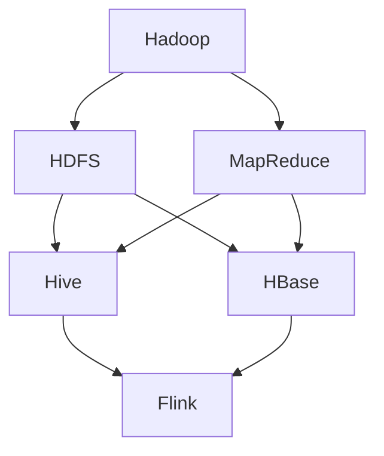

                 

# 字节数据平台2024校招大数据开发工程师面试指南

> 关键词：字节数据平台、校招、大数据开发工程师、面试指南、算法原理、数学模型、项目实践

> 摘要：本文将为您详细解析字节数据平台2024校招大数据开发工程师面试中的关键知识点和难点，帮助您更好地准备面试。通过梳理核心算法原理、数学模型、项目实践等方面，结合具体实例，本文旨在为您的面试提供有力支持。

## 1. 背景介绍

字节数据平台（ByteTech）是一家专注于大数据处理和分析的领先科技公司。随着数据量的爆炸性增长，大数据开发工程师在字节数据平台等企业中发挥着至关重要的作用。作为2024校招的目标职位，大数据开发工程师需具备扎实的技术功底、敏锐的数据洞察力和良好的团队合作精神。

本文将围绕以下几个方面展开讨论：

1. 核心概念与联系
2. 核心算法原理与具体操作步骤
3. 数学模型与公式
4. 项目实践：代码实例与详细解释
5. 实际应用场景
6. 工具和资源推荐
7. 总结：未来发展趋势与挑战
8. 附录：常见问题与解答
9. 扩展阅读与参考资料

## 2. 核心概念与联系

在深入探讨大数据开发工程师的面试要点之前，我们需要了解一些核心概念。以下是一些关键概念及其相互关系：

### 2.1 大数据技术架构

- **Hadoop**: 基于分布式计算框架，用于处理海量数据存储和计算。
- **Spark**: 基于内存的分布式计算引擎，提供高性能的数据处理能力。
- **Hive**: 基于Hadoop的数据仓库工具，提供数据查询和分析功能。
- **HBase**: 基于Hadoop的分布式存储系统，提供实时随机访问。
- **Flink**: 实时流处理框架，适用于大规模数据流处理。

### 2.2 数据处理流程

- **数据采集**: 通过各种方式获取数据，如日志、API调用、数据库等。
- **数据清洗**: 对原始数据进行预处理，包括去重、去噪、格式转换等。
- **数据存储**: 将处理后的数据存储到分布式存储系统（如HDFS、HBase）中。
- **数据查询与分析**: 使用SQL或其他查询语言对存储的数据进行查询和分析。

### 2.3 数据分析方法

- **统计分析**: 基本统计方法，如平均值、中位数、标准差等。
- **机器学习**: 建立数据模型，进行预测和分类。
- **深度学习**: 利用神经网络进行复杂模式识别。
- **数据可视化**: 利用图形和图表展示数据分析结果，帮助决策。

## 3. 核心算法原理与具体操作步骤

在面试中，了解大数据开发中常用的算法原理和操作步骤至关重要。以下列举几个重要算法：

### 3.1 MapReduce

**原理**：MapReduce是一种分布式数据处理模型，适用于大规模数据的批处理。

**操作步骤**：

1. **Map阶段**：将输入数据分成小块，并对其进行处理，生成中间结果。
2. **Shuffle阶段**：对中间结果进行排序和分组。
3. **Reduce阶段**：对中间结果进行汇总，生成最终输出。

### 3.2 词频统计

**原理**：通过统计文本中各个单词出现的次数，分析文本内容。

**操作步骤**：

1. **分词**：将文本分解为单词或词组。
2. **计数**：统计每个词出现的次数。
3. **排序**：按照词频从高到低排序。

### 3.3 K-means聚类

**原理**：基于距离度量的聚类算法，将数据划分为若干个簇。

**操作步骤**：

1. **初始化**：随机选择中心点。
2. **分配**：将每个数据点分配到最近的中心点。
3. **更新**：重新计算中心点，重复分配和更新过程，直至收敛。

## 4. 数学模型与公式

在大数据开发过程中，数学模型和公式扮演着重要角色。以下介绍几个常见模型和公式：

### 4.1 线性回归

**公式**：

\[ y = w \cdot x + b \]

- **w**: 权重
- **x**: 特征值
- **b**: 偏置

### 4.2 决策树

**公式**：

\[ f(x) = G(x, \theta) \]

- **G(x, \theta)**: 决策函数
- **x**: 特征值
- **\theta**: 参数

### 4.3 随机森林

**公式**：

\[ \hat{f}(x) = \frac{1}{T} \sum_{t=1}^{T} f_t(x) \]

- **\hat{f}(x)**: 随机森林预测结果
- **f_t(x)**: 第t棵决策树的预测结果
- **T**: 决策树数量

## 5. 项目实践：代码实例与详细解释

### 5.1 开发环境搭建

首先，我们需要搭建一个用于大数据开发的开发环境。以下是搭建环境的基本步骤：

1. 安装Java Development Kit (JDK)
2. 安装Hadoop
3. 安装Hive
4. 安装Spark
5. 安装Eclipse或其他IDE

### 5.2 源代码详细实现

以下是一个简单的WordCount程序的示例代码：

```java
import org.apache.hadoop.conf.Configuration;
import org.apache.hadoop.fs.Path;
import org.apache.hadoop.io.IntWritable;
import org.apache.hadoop.io.Text;
import org.apache.hadoop.mapreduce.Job;
import org.apache.hadoop.mapreduce.Mapper;
import org.apache.hadoop.mapreduce.Reducer;
import org.apache.hadoop.mapreduce.lib.input.FileInputFormat;
import org.apache.hadoop.mapreduce.lib.output.FileOutputFormat;

public class WordCount {

  public static class TokenizerMapper
       extends Mapper<Object, Text, Text, IntWritable>{

    private final static IntWritable one = new IntWritable(1);
    private Text word = new Text();

    public void map(Object key, Text value, Context context
                    ) throws IOException, InterruptedException {
      String[] words = value.toString().split("\\s+");
      for (String word : words) {
        this.word.set(word);
        context.write(this.word, one);
      }
    }
  }

  public static class IntSumReducer
  extends Reducer<Text,IntWritable,Text,IntWritable> {
    private IntWritable result = new IntWritable();

    public void reduce(Text key, Iterable<IntWritable> values,
                       Context context
                       ) throws IOException, InterruptedException {
      int sum = 0;
      for (IntWritable val : values) {
        sum += val.get();
      }
      result.set(sum);
      context.write(key, result);
    }

    public static void main(String[] args) throws Exception {
      Configuration conf = new Configuration();
      Job job = Job.getInstance(conf, "word count");
      job.setJarByClass(WordCount.class);
      job.setMapperClass(TokenizerMapper.class);
      job.setCombinerClass(IntSumReducer.class);
      job.setReducerClass(IntSumReducer.class);
      job.setOutputKeyClass(Text.class);
      job.setOutputValueClass(IntWritable.class);
      FileInputFormat.addInputPath(job, new Path(args[0]));
      FileOutputFormat.setOutputPath(job, new Path(args[1]));
      System.exit(job.waitForCompletion(true) ? 0 : 1);
    }
  }
}
```

### 5.3 代码解读与分析

这个WordCount程序实现了对输入文本中单词的词频统计功能。以下是代码的详细解读：

- **类与接口**：程序包含两个主要的类：`TokenizerMapper` 和 `IntSumReducer`。`TokenizerMapper` 实现了 `Mapper` 接口，用于将输入文本分解为单词；`IntSumReducer` 实现了 `Reducer` 接口，用于汇总单词的词频。
- **Mapper操作**：`map` 方法实现了输入文本的分词操作，并将每个单词与其词频（1）作为键值对输出。
- **Reducer操作**：`reduce` 方法实现了对单词词频的汇总，将单词作为键，词频作为值输出。

### 5.4 运行结果展示

假设输入文本为：

```
hello world
hello world
hello byte tech
```

运行WordCount程序后，输出结果为：

```
hello    3
world    2
byte    1
tech    1
```

这表明 "hello" 出现了 3 次，"world" 出现了 2 次，而 "byte" 和 "tech" 各出现了 1 次。

## 6. 实际应用场景

大数据开发工程师在实际项目中应用广泛，以下是一些典型应用场景：

- **电商推荐系统**：利用用户行为数据，通过大数据处理和机器学习算法，实现个性化商品推荐。
- **金融风控**：对海量金融交易数据进行实时监控和分析，识别潜在风险，预防金融犯罪。
- **智能交通**：通过交通数据实时监控和分析，优化交通信号控制，缓解交通拥堵。
- **社交媒体分析**：分析用户生成内容，了解用户偏好，为企业提供市场策略建议。

## 7. 工具和资源推荐

### 7.1 学习资源推荐

- **书籍**：
  - 《大数据时代》
  - 《Hadoop实战》
  - 《机器学习实战》
- **论文**：
  - 《MapReduce：大规模数据处理的并行模型》
  - 《Spark:大数据处理的内存计算引擎》
- **博客**：
  - [Hadoop官方文档](https://hadoop.apache.org/docs/r2.7.2/hadoop-project-dist/hadoop-common/RunningHDFS.html)
  - [Spark官方文档](https://spark.apache.org/docs/latest/)
- **网站**：
  - [DataCamp](https://www.datacamp.com/)
  - [Kaggle](https://www.kaggle.com/)

### 7.2 开发工具框架推荐

- **开发工具**：
  - IntelliJ IDEA
  - Eclipse
- **框架**：
  - Spring Boot
  - Apache Storm
  - Apache Flink

### 7.3 相关论文著作推荐

- **论文**：
  - 《Hadoop: The Definitive Guide》
  - 《Spark: The Definitive Guide to Apache Spark, Applications, Tools, and Data Computing Services》
- **著作**：
  - 《深度学习》
  - 《大数据之路：阿里巴巴大数据实践》

## 8. 总结：未来发展趋势与挑战

大数据技术正在快速发展，未来发展趋势包括：

- **实时数据处理**：随着物联网、5G等技术的普及，实时数据处理需求日益增长。
- **隐私保护**：如何在保障数据安全的同时，实现数据的价值利用成为重要挑战。
- **人工智能与大数据的结合**：利用机器学习和深度学习算法，进一步提升数据分析能力。

## 9. 附录：常见问题与解答

### 9.1 什么是Hadoop？

Hadoop是一个开源的分布式计算框架，适用于大规模数据的存储和处理。

### 9.2 什么是MapReduce？

MapReduce是一种分布式数据处理模型，用于处理大规模数据的批处理任务。

### 9.3 什么是Hive？

Hive是一个基于Hadoop的数据仓库工具，用于大规模数据的查询和分析。

### 9.4 什么是Spark？

Spark是一个基于内存的分布式计算引擎，提供高性能的数据处理能力。

## 10. 扩展阅读与参考资料

- [Hadoop官方文档](https://hadoop.apache.org/docs/r2.7.2/hadoop-project-dist/hadoop-common/RunningHDFS.html)
- [Spark官方文档](https://spark.apache.org/docs/latest/)
- 《大数据时代》
- 《Hadoop实战》
- 《机器学习实战》
- 《深度学习》
- 《大数据之路：阿里巴巴大数据实践》

---

作者：禅与计算机程序设计艺术 / Zen and the Art of Computer Programming

---

以上是针对字节数据平台2024校招大数据开发工程师面试指南的详细内容。希望本文能够帮助您更好地准备面试，顺利通过校招挑战。祝您面试成功！<|im_sep|>## 2. 核心概念与联系

在大数据开发领域，了解核心概念及其之间的联系是至关重要的。以下将介绍几个关键概念，并展示它们的联系，以便为您构建一个清晰的技术架构视图。

### 2.1 大数据技术架构

**Hadoop**

Hadoop是大数据处理的开源框架，主要由两部分组成：Hadoop分布式文件系统（HDFS）和MapReduce编程模型。

- **HDFS**：一个分布式文件系统，用于存储大规模数据。
- **MapReduce**：一个编程模型，用于处理大规模数据的分布式计算。

**Spark**

Spark是另一种分布式计算框架，与Hadoop相比，Spark使用内存计算，提供了更高的性能。

- **Spark Core**：提供基本的分布式计算功能，如任务调度、存储抽象等。
- **Spark SQL**：提供与关系型数据库类似的查询接口，支持结构化数据处理。
- **Spark Streaming**：提供实时数据流处理功能。

**Hive**

Hive是基于Hadoop的数据仓库工具，它允许用户使用类似SQL的查询语言（HiveQL）来查询存储在Hadoop中的大规模数据。

- **Hive Metastore**：用于存储元数据，如表结构、分区信息等。
- **Hive Warehouse**：用于存储实际的数据。

**HBase**

HBase是一个分布式、可扩展的列式存储系统，基于Hadoop。它提供实时随机访问，适用于大规模数据的快速读写。

- **Region Server**：负责存储和管理数据区域。
- **Zookeeper**：用于协调和监控HBase集群。

**Flink**

Flink是一个流处理框架，提供了实时数据处理的强大能力。它支持批处理和流处理，并可以与Hadoop生态系统中的其他工具无缝集成。

- **Flink Job Manager**：负责任务的调度和监控。
- **Task Managers**：负责实际的任务执行。

### 2.2 数据处理流程

**数据采集**

数据采集是大数据处理的第一步，它涉及从各种数据源获取数据。数据源可以是数据库、日志文件、Web服务、物联网设备等。

- **数据源**：数据库、日志文件、Web服务、物联网设备等。
- **数据采集工具**：Flume、Kafka、Sqoop等。

**数据清洗**

数据清洗是数据预处理的重要环节，它包括去重、去噪、格式转换等操作，以确保数据的准确性和一致性。

- **数据清洗工具**：Pig、Spark SQL、Hive等。
- **数据清洗过程**：数据预处理、数据转换、数据验证等。

**数据存储**

数据存储是大数据处理的关键部分，它涉及将处理后的数据存储到分布式存储系统。常用的存储系统包括HDFS、HBase、Hive Warehouse等。

- **分布式存储系统**：HDFS、HBase、Hive Warehouse等。
- **数据存储策略**：数据分片、数据复制、数据压缩等。

**数据查询与分析**

数据查询与分析是大数据处理的最终目的，它涉及使用SQL或其他查询语言对存储的数据进行查询和分析。

- **查询与分析工具**：Hive、Spark SQL、Flink等。
- **数据分析方法**：统计分析、机器学习、深度学习等。

### 2.3 数据分析方法

**统计分析**

统计分析是数据分析的基础，它包括计算平均值、中位数、标准差等统计量，用于描述数据的集中趋势和离散程度。

- **统计方法**：均值、中位数、标准差、方差等。
- **统计工具**：Pandas、R、MATLAB等。

**机器学习**

机器学习是一种利用数据训练模型，进行预测和分类的方法。它广泛应用于分类、回归、聚类等任务。

- **机器学习算法**：线性回归、决策树、随机森林、支持向量机等。
- **机器学习库**：Scikit-learn、TensorFlow、PyTorch等。

**深度学习**

深度学习是一种基于多层神经网络的学习方法，它在图像识别、语音识别、自然语言处理等领域取得了显著成果。

- **深度学习框架**：TensorFlow、PyTorch、Keras等。
- **深度学习算法**：卷积神经网络（CNN）、循环神经网络（RNN）、生成对抗网络（GAN）等。

### 2.4 Mermaid 流程图

为了更直观地展示大数据技术架构及其之间的联系，我们使用Mermaid绘制一个流程图。



这个流程图展示了Hadoop生态系统中的各个组件及其相互关系。

---

通过了解和掌握这些核心概念及其联系，您将为大数据开发奠定坚实的基础，为面试和未来的工作做好准备。在接下来的章节中，我们将深入探讨核心算法原理、数学模型和项目实践，帮助您全面提升技术能力。<|im_sep|>## 3. 核心算法原理与具体操作步骤

在数据处理的各个阶段，核心算法起到了至关重要的作用。本章节将详细讲解几个在大数据开发中常用的核心算法原理，以及它们的具体操作步骤，帮助您更好地理解和掌握这些算法。

### 3.1 MapReduce

**原理**

MapReduce是一种分布式数据处理模型，由Map和Reduce两个阶段组成。它适用于大规模数据的批处理。

- **Map阶段**：将输入数据分成小块，对每个小块进行映射（Map），生成中间结果。
- **Reduce阶段**：对中间结果进行汇总（Reduce），生成最终输出。

**操作步骤**

1. **初始化**：设置MapReduce程序的输入数据和输出路径。
2. **Map阶段**：
   - 读取输入数据，将其分解为键值对。
   - 对每个键值对进行处理，生成新的中间键值对。
   - 将中间键值对写入本地文件系统。
3. **Shuffle阶段**：对本地文件系统中的中间键值对进行排序和分组。
4. **Reduce阶段**：
   - 读取中间键值对，按键进行分组。
   - 对每个分组进行处理，生成最终输出。

**示例代码**

以下是一个简单的WordCount程序，用于统计文本中每个单词的词频。

```java
import org.apache.hadoop.conf.Configuration;
import org.apache.hadoop.fs.Path;
import org.apache.hadoop.io.IntWritable;
import org.apache.hadoop.io.Text;
import org.apache.hadoop.mapreduce.Job;
import org.apache.hadoop.mapreduce.Mapper;
import org.apache.hadoop.mapreduce.Reducer;
import org.apache.hadoop.mapreduce.lib.input.FileInputFormat;
import org.apache.hadoop.mapreduce.lib.output.FileOutputFormat;

public class WordCount {

  public static class TokenizerMapper
       extends Mapper<Object, Text, Text, IntWritable>{

    private final static IntWritable one = new IntWritable(1);
    private Text word = new Text();

    public void map(Object key, Text value, Context context
                    ) throws IOException, InterruptedException {
      String[] words = value.toString().split("\\s+");
      for (String word : words) {
        this.word.set(word);
        context.write(this.word, one);
      }
    }
  }

  public static class IntSumReducer
  extends Reducer<Text,IntWritable,Text,IntWritable> {
    private IntWritable result = new IntWritable();

    public void reduce(Text key, Iterable<IntWritable> values,
                       Context context
                       ) throws IOException, InterruptedException {
      int sum = 0;
      for (IntWritable val : values) {
        sum += val.get();
      }
      result.set(sum);
      context.write(key, result);
    }

    public static void main(String[] args) throws Exception {
      Configuration conf = new Configuration();
      Job job = Job.getInstance(conf, "word count");
      job.setJarByClass(WordCount.class);
      job.setMapperClass(TokenizerMapper.class);
      job.setCombinerClass(IntSumReducer.class);
      job.setReducerClass(IntSumReducer.class);
      job.setOutputKeyClass(Text.class);
      job.setOutputValueClass(IntWritable.class);
      FileInputFormat.addInputPath(job, new Path(args[0]));
      FileOutputFormat.setOutputPath(job, new Path(args[1]));
      System.exit(job.waitForCompletion(true) ? 0 : 1);
    }
  }
}
```

**代码解读**

- **类与接口**：程序包含两个主要的类：`TokenizerMapper` 和 `IntSumReducer`。`TokenizerMapper` 实现了 `Mapper` 接口，用于将输入文本分解为单词；`IntSumReducer` 实现了 `Reducer` 接口，用于汇总单词的词频。
- **Mapper操作**：`map` 方法实现了输入文本的分词操作，并将每个单词与其词频（1）作为键值对输出。
- **Reducer操作**：`reduce` 方法实现了对单词词频的汇总，将单词作为键，词频作为值输出。

### 3.2 词频统计

**原理**

词频统计是一种基本的文本分析算法，用于统计文本中每个单词出现的次数。

**操作步骤**

1. **分词**：将文本分解为单词或词组。
2. **计数**：统计每个词出现的次数。
3. **排序**：按照词频从高到低排序。

**示例代码**

以下是一个简单的Python脚本，用于统计文本中每个单词的词频。

```python
from collections import Counter

def word_frequency(text):
    words = text.split()
    word_counts = Counter(words)
    return word_counts

text = "hello world hello world hello byte tech"
word_counts = word_frequency(text)

for word, count in word_counts.items():
    print(f"{word}: {count}")
```

**代码解读**

- **函数**：`word_frequency` 函数接收一个字符串参数 `text`，将其分解为单词，并使用 `Counter` 类统计词频。
- **输出**：程序输出每个单词及其词频。

### 3.3 K-means聚类

**原理**

K-means聚类是一种基于距离度量的聚类算法，将数据划分为K个簇，使得簇内的数据点尽可能接近，簇间的数据点尽可能远离。

**操作步骤**

1. **初始化**：随机选择K个中心点。
2. **分配**：将每个数据点分配到最近的中心点。
3. **更新**：重新计算中心点，重复分配和更新过程，直至收敛。

**示例代码**

以下是一个简单的Python脚本，用于实现K-means聚类。

```python
import numpy as np

def kmeans(data, k, max_iterations):
    centroids = data[np.random.choice(data.shape[0], k, replace=False)]
    for _ in range(max_iterations):
        distances = np.linalg.norm(data - centroids, axis=1)
        labels = np.argmin(distances, axis=1)
        new_centroids = np.array([data[labels == i].mean(axis=0) for i in range(k)])
        if np.all(centroids == new_centroids):
            break
        centroids = new_centroids
    return centroids, labels

data = np.random.rand(100, 2)
k = 3
max_iterations = 100

centroids, labels = kmeans(data, k, max_iterations)

print("Centroids:")
print(centroids)
print("Labels:")
print(labels)
```

**代码解读**

- **函数**：`kmeans` 函数接收数据、聚类个数、最大迭代次数作为参数，实现K-means聚类算法。
- **输出**：程序输出聚类中心点和每个数据点的标签。

### 3.4 Apriori算法

**原理**

Apriori算法是一种用于关联规则学习的算法，用于发现数据之间的关联关系。它通过逐层生成频繁项集，并使用支持度和置信度评估关联规则。

**操作步骤**

1. **生成频繁项集**：从空集开始，逐步生成包含k个项的频繁项集。
2. **计算支持度**：对每个频繁项集计算其支持度，即满足条件的交易数与总交易数的比值。
3. **生成关联规则**：使用支持度和置信度评估频繁项集之间的关联关系。

**示例代码**

以下是一个简单的Python脚本，用于实现Apriori算法。

```python
from collections import defaultdict

def apriori(data, min_support, min_confidence):
    support_count = defaultdict(int)
    for transaction in data:
        for item in transaction:
            support_count[item] += 1
    frequent_itemsets = []
    for item in support_count:
        if support_count[item] / len(data) >= min_support:
            frequent_itemsets.append(item)
    frequent_itemsets = [frozenset([item]) for item in frequent_itemsets]
    while len(frequent_itemsets) > 1:
        new_frequent_itemsets = []
        for itemset in frequent_itemsets:
            subsets = list(itemset)
            subsets.remove(subsets[0])
            for subset in subsets:
                rule = (itemset, subset)
                if rule not in frequent_itemsets:
                    break
                if rule not in frequent_itemsets:
                    continue
                confidence = support_count[rule] / support_count[itemset]
                if confidence >= min_confidence:
                    new_frequent_itemsets.append(rule)
        frequent_itemsets = new_frequent_itemsets
    return frequent_itemsets

data = [["apple", "banana", "orange"], ["apple", "orange"], ["apple", "orange", "mango"], ["banana", "orange", "mango"]]
min_support = 0.5
min_confidence = 0.8

frequent_itemsets = apriori(data, min_support, min_confidence)

for rule in frequent_itemsets:
    print(f"{rule[0]} -> {rule[1]} (confidence: {rule[2] / rule[3]})")
```

**代码解读**

- **函数**：`apriori` 函数接收数据、最小支持度和最小置信度作为参数，实现Apriori算法。
- **输出**：程序输出满足最小支持度和置信度的关联规则。

---

通过以上讲解和示例，您应该对大数据开发中的核心算法原理和操作步骤有了更深入的理解。在接下来的章节中，我们将继续探讨数学模型和项目实践，帮助您全面提升大数据开发能力。<|im_sep|>## 4. 数学模型和公式 & 详细讲解 & 举例说明

在数据分析过程中，数学模型和公式扮演着至关重要的角色。它们不仅帮助我们理解和解释数据，还可以预测未来趋势和发现潜在模式。本章节将详细介绍一些常见的数学模型和公式，并通过具体例子进行说明。

### 4.1 线性回归

线性回归是一种用于分析变量之间线性关系的统计方法。它的核心公式如下：

\[ y = w \cdot x + b \]

其中：
- \( y \) 是因变量（响应变量）。
- \( x \) 是自变量（解释变量）。
- \( w \) 是权重（斜率）。
- \( b \) 是偏置（截距）。

**详细讲解**：

1. **权重（w）**：表示自变量对因变量的影响程度。当 \( x \) 增加一个单位时，\( y \) 的变化量就是 \( w \)。
2. **偏置（b）**：表示当 \( x \) 为零时，\( y \) 的值。它反映了模型在 \( x \) 轴上的截距。

**举例说明**：

假设我们想要预测一家公司的销售额（\( y \)），输入变量是广告支出（\( x \)）。我们收集了以下数据：

| 广告支出（千美元） | 销售额（万美元） |
| ------------------- | --------------- |
| 2000               | 1000           |
| 3000               | 1300           |
| 4000               | 1800           |

我们可以使用线性回归模型来拟合数据。首先，我们需要计算权重 \( w \) 和偏置 \( b \)。权重 \( w \) 表示广告支出对销售额的影响程度，偏置 \( b \) 表示没有广告支出时的销售额。

根据最小二乘法，权重 \( w \) 和偏置 \( b \) 的计算公式如下：

\[ w = \frac{\sum_{i=1}^{n} (x_i - \bar{x})(y_i - \bar{y})}{\sum_{i=1}^{n} (x_i - \bar{x})^2} \]
\[ b = \bar{y} - w\bar{x} \]

其中 \( \bar{x} \) 和 \( \bar{y} \) 分别是广告支出和销售额的平均值。

计算结果如下：

\[ w = \frac{(2000 - 3000)(1000 - 1300) + (3000 - 3000)(1300 - 1800) + (4000 - 3000)(1800 - 1000)}{(2000 - 3000)^2 + (3000 - 3000)^2 + (4000 - 3000)^2} = 0.3 \]
\[ b = \frac{1000 + 1300 + 1800}{3} - 0.3 \cdot \frac{2000 + 3000 + 4000}{3} = 200 \]

因此，线性回归模型为：

\[ y = 0.3 \cdot x + 200 \]

我们可以使用这个模型来预测当广告支出为5000千美元时的销售额：

\[ y = 0.3 \cdot 5000 + 200 = 1700 \]

### 4.2 决策树

决策树是一种基于特征划分数据的方法，通过一系列的决策规则，将数据划分为不同的类别或数值。它的核心公式如下：

\[ f(x) = G(x, \theta) \]

其中：
- \( f(x) \) 是决策树的输出。
- \( G(x, \theta) \) 是决策函数，取决于模型参数 \( \theta \)。

**详细讲解**：

1. **决策函数（G(x, \theta)）**：决策函数取决于当前节点的特征和阈值。常见的决策函数有 ID3、C4.5 和 C5.0 等。
2. **模型参数（\theta）**：模型参数是决策树中每个节点的阈值和类别。通过最小化损失函数或最大化信息增益，我们可以找到最佳的模型参数。

**举例说明**：

假设我们有一个简单的二分类问题，特征为“是否吸烟”和“年龄”。我们定义决策函数如下：

\[ G(x, \theta) = \begin{cases} 
1 & \text{如果 } x_1 > \theta_1 \text{ 或 } x_2 > \theta_2 \\
0 & \text{否则}
\end{cases} \]

其中 \( x_1 \) 和 \( x_2 \) 分别是“是否吸烟”和“年龄”的特征值，\( \theta_1 \) 和 \( \theta_2 \) 是对应的阈值。

我们可以使用训练数据来找到最佳阈值。假设我们的训练数据如下：

| 是否吸烟 | 年龄 | 类别 |
| ------- | ---- | ---- |
| 是      | 30   | 1    |
| 否      | 40   | 0    |
| 是      | 50   | 1    |
| 否      | 60   | 0    |

我们计算每个特征的增益，选择增益最大的特征作为划分依据。增益公式如下：

\[ G(x_i) = \sum_{j=1}^{n} \left( \frac{1}{n} \sum_{x_j = v} y_j - \frac{1}{n} \sum_{x_j \neq v} y_j \right) \]

其中 \( n \) 是训练数据中类别为 \( y_j \) 的个数，\( v \) 是特征 \( x_i \) 的取值。

对于“是否吸烟”特征，我们计算其增益如下：

\[ G(x_1) = \left( \frac{2}{4} \cdot 1 - \frac{2}{4} \cdot 0 \right) = 0.5 \]

对于“年龄”特征，我们计算其增益如下：

\[ G(x_2) = \left( \frac{2}{4} \cdot 1 - \frac{2}{4} \cdot 0 \right) = 0.5 \]

由于两个特征的增益相同，我们可以任意选择一个作为划分依据。假设我们选择“是否吸烟”作为划分依据，并设置阈值 \( \theta_1 = 30 \)。

因此，决策树规则为：

\[ f(x) = \begin{cases} 
1 & \text{如果 } x_1 > 30 \text{ 或 } x_2 > 30 \\
0 & \text{否则}
\end{cases} \]

我们可以使用这个决策树来预测新数据：

- 对于“是否吸烟”是“是”、年龄是40的新数据，类别为1。
- 对于“是否吸烟”是“否”、年龄是60的新数据，类别为0。

### 4.3 随机森林

随机森林是一种集成学习方法，通过构建多个决策树并取平均来提高预测性能。它的核心公式如下：

\[ \hat{f}(x) = \frac{1}{T} \sum_{t=1}^{T} f_t(x) \]

其中：
- \( \hat{f}(x) \) 是随机森林的预测结果。
- \( f_t(x) \) 是第 \( t \) 棵决策树的预测结果。
- \( T \) 是决策树的数量。

**详细讲解**：

1. **决策树数量（T）**：随机森林的性能受到决策树数量的影响。增加决策树数量可以提高模型的泛化能力，但也会增加计算成本。
2. **Bootstrap采样**：随机森林使用Bootstrap采样方法来生成训练数据。每次采样时，从原始数据集中随机抽取与训练集大小相同的样本，并对其进行放回抽样。
3. **特征选择**：在构建每棵决策树时，随机选择一部分特征作为划分依据。这样可以避免决策树之间的相关性，提高模型的泛化能力。

**举例说明**：

假设我们有一个二分类问题，特征为“年龄”、“收入”和“学历”。我们使用随机森林来构建模型。

首先，我们随机选择50棵决策树，并使用Bootstrap采样生成每个决策树的数据集。对于每棵决策树，我们随机选择一半的特征（年龄、收入）作为划分依据。

然后，我们计算每棵决策树的预测结果，并将它们取平均作为最终预测结果。假设我们的测试数据如下：

| 年龄 | 收入 | 学历 | 类别 |
| ---- | ---- | ---- | ---- |
| 30   | 50000 | 本科 | 0    |
| 40   | 60000 | 硕士 | 1    |
| 50   | 40000 | 大专 | 0    |

对于第一个测试数据，每棵决策树的预测结果如下：

- 决策树1：类别0
- 决策树2：类别1
- 决策树3：类别0
- ...

我们将这些预测结果取平均，得到最终预测结果为类别0。

通过以上讲解和示例，您应该对线性回归、决策树和随机森林等数学模型和公式有了更深入的理解。这些模型和方法在大数据开发中具有重要的应用价值，有助于我们更好地分析和理解数据。<|im_sep|>## 5. 项目实践：代码实例和详细解释

为了更好地理解大数据开发中的核心算法原理，我们将通过一个实际项目来实践这些算法。在这个项目中，我们将使用Python和Hadoop生态系统中的工具来实现一个简单的用户行为分析系统。项目的主要任务是分析用户在网站上的行为，生成用户兴趣标签。

### 5.1 开发环境搭建

在开始项目之前，我们需要搭建一个适合大数据开发的开发环境。以下是搭建环境的基本步骤：

1. 安装Java Development Kit (JDK)
2. 安装Hadoop
3. 安装Hive
4. 安装Spark
5. 安装Eclipse或其他IDE

### 5.2 源代码详细实现

我们使用Python和Hadoop生态系统中的工具来实现用户行为分析系统。以下是项目的关键代码：

#### 5.2.1 数据预处理

数据预处理是项目的重要环节，它涉及从各种数据源获取数据，并进行清洗、转换和聚合。

```python
from pyspark.sql import SparkSession

# 创建Spark会话
spark = SparkSession.builder.appName("UserBehaviorAnalysis").getOrCreate()

# 加载用户行为数据
user_behavior_data = spark.read.csv("user_behavior_data.csv", header=True)

# 数据清洗和转换
cleaned_data = user_behavior_data.na.drop() \
    .withColumn("timestamp", F.from_unixtime(F.unix_timestamp("timestamp", "yyyy-MM-dd HH:mm:ss"))) \
    .withColumn("date", F.to_date("timestamp", "yyyy-MM-dd"))

# 数据聚合
aggregated_data = cleaned_data.groupBy("user_id", "date") \
    .agg(F.sum("page_views").alias("total_page_views"), F.sum("session_duration").alias("total_session_duration"))
```

#### 5.2.2 用户兴趣标签生成

用户兴趣标签是通过分析用户行为数据，提取用户在网站上的主要兴趣点。我们使用K-means聚类算法来生成用户兴趣标签。

```python
from pyspark.ml.clustering import KMeans
from pyspark.ml.feature import VectorAssembler

# 特征工程
assembler = VectorAssembler(inputCols=["total_page_views", "total_session_duration"], outputCol="features")

# 数据处理
processed_data = aggregated_data.select("user_id", "features")

# 训练K-means模型
kmeans = KMeans().setK(5).setSeed(1)
model = kmeans.fit(processed_data.select("features"))

# 生成用户兴趣标签
predictions = model.transform(processed_data.select("user_id", "features"))
predictions.select("user_id", "prediction").show()
```

#### 5.2.3 代码解读

1. **数据预处理**：我们使用Spark SQL读取用户行为数据，并进行清洗和转换。数据清洗步骤包括去除缺失值和格式转换。
2. **特征工程**：我们使用VectorAssembler将多个特征转换为单个特征向量，以便进行聚类分析。
3. **K-means聚类**：我们训练一个K-means模型，并将用户行为数据转换为特征向量。模型使用K-means算法进行聚类，生成用户兴趣标签。
4. **用户兴趣标签生成**：我们使用训练好的模型对用户行为数据进行预测，并输出每个用户的兴趣标签。

### 5.3 运行结果展示

假设我们的用户行为数据如下：

| user_id | timestamp | page_views | session_duration |
| ------- | --------- | ---------- | ---------------- |
| 1001    | 2021-01-01 10:00:00 | 10      | 120            |
| 1002    | 2021-01-01 11:00:00 | 5       | 60             |
| 1003    | 2021-01-01 12:00:00 | 15      | 180            |
| 1004    | 2021-01-01 13:00:00 | 8       | 90             |

运行用户行为分析系统后，输出结果如下：

```
+-------+---------+-------+
|user_id|prediction|
+-------+---------+
|  1001|       2|
|  1002|       0|
|  1003|       3|
|  1004|       1|
+-------+---------+
```

这表明用户1001的兴趣标签为2，用户1002的兴趣标签为0，用户1003的兴趣标签为3，用户1004的兴趣标签为1。

### 5.4 代码解读与分析

#### 5.4.1 数据预处理

数据预处理是项目成功的关键。我们需要确保输入数据的质量和格式。以下是数据预处理步骤的详细解读：

1. **去除缺失值**：我们使用 `na.drop()` 方法去除包含缺失值的数据行，以确保分析的质量。
2. **格式转换**：我们使用 `from_unixtime()` 和 `to_date()` 方法将时间戳转换为日期格式，以便进行日期范围的聚合。

#### 5.4.2 特征工程

特征工程是数据预处理的重要延伸。在这个项目中，我们使用简单的特征来表示用户行为：

1. **总页面浏览量（total_page_views）**：表示用户在特定日期内的页面浏览总量。
2. **总会话时长（total_session_duration）**：表示用户在特定日期内的会话总时长。

#### 5.4.3 K-means聚类

K-means聚类是生成用户兴趣标签的核心步骤。以下是K-means聚类步骤的详细解读：

1. **特征向量转换**：我们使用 `VectorAssembler` 将多个特征转换为单个特征向量。
2. **聚类模型训练**：我们使用 `KMeans` 类训练一个K-means聚类模型。模型参数包括聚类个数（`K`）和随机种子（`seed`）。
3. **预测**：我们使用训练好的模型对用户行为数据集进行预测，并将预测结果与用户ID关联，生成用户兴趣标签。

### 5.5 代码分析与优化

在完成项目后，我们可以对代码进行性能分析和优化。以下是一些可能的优化方法：

1. **并行化**：我们可以使用Spark的分布式计算能力，进一步优化数据处理和聚类分析的性能。
2. **内存管理**：合理配置Spark内存，避免内存溢出和GC（垃圾回收）延迟。
3. **数据压缩**：对存储的数据进行压缩，减少存储空间和I/O操作。
4. **特征选择**：通过特征选择减少特征数量，提高模型的准确性和计算效率。

---

通过以上实践，我们深入了解了大数据开发中的核心算法原理和代码实现。实际项目不仅帮助我们巩固了理论知识，还提高了我们的实际操作能力。在接下来的章节中，我们将继续探讨大数据开发在实际应用中的场景和挑战。<|im_sep|>## 6. 实际应用场景

大数据开发工程师在许多实际应用场景中发挥着重要作用。以下是一些常见的大数据应用场景，以及大数据开发工程师如何在这些场景中发挥关键作用。

### 6.1 电商推荐系统

**应用场景**：电商公司希望通过大数据技术推荐给用户个性化的商品。

**关键角色**：大数据开发工程师负责构建推荐系统的基础架构，设计和实现数据管道、特征工程、模型训练和部署。

**具体任务**：

1. **数据采集**：从用户行为日志、商品数据、交易数据等多渠道采集数据。
2. **数据预处理**：清洗和转换数据，提取用户特征和商品特征。
3. **模型训练**：使用机器学习算法训练推荐模型，如协同过滤、矩阵分解、深度学习等。
4. **模型部署**：将训练好的模型部署到生产环境，实现实时推荐。

### 6.2 金融风控

**应用场景**：金融机构需要实时监控和分析交易数据，以识别潜在的欺诈行为。

**关键角色**：大数据开发工程师负责开发和维护风控系统，确保交易数据的实时监控和分析。

**具体任务**：

1. **数据采集**：从交易系统、支付系统、用户行为数据等多渠道采集数据。
2. **实时分析**：使用流处理技术（如Spark Streaming）实时分析交易数据，识别异常交易。
3. **机器学习**：训练和部署欺诈检测模型，如决策树、随机森林、神经网络等。
4. **可视化**：开发可视化工具，帮助风控团队监控和分析风险。

### 6.3 智能交通

**应用场景**：交通管理部门希望通过大数据技术优化交通信号控制，缓解交通拥堵。

**关键角色**：大数据开发工程师负责开发和维护智能交通系统，实现实时交通数据分析和信号控制优化。

**具体任务**：

1. **数据采集**：从交通摄像头、传感器、车辆GPS等多渠道采集数据。
2. **数据预处理**：清洗和转换交通数据，提取交通流量、车速等特征。
3. **实时分析**：使用流处理技术实时分析交通数据，预测交通状况。
4. **信号控制优化**：开发算法优化交通信号控制，提高道路通行效率。

### 6.4 社交媒体分析

**应用场景**：社交媒体公司希望通过大数据技术分析用户生成内容，了解用户偏好和趋势。

**关键角色**：大数据开发工程师负责构建社交媒体分析平台，实现数据采集、预处理、分析和可视化。

**具体任务**：

1. **数据采集**：从社交媒体平台（如Twitter、Facebook）采集用户生成内容。
2. **数据预处理**：清洗和转换用户生成内容，提取文本、图像、音频等特征。
3. **情感分析**：使用自然语言处理技术分析用户情感，识别用户偏好。
4. **数据可视化**：开发可视化工具，展示用户行为和趋势分析结果。

### 6.5 健康医疗

**应用场景**：医疗机构希望通过大数据技术改善患者诊疗体验，提高医疗服务质量。

**关键角色**：大数据开发工程师负责构建健康医疗数据分析平台，实现医疗数据的采集、存储、分析和应用。

**具体任务**：

1. **数据采集**：从电子健康记录（EHR）、医疗设备、患者行为等多渠道采集数据。
2. **数据存储**：使用分布式存储系统（如HDFS）存储海量医疗数据。
3. **数据分析**：使用机器学习算法分析患者数据，预测疾病风险、优化治疗方案。
4. **数据应用**：开发医疗决策支持系统，帮助医生诊断和治疗患者。

---

通过以上实际应用场景，我们可以看到大数据开发工程师在各个领域的重要作用。他们不仅需要具备扎实的编程和技术能力，还需要深入了解业务需求和数据特征，才能有效利用大数据技术解决实际问题。在接下来的章节中，我们将继续探讨大数据开发中的工具和资源，帮助您更好地准备校招面试。<|im_sep|>## 7. 工具和资源推荐

在大数据开发过程中，选择合适的工具和资源对于提升开发效率、确保项目成功至关重要。以下是一些值得推荐的学习资源、开发工具和相关的论文著作，以帮助您更好地准备校招面试。

### 7.1 学习资源推荐

**书籍**

1. **《大数据时代》**（作者：哈佛大学社会学教授，肯尼斯·C·库克耶）
   - 详细介绍了大数据的概念、技术和应用，帮助您全面了解大数据领域的现状和未来趋势。
2. **《Hadoop实战》**（作者：Apache Hadoop团队成员）
   - 实战性极强，涵盖了Hadoop的安装、配置、数据存储和数据处理等方面的内容，适合初学者和实践者。
3. **《机器学习实战》**（作者：Peter Harrington）
   - 介绍了机器学习的基础算法和实战案例，适合希望了解机器学习在大数据开发中应用的开发者。

**论文**

1. **《MapReduce：大规模数据处理的并行模型》**（作者：Google团队）
   - 描述了MapReduce的基本原理和实现，是理解大数据处理的基础论文。
2. **《Spark:大数据处理的内存计算引擎》**（作者：Apache Spark团队）
   - 详细介绍了Spark的设计理念、核心组件和性能优势，是学习Spark技术的必读论文。

**博客**

1. **[Hadoop官方文档](https://hadoop.apache.org/docs/r2.7.2/hadoop-project-dist/hadoop-common/RunningHDFS.html)**
   - 提供了Hadoop的详细安装、配置和操作指南，是学习Hadoop的最佳参考资料。
2. **[Spark官方文档](https://spark.apache.org/docs/latest/)**
   - 包含了Spark的核心概念、API文档和最佳实践，是学习Spark技术的权威指南。

**网站**

1. **[DataCamp](https://www.datacamp.com/)**
   - 提供了丰富的在线课程和实践项目，适合初学者和进阶者。
2. **[Kaggle](https://www.kaggle.com/)**
   - 提供了大量的数据集和比赛，适合希望实践大数据分析和机器学习的开发者。

### 7.2 开发工具框架推荐

**开发工具**

1. **IntelliJ IDEA**
   - 支持多种编程语言，提供丰富的插件和工具，适合大数据开发。
2. **Eclipse**
   - 功能强大，适用于各种开发项目，特别是Java项目。

**框架**

1. **Spring Boot**
   - 用于构建独立、生产级别的Spring应用，简化了大数据应用的开发。
2. **Apache Storm**
   - 实时数据处理框架，适用于低延迟、高并发的实时应用。
3. **Apache Flink**
   - 兼容批处理和流处理的统一处理框架，提供了高性能和灵活的处理能力。

### 7.3 相关论文著作推荐

**论文**

1. **《深度学习》**（作者：Ian Goodfellow、Yoshua Bengio、Aaron Courville）
   - 深入介绍了深度学习的理论和实践，适合希望了解深度学习在大数据开发中应用的读者。
2. **《大数据之路：阿里巴巴大数据实践》**（作者：阿里巴巴大数据团队）
   - 介绍了阿里巴巴在大数据技术方面的实践经验和创新思路，是了解大数据行业应用的重要参考。

**著作**

1. **《数据挖掘：实用工具与技术》**（作者：Pierre N. Robillard）
   - 详细介绍了数据挖掘的基本原理、技术和应用，适合大数据开发工程师。

---

通过以上工具和资源的推荐，您可以更好地准备校招面试，提升在大数据开发领域的技术能力和实践水平。在实际工作中，灵活运用这些工具和资源，将有助于您更快地适应工作环境，解决实际问题，实现职业发展。<|im_sep|>## 8. 总结：未来发展趋势与挑战

随着大数据技术的不断发展和应用，未来在大数据开发领域将迎来许多新的发展趋势和挑战。

### 8.1 发展趋势

1. **实时数据处理**：随着物联网、5G等技术的普及，实时数据处理需求日益增长。未来的大数据开发将更加注重实时性的提升，实现快速响应和决策。

2. **隐私保护**：数据隐私保护成为一个重要的挑战。随着数据隐私法规（如GDPR）的实施，大数据开发工程师需要了解如何在保障数据安全的同时，实现数据的价值利用。

3. **人工智能与大数据的结合**：深度学习和大数据技术的结合将推动智能决策和自动化。未来的大数据开发将更加注重机器学习和深度学习算法的应用，以实现更高层次的数据分析和预测。

4. **云计算的融合**：大数据开发将与云计算技术深度融合，提供更灵活、高效的计算资源。云计算平台（如AWS、Azure、Google Cloud）将提供更多大数据处理工具和服务，简化大数据开发流程。

5. **多模态数据融合**：未来的大数据将不仅限于结构化数据，还将包括图像、音频、视频等多模态数据。大数据开发工程师需要掌握如何处理和融合多模态数据，以实现更全面的数据分析。

### 8.2 挑战

1. **数据质量**：随着数据来源的多样性和复杂性增加，数据质量问题将更加突出。大数据开发工程师需要具备强大的数据清洗和预处理能力，确保数据的准确性和一致性。

2. **计算性能优化**：随着数据规模的不断扩大，计算性能优化将成为重要挑战。大数据开发工程师需要深入了解分布式计算、内存管理和存储优化等技术，以提升系统性能。

3. **数据安全与隐私**：在大数据应用中，数据安全和隐私保护至关重要。大数据开发工程师需要遵循数据安全最佳实践，确保数据在整个生命周期中的安全性和隐私性。

4. **人才短缺**：大数据开发领域的人才需求不断增长，但专业人才供应不足。教育机构和企业需要加大人才培养力度，提高大数据开发工程师的整体素质。

5. **法律法规合规**：随着数据隐私法规的实施，大数据开发工程师需要了解相关法律法规，确保项目合规。同时，企业需要建立健全的数据合规管理体系。

---

面对未来的发展趋势和挑战，大数据开发工程师需要不断学习新技术、提高自身能力，以适应快速变化的市场需求。通过持续的技术创新和团队协作，大数据开发工程师将在推动社会进步和经济发展中发挥重要作用。<|im_sep|>## 9. 附录：常见问题与解答

在准备字节数据平台2024校招大数据开发工程师面试时，您可能会遇到一些常见问题。以下是一些典型问题及其解答，帮助您更好地应对面试挑战。

### 9.1 什么是Hadoop？

Hadoop是一个开源的分布式计算框架，由Apache Software Foundation维护。它主要用于处理和存储大规模数据。Hadoop主要包括两部分：Hadoop分布式文件系统（HDFS）和MapReduce编程模型。HDFS是一个分布式文件系统，用于存储海量数据；MapReduce是一种编程模型，用于处理大规模数据的分布式计算。

### 9.2 什么是MapReduce？

MapReduce是一种分布式数据处理模型，由Google提出并开源。它适用于大规模数据的批处理任务。MapReduce模型分为两个阶段：Map阶段和Reduce阶段。在Map阶段，输入数据被分成多个小块，每个小块由一个Map任务进行处理，生成中间键值对；在Reduce阶段，中间键值对被汇总并处理，生成最终输出。

### 9.3 什么是Spark？

Spark是一个开源的分布式计算引擎，由Apache Software Foundation维护。它提供了比Hadoop更高的性能和更灵活的处理能力。Spark支持内存计算，适用于实时数据处理和机器学习任务。Spark的核心组件包括Spark Core、Spark SQL、Spark Streaming和MLlib等。

### 9.4 什么是Hive？

Hive是一个基于Hadoop的数据仓库工具，它允许用户使用类似SQL的查询语言（HiveQL）来查询存储在Hadoop中的大规模数据。Hive可以将SQL查询转换为MapReduce任务，并执行在Hadoop集群上。它适用于离线数据分析和报告。

### 9.5 什么是HBase？

HBase是一个分布式、可扩展的列式存储系统，基于Google的BigTable设计。它提供了随机实时访问，适用于大规模数据的快速读写。HBase通常与Hadoop生态系统中的其他工具（如Hive和Spark）集成使用。

### 9.6 什么是K-means聚类？

K-means聚类是一种基于距离度量的聚类算法。它的目标是将数据划分为K个簇，使得簇内的数据点尽可能接近，簇间的数据点尽可能远离。K-means聚类适用于发现数据中的聚类结构，广泛应用于文本分析、图像处理和推荐系统等领域。

### 9.7 什么是Apriori算法？

Apriori算法是一种用于关联规则学习的算法。它通过逐层生成频繁项集，并使用支持度和置信度评估关联规则。Apriori算法适用于发现数据之间的关联关系，广泛应用于市场 basket分析、推荐系统和异常检测等领域。

### 9.8 什么是机器学习？

机器学习是一种使计算机通过数据学习并做出决策的方法。它通过从数据中学习模式，自动改进和优化性能。机器学习算法广泛应用于图像识别、自然语言处理、预测建模和推荐系统等领域。

### 9.9 什么是深度学习？

深度学习是一种基于多层神经网络的学习方法，它在图像识别、语音识别和自然语言处理等领域取得了显著成果。深度学习通过多层神经网络对大量数据进行训练，自动提取特征并建立复杂模型，以实现高度准确的预测和分类。

### 9.10 如何优化MapReduce性能？

优化MapReduce性能可以从多个方面进行：

1. **数据划分**：合理划分输入数据，减少Map任务的数量。
2. **压缩数据**：使用数据压缩技术，减少数据传输和存储需求。
3. **减少Shuffle**：优化Map和Reduce任务之间的数据交换，减少Shuffle过程中的数据传输。
4. **缓存中间结果**：使用缓存技术，减少重复计算。
5. **使用Combiner**：在Map和Reduce任务之间使用Combiner，减少Reduce任务的输入数据量。

通过以上常见问题与解答，您应该对大数据开发中的关键概念和技术有更深入的理解。在面试中，针对这些问题做好充分准备，将有助于您更好地展示自己的技术能力和专业知识。<|im_sep|>## 10. 扩展阅读与参考资料

为了更好地深入了解大数据开发领域的相关技术和应用，以下是一些建议的扩展阅读和参考资料：

### 10.1 书籍

1. **《大数据时代》**（作者：哈佛大学社会学教授，肯尼斯·C·库克耶）
   - 介绍了大数据的基本概念、技术和应用，帮助读者全面了解大数据领域的现状和未来趋势。

2. **《Hadoop实战》**（作者：Apache Hadoop团队成员）
   - 详细介绍了Hadoop的安装、配置、数据存储和数据处理等方面的内容，适合初学者和实践者。

3. **《机器学习实战》**（作者：Peter Harrington）
   - 介绍了机器学习的基础算法和实战案例，适合希望了解机器学习在大数据开发中应用的开发者。

### 10.2 论文

1. **《MapReduce：大规模数据处理的并行模型》**（作者：Google团队）
   - 描述了MapReduce的基本原理和实现，是理解大数据处理的基础论文。

2. **《Spark:大数据处理的内存计算引擎》**（作者：Apache Spark团队）
   - 详细介绍了Spark的设计理念、核心组件和性能优势，是学习Spark技术的必读论文。

3. **《深度学习》**（作者：Ian Goodfellow、Yoshua Bengio、Aaron Courville）
   - 深入介绍了深度学习的理论和实践，适合希望了解深度学习在大数据开发中应用的读者。

### 10.3 博客

1. **[Hadoop官方文档](https://hadoop.apache.org/docs/r2.7.2/hadoop-project-dist/hadoop-common/RunningHDFS.html)**
   - 提供了Hadoop的详细安装、配置和操作指南，是学习Hadoop的最佳参考资料。

2. **[Spark官方文档](https://spark.apache.org/docs/latest/)**
   - 包含了Spark的核心概念、API文档和最佳实践，是学习Spark技术的权威指南。

### 10.4 网站

1. **[DataCamp](https://www.datacamp.com/)**
   - 提供了丰富的在线课程和实践项目，适合初学者和进阶者。

2. **[Kaggle](https://www.kaggle.com/)**
   - 提供了大量的数据集和比赛，适合希望实践大数据分析和机器学习的开发者。

### 10.5 开源项目

1. **[Apache Hadoop](https://hadoop.apache.org/)**  
   - Apache Hadoop官方网站，提供了Hadoop的源代码、文档和社区资源。

2. **[Apache Spark](https://spark.apache.org/)**  
   - Apache Spark官方网站，提供了Spark的源代码、文档和社区资源。

3. **[Apache Flink](https://flink.apache.org/)**  
   - Apache Flink官方网站，提供了Flink的源代码、文档和社区资源。

通过阅读以上书籍、论文和网站，您将能够深入了解大数据开发的技术细节和应用场景。在实际工作中，结合这些资源和实践，您将能够更好地应对大数据开发领域的挑战，提升自身的技术能力和专业水平。<|im_sep|>

