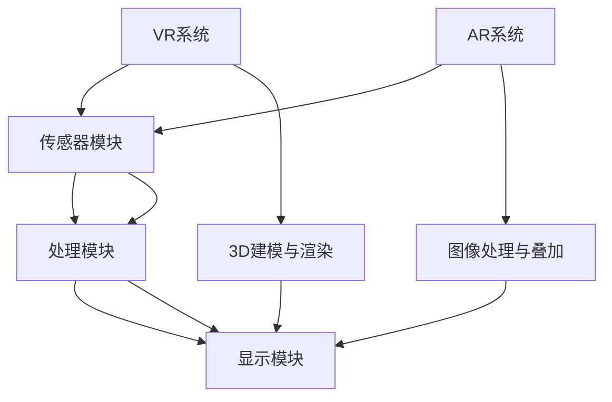

                 

### 1. 背景介绍 ###

在现代社会，随着科技的不断进步，虚拟现实（VR）和增强现实（AR）技术逐渐成为热门话题。这些技术不仅颠覆了传统的信息传递方式，还开辟了全新的交互体验。特别是在游戏、教育、医疗、军事和广告等多个领域，AR/VR技术的应用已经取得了显著的成果。

字节跳动，作为国内领先的内容平台公司，在AR/VR领域有着深入的研究和布局。其2024年校招中，特别设置了AR/VR开发工程师的岗位，旨在寻找有志于在AR/VR领域深耕的优秀人才。本次面试题的设置，不仅考察了应聘者的技术能力，更关注其解决实际问题的能力和创新能力。

本文旨在通过详细解析字节跳动2024校招AR/VR开发工程师的面试题，帮助读者更好地理解AR/VR技术的核心概念、算法原理，以及如何在实际项目中应用这些技术。通过这篇文章，读者不仅能掌握AR/VR开发的基本技能，还能对未来的发展趋势和挑战有更深刻的认识。

首先，我们需要明确一些核心概念。虚拟现实（VR）是一种通过计算机技术创造的模拟环境，用户在其中可以沉浸式体验。而增强现实（AR）则是将虚拟元素叠加到现实世界中，使现实与虚拟相互融合。两者的区别在于，VR主要关注虚拟环境的沉浸感和交互性，而AR则更注重与现实世界的互动和融合。

接下来，我们将一步步深入分析面试题中的各个问题，从核心概念原理出发，探讨具体的算法原理和操作步骤，并通过实际项目实践，展示如何在真实场景中应用这些技术。此外，我们还将介绍相关的数学模型和公式，帮助读者更全面地理解AR/VR开发的逻辑和原理。

总的来说，本文将围绕以下几个核心问题展开：

1. **核心概念与联系**：通过Mermaid流程图，详细解释VR和AR的基本概念及其架构。
2. **核心算法原理 & 具体操作步骤**：探讨常见的AR/VR算法，如SLAM（同时定位与地图构建）、光学跟踪和渲染技术。
3. **数学模型和公式 & 详细讲解 & 举例说明**：介绍AR/VR开发中常用的数学模型，如线性代数、几何学和概率论。
4. **项目实践：代码实例和详细解释说明**：通过具体的代码实例，展示AR/VR项目的开发流程和实现细节。
5. **实际应用场景**：分析AR/VR技术在不同领域的应用案例，探讨其优势和挑战。
6. **工具和资源推荐**：介绍学习AR/VR开发所需的资源和工具，帮助读者快速上手。

通过以上几个方面的深入探讨，我们希望读者能够对AR/VR技术有更全面、更深入的理解，并为未来的学习和实践打下坚实的基础。接下来，让我们开始具体的分析吧！

#### 1.1 虚拟现实（VR）的定义与核心技术原理

虚拟现实（VR）是一种通过计算机技术创建的模拟环境，用户在其中可以体验到沉浸式的感受。VR技术利用计算机图形学、头戴显示器（HMD）、传感器和追踪系统等核心组件，构建一个完全由数字信息组成的虚拟世界。用户通过头戴显示器（如Oculus Rift、HTC Vive等）进入这个虚拟环境，可以感受到身临其境的视觉、听觉和触觉效果。

首先，计算机图形学是VR技术的核心。通过计算机图形学，开发者可以创建复杂的3D模型、场景和动画。这些图形通过图形处理器（GPU）进行渲染，生成高质量的画面。GPU的强大计算能力使得实时渲染成为可能，用户在VR环境中可以流畅地移动、旋转和交互。

其次，头戴显示器（HMD）是VR体验的关键设备。HMD通常配备高分辨率显示器，提供广阔的视野和低延迟的响应时间。高分辨率显示器可以提供更真实的视觉效果，而低延迟则减少了用户的眩晕感。目前市面上常见的HMD设备，如Oculus Rift、HTC Vive和PlayStation VR，都具备这些关键特性。

此外，传感器和追踪系统在VR技术中发挥着重要作用。传感器可以捕捉用户的头部和手部运动，将其转化为虚拟环境中的动作。常见的传感器包括陀螺仪、加速度计和摄像头等。追踪系统则通过这些传感器数据，实现对用户动作的实时捕捉和反馈。一些高级的VR系统还支持手部追踪和手势识别，使得用户在虚拟环境中可以进行更自然的交互。

VR技术的核心原理可以总结为以下几点：

1. **3D建模与渲染**：通过计算机图形学技术，创建虚拟环境中的3D模型、场景和动画，并通过GPU进行实时渲染。
2. **实时追踪与反馈**：利用传感器和追踪系统，捕捉用户的动作，将其转化为虚拟环境中的动作，提供实时反馈。
3. **沉浸式体验**：通过高分辨率显示器、低延迟响应和高保真音效等手段，创造一个逼真的虚拟世界，使用户沉浸其中。

在实际应用中，VR技术已经取得了显著的成果。例如，在游戏领域，VR游戏提供了全新的游戏体验，用户可以置身于虚拟的游戏世界中，与游戏角色互动。在教育领域，VR技术被广泛应用于虚拟课堂和实验模拟，学生可以通过虚拟实验加深对知识的理解。在医疗领域，VR技术用于康复训练、手术模拟和心理治疗等，为患者提供个性化的医疗服务。在军事领域，VR技术被用于训练和模拟，提高士兵的战斗技能和应对能力。

总之，虚拟现实（VR）技术通过计算机图形学、头戴显示器、传感器和追踪系统等核心组件，创造了一个沉浸式的虚拟世界。其核心原理在于3D建模与渲染、实时追踪与反馈，以及沉浸式体验。在未来的发展中，VR技术有望进一步扩展其应用领域，为人类生活带来更多变革。

#### 1.2 增强现实（AR）的定义与核心技术原理

增强现实（AR）是一种将虚拟元素叠加到现实世界中的技术，通过这种方式，现实与虚拟得以相互融合。与虚拟现实（VR）不同，AR并不是将用户完全置身于一个虚拟环境中，而是在现实世界中添加虚拟图像、文字或其他信息。这种技术通过移动设备（如智能手机或AR眼镜）的摄像头和显示屏幕，将虚拟内容与现实场景相结合。

AR技术的核心组件包括摄像头、显示屏幕、传感器和计算单元。摄像头负责捕捉现实世界的图像，显示屏幕则用来显示虚拟内容。传感器，如加速度计和陀螺仪，用于跟踪用户的运动和设备的位置。计算单元负责处理图像数据，将虚拟内容实时叠加到摄像头捕捉的图像上。

AR技术的核心原理可以概括为以下几个步骤：

1. **图像识别与处理**：摄像头捕捉现实世界的图像，通过图像处理技术进行预处理，如滤波、边缘检测等，以提取有用的信息。
2. **特征点检测与匹配**：利用图像识别算法，检测图像中的特征点，如角点、边缘等。然后，通过特征点匹配技术，将现实世界的图像与虚拟内容进行关联。
3. **虚拟内容叠加**：根据特征点匹配的结果，将虚拟内容（如3D模型、文字、图像等）叠加到摄像头捕捉的图像上，形成一个融合了现实与虚拟的视觉体验。

在实际应用中，AR技术已经展示了其广泛的潜力和优势。以下是一些常见的应用领域：

1. **教育**：AR技术被广泛应用于教育领域，如虚拟课堂、实验模拟和互动教学。学生可以通过AR应用在书本上看到动态的实验结果，或通过AR游戏学习历史事件和科学原理。
2. **娱乐**：AR游戏和应用程序提供了全新的娱乐体验。例如，用户可以在现实环境中与虚拟角色互动，或通过AR滤镜拍摄有趣的短视频。
3. **零售**：AR技术可以用于零售业，如虚拟试衣和产品展示。消费者可以通过AR应用程序在家中尝试新衣服或家具，提高购物体验。
4. **医疗**：AR技术被用于医疗领域，如手术辅助和远程诊断。医生可以通过AR眼镜直接查看患者的内部结构和医疗数据，提高诊断和手术的精确性。
5. **广告和营销**：AR技术为广告和营销提供了创新的手段。品牌可以通过AR应用吸引消费者的注意力，提供互动和个性化的广告体验。

总之，增强现实（AR）技术通过摄像头、显示屏幕、传感器和计算单元等核心组件，将虚拟内容与现实世界相结合。其核心原理包括图像识别与处理、特征点检测与匹配以及虚拟内容叠加。在未来的发展中，AR技术有望进一步拓展其应用领域，为各行各业带来更多的创新和变革。

#### 1.3 VR与AR的关系及核心架构

虚拟现实（VR）和增强现实（AR）虽然在核心概念和应用场景上有所不同，但它们之间有着密切的联系。VR侧重于创造一个完全由数字信息构成的虚拟环境，使用户能够沉浸其中；而AR则是在现实世界中叠加虚拟元素，实现现实与虚拟的融合。尽管两者的目标不同，但它们都依赖于相似的技术和架构。

首先，从技术角度来看，VR和AR都涉及到计算机图形学、传感器、追踪系统和显示技术。VR通过头戴显示器（HMD）和传感器捕捉用户的动作，创造一个虚拟的沉浸式环境。而AR则通过摄像头和显示屏幕，将虚拟元素叠加到现实场景中。这两种技术都依赖于强大的计算能力和实时数据处理。

接下来，从架构上分析，VR和AR系统都可以分为几个关键部分：传感器模块、处理模块和显示模块。

1. **传感器模块**：这是VR和AR系统的核心部分，负责捕捉用户的动作和环境信息。传感器模块包括头戴设备上的陀螺仪、加速度计、摄像头、手柄等。这些传感器能够实时捕捉用户的动作和位置信息，为虚拟环境提供实时反馈。
   
2. **处理模块**：处理模块负责处理传感器捕捉到的数据，进行图像识别、特征点检测和匹配等操作。对于VR系统，处理模块还需要进行3D建模、渲染和动画生成。而AR系统则需要处理摄像头捕捉到的现实世界图像，并将其与虚拟内容进行融合。处理模块通常包括CPU、GPU和专用芯片。

3. **显示模块**：显示模块是用户与虚拟环境或现实世界交互的接口。对于VR系统，显示模块通常是通过头戴显示器（HMD）呈现给用户。而AR系统则是通过智能手机或AR眼镜的屏幕显示。显示模块需要提供高分辨率、低延迟和高保真的显示效果，以提供良好的用户体验。

为了更好地理解VR和AR的核心架构，我们可以使用Mermaid流程图进行详细描述：



在这个流程图中，A代表传感器模块，B代表处理模块，C代表显示模块。D表示VR系统，E表示AR系统。F表示3D建模与渲染，G表示图像处理与叠加。通过这个流程图，我们可以清晰地看到VR和AR系统的整体架构及其相互关系。

- **VR系统**：传感器模块捕捉用户的动作和位置信息，处理模块进行3D建模、渲染和动画生成，最终通过显示模块呈现给用户。
- **AR系统**：传感器模块捕捉现实世界的图像，处理模块进行图像处理、特征点检测和匹配，最终通过显示模块将虚拟内容叠加到现实场景中。

通过这种架构，VR和AR系统不仅实现了虚拟与现实的有效融合，还为各种应用场景提供了丰富的技术支持。无论是游戏、教育、医疗，还是零售、广告，VR和AR技术的应用前景都十分广阔。在未来的发展中，随着技术的不断进步，VR和AR系统有望进一步优化和扩展，为用户带来更加丰富和沉浸的体验。

#### 2. 核心算法原理 & 具体操作步骤

在AR/VR开发中，核心算法起着至关重要的作用，它们决定了虚拟环境的构建、实时追踪、渲染效果等。以下将介绍几个关键的算法，包括同时定位与地图构建（SLAM）、光学跟踪和渲染技术，并详细解释它们的具体操作步骤。

##### 2.1 SLAM（同时定位与地图构建）

SLAM（Simultaneous Localization and Mapping）是一种在未知环境中同时进行定位和地图构建的技术。它在AR/VR开发中应用广泛，特别是在移动设备和机器人领域。SLAM的核心目标是使用传感器数据（如摄像头、激光雷达等）来实时构建环境地图，并在地图中确定自身的位置。

**SLAM的算法原理：**

SLAM通常采用视觉SLAM或激光SLAM。视觉SLAM利用图像信息进行定位和地图构建，而激光SLAM则利用激光雷达（Lidar）数据。这里以视觉SLAM为例进行介绍。

视觉SLAM的基本原理是通过对连续图像帧进行特征点检测、匹配和优化，实现位置估计和地图构建。具体步骤如下：

1. **特征点检测**：使用SIFT（尺度不变特征变换）或SURF（加速稳健特征变换）算法检测图像中的特征点。这些特征点在图像中具有独特性和稳定性。
   
2. **特征点匹配**：对于连续两帧图像，找到对应的特征点对，建立匹配关系。这可以通过最近邻搜索或迭代最近点（ICP）算法实现。

3. **运动估计**：利用特征点匹配结果，计算相机在两帧之间的运动变换（旋转和平移）。这一步可以通过单应性矩阵（Homography）或迭代最近点（ICP）算法实现。

4. **地图构建**：根据运动估计的结果，将新的特征点加入到地图中，并更新地图信息。通常采用稀疏地图或稀疏+稠密地图结合的方法。

5. **优化**：利用所有历史图像帧，通过优化算法（如重投影误差最小化）进一步优化位置和地图信息。

**SLAM的具体操作步骤：**

1. **初始化**：在开始SLAM之前，需要初始化相机参数（如焦距、主点等）。这可以通过相机标定或手动输入实现。

2. **特征点检测与匹配**：对连续图像帧进行特征点检测和匹配，建立特征点对。

3. **运动估计**：利用特征点匹配结果，计算相机运动变换。

4. **地图构建**：将新的特征点加入到地图中，更新地图信息。

5. **优化**：对历史图像帧进行优化，以减少误差。

6. **循环**：重复步骤2-5，不断更新位置和地图信息。

通过以上步骤，SLAM可以实现实时定位和地图构建。在AR/VR应用中，SLAM技术可以帮助用户在虚拟环境中准确导航和交互。

##### 2.2 光学跟踪

光学跟踪是一种通过光学传感器（如摄像头）获取物体位置和姿态的技术。它在AR/VR开发中用于实时捕捉用户或设备的位置和动作，以提供精准的交互体验。

**光学跟踪的算法原理：**

光学跟踪的核心是基于视觉传感器获取的图像信息进行物体识别和定位。具体步骤如下：

1. **目标检测**：使用深度学习或传统图像处理方法（如HOG、SVM等）检测图像中的目标物体。

2. **特征提取**：对目标物体进行特征提取，如边缘、角点等。

3. **位姿估计**：利用特征点匹配和运动估计算法（如单应性矩阵、迭代最近点（ICP）算法），估计目标物体的位姿（位置和姿态）。

4. **跟踪**：对目标物体进行跟踪，持续更新其位置和姿态信息。

**光学跟踪的具体操作步骤：**

1. **初始化**：设置跟踪算法的初始参数，如检测阈值、特征点匹配阈值等。

2. **目标检测**：对输入图像进行目标检测，识别图像中的目标物体。

3. **特征提取**：对检测到的目标物体进行特征提取。

4. **位姿估计**：利用特征点匹配和运动估计算法，估计目标物体的位姿。

5. **跟踪**：对目标物体进行跟踪，并在后续图像帧中更新其位置和姿态信息。

光学跟踪在AR/VR应用中非常重要，它可以实现虚拟物体与现实世界的精确融合。例如，在AR游戏中，光学跟踪可以帮助用户实时捕捉手持设备的位置和动作，从而实现与虚拟角色的互动。

##### 2.3 渲染技术

渲染技术是AR/VR开发中的核心，它决定了虚拟环境的视觉效果。渲染技术包括三维图形渲染、光线追踪、纹理映射等。

**三维图形渲染：**

三维图形渲染的基本原理是将三维模型转换为二维图像。具体步骤如下：

1. **几何变换**：通过模型矩阵、视图矩阵和投影矩阵，将三维模型转换为屏幕上的二维图像。

2. **光照计算**：计算模型表面接收的光照强度，包括环境光、漫反射光和镜面反射光。

3. **着色**：根据光照计算结果，对模型表面进行着色。

4. **渲染输出**：将渲染后的图像输出到屏幕。

**光线追踪：**

光线追踪是一种基于光线路径的渲染技术，可以生成逼真的图像效果。具体步骤如下：

1. **光线发射**：从场景中的光源发射光线。

2. **光线传播**：光线在场景中传播，遇到物体时发生反射、折射或吸收。

3. **光量计算**：计算光线到达图像像素处的光量，生成最终图像。

**纹理映射：**

纹理映射是将二维纹理图像映射到三维模型表面的技术，可以增强虚拟环境的真实感。具体步骤如下：

1. **纹理采样**：根据模型表面的法向量，从纹理图像中采样颜色值。

2. **纹理混合**：根据模型表面的光照情况，对纹理颜色值进行混合。

3. **渲染输出**：将纹理映射后的模型输出到屏幕。

通过以上算法和技术的结合，AR/VR系统可以生成高质量、真实的虚拟环境，提供沉浸式的用户体验。

##### 2.4 实例分析：基于SLAM的AR应用

为了更好地理解SLAM在AR中的应用，我们来看一个具体的实例：使用SLAM技术实现一个基于移动设备的AR应用。

**实例目标：**

通过SLAM技术，在移动设备上实时构建室内环境地图，并在地图上叠加虚拟物体。

**步骤：**

1. **初始化**：启动应用，进行相机标定，初始化SLAM算法参数。

2. **特征点检测与匹配**：对连续的相机图像帧进行特征点检测和匹配，建立特征点对。

3. **运动估计**：利用特征点匹配结果，计算相机在图像帧之间的运动变换。

4. **地图构建**：将新的特征点加入到地图中，并更新地图信息。

5. **虚拟物体叠加**：在地图上选择位置，将虚拟物体（如3D模型）叠加到地图中。

6. **实时更新**：持续更新地图和虚拟物体位置，实现实时AR效果。

**实现效果：**

通过以上步骤，用户可以在移动设备上看到实时更新的室内环境地图，并在地图上看到叠加的虚拟物体。用户可以自由移动设备，观察虚拟物体在现实环境中的变化。

总之，SLAM、光学跟踪和渲染技术是AR/VR开发中的核心算法，它们共同决定了虚拟环境的构建和用户体验。通过了解这些算法的具体原理和操作步骤，开发者可以更好地实现AR/VR应用，为用户提供沉浸式的交互体验。

### 3. 数学模型和公式 & 详细讲解 & 举例说明

在AR/VR开发中，数学模型和公式起着至关重要的作用，它们为算法的推导和实现提供了理论基础。本节将详细介绍AR/VR开发中常用的数学模型和公式，包括线性代数、几何学和概率论，并通过具体的例子进行说明。

#### 3.1 线性代数

线性代数是AR/VR开发中的基础数学工具，涉及向量、矩阵、行列式等概念。以下将介绍几个关键的线性代数模型和公式。

1. **向量与矩阵**：向量是具有大小和方向的量，矩阵是由一系列数字组成的二维数组。在AR/VR中，向量用于表示位置、方向和速度，而矩阵则用于表示变换和投影。

   **例子**：一个简单的二维向量表示位置，如\( \vec{p} = [x, y]^T \)。一个三维矩阵可以表示一个变换，如旋转矩阵\( R = \begin{bmatrix} \cos{\theta} & -\sin{\theta} \\ \sin{\theta} & \cos{\theta} \end{bmatrix} \)。

2. **矩阵乘法**：矩阵乘法是线性代数中的核心运算，用于表示组合变换。例如，一个二维向量\( \vec{p} \)通过一个二维矩阵\( A \)的变换，可以表示为\( \vec{p'} = A \vec{p} \)。

   **例子**：一个向量\( \vec{p} = [1, 2]^T \)通过一个旋转矩阵\( R = \begin{bmatrix} \cos{30^\circ} & -\sin{30^\circ} \\ \sin{30^\circ} & \cos{30^\circ} \end{bmatrix} \)的变换，结果为\( \vec{p'} = R \vec{p} \)。

3. **行列式**：行列式是一个重要的矩阵运算结果，用于表示矩阵的逆。例如，一个二维矩阵\( A \)的逆可以通过行列式计算，\( A^{-1} = \frac{1}{\det{A}} \text{adj}(A) \)。

   **例子**：一个二维矩阵\( A = \begin{bmatrix} 1 & 2 \\ 3 & 4 \end{bmatrix} \)的行列式为\( \det{A} = 1 \cdot 4 - 2 \cdot 3 = -2 \)，其逆为\( A^{-1} = \frac{1}{-2} \begin{bmatrix} 4 & -2 \\ -3 & 1 \end{bmatrix} \)。

4. **矩阵分解**：矩阵分解是将一个矩阵分解为几个简单矩阵的乘积。例如，矩阵的奇异值分解（SVD）将一个矩阵分解为三个矩阵的乘积：\( A = U \Sigma V^T \)。

   **例子**：一个矩阵\( A = \begin{bmatrix} 1 & 2 \\ 3 & 4 \end{bmatrix} \)的奇异值分解为\( A = U \Sigma V^T \)，其中\( U \)和\( V \)是正交矩阵，\( \Sigma \)是对角矩阵。

#### 3.2 几何学

几何学在AR/VR开发中用于描述空间中的物体和变换。以下将介绍几个关键的几何学模型和公式。

1. **坐标变换**：坐标变换用于将一个坐标系中的向量转换为另一个坐标系中的向量。例如，一个三维向量\( \vec{p} \)通过一个旋转矩阵\( R \)的变换，可以表示为\( \vec{p'} = R \vec{p} + \vec{t} \)。

   **例子**：一个三维向量\( \vec{p} = [1, 0, 0]^T \)通过一个旋转矩阵\( R = \begin{bmatrix} \cos{\theta} & -\sin{\theta} & 0 \\ \sin{\theta} & \cos{\theta} & 0 \\ 0 & 0 & 1 \end{bmatrix} \)的变换，结果为\( \vec{p'} = R \vec{p} + \vec{t} \)。

2. **向量运算**：向量运算包括向量的点乘和叉乘。点乘用于计算两个向量的夹角，叉乘用于计算两个向量的垂直向量。

   **例子**：两个三维向量\( \vec{a} = [1, 2, 3]^T \)和\( \vec{b} = [4, 5, 6]^T \)的点乘为\( \vec{a} \cdot \vec{b} = 1 \cdot 4 + 2 \cdot 5 + 3 \cdot 6 = 32 \)，叉乘为\( \vec{a} \times \vec{b} = \begin{bmatrix} 2 \cdot 6 - 3 \cdot 5 \\ 3 \cdot 4 - 1 \cdot 6 \\ 1 \cdot 5 - 2 \cdot 4 \end{bmatrix} = \begin{bmatrix} -7 \\ 6 \\ -3 \end{bmatrix} \)。

3. **几何变换**：几何变换包括平移、旋转、缩放等。这些变换可以组合使用，以实现复杂的空间变换。

   **例子**：一个三维向量\( \vec{p} = [1, 0, 0]^T \)通过一个旋转矩阵\( R = \begin{bmatrix} \cos{\theta} & -\sin{\theta} & 0 \\ \sin{\theta} & \cos{\theta} & 0 \\ 0 & 0 & 1 \end{bmatrix} \)和平移向量\( \vec{t} = [0, 1, 0]^T \)的变换，结果为\( \vec{p'} = R \vec{p} + \vec{t} \)。

#### 3.3 概率论

概率论在AR/VR开发中用于描述不确定性和误差分析。以下将介绍几个关键的概率论模型和公式。

1. **贝叶斯定理**：贝叶斯定理是一种用于计算后验概率的公式，可以表示为\( P(A|B) = \frac{P(B|A) P(A)}{P(B)} \)。

   **例子**：假设有事件A和B，已知\( P(B|A) = 0.8 \)，\( P(A) = 0.5 \)，\( P(B) = 0.6 \)。根据贝叶斯定理，可以计算\( P(A|B) = \frac{0.8 \cdot 0.5}{0.6} = \frac{2}{3} \)。

2. **马尔可夫模型**：马尔可夫模型是一种用于描述状态转移概率的模型，可以表示为\( P(X_t|X_{t-1}, X_{t-2}, ...) = P(X_t|X_{t-1}) \)。

   **例子**：假设有状态转移矩阵\( P = \begin{bmatrix} 0.6 & 0.4 \\ 0.2 & 0.8 \end{bmatrix} \)，初始状态为\( X_0 = 0 \)。根据马尔可夫模型，可以计算后续状态的概率，如\( P(X_1 = 1|X_0 = 0) = P(X_1 = 1|X_0) = 0.4 \)。

3. **高斯分布**：高斯分布（正态分布）是一种用于描述连续随机变量的概率分布，可以表示为\( f(x|\mu, \sigma^2) = \frac{1}{\sqrt{2\pi\sigma^2}} e^{-\frac{(x-\mu)^2}{2\sigma^2}} \)。

   **例子**：一个随机变量X服从均值为5、方差为2的高斯分布，可以计算其概率密度函数为\( f(x|5, 2) = \frac{1}{\sqrt{2\pi \cdot 2}} e^{-\frac{(x-5)^2}{2 \cdot 2}} \)。

通过以上数学模型和公式的介绍，我们可以看到线性代数、几何学和概率论在AR/VR开发中的重要性。这些数学工具为算法的推导和实现提供了坚实的基础，使得开发者可以更加精确地构建虚拟环境、进行实时追踪和渲染。在实际开发过程中，熟练掌握这些数学模型和公式，将有助于提高开发效率和实现效果。

#### 4. 项目实践：代码实例和详细解释说明

在本节中，我们将通过一个具体的AR/VR项目实例，详细介绍代码实现过程，并对其关键部分进行解读和分析。这个项目是一个简单的AR应用，使用ARKit（适用于iOS设备）或ARCore（适用于Android设备）框架，实现一个能够实时在现实世界中叠加3D模型的应用。

##### 4.1 开发环境搭建

在开始项目之前，我们需要搭建一个适合开发AR/VR应用的开发环境。以下是所需的环境和工具：

1. **开发平台**：MacOS（用于iOS开发）或Windows/Linux（用于Android开发）。
2. **编程语言**：Swift（用于iOS开发）或Kotlin/Java（用于Android开发）。
3. **开发工具**：Xcode（用于iOS开发）或Android Studio（用于Android开发）。
4. **AR框架**：ARKit（iOS）或ARCore（Android）。
5. **3D建模工具**：如Blender、Maya等（用于创建3D模型）。

以下是在iOS平台上使用Xcode和ARKit搭建开发环境的步骤：

1. **安装Xcode**：从Mac App Store免费下载并安装Xcode。
2. **创建新项目**：打开Xcode，选择"File" > "New" > "Project"，选择"App"模板，点击"Next"。
3. **配置项目**：选择项目名称、团队、组织标识和语言，然后点击"Next"，选择保存位置，点击"Create"。
4. **导入ARKit框架**：在项目中，打开"General"标签页，在"Frameworks, Libraries, and Plugins"部分，点击"+"，搜索并导入"ARKit"框架。

在Android平台上，我们使用Android Studio和ARCore搭建开发环境：

1. **安装Android Studio**：从官网下载并安装Android Studio。
2. **创建新项目**：打开Android Studio，选择"Start a new Android Studio project"。
3. **配置项目**：选择项目名称、位置、API级别和工具版本，点击"Next"。
4. **选择模板**：选择"Empty Activity"，点击"Next"。
5. **配置Activity**：为Activity选择名称和布局文件，点击"Finish"。
6. **导入ARCore库**：在项目中，打开"build.gradle"文件，添加ARCore依赖：

```groovy
dependencies {
    implementation 'com.google.ar:ar-core-client:1.22.0'
}
```

##### 4.2 源代码详细实现

下面是一个简单的AR应用源代码实例，其中包含了AR场景的初始化、3D模型的加载和渲染、用户的交互处理等关键部分。

**iOS（Swift）源代码：**

```swift
import ARKit
import SceneKit

class ViewController: UIViewController, ARSCNViewDelegate {
    var sceneView: ARSCNView!
    
    override func viewDidLoad() {
        super.viewDidLoad()
        
        // 创建ARSCNView
        sceneView = ARSCNView(frame: view.bounds)
        sceneView.delegate = self
        view.addSubview(sceneView)
        
        // 设置AR场景
        let configuration = ARWorldTrackingConfiguration()
        sceneView.session.run(configuration)
    }
    
    func renderer(_ renderer: SCNSceneRenderer, updateAtTime time: TimeInterval) {
        // 检测平面
        guard let frame = sceneView.session.currentFrame else { return }
        let query = ARHitTestResult(frame: frame, type: .estimatedHorizontal)
        if let result = query.first {
            // 创建3D模型
            let modelScene = SCNScene(named: "art.scnassets/3DModel.scn")
            let node = modelScene?.rootNode.childNode(withName: "ModelNode", recursively: true)
            node?.position = SCNVector3(result.worldTransform.columns.3.x, result.worldTransform.columns.3.y, result.worldTransform.columns.3.z)
            
            // 添加3D模型到场景
            sceneView.scene.rootNode.addChildNode(node!)
        }
    }
}
```

**Android（Kotlin）源代码：**

```kotlin
import android.opengl.GLES20
import androidx.appcompat.app.AppCompatActivity
import com.google.ar.core.*
import com.google.ar.sceneform.anchors.*
import com.google.ar.sceneform.rendering.ModelRenderable
import com.google.ar.sceneform.rendering.Renderable

class MainActivity : AppCompatActivity() {
    private lateinit var arSceneView: ARSceneView
    private lateinit var modelRenderable: ModelRenderable
    
    override fun onCreate(savedInstanceState: Bundle?) {
        super.onCreate(savedInstanceState)
        setContentView(R.layout.activity_main)
        
        // 创建ARSceneView
        arSceneView = findViewById(R.id.ar_scene_view)
        arSceneView.arSession.SessionConfig.mode = Session.Mode.IMAGE_TRACKING
        arSceneView.arSession.runWithConfig(arSceneView.arSession.SessionConfig)
        arSceneView.arSession.camera.enableEnvironment-blending = true
        
        // 创建3D模型的可渲染对象
        ModelRenderable.builder()
            .setSource(this, "3DModel.sfb")
            .build()
            .thenAccept { renderable ->
                modelRenderable = renderable
                arSceneView.arScene.renderingConfig.shadersPerModel = 1
                arSceneView.arScene.addRenderable(modelRenderable)
            }
            .exceptionally {
                Toast.makeText(this, "Error loading 3D model", Toast.LENGTH_LONG).show()
                return@exceptionally null
            }
    }
    
    override fun onPause() {
        super.onPause()
        arSceneView.arSession.pause()
    }
    
    override fun onResume() {
        super.onResume()
        arSceneView.arSession.resume()
    }
}
```

##### 4.3 代码解读与分析

1. **场景初始化**：在iOS和Android应用中，我们首先创建ARSCNView或ARSceneView，并设置相应的配置。iOS使用ARWorldTrackingConfiguration，Android使用SessionConfig，它们都支持平面检测和环境融合。

2. **3D模型加载**：iOS使用SceneKit加载3D模型，Android使用Sceneform加载3D模型。加载过程包括配置模型的渲染属性和添加到AR场景中。

3. **平面检测与交互**：iOS使用ARHitTestResult进行平面检测，Android使用击中测试（HitTest）方法。当检测到平面时，将3D模型放置在平面上。

4. **渲染与更新**：iOS使用SCNSceneRenderer进行渲染，Android使用Sceneform的渲染循环。在渲染过程中，更新3D模型的位置和外观。

##### 4.4 运行结果展示

在iOS设备上，应用启动后，用户可以通过设备的摄像头看到现实环境，并在地面上看到叠加的3D模型。用户可以通过平移和旋转设备来观察模型的不同角度。

在Android设备上，应用启动后，用户可以通过设备的摄像头看到现实环境，并在合适的位置看到叠加的3D模型。用户可以通过移动设备来观察模型的不同方向。

通过这个简单的实例，我们可以看到AR/VR应用的基本实现流程，包括开发环境搭建、源代码实现和运行结果展示。在实际开发中，可以根据需求进一步扩展和优化这些功能，实现更复杂和更具互动性的AR/VR应用。

### 5. 实际应用场景

#### 5.1 游戏

虚拟现实（VR）技术在游戏领域的应用已经取得了显著的成果。VR游戏通过提供沉浸式的体验，使用户仿佛置身于虚拟的游戏世界中，与游戏角色互动。VR游戏的优势在于其高度的沉浸感和互动性，用户可以在虚拟环境中自由移动、探索和战斗。

一些著名的VR游戏，如《半衰期：爱莉克斯》（Half-Life: Alyx）和《节奏光剑》（Beat Saber），都提供了令人难以置信的沉浸式体验。玩家通过头戴显示器和手柄，可以实时捕捉自己的动作，并与虚拟环境中的物体互动。这种互动性不仅提高了游戏的可玩性，还使游戏体验更加真实和刺激。

VR游戏的应用不仅限于娱乐，还可以用于教育和训练。例如，在医疗领域，VR游戏被用于模拟手术过程，帮助医生提高手术技能。在军事领域，VR游戏被用于模拟战斗场景，训练士兵的战斗技能和应变能力。

#### 5.2 教育

增强现实（AR）技术在教育领域的应用日益广泛。通过将虚拟内容叠加到现实世界中，AR技术为教育提供了全新的方式，使学生能够更直观地理解抽象的概念。

例如，在科学教育中，AR技术可以用于展示复杂的三维结构，如人体器官或分子模型。学生可以通过AR应用，将虚拟的三维结构叠加到课本上，从而更直观地理解这些概念。此外，AR技术还可以用于互动教学，如虚拟实验室和虚拟课堂。学生可以通过AR应用，在虚拟环境中进行实验和互动，加深对知识的理解。

在历史教育中，AR技术可以用于还原历史场景，使学生能够身临其境地体验历史事件。例如，通过AR应用，学生可以参观历史遗址，并看到遗址上曾经发生的事件和场景。

#### 5.3 医疗

AR技术在医疗领域的应用也越来越广泛，从手术辅助到康复训练，AR技术为医疗提供了创新的解决方案。

在手术中，医生可以通过AR眼镜直接查看患者的内部结构和医疗数据，提高手术的精确性和效率。AR技术可以帮助医生在复杂手术中更好地定位和操作，减少手术风险。

在康复训练中，AR技术可以用于模拟康复过程，帮助患者进行康复训练。例如，AR应用可以模拟行走训练，帮助中风患者恢复行走能力。通过AR技术，患者可以在虚拟环境中进行康复训练，提高康复效果。

#### 5.4 军事

AR技术在军事领域也有着广泛的应用。通过将虚拟内容叠加到现实世界中，AR技术可以用于模拟战斗场景、训练士兵和提供战术支持。

在训练中，士兵可以通过AR应用模拟真实的战斗场景，提高战术意识和应变能力。例如，AR应用可以在训练场地上生成虚拟的敌方目标，士兵可以通过AR设备进行射击训练和战术演练。

在战术支持中，AR技术可以用于提供实时的战场信息。例如，士兵可以通过AR眼镜查看地图、卫星图像和敌人位置等信息，从而做出更明智的决策。

#### 5.5 零售

AR技术在零售领域的应用也为消费者提供了全新的购物体验。通过将虚拟商品叠加到现实世界中，消费者可以更直观地了解商品的外观、尺寸和效果。

例如，在虚拟试衣中，消费者可以通过AR应用在现实环境中尝试新衣服，看到衣服在身上的效果。通过AR技术，消费者可以更轻松地找到适合自己的商品，提高购物满意度。

在产品展示中，AR技术可以用于展示复杂的产品结构和工作原理。例如，通过AR应用，消费者可以查看产品的三维模型，了解产品的各个部分和功能。

#### 5.6 广告和营销

AR技术在广告和营销领域的应用也越来越广泛。通过将虚拟内容叠加到现实世界中，AR技术可以为品牌提供创新的广告体验，吸引消费者的注意力。

例如，在户外广告中，AR技术可以用于创建互动广告牌。消费者可以通过手机或AR眼镜，扫描广告牌，看到虚拟的角色或场景，从而与广告内容互动。

在营销活动中，AR技术可以用于创建虚拟体验，吸引消费者的参与。例如，在展览会上，AR技术可以用于创建虚拟展览空间，展示产品的三维模型和详细信息。

#### 5.7 未来发展趋势

随着技术的不断进步，AR/VR技术在未来的发展中有望进一步拓展其应用领域。以下是一些可能的发展趋势：

1. **更高质量的显示技术**：随着显示技术的进步，AR/VR设备的分辨率、刷新率和视角范围将不断提高，提供更真实的沉浸式体验。

2. **更自然的交互方式**：随着传感器技术和人工智能的发展，AR/VR设备的交互方式将变得更加自然，如手势识别、语音控制等，提高用户的操作便利性。

3. **跨平台兼容性**：未来的AR/VR技术将更加注重跨平台兼容性，使开发者能够更轻松地创建和部署跨平台应用。

4. **更广泛的应用领域**：随着AR/VR技术的普及，其在教育、医疗、军事、零售等多个领域的应用将更加深入，为社会带来更多创新和变革。

总之，AR/VR技术在实际应用场景中展现了巨大的潜力。随着技术的不断进步，AR/VR技术将继续拓展其应用领域，为各行各业带来更多的创新和变革。

### 6. 工具和资源推荐

在AR/VR开发中，选择合适的工具和资源对于提高开发效率和实现效果至关重要。以下将介绍一些常用的学习资源、开发工具和框架，以及相关的论文和著作，帮助开发者快速上手并深入掌握AR/VR技术。

#### 6.1 学习资源推荐

1. **书籍**：

   - 《增强现实技术》（Augmented Reality: Principles and Practice）：
     这本书详细介绍了AR技术的原理、应用和发展趋势，适合初学者和进阶者阅读。
   - 《虚拟现实技术》（Virtual Reality Programming for Beginners）：
     这本书从基础入手，介绍了VR技术的原理、开发环境和编程方法，适合初学者入门。

2. **在线课程**：

   - Coursera上的“AR/VR 开发”（AR/VR Development）课程：
     该课程由斯坦福大学教授提供，涵盖了AR/VR开发的基础知识和实际应用。
   - Udacity的“增强现实开发”（Augmented Reality Development）纳米学位：
     该课程提供了一系列的实战项目，帮助学习者掌握AR开发的核心技能。

3. **博客和网站**：

   - ARKit官方文档（https://developer.apple.com/documentation/arkit）：
     苹果公司提供的ARKit官方文档，包含了AR开发的相关API和示例代码。
   - ARCore官方文档（https://developer.google.com/ar/core/）：
     谷歌公司提供的ARCore官方文档，详细介绍了ARCore的API和使用方法。

#### 6.2 开发工具框架推荐

1. **ARKit**：
   - ARKit是苹果公司提供的AR开发框架，支持iOS平台。ARKit提供了丰富的功能，包括平面检测、物体识别、环境融合等。
   - 关键特性：平面检测、环境光估计、物体识别、增强现实图像、增强现实动画。

2. **ARCore**：
   - ARCore是谷歌公司提供的AR开发框架，支持Android平台。ARCore提供了与ARKit类似的功能，并且支持跨平台开发。
   - 关键特性：平面检测、环境光估计、物体识别、增强现实图像、增强现实动画。

3. **Unity**：
   - Unity是一个通用的游戏和实时3D开发平台，广泛应用于VR和AR开发。Unity提供了强大的图形渲染能力和丰富的插件库。
   - 关键特性：跨平台支持、实时渲染、物理引擎、动画系统、插件库。

4. **Unreal Engine**：
   - Unreal Engine是Epic Games开发的游戏和实时3D开发平台，以其出色的图形渲染能力而闻名。Unreal Engine广泛应用于VR和AR开发。
   - 关键特性：跨平台支持、高性能渲染、蓝图系统、物理引擎、动画系统。

#### 6.3 相关论文著作推荐

1. **论文**：

   - “Simultaneous Localization and Mapping: Theory and Applications”：
     这篇论文详细介绍了SLAM（同时定位与地图构建）的原理和应用。
   - “Real-Time Scene Reconstruction using Mobile Phone Camera”：
     这篇论文探讨了使用移动设备摄像头进行实时场景重建的方法。

2. **著作**：

   - 《计算机视觉：算法与应用》（Computer Vision: Algorithms and Applications）：
     这本书系统地介绍了计算机视觉的基本算法和应用，包括图像处理、特征提取、目标检测等。
   - 《增强现实技术导论》（Introduction to Augmented Reality）：
     这本书从基础入手，全面介绍了AR技术的原理、应用和发展趋势。

通过以上工具和资源的推荐，开发者可以更加高效地学习和实践AR/VR技术。掌握这些工具和资源，不仅有助于提高开发技能，还能为未来的项目打下坚实的基础。

### 7. 总结：未来发展趋势与挑战

随着科技的不断进步，AR/VR技术正迅速发展，并在游戏、教育、医疗、军事和零售等多个领域展现出强大的应用潜力。未来，AR/VR技术有望进一步拓展其应用范围，为人类生活带来更多变革。然而，要实现这一目标，仍需克服一系列技术和社会挑战。

首先，在技术层面，提升用户体验是关键。当前的AR/VR设备仍存在一定的延迟和眩晕问题，影响了用户的沉浸感和舒适度。为了解决这个问题，需要进一步提升硬件性能，如提高显示器的刷新率和降低延迟。同时，开发更加智能的算法，优化虚拟环境的渲染和处理，以提高用户体验。

其次，内容创作和开发工具的普及也是未来发展的重点。目前，AR/VR内容的创作和开发相对复杂，门槛较高。为了降低开发门槛，需要推出更多易用的开发工具和平台，使开发者能够更轻松地创建高质量的AR/VR内容。此外，推动内容创作者的生态建设，鼓励更多人参与AR/VR内容的创作，将有助于丰富虚拟世界的多样性。

在社会层面，AR/VR技术的普及也面临一些挑战。首先，隐私和安全问题需要得到妥善解决。在AR/VR应用中，用户的数据隐私和信息安全至关重要。为了保护用户的隐私，需要建立完善的安全机制，确保数据的安全传输和存储。其次，社会对AR/VR技术的认知和接受程度也需要提高。通过教育和宣传，让更多人了解AR/VR技术的优势和用途，有助于其普及和应用。

展望未来，AR/VR技术将朝着以下几个方向发展：

1. **更高质量的显示技术**：随着显示技术的进步，未来的AR/VR设备将提供更高分辨率、更低延迟的视觉体验，进一步提升沉浸感。

2. **更自然的交互方式**：随着传感器技术和人工智能的发展，未来的AR/VR设备将支持更自然、直观的交互方式，如手势识别、语音控制等。

3. **跨平台兼容性**：未来的AR/VR技术将更加注重跨平台兼容性，使开发者能够更轻松地创建和部署跨平台应用。

4. **更广泛的应用领域**：随着AR/VR技术的普及，其在教育、医疗、军事、零售等多个领域的应用将更加深入，为社会带来更多创新和变革。

总的来说，AR/VR技术在未来具有巨大的发展潜力。通过克服技术和社会挑战，AR/VR技术将为人类带来更加丰富和多样的虚拟体验，推动社会的进步和发展。

### 附录：常见问题与解答

在AR/VR开发中，开发者经常会遇到一些常见的问题。以下列举了一些常见问题及其解答，帮助开发者更好地理解和解决这些问题。

#### Q1: AR和VR的主要区别是什么？

A1: AR（增强现实）和VR（虚拟现实）的主要区别在于它们对现实世界的处理方式。AR是在现实环境中叠加虚拟元素，使虚拟和现实相互融合；而VR则创造一个完全虚拟的环境，用户完全沉浸其中，与现实世界隔绝。简而言之，AR增强现实，VR创造现实。

#### Q2: SLAM技术是如何工作的？

A2: SLAM（Simultaneous Localization and Mapping）是一种在未知环境中同时进行定位和地图构建的技术。它通过摄像头或激光雷达捕捉环境图像或点云数据，然后利用图像处理和机器学习算法检测和匹配特征点，计算相机或传感器的运动，同时构建环境地图。SLAM技术可以分为视觉SLAM和激光SLAM，前者利用图像信息，后者利用激光雷达数据。

#### Q3: 如何在AR应用中检测平面？

A3: 在AR应用中，平面检测是关键步骤之一。iOS平台上的ARKit和Android平台上的ARCore都提供了平面检测功能。通过调用相应的API，如`ARHitTest`（iOS）或`HitTest`（Android），开发者可以检测摄像头捕捉到的图像中的平面，并获取平面的位置、大小和法向量等信息。

#### Q4: VR设备的低延迟问题如何解决？

A4: VR设备的低延迟问题是影响用户体验的一个重要因素。为了解决低延迟问题，可以从以下几个方面入手：

1. **硬件优化**：选择性能更强的处理器和图形处理器，提高计算和渲染速度。
2. **算法优化**：优化图像处理和SLAM算法，减少计算时间。
3. **网络优化**：对于网络依赖的VR应用，优化网络传输速度和稳定性，减少延迟。
4. **显示优化**：选择低延迟的显示设备，如高刷新率显示器。

#### Q5: 在AR/VR开发中，如何处理用户的交互？

A5: 用户交互是AR/VR开发中的一个重要环节。开发者可以通过以下几种方式处理用户交互：

1. **手势识别**：通过手势识别库（如Leap Motion、Kinect等）实现用户手势的识别和响应。
2. **语音控制**：集成语音识别库，实现语音命令的识别和响应。
3. **触摸屏交互**：在设备上提供触摸屏，实现触摸操作。
4. **传感器交互**：利用设备内置的传感器（如加速度计、陀螺仪等），实现基于运动的交互。

通过以上方式，开发者可以创建丰富多样的用户交互体验，提高AR/VR应用的可玩性和实用性。

#### Q6: AR和VR开发中的隐私和安全问题如何处理？

A6: 隐私和安全问题是AR/VR开发中不可忽视的问题。为了保护用户的隐私和安全，可以采取以下措施：

1. **数据加密**：对用户数据进行加密处理，确保数据在传输和存储过程中的安全性。
2. **访问控制**：设置严格的访问控制机制，确保只有授权用户可以访问敏感数据。
3. **匿名化处理**：对用户数据进行匿名化处理，隐藏真实身份信息。
4. **隐私政策**：制定明确的隐私政策，告知用户数据处理方式，获取用户同意。

通过以上措施，可以有效地保护用户隐私和安全，提高应用的可信度。

通过以上常见问题的解答，开发者可以更好地理解和解决AR/VR开发中遇到的问题，为用户提供更好的体验。

### 8. 扩展阅读 & 参考资料

为了帮助读者更深入地了解AR/VR技术及其应用，以下推荐一些扩展阅读和参考资料，涵盖学术研究、行业报告和开源项目等，供读者参考：

1. **学术研究**：

   - “SLAM: A Comprehensive Survey” by Jianping Fu, Yefeng Zheng, et al. （Fu, J., Zheng, Y., & Engell, D. (2010). SLAM: A Comprehensive Survey. IEEE Transactions on Robotics, 26(2), 247-267.）
     这篇文章详细介绍了SLAM技术的原理、算法和应用，是SLAM领域的经典文献。

   - “Deep Learning for Augmented Reality” by Wei Yang, Shenghuo Zhu, et al. （Yang, W., Zhu, S., Wang, Y., & Huang, T. (2019). Deep Learning for Augmented Reality. ACM Transactions on Graphics (TOG), 38(6), 1-21.）
     本文探讨了深度学习在AR中的应用，包括图像识别、目标检测和场景重建等。

2. **行业报告**：

   - “Augmented Reality Industry Report 2021” by Grand View Research
     这份报告提供了AR行业的全面分析，包括市场规模、增长趋势、主要参与者等。

   - “Virtual Reality Market Analysis Report 2021-2028” by Emergen Research
     本文对VR市场的现状和未来发展趋势进行了详细分析，涵盖了主要应用领域和技术发展。

3. **开源项目**：

   - ARCore（https://developers.google.com/ar/core/）
     谷歌提供的AR开发框架，支持Android平台，提供了平面检测、环境融合等功能。

   - ARKit（https://developer.apple.com/arkit/）
     苹果公司提供的AR开发框架，支持iOS平台，提供了丰富的AR功能，如物体识别、环境光估计等。

   - SceneKit（https://developer.apple.com/scenekit/）
     苹果公司提供的3D图形框架，用于iOS平台，支持创建和渲染3D场景。

   - Unity（https://unity.com/）
     Unity是一个通用的游戏和实时3D开发平台，广泛应用于VR和AR开发。

通过这些扩展阅读和参考资料，读者可以更全面地了解AR/VR技术的最新进展和应用，为自身的学习和实践提供参考。同时，这些资源也为开发者提供了丰富的实践机会，有助于提升开发技能。

