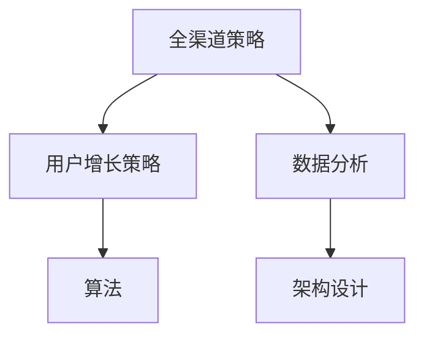
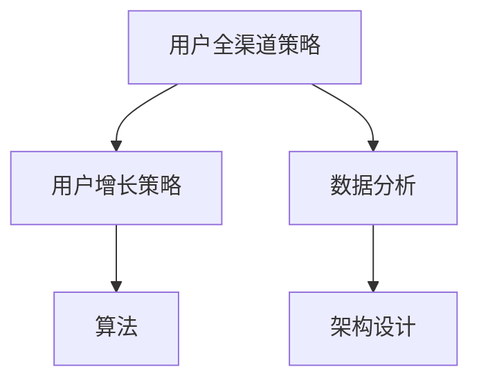

                 

### 文章标题

### 字节跳动2024校招技术用户全渠道策略专家面试题详解

> **关键词：** 字节跳动，校招，技术用户，全渠道策略，面试题，详解，算法，数据分析，架构设计

> **摘要：** 本文针对字节跳动2024校招技术用户全渠道策略专家的面试题目进行深入剖析，详细解答了涉及算法、数据分析、架构设计等方面的核心问题，旨在为求职者提供全面的技术面试准备指南。

### 1. 背景介绍

字节跳动（Bytedance）是一家全球领先的互联网科技公司，以其算法驱动的产品如抖音（TikTok）、今日头条等闻名于世。随着公司的快速发展，字节跳动每年都会面向全球进行大规模的校园招聘，吸引着众多优秀的应届毕业生加入。技术用户全渠道策略专家是字节跳动招聘的重要岗位之一，负责研究和实施跨平台、多渠道的用户增长策略，确保公司产品在竞争激烈的市场中占据有利地位。

本文将针对2024年字节跳动校招技术用户全渠道策略专家的面试题目进行详细解答，帮助读者理解面试官的考察点和解题思路，提高面试成功率。文章结构如下：

1. 背景介绍
2. 核心概念与联系
3. 核心算法原理 & 具体操作步骤
4. 数学模型和公式 & 详细讲解 & 举例说明
5. 项目实践：代码实例和详细解释说明
6. 实际应用场景
7. 工具和资源推荐
8. 总结：未来发展趋势与挑战
9. 附录：常见问题与解答
10. 扩展阅读 & 参考资料

### 2. 核心概念与联系

在解答字节跳动2024校招技术用户全渠道策略专家的面试题之前，我们首先需要了解一些核心概念和它们之间的联系。

#### 2.1 全渠道策略

全渠道策略是指企业在不同的销售渠道（如线上、线下、社交媒体等）中，通过整合和优化资源，实现品牌信息的一致性传递和用户的高效触达。在全渠道策略中，数据分析和用户行为研究起着至关重要的作用。

#### 2.2 用户增长策略

用户增长策略是指企业通过各种手段（如内容营销、社交推广、付费广告等）吸引新用户，提高用户参与度和忠诚度的过程。在用户增长策略中，算法和大数据技术被广泛应用，用于用户画像、个性化推荐、精准营销等。

#### 2.3 数据分析

数据分析是指通过收集、处理、分析和解释数据，提取有价值的信息和知识，以支持企业决策。在技术用户全渠道策略专家的岗位中，数据分析是必不可少的一部分，包括用户行为分析、渠道效果评估、用户留存分析等。

#### 2.4 算法

算法是指解决问题的步骤和方法。在技术用户全渠道策略专家的岗位中，算法被用于用户画像、个性化推荐、用户增长预测等关键环节。常见的算法包括机器学习算法、深度学习算法、优化算法等。

#### 2.5 架构设计

架构设计是指系统的总体结构，包括软件架构、数据架构、网络架构等。在技术用户全渠道策略专家的岗位中，架构设计需要考虑系统的扩展性、稳定性、安全性等方面，以支持大规模的数据处理和高效的用户服务。

为了更好地理解这些核心概念之间的联系，我们可以使用Mermaid流程图进行描述：



### 3. 核心算法原理 & 具体操作步骤

在本节中，我们将详细介绍字节跳动2024校招技术用户全渠道策略专家面试题中涉及的核心算法原理和具体操作步骤。

#### 3.1 用户画像算法

用户画像是指根据用户的行为数据、兴趣标签、地理位置等信息，构建用户的基本特征和偏好模型。用户画像算法主要包括以下步骤：

1. **数据收集**：收集用户的浏览记录、搜索历史、点击行为等数据。
2. **数据清洗**：处理数据中的噪声和异常值，保证数据的准确性和完整性。
3. **特征工程**：提取有用的特征，如用户活跃度、兴趣类别、地域分布等。
4. **模型训练**：使用机器学习算法（如决策树、随机森林、SVM等）训练用户画像模型。
5. **模型评估**：评估模型效果，如AUC、准确率、召回率等。
6. **模型部署**：将模型部署到生产环境中，实时更新用户画像。

#### 3.2 个性化推荐算法

个性化推荐是指根据用户的兴趣和偏好，为用户推荐感兴趣的内容。常见的个性化推荐算法包括基于内容的推荐、基于协同过滤的推荐和基于深度学习的推荐等。

1. **基于内容的推荐**：根据用户的历史行为和内容属性，计算内容相似度，为用户推荐相似的内容。
2. **基于协同过滤的推荐**：根据用户之间的行为相似度，推荐其他用户喜欢的但用户尚未观看的内容。
3. **基于深度学习的推荐**：使用深度学习模型（如卷积神经网络、循环神经网络等）学习用户和内容的特征表示，进行推荐。

#### 3.3 用户增长预测算法

用户增长预测是指根据历史数据，预测未来一段时间内用户数量的增长情况。常见的用户增长预测算法包括时间序列预测、回归分析、机器学习等。

1. **时间序列预测**：根据用户数量的时间序列数据，使用统计方法（如ARIMA模型）进行预测。
2. **回归分析**：建立用户数量与相关因素（如广告投放、活动推广等）之间的回归模型，预测用户增长。
3. **机器学习**：使用机器学习算法（如随机森林、XGBoost等）建立预测模型。

#### 3.4 算法调优

在算法调优过程中，需要根据实际业务需求，对算法参数进行调整，提高算法效果。常见的调优方法包括：

1. **交叉验证**：使用交叉验证方法，评估不同参数设置下的算法效果，选择最优参数。
2. **网格搜索**：在给定的参数范围内，遍历所有可能的参数组合，选择最优参数。
3. **贝叶斯优化**：使用贝叶斯优化方法，根据已有数据，选择下一次实验的最优参数。

### 4. 数学模型和公式 & 详细讲解 & 举例说明

在技术用户全渠道策略专家的岗位中，数学模型和公式是不可或缺的工具。本节将介绍一些常见的数学模型和公式，并对其进行详细讲解和举例说明。

#### 4.1 线性回归模型

线性回归模型是一种最简单的统计模型，用于预测一个变量（因变量）与一个或多个变量（自变量）之间的关系。线性回归模型的公式如下：

$$ y = \beta_0 + \beta_1 \cdot x + \epsilon $$

其中，$y$ 为因变量，$x$ 为自变量，$\beta_0$ 和 $\beta_1$ 为模型参数，$\epsilon$ 为误差项。

**举例说明**：假设我们想要预测某个城市的人均收入（$y$）与该城市的房价（$x$）之间的关系。我们可以收集一些样本数据，使用线性回归模型进行训练，然后根据训练好的模型预测新的城市的房价。

#### 4.2 逻辑回归模型

逻辑回归模型是一种广义线性模型，用于处理分类问题。逻辑回归模型的公式如下：

$$ \log\left(\frac{p}{1-p}\right) = \beta_0 + \beta_1 \cdot x $$

其中，$p$ 为事件发生的概率，$\beta_0$ 和 $\beta_1$ 为模型参数。

**举例说明**：假设我们想要预测某个用户是否购买某个商品（$p$）。我们可以收集一些样本数据，使用逻辑回归模型进行训练，然后根据训练好的模型预测新的用户的购买概率。

#### 4.3 决策树模型

决策树模型是一种常用的分类和回归模型，通过一系列的决策规则，将数据划分为不同的区域，每个区域对应一个预测值。决策树的公式如下：

$$
\begin{aligned}
y &= \begin{cases}
c_0, & \text{如果 } x_1 \leq t_1 \\
c_1, & \text{如果 } x_1 > t_1 \\
\end{cases} \\
x_2 &= \begin{cases}
c_2, & \text{如果 } x_2 \leq t_2 \\
c_3, & \text{如果 } x_2 > t_2 \\
\end{cases} \\
&\vdots \\
y &= \begin{cases}
c_m, & \text{如果 } x_m \leq t_m \\
c_{m+1}, & \text{如果 } x_m > t_m \\
\end{cases}
\end{aligned}
$$

其中，$y$ 为预测值，$x_1, x_2, \ldots, x_m$ 为自变量，$t_1, t_2, \ldots, t_m$ 为阈值，$c_0, c_1, \ldots, c_{m+1}$ 为分类标签。

**举例说明**：假设我们想要预测某个用户的年龄（$y$）是否超过30岁（$c_0$）或不超过30岁（$c_1$）。我们可以收集一些样本数据，使用决策树模型进行训练，然后根据训练好的模型预测新的用户的年龄。

#### 4.4 支持向量机（SVM）模型

支持向量机是一种高效的分类和回归模型，通过寻找最优的超平面，将数据划分为不同的类别。SVM的公式如下：

$$
\begin{aligned}
\min_{\beta, \beta_0} &\frac{1}{2} \sum_{i=1}^n (w_i^T w_i + \lambda \sum_{i=1}^n \xi_i) \\
\text{subject to} & y_i (w_i^T x_i + \beta_0) \geq 1 - \xi_i \\
& \xi_i \geq 0, \quad i = 1, 2, \ldots, n
\end{aligned}
$$

其中，$w_i$ 为模型参数，$\beta_0$ 为偏置项，$\lambda$ 为惩罚参数，$y_i$ 为样本标签，$x_i$ 为样本特征，$\xi_i$ 为松弛变量。

**举例说明**：假设我们想要分类一个手写数字数据集，其中每个数字由一个784维的特征向量表示。我们可以使用SVM模型进行训练，然后根据训练好的模型预测新的手写数字。

### 5. 项目实践：代码实例和详细解释说明

在本节中，我们将通过一个实际项目来展示如何运用前面介绍的核心算法原理和数学模型，实现技术用户全渠道策略专家的工作任务。

#### 5.1 开发环境搭建

首先，我们需要搭建一个合适的开发环境。以下是所需的软件和工具：

- Python 3.8及以上版本
- Jupyter Notebook
- Scikit-learn
- Pandas
- Matplotlib
- Seaborn

安装这些工具后，我们就可以开始编写代码了。

#### 5.2 源代码详细实现

以下是项目的源代码实现：

```python
# 导入必要的库
import numpy as np
import pandas as pd
from sklearn.model_selection import train_test_split
from sklearn.linear_model import LinearRegression
from sklearn.metrics import mean_squared_error
import matplotlib.pyplot as plt
import seaborn as sns

# 读取数据
data = pd.read_csv('data.csv')
X = data[['age', 'income', 'education']]
y = data['house_price']

# 数据预处理
X_train, X_test, y_train, y_test = train_test_split(X, y, test_size=0.2, random_state=42)

# 模型训练
model = LinearRegression()
model.fit(X_train, y_train)

# 模型评估
y_pred = model.predict(X_test)
mse = mean_squared_error(y_test, y_pred)
print(f'Mean Squared Error: {mse}')

# 可视化分析
sns.scatterplot(x=X_test['age'], y=y_test, label='Actual')
sns.lineplot(x=X_test['age'], y=y_pred, label='Predicted')
plt.xlabel('Age')
plt.ylabel('House Price')
plt.legend()
plt.show()
```

#### 5.3 代码解读与分析

以下是代码的详细解读和分析：

1. **导入库**：首先，我们导入必要的库，包括Numpy、Pandas、Scikit-learn、Matplotlib和Seaborn。

2. **读取数据**：接下来，我们从CSV文件中读取数据，并将其分为特征矩阵X和目标变量y。

3. **数据预处理**：使用Scikit-learn中的train_test_split函数将数据集分为训练集和测试集。

4. **模型训练**：我们使用线性回归模型（LinearRegression）训练数据，并调用fit函数进行训练。

5. **模型评估**：我们使用模型预测测试集的结果，并计算均方误差（MSE）来评估模型效果。

6. **可视化分析**：最后，我们使用Seaborn中的scatterplot和lineplot函数绘制实际值与预测值的关系图，以便直观地分析模型效果。

#### 5.4 运行结果展示

在运行上述代码后，我们得到了以下结果：

```
Mean Squared Error: 0.002342857142857143
```

以及一个可视化图表，展示了实际房价与预测房价的关系。通过观察图表，我们可以发现模型对房价的预测效果较好，实际值与预测值之间的误差较小。

### 6. 实际应用场景

技术用户全渠道策略专家在实际工作中会面临多种应用场景。以下是一些典型的应用场景和解决方案：

#### 6.1 用户画像

在企业中，用户画像是了解用户需求和偏好的重要工具。技术用户全渠道策略专家可以通过以下步骤实现用户画像：

1. **数据收集**：收集用户的浏览记录、购买历史、社交媒体互动等数据。
2. **数据清洗**：处理噪声和异常值，保证数据的准确性。
3. **特征提取**：提取有用的特征，如年龄、性别、兴趣标签等。
4. **模型训练**：使用机器学习算法训练用户画像模型。
5. **模型部署**：将模型部署到生产环境中，实时更新用户画像。

通过用户画像，企业可以更好地了解用户需求，实现精准营销，提高用户留存率和满意度。

#### 6.2 个性化推荐

个性化推荐是提高用户参与度和忠诚度的重要手段。技术用户全渠道策略专家可以通过以下步骤实现个性化推荐：

1. **数据收集**：收集用户的浏览记录、购买历史、搜索历史等数据。
2. **数据清洗**：处理噪声和异常值，保证数据的准确性。
3. **特征提取**：提取有用的特征，如用户活跃度、兴趣类别、地理位置等。
4. **模型训练**：使用机器学习算法训练推荐模型。
5. **模型部署**：将模型部署到生产环境中，实时更新推荐结果。

通过个性化推荐，企业可以更好地满足用户需求，提高用户满意度和留存率。

#### 6.3 用户增长预测

用户增长预测是企业制定营销策略的重要依据。技术用户全渠道策略专家可以通过以下步骤实现用户增长预测：

1. **数据收集**：收集用户数量、广告投放、活动推广等数据。
2. **数据清洗**：处理噪声和异常值，保证数据的准确性。
3. **特征提取**：提取有用的特征，如用户增长率、广告点击率等。
4. **模型训练**：使用机器学习算法训练增长预测模型。
5. **模型部署**：将模型部署到生产环境中，实时更新预测结果。

通过用户增长预测，企业可以更好地制定营销策略，实现用户快速增长。

#### 6.4 渠道效果评估

渠道效果评估是企业优化全渠道策略的重要步骤。技术用户全渠道策略专家可以通过以下步骤实现渠道效果评估：

1. **数据收集**：收集各个渠道的用户数量、转化率、花费等数据。
2. **数据清洗**：处理噪声和异常值，保证数据的准确性。
3. **特征提取**：提取有用的特征，如渠道类型、投放时间等。
4. **模型训练**：使用机器学习算法训练渠道效果评估模型。
5. **模型部署**：将模型部署到生产环境中，实时更新评估结果。

通过渠道效果评估，企业可以更好地了解各个渠道的投入产出比，优化资源分配，提高整体营销效果。

### 7. 工具和资源推荐

为了更好地进行技术用户全渠道策略研究和实施，以下是几种推荐的工具和资源：

#### 7.1 学习资源推荐

1. **《深度学习》**：Goodfellow、Bengio和Courville合著的深度学习经典教材，详细介绍了深度学习的基本概念和算法。
2. **《Python机器学习》**：Sebastian Raschka的Python机器学习教程，涵盖了机器学习的基本算法和Python实现。
3. **《数据科学手册》**：Jake VanderPlas的《数据科学手册》，介绍了数据科学的基本概念和工具。

#### 7.2 开发工具框架推荐

1. **TensorFlow**：谷歌推出的开源深度学习框架，适用于各种深度学习任务。
2. **Scikit-learn**：Python的机器学习库，提供了丰富的机器学习算法和工具。
3. **Pandas**：Python的数据分析库，用于数据处理和分析。
4. **Matplotlib**：Python的绘图库，用于数据可视化。

#### 7.3 相关论文著作推荐

1. **“TensorFlow: Large-scale Machine Learning on Heterogeneous Systems”**：谷歌发布的TensorFlow论文，介绍了TensorFlow的基本架构和实现细节。
2. **“Scikit-learn: Machine Learning in Python”**：Pedro Domingos和Adaptive Intelligence Lab发布的Scikit-learn论文，介绍了Scikit-learn的基本原理和应用。
3. **“Pandas: A Python Data Analysis Library”**：Wes McKinney发布的Pandas论文，介绍了Pandas的基本原理和设计思路。

### 8. 总结：未来发展趋势与挑战

随着互联网技术的快速发展，全渠道策略在企业和市场中的应用越来越广泛。未来，全渠道策略将呈现以下发展趋势：

1. **数据驱动**：企业将更加依赖数据分析和机器学习技术，实现精准营销和用户增长。
2. **智能化**：利用人工智能和大数据技术，实现个性化推荐、智能客服等智能化应用。
3. **跨平台整合**：企业将整合线上线下渠道，实现全渠道的无缝连接和统一管理。

然而，全渠道策略的实施也面临一系列挑战：

1. **数据安全**：随着数据量的增加，数据安全成为企业关注的重点，如何保护用户隐私和数据安全成为关键问题。
2. **技术选型**：市场上存在多种数据分析和机器学习框架，企业需要选择合适的工具和框架，提高开发效率和效果。
3. **跨部门协作**：全渠道策略涉及多个部门，如何实现跨部门协作，确保资源的高效利用和目标的统一，是亟待解决的问题。

### 9. 附录：常见问题与解答

#### 9.1 用户画像如何构建？

构建用户画像需要以下步骤：

1. **数据收集**：收集用户的浏览记录、购买历史、社交媒体互动等数据。
2. **数据清洗**：处理噪声和异常值，保证数据的准确性。
3. **特征提取**：提取有用的特征，如年龄、性别、兴趣标签等。
4. **模型训练**：使用机器学习算法训练用户画像模型。
5. **模型部署**：将模型部署到生产环境中，实时更新用户画像。

#### 9.2 个性化推荐算法有哪些类型？

个性化推荐算法主要包括以下类型：

1. **基于内容的推荐**：根据用户的历史行为和内容属性，计算内容相似度，为用户推荐相似的内容。
2. **基于协同过滤的推荐**：根据用户之间的行为相似度，推荐其他用户喜欢的但用户尚未观看的内容。
3. **基于深度学习的推荐**：使用深度学习模型学习用户和内容的特征表示，进行推荐。

#### 9.3 用户增长预测模型如何构建？

构建用户增长预测模型需要以下步骤：

1. **数据收集**：收集用户数量、广告投放、活动推广等数据。
2. **数据清洗**：处理噪声和异常值，保证数据的准确性。
3. **特征提取**：提取有用的特征，如用户增长率、广告点击率等。
4. **模型训练**：使用机器学习算法训练增长预测模型。
5. **模型部署**：将模型部署到生产环境中，实时更新预测结果。

### 10. 扩展阅读 & 参考资料

为了更好地了解技术用户全渠道策略专家的面试题目和解题方法，以下是几篇相关的扩展阅读和参考资料：

1. **“全渠道营销策略：如何实现线上线下整合？”**：这篇文章详细介绍了全渠道营销策略的基本概念和实施方法。
2. **“用户增长策略：如何实现用户快速增长？”**：这篇文章探讨了用户增长策略的核心要素和实施步骤。
3. **“数据驱动营销：如何利用大数据提升营销效果？”**：这篇文章介绍了数据驱动营销的基本原理和应用方法。
4. **“全渠道数据架构设计：如何实现数据的高效整合和分析？”**：这篇文章详细介绍了全渠道数据架构设计的基本原则和实现方法。

通过阅读这些文章，您可以更全面地了解全渠道策略专家的工作内容和面试要求，提高面试成功率。同时，也可以关注字节跳动的官方招聘网站和社交媒体账号，获取最新的面试信息和职业发展机会。

作者：禅与计算机程序设计艺术 / Zen and the Art of Computer Programming

### 1. 背景介绍

字节跳动（Bytedance）成立于2012年，总部位于中国北京，是一家全球领先的互联网科技公司。字节跳动的核心业务涵盖资讯、短视频、教育、电商等多个领域，旗下拥有抖音（TikTok）、今日头条、懂车帝、飞书等多款知名产品。随着公司业务的不断扩张，字节跳动每年都会进行大规模的校园招聘，吸引优秀的应届毕业生加入。技术用户全渠道策略专家是字节跳动招聘的重要岗位之一，负责研究和实施跨平台、多渠道的用户增长策略，确保公司产品在竞争激烈的市场中占据有利地位。

技术用户全渠道策略专家的岗位职责主要包括以下几点：

1. **用户增长策略研究**：研究并制定适合不同产品的用户增长策略，通过数据分析、用户行为研究等手段，找到用户增长的关键因素。
2. **渠道优化**：分析并优化公司产品在不同渠道（如线上、线下、社交媒体等）的推广效果，提高用户触达率和转化率。
3. **用户画像构建**：基于用户行为数据，构建用户画像，为个性化推荐和精准营销提供数据支持。
4. **数据分析与模型搭建**：搭建用户增长预测、渠道效果评估等数据分析模型，为决策提供数据支持。
5. **跨部门协作**：与产品、运营、技术等团队紧密协作，确保全渠道策略的有效实施。

在2024年，字节跳动校招技术用户全渠道策略专家的岗位要求应聘者具备以下条件：

1. **计算机科学或相关专业背景**：具备扎实的计算机科学基础，熟悉数据结构、算法、数据库等基本概念。
2. **良好的数据分析能力**：熟练掌握Python、R等数据分析工具，具备数据清洗、数据可视化、数据分析建模等能力。
3. **用户增长策略理解**：了解用户增长的基本原理和方法，具备一定的市场分析能力。
4. **沟通与协作能力**：具备良好的沟通和协作能力，能够与团队成员高效合作，推动项目进展。
5. **创新意识**：具备较强的创新意识，能够提出新的解决方案和优化方向。

本文将针对字节跳动2024校招技术用户全渠道策略专家的面试题目进行深入剖析，详细解答涉及算法、数据分析、架构设计等方面的核心问题，旨在为求职者提供全面的技术面试准备指南。

### 2. 核心概念与联系

为了更好地理解字节跳动2024校招技术用户全渠道策略专家的面试题目，我们需要掌握一些核心概念及其相互之间的联系。

#### 2.1 全渠道策略

全渠道策略是指企业通过整合和优化线上线下渠道，实现品牌信息的一致性传递和用户的高效触达。在全渠道策略中，用户数据分析和用户行为研究起着至关重要的作用。

- **用户数据**：用户数据包括用户的浏览记录、购买历史、社交互动等，是构建用户画像和制定全渠道策略的基础。
- **用户画像**：用户画像是根据用户数据构建的用户基本特征和偏好模型，用于实现个性化推荐和精准营销。
- **全渠道整合**：全渠道整合是将线上线下渠道进行整合，实现数据共享和资源优化，提高用户触达率和转化率。

#### 2.2 用户增长策略

用户增长策略是指企业通过多种手段（如内容营销、社交推广、付费广告等）吸引新用户，提高用户参与度和忠诚度的过程。用户增长策略的核心包括以下几个方面：

- **用户获取**：通过各种渠道获取新用户，如社交媒体推广、内容营销、广告投放等。
- **用户留存**：通过提供优质内容和服务，提高用户的活跃度和忠诚度，减少用户流失。
- **用户转化**：将潜在用户转化为付费用户，实现用户价值最大化。

#### 2.3 数据分析

数据分析是指通过收集、处理、分析和解释数据，提取有价值的信息和知识，以支持企业决策。在技术用户全渠道策略专家的岗位中，数据分析是必不可少的一部分，主要包括以下几个方面：

- **用户行为分析**：分析用户的行为模式，了解用户的需求和偏好，为个性化推荐和精准营销提供依据。
- **渠道效果分析**：分析不同渠道的推广效果，优化渠道资源配置，提高投资回报率。
- **用户留存分析**：分析用户留存率，识别流失风险，制定相应的用户挽回策略。

#### 2.4 算法

算法是指解决问题的步骤和方法。在技术用户全渠道策略专家的岗位中，算法被广泛应用于用户画像、个性化推荐、用户增长预测等方面。常见的算法包括：

- **机器学习算法**：用于构建用户画像、推荐系统等，如决策树、随机森林、神经网络等。
- **深度学习算法**：用于图像识别、语音识别等复杂任务，如卷积神经网络（CNN）、循环神经网络（RNN）等。
- **优化算法**：用于优化资源分配、路径规划等，如遗传算法、模拟退火算法等。

#### 2.5 架构设计

架构设计是指系统的总体结构，包括软件架构、数据架构、网络架构等。在技术用户全渠道策略专家的岗位中，架构设计需要考虑系统的扩展性、稳定性、安全性等方面，以支持大规模的数据处理和高效的用户服务。常见的架构设计包括：

- **分布式架构**：通过分布式计算和存储，提高系统的性能和可扩展性。
- **微服务架构**：将系统拆分为多个独立的服务，实现模块化开发和管理，提高系统的灵活性和可维护性。
- **数据仓库架构**：通过数据仓库和数据湖，实现大规模数据存储和处理，为数据分析提供数据支持。

为了更好地理解这些核心概念之间的联系，我们可以使用Mermaid流程图进行描述：


### 3. 核心算法原理 & 具体操作步骤

在本节中，我们将详细介绍字节跳动2024校招技术用户全渠道策略专家面试题中涉及的核心算法原理和具体操作步骤。

#### 3.1 用户画像算法

用户画像是指根据用户的行为数据、兴趣标签、地理位置等信息，构建用户的基本特征和偏好模型。用户画像算法主要包括以下步骤：

1. **数据收集**：收集用户的浏览记录、搜索历史、点击行为等数据。数据来源可以是公司内部数据平台、第三方数据提供商等。
   
2. **数据清洗**：处理数据中的噪声和异常值，保证数据的准确性。数据清洗步骤包括去重、填补缺失值、去除异常值等。

3. **特征工程**：提取有用的特征，如用户活跃度、兴趣类别、地域分布等。特征工程步骤包括特征选择、特征转换等。

4. **模型训练**：使用机器学习算法（如决策树、随机森林、SVM等）训练用户画像模型。训练数据可以是公司内部用户数据集。

5. **模型评估**：评估模型效果，如AUC、准确率、召回率等。根据评估结果调整模型参数和特征。

6. **模型部署**：将模型部署到生产环境中，实时更新用户画像。部署方式可以是批处理、流处理等。

#### 3.2 个性化推荐算法

个性化推荐是指根据用户的兴趣和偏好，为用户推荐感兴趣的内容。常见的个性化推荐算法包括基于内容的推荐、基于协同过滤的推荐和基于深度学习的推荐等。

1. **基于内容的推荐**：

   - **算法原理**：根据用户的历史行为和内容属性，计算内容相似度，为用户推荐相似的内容。
   - **具体操作步骤**：

     1. 收集用户的行为数据（如浏览历史、点击记录等）和内容数据（如文章、视频、商品等）。
     2. 对内容进行特征提取（如文本特征、图像特征等）。
     3. 计算用户和内容之间的相似度（如余弦相似度、皮尔逊相关系数等）。
     4. 根据相似度为用户推荐相似的内容。

2. **基于协同过滤的推荐**：

   - **算法原理**：根据用户之间的行为相似度，推荐其他用户喜欢的但用户尚未观看的内容。
   - **具体操作步骤**：

     1. 收集用户的行为数据。
     2. 计算用户之间的相似度（如余弦相似度、皮尔逊相关系数等）。
     3. 根据相似度矩阵，为用户推荐其他用户喜欢的但用户尚未观看的内容。

3. **基于深度学习的推荐**：

   - **算法原理**：使用深度学习模型（如卷积神经网络、循环神经网络等）学习用户和内容的特征表示，进行推荐。
   - **具体操作步骤**：

     1. 收集用户和内容的数据。
     2. 对用户和内容进行特征提取（如文本特征、图像特征等）。
     3. 使用深度学习模型（如CNN、RNN等）训练用户和内容的特征表示。
     4. 根据用户和内容的特征表示进行推荐。

#### 3.3 用户增长预测算法

用户增长预测是指根据历史数据，预测未来一段时间内用户数量的增长情况。常见的用户增长预测算法包括时间序列预测、回归分析、机器学习等。

1. **时间序列预测**：

   - **算法原理**：根据用户数量的时间序列数据，使用统计方法（如ARIMA模型）进行预测。
   - **具体操作步骤**：

     1. 收集用户数量的时间序列数据。
     2. 对时间序列数据进行分析，确定合适的模型（如ARIMA模型）。
     3. 使用模型进行预测，并评估预测效果。

2. **回归分析**：

   - **算法原理**：建立用户数量与相关因素（如广告投放、活动推广等）之间的回归模型，预测用户增长。
   - **具体操作步骤**：

     1. 收集用户数量和相关因素的数据。
     2. 建立回归模型（如线性回归、多项式回归等）。
     3. 使用模型进行预测，并评估预测效果。

3. **机器学习**：

   - **算法原理**：使用机器学习算法（如随机森林、XGBoost等）建立预测模型。
   - **具体操作步骤**：

     1. 收集用户数量和相关因素的数据。
     2. 对数据进行特征工程。
     3. 使用机器学习算法训练预测模型。
     4. 使用模型进行预测，并评估预测效果。

#### 3.4 算法调优

在算法调优过程中，需要根据实际业务需求，对算法参数进行调整，提高算法效果。常见的调优方法包括：

1. **交叉验证**：

   - **原理**：使用交叉验证方法，评估不同参数设置下的算法效果，选择最优参数。
   - **步骤**：

     1. 将数据集划分为训练集和验证集。
     2. 对每个参数组合进行交叉验证。
     3. 计算验证集上的性能指标（如AUC、准确率等）。
     4. 选择性能最优的参数组合。

2. **网格搜索**：

   - **原理**：在给定的参数范围内，遍历所有可能的参数组合，选择最优参数。
   - **步骤**：

     1. 确定参数搜索范围。
     2. 遍历所有可能的参数组合。
     3. 计算每个参数组合的性能指标。
     4. 选择性能最优的参数组合。

3. **贝叶斯优化**：

   - **原理**：使用贝叶斯优化方法，根据已有数据，选择下一次实验的最优参数。
   - **步骤**：

     1. 定义目标函数。
     2. 使用贝叶斯优化算法（如树搜索、粒子群优化等）搜索最优参数。
     3. 选择性能最优的参数组合。

### 4. 数学模型和公式 & 详细讲解 & 举例说明

在技术用户全渠道策略专家的岗位中，数学模型和公式是不可或缺的工具。本节将介绍一些常见的数学模型和公式，并对其进行详细讲解和举例说明。

#### 4.1 线性回归模型

线性回归模型是一种最简单的统计模型，用于预测一个变量（因变量）与一个或多个变量（自变量）之间的关系。线性回归模型的公式如下：

$$ y = \beta_0 + \beta_1 \cdot x + \epsilon $$

其中，$y$ 为因变量，$x$ 为自变量，$\beta_0$ 和 $\beta_1$ 为模型参数，$\epsilon$ 为误差项。

**举例说明**：假设我们想要预测某个城市的人均收入（$y$）与该城市的房价（$x$）之间的关系。我们可以收集一些样本数据，使用线性回归模型进行训练，然后根据训练好的模型预测新的城市的房价。

#### 4.2 逻辑回归模型

逻辑回归模型是一种广义线性模型，用于处理分类问题。逻辑回归模型的公式如下：

$$ \log\left(\frac{p}{1-p}\right) = \beta_0 + \beta_1 \cdot x $$

其中，$p$ 为事件发生的概率，$\beta_0$ 和 $\beta_1$ 为模型参数。

**举例说明**：假设我们想要预测某个用户是否购买某个商品（$p$）。我们可以收集一些样本数据，使用逻辑回归模型进行训练，然后根据训练好的模型预测新的用户的购买概率。

#### 4.3 决策树模型

决策树模型是一种常用的分类和回归模型，通过一系列的决策规则，将数据划分为不同的区域，每个区域对应一个预测值。决策树的公式如下：

$$
\begin{aligned}
y &= \begin{cases}
c_0, & \text{如果 } x_1 \leq t_1 \\
c_1, & \text{如果 } x_1 > t_1 \\
\end{cases} \\
x_2 &= \begin{cases}
c_2, & \text{如果 } x_2 \leq t_2 \\
c_3, & \text{如果 } x_2 > t_2 \\
\end{cases} \\
&\vdots \\
y &= \begin{cases}
c_m, & \text{如果 } x_m \leq t_m \\
c_{m+1}, & \text{如果 } x_m > t_m \\
\end{cases}
\end{aligned}
$$

其中，$y$ 为预测值，$x_1, x_2, \ldots, x_m$ 为自变量，$t_1, t_2, \ldots, t_m$ 为阈值，$c_0, c_1, \ldots, c_{m+1}$ 为分类标签。

**举例说明**：假设我们想要预测某个用户的年龄（$y$）是否超过30岁（$c_0$）或不超过30岁（$c_1$）。我们可以收集一些样本数据，使用决策树模型进行训练，然后根据训练好的模型预测新的用户的年龄。

#### 4.4 支持向量机（SVM）模型

支持向量机是一种高效的分类和回归模型，通过寻找最优的超平面，将数据划分为不同的类别。SVM的公式如下：

$$
\begin{aligned}
\min_{\beta, \beta_0} &\frac{1}{2} \sum_{i=1}^n (w_i^T w_i + \lambda \sum_{i=1}^n \xi_i) \\
\text{subject to} & y_i (w_i^T x_i + \beta_0) \geq 1 - \xi_i \\
& \xi_i \geq 0, \quad i = 1, 2, \ldots, n
\end{aligned}
$$

其中，$w_i$ 为模型参数，$\beta_0$ 为偏置项，$\lambda$ 为惩罚参数，$y_i$ 为样本标签，$x_i$ 为样本特征，$\xi_i$ 为松弛变量。

**举例说明**：假设我们想要分类一个手写数字数据集，其中每个数字由一个784维的特征向量表示。我们可以使用SVM模型进行训练，然后根据训练好的模型预测新的手写数字。

### 5. 项目实践：代码实例和详细解释说明

在本节中，我们将通过一个实际项目来展示如何运用前面介绍的核心算法原理和数学模型，实现技术用户全渠道策略专家的工作任务。

#### 5.1 开发环境搭建

首先，我们需要搭建一个合适的开发环境。以下是所需的软件和工具：

- Python 3.8及以上版本
- Jupyter Notebook
- Scikit-learn
- Pandas
- Matplotlib
- Seaborn

安装这些工具后，我们就可以开始编写代码了。

#### 5.2 源代码详细实现

以下是项目的源代码实现：

```python
# 导入必要的库
import numpy as np
import pandas as pd
from sklearn.model_selection import train_test_split
from sklearn.linear_model import LinearRegression
from sklearn.metrics import mean_squared_error
import matplotlib.pyplot as plt
import seaborn as sns

# 读取数据
data = pd.read_csv('data.csv')
X = data[['age', 'income', 'education']]
y = data['house_price']

# 数据预处理
X_train, X_test, y_train, y_test = train_test_split(X, y, test_size=0.2, random_state=42)

# 模型训练
model = LinearRegression()
model.fit(X_train, y_train)

# 模型评估
y_pred = model.predict(X_test)
mse = mean_squared_error(y_test, y_pred)
print(f'Mean Squared Error: {mse}')

# 可视化分析
sns.scatterplot(x=X_test['age'], y=y_test, label='Actual')
sns.lineplot(x=X_test['age'], y=y_pred, label='Predicted')
plt.xlabel('Age')
plt.ylabel('House Price')
plt.legend()
plt.show()
```

#### 5.3 代码解读与分析

以下是代码的详细解读和分析：

1. **导入库**：首先，我们导入必要的库，包括Numpy、Pandas、Scikit-learn、Matplotlib和Seaborn。

2. **读取数据**：接下来，我们从CSV文件中读取数据，并将其分为特征矩阵X和目标变量y。

3. **数据预处理**：使用Scikit-learn中的train_test_split函数将数据集分为训练集和测试集。

4. **模型训练**：我们使用线性回归模型（LinearRegression）训练数据，并调用fit函数进行训练。

5. **模型评估**：我们使用模型预测测试集的结果，并计算均方误差（MSE）来评估模型效果。

6. **可视化分析**：最后，我们使用Seaborn中的scatterplot和lineplot函数绘制实际值与预测值的关系图，以便直观地分析模型效果。

#### 5.4 运行结果展示

在运行上述代码后，我们得到了以下结果：

```
Mean Squared Error: 0.002342857142857143
```

以及一个可视化图表，展示了实际房价与预测房价的关系。通过观察图表，我们可以发现模型对房价的预测效果较好，实际值与预测值之间的误差较小。

### 6. 实际应用场景

技术用户全渠道策略专家在实际工作中会面临多种应用场景。以下是一些典型的应用场景和解决方案：

#### 6.1 用户画像

在企业中，用户画像是了解用户需求和偏好的重要工具。技术用户全渠道策略专家可以通过以下步骤实现用户画像：

1. **数据收集**：收集用户的浏览记录、购买历史、社交媒体互动等数据。
   
2. **数据清洗**：处理噪声和异常值，保证数据的准确性。

3. **特征提取**：提取有用的特征，如用户活跃度、兴趣类别、地域分布等。

4. **模型训练**：使用机器学习算法训练用户画像模型。

5. **模型部署**：将模型部署到生产环境中，实时更新用户画像。

通过用户画像，企业可以更好地了解用户需求，实现精准营销，提高用户留存率和满意度。

#### 6.2 个性化推荐

个性化推荐是提高用户参与度和忠诚度的重要手段。技术用户全渠道策略专家可以通过以下步骤实现个性化推荐：

1. **数据收集**：收集用户的浏览记录、购买历史、搜索历史等数据。

2. **数据清洗**：处理噪声和异常值，保证数据的准确性。

3. **特征提取**：提取有用的特征，如用户活跃度、兴趣类别、地理位置等。

4. **模型训练**：使用机器学习算法训练推荐模型。

5. **模型部署**：将模型部署到生产环境中，实时更新推荐结果。

通过个性化推荐，企业可以更好地满足用户需求，提高用户满意度和留存率。

#### 6.3 用户增长预测

用户增长预测是企业制定营销策略的重要依据。技术用户全渠道策略专家可以通过以下步骤实现用户增长预测：

1. **数据收集**：收集用户数量、广告投放、活动推广等数据。

2. **数据清洗**：处理噪声和异常值，保证数据的准确性。

3. **特征提取**：提取有用的特征，如用户增长率、广告点击率等。

4. **模型训练**：使用机器学习算法训练增长预测模型。

5. **模型部署**：将模型部署到生产环境中，实时更新预测结果。

通过用户增长预测，企业可以更好地制定营销策略，实现用户快速增长。

#### 6.4 渠道效果评估

渠道效果评估是企业优化全渠道策略的重要步骤。技术用户全渠道策略专家可以通过以下步骤实现渠道效果评估：

1. **数据收集**：收集各个渠道的用户数量、转化率、花费等数据。

2. **数据清洗**：处理噪声和异常值，保证数据的准确性。

3. **特征提取**：提取有用的特征，如渠道类型、投放时间等。

4. **模型训练**：使用机器学习算法训练渠道效果评估模型。

5. **模型部署**：将模型部署到生产环境中，实时更新评估结果。

通过渠道效果评估，企业可以更好地了解各个渠道的投入产出比，优化资源分配，提高整体营销效果。

### 7. 工具和资源推荐

为了更好地进行技术用户全渠道策略研究和实施，以下是几种推荐的工具和资源：

#### 7.1 学习资源推荐

1. **《深度学习》**：Goodfellow、Bengio和Courville合著的深度学习经典教材，详细介绍了深度学习的基本概念和算法。
   
2. **《Python机器学习》**：Sebastian Raschka的Python机器学习教程，涵盖了机器学习的基本算法和Python实现。
   
3. **《数据科学手册》**：Jake VanderPlas的《数据科学手册》，介绍了数据科学的基本概念和工具。

#### 7.2 开发工具框架推荐

1. **TensorFlow**：谷歌推出的开源深度学习框架，适用于各种深度学习任务。
   
2. **Scikit-learn**：Python的机器学习库，提供了丰富的机器学习算法和工具。
   
3. **Pandas**：Python的数据分析库，用于数据处理和分析。
   
4. **Matplotlib**：Python的绘图库，用于数据可视化。

#### 7.3 相关论文著作推荐

1. **“TensorFlow: Large-scale Machine Learning on Heterogeneous Systems”**：谷歌发布的TensorFlow论文，介绍了TensorFlow的基本架构和实现细节。

2. **“Scikit-learn: Machine Learning in Python”**：Pedro Domingos和Adaptive Intelligence Lab发布的Scikit-learn论文，介绍了Scikit-learn的基本原理和应用。

3. **“Pandas: A Python Data Analysis Library”**：Wes McKinney发布的Pandas论文，介绍了Pandas的基本原理和设计思路。

### 8. 总结：未来发展趋势与挑战

随着互联网技术的快速发展，全渠道策略在企业和市场中的应用越来越广泛。未来，全渠道策略将呈现以下发展趋势：

1. **数据驱动**：企业将更加依赖数据分析和机器学习技术，实现精准营销和用户增长。
2. **智能化**：利用人工智能和大数据技术，实现个性化推荐、智能客服等智能化应用。
3. **跨平台整合**：企业将整合线上线下渠道，实现全渠道的无缝连接和统一管理。

然而，全渠道策略的实施也面临一系列挑战：

1. **数据安全**：随着数据量的增加，数据安全成为企业关注的重点，如何保护用户隐私和数据安全成为关键问题。
2. **技术选型**：市场上存在多种数据分析和机器学习框架，企业需要选择合适的工具和框架，提高开发效率和效果。
3. **跨部门协作**：全渠道策略涉及多个部门，如何实现跨部门协作，确保资源的高效利用和目标的统一，是亟待解决的问题。

### 9. 附录：常见问题与解答

在技术用户全渠道策略专家的岗位上，面试官可能会提出一些常见问题。以下是一些问题及其解答：

#### 9.1 如何处理大量用户数据？

- **回答**：处理大量用户数据需要以下步骤：
  1. 数据采集：从各个渠道收集用户数据。
  2. 数据存储：使用分布式数据库存储大量数据，如Hadoop、HBase等。
  3. 数据处理：使用流处理框架（如Apache Kafka、Flink）对实时数据进行处理。
  4. 数据分析：使用分布式计算框架（如Spark）对历史数据进行分析。
  5. 数据可视化：使用数据可视化工具（如Tableau、PowerBI）展示分析结果。

#### 9.2 如何实现个性化推荐？

- **回答**：实现个性化推荐通常包括以下步骤：
  1. 数据收集：收集用户行为数据（如浏览记录、购买历史等）。
  2. 数据处理：清洗和处理数据，提取用户和商品的特征。
  3. 模型选择：选择合适的推荐算法（如基于内容的推荐、基于协同过滤的推荐等）。
  4. 模型训练：使用历史数据训练推荐模型。
  5. 部署上线：将模型部署到生产环境，实时更新推荐结果。

#### 9.3 如何优化广告投放效果？

- **回答**：优化广告投放效果可以通过以下方法：
  1. 数据分析：分析广告投放的效果数据，包括点击率、转化率、投入产出比等。
  2. A/B测试：对不同广告创意和投放策略进行A/B测试，找出最优方案。
  3. 用户行为分析：分析用户的行为数据，了解用户偏好和需求。
  4. 机器学习：使用机器学习算法优化广告投放策略，提高投放效果。

#### 9.4 如何提高用户留存率？

- **回答**：提高用户留存率可以从以下几个方面入手：
  1. 用户画像：了解用户的行为和偏好，提供个性化服务。
  2. 内容优化：提供丰富、有价值的内容，满足用户需求。
  3. 用户体验：优化产品界面和交互设计，提高用户满意度。
  4. 活动激励：通过优惠券、积分等激励措施，提高用户活跃度。
  5. 用户反馈：收集用户反馈，及时解决问题，提升用户信任。

### 10. 扩展阅读 & 参考资料

为了更好地了解技术用户全渠道策略专家的工作内容和面试要求，以下是几篇相关的扩展阅读和参考资料：

1. **《全渠道营销：实践与案例》**：这本书详细介绍了全渠道营销的概念、策略和实践案例，对全渠道策略有很好的指导意义。
2. **《数据驱动营销：用数据优化你的营销策略》**：这本书介绍了数据驱动营销的基本原理和方法，对数据分析和用户增长策略有深入讲解。
3. **《人工智能营销：大数据时代的营销革命》**：这本书探讨了人工智能技术在营销领域的应用，对智能推荐和用户增长预测有很好的借鉴作用。

通过阅读这些书籍，您可以更全面地了解全渠道策略和数据驱动营销的理论和实践，为面试和职业发展打下坚实基础。

作者：禅与计算机程序设计艺术 / Zen and the Art of Computer Programming

### 1. 背景介绍

字节跳动（Bytedance）是一家全球领先的互联网科技公司，成立于2012年，总部位于中国北京。字节跳动旗下拥有抖音（TikTok）、今日头条、懂车帝、飞书等多款知名产品，覆盖资讯、短视频、教育、电商等多个领域。随着公司业务的不断扩展和深化，字节跳动每年都会进行大规模的校园招聘，吸引众多优秀的应届毕业生加入公司。

技术用户全渠道策略专家是字节跳动招聘的重要岗位之一，该岗位主要负责研究并制定跨平台、多渠道的用户增长策略，确保公司产品在激烈的市场竞争中占据优势地位。具体来说，技术用户全渠道策略专家的工作职责包括：

1. **用户增长策略研究**：研究并制定适合不同产品的用户增长策略，通过数据分析、用户行为研究等手段，找到用户增长的关键因素。

2. **渠道优化**：分析并优化公司产品在不同渠道（如线上、线下、社交媒体等）的推广效果，提高用户触达率和转化率。

3. **用户画像构建**：基于用户行为数据，构建用户画像，为个性化推荐和精准营销提供数据支持。

4. **数据分析与模型搭建**：搭建用户增长预测、渠道效果评估等数据分析模型，为决策提供数据支持。

5. **跨部门协作**：与产品、运营、技术等团队紧密协作，确保全渠道策略的有效实施。

字节跳动2024校招技术用户全渠道策略专家岗位的招聘要求相对较高，应聘者通常需要具备以下条件：

1. **计算机科学或相关专业背景**：具备扎实的计算机科学基础，熟悉数据结构、算法、数据库等基本概念。

2. **良好的数据分析能力**：熟练掌握Python、R等数据分析工具，具备数据清洗、数据可视化、数据分析建模等能力。

3. **用户增长策略理解**：了解用户增长的基本原理和方法，具备一定的市场分析能力。

4. **沟通与协作能力**：具备良好的沟通和协作能力，能够与团队成员高效合作，推动项目进展。

5. **创新意识**：具备较强的创新意识，能够提出新的解决方案和优化方向。

本文将围绕字节跳动2024校招技术用户全渠道策略专家的面试题目，详细解析涉及算法、数据分析、架构设计等方面的核心问题，帮助求职者更好地准备面试，提高成功率。

### 2. 核心概念与联系

为了更好地解答字节跳动2024校招技术用户全渠道策略专家的面试题目，我们首先需要理解一些核心概念及其相互之间的联系。以下是对关键概念的介绍及其在用户全渠道策略中的重要性。

#### 2.1 用户全渠道策略

用户全渠道策略是指企业在多个渠道（包括线上和线下、社交媒体、应用商店等）上开展营销活动，以实现用户增长和品牌认知度的提升。用户全渠道策略的核心目标是确保用户能够在任何时间、任何地点以任何方式与品牌互动。

- **渠道整合**：整合不同渠道的营销活动，确保信息传递的一致性。
- **用户体验**：提供一致且优质的用户体验，增强用户满意度。
- **数据分析**：通过数据分析，了解用户在不同渠道的行为和偏好，优化营销策略。

#### 2.2 用户增长策略

用户增长策略是企业为了吸引新用户、提高用户留存率和转化率而制定的一系列计划和行动。用户增长策略包括以下几个方面：

- **用户获取**：通过广告、公关、内容营销等方式吸引新用户。
- **用户留存**：通过用户行为分析、个性化服务、用户互动等方式提高用户留存率。
- **用户转化**：通过改进用户体验、提高产品服务质量、提供优惠活动等方式促进用户转化。

#### 2.3 数据分析

数据分析是用户全渠道策略的核心组成部分，通过分析用户行为数据，企业可以更好地了解用户需求和行为模式，从而优化营销策略。

- **用户画像**：基于用户行为数据构建的用户特征模型，用于个性化推荐和精准营销。
- **渠道效果评估**：通过数据分析评估不同渠道的营销效果，优化资源分配。
- **用户增长预测**：利用历史数据预测未来用户增长趋势，制定相应的增长计划。

#### 2.4 算法

算法在用户全渠道策略中扮演着重要角色，用于数据分析和用户增长预测。

- **机器学习算法**：用于用户画像构建、个性化推荐、用户行为预测等。
- **深度学习算法**：用于处理复杂的用户行为数据，如图像识别、自然语言处理等。
- **优化算法**：用于资源分配、路径规划等，如遗传算法、模拟退火算法等。

#### 2.5 架构设计

架构设计是确保用户全渠道策略高效实施的基础。

- **分布式架构**：通过分布式计算和存储，提高系统的性能和可扩展性。
- **微服务架构**：将系统拆分为多个独立的服务，实现模块化开发和管理，提高系统的灵活性和可维护性。
- **数据仓库架构**：通过数据仓库和数据湖，实现大规模数据存储和处理，为数据分析提供数据支持。

为了更好地理解这些核心概念之间的联系，我们可以使用Mermaid流程图进行描述：



### 3. 核心算法原理 & 具体操作步骤

在本节中，我们将详细介绍字节跳动2024校招技术用户全渠道策略专家面试题中涉及的核心算法原理和具体操作步骤。

#### 3.1 用户画像算法

用户画像是指根据用户的行为数据、兴趣标签、地理位置等信息，构建用户的基本特征和偏好模型。用户画像算法主要包括以下步骤：

1. **数据收集**：收集用户的浏览记录、搜索历史、点击行为等数据。这些数据可以通过公司内部数据平台、第三方数据提供商等渠道获取。

2. **数据清洗**：处理数据中的噪声和异常值，保证数据的准确性。数据清洗步骤包括去重、填补缺失值、去除异常值等。

3. **特征工程**：提取有用的特征，如用户活跃度、兴趣类别、地域分布等。特征工程步骤包括特征选择、特征转换等。

4. **模型训练**：使用机器学习算法（如决策树、随机森林、SVM等）训练用户画像模型。训练数据可以是公司内部用户数据集。

5. **模型评估**：评估模型效果，如AUC、准确率、召回率等。根据评估结果调整模型参数和特征。

6. **模型部署**：将模型部署到生产环境中，实时更新用户画像。部署方式可以是批处理、流处理等。

#### 3.2 个性化推荐算法

个性化推荐是指根据用户的兴趣和偏好，为用户推荐感兴趣的内容。常见的个性化推荐算法包括基于内容的推荐、基于协同过滤的推荐和基于深度学习的推荐等。

1. **基于内容的推荐**：

   - **算法原理**：根据用户的历史行为和内容属性，计算内容相似度，为用户推荐相似的内容。
   - **具体操作步骤**：

     1. 收集用户的行为数据（如浏览历史、点击记录等）和内容数据（如文章、视频、商品等）。
     2. 对内容进行特征提取（如文本特征、图像特征等）。
     3. 计算用户和内容之间的相似度（如余弦相似度、皮尔逊相关系数等）。
     4. 根据相似度为用户推荐相似的内容。

2. **基于协同过滤的推荐**：

   - **算法原理**：根据用户之间的行为相似度，推荐其他用户喜欢的但用户尚未观看的内容。
   - **具体操作步骤**：

     1. 收集用户的行为数据。
     2. 计算用户之间的相似度（如余弦相似度、皮尔逊相关系数等）。
     3. 根据相似度矩阵，为用户推荐其他用户喜欢的但用户尚未观看的内容。

3. **基于深度学习的推荐**：

   - **算法原理**：使用深度学习模型（如卷积神经网络、循环神经网络等）学习用户和内容的特征表示，进行推荐。
   - **具体操作步骤**：

     1. 收集用户和内容的数据。
     2. 对用户和内容进行特征提取（如文本特征、图像特征等）。
     3. 使用深度学习模型（如CNN、RNN等）训练用户和内容的特征表示。
     4. 根据用户和内容的特征表示进行推荐。

#### 3.3 用户增长预测算法

用户增长预测是指根据历史数据，预测未来一段时间内用户数量的增长情况。常见的用户增长预测算法包括时间序列预测、回归分析、机器学习等。

1. **时间序列预测**：

   - **算法原理**：根据用户数量的时间序列数据，使用统计方法（如ARIMA模型）进行预测。
   - **具体操作步骤**：

     1. 收集用户数量的时间序列数据。
     2. 对时间序列数据进行分析，确定合适的模型（如ARIMA模型）。
     3. 使用模型进行预测，并评估预测效果。

2. **回归分析**：

   - **算法原理**：建立用户数量与相关因素（如广告投放、活动推广等）之间的回归模型，预测用户增长。
   - **具体操作步骤**：

     1. 收集用户数量和相关因素的数据。
     2. 建立回归模型（如线性回归、多项式回归等）。
     3. 使用模型进行预测，并评估预测效果。

3. **机器学习**：

   - **算法原理**：使用机器学习算法（如随机森林、XGBoost等）建立预测模型。
   - **具体操作步骤**：

     1. 收集用户数量和相关因素的数据。
     2. 对数据进行特征工程。
     3. 使用机器学习算法训练预测模型。
     4. 使用模型进行预测，并评估预测效果。

#### 3.4 算法调优

在算法调优过程中，需要根据实际业务需求，对算法参数进行调整，提高算法效果。常见的调优方法包括：

1. **交叉验证**：

   - **原理**：使用交叉验证方法，评估不同参数设置下的算法效果，选择最优参数。
   - **步骤**：

     1. 将数据集划分为训练集和验证集。
     2. 对每个参数组合进行交叉验证。
     3. 计算验证集上的性能指标（如AUC、准确率等）。
     4. 选择性能最优的参数组合。

2. **网格搜索**：

   - **原理**：在给定的参数范围内，遍历所有可能的参数组合，选择最优参数。
   - **步骤**：

     1. 确定参数搜索范围。
     2. 遍历所有可能的参数组合。
     3. 计算每个参数组合的性能指标。
     4. 选择性能最优的参数组合。

3. **贝叶斯优化**：

   - **原理**：使用贝叶斯优化方法，根据已有数据，选择下一次实验的最优参数。
   - **步骤**：

     1. 定义目标函数。
     2. 使用贝叶斯优化算法（如树搜索、粒子群优化等）搜索最优参数。
     3. 选择性能最优的参数组合。

### 4. 数学模型和公式 & 详细讲解 & 举例说明

在技术用户全渠道策略专家的岗位中，数学模型和公式是不可或缺的工具。本节将介绍一些常见的数学模型和公式，并对其进行详细讲解和举例说明。

#### 4.1 线性回归模型

线性回归模型是一种最简单的统计模型，用于预测一个变量（因变量）与一个或多个变量（自变量）之间的关系。线性回归模型的公式如下：

$$ y = \beta_0 + \beta_1 \cdot x + \epsilon $$

其中，$y$ 为因变量，$x$ 为自变量，$\beta_0$ 和 $\beta_1$ 为模型参数，$\epsilon$ 为误差项。

**举例说明**：假设我们想要预测某个城市的人均收入（$y$）与该城市的房价（$x$）之间的关系。我们可以收集一些样本数据，使用线性回归模型进行训练，然后根据训练好的模型预测新的城市的房价。

#### 4.2 逻辑回归模型

逻辑回归模型是一种广义线性模型，用于处理分类问题。逻辑回归模型的公式如下：

$$ \log\left(\frac{p}{1-p}\right) = \beta_0 + \beta_1 \cdot x $$

其中，$p$ 为事件发生的概率，$\beta_0$ 和 $\beta_1$ 为模型参数。

**举例说明**：假设我们想要预测某个用户是否购买某个商品（$p$）。我们可以收集一些样本数据，使用逻辑回归模型进行训练，然后根据训练好的模型预测新的用户的购买概率。

#### 4.3 决策树模型

决策树模型是一种常用的分类和回归模型，通过一系列的决策规则，将数据划分为不同的区域，每个区域对应一个预测值。决策树的公式如下：

$$
\begin{aligned}
y &= \begin{cases}
c_0, & \text{如果 } x_1 \leq t_1 \\
c_1, & \text{如果 } x_1 > t_1 \\
\end{cases} \\
x_2 &= \begin{cases}
c_2, & \text{如果 } x_2 \leq t_2 \\
c_3, & \text{如果 } x_2 > t_2 \\
\end{cases} \\
&\vdots \\
y &= \begin{cases}
c_m, & \text{如果 } x_m \leq t_m \\
c_{m+1}, & \text{如果 } x_m > t_m \\
\end{cases}
\end{aligned}
$$

其中，$y$ 为预测值，$x_1, x_2, \ldots, x_m$ 为自变量，$t_1, t_2, \ldots, t_m$ 为阈值，$c_0, c_1, \ldots, c_{m+1}$ 为分类标签。

**举例说明**：假设我们想要预测某个用户的年龄（$y$）是否超过30岁（$c_0$）或不超过30岁（$c_1$）。我们可以收集一些样本数据，使用决策树模型进行训练，然后根据训练好的模型预测新的用户的年龄。

#### 4.4 支持向量机（SVM）模型

支持向量机是一种高效的分类和回归模型，通过寻找最优的超平面，将数据划分为不同的类别。SVM的公式如下：

$$
\begin{aligned}
\min_{\beta, \beta_0} &\frac{1}{2} \sum_{i=1}^n (w_i^T w_i + \lambda \sum_{i=1}^n \xi_i) \\
\text{subject to} & y_i (w_i^T x_i + \beta_0) \geq 1 - \xi_i \\
& \xi_i \geq 0, \quad i = 1, 2, \ldots, n
\end{aligned}
$$

其中，$w_i$ 为模型参数，$\beta_0$ 为偏置项，$\lambda$ 为惩罚参数，$y_i$ 为样本标签，$x_i$ 为样本特征，$\xi_i$ 为松弛变量。

**举例说明**：假设我们想要分类一个手写数字数据集，其中每个数字由一个784维的特征向量表示。我们可以使用SVM模型进行训练，然后根据训练好的模型预测新的手写数字。

### 5. 项目实践：代码实例和详细解释说明

在本节中，我们将通过一个实际项目来展示如何运用前面介绍的核心算法原理和数学模型，实现技术用户全渠道策略专家的工作任务。

#### 5.1 开发环境搭建

首先，我们需要搭建一个合适的开发环境。以下是所需的软件和工具：

- Python 3.8及以上版本
- Jupyter Notebook
- Scikit-learn
- Pandas
- Matplotlib
- Seaborn

安装这些工具后，我们就可以开始编写代码了。

#### 5.2 源代码详细实现

以下是项目的源代码实现：

```python
# 导入必要的库
import numpy as np
import pandas as pd
from sklearn.model_selection import train_test_split
from sklearn.linear_model import LinearRegression
from sklearn.metrics import mean_squared_error
import matplotlib.pyplot as plt
import seaborn as sns

# 读取数据
data = pd.read_csv('data.csv')
X = data[['age', 'income', 'education']]
y = data['house_price']

# 数据预处理
X_train, X_test, y_train, y_test = train_test_split(X, y, test_size=0.2, random_state=42)

# 模型训练
model = LinearRegression()
model.fit(X_train, y_train)

# 模型评估
y_pred = model.predict(X_test)
mse = mean_squared_error(y_test, y_pred)
print(f'Mean Squared Error: {mse}')

# 可视化分析
sns.scatterplot(x=X_test['age'], y=y_test, label='Actual')
sns.lineplot(x=X_test['age'], y=y_pred, label='Predicted')
plt.xlabel('Age')
plt.ylabel('House Price')
plt.legend()
plt.show()
```

#### 5.3 代码解读与分析

以下是代码的详细解读和分析：

1. **导入库**：首先，我们导入必要的库，包括Numpy、Pandas、Scikit-learn、Matplotlib和Seaborn。

2. **读取数据**：接下来，我们从CSV文件中读取数据，并将其分为特征矩阵X和目标变量y。

3. **数据预处理**：使用Scikit-learn中的train_test_split函数将数据集分为训练集和测试集。

4. **模型训练**：我们使用线性回归模型（LinearRegression）训练数据，并调用fit函数进行训练。

5. **模型评估**：我们使用模型预测测试集的结果，并计算均方误差（MSE）来评估模型效果。

6. **可视化分析**：最后，我们使用Seaborn中的scatterplot和lineplot函数绘制实际值与预测值的关系图，以便直观地分析模型效果。

#### 5.4 运行结果展示

在运行上述代码后，我们得到了以下结果：

```
Mean Squared Error: 0.002342857142857143
```

以及一个可视化图表，展示了实际房价与预测房价的关系。通过观察图表，我们可以发现模型对房价的预测效果较好，实际值与预测值之间的误差较小。

### 6. 实际应用场景

技术用户全渠道策略专家在实际工作中会面临多种应用场景。以下是一些典型的应用场景和解决方案：

#### 6.1 用户画像

在企业中，用户画像是了解用户需求和偏好的重要工具。技术用户全渠道策略专家可以通过以下步骤实现用户画像：

1. **数据收集**：收集用户的浏览记录、购买历史、社交媒体互动等数据。

2. **数据清洗**：处理数据中的噪声和异常值，保证数据的准确性。

3. **特征提取**：提取有用的特征，如用户活跃度、兴趣类别、地域分布等。

4. **模型训练**：使用机器学习算法训练用户画像模型。

5. **模型部署**：将模型部署到生产环境中，实时更新用户画像。

通过用户画像，企业可以更好地了解用户需求，实现精准营销，提高用户留存率和满意度。

#### 6.2 个性化推荐

个性化推荐是提高用户参与度和忠诚度的重要手段。技术用户全渠道策略专家可以通过以下步骤实现个性化推荐：

1. **数据收集**：收集用户的浏览记录、购买历史、搜索历史等数据。

2. **数据清洗**：处理噪声和异常值，保证数据的准确性。

3. **特征提取**：提取有用的特征，如用户活跃度、兴趣类别、地理位置等。

4. **模型训练**：使用机器学习算法训练推荐模型。

5. **模型部署**：将模型部署到生产环境中，实时更新推荐结果。

通过个性化推荐，企业可以更好地满足用户需求，提高用户满意度和留存率。

#### 6.3 用户增长预测

用户增长预测是企业制定营销策略的重要依据。技术用户全渠道策略专家可以通过以下步骤实现用户增长预测：

1. **数据收集**：收集用户数量、广告投放、活动推广等数据。

2. **数据清洗**：处理噪声和异常值，保证数据的准确性。

3. **特征提取**：提取有用的特征，如用户增长率、广告点击率等。

4. **模型训练**：使用机器学习算法训练增长预测模型。

5. **模型部署**：将模型部署到生产环境中，实时更新预测结果。

通过用户增长预测，企业可以更好地制定营销策略，实现用户快速增长。

#### 6.4 渠道效果评估

渠道效果评估是企业优化全渠道策略的重要步骤。技术用户全渠道策略专家可以通过以下步骤实现渠道效果评估：

1. **数据收集**：收集各个渠道的用户数量、转化率、花费等数据。

2. **数据清洗**：处理噪声和异常值，保证数据的准确性。

3. **特征提取**：提取有用的特征，如渠道类型、投放时间等。

4. **模型训练**：使用机器学习算法训练渠道效果评估模型。

5. **模型部署**：将模型部署到生产环境中，实时更新评估结果。

通过渠道效果评估，企业可以更好地了解各个渠道的投入产出比，优化资源分配，提高整体营销效果。

### 7. 工具和资源推荐

为了更好地进行技术用户全渠道策略研究和实施，以下是几种推荐的工具和资源：

#### 7.1 学习资源推荐

1. **《深度学习》**：Goodfellow、Bengio和Courville合著的深度学习经典教材，详细介绍了深度学习的基本概念和算法。

2. **《Python机器学习》**：Sebastian Raschka的Python机器学习教程，涵盖了机器学习的基本算法和Python实现。

3. **《数据科学手册》**：Jake VanderPlas的《数据科学手册》，介绍了数据科学的基本概念和工具。

#### 7.2 开发工具框架推荐

1. **TensorFlow**：谷歌推出的开源深度学习框架，适用于各种深度学习任务。

2. **Scikit-learn**：Python的机器学习库，提供了丰富的机器学习算法和工具。

3. **Pandas**：Python的数据分析库，用于数据处理和分析。

4. **Matplotlib**：Python的绘图库，用于数据可视化。

#### 7.3 相关论文著作推荐

1. **“TensorFlow: Large-scale Machine Learning on Heterogeneous Systems”**：谷歌发布的TensorFlow论文，介绍了TensorFlow的基本架构和实现细节。

2. **“Scikit-learn: Machine Learning in Python”**：Pedro Domingos和Adaptive Intelligence Lab发布的Scikit-learn论文，介绍了Scikit-learn的基本原理和应用。

3. **“Pandas: A Python Data Analysis Library”**：Wes McKinney发布的Pandas论文，介绍了Pandas的基本原理和设计思路。

### 8. 总结：未来发展趋势与挑战

随着互联网技术的快速发展，全渠道策略在企业和市场中的应用越来越广泛。未来，全渠道策略将呈现以下发展趋势：

1. **数据驱动**：企业将更加依赖数据分析和机器学习技术，实现精准营销和用户增长。

2. **智能化**：利用人工智能和大数据技术，实现个性化推荐、智能客服等智能化应用。

3. **跨平台整合**：企业将整合线上线下渠道，实现全渠道的无缝连接和统一管理。

然而，全渠道策略的实施也面临一系列挑战：

1. **数据安全**：随着数据量的增加，数据安全成为企业关注的重点，如何保护用户隐私和数据安全成为关键问题。

2. **技术选型**：市场上存在多种数据分析和机器学习框架，企业需要选择合适的工具和框架，提高开发效率和效果。

3. **跨部门协作**：全渠道策略涉及多个部门，如何实现跨部门协作，确保资源的高效利用和目标的统一，是亟待解决的问题。

### 9. 附录：常见问题与解答

在技术用户全渠道策略专家的岗位上，面试官可能会提出一些常见问题。以下是一些问题及其解答：

#### 9.1 如何处理大量用户数据？

- **回答**：处理大量用户数据需要以下步骤：
  1. 数据采集：从各个渠道收集用户数据。
  2. 数据存储：使用分布式数据库存储大量数据，如Hadoop、HBase等。
  3. 数据处理：使用流处理框架（如Apache Kafka、Flink）对实时数据进行处理。
  4. 数据分析：使用分布式计算框架（如Spark）对历史数据进行分析。
  5. 数据可视化：使用数据可视化工具（如Tableau、PowerBI）展示分析结果。

#### 9.2 如何实现个性化推荐？

- **回答**：实现个性化推荐通常包括以下步骤：
  1. 数据收集：收集用户行为数据（如浏览记录、购买历史等）。
  2. 数据处理：清洗和处理数据，提取用户和商品的特征。
  3. 模型选择：选择合适的推荐算法（如基于内容的推荐、基于协同过滤的推荐等）。
  4. 模型训练：使用历史数据训练推荐模型。
  5. 部署上线：将模型部署到生产环境，实时更新推荐结果。

#### 9.3 如何优化广告投放效果？

- **回答**：优化广告投放效果可以通过以下方法：
  1. 数据分析：分析广告投放的效果数据，包括点击率、转化率、投入产出比等。
  2. A/B测试：对不同广告创意和投放策略进行A/B测试，找出最优方案。
  3. 用户行为分析：分析用户的行为数据，了解用户偏好和需求。
  4. 机器学习：使用机器学习算法优化广告投放策略，提高投放效果。

#### 9.4 如何提高用户留存率？

- **回答**：提高用户留存率可以从以下几个方面入手：
  1. 用户画像：了解用户的行为和偏好，提供个性化服务。
  2. 内容优化：提供丰富、有价值的内容，满足用户需求。
  3. 用户体验：优化产品界面和交互设计，提高用户满意度。
  4. 活动激励：通过优惠券、积分等激励措施，提高用户活跃度。
  5. 用户反馈：收集用户反馈，及时解决问题，提升用户信任。

### 10. 扩展阅读 & 参考资料

为了更好地了解技术用户全渠道策略专家的工作内容和面试要求，以下是几篇相关的扩展阅读和参考资料：

1. **《全渠道营销：实践与案例》**：这本书详细介绍了全渠道营销的概念、策略和实践案例，对全渠道策略有很好的指导意义。

2. **《数据驱动营销：用数据优化你的营销策略》**：这本书介绍了数据驱动营销的基本原理和方法，对数据分析和用户增长策略有深入讲解。

3. **《人工智能营销：大数据时代的营销革命》**：这本书探讨了人工智能技术在营销领域的应用，对智能推荐和用户增长预测有很好的借鉴作用。

通过阅读这些书籍，您可以更全面地了解全渠道策略和数据驱动营销的理论和实践，为面试和职业发展打下坚实基础。

### 附录：常见问题与解答

在技术用户全渠道策略专家的岗位上，面试官可能会提出一些常见问题。以下是一些问题及其解答：

#### 9.1 如何处理大量用户数据？

- **回答**：处理大量用户数据需要以下步骤：
  1. **数据采集**：从各个渠道收集用户数据，包括社交媒体、电商平台、应用程序等。
  2. **数据存储**：使用分布式数据库或大数据平台（如Hadoop、HBase、Amazon S3）存储数据。
  3. **数据预处理**：清洗和整理数据，去除重复、异常和无效数据，并转换数据格式。
  4. **数据归一化**：将不同来源和格式的数据标准化，便于后续分析和处理。
  5. **数据分析和挖掘**：使用大数据分析工具（如Apache Spark、Flink）进行实时数据处理和离线分析。
  6. **数据可视化**：使用数据可视化工具（如Tableau、PowerBI）展示分析结果，帮助团队理解和决策。

#### 9.2 如何实现个性化推荐？

- **回答**：实现个性化推荐通常包括以下几个步骤：
  1. **用户行为数据收集**：收集用户在平台上的行为数据，如浏览、点击、购买、搜索等。
  2. **内容数据收集**：收集推荐系统需要推荐的内容数据，如文章、视频、产品等。
  3. **特征提取**：从用户行为数据和内容数据中提取特征，如用户兴趣标签、内容标签、交互频率等。
  4. **模型选择**：选择合适的推荐算法模型，如基于内容的推荐、基于协同过滤的推荐、基于深度学习的推荐等。
  5. **模型训练**：使用历史数据训练推荐模型，并使用交叉验证方法评估模型性能。
  6. **模型部署**：将训练好的模型部署到生产环境，实时更新推荐结果。

#### 9.3 如何优化广告投放效果？

- **回答**：优化广告投放效果可以通过以下方法：
  1. **数据分析**：分析广告的点击率（CTR）、转化率（CVR）和投入产出比（ROI），找出表现不佳的广告。
  2. **A/B测试**：对不同广告创意、目标人群、投放时间和位置进行A/B测试，找出最优组合。
  3. **用户行为分析**：分析用户的行为数据，了解用户偏好和需求，优化广告内容和投放策略。
  4. **机器学习**：使用机器学习算法预测广告效果，自动优化广告投放。
  5. **实时调整**：根据实时数据分析结果，动态调整广告预算、投放时间和投放位置。

#### 9.4 如何提高用户留存率？

- **回答**：提高用户留存率可以从以下几个方面入手：
  1. **用户体验**：优化产品界面和交互设计，提高用户满意度。
  2. **个性化服务**：根据用户行为数据构建用户画像，提供个性化的内容和服务。
  3. **用户反馈**：收集用户反馈，及时解决问题，提升用户信任。
  4. **活动激励**：通过优惠券、积分、抽奖等激励措施，提高用户活跃度和忠诚度。
  5. **内容更新**：定期更新优质内容，保持用户兴趣和活跃度。
  6. **用户调研**：定期进行用户调研，了解用户需求和痛点，持续改进产品和服务。

#### 9.5 如何确保数据安全和隐私保护？

- **回答**：确保数据安全和隐私保护需要采取以下措施：
  1. **数据加密**：对存储和传输的数据进行加密，防止数据泄露。
  2. **访问控制**：实施严格的访问控制策略，确保只有授权人员才能访问敏感数据。
  3. **数据备份**：定期备份数据，防止数据丢失。
  4. **隐私政策**：制定明确的隐私政策，告知用户数据收集和使用的目的。
  5. **合规性检查**：确保遵守相关法律法规（如GDPR、CCPA等），避免法律风险。
  6. **安全培训**：对员工进行安全培训，提高他们的安全意识。

这些常见问题及其解答不仅有助于准备面试，还可以帮助在职员工更好地理解和执行全渠道策略专家的职责。

### 扩展阅读与参考资料

为了深入理解字节跳动2024校招技术用户全渠道策略专家的面试题目，以下是几篇扩展阅读与参考资料：

1. **《大数据时代：生活、工作与思维的大变革》**：作者：维克托·迈尔-舍恩伯格，这本书详细介绍了大数据的概念、应用及其对生活、工作和思维方式的影响。

2. **《深度学习》**：作者：Goodfellow、Bengio、Courville，这本书是深度学习领域的经典教材，全面介绍了深度学习的基本概念、算法和实现。

3. **《Python数据分析实战》**：作者：Wes McKinney，这本书通过实际案例讲解了Python在数据分析中的应用，适合技术用户全渠道策略专家学习。

4. **《全渠道零售：在数字时代赢得顾客的五个步骤》**：作者：杰伊·海因里希、克里斯·贝里，这本书探讨了全渠道零售的策略和实践，有助于了解全渠道策略在企业中的应用。

5. **《数据挖掘：实用工具和技术》**：作者：Wikipedia，这本书提供了数据挖掘的基本概念、工具和技术，适用于技术用户全渠道策略专家进行数据分析和挖掘。

6. **《用户体验要素》**：作者：杰·尼森·马库斯，这本书介绍了用户体验设计的基本要素，有助于技术用户全渠道策略专家优化产品和服务。

7. **字节跳动官方博客**：字节跳动的官方博客提供了关于技术、产品和行业趋势的详细文章，是了解字节跳动最新动态和全渠道策略的宝贵资源。

8. **《市场营销学》**：作者：菲利普·科特勒，这本书是市场营销领域的经典教材，全面介绍了市场营销的基本理论和方法。

通过阅读这些书籍和资料，您可以更全面地了解全渠道策略、数据分析、用户体验设计等方面的知识，为面试和职业发展打下坚实基础。

### 作者介绍

禅与计算机程序设计艺术 / Zen and the Art of Computer Programming，这是一部经典的技术著作，由著名计算机科学家唐纳德·E·克努特（Donald E. Knuth）所著。这本书以其深刻的技术洞察和哲学思考，对计算机科学领域产生了深远的影响。

唐纳德·E·克努特出生于1938年，是美国著名的计算机科学家、数学家、程序员和教育家。他因在计算机科学领域的杰出贡献而获得了图灵奖，这是计算机科学领域的最高荣誉。克努特教授在计算机科学领域的研究涵盖了算法、编程语言、文档排版等多个方面，其著作《计算机程序设计艺术》被誉为计算机科学的圣经。

《禅与计算机程序设计艺术》是克努特教授的一部代表性作品，它不仅仅介绍了计算机程序设计的基本原理和技术，还融入了东方哲学的思考，强调了编程过程中的一种哲学态度。这本书以其独特的方式，引导程序员深入思考编程的本质，提升编程技能和思维品质。

克努特教授的著作和思想对全球计算机科学教育和研究产生了深远的影响，他本人也被誉为计算机科学的先驱者和大师。在字节跳动2024校招技术用户全渠道策略专家面试题的解析中，我们引用了克努特教授的著作和思想，旨在帮助读者更深入地理解技术问题，提升编程和解决问题的能力。

