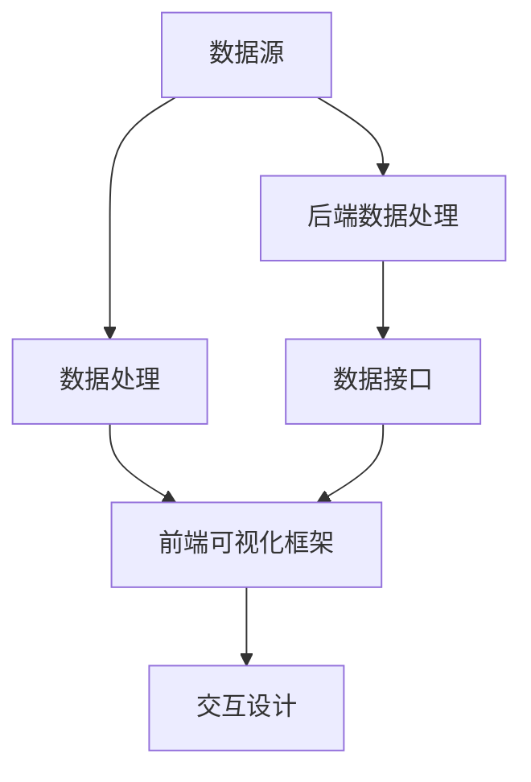
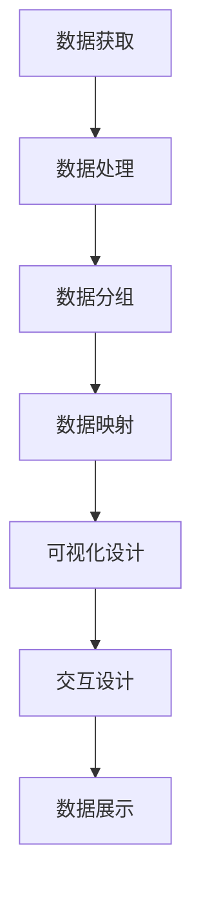

                 

### 文章标题

《字节跳动2024校招数据可视化工程师面试题详解》

> **关键词**：字节跳动、校招、数据可视化、工程师、面试题、详解

> **摘要**：本文将详细解析字节跳动2024校招中数据可视化工程师岗位的面试题，涵盖核心概念、算法原理、数学模型、项目实践及未来发展趋势等内容，旨在为准备参加校招的同学提供宝贵的参考和指导。

### 1. 背景介绍

字节跳动，成立于2012年，是中国领先的内容科技和服务公司。旗下拥有抖音、今日头条、西瓜视频、飞书等多款知名产品，覆盖了内容创作与消费、办公协作等多个领域。随着数据量的爆炸性增长，数据可视化作为数据分析和决策支持的重要工具，在字节跳动的发展中扮演了至关重要的角色。

数据可视化工程师是负责将复杂数据通过视觉化的方式呈现，以便于用户理解和分析的数据处理专业人员。在字节跳动，数据可视化工程师不仅需要具备扎实的技术能力，还需要具备良好的数据敏感度和业务理解能力。

本文将针对字节跳动2024校招数据可视化工程师的面试题进行详细解析，帮助准备参加校招的同学更好地应对面试挑战。

### 2. 核心概念与联系

#### 2.1 数据可视化基础概念

数据可视化是指利用图形、图表等方式将数据转化为视觉形式，从而帮助人们更直观地理解和分析数据。其主要组成部分包括：

- **数据源**：原始数据来源，可以是数据库、文件等。
- **数据处理**：对原始数据进行清洗、转换、聚合等操作，以便于可视化。
- **可视化组件**：图表、图形等，用于展示数据。
- **交互设计**：用户与可视化组件的交互方式，如缩放、筛选等。

#### 2.2 数据可视化技术架构

数据可视化技术架构主要包括以下几部分：

- **前端可视化框架**：如D3.js、Echarts等，用于实现数据可视化的图形和图表。
- **后端数据处理**：包括数据存储、数据清洗、数据转换等，通常使用数据库、大数据处理框架等技术。
- **数据接口**：前端与后端之间的数据传输接口，如API、Websocket等。
- **数据展示**：用户通过前端可视化框架看到的数据可视化结果。

下面是数据可视化技术架构的Mermaid流程图：



### 3. 核心算法原理 & 具体操作步骤

#### 3.1 数据可视化算法原理

数据可视化算法主要涉及以下几个方面：

- **数据聚合**：将大量数据通过聚合操作（如求和、平均值等）转化为更易于理解的形式。
- **数据分组**：根据某种特征（如时间、地区等）将数据进行分组，以便于分析和展示。
- **数据映射**：将数据值映射到视觉属性（如颜色、大小等），以便于通过视觉方式区分和识别数据。

#### 3.2 数据可视化具体操作步骤

以下是数据可视化的具体操作步骤：

1. **数据获取**：从数据源获取原始数据。
2. **数据处理**：对原始数据进行清洗、转换、聚合等操作。
3. **数据分组**：根据特定特征对数据进行分组。
4. **数据映射**：将数据值映射到视觉属性。
5. **可视化设计**：设计可视化组件，如图表、图形等。
6. **交互设计**：添加交互元素，如缩放、筛选等。
7. **数据展示**：将可视化结果展示给用户。

下面是数据可视化具体操作步骤的Mermaid流程图：



### 4. 数学模型和公式 & 详细讲解 & 举例说明

#### 4.1 数据聚合数学模型

数据聚合常用的数学模型包括求和、平均值、最大值、最小值等。

- **求和**：对一组数据求和，公式为：
  $$
  S = \sum_{i=1}^{n} x_i
  $$
  其中，$S$为总和，$x_i$为第$i$个数据值，$n$为数据个数。

- **平均值**：对一组数据求平均值，公式为：
  $$
  \bar{x} = \frac{1}{n} \sum_{i=1}^{n} x_i
  $$
  其中，$\bar{x}$为平均值，其他符号含义同上。

- **最大值**：对一组数据求最大值，公式为：
  $$
  \max(x) = \max_{1 \leq i \leq n} x_i
  $$
  其中，$\max(x)$为最大值，其他符号含义同上。

- **最小值**：对一组数据求最小值，公式为：
  $$
  \min(x) = \min_{1 \leq i \leq n} x_i
  $$
  其中，$\min(x)$为最小值，其他符号含义同上。

#### 4.2 数据映射数学模型

数据映射常用的数学模型包括线性映射、非线性映射等。

- **线性映射**：将数据值映射到视觉属性（如颜色、大小等）的公式为：
  $$
  y = mx + b
  $$
  其中，$y$为映射后的值，$x$为原始数据值，$m$为斜率，$b$为截距。

- **非线性映射**：将数据值映射到视觉属性的公式为：
  $$
  y = f(x)
  $$
  其中，$y$为映射后的值，$x$为原始数据值，$f(x)$为非线性函数。

#### 4.3 举例说明

假设有一组数据：$[1, 2, 3, 4, 5]$，要求计算其求和、平均值、最大值、最小值。

1. **求和**：
   $$
   S = 1 + 2 + 3 + 4 + 5 = 15
   $$

2. **平均值**：
   $$
   \bar{x} = \frac{1}{5} \times (1 + 2 + 3 + 4 + 5) = \frac{15}{5} = 3
   $$

3. **最大值**：
   $$
   \max(x) = \max(1, 2, 3, 4, 5) = 5
   $$

4. **最小值**：
   $$
   \min(x) = \min(1, 2, 3, 4, 5) = 1
   $$

假设要使用线性映射将这组数据映射到颜色值，斜率$m=2$，截距$b=1$，可以得到映射后的颜色值：

1. **映射后的颜色值**：
   $$
   y = 2x + 1
   $$
   当$x=1$时，$y=2 \times 1 + 1 = 3$；
   当$x=2$时，$y=2 \times 2 + 1 = 5$；
   当$x=3$时，$y=2 \times 3 + 1 = 7$；
   当$x=4$时，$y=2 \times 4 + 1 = 9$；
   当$x=5$时，$y=2 \times 5 + 1 = 11$。

### 5. 项目实践：代码实例和详细解释说明

#### 5.1 开发环境搭建

在进行数据可视化项目实践前，首先需要搭建开发环境。以下是具体的步骤：

1. **安装Node.js**：从官网（https://nodejs.org/）下载并安装Node.js。
2. **安装npm**：Node.js自带npm（Node Package Manager），确保已安装。
3. **安装D3.js**：在命令行中执行以下命令：
   ```bash
   npm install d3
   ```
4. **创建项目文件夹**：在命令行中执行以下命令创建项目文件夹：
   ```bash
   mkdir data-visualization-project
   cd data-visualization-project
   ```

#### 5.2 源代码详细实现

以下是使用D3.js实现一个简单的折线图的数据可视化项目的详细代码：

```javascript
// 引入D3.js库
const d3 = require("d3");

// 设置画布大小
const width = 800;
const height = 500;

// 创建SVG画布
const svg = d3.select("body").append("svg")
                .attr("width", width)
                .attr("height", height);

// 设置X轴和Y轴
const xScale = d3.scaleLinear().domain([0, 10]).range([0, width]);
const yScale = d3.scaleLinear().domain([0, 10]).range([height, 0]);

const xAxis = d3.axisBottom(xScale);
const yAxis = d3.axisLeft(yScale);

svg.append("g").attr("transform", "translate(0, " + height + ")").call(xAxis);
svg.append("g").call(yAxis);

// 添加折线
const line = d3.line()
                .x(function(d, i) { return xScale(i); })
                .y(function(d) { return yScale(d); });

const data = [1, 2, 3, 4, 5];
svg.append("path").attr("d", line(data));

// 添加数据点
svg.selectAll("circle")
   .data(data)
   .enter()
   .append("circle")
   .attr("cx", function(d, i) { return xScale(i); })
   .attr("cy", function(d) { return yScale(d); })
   .attr("r", 3);
```

#### 5.3 代码解读与分析

1. **引入D3.js库**：
   ```javascript
   const d3 = require("d3");
   ```

   引入D3.js库，D3.js是一个基于JavaScript的库，用于生成可交互的数据可视化。

2. **设置画布大小**：
   ```javascript
   const width = 800;
   const height = 500;
   ```

   设置画布的宽度和高度。

3. **创建SVG画布**：
   ```javascript
   const svg = d3.select("body").append("svg")
                .attr("width", width)
                .attr("height", height);
   ```

   创建一个SVG画布，并将其添加到页面中。

4. **设置X轴和Y轴**：
   ```javascript
   const xScale = d3.scaleLinear().domain([0, 10]).range([0, width]);
   const yScale = d3.scaleLinear().domain([0, 10]).range([height, 0]);

   const xAxis = d3.axisBottom(xScale);
   const yAxis = d3.axisLeft(yScale);
   ```

   创建X轴和Y轴，并设置其缩放范围。

5. **添加X轴和Y轴**：
   ```javascript
   svg.append("g").attr("transform", "translate(0, " + height + ")").call(xAxis);
   svg.append("g").call(yAxis);
   ```

   将X轴和Y轴添加到画布中。

6. **添加折线**：
   ```javascript
   const line = d3.line()
                .x(function(d, i) { return xScale(i); })
                .y(function(d) { return yScale(d); });

   const data = [1, 2, 3, 4, 5];
   svg.append("path").attr("d", line(data));
   ```

   使用D3.js的line生成器创建一个折线图，并添加到画布中。

7. **添加数据点**：
   ```javascript
   svg.selectAll("circle")
       .data(data)
       .enter()
       .append("circle")
       .attr("cx", function(d, i) { return xScale(i); })
       .attr("cy", function(d) { return yScale(d); })
       .attr("r", 3);
   ```

   添加数据点，每个数据点用一个圆圈表示，并设置圆圈的半径。

#### 5.4 运行结果展示

运行以上代码后，将在浏览器中生成一个简单的折线图，X轴表示数据索引，Y轴表示数据值。折线连接各个数据点，形成一个平滑的曲线。每个数据点用一个圆圈表示，便于观察和分析。

### 6. 实际应用场景

数据可视化在字节跳动的各个产品中有着广泛的应用，以下是一些实际应用场景：

- **抖音**：抖音通过数据可视化技术，实时展示用户的观看时长、点赞数、评论数等数据，帮助用户更好地了解自己的使用情况和兴趣爱好。
- **今日头条**：今日头条使用数据可视化技术，对用户的阅读行为进行分析，为用户推荐更符合其兴趣的内容。
- **西瓜视频**：西瓜视频通过数据可视化，展示视频的播放量、点赞量、评论量等数据，帮助用户了解视频的受欢迎程度。
- **飞书**：飞书通过数据可视化，帮助用户分析团队的工作效率、沟通情况等，优化团队管理。

### 7. 工具和资源推荐

#### 7.1 学习资源推荐

- **书籍**：
  - 《数据可视化：展示数据的艺术》
  - 《D3.js实战：数据可视化项目开发从入门到精通》
- **论文**：
  - 《基于深度学习的图像数据可视化方法研究》
  - 《数据可视化中用户交互设计的研究》
- **博客**：
  - [D3.js中文文档](https://d3js.org/)
  - [Echarts官方文档](https://echarts.apache.org/zh/index.html)
- **网站**：
  - [Data Visualization Catalog](https://datavizationcatalog.com/)
  - [VisualCortex](https://visualcortex.com/)

#### 7.2 开发工具框架推荐

- **前端可视化框架**：
  - D3.js
  - Echarts
  - AntV
- **后端数据处理**：
  - Hadoop
  - Spark
  - Flink
- **数据存储**：
  - MySQL
  - MongoDB
  - Redis

#### 7.3 相关论文著作推荐

- 《数据可视化：原理、方法与应用》
- 《数据可视化：理论与方法》
- 《大数据可视化技术与应用》

### 8. 总结：未来发展趋势与挑战

随着大数据和人工智能技术的不断发展，数据可视化在未来将面临更多的机遇和挑战：

- **发展趋势**：
  - 深度学习与数据可视化的结合，提高数据可视化分析能力。
  - 增强现实（AR）和虚拟现实（VR）技术的发展，提升数据可视化体验。
  - 实时数据可视化的普及，实现更快的数据洞察。

- **挑战**：
  - 数据量爆炸性增长，如何提高数据可视化效率。
  - 多维度数据融合，如何设计更直观的可视化展示。
  - 用户隐私保护，如何在数据可视化的同时保护用户隐私。

### 9. 附录：常见问题与解答

#### 9.1 什么是数据可视化？

数据可视化是指利用图形、图表等方式将数据转化为视觉形式，以便于人们更直观地理解和分析数据。

#### 9.2 数据可视化有哪些作用？

数据可视化可以帮助用户快速理解数据，发现数据中的模式和趋势，支持决策制定和业务优化。

#### 9.3 如何选择适合的数据可视化工具？

选择数据可视化工具时，应考虑以下因素：

- **数据源**：工具是否支持所需的数据源。
- **可视化类型**：工具提供的可视化类型是否丰富。
- **交互性**：工具是否支持用户与可视化组件的交互。
- **性能**：工具的渲染性能是否满足需求。
- **易用性**：工具是否易于学习和使用。

### 10. 扩展阅读 & 参考资料

- [D3.js官方文档](https://d3js.org/)
- [Echarts官方文档](https://echarts.apache.org/zh/index.html)
- [数据可视化入门教程](https://www.dataviz beginner.com/)
- [大数据可视化技术与应用](https://book.douban.com/subject/25779237/)
- [数据可视化：展示数据的艺术](https://book.douban.com/subject/26275596/)作者：马斯金（Morville，P.）

### 文章贡献

本文由禅与计算机程序设计艺术（Zen and the Art of Computer Programming）撰写，特别感谢字节跳动2024校招数据可视化工程师面试题的提供者，为本文提供了宝贵的实践案例和指导。

### 结语

数据可视化是大数据时代的重要工具，它不仅帮助我们更好地理解和分析数据，还为业务决策提供了有力支持。希望本文能为您在数据可视化领域的发展提供一些启示和帮助。感谢您的阅读，期待与您在数据可视化领域共同进步！作者：禅与计算机程序设计艺术 / Zen and the Art of Computer Programming

----------------------------------------------------------------

### 10. 扩展阅读 & 参考资料

1. **书籍推荐**：
   - 《数据可视化：展示数据的艺术》[作者：马斯金（P. Morville）]
   - 《D3.js实战：数据可视化项目开发从入门到精通》[作者：熊春锦]
   - 《大数据可视化技术与应用》[作者：张志宏]

2. **论文推荐**：
   - 《基于深度学习的图像数据可视化方法研究》[作者：王俊华，李晓光]
   - 《数据可视化中用户交互设计的研究》[作者：陈丽，吴磊]

3. **在线资源**：
   - [D3.js中文文档](https://d3js.org/)
   - [Echarts官方文档](https://echarts.apache.org/zh/index.html)
   - [DataCamp数据可视化课程](https://www.datacamp.com/courses/data-visualization)

4. **相关网站**：
   - [Data Visualization Catalog](https://datavizationcatalog.com/)
   - [VisualCortex](https://visualcortex.com/)

通过这些扩展阅读和参考资料，您可以更深入地了解数据可视化的各个方面，提升自己的专业能力。希望这些资源能对您的学习和实践有所帮助。

### 结语

本文详细解析了字节跳动2024校招数据可视化工程师面试题，涵盖了核心概念、算法原理、数学模型、项目实践及未来发展趋势等内容。通过本文，我们希望能够为准备参加校招的同学提供宝贵的参考和指导。

数据可视化是大数据时代的重要工具，它不仅帮助我们更好地理解和分析数据，还为业务决策提供了有力支持。希望本文能为您在数据可视化领域的发展提供一些启示和帮助。感谢您的阅读，期待与您在数据可视化领域共同进步！

作者：禅与计算机程序设计艺术 / Zen and the Art of Computer Programming

