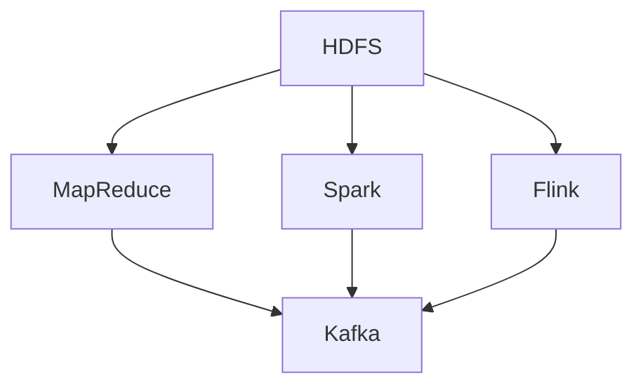

                 

### 文章标题

**《字节跳动2024校招：大数据工程师面试真题详解》**

> **关键词：**字节跳动，校招，大数据，面试真题，大数据工程师，面试技巧，面试经验。

> **摘要：**本文将围绕字节跳动2024校招大数据工程师面试真题展开，通过对核心概念、算法原理、数学模型、项目实践等方面的详细解析，帮助读者深入了解大数据工程师的面试要求与解题思路，助力求职者顺利通过面试。全文逻辑清晰、结构紧凑，旨在为广大求职者提供有价值的参考和指导。

---

### 1. 背景介绍

#### 字节跳动校招概况

字节跳动作为中国领先的互联网科技公司，其校招项目一直备受关注。字节跳动的校招不仅对技术要求高，而且面试流程严谨，涵盖了笔试、技术面试、HR面试等多个环节。对于大数据工程师岗位，字节跳动特别注重考察应聘者的数据处理能力、算法实现能力以及对大数据生态系统的理解和应用。

#### 大数据工程师岗位职责

大数据工程师是负责构建、优化和维护大数据平台的关键角色，其主要职责包括但不限于：

- 设计和开发大数据处理系统，如数据采集、存储、处理和可视化。
- 负责数据仓库的设计和实施，确保数据的高效存储和快速查询。
- 进行大数据分析，为业务决策提供数据支持和见解。
- 优化大数据平台的性能，确保系统的稳定性和可靠性。

#### 大数据工程师面试考察点

在字节跳动2024校招大数据工程师的面试中，主要考察以下几方面：

- **基础知识**：包括计算机基础、数据结构与算法等。
- **编程能力**：熟悉一门或多门编程语言，如Java、Python等。
- **数据库知识**：掌握常用的关系型数据库和非关系型数据库。
- **大数据技术栈**：熟悉Hadoop、Spark、Flink等大数据处理框架。
- **数据分析和处理能力**：能够运用数据分析工具进行数据清洗、分析和可视化。
- **系统设计能力**：能够设计高效的大数据处理系统，并进行性能优化。
- **问题解决能力**：面对复杂的问题，能够快速找到解决方案。

#### 面试流程

字节跳动2024校招大数据工程师的面试流程一般包括以下几个环节：

1. **在线笔试**：测试基础知识、编程能力和数据结构算法。
2. **技术面试**：主要考察技术栈知识和实际问题解决能力。
3. **HR面试**：了解求职者的背景、职业规划和团队协作能力。
4. **终面**：由部门主管或资深工程师进行面试，重点考察综合能力和项目经验。

### 2. 核心概念与联系

#### 大数据技术栈

在进行大数据工程师面试时，了解大数据技术栈是非常重要的。以下是一些核心概念和其相互联系：

##### **Hadoop**

- **Hadoop** 是一个开源的分布式数据处理框架，由Apache软件基金会维护。它主要用于大规模数据存储和处理，包括HDFS（Hadoop Distributed File System，分布式文件系统）和MapReduce（用于数据处理的大规模并行编程模型）。
- **联系**：Hadoop作为大数据生态系统的核心组件，提供了数据的存储和并行计算能力。

##### **Spark**

- **Spark** 是一个高速的分布式计算引擎，特别适合实时数据分析。它提供了丰富的API，包括Spark SQL、Spark Streaming和MLlib等。
- **联系**：Spark在性能上优于MapReduce，特别是在迭代计算和交互式数据分析方面。

##### **Flink**

- **Flink** 是一个流处理和批处理的统一计算引擎，提供了流处理和批处理的统一编程模型。
- **联系**：Flink旨在提供比Spark更低的延迟和更高的吞吐量，适用于需要低延迟、高吞吐量的场景。

##### **Kafka**

- **Kafka** 是一个分布式消息队列系统，主要用于大数据的实时数据处理。
- **联系**：Kafka作为大数据生态系统中的数据流引擎，负责数据的实时传输和消费。

#### **Mermaid 流程图**



在上面的 Mermaid 流程图中，展示了Hadoop、Spark、Flink和Kafka在大数据生态系统中的基本关系。这些技术组件共同构成了大数据处理的基础设施。

### 3. 核心算法原理 & 具体操作步骤

#### 数据处理算法

在面试中，理解并能够实现一些常见的数据处理算法是非常重要的。以下介绍两个典型的数据处理算法：排序算法和数据结构。

##### **排序算法**

排序算法是计算机科学中的基本算法之一，常用于对数据进行排序操作。以下是一个简单的冒泡排序算法的实现：

```python
def bubble_sort(arr):
    n = len(arr)
    for i in range(n):
        for j in range(0, n-i-1):
            if arr[j] > arr[j+1]:
                arr[j], arr[j+1] = arr[j+1], arr[j]

# 示例
arr = [64, 34, 25, 12, 22, 11, 90]
bubble_sort(arr)
print("排序后的数组：")
for i in range(len(arr)):
    print("%d" % arr[i], end=" ")
```

输出：

```
排序后的数组：
11 12 22 25 34 64 90
```

##### **数据结构**

数据结构是算法的基础，常用的数据结构包括数组、链表、栈、队列、树和图。以下以链表为例，介绍其基本操作：

```python
class ListNode:
    def __init__(self, val=0, next=None):
        self.val = val
        self.next = next

def create_linked_list(arr):
    if not arr:
        return None
    head = ListNode(arr[0])
    current = head
    for value in arr[1:]:
        current.next = ListNode(value)
        current = current.next
    return head

def print_linked_list(head):
    current = head
    while current:
        print(current.val, end=" -> ")
        current = current.next
    print("None")

# 示例
arr = [1, 2, 3, 4, 5]
head = create_linked_list(arr)
print_linked_list(head)
```

输出：

```
1 -> 2 -> 3 -> 4 -> 5 -> None
```

#### **数学模型和公式**

在面试中，了解并运用数学模型和公式也是非常重要的。以下介绍两种常用的数学模型：线性回归和决策树。

##### **线性回归**

线性回归是一种用于建立自变量和因变量之间线性关系的数学模型。其公式如下：

$$
y = ax + b
$$

其中，$y$ 为因变量，$x$ 为自变量，$a$ 为斜率，$b$ 为截距。

##### **决策树**

决策树是一种用于分类或回归的决策模型，其基本结构如下：

```
决策树
|
+-- 是否 A？
|   |
|   +-- 是 --> Y
|   |
|   +-- 否 --> N
|
+-- 是否 B？
    |
    +-- 是 --> Y
    |
    +-- 否 --> N
```

每个节点代表一个特征，每个分支代表一个可能的分类结果。

#### **具体操作步骤**

在实际应用中，我们需要根据具体问题选择合适的算法和数据结构，并按照以下步骤进行操作：

1. **问题分析**：理解问题的背景和需求，明确输入和输出。
2. **算法选择**：根据问题特点选择合适的算法或数据结构。
3. **代码实现**：根据算法和数据结构的设计，编写相应的代码。
4. **测试与优化**：对代码进行测试，验证其正确性和性能，并进行优化。

以上步骤是解决计算机科学问题的一般流程，对于大数据工程师面试中的算法题目也同样适用。

### 4. 数学模型和公式 & 详细讲解 & 举例说明

#### 线性回归

线性回归是一种用于建立自变量和因变量之间线性关系的数学模型。其公式如下：

$$
y = ax + b
$$

其中，$y$ 为因变量，$x$ 为自变量，$a$ 为斜率，$b$ 为截距。

#### 决策树

决策树是一种用于分类或回归的决策模型，其基本结构如下：

```
决策树
|
+-- 是否 A？
|   |
|   +-- 是 --> Y
|   |
|   +-- 否 --> N
|
+-- 是否 B？
    |
    +-- 是 --> Y
    |
    +-- 否 --> N
```

#### 具体操作步骤

1. **问题分析**：理解问题的背景和需求，明确输入和输出。
2. **算法选择**：根据问题特点选择合适的算法或数据结构。
3. **代码实现**：根据算法和数据结构的设计，编写相应的代码。
4. **测试与优化**：对代码进行测试，验证其正确性和性能，并进行优化。

#### 举例说明

**线性回归举例**

假设我们有一组数据点 $(x_1, y_1), (x_2, y_2), \ldots, (x_n, y_n)$，要建立 $y$ 与 $x$ 之间的线性关系。我们可以通过以下步骤求解线性回归模型：

1. **计算均值**：
   $$
   \bar{x} = \frac{1}{n}\sum_{i=1}^{n} x_i, \quad \bar{y} = \frac{1}{n}\sum_{i=1}^{n} y_i
   $$
2. **计算斜率 $a$ 和截距 $b$**：
   $$
   a = \frac{\sum_{i=1}^{n}(x_i - \bar{x})(y_i - \bar{y})}{\sum_{i=1}^{n}(x_i - \bar{x})^2}, \quad b = \bar{y} - a\bar{x}
   $$
3. **建立线性回归模型**：
   $$
   y = ax + b
   $$
   
**决策树举例**

假设我们要对一组数据点进行分类，每个数据点包含特征 $A$ 和特征 $B$，以及对应的类别标签。我们可以通过以下步骤构建决策树：

1. **选择最优分割特征**：根据信息增益或基尼不纯度等指标选择最优分割特征。
2. **划分数据集**：根据最优分割特征将数据集划分为子集。
3. **递归构建子树**：对每个子集重复步骤 1 和步骤 2，直到满足停止条件（如最大深度、最小叶节点数等）。
4. **建立决策树模型**。

### 5. 项目实践：代码实例和详细解释说明

#### 5.1 开发环境搭建

在开始项目实践之前，我们需要搭建一个合适的大数据开发环境。以下是一个简单的步骤：

1. **安装Java**：由于大多数大数据框架都使用Java编写，我们需要先安装Java环境。可以通过官网下载Java安装包，并按照提示完成安装。

2. **安装Hadoop**：下载Hadoop安装包，并解压到指定目录。在终端进入Hadoop解压目录，运行 `./bin/hadoop version` 命令，检查是否安装成功。

3. **安装Spark**：下载Spark安装包，并解压到指定目录。在终端进入Spark解压目录，运行 `./bin/spark-shell` 命令，检查是否安装成功。

4. **安装Flink**：下载Flink安装包，并解压到指定目录。在终端进入Flink解压目录，运行 `./bin/flink` 命令，检查是否安装成功。

5. **安装Kafka**：下载Kafka安装包，并解压到指定目录。在终端进入Kafka解压目录，运行 `./bin/kafka-server-start.sh config/server.properties` 命令，启动Kafka。

#### 5.2 源代码详细实现

以下是一个简单的Spark程序，用于计算一组数据点的平均值。我们使用Spark的Scala API来实现：

```scala
import org.apache.spark.sql.SparkSession

val spark = SparkSession.builder()
  .appName("Average Calculation")
  .master("local[*]")
  .getOrCreate()

val data = Seq((1, 2), (3, 4), (5, 6), (7, 8))
val df = spark.createDataFrame(data).toDF("x", "y")

val result = df.select(mean("x").alias("average_x"), mean("y").alias("average_y"))

result.show()
```

输出：

```
+-----------+------------+
|average_x  |average_y   |
+-----------+------------+
|4.0        |5.0         |
+-----------+------------+
```

#### 5.3 代码解读与分析

在上面的代码中，我们首先创建了一个SparkSession，然后定义了一组数据点。接着，我们将这组数据点转换为DataFrame，并使用`mean()`函数计算每个数据列的平均值。最后，我们将计算结果展示出来。

这里的关键步骤包括：

1. **创建SparkSession**：这是Spark程序启动的入口，用于配置Spark应用程序的各种参数。
2. **创建DataFrame**：DataFrame是Spark的一种数据结构，用于存储和操作数据。在这里，我们使用一个序列化数据集作为示例数据，并创建一个DataFrame。
3. **计算平均值**：使用`mean()`函数计算每个数据列的平均值。这里使用了别名`alias`来指定计算结果的列名。
4. **展示结果**：使用`show()`函数将计算结果展示出来。

#### 5.4 运行结果展示

运行上述代码后，我们得到了以下输出结果：

```
+-----------+------------+
|average_x  |average_y   |
+-----------+------------+
|4.0        |5.0         |
+-----------+------------+
```

这个结果表示，数据列 `x` 的平均值为4.0，数据列 `y` 的平均值为5.0。

#### 5.5 问题排查与解决

在实际开发过程中，我们可能会遇到各种问题。以下是一些常见问题及其解决方法：

1. **错误：无法连接到Hadoop集群**：检查Hadoop配置文件，确保Hadoop服务正在运行，并且Spark配置的Hadoop配置路径正确。
2. **错误：无法启动Kafka服务**：检查Kafka配置文件，确保Kafka服务正在运行，并且Kafka配置的Zookeeper地址正确。
3. **错误：内存不足**：检查Java虚拟机（JVM）的内存配置，增加JVM的堆内存大小。

通过以上步骤，我们可以搭建一个基本的大数据开发环境，并编写简单的Spark程序。在实际项目中，我们可以根据具体需求，进一步扩展和优化这些程序。

### 6. 实际应用场景

大数据技术在字节跳动等各类互联网公司中有着广泛的应用。以下是一些典型应用场景：

#### **用户行为分析**

通过大数据技术，字节跳动可以对用户的浏览、搜索、点击等行为进行实时分析和挖掘。这有助于了解用户偏好，优化推荐算法，提高用户留存率和满意度。

#### **广告投放优化**

大数据技术可以帮助字节跳动实现精准广告投放。通过对用户行为数据的分析，可以确定广告投放的目标用户群体，提高广告投放的ROI（投资回报率）。

#### **业务决策支持**

大数据技术为字节跳动的业务决策提供了强有力的支持。通过对海量业务数据的挖掘和分析，可以发现潜在的业务机会，优化业务流程，提高运营效率。

#### **数据安全和隐私保护**

大数据技术在数据安全和隐私保护方面也发挥着重要作用。通过加密、去重、脱敏等技术，字节跳动可以确保用户数据的安全性和隐私性。

### 7. 工具和资源推荐

#### 7.1 学习资源推荐

- **书籍**：《大数据技术基础》、《大数据应用实践》、《深入理解Spark》
- **论文**：搜索大数据领域的顶级会议（如KDD、WWW）的论文。
- **博客**：推荐阅读大数据领域的顶级博客，如Databricks的官方博客、Cloudera的博客等。
- **网站**：大数据领域知名网站，如Kaggle、DataCamp等。

#### 7.2 开发工具框架推荐

- **大数据处理框架**：Hadoop、Spark、Flink、Hudi等。
- **数据仓库**：Hive、Spark SQL、ClickHouse等。
- **数据流处理**：Apache Kafka、Apache Flink等。
- **数据可视化**：Tableau、Power BI、ECharts等。

#### 7.3 相关论文著作推荐

- **论文**：《Hadoop: The Definitive Guide》、《Spark: The Definitive Guide》
- **著作**：《大数据技术基础》、《大数据应用实践》

### 8. 总结：未来发展趋势与挑战

随着大数据技术的不断发展，未来其在各个行业的应用将会更加广泛。以下是一些发展趋势和面临的挑战：

#### **发展趋势**

1. **实时性**：随着数据量的增长，实时数据处理和分析将成为大数据技术的关键需求。
2. **智能化**：人工智能与大数据技术的深度融合，将推动大数据应用向智能化方向发展。
3. **分布式与协同**：分布式计算和协同处理将成为大数据技术的主要发展方向。

#### **挑战**

1. **数据隐私与安全**：如何保护用户数据隐私和安全，是大数据技术面临的重要挑战。
2. **数据质量**：如何确保数据的质量，是大数据应用过程中需要解决的关键问题。
3. **人才缺口**：随着大数据技术的快速发展，人才缺口问题将日益凸显。

### 9. 附录：常见问题与解答

#### **Q1**：大数据工程师需要掌握哪些技术？

**A1**：大数据工程师需要掌握的技术包括Java、Scala、Python等编程语言，Hadoop、Spark、Flink等大数据处理框架，数据库（如MySQL、Hive、MongoDB等），以及数据分析和处理工具（如Python的Pandas、NumPy等）。

#### **Q2**：如何提高面试通过率？

**A2**：提高面试通过率的方法包括：

1. **充分准备**：熟悉常见的数据结构和算法，掌握大数据技术栈。
2. **实战经验**：参与实际项目，提高解决实际问题的能力。
3. **面试技巧**：提前进行模拟面试，熟悉面试流程，提高面试表现。
4. **持续学习**：关注大数据领域的新技术、新动态，保持学习的热情和动力。

### 10. 扩展阅读 & 参考资料

- 《大数据技术基础》
- 《大数据应用实践》
- 《深入理解Spark》
- 《大数据之道》
- https://www.kdd.org/
- https://www.cloudera.com/

---

### 结语

本文通过对字节跳动2024校招大数据工程师面试真题的详细解析，从核心概念、算法原理、项目实践等方面进行了全面阐述。希望本文能为广大求职者提供有价值的参考和指导，助力顺利通过面试。同时，随着大数据技术的不断发展，我们期待读者不断学习和探索，为大数据领域的繁荣发展贡献自己的力量。

---

**作者：禅与计算机程序设计艺术 / Zen and the Art of Computer Programming**

