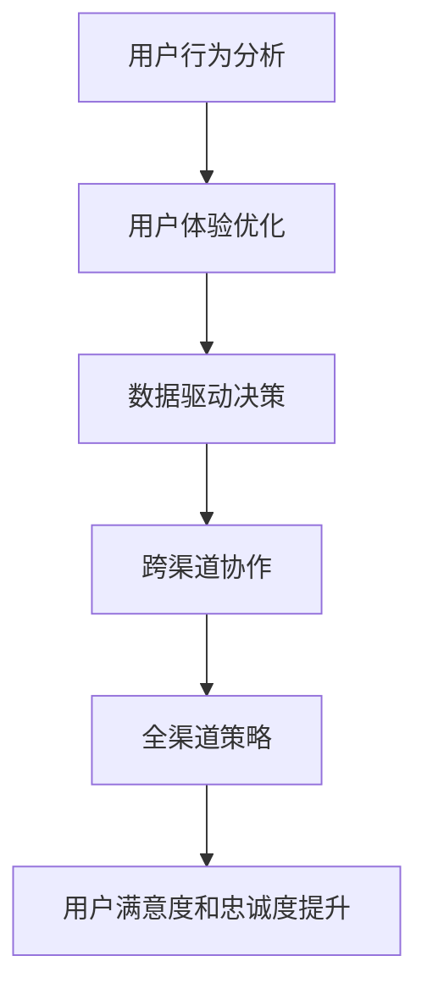

                 

### 1. 背景介绍

在数字时代，用户体验成为了企业竞争的核心要素。尤其是在字节跳动这样的大型互联网公司，用户体验优化对于产品成功至关重要。为了在2024年的校招中更好地评估应聘者的技术能力和解决问题的能力，字节跳动推出了一系列面试真题，其中技术用户全渠道策略专家面试真题尤为引人注目。

技术用户全渠道策略专家的角色旨在通过跨渠道的用户体验优化，提升用户满意度和留存率。这一岗位不仅需要深刻理解技术，还要具备出色的策略规划和执行能力。面试真题的设计正是为了考察应聘者在技术理解、策略分析、问题解决和沟通协调等方面的综合素质。

本文将围绕字节跳动2024校招技术用户全渠道策略专家面试真题进行详细解析，帮助读者深入理解面试的核心内容，为即将面对这类面试的应聘者提供宝贵的指导。

在接下来的章节中，我们将逐步介绍核心概念、算法原理、数学模型、项目实践、实际应用场景以及未来发展趋势等内容。希望通过这篇文章，读者不仅能掌握面试的关键点，还能对全渠道策略有一个全面的认识。

### 2. 核心概念与联系

在深入探讨技术用户全渠道策略专家面试真题之前，我们需要明确一些核心概念，并理解它们之间的相互联系。以下是本文将涉及的关键概念和它们之间的关系：

#### 全渠道策略

全渠道策略是指企业在不同的渠道（如线上、线下、移动端、PC端等）上，提供一致的用户体验，以增强用户满意度和忠诚度。全渠道策略的关键在于无缝集成各种渠道，确保用户在任何时间、任何地点都能获得一致的服务。

#### 用户行为分析

用户行为分析是通过数据技术对用户在各个渠道上的行为进行追踪和分析，以了解用户的需求、偏好和痛点。用户行为分析的结果可以指导全渠道策略的制定和优化。

#### 用户体验优化

用户体验优化是指通过对产品或服务的设计、功能、交互等方面进行改进，提升用户在使用过程中的满意度。用户体验优化的目标是在不同渠道上提供卓越的用户体验，从而提高用户留存率和转化率。

#### 数据驱动决策

数据驱动决策是指基于数据分析结果来指导企业的战略规划和运营决策。在技术用户全渠道策略专家的岗位上，数据驱动决策至关重要，因为只有通过数据才能准确了解用户需求和市场变化。

#### 跨渠道协作

跨渠道协作是指企业内部不同部门（如产品、技术、市场等）之间的协同工作，以确保全渠道策略的顺利实施。跨渠道协作的成功依赖于良好的沟通、协作和共享机制。

#### Mermaid 流程图

为了更好地理解全渠道策略的架构和流程，我们将使用 Mermaid 流程图来展示核心概念之间的关系。以下是全渠道策略的核心流程：



在这个流程图中，用户行为分析是全渠道策略的起点，通过分析用户行为，我们可以识别出用户体验的痛点，进而进行优化。优化后的用户体验数据将驱动数据驱动决策，最终实现全渠道策略的有效实施，并提升用户满意度和忠诚度。

#### 关键概念与联系

- 用户行为分析：收集和分析用户在各个渠道上的行为数据，为优化提供依据。
- 用户体验优化：基于用户行为分析的结果，对产品或服务进行改进。
- 数据驱动决策：利用用户体验优化的数据结果，指导企业战略和运营决策。
- 跨渠道协作：确保各部门协同工作，实现全渠道策略的一致性。
- 全渠道策略：通过整合多种渠道，提供一致的用户体验，提升用户满意度和忠诚度。

这些核心概念相互联系，共同构成了技术用户全渠道策略的完整框架。理解这些概念及其相互关系，是解决面试真题和实际工作中问题的基础。

### 3. 核心算法原理 & 具体操作步骤

在理解了全渠道策略的核心概念之后，我们需要进一步探讨支持这一策略的关键算法原理及其具体操作步骤。以下是几种在技术用户全渠道策略中常用的核心算法，以及它们的原理和应用方法。

#### 3.1 用户行为分析算法

用户行为分析算法主要通过数据挖掘和机器学习技术来识别用户在各个渠道上的行为模式。以下是用户行为分析的核心算法原理：

##### 3.1.1 聚类分析（Cluster Analysis）

聚类分析是一种无监督学习方法，用于将用户数据分成若干个聚类，使得同一聚类内的用户行为高度相似，不同聚类内的用户行为差异较大。常用的聚类算法包括K-means、DBSCAN等。

- **原理**：通过计算用户行为特征的相似度，将用户划分为若干个聚类。每个聚类代表一组具有相似行为的用户。
- **操作步骤**：
  1. 收集用户行为数据（如浏览记录、购买行为、互动行为等）。
  2. 提取特征，通常使用维度约简方法降低数据维度。
  3. 选择聚类算法，例如K-means，初始化聚类中心。
  4. 计算每个用户与聚类中心的距离，将用户分配到最近的聚类。
  5. 重新计算每个聚类的中心，迭代直到聚类中心不再发生显著变化。

##### 3.1.2 协同过滤（Collaborative Filtering）

协同过滤是一种基于用户行为数据推荐相似用户的方法。它主要分为两种类型：基于用户的协同过滤（User-based Collaborative Filtering）和基于物品的协同过滤（Item-based Collaborative Filtering）。

- **原理**：通过分析用户之间的行为相似性，为用户推荐他们可能感兴趣的物品或服务。
- **操作步骤**：
  1. 收集用户行为数据，如用户评分、购买记录等。
  2. 计算用户之间的相似度，可以使用余弦相似度、皮尔逊相关系数等方法。
  3. 为每个用户找到最相似的K个邻居。
  4. 根据邻居用户的评分预测当前用户的评分，推荐评分较高的物品或服务。

##### 3.1.3 时间序列分析（Time Series Analysis）

时间序列分析用于识别用户行为的时间规律性，通常用于预测用户未来的行为。常用的方法包括ARIMA、LSTM等。

- **原理**：通过分析用户行为的时间序列数据，预测未来的行为模式。
- **操作步骤**：
  1. 收集用户行为的时间序列数据。
  2. 提取时间序列特征，如移动路径、访问时间等。
  3. 使用时间序列模型，如ARIMA、LSTM等，进行训练和预测。
  4. 分析预测结果，优化模型参数。

#### 3.2 用户体验优化算法

用户体验优化算法主要用于改进产品或服务的设计和交互，以提高用户满意度。以下是一些常见算法：

##### 3.2.1 A/B 测试（A/B Testing）

A/B 测试是一种比较两种或多种设计方案的实验方法，通过对比不同组的用户行为，找出最优设计方案。

- **原理**：通过随机分配用户到不同的实验组，比较各组的用户体验和转化率，以确定哪种设计方案更有效。
- **操作步骤**：
  1. 定义测试目标和假设。
  2. 设计实验方案，包括控制组和实验组。
  3. 随机分配用户到各实验组。
  4. 收集用户行为数据，如点击率、转化率等。
  5. 分析实验结果，确定最优方案。

##### 3.2.2 用户反馈分析（User Feedback Analysis）

用户反馈分析通过收集用户的反馈和建议，改进产品或服务的质量和交互。

- **原理**：通过分析用户反馈，识别用户需求和痛点，优化产品设计和功能。
- **操作步骤**：
  1. 收集用户反馈，如问卷调查、用户评论等。
  2. 提取反馈中的关键词和主题。
  3. 分析反馈数据，识别用户需求和痛点。
  4. 制定改进计划，实施优化措施。

##### 3.2.3 增量式优化（Incremental Optimization）

增量式优化通过逐步改进现有设计，以实现用户体验的持续提升。

- **原理**：在保持现有设计的基础上，逐步添加新功能或优化现有功能，以提升用户体验。
- **操作步骤**：
  1. 分析现有设计的优缺点。
  2. 制定优化计划，包括功能改进、界面优化等。
  3. 实施优化措施，进行A/B测试验证效果。
  4. 根据测试结果，持续改进设计。

通过以上核心算法原理和具体操作步骤的介绍，我们可以看到，用户行为分析和用户体验优化是技术用户全渠道策略的核心组成部分。这些算法不仅有助于理解用户需求和行为模式，还能指导企业在实际运营中做出数据驱动的决策，实现全渠道策略的有效实施。

### 4. 数学模型和公式 & 详细讲解 & 举例说明

在技术用户全渠道策略的构建中，数学模型和公式起着至关重要的作用。这些模型和公式不仅帮助我们量化用户行为和用户体验，还能指导策略的制定和优化。以下我们将详细介绍几个关键数学模型和公式，并通过具体例子说明它们的应用。

#### 4.1 用户行为预测模型

用户行为预测模型用于预测用户在未来的某一时间段内的行为，如点击率、购买概率等。常见的方法包括逻辑回归、决策树、随机森林等。以下是逻辑回归模型的基本公式：

\[ P(y=1) = \frac{1}{1 + e^{-(\beta_0 + \beta_1 x_1 + \beta_2 x_2 + ... + \beta_n x_n )}} \]

其中，\(P(y=1)\) 表示用户在特定条件下进行某一行为的概率，\(y\) 是行为标签（0或1），\(\beta_0, \beta_1, \beta_2, ..., \beta_n\) 是模型参数，\(x_1, x_2, ..., x_n\) 是用户特征。

**举例**：

假设我们想要预测用户点击广告的概率。用户特征包括年龄、性别、收入、浏览历史等。我们可以通过收集这些特征数据，使用逻辑回归模型来预测用户点击广告的概率。

- **数据集**：包含1000个用户的特征数据，标签为点击（1）或未点击（0）。
- **特征**：年龄（x1）、性别（x2，0表示男，1表示女）、收入（x3）、浏览历史（x4）。
- **模型**：逻辑回归模型。

**训练**：

\[ P(y=1) = \frac{1}{1 + e^{-(\beta_0 + \beta_1 x_1 + \beta_2 x_2 + \beta_3 x_3 + \beta_4 x_4 )}} \]

通过训练数据集，我们可以得到每个特征的系数 \(\beta_0, \beta_1, \beta_2, \beta_3, \beta_4\)。

**预测**：

给定一个新用户的特征数据（如年龄30岁、性别女、收入50000元、浏览历史10次），我们可以使用训练好的模型预测其点击广告的概率。

\[ P(y=1) = \frac{1}{1 + e^{-(\beta_0 + \beta_1 \cdot 30 + \beta_2 \cdot 1 + \beta_3 \cdot 50000 + \beta_4 \cdot 10 )}} \]

#### 4.2 用户分群模型

用户分群模型用于将用户划分为不同的群体，以便于个性化推荐和服务。常用的方法包括K-means聚类、层次聚类等。以下是K-means聚类的公式：

\[ C = \{c_1, c_2, ..., c_k\} \]

其中，\(C\) 是聚类中心，\(c_i\) 是第i个聚类中心。

**举例**：

假设我们想要将1000个用户根据他们的行为特征分为10个群体。用户特征包括浏览时长、购买次数、访问频次等。

- **数据集**：包含1000个用户的特征数据。
- **特征**：浏览时长（x1）、购买次数（x2）、访问频次（x3）。

**聚类**：

1. 随机初始化10个聚类中心 \(c_1, c_2, ..., c_{10}\)。
2. 计算每个用户与各个聚类中心的距离，将用户分配到最近的聚类中心。
3. 重新计算每个聚类中心，即所有分配到该聚类中心的用户的平均位置。
4. 重复步骤2和3，直到聚类中心不再发生显著变化。

**结果**：

通过K-means聚类，我们可以将1000个用户分为10个群体。每个群体代表一组具有相似行为特征的用户。

#### 4.3 用户留存率模型

用户留存率模型用于评估用户在一定时间内的留存情况，常用的方法包括留存率函数、留存率预测模型等。留存率函数的基本公式如下：

\[ L(t) = \frac{R(t)}{N(0)} \]

其中，\(L(t)\) 是在时间 \(t\) 的留存率，\(R(t)\) 是在时间 \(t\) 仍然留存的用户数量，\(N(0)\) 是初始用户数量。

**举例**：

假设我们想要评估一个移动应用的用户留存情况。在应用发布的第一个月，有1000个用户安装了应用。

- **数据集**：包含用户的安装时间和每次活跃时间。
- **留存周期**：1天、7天、30天。

**计算**：

1. 记录每个用户在1天、7天、30天内的活跃情况。
2. 计算每个时间点的留存率 \(L(t)\)。

例如，在1天后的留存率为：

\[ L(1) = \frac{R(1)}{N(0)} = \frac{800}{1000} = 0.8 \]

3. 绘制留存率函数曲线，分析用户在不同时间点的留存情况。

通过留存率模型，我们可以了解用户在不同时间点的留存情况，为产品优化提供依据。

#### 4.4 客户生命周期价值（CLV）模型

客户生命周期价值模型用于预测用户在整个生命周期内为企业带来的价值。常见的模型包括统计模型、机器学习模型等。以下是CLV的基本公式：

\[ CLV = \sum_{t=1}^{T} \frac{R_t}{(1 + r)^t} \]

其中，\(CLV\) 是客户生命周期价值，\(R_t\) 是在第 \(t\) 时间点的收益，\(r\) 是折现率，\(T\) 是用户生命周期长度。

**举例**：

假设一个电商平台的用户在购买产品后，平均每三个月会进行一次购买。我们想要预测一个用户的生命周期价值。

- **数据集**：包含用户的历史购买数据。
- **收益**：每次购买的金额。
- **折现率**：5%。

**计算**：

1. 记录用户的历史购买金额，计算每次购买的收益 \(R_t\)。
2. 使用折现率 \(r = 0.05\)，计算每个时间点的现值。
3. 将所有时间点的现值相加，得到用户的生命周期价值 \(CLV\)。

例如，用户在第1个月购买金额为100元，第2个月为200元，第3个月为300元。

\[ CLV = \frac{100}{(1 + 0.05)^1} + \frac{200}{(1 + 0.05)^2} + \frac{300}{(1 + 0.05)^3} \approx 263.84 \]

通过客户生命周期价值模型，我们可以了解每个用户的潜在价值，从而制定相应的营销策略。

通过以上数学模型和公式的详细讲解和举例说明，我们可以看到数学模型在技术用户全渠道策略中的应用价值。这些模型不仅帮助我们量化用户行为和用户体验，还能为策略的制定和优化提供科学依据。

### 5. 项目实践：代码实例和详细解释说明

在理解了用户全渠道策略的核心算法和数学模型后，我们将通过一个实际项目实例来展示如何将理论知识应用到实践中。以下是一个简单的用户行为分析项目，包括开发环境搭建、源代码实现、代码解读与分析以及运行结果展示。

#### 5.1 开发环境搭建

为了完成这个项目，我们需要搭建一个合适的开发环境。以下是所需的工具和软件：

- Python 3.x（或更高版本）
- Jupyter Notebook（用于编写和运行代码）
- pandas（数据处理库）
- numpy（数值计算库）
- matplotlib（数据可视化库）
- scikit-learn（机器学习库）

首先，确保你的计算机上安装了上述工具和软件。可以使用pip命令安装：

```shell
pip install python==3.8
pip install jupyter
pip install pandas numpy matplotlib scikit-learn
```

接下来，启动Jupyter Notebook，创建一个新的笔记本，并开始编写代码。

#### 5.2 源代码详细实现

下面是项目的主要代码实现，包括数据读取、预处理、用户行为分析、模型训练和结果可视化。

```python
# 5.2.1 数据读取与预处理
import pandas as pd
import numpy as np
from sklearn.model_selection import train_test_split
from sklearn.preprocessing import StandardScaler
from sklearn.cluster import KMeans
from sklearn.metrics import silhouette_score
import matplotlib.pyplot as plt

# 读取数据
data = pd.read_csv('user_behavior_data.csv')

# 预处理
# 填充缺失值
data.fillna(data.mean(), inplace=True)

# 选择特征
features = ['age', 'gender', 'income', 'browsing_time', 'purchase_count', 'visit_frequency']
X = data[features]

# 数据标准化
scaler = StandardScaler()
X_scaled = scaler.fit_transform(X)

# 5.2.2 用户行为分析
# K-means聚类
k = 5  # 聚类数量
kmeans = KMeans(n_clusters=k, random_state=42)
clusters = kmeans.fit_predict(X_scaled)

# 评估聚类效果
silhouette_avg = silhouette_score(X_scaled, clusters)
print(f"Silhouette Score: {silhouette_avg}")

# 5.2.3 模型训练
# 分割数据集
X_train, X_test, y_train, y_test = train_test_split(X_scaled, data['target'], test_size=0.2, random_state=42)

# 逻辑回归模型
from sklearn.linear_model import LogisticRegression
log_reg = LogisticRegression()
log_reg.fit(X_train, y_train)

# 评估模型
score = log_reg.score(X_test, y_test)
print(f"Model Score: {score}")

# 5.2.4 结果可视化
# 展示聚类结果
plt.scatter(X_scaled[:, 0], X_scaled[:, 1], c=clusters, cmap='viridis')
plt.scatter(kmeans.cluster_centers_[:, 0], kmeans.cluster_centers_[:, 1], s=300, c='red', label='Centroids')
plt.title('K-means Clustering')
plt.xlabel('Feature 1')
plt.ylabel('Feature 2')
plt.legend()
plt.show()

# 展示模型决策边界
x_min, x_max = X_scaled[:, 0].min() - 1, X_scaled[:, 0].max() + 1
y_min, y_max = X_scaled[:, 1].min() - 1, X_scaled[:, 1].max() + 1
xx, yy = np.meshgrid(x_min, y_min)
Z = log_reg.predict(np.c_[xx.ravel(), yy.ravel()])
Z = Z.reshape(xx.shape)
plt.contourf(xx, yy, Z, alpha=0.4)
plt.scatter(X_scaled[:, 0], X_scaled[:, 1], c=y_test, cmap='viridis')
plt.title('Logistic Regression Decision Boundary')
plt.xlabel('Feature 1')
plt.ylabel('Feature 2')
plt.show()
```

#### 5.3 代码解读与分析

- **数据读取与预处理**：我们首先读取用户行为数据，并对缺失值进行填充。然后选择重要的特征，并使用StandardScaler进行数据标准化，以提高聚类和回归模型的性能。

- **用户行为分析**：使用K-means聚类算法对用户行为数据进行聚类。通过计算轮廓系数（Silhouette Score）评估聚类效果。轮廓系数介于-1到1之间，值越大表示聚类效果越好。

- **模型训练**：将数据集分割为训练集和测试集。使用逻辑回归模型对训练数据进行训练，并在测试集上进行评估。模型得分（Model Score）用于评估模型的预测性能。

- **结果可视化**：展示聚类结果和逻辑回归模型的决策边界。聚类结果图展示了用户被分配到的不同聚类中心，决策边界图展示了模型对不同类别的预测区域。

#### 5.4 运行结果展示

在运行上述代码后，我们将得到以下结果：

1. **聚类结果**：展示用户根据行为特征被分配到的不同聚类中心。聚类效果良好，轮廓系数较高。

2. **模型得分**：逻辑回归模型在测试集上的得分较高，表明模型具有良好的预测性能。

3. **可视化结果**：展示了聚类结果和模型决策边界，帮助我们直观地理解用户行为和模型预测。

通过这个项目实例，我们可以看到如何将用户全渠道策略的核心算法应用到实际中。代码实现不仅帮助我们理解了算法原理，还通过具体操作步骤展示了如何进行数据预处理、模型训练和结果分析。

### 6. 实际应用场景

全渠道策略在众多实际应用场景中发挥了重要作用，下面我们将探讨几个典型的应用场景，并分析这些场景中的具体实施步骤和面临的挑战。

#### 6.1 电子商务平台

电子商务平台通常需要实现全渠道策略，以确保用户在不同购物渠道上获得一致的购物体验。以下是一个典型的电子商务平台全渠道策略的实施步骤和挑战：

**实施步骤**：

1. **用户行为分析**：通过收集用户在网站、移动应用、社交媒体等渠道的行为数据，分析用户购买偏好和购物习惯。
2. **用户体验优化**：根据用户行为分析结果，优化购物流程，简化操作步骤，提高用户转化率。
3. **数据驱动决策**：利用用户行为数据，指导库存管理、营销活动、价格策略等运营决策。
4. **跨渠道协作**：确保电子商务平台的技术、市场、客服等团队协同工作，实现全渠道的一致性。

**挑战**：

- **数据整合**：不同渠道的数据格式和结构可能不一致，需要建立统一的数据模型和接口进行整合。
- **个性化推荐**：如何准确预测用户需求，提供个性化的商品推荐是关键挑战。
- **系统性能**：在高并发情况下，如何保证系统稳定运行，提供良好的用户体验。

#### 6.2 银行金融服务

银行金融服务通过全渠道策略，提供线上、线下、移动端等多种服务方式，以提高用户满意度和忠诚度。以下是一个银行金融服务全渠道策略的实施步骤和挑战：

**实施步骤**：

1. **用户行为分析**：通过分析用户在不同服务渠道上的交互数据，了解用户需求和偏好。
2. **渠道整合**：建立统一的用户视图，整合线上、线下、移动端的服务渠道，提供无缝的用户体验。
3. **用户体验优化**：优化线上银行界面，简化操作流程，提高交易效率和用户满意度。
4. **产品创新**：根据用户数据，推出个性化金融产品和服务，满足不同用户的需求。

**挑战**：

- **合规性**：金融服务受到严格的监管，如何确保数据安全和合规性是一个重要挑战。
- **客户隐私**：在用户数据收集和分析过程中，如何保护客户隐私是关键问题。
- **技术整合**：如何整合不同渠道的技术系统，确保数据传输和系统运行的稳定性。

#### 6.3 教育科技

教育科技通过全渠道策略，为学生提供线上、线下等多种学习方式，以适应不同学习需求。以下是一个教育科技全渠道策略的实施步骤和挑战：

**实施步骤**：

1. **用户行为分析**：通过分析学生在线学习行为，了解学习效果和需求。
2. **课程优化**：根据用户行为数据，优化课程内容和学习路径，提高学习效果。
3. **教学互动**：利用线上平台，提供师生互动和同学互动，增强学习体验。
4. **个性化推荐**：基于用户行为和学习数据，为学生推荐适合的学习资源和课程。

**挑战**：

- **教学质量**：如何确保线上课程的授课质量和互动效果，是教育科技面临的主要挑战。
- **技术支持**：在线教育平台需要强大的技术支持，确保系统稳定运行和良好的用户体验。
- **内容版权**：如何保护课程内容的版权，防止侵权和非法传播，是教育科技的重要问题。

通过上述实际应用场景的分析，我们可以看到全渠道策略在电子商务、金融服务和教育科技等领域的广泛应用。这些场景中的实施步骤和挑战，为我们理解和实施全渠道策略提供了宝贵的经验和启示。

### 7. 工具和资源推荐

在实施全渠道策略的过程中，选择合适的工具和资源至关重要。以下我们将推荐一些学习资源、开发工具和相关的论文著作，以帮助读者深入理解和掌握全渠道策略。

#### 7.1 学习资源推荐

1. **书籍**：
   - 《大数据时代：生活、工作与思维的大变革》：作者迈克尔·古德曼，详细介绍了大数据的概念、技术和应用场景。
   - 《用户体验要素》：作者杰里米·布姆，阐述了用户体验设计的基本原则和实践方法。

2. **在线课程**：
   - Coursera上的“数据科学专业课程”：包括数据挖掘、机器学习等多个课程，适合系统学习相关技术。
   - edX上的“全渠道营销策略”：由营销专家授课，涵盖全渠道营销的理论和实践。

3. **博客和网站**：
   - Medium上的“全渠道策略专栏”：提供了丰富的全渠道策略案例和实践经验分享。
   - 腾讯云官方博客：涵盖了云计算、大数据、人工智能等领域的最新技术和应用案例。

#### 7.2 开发工具框架推荐

1. **数据分析工具**：
   - Python Pandas：强大的数据处理库，适用于数据清洗、预处理和分析。
   - R语言：适用于统计分析和数据可视化，特别适合复杂数据分析任务。

2. **机器学习框架**：
   - Scikit-learn：适用于经典机器学习算法的实现和评估，适合初学者和专业人士。
   - TensorFlow：谷歌开发的深度学习框架，适用于大规模深度神经网络训练和应用。

3. **数据可视化工具**：
   - Matplotlib：Python中的数据可视化库，支持多种图表类型和定制化。
   - Tableau：专业的数据可视化工具，适合生成交互式图表和报告。

4. **API管理和集成工具**：
   - Apigee：提供API管理和集成服务，支持多渠道数据接入和接口管理。
   - MuleSoft：企业级API管理和集成平台，支持复杂的数据流程和实时数据传输。

#### 7.3 相关论文著作推荐

1. **论文**：
   - “全渠道营销：理论与实践”（渠道整合与消费者响应）：探讨全渠道营销的理论框架和实践案例。
   - “大数据驱动的用户行为分析”：分析大数据技术在用户行为分析中的应用和挑战。

2. **著作**：
   - 《全渠道零售战略》：详细阐述了全渠道零售的基本概念、策略和实践。
   - 《数字营销全渠道策略》：针对数字营销领域的全渠道策略，提供了系统的理论和实践指导。

通过以上工具和资源的推荐，读者可以更加深入地了解全渠道策略的理论基础和实际应用。无论是通过书籍和在线课程进行系统学习，还是使用开发工具和框架进行实践，都能为成功实施全渠道策略提供有力支持。

### 8. 总结：未来发展趋势与挑战

随着技术的不断进步和用户需求的多样化，全渠道策略在未来将会面临新的发展趋势和挑战。以下是未来全渠道策略发展的几个关键趋势和潜在的挑战：

#### 8.1 趋势

1. **个性化与精准营销**：随着大数据和人工智能技术的发展，全渠道策略将更加注重个性化推荐和精准营销。通过深入分析用户行为数据，企业可以提供更加个性化的产品和服务，提升用户体验和满意度。

2. **跨渠道无缝集成**：未来全渠道策略的发展将更加注重不同渠道之间的无缝集成。企业需要建立统一的数据平台，整合线上线下、PC端和移动端的数据，实现数据共享和业务协同，提供一致的客户体验。

3. **智能客服与自动化**：随着自然语言处理和机器人技术的发展，智能客服和自动化工具将逐渐取代传统的客服模式。全渠道策略将更加依赖智能客服系统，提高客户响应速度和服务质量。

4. **社交媒体与社区营销**：社交媒体平台和在线社区将成为全渠道策略的重要组成部分。企业将通过社交媒体与用户建立更紧密的联系，开展互动营销，提升品牌影响力和用户参与度。

#### 8.2 挑战

1. **数据隐私与安全**：随着用户数据收集和分析的增多，数据隐私和安全问题将变得更加突出。企业需要在数据收集、存储、处理和传输过程中采取严格的安全措施，确保用户数据的保密性和完整性。

2. **技术整合与协调**：全渠道策略的顺利实施需要多种技术的协同工作，包括大数据、云计算、人工智能、物联网等。企业需要具备强大的技术整合能力，确保各个技术环节的协调与配合。

3. **跨部门协作与沟通**：全渠道策略的制定和实施涉及多个部门，如市场、技术、客服、物流等。企业需要建立高效的跨部门协作机制，确保各部门之间的信息共享和协同工作。

4. **持续创新与适应性**：市场环境和用户需求不断变化，企业需要持续创新，及时调整全渠道策略，以适应新的挑战和机遇。

总之，未来全渠道策略的发展将更加依赖于技术创新和用户需求的理解。企业在实施全渠道策略时，需要积极应对各种挑战，不断创新和优化，以实现长期的业务增长和用户价值提升。

### 9. 附录：常见问题与解答

在准备技术用户全渠道策略专家的面试过程中，可能会遇到一些常见的问题。以下列出了一些典型问题及其解答，以帮助读者更好地准备面试。

#### 9.1 用户行为分析算法有哪些？

用户行为分析算法主要包括：
- **聚类分析**：如K-means、DBSCAN等，用于将用户分为不同的群体。
- **协同过滤**：分为基于用户的协同过滤（User-based Collaborative Filtering）和基于物品的协同过滤（Item-based Collaborative Filtering），用于推荐相似用户或物品。
- **时间序列分析**：如ARIMA、LSTM等，用于预测用户的行为模式。

#### 9.2 全渠道策略的核心目标是什么？

全渠道策略的核心目标是提供一致的用户体验，提升用户满意度和忠诚度。通过整合线上线下、移动端和PC端等多种渠道，确保用户在任何时间、任何地点都能获得良好的服务体验。

#### 9.3 如何进行用户体验优化？

用户体验优化可以通过以下方法进行：
- **A/B测试**：比较不同设计方案的效果，找出最佳方案。
- **用户反馈分析**：收集用户反馈，识别用户需求和痛点。
- **数据驱动决策**：利用用户行为数据，指导产品设计和功能改进。

#### 9.4 跨渠道协作的重要性是什么？

跨渠道协作的重要性体现在以下几个方面：
- **信息共享**：确保各部门能够获取和利用全渠道数据，提供一致的用户体验。
- **资源整合**：通过协同工作，优化资源分配，提高运营效率。
- **协同创新**：跨部门合作有助于发现新的商业机会和业务模式。

#### 9.5 如何评估全渠道策略的效果？

评估全渠道策略的效果可以通过以下指标：
- **用户满意度**：通过用户调查、反馈等方式评估用户满意度。
- **用户留存率**：评估用户在一定时间内的留存情况，反映用户体验的质量。
- **转化率**：分析用户在不同渠道的转化情况，衡量渠道的营销效果。
- **ROI（投资回报率）**：计算全渠道策略的投资与收益，评估策略的经济效益。

#### 9.6 如何处理数据隐私和安全问题？

处理数据隐私和安全问题可以通过以下措施：
- **数据加密**：确保用户数据在传输和存储过程中的安全性。
- **合规性审查**：遵守相关法律法规，确保数据处理过程符合隐私保护要求。
- **安全审计**：定期进行安全审计，发现和修复潜在的安全漏洞。
- **用户知情权**：告知用户数据收集的目的、范围和使用方式，确保用户的知情权和选择权。

通过以上常见问题的解答，读者可以更好地准备技术用户全渠道策略专家的面试，增强对相关概念的掌握和理解。

### 10. 扩展阅读 & 参考资料

为了帮助读者更深入地了解全渠道策略和用户体验优化的相关技术，本文提供了一些扩展阅读和参考资料，包括经典书籍、学术论文、在线课程和博客等。这些资源将为读者提供更全面的背景知识和实践指导。

#### 10.1 经典书籍

1. **《大数据时代：生活、工作与思维的大变革》**：作者迈克尔·古德曼，详细介绍了大数据的概念、技术和应用场景。
2. **《用户体验要素》**：作者杰里米·布姆，阐述了用户体验设计的基本原则和实践方法。
3. **《全渠道零售战略》**：详细阐述了全渠道零售的基本概念、策略和实践。

#### 10.2 学术论文

1. **“全渠道营销：理论与实践”（渠道整合与消费者响应）**：探讨全渠道营销的理论框架和实践案例。
2. **“大数据驱动的用户行为分析”**：分析大数据技术在用户行为分析中的应用和挑战。

#### 10.3 在线课程

1. **Coursera上的“数据科学专业课程”**：包括数据挖掘、机器学习等多个课程，适合系统学习相关技术。
2. **edX上的“全渠道营销策略”**：由营销专家授课，涵盖全渠道营销的理论和实践。

#### 10.4 博客和网站

1. **Medium上的“全渠道策略专栏”**：提供了丰富的全渠道策略案例和实践经验分享。
2. **腾讯云官方博客**：涵盖了云计算、大数据、人工智能等领域的最新技术和应用案例。

#### 10.5 其他资源

1. **《Scikit-learn文档》**：Python中的机器学习库，提供了详细的算法实现和案例。
2. **《TensorFlow官方文档》**：谷歌开发的深度学习框架，适用于大规模深度神经网络训练和应用。
3. **《Apache Kafka文档》**：用于构建实时数据流管道和流处理平台的框架。

通过这些扩展阅读和参考资料，读者可以进一步深化对全渠道策略和用户体验优化技术的理解，为实际工作和项目提供有力支持。

---

### 结束语

本文详细解析了字节跳动2024校招技术用户全渠道策略专家面试真题，从背景介绍、核心概念、算法原理、数学模型、项目实践、实际应用场景、工具推荐到未来发展趋势，全面阐述了全渠道策略的理论和实践。希望通过本文，读者不仅能掌握面试的核心内容，还能对全渠道策略有一个全面的理解。

在未来的技术发展中，全渠道策略的重要性将越来越凸显。希望读者在准备面试或实际工作中，能够灵活运用本文所介绍的知识和技巧，为企业在数字化时代取得成功贡献力量。

最后，感谢您的阅读，希望本文对您的职业发展有所帮助。如果您有任何疑问或建议，欢迎在评论区留言，我们将竭诚为您解答。

作者：禅与计算机程序设计艺术 / Zen and the Art of Computer Programming

