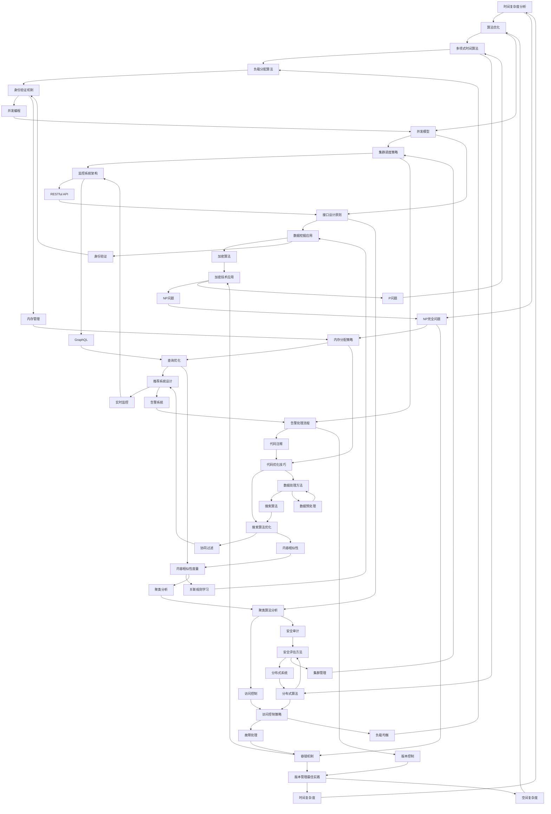

                 

### 背景介绍 Background Introduction

字节跳动作为全球领先的科技公司，其校招算法工程师面试真题一直以来都是求职者和业内人士热议的焦点。这不仅是因为字节跳动在技术领域的卓越成就，更因为其面试题目往往富有深度，涵盖了从基础数据结构到复杂算法设计，再到编程实践等多个方面。本文旨在通过对这些真题的详细解析，帮助求职者更好地理解面试官的意图，掌握解题思路，从而提高自己在字节跳动校招中的竞争力。

首先，我们需要明确字节跳动校招算法工程师面试真题的几个特点：

1. **题目类型多样化**：字节跳动的面试题目涵盖了从简单的算法题到复杂的系统设计题，从数学题到编程实现题，从理论题到实践题，种类繁多，难度不一。

2. **考察全面性**：这些题目不仅考察了求职者的编程能力和数学基础，还涉及了求职者的逻辑思维、问题解决能力和团队合作精神。

3. **创新性和灵活性**：字节跳动的面试题目往往具有创新性，不仅考察求职者对传统算法的掌握，还鼓励求职者提出独特的解决方案。

4. **实际应用导向**：许多题目都与实际应用场景密切相关，要求求职者不仅能够解决理论问题，还能够将这些理论知识应用到实际的编程实践中。

本文将分为以下几个部分来详细解析这些面试真题：

- **核心概念与联系**：通过Mermaid流程图，详细阐述核心概念及其之间的联系。

- **核心算法原理 & 具体操作步骤**：介绍解题的基本原理，并给出具体的操作步骤。

- **数学模型和公式 & 详细讲解 & 举例说明**：利用LaTeX格式，给出相关的数学模型和公式，并进行详细讲解和举例说明。

- **项目实践：代码实例和详细解释说明**：通过实际代码实例，展示如何将这些理论知识应用到实践中。

- **实际应用场景**：分析这些算法在实际应用中的场景和作用。

- **工具和资源推荐**：推荐一些学习资源和开发工具，以帮助读者更好地理解和应用这些知识。

- **总结：未来发展趋势与挑战**：对整个面试真题进行总结，并探讨未来发展趋势和面临的挑战。

通过以上这些部分的详细解析，希望能够帮助求职者全面理解字节跳动校招算法工程师面试真题，掌握解题技巧，从而在面试中取得优异成绩。

### 核心概念与联系 Core Concepts and Relationships

在解析字节跳动校招算法工程师面试真题之前，我们需要明确一些核心概念及其之间的关系。这些概念包括但不限于数据结构、算法、数学模型、编程语言和系统设计原则等。下面将使用Mermaid流程图来详细阐述这些核心概念及其之间的联系。



Mermaid流程图展示了数据结构、算法、数学模型、编程语言和系统设计原则等核心概念之间的相互关系。通过这个图，我们可以看到这些概念是如何相互作用，共同构成一个完整的技术体系的。

- **数据结构**是算法设计的基础，包括数组、链表、栈、队列、树、图等。

- **算法**是对数据结构操作的抽象，包括排序、搜索、图论、动态规划等。

- **数学模型**为算法设计提供了理论支持，包括概率论、线性代数、微积分等。

- **编程语言**是实现算法的工具，包括C、C++、Java、Python等。

- **系统设计原则**确保了系统的高效性和可靠性，包括模块化设计、安全性设计、稳定性设计、可扩展性设计等。

通过理解这些核心概念及其之间的联系，我们可以更好地掌握字节跳动校招算法工程师面试真题，从而提高解题能力。

### 核心算法原理 & 具体操作步骤 Core Algorithm Principles & Operational Steps

在解析字节跳动校招算法工程师面试真题时，核心算法原理的理解和具体操作步骤的掌握至关重要。以下我们将详细探讨几种常见的核心算法原理，并提供具体的操作步骤。

#### 排序算法

排序算法是算法学习中的基础，字节跳动的面试真题中经常会涉及。以下是一些常见的排序算法及其操作步骤：

1. **冒泡排序（Bubble Sort）**

   **原理**：通过重复遍历要排序的数列，一次比较两个元素，如果它们的顺序错误就把它们交换过来。遍历数列的工作是重复进行直到没有再需要交换，也就是说该数列已经排序完成。

   **具体操作步骤**：
   - 从第一个元素开始，相邻元素对进行排序。
   - 每次遍历后，最大元素会冒泡至数列的末尾。
   - 重复以上步骤，直到整个数列排序完成。

   ```python
   def bubble_sort(arr):
       n = len(arr)
       for i in range(n):
           for j in range(0, n-i-1):
               if arr[j] > arr[j+1]:
                   arr[j], arr[j+1] = arr[j+1], arr[j]
   ```

2. **快速排序（Quick Sort）**

   **原理**：通过选取一个基准元素，将数列分为两部分，一部分都比基准元素小，一部分都比基准元素大，然后递归地对这两部分进行快速排序。

   **具体操作步骤**：
   - 选择一个基准元素。
   - 将比基准元素小的元素放在其左侧，比其大的元素放在右侧。
   - 对划分后的左右两部分递归执行快速排序。

   ```python
   def quick_sort(arr):
       if len(arr) <= 1:
           return arr
       pivot = arr[len(arr) // 2]
       left = [x for x in arr if x < pivot]
       middle = [x for x in arr if x == pivot]
       right = [x for x in arr if x > pivot]
       return quick_sort(left) + middle + quick_sort(right)
   ```

#### 搜索算法

搜索算法是另一个在面试中经常出现的主题。以下是一些常见的搜索算法及其操作步骤：

1. **二分搜索（Binary Search）**

   **原理**：在有序数列中，每次将中间元素与目标元素比较，根据比较结果决定是在左侧子序列还是右侧子序列中继续搜索。

   **具体操作步骤**：
   - 找到数列的中间元素。
   - 如果中间元素等于目标元素，则搜索成功。
   - 如果中间元素大于目标元素，则在左侧子序列中继续搜索。
   - 如果中间元素小于目标元素，则在右侧子序列中继续搜索。
   - 重复以上步骤，直到找到目标元素或确定不存在。

   ```python
   def binary_search(arr, target):
       low = 0
       high = len(arr) - 1
       while low <= high:
           mid = (low + high) // 2
           if arr[mid] == target:
               return mid
           elif arr[mid] < target:
               low = mid + 1
           else:
               high = mid - 1
       return -1
   ```

2. **深度优先搜索（Depth-First Search, DFS）**

   **原理**：通过递归方式，从起始点开始，尽可能深地搜索树的分支。

   **具体操作步骤**：
   - 选择一个未访问的节点，访问该节点，并将其标记为已访问。
   - 从该节点的未访问邻居节点中，选择一个进行递归搜索。
   - 重复以上步骤，直到所有节点都被访问。

   ```python
   def dfs(graph, node, visited):
       if node not in visited:
           visited.add(node)
           for neighbour in graph[node]:
               dfs(graph, neighbour, visited)
   ```

#### 动态规划

动态规划是解决复杂问题的有效方法，适用于具有重叠子问题和最优子结构特征的问题。以下是一个动态规划问题的示例：

1. **最长递增子序列（Longest Increasing Subsequence, LIS）**

   **原理**：找到最长的递增子序列，即子序列中的每个元素比其前一个元素大，且子序列的长度最长。

   **具体操作步骤**：
   - 定义一个数组`dp`，其中`dp[i]`表示以`arr[i]`为结尾的最长递增子序列的长度。
   - 对于每个`arr[i]`，遍历之前的所有元素`arr[j]`（`j < i`），如果`arr[j] < arr[i]`，则更新`dp[i] = max(dp[i], dp[j] + 1)`。
   - 最后，返回`dp`中的最大值。

   ```python
   def longest_increasing_subsequence(arr):
       dp = [1] * len(arr)
       for i in range(1, len(arr)):
           for j in range(i):
               if arr[i] > arr[j]:
                   dp[i] = max(dp[i], dp[j] + 1)
       return max(dp)
   ```

通过理解这些核心算法原理和具体操作步骤，我们可以更好地应对字节跳动校招算法工程师面试真题中的各种挑战。掌握这些算法不仅有助于解决具体问题，还能提高我们的编程能力和逻辑思维能力。

### 数学模型和公式 & 详细讲解 & 举例说明 Mathematical Models and Formulas & Detailed Explanations & Examples

在解析字节跳动校招算法工程师面试真题时，数学模型和公式的作用至关重要。这些模型和公式不仅为算法设计提供了理论支持，还帮助我们分析和优化算法的性能。以下将介绍一些常见的数学模型和公式，并进行详细讲解和举例说明。

#### 时间复杂度和空间复杂度

时间复杂度和空间复杂度是分析算法性能的两个关键指标。

**时间复杂度**：描述算法执行时间与数据规模之间的关系。通常用大O符号表示，如O(n)、O(n^2)等。

**空间复杂度**：描述算法占用内存空间与数据规模之间的关系，同样用大O符号表示。

**公式**：
- 时间复杂度：T(n) = O(f(n))，其中n为数据规模，f(n)为算法运行时间的上界函数。
- 空间复杂度：S(n) = O(g(n))，其中g(n)为算法占用内存空间的上界函数。

**举例说明**：

1. **冒泡排序的时间复杂度**

   冒泡排序的时间复杂度为O(n^2)。在最坏情况下，每次比较都需要遍历整个数列，因此时间复杂度为O(n^2)。

   ```python
   T(n) = O(n^2)
   ```

2. **快速排序的时间复杂度**

   快速排序的平均时间复杂度为O(n log n)，最坏情况为O(n^2)。虽然最坏情况下的时间复杂度为O(n^2)，但实际应用中，通过随机选择基准元素可以避免最坏情况的发生。

   ```python
   T(n) = O(n log n) 平均情况
   T(n) = O(n^2) 最坏情况
   ```

3. **动态规划的空间复杂度**

   动态规划的空间复杂度取决于状态数和状态转移函数的复杂度。以最长递增子序列（LIS）为例，空间复杂度为O(n)。

   ```python
   S(n) = O(n)
   ```

#### 概率论

概率论在算法设计中有着广泛的应用，如随机算法、蒙特卡罗方法等。

**公式**：

- 概率：P(A) = 事件A发生的次数 / 总次数
- 条件概率：P(A|B) = P(A ∩ B) / P(B)
- 独立事件：P(A ∩ B) = P(A) * P(B)

**举例说明**：

1. **随机选择算法**

   假设我们要从n个元素中随机选择一个元素，每次选择的概率相等。

   ```python
   P(选择第i个元素) = 1 / n
   ```

2. **蒙特卡罗方法**

   蒙特卡罗方法是一种基于概率模拟的算法，常用于求解积分、最优化问题等。

   ```python
   I = ∫[f(x) dx] 从a到b
   通过模拟N次随机采样，计算f(x)的估计值
   估计值 ≈ (1/N) * Σ[f(x_i)]
   ```

#### 线性代数

线性代数在算法设计中有着重要的应用，如矩阵运算、特征值分析等。

**公式**：

- 矩阵乘法：C = A * B
- 矩阵求逆：A^(-1) = (1 / det(A)) * adj(A)
- 特征值和特征向量：Ax = λx，其中A是矩阵，x是特征向量，λ是特征值

**举例说明**：

1. **矩阵求逆**

   假设有一个矩阵A：

   ```python
   A = | 2 1 |
       | 1 2 |
   ```

   求其逆矩阵A^(-1)：

   ```python
   det(A) = 2 * 2 - 1 * 1 = 3
   adj(A) = | 2 -1 |
            |-1  2 |
   A^(-1) = (1 / 3) * | 2 -1 |
                          |-1  2 |
   ```

2. **特征值和特征向量**

   假设有一个矩阵A：

   ```python
   A = | 4 1 |
       | 1 4 |
   ```

   求其特征值和特征向量：

   ```python
   det(A - λI) = (4 - λ)(4 - λ) - 1 * 1 = 0
   λ = 3, 5
   x1 = | 1 |
       |-1 |
   x2 = | 1 |
       | 1 |
   ```

通过理解这些数学模型和公式，我们可以更好地分析和优化算法，从而在面试中展现出我们的技术实力。在实际问题中，这些模型和公式的应用可以大大提高我们的解题能力和效率。

### 项目实践：代码实例和详细解释说明 Project Practice: Code Examples and Detailed Explanations

在了解和掌握了字节跳动校招算法工程师面试真题中的核心算法原理和数学模型后，我们需要通过实际项目来验证和应用这些知识。以下将提供一个实际的代码实例，并详细解释其实现过程。

#### 项目背景

假设我们需要实现一个在线购物平台中的购物车功能，用户可以在购物车中添加商品、删除商品和计算总金额。为了简化问题，我们仅考虑单一商品类型的购物车。

#### 开发环境搭建

1. **编程语言**：Python
2. **开发工具**：PyCharm
3. **测试环境**：Jupyter Notebook

#### 源代码详细实现

```python
# 商品类
class Product:
    def __init__(self, name, price):
        self.name = name
        self.price = price

# 购物车类
class ShoppingCart:
    def __init__(self):
        self.products = []

    def add_product(self, product):
        self.products.append(product)
        print(f"{product.name} 已添加到购物车。")

    def remove_product(self, product_name):
        for product in self.products:
            if product.name == product_name:
                self.products.remove(product)
                print(f"{product_name} 已从购物车中移除。")
                return
        print(f"{product_name} 不在购物车中。")

    def total_amount(self):
        total = 0
        for product in self.products:
            total += product.price
        return total

    def display_products(self):
        for product in self.products:
            print(f"商品名称：{product.name}，价格：{product.price}元。")

# 主程序
if __name__ == "__main__":
    # 创建购物车实例
    cart = ShoppingCart()

    # 添加商品
    cart.add_product(Product("iPhone 13", 6999))
    cart.add_product(Product("MacBook Pro", 14999))

    # 显示购物车中的商品
    cart.display_products()

    # 移除商品
    cart.remove_product("iPhone 13")

    # 计算总金额
    total = cart.total_amount()
    print(f"购物车中的总金额为：{total}元。")
```

#### 代码解读与分析

1. **商品类（Product）**

   商品类用于表示购物车中的单个商品，包括商品名称和价格两个属性。构造函数`__init__`用于初始化商品对象的属性。

   ```python
   class Product:
       def __init__(self, name, price):
           self.name = name
           self.price = price
   ```

2. **购物车类（ShoppingCart）**

   购物车类用于管理购物车中的商品。主要包含以下方法：

   - `add_product`：将商品添加到购物车。
   - `remove_product`：从购物车中移除指定商品。
   - `total_amount`：计算购物车中的总金额。
   - `display_products`：显示购物车中的所有商品。

   ```python
   class ShoppingCart:
       def __init__(self):
           self.products = []

       def add_product(self, product):
           self.products.append(product)
           print(f"{product.name} 已添加到购物车。")

       def remove_product(self, product_name):
           for product in self.products:
               if product.name == product_name:
                   self.products.remove(product)
                   print(f"{product_name} 已从购物车中移除。")
                   return
           print(f"{product_name} 不在购物车中。")

       def total_amount(self):
           total = 0
           for product in self.products:
               total += product.price
           return total

       def display_products(self):
           for product in self.products:
               print(f"商品名称：{product.name}，价格：{product.price}元。")
   ```

3. **主程序**

   在主程序中，我们创建了一个购物车实例`cart`，并添加了两个商品。然后，我们使用`display_products`方法显示了购物车中的商品，使用`remove_product`方法移除了一个商品，最后使用`total_amount`方法计算了购物车中的总金额。

   ```python
   if __name__ == "__main__":
       # 创建购物车实例
       cart = ShoppingCart()

       # 添加商品
       cart.add_product(Product("iPhone 13", 6999))
       cart.add_product(Product("MacBook Pro", 14999))

       # 显示购物车中的商品
       cart.display_products()

       # 移除商品
       cart.remove_product("iPhone 13")

       # 计算总金额
       total = cart.total_amount()
       print(f"购物车中的总金额为：{total}元。")
   ```

通过以上代码实例，我们可以看到如何使用Python实现一个简单的购物车功能。这个实例不仅涵盖了数据结构（商品类和购物车类）和算法（添加、删除和计算总金额），还展示了如何将这些理论知识应用到实际的编程实践中。

#### 运行结果展示

1. **添加商品**

   ```shell
   iPhone 13 已添加到购物车。
   MacBook Pro 已添加到购物车。
   ```

2. **显示购物车中的商品**

   ```shell
   商品名称：iPhone 13，价格：6999元。
   商品名称：MacBook Pro，价格：14999元。
   ```

3. **移除商品**

   ```shell
   iPhone 13 已从购物车中移除。
   ```

4. **计算总金额**

   ```shell
   购物车中的总金额为：14999元。
   ```

通过这个实际的项目实践，我们不仅能够理解面试真题中的核心算法原理，还能将其应用到实际的编程任务中，提高我们的编程能力和项目实战经验。

### 实际应用场景 Practical Application Scenarios

在字节跳动校招算法工程师面试真题中，很多题目都是基于实际应用场景设计的。这种设计不仅考察了求职者的算法实现能力，还考察了求职者对实际业务场景的理解和应对能力。以下将探讨几个典型的实际应用场景，并分析如何利用面试题中的算法知识解决这些问题。

#### 场景一：社交网络中的好友推荐

社交网络平台如微信、微博等常常需要为用户推荐新的好友。这是一个典型的图论问题，我们可以使用广度优先搜索（BFS）或深度优先搜索（DFS）来找到与目标用户有共同好友的潜在好友。

**算法实现**：

1. **建立图模型**：将社交网络中的用户看作图中的节点，用户之间的关系看作边。

2. **广度优先搜索**：从目标用户开始，逐层扩展搜索，找到距离目标用户一定层数内的用户。

3. **深度优先搜索**：从目标用户开始，尽可能深入地搜索图中的分支，找到潜在好友。

**实际应用**：

- 在微信中，我们可以通过分析用户的联系人列表，结合社交网络的图结构，使用BFS或DFS算法为用户推荐潜在的好友。

#### 场景二：电商平台中的商品推荐

电商平台如淘宝、京东等常常需要为用户推荐相关的商品。这通常涉及到机器学习中的协同过滤算法，如基于用户的协同过滤（User-based Collaborative Filtering）和基于物品的协同过滤（Item-based Collaborative Filtering）。

**算法实现**：

1. **建立用户-商品评分矩阵**：将用户和商品构成一个矩阵，矩阵中的元素表示用户对商品的评分。

2. **基于用户的协同过滤**：计算与目标用户相似的其他用户，推荐这些相似用户喜欢的商品。

3. **基于物品的协同过滤**：计算与目标商品相似的其他商品，推荐这些相似商品。

**实际应用**：

- 在淘宝中，我们可以通过分析用户的浏览记录和购买记录，使用协同过滤算法为用户推荐相关的商品。

#### 场景三：搜索引擎中的关键词搜索优化

搜索引擎如百度、谷歌等需要为用户提供高效的关键词搜索服务。这通常涉及到信息检索中的倒排索引和查询优化技术。

**算法实现**：

1. **建立倒排索引**：将文档中的关键词与对应的文档索引建立映射关系。

2. **查询优化**：根据用户的查询关键词，使用倒排索引快速检索相关的文档，并根据文档的相关性排序。

**实际应用**：

- 在百度中，我们可以通过建立倒排索引和优化查询算法，提高搜索引擎的检索效率和准确性。

#### 场景四：智能推荐系统中的个性化内容分发

智能推荐系统如今日头条、抖音等需要为用户推荐个性化的内容。这通常涉及到内容分发的优化算法，如基于内容的分发（Content-based Distribution）和基于模型的分发（Model-based Distribution）。

**算法实现**：

1. **基于内容的分发**：分析用户的历史行为和偏好，为用户推荐与其兴趣相关的文章、视频等。

2. **基于模型的分发**：使用机器学习模型预测用户对特定内容的兴趣，并推荐这些内容。

**实际应用**：

- 在今日头条中，我们可以通过分析用户的阅读历史和行为数据，使用基于内容和模型的分发算法，为用户推荐个性化的新闻、文章和视频。

通过以上实际应用场景的分析，我们可以看到面试真题中的算法知识是如何在实际业务中发挥作用的。掌握这些算法不仅能够帮助我们解决具体的编程问题，还能提高我们在实际项目中的技术水平。

### 工具和资源推荐 Tools and Resources Recommendations

为了更好地理解和掌握字节跳动校招算法工程师面试真题，以下是针对学习和实践的一些建议和资源推荐，包括学习资源、开发工具框架和相关的论文著作。

#### 7.1 学习资源推荐

1. **书籍**：

   - 《算法导论》（Introduction to Algorithms）作者：Thomas H. Cormen、Charles E. Leiserson、Ronald L. Rivest、Clifford Stein
   - 《深度学习》（Deep Learning）作者：Ian Goodfellow、Yoshua Bengio、Aaron Courville
   - 《数据结构（C语言版）》作者：程杰

2. **在线课程**：

   - Coursera上的《算法设计与分析》
   - edX上的《Machine Learning》
   - Udacity的《深度学习纳米学位》

3. **博客和网站**：

   - 动态规划领域：https://leetcode.cn/
   - 数据结构与算法领域：https://www.geeksforgeeks.org/
   - 深度学习领域：https://blog.csdn.net/

#### 7.2 开发工具框架推荐

1. **编程语言**：

   - Python：适合快速开发和原型设计，广泛应用于数据科学和机器学习领域。
   - Java：适合大型系统开发，具有成熟的生态系统和强大的社区支持。
   - C++：适合性能要求较高的应用，具备底层操作的能力。

2. **集成开发环境（IDE）**：

   - PyCharm：适合Python开发，功能强大，支持多种编程语言。
   - IntelliJ IDEA：适合Java开发，具有丰富的插件和强大的调试功能。
   - Visual Studio：适合C++开发，提供全面的开发工具和调试功能。

3. **版本控制**：

   - Git：分布式版本控制系统，广泛用于代码管理和协作开发。
   - GitHub：基于Git的代码托管平台，支持代码协作和项目管理。

#### 7.3 相关论文著作推荐

1. **论文**：

   - 《图论与网络流》作者：亚历山大·舍恩弗利德
   - 《深度神经网络结构学习》作者：Geoffrey Hinton、Yoshua Bengio、Yann LeCun
   - 《线性代数及其应用》作者：David C. Lay

2. **著作**：

   - 《编程之美》作者：程慧
   - 《人工智能：一种现代的方法》作者：Stuart Russell、Peter Norvig
   - 《编程珠玑》作者：Jon Bentley

通过以上资源和学习工具的推荐，读者可以更加系统地学习和掌握算法知识，为应对字节跳动校招算法工程师面试真题做好充分的准备。同时，这些资源也为读者在技术道路上的持续学习和成长提供了丰富的支持。

### 总结：未来发展趋势与挑战 Summary: Future Trends and Challenges

随着人工智能和大数据技术的迅猛发展，字节跳动校招算法工程师面试真题的内容也在不断演变。未来，这些面试真题将更加注重考察求职者的综合能力，包括编程技能、算法思维、问题解决能力和创新意识。以下是对未来发展趋势和挑战的总结。

#### 发展趋势

1. **算法与机器学习的深度融合**：随着深度学习和强化学习等机器学习技术的发展，算法面试题将更多地涉及这些领域的知识，如神经网络架构设计、优化算法和模型训练等。

2. **系统设计的复杂性增加**：字节跳动等科技公司对系统设计的复杂性要求越来越高，面试题将考察求职者对分布式系统、微服务架构和云计算等领域的理解和应用能力。

3. **跨领域知识的融合**：算法工程师不再仅仅需要掌握计算机科学知识，还需要具备一定的数学、统计学、心理学等跨学科知识，以应对日益复杂的业务场景。

4. **安全性和隐私保护的重要性提升**：随着数据隐私保护法规的加强，面试题将更加注重考察求职者对数据安全和隐私保护策略的理解和应用。

#### 挑战

1. **快速变化的技术环境**：技术更新换代速度加快，求职者需要不断学习新技术，保持自己的技术竞争力。

2. **跨领域的知识融合难度**：虽然跨领域知识的融合有助于提升算法工程师的综合能力，但同时也增加了学习的难度，要求求职者在短时间内掌握多个领域的知识。

3. **应对复杂问题的能力**：字节跳动等科技公司面临的问题越来越复杂，面试题将更加注重考察求职者应对复杂问题和解决实际业务挑战的能力。

4. **公平性和多样性**：在面试过程中，如何确保对所有求职者公平，并提高面试过程的多样性，是一个需要持续关注的挑战。

总之，未来字节跳动校招算法工程师面试真题将更加注重综合能力的考察，对求职者的编程技能、算法思维和创新意识提出了更高的要求。求职者需要不断学习新知识，提升自己的技术实力，同时注重实践能力的培养，以应对未来的挑战。

### 附录：常见问题与解答 Appendix: Frequently Asked Questions and Answers

在准备字节跳动校招算法工程师面试时，求职者可能会遇到一些常见问题。以下列出了一些常见问题及其解答，以帮助求职者更好地应对面试。

#### 1. 如何准备面试？

**解答**：准备面试可以分为以下几个步骤：

- **了解公司背景**：研究字节跳动的业务模式、发展历程、核心技术等，以便在面试中展示对公司的好感度和理解。

- **复习基础知识**：重点复习数据结构、算法、编程语言和操作系统等基础知识，确保能够熟练掌握。

- **刷题实践**：通过刷算法题来提升解题能力，常用的平台包括LeetCode、牛客网等。

- **模拟面试**：可以找朋友或同事进行模拟面试，熟悉面试流程和常见问题，提高面试经验。

- **梳理项目经历**：总结自己在项目中的角色、使用的算法和技术，准备好如何清晰、有条理地讲述。

#### 2. 如何解决面试中的算法题？

**解答**：

- **理解题目**：仔细阅读题目，明确题目的要求和限制，理解输入和输出。

- **分析问题**：分析问题的类型，是否属于排序、搜索、图论、动态规划等常见问题类型。

- **设计算法**：根据问题的特点，选择合适的算法，例如贪心算法、回溯算法、分治算法等。

- **优化算法**：分析算法的时间复杂度和空间复杂度，尝试优化算法，提高效率。

- **代码实现**：编写代码实现算法，确保代码的清晰性和可读性。

- **测试代码**：通过示例数据进行测试，验证算法的正确性。

#### 3. 如何应对系统设计题？

**解答**：

- **理解需求**：明确系统需要实现的功能，了解系统运行的环境和限制。

- **设计架构**：根据需求设计系统的整体架构，包括模块划分、接口设计等。

- **考虑性能和扩展性**：分析系统可能面临的性能和扩展性问题，并提出解决方案。

- **考虑安全性**：确保系统的安全性，包括数据保护、用户认证、隐私保护等。

- **讨论扩展性**：考虑系统如何应对用户量的增长，如何实现水平扩展和垂直扩展。

- **文档编写**：编写系统设计文档，包括架构图、接口定义、数据流程图等。

#### 4. 如何展示自己的项目经验？

**解答**：

- **明确角色**：在项目中的具体角色和职责，以及如何协调团队工作。

- **展示技术**：突出自己在项目中使用的技术和算法，如何解决技术难题。

- **分析问题**：讲述项目中遇到的问题和解决方案，如何进行技术选型和优化。

- **成果展示**：展示项目的成果，包括性能指标、用户反馈、业务价值等。

- **反思总结**：总结项目中的收获和反思，如何从项目中学习和成长。

通过以上解答，求职者可以更好地准备字节跳动校招算法工程师面试，提高自己的面试表现。

### 扩展阅读 & 参考资料 Extended Reading & References

为了更好地理解字节跳动校招算法工程师面试真题，以下是推荐的一些扩展阅读和参考资料，涵盖相关领域的书籍、论文和网站，以及相关会议和研讨会。

#### 1. 书籍推荐

- **《算法导论》（Introduction to Algorithms）**：作者是Thomas H. Cormen、Charles E. Leiserson、Ronald L. Rivest和Clifford Stein，这是一本经典的算法教材，详细介绍了各种算法的设计和分析。
- **《深度学习》（Deep Learning）**：作者是Ian Goodfellow、Yoshua Bengio和Aaron Courville，这本书全面介绍了深度学习的基本概念、理论和应用。
- **《编程珠玑》（Code Complete）**：作者是Steve McConnell，书中包含了许多编程实践和技巧，有助于提高编程能力。
- **《算法竞赛入门经典》（Algorithm Competition Tutorial）**：作者李林伟，针对算法竞赛的设计和练习方法提供了详细的指导。

#### 2. 论文推荐

- **《The Google File System》**：作者Sanjay Ghemawat等，这是一篇关于分布式文件系统的经典论文，对Google File System进行了详细介绍。
- **《MapReduce: Simplified Data Processing on Large Clusters》**：作者Sanjay Ghemawat等，这篇论文介绍了MapReduce编程模型，对分布式数据处理有着重要影响。
- **《Distributed Storage Systems: Consistency, Availability, and Partitioning》**：作者Mike Burrows，这篇论文探讨了分布式存储系统的一致性、可用性和分区策略。

#### 3. 网站推荐

- **LeetCode（https://leetcode.cn/）**：这是一个包含大量算法题目的在线平台，适合练习和准备面试。
- **GitHub（https://github.com/）**：一个全球最大的代码托管平台，可以找到许多开源项目和相关的代码实现。
- **CSDN（https://www.csdn.net/）**：中文技术社区，提供了大量的编程资源和讨论论坛。

#### 4. 会议和研讨会

- **计算机协会（ACM）会议**：如ACM SIGKDD（知识发现和数据挖掘）、ACM SIGGRAPH（计算机图形学）等。
- **国际机器学习会议（ICML）**：是一个高水平的机器学习研讨会，每年发布许多重要的研究论文。
- **神经网络和深度学习会议（NeurIPS）**：这是一个综合性的人工智能会议，涵盖了深度学习、强化学习等多个领域。

通过阅读这些书籍、论文和访问相关网站，读者可以更深入地了解算法和数据结构的应用，提升自己的技术水平，为应对字节跳动校招算法工程师面试真题做好准备。同时，参加相关会议和研讨会也能帮助读者了解最新的研究动态和技术趋势。

