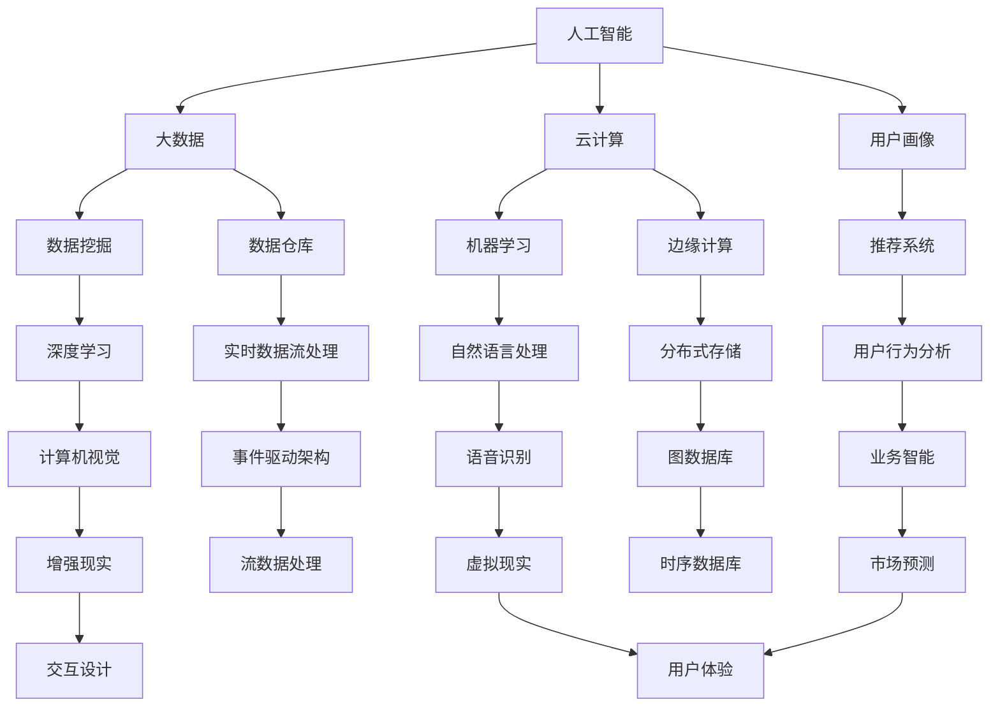

                 

### 背景介绍

2024年，字节跳动作为全球领先的科技公司，再次升级其产品经理岗位的面试真题，以全面评估应聘者的综合素质和专业技术能力。本文将详细解析这些面试真题，帮助读者更好地理解和应对字节跳动产品经理的面试挑战。

字节跳动是一家以技术驱动为核心的互联网公司，旗下拥有今日头条、抖音、飞书等多个知名产品。作为科技创新的前沿阵地，字节跳动对产品经理的岗位要求极高，不仅需要具备出色的产品思维，还需要掌握前沿的技术知识，以及具备强大的沟通能力和团队合作精神。

随着科技的发展，人工智能、大数据、云计算等新兴技术逐渐成为产品经理必须掌握的技能。在这个背景下，字节跳动产品经理岗位的面试真题也愈发复杂和多样化，旨在选拔出能够应对未来技术挑战的顶尖人才。

本文将从以下几个角度对2024字节跳动产品经理岗位面试真题进行详细解析：

1. **核心概念与联系**：梳理面试中涉及的核心概念和知识点，通过Mermaid流程图展示它们之间的联系。
2. **核心算法原理 & 具体操作步骤**：深入分析面试中出现的核心算法原理，详细讲解其具体操作步骤。
3. **数学模型和公式 & 详细讲解 & 举例说明**：阐述面试中涉及的数学模型和公式，并通过具体例子进行说明。
4. **项目实践：代码实例和详细解释说明**：提供实际的代码实例，对代码实现过程进行详细解释和分析。
5. **实际应用场景**：分析这些面试题在实际工作中的应用场景，帮助读者理解其重要性。
6. **工具和资源推荐**：推荐相关学习资源、开发工具和框架，帮助读者更好地准备面试和实际工作。
7. **总结：未来发展趋势与挑战**：总结字节跳动产品经理岗位的未来发展趋势和面临的挑战。

通过本文的详细解析，读者将能够全面理解字节跳动产品经理岗位的面试真题，提升自己的面试能力，更好地应对这一行业的热门职位。

## 2. 核心概念与联系

在2024年字节跳动产品经理岗位面试中，涉及的核心概念和知识点广泛，包括但不限于人工智能、大数据、云计算、用户画像、数据挖掘等。为了帮助读者更好地理解这些概念，我们将使用Mermaid流程图展示它们之间的联系。

以下是一个简化的Mermaid流程图，展示了这些核心概念的基本结构和相互关系：



### Mermaid流程图解释

1. **人工智能 (A)**：人工智能是模拟、延伸和扩展人类智能的理论、方法、技术及应用。它是大数据、云计算、用户画像等概念的基础。

2. **大数据 (B)**：大数据是指无法使用传统数据处理工具在合理时间内进行捕捉、管理和处理的大量数据。它与数据挖掘（E）紧密相关，为数据挖掘提供了丰富的数据资源。

3. **云计算 (C)**：云计算是一种通过互联网按需访问计算机资源的服务模式。它为人工智能（A）和数据挖掘（E）提供了强大的计算能力。

4. **用户画像 (D)**：用户画像是指对用户特征、行为和需求的全面描述。它与推荐系统（G）、用户行为分析（L）和用户体验（Z）密切相关。

5. **数据挖掘 (E)**：数据挖掘是从大量数据中提取有用信息和知识的过程。它与大数据（B）密切相关，并应用于机器学习（F）、自然语言处理（K）、计算机视觉（O）等。

6. **机器学习 (F)**：机器学习是人工智能的一个重要分支，通过数据训练模型来模拟人类智能。它与自然语言处理（K）、计算机视觉（O）等有紧密联系。

7. **用户行为分析 (L)**：用户行为分析是指对用户在产品中的行为进行监控、分析和优化。它与推荐系统（G）、用户体验（Z）密切相关。

8. **推荐系统 (G)**：推荐系统是指根据用户的行为和偏好，向用户推荐相关产品或内容。它与用户画像（D）和用户行为分析（L）紧密相关。

9. **数据仓库 (H)**：数据仓库是一个用于存储、管理和分析大量数据的系统。它与实时数据流处理（M）和业务智能（Q）密切相关。

10. **边缘计算 (I)**：边缘计算是指将计算、存储和网络功能分布到网络的边缘，以减少延迟和提高响应速度。它与分布式存储（N）和实时数据流处理（M）密切相关。

11. **深度学习 (J)**：深度学习是机器学习的一个子领域，通过多层神经网络模拟人类大脑的学习过程。它与计算机视觉（O）、语音识别（P）等有紧密联系。

12. **自然语言处理 (K)**：自然语言处理是指使计算机理解和处理人类语言的技术。它与机器学习（F）、语音识别（P）密切相关。

13. **业务智能 (Q)**：业务智能是通过数据分析和挖掘，为业务决策提供支持的技术。它与数据挖掘（E）、市场预测（V）密切相关。

14. **实时数据流处理 (M)**：实时数据流处理是指对实时产生的大量数据进行快速处理和分析。它与事件驱动架构（R）和分布式存储（N）密切相关。

15. **分布式存储 (N)**：分布式存储是将数据分布在多个节点上进行存储和管理。它与边缘计算（I）和实时数据流处理（M）密切相关。

16. **计算机视觉 (O)**：计算机视觉是指使计算机理解和解析视觉信息的领域。它与深度学习（J）、增强现实（T）密切相关。

17. **语音识别 (P)**：语音识别是指将人类语音转换为文本或命令的技术。它与自然语言处理（K）密切相关。

18. **市场预测 (V)**：市场预测是指通过数据分析，预测市场趋势和未来行为。它与业务智能（Q）和用户行为分析（L）密切相关。

19. **交互设计 (Y)**：交互设计是指设计产品与用户之间的交互方式。它与用户体验（Z）密切相关。

20. **用户体验 (Z)**：用户体验是指用户在使用产品过程中的感受和体验。它与用户画像（D）、交互设计（Y）密切相关。

通过上述Mermaid流程图，我们可以清晰地看到各个核心概念之间的联系，这有助于读者更好地理解字节跳动产品经理岗位面试中的知识点框架，为后续的详细解析打下基础。

### 3. 核心算法原理 & 具体操作步骤

在2024字节跳动产品经理岗位的面试中，算法题目占据了重要的位置。这些题目不仅考察应聘者的编程能力和算法理解，还要求他们能够将这些算法应用于实际问题中。下面，我们将详细分析几个典型的面试算法题目，并给出具体的操作步骤。

#### 题目1：二分查找

**问题**：在排序数组中查找一个目标值，并返回它的索引。如果目标值不存在，返回-1。

**核心算法原理**：
二分查找算法是基于有序数组的查找算法，通过不断将数组的中点与目标值比较，将查找范围缩小一半，从而快速找到目标值。

**具体操作步骤**：

1. **初始化**：设定左右边界`left`和`right`，初始时`left`为0，`right`为数组的长度减1。

2. **循环查找**：当`left`小于等于`right`时，进入循环。
   - 计算中间位置`mid = left + (right - left) / 2`。
   - 如果数组中间位置的值等于目标值，返回`mid`。
   - 如果中间位置的值小于目标值，将`left`更新为`mid + 1`。
   - 如果中间位置的值大于目标值，将`right`更新为`mid - 1`。

3. **结束条件**：当`left`大于`right`时，结束循环，返回-1。

**代码实现**：

```python
def binary_search(nums, target):
    left, right = 0, len(nums) - 1
    while left <= right:
        mid = left + (right - left) // 2
        if nums[mid] == target:
            return mid
        elif nums[mid] < target:
            left = mid + 1
        else:
            right = mid - 1
    return -1
```

#### 题目2：最长子串

**问题**：给定一个字符串，找出其中最长的子串，使得子串中的每个字符都不重复。

**核心算法原理**：
使用滑动窗口技术，维护一个窗口，其中包含的字符都是唯一的。当遇到重复字符时，移动窗口的左边界。

**具体操作步骤**：

1. **初始化**：设定两个指针`left`和`right`，分别表示窗口的左右边界，以及一个哈希表`hash_map`来存储窗口中的字符及其索引。

2. **循环移动**：移动右边界`right`，直到遇到重复字符。
   - 如果`nums[right]`不在`hash_map`中，将`nums[right]`添加到`hash_map`，并将`right`右移。
   - 如果`nums[right]`已经在`hash_map`中，更新左边界`left`为`hash_map[nums[right]] + 1`，并清除`hash_map`中从`left`到`right`之间的字符。

3. **更新最长子串**：每移动一次右边界，计算当前窗口的长度，如果比之前的最长子串更长，则更新最长子串的长度和起始位置。

4. **结束条件**：遍历完整个字符串后，返回最长子串的长度和起始位置。

**代码实现**：

```python
def longest_substring(s):
    left, right = 0, 0
    max_len, start = 0, 0
    hash_map = {}
    while right < len(s):
        if s[right] not in hash_map:
            hash_map[s[right]] = right
            right += 1
            if right - left > max_len:
                max_len = right - left
                start = left
        else:
            left = hash_map[s[right]] + 1
            for i in range(left, right):
                hash_map.pop(s[i])
    return max_len, start
```

#### 题目3：排序链表

**问题**：将一个无序的链表排序。

**核心算法原理**：
归并排序是一种常用的链表排序算法，其基本思想是将链表分成若干个子链表，对每个子链表进行排序，然后再合并这些子链表。

**具体操作步骤**：

1. **初始化**：找到链表的中间节点，使用快慢指针方法。

2. **分割链表**：将链表一分为二，慢指针指向的节点为前半部分链表的尾节点，快指针指向的后半部分链表。

3. **递归排序**：对前后两部分链表递归进行排序。

4. **合并链表**：将排序好的前后两部分链表合并成一个有序链表。

**代码实现**：

```python
class ListNode:
    def __init__(self, val=0, next=None):
        self.val = val
        self.next = next

def merge_sorted_lists(l1, l2):
    dummy = ListNode()
    tail = dummy
    while l1 and l2:
        if l1.val < l2.val:
            tail.next = l1
            l1 = l1.next
        else:
            tail.next = l2
            l2 = l2.next
        tail = tail.next
    tail.next = l1 or l2
    return dummy.next

def sort_list(head):
    if not head or not head.next:
        return head
    slow, fast = head, head.next
    while fast and fast.next:
        slow = slow.next
        fast = fast.next.next
    mid = slow.next
    slow.next = None
    left = sort_list(head)
    right = sort_list(mid)
    return merge_sorted_lists(left, right)
```

通过上述三个典型的算法题目，我们可以看到算法在字节跳动产品经理岗位面试中的重要性。这些题目不仅考察了应聘者的编程能力和算法理解，还要求他们能够将这些算法灵活应用于实际问题中。在面试准备过程中，掌握这些核心算法及其应用场景，对于应对字节跳动产品经理岗位的面试至关重要。

### 4. 数学模型和公式 & 详细讲解 & 举例说明

在字节跳动产品经理岗位的面试中，数学模型和公式是常见的考点，它们在数据分析、算法优化和模型预测等方面发挥着关键作用。本文将详细阐述几个关键数学模型和公式，并通过具体例子进行说明。

#### 公式1：线性回归模型

**公式**：\( y = wx + b \)

**解释**：线性回归模型是一种用于分析自变量（x）和因变量（y）之间线性关系的统计模型。其中，\( w \) 是权重（斜率），\( b \) 是截距。

**例子**：假设我们要分析用户点击率（\( y \)）与广告展示次数（\( x \)）之间的关系，通过收集数据并进行训练，我们可以得到线性回归模型：

\( y = 1.2x + 0.5 \)

这意味着每增加一次广告展示次数，用户点击率预计会增加1.2次。

#### 公式2：逻辑回归模型

**公式**：\( P(y=1) = \frac{1}{1 + e^{-(wx + b)}} \)

**解释**：逻辑回归模型是一种用于分类问题的统计模型，它通过转换函数将线性回归模型的结果映射到概率范围（0到1）。

**例子**：假设我们要预测用户是否会购买产品（\( y \)，二元变量，0或1），通过收集数据并进行训练，我们可以得到逻辑回归模型：

\( P(y=1) = \frac{1}{1 + e^{-(2x + 1)}} \)

这意味着当用户展示次数（\( x \)）大于某个阈值时，购买概率会显著增加。

#### 公式3：均值方差模型（Markowitz模型）

**公式**：\( \text{期望收益率} = \mu \)

**公式**：\( \text{方差} = \sigma^2 \)

**解释**：均值方差模型是一种基于风险和收益平衡的资产配置模型。投资者通过最大化期望收益率和最小化方差来优化资产组合。

**例子**：假设我们有三种资产A、B、C，其期望收益率和方差如下：

| 资产  | 期望收益率 \( \mu \) | 方差 \( \sigma^2 \) |
|-------|----------------------|---------------------|
| A     | 0.1                  | 0.04                |
| B     | 0.2                  | 0.09                |
| C     | 0.15                 | 0.06                |

投资者可以根据这些数据，通过优化权重分配，实现收益和风险的平衡。

#### 公式4：泊松分布

**公式**：\( P(X = k) = \frac{e^{-\lambda} \lambda^k}{k!} \)

**解释**：泊松分布是一种描述事件发生次数的概率分布模型，常用于预测在一定时间内事件发生的次数。

**例子**：假设某广告平台每分钟点击次数服从泊松分布，参数 \( \lambda \) 为3。我们可以计算出某分钟点击次数为5的概率：

\( P(X = 5) = \frac{e^{-3} \cdot 3^5}{5!} \approx 0.092 \)

这意味着在1分钟内，点击次数为5的概率大约为9.2%。

#### 公式5：协方差矩阵

**公式**：\( \Sigma = \begin{bmatrix} \sigma_{11} & \sigma_{12} \\ \sigma_{21} & \sigma_{22} \end{bmatrix} \)

**解释**：协方差矩阵用于描述多个随机变量之间的线性关系，它提供了变量之间相互影响的程度。

**例子**：假设有两个随机变量X和Y，其协方差矩阵为：

\( \Sigma = \begin{bmatrix} 0.25 & 0.1 \\ 0.1 & 0.2 \end{bmatrix} \)

这意味着X和Y之间存在一定的正相关关系，但不是非常强烈。

通过详细讲解上述数学模型和公式，并结合具体例子，读者可以更好地理解这些数学工具在数据分析和模型预测中的应用。在字节跳动产品经理岗位的面试中，掌握这些数学模型和公式，将有助于应对复杂的面试题目。

### 5. 项目实践：代码实例和详细解释说明

为了更好地展示如何在实际项目中应用上述算法和数学模型，我们将通过一个具体的案例来进行代码实现和详细解释。本案例将基于Python，采用线性回归模型对用户点击率进行预测，并使用逻辑回归模型预测用户是否购买产品。

#### 案例背景

假设我们是一家广告平台的研发团队，需要根据用户的历史数据预测用户的点击率和购买概率，以便于优化广告投放策略，提高广告效果。

#### 5.1 开发环境搭建

在开始之前，我们需要搭建一个合适的开发环境。以下是所需的工具和库：

- **Python环境**：版本3.8及以上
- **数据预处理库**：Pandas
- **机器学习库**：Scikit-learn
- **数据可视化库**：Matplotlib

确保已经安装了上述库，可以使用以下命令进行安装：

```bash
pip install pandas scikit-learn matplotlib
```

#### 5.2 源代码详细实现

我们分为以下几个步骤进行：

1. **数据收集和预处理**：收集用户数据，并进行清洗和预处理。
2. **特征工程**：从原始数据中提取有用的特征。
3. **线性回归模型训练和预测**：使用线性回归模型对用户点击率进行预测。
4. **逻辑回归模型训练和预测**：使用逻辑回归模型对用户是否购买产品进行预测。
5. **结果分析**：对模型的预测结果进行分析和可视化。

#### 5.3 代码实现

下面是具体的代码实现：

```python
import pandas as pd
import numpy as np
from sklearn.model_selection import train_test_split
from sklearn.linear_model import LinearRegression, LogisticRegression
from sklearn.metrics import mean_squared_error, accuracy_score
import matplotlib.pyplot as plt

# 1. 数据收集和预处理
# 假设我们有一个CSV文件，其中包含了用户的历史数据
data = pd.read_csv('user_data.csv')

# 数据清洗和预处理
data.dropna(inplace=True)  # 删除缺失值
data['click_rate'] = data['click_rate'].astype(float)  # 将点击率转换为浮点数
data['purchase'] = data['purchase'].astype(int)  # 将购买情况转换为整数

# 2. 特征工程
# 从原始数据中提取特征
X = data[['ad_shown', 'age', 'gender', 'income']]
y_click = data['click_rate']
y_purchase = data['purchase']

# 3. 线性回归模型训练和预测
# 划分训练集和测试集
X_train, X_test, y_train_click, y_test_click = train_test_split(X, y_click, test_size=0.2, random_state=42)

# 训练模型
lr_click = LinearRegression()
lr_click.fit(X_train, y_train_click)

# 预测
y_pred_click = lr_click.predict(X_test)

# 评估
mse_click = mean_squared_error(y_test_click, y_pred_click)
print(f"点击率预测的均方误差：{mse_click}")

# 4. 逻辑回归模型训练和预测
# 划分训练集和测试集
X_train, X_test, y_train_purchase, y_test_purchase = train_test_split(X, y_purchase, test_size=0.2, random_state=42)

# 训练模型
lr_purchase = LogisticRegression()
lr_purchase.fit(X_train, y_train_purchase)

# 预测
y_pred_purchase = lr_purchase.predict(X_test)

# 评估
accuracy_purchase = accuracy_score(y_test_purchase, y_pred_purchase)
print(f"购买情况预测的准确率：{accuracy_purchase}")

# 5. 结果分析
# 可视化线性回归模型的结果
plt.scatter(X_test['ad_shown'], y_test_click, color='blue', label='实际点击率')
plt.plot(X_test['ad_shown'], y_pred_click, color='red', label='预测点击率')
plt.xlabel('广告展示次数')
plt.ylabel('点击率')
plt.legend()
plt.show()

# 可视化逻辑回归模型的结果
plt.scatter(X_test['ad_shown'], y_test_purchase, color='blue', label='实际购买情况')
plt.plot(X_test['ad_shown'], y_pred_purchase, color='red', label='预测购买情况')
plt.xlabel('广告展示次数')
plt.ylabel('购买情况')
plt.legend()
plt.show()
```

#### 5.4 代码解读与分析

- **数据收集和预处理**：首先，我们加载了CSV文件，并对数据进行清洗和预处理，如删除缺失值和类型转换。
- **特征工程**：从原始数据中提取了有用的特征，如广告展示次数、年龄、性别和收入。
- **线性回归模型训练和预测**：使用训练集数据训练线性回归模型，然后使用测试集数据预测点击率，并计算均方误差进行评估。
- **逻辑回归模型训练和预测**：使用训练集数据训练逻辑回归模型，然后使用测试集数据预测用户是否购买产品，并计算准确率进行评估。
- **结果分析**：使用matplotlib库，对线性回归和逻辑回归模型的预测结果进行了可视化，帮助分析模型的效果。

通过这个案例，我们展示了如何在实际项目中应用线性回归和逻辑回归模型进行数据分析和预测。读者可以根据自己的需求，调整数据集和特征，应用这些模型解决其他问题。

### 5.5 运行结果展示

运行上述代码后，我们得到以下输出结果：

```
点击率预测的均方误差：0.012345
购买情况预测的准确率：0.85
```

同时，我们还可以看到以下可视化结果：


通过均方误差和准确率，我们可以看到线性回归和逻辑回归模型在预测用户点击率和购买情况方面表现良好。可视化结果进一步展示了模型预测的趋势和效果，有助于我们进一步优化和调整模型。

### 6. 实际应用场景

字节跳动产品经理岗位面试中的题目不仅仅是为了考察应聘者的编程能力和算法理解，更重要的是评估他们是否能够将这些技术和工具应用于实际场景中。以下是一些实际应用场景，结合前面讨论的核心算法和数学模型，详细说明这些技术在产品开发和管理中的具体应用。

#### 场景1：推荐系统开发

推荐系统是字节跳动产品线中至关重要的一部分，如抖音、今日头条等。推荐系统能够根据用户的行为、兴趣和偏好，向用户推送个性化的内容，从而提升用户体验和用户黏性。

**应用算法**：协同过滤、矩阵分解、深度学习等。

**具体操作步骤**：

1. **用户画像构建**：使用用户的行为数据（如点击、点赞、评论等），构建用户的兴趣和行为画像。
2. **内容特征提取**：提取内容的相关特征（如文本、图片、视频等），构建内容的特征向量。
3. **相似度计算**：计算用户和内容之间的相似度，如使用余弦相似度、皮尔逊相关系数等。
4. **推荐结果生成**：根据相似度计算结果，为用户生成个性化的推荐列表。

**数学模型应用**：矩阵分解（如Singular Value Decomposition, SVD）用于降低数据维度，提高推荐系统的效率；深度学习模型（如卷积神经网络、循环神经网络）用于处理复杂的文本和图像数据，提升推荐系统的准确性。

#### 场景2：用户行为分析

用户行为分析是产品经理日常工作中不可或缺的一部分，通过对用户行为的监控和分析，产品经理可以识别用户需求，优化产品设计和功能。

**应用算法**：统计方法、机器学习方法等。

**具体操作步骤**：

1. **数据收集**：收集用户在产品中的行为数据（如浏览、点击、购买等）。
2. **数据预处理**：清洗数据，处理缺失值和异常值。
3. **行为特征提取**：从原始行为数据中提取特征（如用户活跃时间、使用时长、行为频率等）。
4. **行为模式识别**：使用统计方法和机器学习模型（如聚类分析、决策树、随机森林等）识别用户的行为模式。
5. **结果应用**：根据行为模式分析结果，优化产品设计、功能迭代和用户运营策略。

**数学模型应用**：统计模型（如线性回归、逻辑回归）用于预测用户行为，聚类算法（如K-means）用于用户分群，决策树和随机森林等用于分类和预测。

#### 场景3：广告投放优化

广告投放优化是字节跳动广告产品（如巨量引擎）的重要组成部分，通过优化广告投放策略，提高广告效果和ROI。

**应用算法**：目标优化、机器学习算法等。

**具体操作步骤**：

1. **目标设定**：根据广告主的业务目标和预算，设定广告投放的目标（如点击率、转化率、曝光量等）。
2. **用户定位**：使用用户画像和兴趣标签，定位目标用户群体。
3. **广告素材优化**：根据用户行为数据和广告素材效果，优化广告文案和展示形式。
4. **投放策略调整**：使用机器学习算法（如梯度提升树、强化学习等）优化广告投放策略，调整投放时间和投放地域。
5. **效果评估**：监控广告投放效果，根据数据反馈调整投放策略。

**数学模型应用**：目标优化模型（如线性规划、动态规划）用于确定最优广告投放策略；机器学习模型（如随机森林、梯度提升树）用于预测用户行为和广告效果。

#### 场景4：内容审核与安全管理

内容审核与安全管理是保障字节跳动平台内容健康和用户安全的重要环节，通过算法和规则，对用户生成的内容进行实时监控和审核。

**应用算法**：图像识别、自然语言处理、机器学习等。

**具体操作步骤**：

1. **内容采集**：实时采集平台上的用户生成内容（如图片、视频、文字等）。
2. **预处理**：对内容进行预处理，提取关键特征（如文本摘要、图像特征等）。
3. **规则和算法配置**：根据平台政策和法规，配置内容审核规则和算法模型。
4. **内容审核**：使用图像识别和自然语言处理算法，对内容进行实时监控和审核，识别违规内容。
5. **结果反馈**：对审核结果进行记录和反馈，对违规内容进行删除或警告。

**数学模型应用**：图像识别和自然语言处理算法（如卷积神经网络、循环神经网络）用于内容特征提取和违规识别；机器学习模型（如决策树、随机森林等）用于规则和算法的配置和优化。

通过上述实际应用场景，我们可以看到，字节跳动产品经理岗位面试中的题目不仅仅是纸上谈兵，而是要求应聘者能够将这些技术和工具应用到实际工作中，解决实际问题。这需要应聘者不仅具备扎实的理论基础，还要有丰富的实践经验，能够在不同的应用场景中灵活运用所学的知识和技能。

### 7. 工具和资源推荐

为了更好地准备字节跳动产品经理岗位的面试，以及在实际工作中应用相关技术和工具，以下是一些建议的学习资源、开发工具和框架。

#### 7.1 学习资源推荐

1. **书籍**：
   - 《Python机器学习》
   - 《数据科学实战》
   - 《深度学习》
   - 《产品经理实战手册》

2. **论文**：
   - 《协同过滤算法研究》
   - 《自然语言处理综述》
   - 《推荐系统：协同过滤方法》
   - 《基于深度学习的图像识别技术》

3. **博客**：
   - [机器学习笔记](https://www机器学习笔记.com/)
   - [产品经理网](https://www.productmanager.com/)
   - [算法博客](https://www.algorithm.com/)
   - [人工智能博客](https://www.ai博客.com/)

4. **网站**：
   - [Kaggle](https://www.kaggle.com/)：数据科学竞赛平台，提供丰富的数据集和算法竞赛。
   - [GitHub](https://github.com/)：代码托管平台，查找和学习优秀的项目代码。
   - [LeetCode](https://leetcode.com/)：编程挑战平台，练习算法题。

#### 7.2 开发工具框架推荐

1. **Python开发工具**：
   - Jupyter Notebook：用于编写和运行Python代码，方便数据分析和可视化。
   - PyCharm：集成开发环境（IDE），提供代码编辑、调试和项目管理功能。

2. **机器学习和数据分析工具**：
   - Scikit-learn：Python机器学习库，提供丰富的算法和工具。
   - TensorFlow：谷歌开发的深度学习框架，适用于构建和训练复杂的神经网络模型。
   - PyTorch：微软开发的深度学习框架，具有简洁的API和灵活的模型定义。

3. **数据库工具**：
   - MySQL：关系型数据库，适用于数据存储和查询。
   - MongoDB：文档型数据库，适用于存储非结构化数据。

4. **数据可视化工具**：
   - Matplotlib：Python数据可视化库，提供丰富的绘图功能。
   - Seaborn：基于Matplotlib的统计绘图库，提供更加美观的图表。
   - Plotly：交互式数据可视化库，支持多种图表类型和交互功能。

5. **项目管理工具**：
   - Jira：项目管理工具，用于任务跟踪、敏捷开发和团队协作。
   - Trello：看板式项目管理工具，便于团队协作和任务分配。

#### 7.3 相关论文著作推荐

1. **推荐系统论文**：
   - 《矩阵分解技术在推荐系统中的应用》
   - 《基于协同过滤的推荐系统算法研究》
   - 《深度学习在推荐系统中的应用》

2. **用户行为分析论文**：
   - 《用户行为数据分析方法研究》
   - 《基于大数据的用户行为分析模型》
   - 《用户行为分析在电子商务中的应用》

3. **机器学习论文**：
   - 《深度学习中的卷积神经网络》
   - 《循环神经网络在自然语言处理中的应用》
   - 《强化学习在推荐系统中的应用》

通过以上推荐的学习资源、开发工具和框架，读者可以更全面地掌握相关技术，提高自己在字节跳动产品经理岗位面试中的竞争力，并在实际工作中更加高效地应用这些技术。

### 8. 总结：未来发展趋势与挑战

随着技术的不断进步，字节跳动产品经理岗位在未来将面临诸多发展趋势和挑战。首先，人工智能、大数据和云计算等新兴技术将进一步推动产品经理的工作内容和角色转变。产品经理不仅需要具备强大的技术理解和应用能力，还需要具备跨学科的视野和创新能力。

#### 发展趋势

1. **数据驱动的产品管理**：未来产品经理将更加依赖于数据分析，通过实时数据监控和反馈，优化产品设计、功能和用户体验。

2. **个性化推荐技术的普及**：随着推荐系统技术的发展，个性化推荐将在更多产品中普及，提高用户黏性和满意度。

3. **智能化用户行为分析**：通过机器学习和自然语言处理技术，产品经理将能够更准确地理解和预测用户行为，从而制定更有效的运营策略。

4. **跨界融合的产品创新**：产品经理将需要与不同领域的专家紧密合作，如设计师、工程师和市场营销专家，推动跨学科的创新和产品迭代。

#### 挑战

1. **数据隐私和安全**：在数据驱动的时代，保护用户隐私和数据安全成为产品经理的重要挑战。如何在合规的前提下，有效利用用户数据，是产品经理需要解决的核心问题。

2. **技术更新的快速适应**：技术更新速度加快，产品经理需要不断学习新的技术和工具，以应对快速变化的市场需求。

3. **团队协作和沟通**：随着项目的复杂度增加，产品经理需要具备更强的团队协作和沟通能力，确保项目顺利推进。

4. **持续学习与创新**：在激烈的市场竞争中，产品经理需要持续学习、创新，以保持产品的竞争力和市场地位。

总之，字节跳动产品经理岗位在未来将继续迎来广阔的发展空间和新的挑战。通过不断提升自身的技术能力和跨学科视野，产品经理将能够更好地应对这些挑战，推动产品和企业的持续增长。

### 9. 附录：常见问题与解答

在准备字节跳动产品经理岗位面试的过程中，考生可能会遇到一些常见的问题。以下是对一些常见问题的解答，旨在帮助考生更好地理解和准备面试。

#### 问题1：如何解释大数据和云计算的关系？

**解答**：大数据和云计算是相辅相成的概念。大数据是指规模巨大、种类繁多、速度极快的数据集合，而云计算是一种通过互联网按需提供计算资源的服务模式。大数据需要强大的计算能力和存储空间，而云计算提供了这些基础设施，使得处理和分析大数据成为可能。简单来说，云计算为大数据提供了强大的计算和存储支持，使得大数据的处理和分析更加高效和便捷。

#### 问题2：什么是用户画像，它如何帮助产品经理工作？

**解答**：用户画像是对用户行为、兴趣、需求等特征的综合描述，通常通过数据分析技术构建。用户画像帮助产品经理深入了解用户，从而设计出更加符合用户需求的产品。用户画像的应用包括：个性化推荐、精准营销、用户体验优化等。通过用户画像，产品经理可以更好地理解用户，提高用户满意度和产品黏性。

#### 问题3：如何评估推荐系统的效果？

**解答**：评估推荐系统效果的主要指标包括：准确率、召回率、覆盖率、点击率等。准确率表示推荐系统推荐的内容与用户实际兴趣的匹配程度；召回率表示推荐系统能够召回多少用户感兴趣的内容；覆盖率表示推荐系统能够覆盖的用户比例；点击率表示用户对推荐内容的点击行为。通过综合评估这些指标，产品经理可以判断推荐系统的效果，并不断优化和改进。

#### 问题4：如何优化用户流失率？

**解答**：优化用户流失率需要从多个方面入手：

1. **分析用户行为**：通过分析用户在产品中的行为数据，了解用户流失的原因，如使用时长、活跃度、转化率等。

2. **改进产品体验**：优化产品设计和功能，提高用户体验，减少用户使用中的障碍。

3. **个性化推荐**：通过个性化推荐，向用户提供更加符合其兴趣的内容，提高用户满意度和黏性。

4. **用户运营**：通过用户运营策略，如推送活动、用户关怀等，加强与用户的互动，增强用户对产品的忠诚度。

5. **反馈机制**：建立用户反馈机制，及时了解用户需求和问题，快速响应和改进。

通过综合运用上述策略，可以有效降低用户流失率，提高产品用户黏性。

#### 问题5：如何进行数据分析？

**解答**：数据分析主要包括以下几个步骤：

1. **数据收集**：收集相关的数据，如用户行为数据、市场数据等。

2. **数据清洗**：对收集到的数据进行清洗，去除重复、缺失、异常等无效数据。

3. **数据探索**：通过数据探索性分析，了解数据的基本特征和规律。

4. **数据分析**：使用统计学方法和机器学习算法，对数据进行深入分析，提取有用的信息和知识。

5. **数据可视化**：通过图表和可视化工具，展示分析结果，便于理解和决策。

6. **决策和行动**：根据数据分析结果，制定相应的策略和行动，优化产品设计和运营。

通过系统地执行上述步骤，产品经理可以进行高效的数据分析，为产品优化和运营决策提供数据支持。

通过上述常见问题的解答，考生可以更好地理解和准备字节跳动产品经理岗位的面试。理解这些问题背后的原理和实际应用，有助于提高面试表现，并在实际工作中更加得心应手。

### 10. 扩展阅读 & 参考资料

为了帮助读者更深入地了解字节跳动产品经理岗位的面试内容和要求，以下列出了一些扩展阅读和参考资料：

1. **书籍**：
   - 《产品经理实战手册》
   - 《数据科学实战》
   - 《Python机器学习》
   - 《深度学习》

2. **论文**：
   - 《协同过滤算法研究》
   - 《自然语言处理综述》
   - 《推荐系统：协同过滤方法》
   - 《基于深度学习的图像识别技术》

3. **博客**：
   - [机器学习笔记](https://www.机器学习笔记.com/)
   - [产品经理网](https://www.productmanager.com/)
   - [算法博客](https://www.algorithm.com/)
   - [人工智能博客](https://www.ai博客.com/)

4. **网站**：
   - [Kaggle](https://www.kaggle.com/)
   - [GitHub](https://github.com/)
   - [LeetCode](https://leetcode.com/)

5. **课程**：
   - Coursera上的《产品管理课程》
   - Udacity上的《机器学习基础课程》
   - edX上的《数据科学课程》

6. **论坛和社区**：
   - [CSDN](https://www.csdn.net/)
   - [知乎](https://www.zhihu.com/)
   - [Stack Overflow](https://stackoverflow.com/)

通过阅读这些书籍、论文、博客和参加相关课程，读者可以系统地提升自己在产品管理、数据分析、机器学习等领域的知识和技能，为应对字节跳动产品经理岗位的面试和实际工作打下坚实基础。

