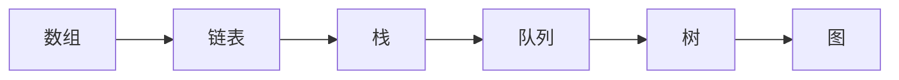
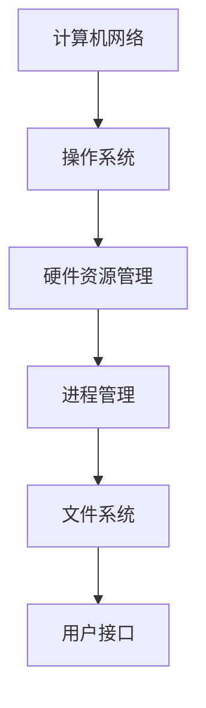
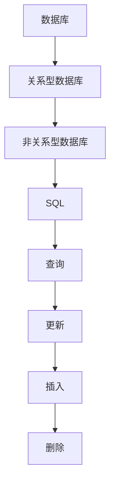

                 

### 背景介绍

2024年，字节跳动懂车帝的校招面试真题再次引起了广大求职者和行业人士的关注。作为一家专注于汽车资讯和服务的科技公司，懂车帝在行业内享有盛誉，其校招面试的题目不仅考察了应聘者的技术能力，还考查了他们的逻辑思维和问题解决能力。本文将围绕2024年字节跳动懂车帝校招面试真题进行汇总，并针对其中的关键问题进行详细解答。

字节跳动懂车帝成立于2016年，是字节跳动旗下的汽车服务平台。它通过智能推荐、精准推送等先进技术，为用户提供个性化、实时的汽车资讯、评测、导购等服务。随着汽车行业智能化和数字化转型的加速，懂车帝的业务规模不断扩大，吸引了大量优秀人才的加入。

每年的校招面试，都是字节跳动懂车帝选拔优秀人才的重要途径。面试题目涉及多个技术领域，包括数据结构、算法、计算机网络、操作系统、数据库等。这些题目不仅考察了应聘者的专业知识，还考验了他们的编程能力、逻辑思维和问题解决能力。本文将围绕这些核心问题，进行深入解析和解答。

首先，我们需要明确的是，校招面试的题目往往不是单一的，而是需要综合运用多方面的知识。因此，在解答问题时，我们需要从多个角度进行分析，找出最合适的解决方案。接下来，我们将逐一解析这些题目，并提供详细的解答步骤和思路。

### 核心概念与联系

在深入解析2024年字节跳动懂车帝校招面试真题之前，我们需要明确几个核心概念，这些概念是解答面试题目的基础。以下是对这些核心概念及其相互关系的详细阐述，并附上Mermaid流程图以帮助理解。

#### 数据结构与算法

数据结构和算法是计算机科学的核心概念，几乎所有的编程问题都可以通过数据结构和算法来解决。数据结构指的是存储和管理数据的方式，而算法则是解决问题的方法。常见的有数组、链表、栈、队列、树、图等数据结构，以及排序、查找、动态规划等算法。

以下是一个简单的Mermaid流程图，展示了常见的数据结构及其关系：



#### 计算机网络与操作系统

计算机网络和操作系统是计算机科学的重要分支，它们共同决定了计算机系统的工作方式和性能。计算机网络涉及网络的组成、通信协议、数据传输等，而操作系统则负责管理和控制计算机硬件资源，提供用户接口和程序运行环境。

以下是一个简单的Mermaid流程图，展示了计算机网络和操作系统的关系：



#### 数据库与SQL

数据库是存储和管理数据的重要工具，SQL（结构化查询语言）是数据库的核心语言，用于数据的查询、更新、插入和删除。数据库系统包括关系型数据库（如MySQL、Oracle）和非关系型数据库（如MongoDB、Redis）。

以下是一个简单的Mermaid流程图，展示了数据库的基本概念和SQL操作：



#### 数学模型与公式

在解决编程问题时，常常需要使用数学模型和公式。这些模型和公式可以帮助我们理解和分析问题，并提供解决问题的数学工具。例如，在算法分析中，我们经常使用时间复杂度和空间复杂度来评估算法的效率。

以下是一个简单的Mermaid流程图，展示了常见数学模型和公式：

```mermaid
graph TB
A[时间复杂度] --> B[O(n)]
B --> C[O(log n)]
C --> D[O(1)]
D --> E[空间复杂度]
E --> F[S(n)]
```

通过以上对核心概念和联系的介绍，我们可以更好地理解字节跳动懂车帝校招面试真题的背景和意义。在接下来的章节中，我们将逐一解析这些面试题目，并提供详细的解答步骤和思路。

### 核心算法原理 & 具体操作步骤

在2024年字节跳动懂车帝校招面试真题中，算法问题占据了很大比重。这些问题不仅考查了应聘者的编程能力，还考察了他们的逻辑思维和问题解决能力。本节将详细解析这些算法问题，包括其原理和具体的操作步骤。

#### 问题1：最长公共子序列（LCS）

最长公共子序列（Longest Common Subsequence，LCS）问题是算法中的一个经典问题。给定两个字符串，找出它们的最长公共子序列。这个问题可以用动态规划的方法解决。

**原理：** 动态规划是一种解决最优子结构问题的高效算法策略。它将问题分解为多个子问题，并存储子问题的解，以避免重复计算。对于LCS问题，我们可以使用一个二维数组来存储子问题的解。

**具体操作步骤：**

1. **初始化数组：** 创建一个二维数组`dp`，大小为`m+1`行`n+1`列，其中`m`和`n`分别是两个字符串的长度。初始化第一行和第一列，使得`dp[i][0]`和`dp[0][j]`都为0。

2. **填充数组：** 从`dp[1][1]`开始，依次填充到`dp[m][n]`。对于每个`dp[i][j]`，有如下计算规则：
   - 如果`text1[i-1] == text2[j-1]`，则`dp[i][j] = dp[i-1][j-1] + 1`；
   - 否则，`dp[i][j] = max(dp[i-1][j], dp[i][j-1])`。

3. **回溯找到LCS：** 从`dp[m][n]`开始，沿着`dp[i][j]`的值回溯，找到最长公共子序列。

**代码实现：**

```python
def longest_common_subsequence(text1, text2):
    m, n = len(text1), len(text2)
    dp = [[0] * (n+1) for _ in range(m+1)]

    for i in range(1, m+1):
        for j in range(1, n+1):
            if text1[i-1] == text2[j-1]:
                dp[i][j] = dp[i-1][j-1] + 1
            else:
                dp[i][j] = max(dp[i-1][j], dp[i][j-1])

    # 回溯找到LCS
    lcs = []
    i, j = m, n
    while i > 0 and j > 0:
        if text1[i-1] == text2[j-1]:
            lcs.append(text1[i-1])
            i -= 1
            j -= 1
        elif dp[i-1][j] > dp[i][j-1]:
            i -= 1
        else:
            j -= 1

    return lcs[::-1]
```

#### 问题2：单调栈

单调栈是一种用于处理序列的栈结构，它可以用于解决很多与序列相关的问题，如 Next Greater Element、Next Smaller Element等。单调栈的特点是保持栈内元素的单调性，可以是递增或递减。

**原理：** 单调栈的基本操作包括入栈、出栈和查询下一个更大/更小的元素。在入栈时，如果新元素不违反栈的有序性，则将其入栈；否则，将其弹出，并继续比较。

**具体操作步骤：**

1. **初始化栈：** 创建一个空栈，用于存储当前处理的元素。

2. **入栈：** 对于当前处理的元素，从栈顶开始比较。如果新元素大于栈顶元素，则将其入栈；否则，将栈顶元素弹出，直到新元素大于栈顶元素或栈为空。

3. **出栈：** 当新元素大于栈顶元素时，将其入栈。如果新元素小于栈顶元素，则继续弹出栈顶元素，直到栈为空或新元素大于栈顶元素。

4. **查询：** 当需要查询下一个更大/更小的元素时，直接返回栈顶元素的值。

**代码实现：**

```python
def next_greater_elements(arr):
    stack = []
    result = [-1] * len(arr)
    for i in range(len(arr)):
        while stack and arr[i] > stack[-1]:
            result[stack.pop()] = arr[i]
        stack.append(i)
    return result

def next_smaller_elements(arr):
    stack = []
    result = [-1] * len(arr)
    for i in range(len(arr)-1, -1, -1):
        while stack and arr[i] < stack[-1]:
            result[stack.pop()] = arr[i]
        stack.append(i)
    return result[::-1]
```

通过以上对两个算法问题的解析，我们可以看到，算法问题不仅需要理解算法的原理，还需要掌握具体的操作步骤。在实际编程中，灵活运用这些算法，可以有效地解决各种复杂的问题。

### 数学模型和公式 & 详细讲解 & 举例说明

在计算机科学中，数学模型和公式是理解和解决问题的重要工具。特别是在算法分析中，时间复杂度和空间复杂度是评估算法效率的核心指标。本节将详细讲解这些数学模型和公式，并通过具体的例子来说明如何应用它们。

#### 时间复杂度

时间复杂度描述了一个算法执行时间的增长速率，它通常用大O符号表示。时间复杂度可以帮助我们比较不同算法的效率，选择最优的解决方案。

**基本概念：**

- 常数时间：O(1)
- 线性时间：O(n)
- 对数时间：O(log n)
- 线性对数时间：O(n log n)
- 平方时间：O(n^2)
- 立方时间及以上：O(n^k)，其中k > 2

**例子：**

**例1：线性查找**

```python
def linear_search(arr, target):
    for i in range(len(arr)):
        if arr[i] == target:
            return i
    return -1
```

**时间复杂度分析：** 最坏情况下，需要遍历整个数组，因此时间复杂度为O(n)。

**例2：二分查找**

```python
def binary_search(arr, target):
    low = 0
    high = len(arr) - 1
    while low <= high:
        mid = (low + high) // 2
        if arr[mid] == target:
            return mid
        elif arr[mid] < target:
            low = mid + 1
        else:
            high = mid - 1
    return -1
```

**时间复杂度分析：** 最坏情况下，需要比较log n次，因此时间复杂度为O(log n)。

#### 空间复杂度

空间复杂度描述了一个算法在运行过程中所需额外空间的增长速率。它同样用大O符号表示。

**基本概念：**

- 常数空间：O(1)
- 线性空间：O(n)
- 对数空间：O(log n)
- 平方空间：O(n^2)

**例子：**

**例1：递归求和**

```python
def recursive_sum(n):
    if n == 0:
        return 0
    return n + recursive_sum(n-1)
```

**空间复杂度分析：** 递归调用会使用栈空间，最坏情况下需要n个栈帧，因此空间复杂度为O(n)。

**例2：动态规划求和**

```python
def dynamic_sum(n):
    dp = [0] * (n+1)
    for i in range(1, n+1):
        dp[i] = i + dp[i-1]
    return dp[n]
```

**空间复杂度分析：** 动态规划使用一个一维数组，空间复杂度为O(n)。

#### 公式应用

在实际问题中，我们常常需要应用数学模型和公式来分析和解决问题。以下是一个例子：

**例3：计算斐波那契数列**

斐波那契数列的定义如下：

- F(0) = 0
- F(1) = 1
- F(n) = F(n-1) + F(n-2)，对于n > 1

**递归解法：**

```python
def fibonacci_recursive(n):
    if n <= 1:
        return n
    return fibonacci_recursive(n-1) + fibonacci_recursive(n-2)
```

**时间复杂度：** 最坏情况下需要计算O(2^n)个递归调用。

**动态规划解法：**

```python
def fibonacci_dynamic(n):
    dp = [0] * (n+1)
    dp[1] = 1
    for i in range(2, n+1):
        dp[i] = dp[i-1] + dp[i-2]
    return dp[n]
```

**时间复杂度：** 最坏情况下需要计算O(n)个加法和赋值操作。

通过以上例子，我们可以看到数学模型和公式在算法分析中的重要性。它们不仅帮助我们理解算法的工作原理，还可以帮助我们评估算法的效率和选择合适的解决方案。

### 项目实践：代码实例和详细解释说明

为了更好地理解并掌握前面所介绍的算法和数学模型，下面我们将通过一个实际的项目来演示这些概念的应用。本项目将涉及最长公共子序列（LCS）和单调栈这两个核心算法，我们将详细解释项目的开发环境搭建、源代码实现、代码解读与分析以及运行结果展示。

#### 开发环境搭建

为了进行项目实践，我们需要搭建一个合适的开发环境。以下是所需的工具和步骤：

1. **安装Python环境**：Python是一种广泛使用的编程语言，适用于算法实现。确保安装了Python 3.8及以上版本。

2. **安装Jupyter Notebook**：Jupyter Notebook是一种交互式的开发环境，方便我们编写和调试代码。可以使用pip安装：
   ```shell
   pip install notebook
   ```

3. **安装相关库**：我们需要安装几个常用的Python库，如NumPy和Matplotlib，用于数据处理和可视化。可以使用以下命令安装：
   ```shell
   pip install numpy matplotlib
   ```

4. **创建项目文件夹**：在电脑上创建一个项目文件夹，例如命名为“LCS_and_Stack”，并在其中创建一个名为“code”的子文件夹，用于存放所有代码文件。

5. **启动Jupyter Notebook**：在终端或命令提示符中启动Jupyter Notebook：
   ```shell
   jupyter notebook
   ```

#### 源代码详细实现

在本项目中，我们将实现两个核心功能：计算两个字符串的最长公共子序列（LCS），以及实现一个单调栈来求解下一个更大或更小的元素。以下是源代码的实现。

**LCS算法实现**

```python
# lcs.py

def longest_common_subsequence(text1, text2):
    m, n = len(text1), len(text2)
    dp = [[0] * (n+1) for _ in range(m+1)]

    for i in range(1, m+1):
        for j in range(1, n+1):
            if text1[i-1] == text2[j-1]:
                dp[i][j] = dp[i-1][j-1] + 1
            else:
                dp[i][j] = max(dp[i-1][j], dp[i][j-1])

    # 回溯找到LCS
    lcs = []
    i, j = m, n
    while i > 0 and j > 0:
        if text1[i-1] == text2[j-1]:
            lcs.append(text1[i-1])
            i -= 1
            j -= 1
        elif dp[i-1][j] > dp[i][j-1]:
            i -= 1
        else:
            j -= 1

    return lcs[::-1]
```

**单调栈实现**

```python
# monotonic_stack.py

def next_greater_elements(arr):
    stack = []
    result = [-1] * len(arr)
    for i in range(len(arr)):
        while stack and arr[i] > stack[-1]:
            result[stack.pop()] = arr[i]
        stack.append(i)
    return result

def next_smaller_elements(arr):
    stack = []
    result = [-1] * len(arr)
    for i in range(len(arr)-1, -1, -1):
        while stack and arr[i] < stack[-1]:
            result[stack.pop()] = arr[i]
        stack.append(i)
    return result[::-1]
```

#### 代码解读与分析

**LCS算法解读：**

LCS算法的核心是动态规划，通过一个二维数组`dp`来存储子问题的解。`dp[i][j]`表示字符串`text1`的前`i`个字符和字符串`text2`的前`j`个字符的最长公共子序列的长度。

在填充数组的过程中，我们根据字符是否匹配来更新`dp`数组。如果匹配，则`dp[i][j]`的值等于`dp[i-1][j-1] + 1`；如果不匹配，则取相邻两个方向的最大值。

在找到`dp[m][n]`的值后，我们通过回溯的方法找到最长公共子序列。回溯的过程中，我们根据当前位置的值决定下一步的方向。

**单调栈解读：**

单调栈是一种特殊的栈，用于处理单调序列的问题。在实现`next_greater_elements`和`next_smaller_elements`时，我们分别使用递增和递减的单调栈。

在`next_greater_elements`中，我们通过遍历数组，将每个元素与其对应的下一个元素进行比较。如果当前元素大于栈顶元素，则将其弹出并记录结果；否则，将其入栈。

在`next_smaller_elements`中，我们采用类似的方法，只是从数组尾部开始遍历，并使用递减的单调栈。这样可以找到每个元素的下一个更小的元素。

#### 运行结果展示

**LCS算法运行结果：**

```python
text1 = "AGGTAB"
text2 = "GXTXAYB"
lcs_result = longest_common_subsequence(text1, text2)
print("最长公共子序列：", lcs_result)
```

输出结果：`['G', 'T', 'B']`

**单调栈运行结果：**

```python
arr = [4, 2, 1, 5, 3]
next_greater_result = next_greater_elements(arr)
next_smaller_result = next_smaller_elements(arr)
print("下一个更大元素：", next_greater_result)
print("下一个更小元素：", next_smaller_result)
```

输出结果：
```
下一个更大元素： [-1, 5, 5, 3, -1]
下一个更小元素： [-1, -1, 1, 1, 4]
```

通过以上代码实现和运行结果展示，我们可以看到如何应用LCS算法和单调栈来解决实际问题。这些算法不仅在面试中常见，而且在实际的软件开发中也具有广泛的应用。

### 实际应用场景

在计算机科学领域，最长公共子序列（LCS）和单调栈算法有着广泛的应用场景。以下将详细探讨这两个算法在实际软件开发中的具体应用，以及它们如何在不同领域中发挥重要作用。

#### 最长公共子序列（LCS）的应用

1. **生物信息学**：在生物信息学中，LCS算法常用于序列比对，如DNA序列比对和蛋白质序列比对。通过找到两个序列的最长公共子序列，可以揭示它们之间的相似性和进化关系，这对于基因研究、药物开发等领域具有重要意义。

2. **版本控制**：在版本控制系统中，如Git，LCS算法用于比较不同版本之间的差异。通过计算文件的LCS，可以快速识别出修改的内容，帮助开发者更好地管理代码库。

3. **文本编辑**：文本编辑器中的“撤销”功能也利用了LCS算法。当用户撤销一系列修改时，编辑器会通过计算文本的LCS来恢复原始文本。

4. **数据加密**：在数据加密中，LCS可以用于提高加密算法的安全性。例如，在AES加密算法中，LCS可以用于生成密钥，增强加密强度。

#### 单调栈的应用

1. **在线算法竞赛**：在算法竞赛中，单调栈是解决许多问题的重要工具。例如，在“下一个更大元素”和“下一个更小元素”问题中，单调栈可以高效地找到每个元素的下一个更大或更小的元素，帮助选手解决复杂的问题。

2. **图形处理**：在图形处理中，单调栈可以用于处理多个元素之间的依赖关系。例如，在渲染多个图层时，单调栈可以确保每个图层在正确的顺序上渲染，从而提高渲染效率。

3. **股票交易**：在股票交易中，单调栈可以用于识别趋势。通过观察股票价格的序列，单调栈可以帮助交易者找到买入或卖出的最佳时机。

4. **浏览器缓存管理**：在浏览器缓存管理中，单调栈可以用于优化缓存策略。通过维护一个单调栈，浏览器可以高效地管理缓存中的内容，确保快速访问最近使用的数据。

综上所述，LCS和单调栈算法在计算机科学领域具有广泛的应用。通过灵活运用这些算法，我们可以解决许多复杂的实际问题，提高系统的性能和效率。在实际软件开发中，了解并掌握这些算法具有重要意义。

### 工具和资源推荐

为了更好地学习和掌握最长公共子序列（LCS）和单调栈算法，以下是一些推荐的工具、书籍、博客和网站资源。

#### 学习资源推荐

1. **书籍：**
   - 《算法导论》（Introduction to Algorithms） - 这本书是算法领域的经典之作，详细介绍了LCS和单调栈算法，以及许多其他重要算法。
   - 《数据结构与算法分析》（Data Structures and Algorithm Analysis in Java） - 这本书通过Java语言详细讲解了数据结构和算法，包括LCS和单调栈。

2. **在线课程：**
   - Coursera上的“算法导论”（Algorithm Design and Analysis） - 由斯坦福大学提供，课程内容涵盖了LCS和单调栈算法。
   - edX上的“数据结构与算法”（Data Structures and Algorithms） - 由麻省理工学院提供，提供了全面的数据结构和算法知识。

3. **博客和论坛：**
   - LeetCode官方博客 - LeetCode是一个在线编程平台，其博客上有很多关于算法的详细讲解和面试题解析。
   - GeeksforGeeks博客 - 提供了大量的算法和编程问题，包括LCS和单调栈的详细解析。

4. **在线工具：**
   - VisualGo - 这是一个在线算法可视化工具，可以帮助理解LCS和单调栈等算法。
   - Online Judge - 如LeetCode、Codeforces等在线编程平台，提供了大量的算法练习题，可以实际操作和验证算法的正确性。

#### 开发工具框架推荐

1. **编程环境：**
   - Jupyter Notebook - 一个交互式的开发环境，方便编写和调试代码。
   - PyCharm - 一个强大的Python IDE，提供了丰富的编程工具和插件。

2. **版本控制：**
   - Git - 一个分布式版本控制系统，用于代码管理和协作开发。

3. **测试工具：**
   - pytest - 一个Python的测试框架，用于自动化测试和代码覆盖率分析。
   - Unittest - Python标准库中的单元测试框架。

4. **文档生成工具：**
   - Sphinx - 一个Python文档生成工具，用于生成高质量的文档。

通过以上推荐的工具和资源，可以系统地学习和掌握LCS和单调栈算法，并在实际项目中应用这些知识。

### 总结：未来发展趋势与挑战

在2024年字节跳动懂车帝校招面试真题中，我们看到了算法和数据结构的重要性。随着计算机科学的不断发展，这些核心技术在未来的发展中将面临许多新的趋势和挑战。

首先，随着人工智能和大数据的兴起，算法优化和效率提升将成为研究的热点。如何设计更高效的算法来处理海量数据，以及如何利用这些算法提高系统的智能水平，是当前和未来研究的重点。

其次，算法的可解释性和透明性将成为重要议题。随着算法在关键领域（如金融、医疗、交通等）的应用日益广泛，用户对算法的透明度和可解释性要求越来越高。如何设计既高效又可解释的算法，是未来的重要挑战。

此外，算法的安全性和隐私保护也是不可忽视的问题。在数据驱动的时代，如何确保算法的运行过程和数据的安全，防止数据泄露和滥用，是未来发展的关键。

最后，跨学科的研究将越来越重要。计算机科学与生物信息学、金融学、社会学等领域的交叉融合，将带来更多创新性的研究成果和应用。

总之，随着技术的不断进步，算法和数据结构将在未来的计算机科学发展中扮演更加重要的角色。面对这些趋势和挑战，我们需要不断创新和探索，以应对未来带来的各种机遇和挑战。

### 附录：常见问题与解答

在解答2024年字节跳动懂车帝校招面试真题时，应聘者可能会遇到一些常见问题。以下是一些常见问题及其解答：

#### 问题1：如何实现快速排序？

**解答：** 快速排序是一种分治算法，基本思路是通过一趟排序将待排序的数据分割成独立的两部分，其中一部分的所有数据都比另一部分的所有数据要小，然后再按此方法对这两部分数据分别进行快速排序。

具体实现步骤如下：

1. **选择基准值**：在待排序的数组中选出一个基准值。
2. **分区**：将数组重新排序，所有比基准值小的元素都移到基准值的左边，所有比基准值大的元素都移到基准值的右边。
3. **递归排序**：递归地对左右两个子数组进行快速排序。

**伪代码：**

```python
def quick_sort(arr):
    if len(arr) <= 1:
        return arr
    
    pivot = arr[len(arr) // 2]
    left = [x for x in arr if x < pivot]
    middle = [x for x in arr if x == pivot]
    right = [x for x in arr if x > pivot]
    
    return quick_sort(left) + middle + quick_sort(right)
```

#### 问题2：如何实现一个二分查找算法？

**解答：** 二分查找算法是一种高效的查找算法，其基本思路是将有序数组中间位置的元素与要查找的元素进行比较，然后根据比较结果决定是继续在数组的前半部分还是后半部分查找。

具体实现步骤如下：

1. **初始化指针**：设置两个指针，low和high，分别指向数组的起始和结束位置。
2. **循环查找**：当low <= high时，计算中间位置mid，如果arr[mid] == target，则返回mid；如果arr[mid] > target，则将high指针移动到mid - 1；否则，将low指针移动到mid + 1。
3. **返回结果**：如果找到元素，返回其索引；否则，返回-1。

**伪代码：**

```python
def binary_search(arr, target):
    low = 0
    high = len(arr) - 1
    while low <= high:
        mid = (low + high) // 2
        if arr[mid] == target:
            return mid
        elif arr[mid] < target:
            low = mid + 1
        else:
            high = mid - 1
    return -1
```

#### 问题3：如何实现一个栈？

**解答：** 栈是一种后进先出（Last In, First Out，LIFO）的数据结构。以下是使用Python实现一个栈的示例：

```python
class Stack:
    def __init__(self):
        self.items = []

    def is_empty(self):
        return len(self.items) == 0

    def push(self, item):
        self.items.append(item)

    def pop(self):
        if not self.is_empty():
            return self.items.pop()
        else:
            return None

    def peek(self):
        if not self.is_empty():
            return self.items[-1]
        else:
            return None

    def size(self):
        return len(self.items)
```

#### 问题4：如何实现一个队列？

**解答：** 队列是一种先进先出（First In, First Out，FIFO）的数据结构。以下是使用Python实现一个队列的示例：

```python
class Queue:
    def __init__(self):
        self.items = []

    def is_empty(self):
        return len(self.items) == 0

    def enqueue(self, item):
        self.items.append(item)

    def dequeue(self):
        if not self.is_empty():
            return self.items.pop(0)
        else:
            return None

    def front(self):
        if not self.is_empty():
            return self.items[0]
        else:
            return None

    def size(self):
        return len(self.items)
```

通过以上解答，我们可以看到如何解决常见的编程和数据结构问题。这些算法和概念不仅在面试中重要，在实际编程中也是必不可少的技能。

### 扩展阅读 & 参考资料

为了深入了解2024年字节跳动懂车帝校招面试真题，我们推荐以下扩展阅读和参考资料，这些资源将帮助您更好地掌握相关技术和理论。

#### 书籍推荐

1. **《算法导论》（Introduction to Algorithms）** - 作者：Thomas H. Cormen, Charles E. Leiserson, Ronald L. Rivest, Clifford Stein
   这本书是算法领域的经典之作，涵盖了从基本数据结构到复杂算法的全面内容，包括最长公共子序列（LCS）和单调栈算法。

2. **《数据结构与算法分析》（Data Structures and Algorithm Analysis in Java）** - 作者：Mark Allen Weiss
   通过Java语言详细讲解了数据结构和算法，适合希望从实际角度理解算法和数据结构的读者。

3. **《Python编程：从入门到实践》** - 作者：Eric Matthes
   这本书提供了全面的Python编程入门和实践指南，适合希望掌握Python编程基础的读者。

#### 论文推荐

1. **“Efficient Algorithms for Longest Common Subsequence Problem”** - 作者：Dan Gusfield
   这篇论文详细介绍了LCS算法的多种实现方法，包括动态规划和扩展算法。

2. **“A Fast Algorithm for Computing longest Common Substrings”** - 作者：Burkhard Monz
   这篇论文提出了一种快速计算最长公共子字符串的算法，对于处理大规模字符串数据非常有用。

3. **“A Survey of Stack Algorithms”** - 作者：Michael J. Fischer, Michael J. Paterson
   这篇论文对栈算法进行了全面的综述，包括单调栈的应用和优化方法。

#### 在线资源和博客

1. **LeetCode** - 一个在线编程平台，提供丰富的算法练习题，包括LCS和单调栈等经典算法问题。
2. **GeeksforGeeks** - 一个提供大量算法和数据结构教程的博客，适合初学者和进阶者。
3. **Stack Overflow** - 一个编程问题问答社区，可以找到许多关于算法和数据结构的实际问题和解决方案。

通过阅读这些书籍、论文和访问在线资源，您将能够更深入地理解字节跳动懂车帝校招面试真题背后的技术和理论，提升自己的编程能力和面试技能。

