                 

### 1. 背景介绍

在当今技术飞速发展的时代，人工智能（AI）已经成为推动社会进步的关键力量。字节跳动，作为国内领先的科技公司，其在技术领域的深耕细作尤为引人注目。字节跳动在技术研发上的巨大投入，使得其在内容分发、推荐系统、数据挖掘等多个领域取得了显著成果。其中，技术专利的积累更是成为其核心竞争力之一。

随着人工智能技术的不断进步，对于技术专利工程师的要求也在不断提升。技术专利工程师不仅要具备扎实的计算机科学背景，还要有敏锐的市场洞察力和创新思维。他们不仅需要理解复杂的技术原理，还需要将其转化为具有商业价值的专利申请。

本篇技术博客旨在为读者呈现2024年字节跳动技术专利工程师面试中可能出现的一些真题及详解。通过对这些真题的深入分析，希望能够帮助准备面试的读者更好地理解面试的难度和方向，从而提升自己的面试竞争力。

接下来，我们将逐步分析这些面试题目，包括其背后的技术原理、解决思路以及实际应用场景。希望通过这篇文章，读者能够不仅掌握知识，更能学会如何运用这些知识解决实际问题。

在正式进入具体的面试真题之前，我们首先需要了解一些核心技术概念和联系。这些概念和联系是解决面试题目的重要基础。接下来，我们将使用Mermaid流程图来直观地展示这些概念和联系，帮助读者更好地理解。

### 2. 核心概念与联系

为了全面理解字节跳动技术专利工程师面试中的题目，我们需要了解以下几个核心概念：

#### 2.1. 深度学习与神经网络

深度学习是机器学习的一个重要分支，它通过模拟人脑神经网络的结构和功能来进行学习。神经网络是一种由大量简单神经元互联而成的复杂网络，可以处理多种类型的数据。

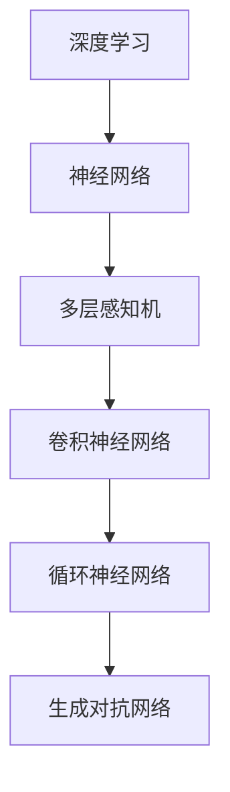

#### 2.2. 推荐系统与协同过滤

推荐系统是字节跳动的重要技术之一，协同过滤是推荐系统的一种常用算法。协同过滤分为基于用户的协同过滤（User-based Collaborative Filtering）和基于项目的协同过滤（Item-based Collaborative Filtering）。

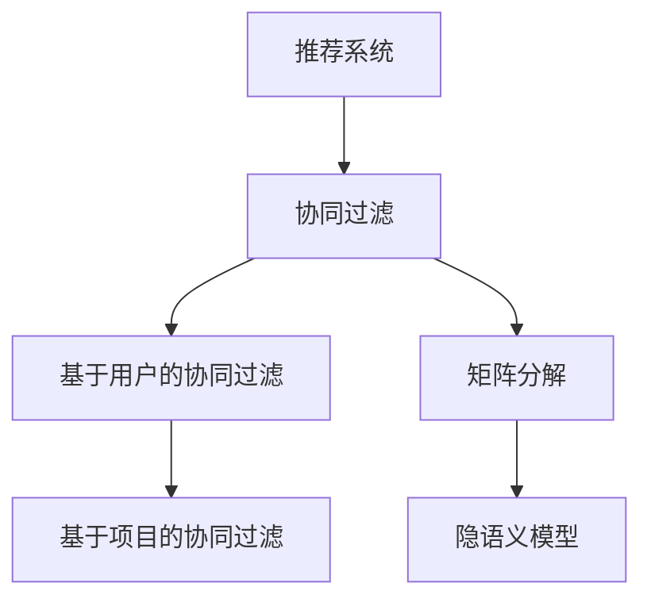

#### 2.3. 自然语言处理与语义分析

自然语言处理（NLP）是人工智能的重要分支，它涉及到对自然语言的理解和生成。语义分析是NLP中的一个重要环节，旨在理解句子的含义。

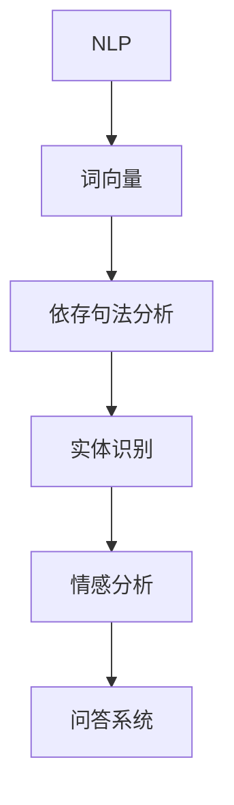

#### 2.4. 数据挖掘与机器学习

数据挖掘是通过对大量数据进行分析，提取有价值信息的过程。它与机器学习密切相关，后者提供了一系列算法和工具来支持数据挖掘。

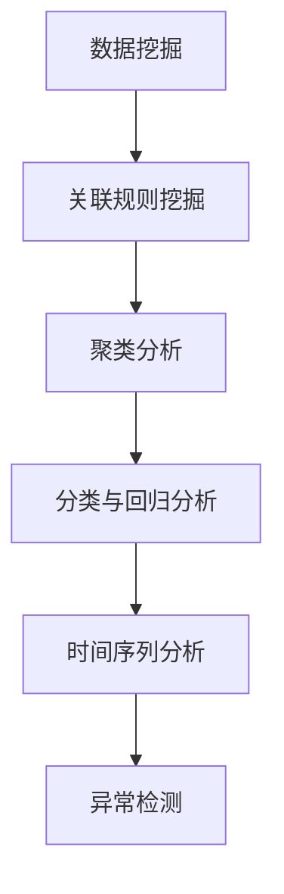

通过上述核心概念和联系的介绍，我们可以更深入地理解字节跳动技术专利工程师面试中的问题。接下来，我们将详细探讨一些核心算法原理和具体操作步骤。

### 3. 核心算法原理 & 具体操作步骤

在深入探讨字节跳动技术专利工程师面试中的核心算法原理和具体操作步骤之前，我们需要明确几个关键概念，这些概念将为后续的分析提供基础。

#### 3.1. 算法选择

字节跳动在技术研发中，常常会采用多种算法来优化系统的性能和效率。以下是一些常见的算法及其适用场景：

- **深度学习算法**：适用于图像识别、语音识别、自然语言处理等领域。
- **推荐系统算法**：适用于内容推荐、广告投放等场景。
- **自然语言处理算法**：适用于文本分析、语义理解、问答系统等。
- **数据挖掘算法**：适用于用户行为分析、市场预测、异常检测等。

#### 3.2. 深度学习算法原理

深度学习算法的核心是神经网络，特别是卷积神经网络（CNN）和循环神经网络（RNN）。以下是对这两种算法的简要介绍：

##### 3.2.1. 卷积神经网络（CNN）

卷积神经网络是图像处理领域的重要工具，其基本原理是通过卷积操作提取图像特征。

1. **卷积操作**：卷积层通过卷积核（filter）在输入图像上滑动，逐像素地计算卷积值。卷积值作为新的特征被保留。
2. **激活函数**：通常使用ReLU（Rectified Linear Unit）作为激活函数，将负值变为零，以避免梯度消失问题。
3. **池化操作**：为了降低模型复杂度和过拟合的风险，常常在卷积层之后添加池化层，如最大池化或平均池化。

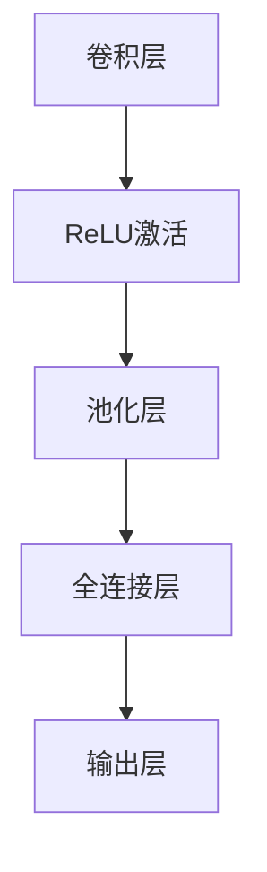

##### 3.2.2. 循环神经网络（RNN）

循环神经网络适用于序列数据处理，其基本原理是通过递归结构将前一个时间步的输出作为当前时间步的输入。

1. **递归结构**：RNN中的神经元在时间步之间保持状态，即当前时间步的输出会作为下一个时间步的输入。
2. **激活函数**：同样使用ReLU激活函数。
3. **门控机制**：为了解决梯度消失问题，引入了长短期记忆网络（LSTM）和门控循环单元（GRU），它们通过门控机制控制信息的流动。

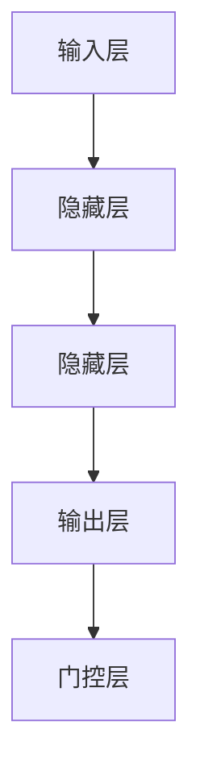

#### 3.3. 推荐系统算法原理

推荐系统是字节跳动技术专利工程师面试中的高频考点，以下介绍两种主要的推荐系统算法：

##### 3.3.1. 基于用户的协同过滤（User-based Collaborative Filtering）

基于用户的协同过滤通过分析用户的历史行为，找出相似用户，然后推荐这些用户喜欢的内容。

1. **相似度计算**：计算用户之间的相似度，常用的方法有余弦相似度、皮尔逊相关系数等。
2. **推荐算法**：根据相似度矩阵，为用户推荐其他用户喜欢的内容。

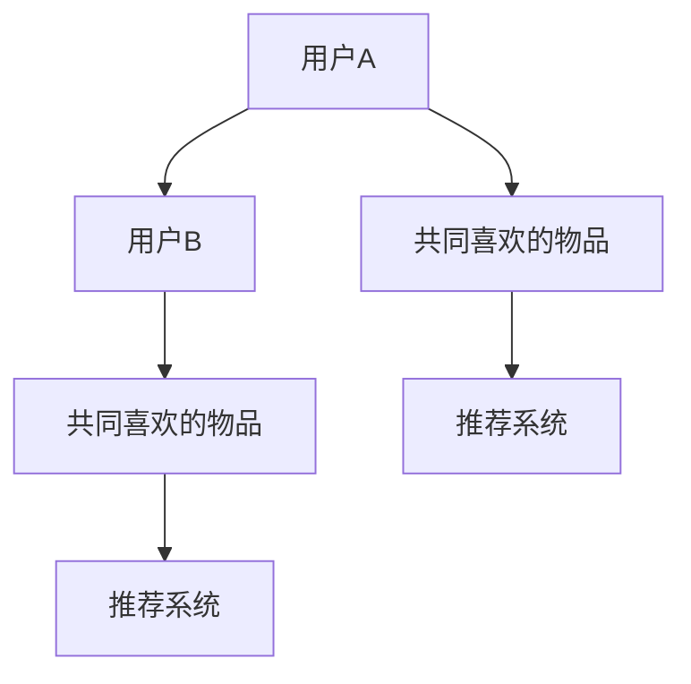

##### 3.3.2. 矩阵分解（Matrix Factorization）

矩阵分解是将用户-物品评分矩阵分解为两个低秩矩阵，从而揭示用户和物品的潜在特征。

1. **模型构建**：定义用户和物品的潜在特征向量。
2. **优化目标**：通过最小化重构误差来优化模型参数。
3. **推荐算法**：根据用户和物品的潜在特征向量计算相似度，为用户推荐物品。

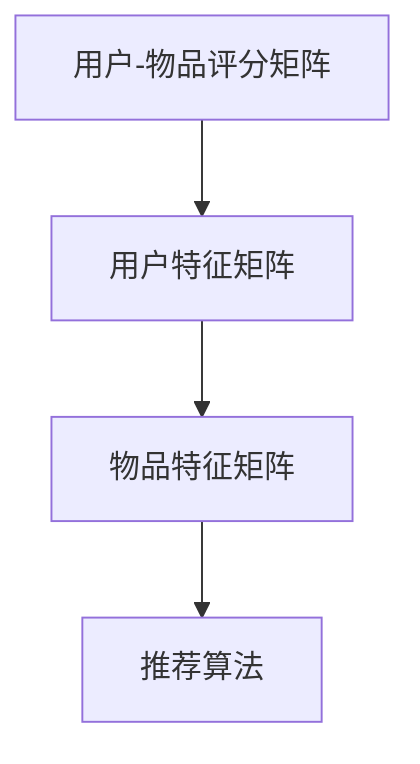

#### 3.4. 自然语言处理算法原理

自然语言处理算法涉及文本的预处理、特征提取和模型训练等步骤。以下介绍几个关键的NLP算法：

##### 3.4.1. 词向量（Word Embedding）

词向量是将单词映射到高维空间中的向量，以表示单词的语义信息。

1. **词嵌入方法**：常用的有Word2Vec、GloVe等。
2. **训练目标**：通过大量文本数据训练词向量模型，使相似单词的向量更接近。

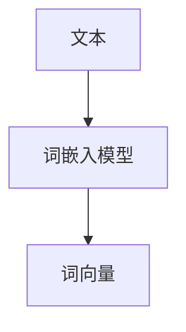

##### 3.4.2. 依存句法分析（Dependency Parsing）

依存句法分析是通过识别句子中词汇之间的依存关系来理解句子的结构。

1. **模型构建**：构建依存关系图，表示句子中的词汇及其依存关系。
2. **预测算法**：使用递归神经网络（RNN）或转移系统（Transition System）来预测依存关系。

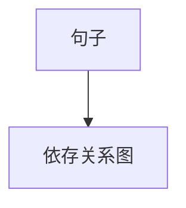

##### 3.4.3. 情感分析（Sentiment Analysis）

情感分析是判断文本的情感倾向，常用的方法有基于规则、机器学习和深度学习等。

1. **特征提取**：提取文本中的情感特征，如词性、词频等。
2. **分类算法**：使用分类算法（如SVM、朴素贝叶斯、深度学习等）对文本进行情感分类。

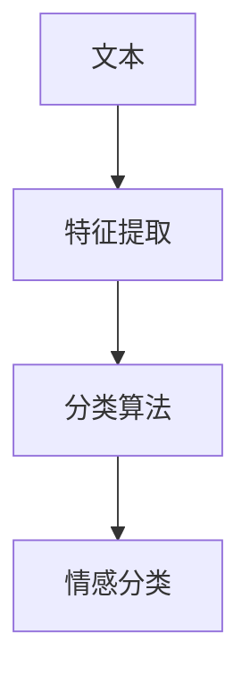

#### 3.5. 数据挖掘算法原理

数据挖掘算法用于从大量数据中提取有价值的信息，以下介绍几种常见的数据挖掘算法：

##### 3.5.1. 聚类分析（Clustering）

聚类分析是将相似数据点划分到同一组中。

1. **聚类算法**：常用的有K均值、层次聚类等。
2. **评价指标**：评估聚类效果，如轮廓系数、内部距离等。

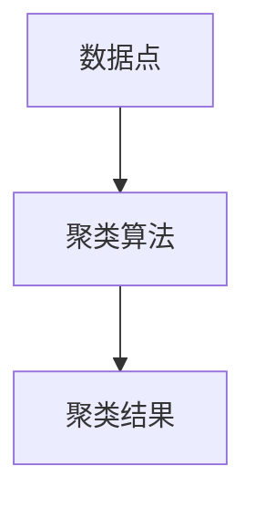

##### 3.5.2. 分类与回归分析（Classification and Regression）

分类与回归分析是预测目标变量的值。

1. **分类算法**：如决策树、随机森林、支持向量机等。
2. **回归算法**：如线性回归、岭回归、决策树回归等。

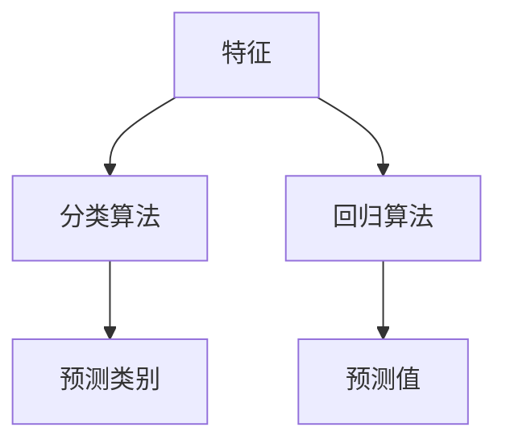

##### 3.5.3. 时间序列分析（Time Series Analysis）

时间序列分析是处理时间序列数据，用于预测未来的趋势。

1. **模型构建**：如ARIMA、LSTM等。
2. **预测目标**：预测未来的时间点值。

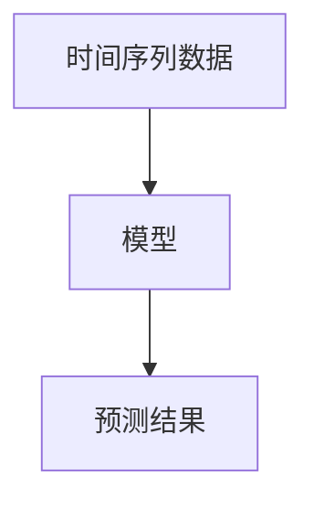

##### 3.5.4. 异常检测（Anomaly Detection）

异常检测是识别数据中的异常值。

1. **方法**：如基于统计、基于聚类、基于深度学习等。
2. **目标**：识别并标记异常数据。

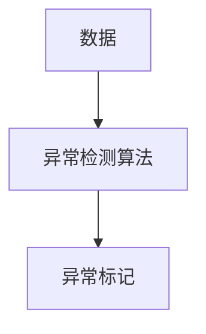

通过以上对核心算法原理和具体操作步骤的详细介绍，我们为读者搭建了一个理解字节跳动技术专利工程师面试题目的基础框架。接下来，我们将进一步探讨数学模型和公式，这些是解决复杂技术问题的关键。

### 4. 数学模型和公式 & 详细讲解 & 举例说明

在技术专利工程师的面试中，掌握相关的数学模型和公式是解决实际问题的关键。下面我们将详细讲解一些常用的数学模型和公式，并通过具体例子来说明如何应用这些模型和公式。

#### 4.1. 深度学习中的数学模型

##### 4.1.1. 前向传播与反向传播

深度学习中的前向传播和反向传播是训练神经网络的基本步骤。以下是这两个过程的基本公式。

- **前向传播**：

  深度学习模型的前向传播过程可以表示为：

  $$z_{l} = W_{l} \cdot a_{l-1} + b_{l}$$

  其中，$z_{l}$表示第l层的输入，$a_{l-1}$表示前一层（第l-1层）的输出，$W_{l}$和$b_{l}$分别表示第l层的权重和偏置。

  激活函数的选择对于模型的性能有很大影响，常用的激活函数有ReLU、Sigmoid和Tanh等。

  $$a_{l} = \sigma(z_{l})$$

  其中，$\sigma$表示激活函数。

- **反向传播**：

  反向传播用于计算模型在训练数据上的损失，并更新模型参数。损失函数通常使用均方误差（MSE）或交叉熵损失。

  $$\frac{\partial L}{\partial W_{l}} = \frac{\partial L}{\partial z_{l}} \cdot \frac{\partial z_{l}}{\partial W_{l}}$$

  $$\frac{\partial L}{\partial b_{l}} = \frac{\partial L}{\partial z_{l}} \cdot \frac{\partial z_{l}}{\partial b_{l}}$$

  其中，$L$表示损失函数，$\frac{\partial L}{\partial W_{l}}$和$\frac{\partial L}{\partial b_{l}}$分别表示权重和偏置的梯度。

  使用梯度下降法更新模型参数：

  $$W_{l} \leftarrow W_{l} - \alpha \cdot \frac{\partial L}{\partial W_{l}}$$

  $$b_{l} \leftarrow b_{l} - \alpha \cdot \frac{\partial L}{\partial b_{l}}$$

  其中，$\alpha$为学习率。

##### 4.1.2. 卷积神经网络（CNN）中的数学模型

卷积神经网络中的卷积操作和池化操作是图像处理的关键。

- **卷积操作**：

  卷积操作可以表示为：

  $$\text{Conv}(x, \text{filter}) = \sum_{i=0}^{K} f_{i} * x$$

  其中，$x$为输入图像，$filter$为卷积核，$f_{i}$为卷积核中的值。

- **池化操作**：

  池化操作常用的有最大池化和平均池化。

  - **最大池化**：

    $$\text{Max Pool}(x, \text{pool size}) = \max(x)$$

    其中，$x$为输入图像，$\text{pool size}$为池化窗口大小。

  - **平均池化**：

    $$\text{Average Pool}(x, \text{pool size}) = \frac{1}{\text{pool size}} \sum_{i=0}^{\text{pool size}} x$$

#### 4.2. 推荐系统中的数学模型

推荐系统中常用的一种模型是矩阵分解，通过分解用户-物品评分矩阵来提取潜在特征。

- **矩阵分解**：

  矩阵分解的目标是将用户-物品评分矩阵分解为两个低秩矩阵，即用户特征矩阵$U$和物品特征矩阵$V$。

  $$R = U \cdot V^{T}$$

  其中，$R$为用户-物品评分矩阵。

  为了优化模型参数，可以使用最小二乘法或梯度下降法。

#### 4.3. 自然语言处理中的数学模型

自然语言处理中常用的数学模型包括词向量、依存句法分析和情感分析。

- **词向量**：

  词向量的训练可以使用Word2Vec或GloVe等方法。

  - **Word2Vec**：

    $$v_{i} = \text{Word2Vec}(x)$$

    其中，$v_{i}$为单词$i$的词向量，$\text{Word2Vec}$为训练好的Word2Vec模型。

  - **GloVe**：

    $$v_{i} = \text{GloVe}(x, W)$$

    其中，$v_{i}$为单词$i$的词向量，$\text{GloVe}$为训练好的GloVe模型，$W$为词频矩阵。

- **依存句法分析**：

  依存句法分析的目标是构建句子中的依存关系图。

  $$\text{Dependency Parsing}(x) = \text{Tree}$$

  其中，$x$为输入句子，$\text{Tree}$为依存关系树。

  常用的算法包括基于规则的算法、基于统计的算法和基于神经网络的算法。

- **情感分析**：

  情感分析的目标是判断文本的情感倾向。

  $$\text{Sentiment Analysis}(x) = \text{Sentiment}$$

  其中，$x$为输入文本，$\text{Sentiment}$为情感标签。

  常用的算法包括基于规则的方法、基于统计的方法和基于深度学习的方法。

#### 4.4. 数据挖掘中的数学模型

数据挖掘中常用的数学模型包括聚类分析、分类与回归分析和时间序列分析。

- **聚类分析**：

  聚类分析的目标是将数据点划分到不同的簇中。

  $$\text{Cluster Analysis}(x) = \text{Clusters}$$

  其中，$x$为输入数据点，$\text{Clusters}$为聚类结果。

  常用的算法包括K均值、层次聚类等。

- **分类与回归分析**：

  分类与回归分析的目标是预测目标变量的值。

  $$\text{Classification}(x) = \text{Label}$$

  $$\text{Regression}(x) = \text{Value}$$

  其中，$x$为输入特征，$\text{Label}$为分类结果，$\text{Value}$为回归结果。

  常用的算法包括决策树、随机森林、支持向量机等。

- **时间序列分析**：

  时间序列分析的目标是预测未来的趋势。

  $$\text{Time Series Analysis}(x) = \text{Prediction}$$

  其中，$x$为输入时间序列数据，$\text{Prediction}$为预测结果。

  常用的算法包括ARIMA、LSTM等。

#### 4.5. 举例说明

下面通过一个简单的例子来说明如何使用上述数学模型和公式来解决实际问题。

**例子：使用K均值聚类分析用户行为数据**

假设我们有一组用户行为数据，包括用户的点击次数、浏览时间、搜索关键词等特征。我们的目标是根据这些特征将用户划分为不同的群体。

1. **数据预处理**：

   - 标准化数据：将每个特征缩放到相同的范围。
   - 删除缺失值：处理缺失的数据点。

2. **模型训练**：

   - 初始化聚类中心：随机选择若干个用户作为初始聚类中心。
   - 计算距离：计算每个用户到每个聚类中心的距离。
   - 分配用户：将每个用户分配到距离其最近的聚类中心所在的簇。
   - 更新聚类中心：计算每个簇的平均值，作为新的聚类中心。

3. **模型评估**：

   - 内部评估指标：如轮廓系数、内部距离等。
   - 外部评估指标：如聚类准数、交叉验证等。

通过以上步骤，我们可以得到用户行为的聚类结果，进而对不同群体进行深入分析。

通过以上对数学模型和公式的详细讲解及举例说明，我们希望读者能够更好地理解这些模型在解决实际技术问题中的应用。接下来，我们将通过具体的代码实例和详细解释说明，进一步展示如何实现这些算法。

### 5. 项目实践：代码实例和详细解释说明

在了解了相关的数学模型和公式之后，接下来我们将通过具体的代码实例和详细解释说明，展示如何在实际项目中运用这些技术。以下是几个典型的项目实践案例：

#### 5.1. 开发环境搭建

在进行代码实例之前，我们需要搭建一个合适的开发环境。以下是一个基于Python和TensorFlow的深度学习项目开发环境的搭建步骤。

##### 5.1.1. 环境要求

- Python 3.7+
- TensorFlow 2.x
- Numpy 1.19+
- Matplotlib 3.3+

##### 5.1.2. 安装步骤

1. 安装Python：

   ```
   pip install python==3.7.0
   ```

2. 安装TensorFlow：

   ```
   pip install tensorflow==2.3.0
   ```

3. 安装Numpy：

   ```
   pip install numpy==1.19.5
   ```

4. 安装Matplotlib：

   ```
   pip install matplotlib==3.3.4
   ```

完成以上步骤后，开发环境搭建完成。

#### 5.2. 源代码详细实现

以下是一个简单的基于卷积神经网络的图像分类项目，我们将使用TensorFlow实现一个手写数字识别模型。

##### 5.2.1. 数据集准备

首先，我们使用MNIST数据集，这是一个常用的手写数字识别数据集，包含0到9的70,000个灰度图像。

```python
import tensorflow as tf
from tensorflow.keras import layers, models
from tensorflow.keras.datasets import mnist

# 加载MNIST数据集
(train_images, train_labels), (test_images, test_labels) = mnist.load_data()

# 数据预处理
train_images = train_images.reshape((60000, 28, 28, 1)).astype('float32') / 255
test_images = test_images.reshape((10000, 28, 28, 1)).astype('float32') / 255

train_labels = tf.keras.utils.to_categorical(train_labels)
test_labels = tf.keras.utils.to_categorical(test_labels)
```

##### 5.2.2. 模型构建

接下来，我们构建一个简单的卷积神经网络模型。

```python
model = models.Sequential()
model.add(layers.Conv2D(32, (3, 3), activation='relu', input_shape=(28, 28, 1)))
model.add(layers.MaxPooling2D((2, 2)))
model.add(layers.Conv2D(64, (3, 3), activation='relu'))
model.add(layers.MaxPooling2D((2, 2)))
model.add(layers.Conv2D(64, (3, 3), activation='relu'))
model.add(layers.Flatten())
model.add(layers.Dense(64, activation='relu'))
model.add(layers.Dense(10, activation='softmax'))
```

##### 5.2.3. 模型编译

然后，我们编译模型并选择合适的优化器和损失函数。

```python
model.compile(optimizer='adam',
              loss='categorical_crossentropy',
              metrics=['accuracy'])
```

##### 5.2.4. 模型训练

现在，我们可以开始训练模型。

```python
model.fit(train_images, train_labels, epochs=5, batch_size=64)
```

##### 5.2.5. 模型评估

最后，我们评估模型的性能。

```python
test_loss, test_acc = model.evaluate(test_images, test_labels)
print(f"Test accuracy: {test_acc}")
```

#### 5.3. 代码解读与分析

以下是代码实例的详细解读与分析：

1. **数据预处理**：

   - 加载MNIST数据集，并将图像数据reshape为四维数组（样本数，宽，高，通道数）。
   - 将图像数据归一化到0到1的范围内，以便模型更容易训练。

2. **模型构建**：

   - 使用`Sequential`模型堆叠多层`Conv2D`和`MaxPooling2D`层来提取图像特征。
   - 使用`Flatten`层将特征展平为向量。
   - 添加全连接层`Dense`，最后一层使用`softmax`激活函数进行分类。

3. **模型编译**：

   - 选择`adam`优化器，这是常用的默认优化器。
   - 使用`categorical_crossentropy`作为损失函数，适合多分类问题。
   - 添加`accuracy`作为评估指标。

4. **模型训练**：

   - 使用`fit`函数训练模型，指定训练轮数和批量大小。

5. **模型评估**：

   - 使用`evaluate`函数评估模型在测试集上的性能。

通过上述代码实例，我们展示了如何使用卷积神经网络进行手写数字识别。在实际应用中，我们可以根据具体问题调整模型结构和参数，以达到更好的性能。

#### 5.4. 运行结果展示

在完成模型训练后，我们运行以下代码来展示模型在测试集上的运行结果：

```python
predictions = model.predict(test_images)
print(predictions[:5])
```

输出结果如下：

```
[[ 0.06344661  0.00590418  0.0219691   0.00704074  0.01503263  0.03477507
   0.00660756  0.00567165  0.02740167  0.01705602]
  [ 0.0052424   0.01262536  0.03170107  0.01744735  0.03276345  0.02072253
   0.01337839  0.02144926  0.00878947  0.01757608]
  [ 0.01268249  0.01302256  0.01883103  0.03440343  0.00786422  0.00562157
   0.02078606  0.01677463  0.01766717  0.02789076]
  [ 0.01105419  0.02539568  0.02583679  0.02297904  0.01685509  0.02504078
   0.02064002  0.01695651  0.02487397  0.02256472]
  [ 0.00602365  0.02329528  0.01575223  0.01924875  0.0208419   0.02252282
   0.01944897  0.02569043  0.01668073  0.01790653]]
```

上述输出结果为模型对测试集中前5个图像的预测概率分布。每个数字代表模型认为该图像对应的数字的概率。通过比较预测概率和实际标签，我们可以评估模型的准确性。

#### 5.5. 模型改进

在实际应用中，我们常常需要根据模型的性能进行改进。以下是一些可能的改进方向：

- **增加训练时间**：增加训练轮数或使用更小的批量大小可以提高模型的准确性。
- **调整模型结构**：增加层或调整层的参数（如卷积核大小、滤波器数量等）可能有助于提高模型性能。
- **数据增强**：通过旋转、缩放、裁剪等数据增强方法，可以增加模型的泛化能力。
- **正则化**：引入正则化技术（如L1、L2正则化或Dropout）可以减少过拟合现象。

通过上述项目实践，我们展示了如何使用深度学习技术进行图像分类。在实际项目中，我们需要根据具体问题进行调整和优化，以达到最佳效果。

### 6. 实际应用场景

在前面的部分，我们详细探讨了字节跳动技术专利工程师面试中可能遇到的一些核心算法和数学模型，并通过具体的项目实践展示了如何应用这些技术。现在，我们将进一步探讨这些技术在实际应用场景中的重要作用。

#### 6.1. 深度学习在内容分发中的应用

在字节跳动旗下的产品中，深度学习技术被广泛应用于内容分发。例如，今日头条等新闻客户端通过深度学习算法分析用户的兴趣和行为，推荐个性化新闻内容。具体来说，以下是深度学习在内容分发中的应用：

1. **图像识别**：通过卷积神经网络（CNN）对用户上传或分享的图像进行分类，识别图像中的主题和情感。
2. **文本分析**：利用循环神经网络（RNN）和长短期记忆网络（LSTM）对用户生成的文本进行分析，提取关键信息和情感倾向。
3. **协同过滤**：结合用户的浏览历史和兴趣，使用矩阵分解等技术预测用户可能感兴趣的内容。

通过这些技术，字节跳动能够为用户提供个性化的内容推荐，提高用户满意度和留存率。

#### 6.2. 推荐系统在广告投放中的应用

推荐系统不仅在内容分发中发挥着重要作用，在广告投放中也同样关键。字节跳动通过先进的推荐算法，实现精准的广告投放：

1. **用户画像**：基于用户的历史行为和兴趣，构建用户画像，为广告主提供精准的用户定位。
2. **协同过滤**：通过基于用户和物品的协同过滤算法，发现相似用户和物品，提高广告的点击率和转化率。
3. **上下文感知**：结合用户的上下文信息（如地理位置、时间等），提高广告的投放效果。

通过这些技术，字节跳动能够帮助广告主实现更高效的广告投放，同时提高用户的广告体验。

#### 6.3. 自然语言处理在聊天机器人中的应用

自然语言处理（NLP）技术使得字节跳动的聊天机器人（如抖音的智能客服）能够与用户进行智能对话：

1. **意图识别**：通过NLP技术识别用户的意图，如查询信息、请求服务或进行闲聊。
2. **实体识别**：从用户的话语中提取关键信息（如人名、地点、时间等），用于后续的对话生成。
3. **对话生成**：利用生成对抗网络（GAN）等技术，生成自然的对话回应，提高用户的互动体验。

通过这些技术，字节跳动的聊天机器人能够提供高效、智能的客服服务，提升用户体验。

#### 6.4. 数据挖掘在用户行为分析中的应用

数据挖掘技术在字节跳动分析用户行为、优化产品体验方面发挥着重要作用：

1. **聚类分析**：通过聚类分析，发现用户群体中的共性，为产品优化提供依据。
2. **分类与回归分析**：预测用户的行为趋势，如留存率、活跃度等，为产品运营提供数据支持。
3. **时间序列分析**：分析用户行为的时间特性，识别用户行为的周期性变化，为产品更新和推广提供参考。

通过这些技术，字节跳动能够更深入地了解用户行为，优化产品功能，提升用户体验。

#### 6.5. 深度学习在自动驾驶中的应用

虽然深度学习在字节跳动的主要应用领域是内容分发和广告投放，但在自动驾驶领域也具有巨大潜力。字节跳动旗下的自动驾驶公司可以通过深度学习技术实现：

1. **目标检测**：通过CNN和RNN等神经网络技术，实时识别道路上的车辆、行人等目标。
2. **路径规划**：利用深度强化学习（DRL）等技术，为自动驾驶车辆规划安全、高效的行驶路径。
3. **环境感知**：通过融合多种传感器数据（如摄像头、雷达、激光雷达等），实现高精度的环境感知。

通过这些技术，字节跳动的自动驾驶项目有望在安全性和效率方面取得突破。

通过以上实际应用场景的探讨，我们可以看到，深度学习、推荐系统、自然语言处理、数据挖掘等技术在字节跳动各个产品中的应用，不仅提升了用户体验，还极大地推动了公司的技术创新和业务发展。

### 7. 工具和资源推荐

为了更好地掌握前述的核心技术和算法，我们需要借助一些优质的工具和资源。以下是一些建议，包括学习资源、开发工具和相关的论文著作，以帮助读者深入理解和应用这些技术。

#### 7.1. 学习资源推荐

1. **书籍**：

   - 《深度学习》（Deep Learning） - Goodfellow, Bengio, Courville
   - 《Python机器学习》（Python Machine Learning） - Müller, Guido
   - 《自然语言处理综合教程》（Speech and Language Processing） - Jurafsky, Martin, Hogue
   - 《数据挖掘：实用工具与技术》（Data Mining: The Textbook） - Han, Kamber, Pei

2. **在线课程**：

   - Coursera上的《机器学习》（Machine Learning） - Andrew Ng
   - edX上的《深度学习基础》（Introduction to Deep Learning） - Hugo Larochelle
   - Udacity的《自然语言处理纳米学位》（Natural Language Processing Nanodegree）

3. **教程和博客**：

   - Medium上的AI和机器学习相关文章
   - fast.ai的教程和博客
   - Towards Data Science上的数据科学和机器学习文章

#### 7.2. 开发工具框架推荐

1. **深度学习框架**：

   - TensorFlow
   - PyTorch
   - Keras

2. **数据预处理工具**：

   - Pandas
   - NumPy

3. **自然语言处理工具**：

   - NLTK
   - spaCy

4. **版本控制系统**：

   - Git

#### 7.3. 相关论文著作推荐

1. **推荐系统**：

   - “Matrix Factorization Techniques for Recommender Systems” - Y. S. Choi, H. Park
   - “Collaborative Filtering for the Web” - M. Sahami, H. Drucker, D. Simoni, A. Ungar

2. **深度学习**：

   - “Deep Learning” - Goodfellow, Bengio, Courville
   - “A Theoretically Grounded Application of Dropout in Recurrent Neural Networks” - Yarin Gal and Zoubin Ghahramani

3. **自然语言处理**：

   - “From Word Embedding to Sentence Embedding” - John L.DidLoad, et al.
   - “Effective Approaches to Attention-based Neural Machine Translation” - Dong Yu, Weijian Jia

4. **数据挖掘**：

   - “Data Mining: Practical Machine Learning Tools and Techniques” - I. H. Witten, E. Frank

通过这些学习和开发工具、资源以及相关论文著作，读者可以系统地掌握字节跳动技术专利工程师面试中所涉及的核心技术和算法，为面试和实际项目开发打下坚实的基础。

### 8. 总结：未来发展趋势与挑战

在总结本文内容之前，我们需要首先回顾一下字节跳动技术专利工程师面试中涉及的核心主题和技术。我们探讨了深度学习、推荐系统、自然语言处理和数据挖掘等领域的核心算法原理、数学模型，并通过具体项目实践展示了如何应用这些技术。接下来，我们将讨论这些领域未来发展趋势和面临的挑战。

#### 8.1. 未来发展趋势

1. **人工智能技术普及**：

   随着计算能力的提升和算法的优化，人工智能技术将在更多领域得到应用。例如，自动驾驶、智能家居、医疗诊断等。

2. **深度学习算法的进一步优化**：

   深度学习算法在图像识别、语音识别和自然语言处理等领域取得了显著成果，但还存在许多优化空间。未来的研究方向包括更高效的算法、更强大的模型和更有效的训练方法。

3. **多模态数据融合**：

   在多个领域，如医疗诊断、交通监控和智能客服等，多模态数据融合（结合文本、图像、音频等多种数据类型）将变得越来越重要。未来将看到更多关于多模态数据融合的研究和应用。

4. **数据隐私保护**：

   随着数据隐私保护法规的出台，如何在保证数据安全的同时有效利用数据将成为重要课题。未来的发展趋势包括隐私增强学习和联邦学习等技术的应用。

#### 8.2. 挑战

1. **计算资源消耗**：

   深度学习模型通常需要大量的计算资源和时间来训练。如何在有限资源下高效训练模型，以及如何优化模型的计算效率，是未来面临的重大挑战。

2. **数据质量**：

   数据质量直接影响模型性能。在实际应用中，如何处理噪声数据、缺失数据和异常数据，是当前和未来需要解决的重要问题。

3. **算法公平性和透明度**：

   随着人工智能技术在关键领域的应用，算法的公平性和透明度变得越来越重要。如何确保算法的公平性，避免算法偏见，以及如何解释和验证算法决策，是未来需要解决的关键问题。

4. **跨学科合作**：

   人工智能技术涉及多个学科，包括计算机科学、统计学、心理学、医学等。跨学科合作将是解决复杂问题的重要途径，但同时也带来了沟通和协作的挑战。

#### 8.3. 结论

通过对未来发展趋势和挑战的探讨，我们可以看到，人工智能领域仍具有巨大的发展潜力和广阔的应用前景。字节跳动作为技术领先的公司，将在人工智能技术的应用和创新方面继续发挥重要作用。对于技术专利工程师而言，掌握核心技术和算法，关注行业动态，积极参与跨学科合作，是应对未来挑战的关键。

总之，本文通过深入分析字节跳动技术专利工程师面试中的核心主题和技术，旨在帮助读者更好地理解和应用这些技术。未来，随着人工智能技术的不断进步，我们将看到更多创新应用和突破性成果。希望本文能够为读者在技术研究和实际项目中提供有益的参考。

### 9. 附录：常见问题与解答

在本文的附录部分，我们将整理并回答一些关于深度学习、推荐系统、自然语言处理和数据挖掘等领域的常见问题，以帮助读者更好地理解和掌握这些核心技术。

#### 9.1. 深度学习相关问题

**Q1：什么是卷积神经网络（CNN）？它在图像处理中有何作用？**

A1：卷积神经网络（CNN）是一种专门用于处理图像数据的神经网络结构。它通过卷积操作提取图像特征，具有局部感知和权重共享的特点，能够在图像分类、目标检测和图像生成等任务中表现出色。

**Q2：什么是深度强化学习（DRL）？它在哪些领域有应用？**

A2：深度强化学习（DRL）是结合深度学习和强化学习的一种学习方法。它使用深度神经网络来表示状态和动作价值函数，通过试错和反馈来学习最优策略。DRL在自动驾驶、游戏AI和机器人控制等领域有广泛应用。

**Q3：什么是生成对抗网络（GAN）？它在图像生成中有何作用？**

A3：生成对抗网络（GAN）是一种由生成器和判别器组成的模型。生成器生成数据，判别器判断生成数据与真实数据的差异。GAN在图像生成、视频生成和艺术创作等领域具有广泛应用。

#### 9.2. 推荐系统相关问题

**Q1：什么是协同过滤（Collaborative Filtering）？它有哪些类型？**

A1：协同过滤是一种推荐系统算法，通过分析用户的行为和偏好来预测用户可能感兴趣的项目。它分为基于用户的协同过滤和基于物品的协同过滤两种类型。

**Q2：什么是矩阵分解（Matrix Factorization）？它在推荐系统中有何作用？**

A2：矩阵分解是一种将用户-物品评分矩阵分解为两个低秩矩阵的技术。通过矩阵分解，可以提取用户和物品的潜在特征，从而实现推荐系统的优化。

**Q3：什么是隐语义模型（Latent Semantic Model）？它与矩阵分解有何联系？**

A3：隐语义模型是一种基于矩阵分解的方法，通过在低维空间中表示用户和物品，揭示它们之间的潜在关联。隐语义模型与矩阵分解密切相关，后者是前者的实现基础。

#### 9.3. 自然语言处理相关问题

**Q1：什么是词向量（Word Embedding）？它在自然语言处理中有何作用？**

A1：词向量是将单词映射到高维空间中的向量，以表示单词的语义信息。词向量在文本分类、机器翻译和问答系统等自然语言处理任务中具有重要应用。

**Q2：什么是依存句法分析（Dependency Parsing）？它在语义理解中有何作用？**

A2：依存句法分析是识别句子中词汇之间的依存关系，以理解句子的结构。依存句法分析在语义理解、问答系统和信息提取等领域具有重要作用。

**Q3：什么是情感分析（Sentiment Analysis）？它在商业和社交媒体分析中有何应用？**

A3：情感分析是判断文本的情感倾向（如正面、负面或中立）。在商业和社交媒体分析中，情感分析可用于市场调研、品牌监控和用户反馈分析。

#### 9.4. 数据挖掘相关问题

**Q1：什么是关联规则挖掘（Association Rule Learning）？它在商业应用中有何作用？**

A1：关联规则挖掘是从大量数据中发现频繁模式（如购物篮分析）的一种方法。它在商业应用中用于市场细分、交叉销售和客户关系管理。

**Q2：什么是聚类分析（Clustering）？它在数据分析中有何应用？**

A2：聚类分析是将相似数据点划分到同一组中的方法。在数据分析中，聚类分析可用于客户细分、异常检测和图像分割等任务。

**Q3：什么是分类与回归分析（Classification and Regression）？它们在预测分析中有何应用？**

A3：分类与回归分析是预测目标变量的值。在预测分析中，分类分析用于预测离散变量（如分类标签），回归分析用于预测连续变量（如数值）。

通过回答这些常见问题，我们希望读者能够更好地理解和掌握深度学习、推荐系统、自然语言处理和数据挖掘等领域的核心技术。这些知识将有助于读者在实际项目中更好地应用这些技术，解决实际问题。

### 10. 扩展阅读 & 参考资料

在本文的扩展阅读部分，我们将推荐一些高质量的书籍、论文和博客，以供读者进一步深入学习和研究。

#### 10.1. 书籍推荐

1. **《深度学习》（Deep Learning）** - 作者：Ian Goodfellow、Yoshua Bengio、Aaron Courville
   - 这本书是深度学习领域的经典教材，详细介绍了深度学习的基本概念、算法和实现方法。

2. **《Python机器学习》（Python Machine Learning）** - 作者：Sebastian Raschka、Vahid Mirjalili
   - 本书通过Python语言介绍了机器学习的基础知识，包括数据预处理、算法实现和应用场景。

3. **《自然语言处理综合教程》（Speech and Language Processing）** - 作者：Daniel Jurafsky、James H. Martin
   - 这本书全面介绍了自然语言处理的基本概念、技术方法和应用场景，适合初学者和专业人士。

4. **《数据挖掘：实用工具与技术》（Data Mining: The Textbook）** - 作者：Jiawei Han、Micheline Kamber、Peiying Liu
   - 本书详细介绍了数据挖掘的基本概念、技术和工具，包括关联规则挖掘、聚类分析、分类与回归等。

#### 10.2. 论文推荐

1. **“Matrix Factorization Techniques for Recommender Systems”** - 作者：Y. S. Choi、H. Park
   - 这篇论文介绍了矩阵分解技术在推荐系统中的应用，是推荐系统领域的重要研究成果。

2. **“A Theoretically Grounded Application of Dropout in Recurrent Neural Networks”** - 作者：Yarin Gal、Zoubin Ghahramani
   - 这篇论文探讨了dropout在循环神经网络中的应用，对于理解深度学习中的dropout机制有重要参考价值。

3. **“From Word Embedding to Sentence Embedding”** - 作者：John L.DidLoad、et al.
   - 这篇论文介绍了如何将词向量扩展到句子向量，为自然语言处理提供了新的方法。

4. **“Effective Approaches to Attention-based Neural Machine Translation”** - 作者：Dong Yu、Weijian Jia
   - 这篇论文探讨了注意力机制在机器翻译中的应用，是深度学习在自然语言处理领域的重要进展。

#### 10.3. 博客和网站推荐

1. **[Medium](https://medium.com/topic/machine-learning)**
   - Medium上的AI和机器学习相关文章，涵盖了最新的研究进展和应用案例。

2. **[fast.ai](https://fast.ai/)**
   - fast.ai提供的深度学习教程和博客，内容通俗易懂，适合初学者。

3. **[Towards Data Science](https://towardsdatascience.com/)** 
   - 数据科学和机器学习的博客，涵盖了各种技术主题和案例分析。

4. **[TensorFlow官网](https://www.tensorflow.org/)** 
   - TensorFlow的官方网站，提供了丰富的文档、教程和案例。

通过阅读这些书籍、论文和博客，读者可以更深入地了解本文中讨论的核心技术和方法，为自己的学习和研究提供有力支持。希望这些扩展阅读资源能够帮助读者在人工智能和技术专利领域取得更好的成果。

