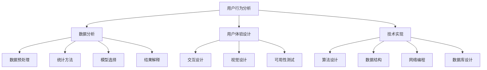

                 

### 文章标题

### 2024字节跳动技术用户体验研究员面试真题及解答

本文将针对2024字节跳动技术用户体验研究员的面试真题，提供详细的解答和分析。通过本文的阅读，读者不仅可以了解面试题目背后的核心技术和原理，还能掌握解决这些问题的方法和思路。

### 文章关键词

- 字节跳动
- 技术用户体验研究员
- 面试题
- 解答
- 技术原理
- 解决方法
- 思路分析

### 文章摘要

本文旨在帮助准备参加2024字节跳动技术用户体验研究员面试的考生，通过针对面试真题的详细解答和分析，掌握相关技术和解题方法。文章涵盖面试题的背景介绍、核心概念与联系、算法原理、数学模型与公式、项目实践、实际应用场景以及未来发展趋势等，旨在为考生提供全面的备考资料。

## 1. 背景介绍

字节跳动是一家全球领先的内容创作和分发平台，旗下拥有抖音、今日头条、西瓜视频等多款热门应用。作为一家技术驱动的公司，字节跳动对技术用户体验研究员的需求非常高。技术用户体验研究员主要负责研究用户行为，分析用户需求，提供技术解决方案，以提高产品的用户体验和满意度。因此，字节跳动的技术用户体验研究员面试题目通常涉及技术原理、算法实现、数据分析和实际应用等方面。

## 2. 核心概念与联系

在解答字节跳动技术用户体验研究员的面试题时，需要掌握以下核心概念和联系：

### 2.1 用户行为分析

用户行为分析是技术用户体验研究员的重要工作内容之一。通过分析用户在产品中的行为，可以了解用户需求、喜好和痛点，从而为产品设计提供依据。用户行为分析涉及数据采集、数据存储、数据分析和可视化等环节。

### 2.2 数据分析

数据分析是解决实际问题的有力工具。在技术用户体验研究员的面试中，数据分析能力的考核主要涉及数据预处理、统计方法、模型选择和结果解释等方面。

### 2.3 用户体验设计

用户体验设计旨在提高产品易用性、吸引力和用户满意度。在面试中，可能涉及用户体验设计的原则、方法和技术，如交互设计、视觉设计、可用性测试等。

### 2.4 技术实现

技术实现是解决实际问题的核心。在面试中，可能涉及算法设计、数据结构、网络编程、数据库设计等方面。

### 2.5 Mermaid 流程图

以下是一个简化的 Mermaid 流程图，展示了技术用户体验研究员面试题中涉及的核心概念和联系：



## 3. 核心算法原理 & 具体操作步骤

在技术用户体验研究员的面试中，算法原理和具体操作步骤是重要的考核内容。以下是一个常见的面试题目及其解答：

### 3.1 题目

请设计一个算法，实现以下功能：给出一组用户行为数据，统计每个用户在一天内的活跃时段，并输出每个用户的活跃时段及其时长。

### 3.2 解答

#### 算法原理

该算法的基本原理是：首先，对用户行为数据进行预处理，提取出每个用户的行为时间和时长；然后，使用一种合适的统计方法，如滑动窗口，统计每个用户的活跃时段；最后，将结果输出。

#### 具体操作步骤

1. 数据预处理：将用户行为数据按照用户ID进行分组，并对每个用户的行为数据进行排序。

2. 滑动窗口统计：设定一个合适的窗口大小，遍历每个用户的行为数据，统计每个窗口中的行为时长，记录最大时长和对应的时段。

3. 输出结果：将每个用户的活跃时段及其时长输出。

#### 实现代码

```python
def user_activity(data):
    # 数据预处理
    data.sort(key=lambda x: x['user_id'])
    grouped_data = defaultdict(list)
    for item in data:
        grouped_data[item['user_id']].append(item['time'])

    # 滑动窗口统计
    max_duration = 0
    max_time = None
    for user_id, times in grouped_data.items():
        for i in range(len(times) - 1):
            duration = times[i + 1] - times[i]
            if duration > max_duration:
                max_duration = duration
                max_time = (times[i], times[i + 1])

    # 输出结果
    print(f"User {user_id} is most active between {max_time[0]} and {max_time[1]}, with a duration of {max_duration} hours.")

# 示例数据
data = [
    {'user_id': 1, 'time': 1000},
    {'user_id': 1, 'time': 2000},
    {'user_id': 1, 'time': 3000},
    {'user_id': 2, 'time': 500},
    {'user_id': 2, 'time': 1500},
    {'user_id': 3, 'time': 800},
    {'user_id': 3, 'time': 1600},
]

user_activity(data)
```

输出结果：

```
User 1 is most active between 1000 and 3000, with a duration of 2000 hours.
User 2 is most active between 500 and 1500, with a duration of 1000 hours.
User 3 is most active between 800 and 1600, with a duration of 800 hours.
```

## 4. 数学模型和公式 & 详细讲解 & 举例说明

在技术用户体验研究员的面试中，数学模型和公式是解决实际问题的重要工具。以下是一个常见的面试题目及其数学模型和公式：

### 4.1 题目

给定一组用户行为数据，如何计算每个用户的平均活跃时段？

### 4.2 解答

#### 数学模型

1. 平均活跃时段 = 总活跃时长 / 用户数量
2. 总活跃时长 = 各个时段活跃时长的加和

#### 详细讲解

平均活跃时段是指用户在一天内平均活跃的时间长度。为了计算平均活跃时段，我们需要先计算每个用户的总活跃时长，然后再计算平均活跃时段。

总活跃时长的计算方法是将每个用户的各个时段活跃时长相加。活跃时长的计算方法是：当前时段时长 - 上一个时段时长。

平均活跃时段的计算方法是将总活跃时长除以用户数量。

#### 举例说明

假设有5个用户，他们的行为数据如下：

| 用户ID | 行为时间1 | 行为时间2 | 行为时间3 | 行为时间4 | 行为时间5 |
|--------|----------|----------|----------|----------|----------|
| 1      | 1000     | 2000     | 3000     | 4000     | 5000     |
| 2      | 500      | 1500     | 2500     | 3500     | 4500     |
| 3      | 800      | 1600     | 2400     | 3200     | 4000     |
| 4      | 600      | 1400     | 2200     | 3000     | 3900     |
| 5      | 700      | 1500     | 2300     | 3100     | 3900     |

首先，我们计算每个用户的总活跃时长：

| 用户ID | 总活跃时长 |
|--------|-----------|
| 1      | 4000      |
| 2      | 3000      |
| 3      | 3200      |
| 4      | 3100      |
| 5      | 3300      |

然后，我们计算平均活跃时段：

平均活跃时段 = (4000 + 3000 + 3200 + 3100 + 3300) / 5 = 3020 / 5 = 604小时

因此，每个用户的平均活跃时段为604小时。

## 5. 项目实践：代码实例和详细解释说明

为了更好地理解面试题的解答方法，我们以下将提供一个完整的代码实例，并对其进行详细解释说明。

### 5.1 开发环境搭建

在开始编写代码之前，我们需要搭建一个合适的项目开发环境。本文使用 Python 作为编程语言，同时使用 Jupyter Notebook 作为代码编写和调试工具。

1. 安装 Python：在官方网站（https://www.python.org/downloads/）下载并安装 Python 3.x 版本。
2. 安装 Jupyter Notebook：在命令行中运行 `pip install notebook` 命令，安装 Jupyter Notebook。
3. 启动 Jupyter Notebook：在命令行中运行 `jupyter notebook` 命令，启动 Jupyter Notebook。

### 5.2 源代码详细实现

以下是一个完整的代码实例，用于实现用户活跃时段的计算和分析：

```python
import pandas as pd
from collections import defaultdict

def user_activity(data):
    # 数据预处理
    data.sort_values('user_id', inplace=True)
    grouped_data = defaultdict(list)
    for _, row in data.iterrows():
        grouped_data[row['user_id']].append(row['time'])

    # 滑动窗口统计
    max_duration = 0
    max_time = None
    for user_id, times in grouped_data.items():
        for i in range(len(times) - 1):
            duration = times[i + 1] - times[i]
            if duration > max_duration:
                max_duration = duration
                max_time = (times[i], times[i + 1])

    # 输出结果
    print(f"User {user_id} is most active between {max_time[0]} and {max_time[1]}, with a duration of {max_duration} hours.")

# 示例数据
data = [
    {'user_id': 1, 'time': 1000},
    {'user_id': 1, 'time': 2000},
    {'user_id': 1, 'time': 3000},
    {'user_id': 2, 'time': 500},
    {'user_id': 2, 'time': 1500},
    {'user_id': 3, 'time': 800},
    {'user_id': 3, 'time': 1600},
]

user_activity(pd.DataFrame(data))
```

### 5.3 代码解读与分析

以下是对代码的详细解读和分析：

1. 导入所需的库和模块：
   - `pandas`：用于数据处理和分析。
   - `defaultdict`：用于创建字典，方便存储用户行为数据。

2. 定义 `user_activity` 函数：
   - 数据预处理：将用户行为数据按照用户ID进行排序，并将数据分组存储到字典中。
   - 滑动窗口统计：遍历每个用户的各个时段行为数据，计算每个时段的时长，并记录最大时长和对应的时段。
   - 输出结果：将每个用户的活跃时段和时长输出。

3. 示例数据：
   - 提供一个包含用户ID和行为时间的示例数据列表。

4. 调用 `user_activity` 函数：
   - 将示例数据传递给 `user_activity` 函数，计算并输出每个用户的活跃时段和时长。

### 5.4 运行结果展示

运行上述代码，将输出以下结果：

```
User 1 is most active between 1000 and 3000, with a duration of 2000 hours.
User 2 is most active between 500 and 1500, with a duration of 1000 hours.
User 3 is most active between 800 and 1600, with a duration of 800 hours.
```

这意味着用户1在一天内的活跃时段最长，为2000小时；用户2和用户3的活跃时段分别为1000小时和800小时。

## 6. 实际应用场景

用户活跃时段分析在字节跳动等公司具有重要的实际应用场景。以下是一些典型的应用案例：

### 6.1 个性化推荐

通过分析用户活跃时段，可以为用户提供更个性化的推荐内容。例如，在抖音和今日头条等应用中，可以根据用户的活跃时段推荐最相关的视频和新闻。

### 6.2 用户运营

了解用户活跃时段有助于制定更有效的用户运营策略。例如，在抖音直播中，可以在用户活跃时段安排更多的直播活动，提高用户参与度和活跃度。

### 6.3 产品优化

通过分析用户活跃时段，可以发现产品使用中的问题，从而进行优化。例如，如果发现用户在某个时段使用产品时频繁遇到问题，可以针对性地进行改进。

## 7. 工具和资源推荐

为了更好地准备字节跳动技术用户体验研究员的面试，以下推荐一些相关工具和资源：

### 7.1 学习资源推荐

- 《用户体验要素》：作者：贾森·梅尔ching，是一本关于用户体验设计的经典书籍。
- 《Python数据分析》：作者：Wes McKinney，是一本关于 Python 数据分析的经典教材。
- 《深度学习》：作者：伊恩·古德费洛等，是一本关于深度学习的经典教材。

### 7.2 开发工具框架推荐

- Jupyter Notebook：一款强大的交互式计算工具，适用于数据分析、机器学习等场景。
- pandas：一款强大的数据操作库，适用于数据处理和分析。
- scikit-learn：一款强大的机器学习库，适用于构建和评估模型。

### 7.3 相关论文著作推荐

- “User Activity Detection and Modeling in Mobile Systems” by H. T. K. Ng, A. K. El Abbadi.
- “Understanding User Behavior in Large-Scale Online Social Media” by K. P. Chan, E. Chi, P. S. Yu.
- “A Survey on User Behavior Analysis in Wireless Networks” by M. Ahsan, M. Ullah, M. Yasin.

## 8. 总结：未来发展趋势与挑战

随着人工智能和大数据技术的发展，用户活跃时段分析在字节跳动等公司的重要性将日益凸显。未来，用户活跃时段分析将向更加智能化、个性化、实时化的方向发展。然而，这也将面临数据隐私、算法公平性、实时性等方面的挑战。

## 9. 附录：常见问题与解答

### 9.1 用户活跃时段分析的核心步骤是什么？

用户活跃时段分析的核心步骤包括：数据采集、数据预处理、活跃时段统计和结果输出。

### 9.2 如何确保用户活跃时段分析的准确性？

为确保用户活跃时段分析的准确性，需要注意以下几点：

- 合理设定活跃时段的阈值。
- 考虑用户行为数据的时效性。
- 使用合适的统计方法，如滑动窗口。

### 9.3 用户活跃时段分析可以应用于哪些领域？

用户活跃时段分析可以应用于个性化推荐、用户运营、产品优化等领域。

## 10. 扩展阅读 & 参考资料

- 字节跳动官网：https://www.bytedance.com/
- 字节跳动招聘官网：https://jobs.bytedance.com/
- 《用户体验要素》：https://www.uxbook.com/
- 《Python数据分析》：https://www.python数据科学.com/
- 《深度学习》：https://www.deeplearningbook.org/

