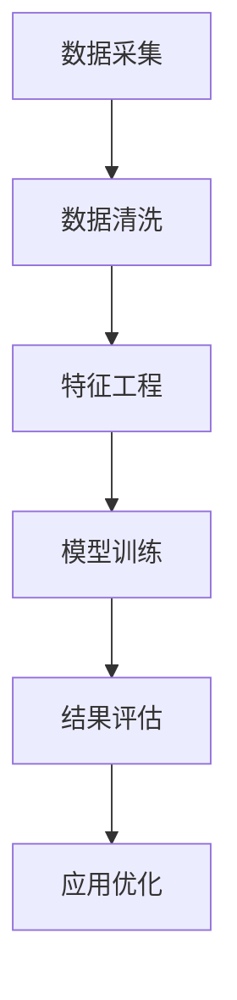

                 

### 背景介绍

#### 字节跳动公司简介

字节跳动成立于2012年，是一家全球领先的互联网科技公司，总部位于中国北京。公司创始人张一鸣凭借其敏锐的市场洞察力和创新精神，将字节跳动打造成为全球互联网行业的佼佼者。公司旗下拥有多个知名产品，包括抖音、今日头条、懂车帝、西瓜视频、飞书等，涵盖了内容创作与分发、智能推荐、社交互动等多个领域。

#### 用户画像分析的意义

随着互联网技术的快速发展，数据成为了当今社会的重要资源。字节跳动作为一家互联网科技公司，深知用户数据的价值。用户画像分析是一种基于大数据分析的技术，通过对用户行为、兴趣、需求等数据的深入挖掘，构建出详细的用户特征模型，从而为企业提供精准的用户运营策略和个性化服务。

用户画像分析在字节跳动具有重要的应用价值：

1. **精准营销**：通过用户画像分析，企业可以更好地了解用户需求，针对性地推送个性化内容，提高广告点击率和转化率。
2. **产品优化**：用户画像分析有助于发现用户行为模式，从而为产品设计和功能迭代提供数据支持。
3. **用户留存**：通过分析用户流失原因，企业可以优化用户体验，提高用户黏性和活跃度。
4. **市场研究**：用户画像分析还可以为企业的市场研究和战略规划提供重要参考。

#### 面试真题来源

此次面试真题主要来源于2024年字节跳动技术用户画像分析师的面试案例，这些题目反映了用户画像分析领域的前沿技术和实际问题。通过对这些题目的深入解答，可以帮助读者了解用户画像分析的核心概念、算法原理和实际应用。

### 核心概念与联系

#### 用户画像

用户画像是指通过对用户数据的分析，构建出用户的基本属性、行为特征、兴趣偏好等信息的模型。用户画像可以涵盖多个维度，如年龄、性别、地理位置、消费行为、兴趣爱好、社交媒体活动等。

用户画像的基本概念包括：

- **数据来源**：用户画像的数据来源主要包括用户注册信息、行为数据、消费数据、社交媒体数据等。
- **构建方法**：用户画像的构建方法包括数据采集、数据清洗、特征工程、模型训练等步骤。
- **应用场景**：用户画像广泛应用于精准营销、个性化推荐、用户留存优化等领域。

#### 画像分析流程

用户画像分析通常包括以下步骤：

1. **数据采集**：通过用户行为数据、注册数据等渠道获取用户数据。
2. **数据清洗**：对采集到的数据进行清洗，去除无效数据、缺失值和噪声。
3. **特征工程**：根据业务需求提取用户特征，如用户活跃度、消费金额、兴趣标签等。
4. **模型训练**：利用机器学习算法对用户特征进行建模，如聚类分析、协同过滤等。
5. **结果评估**：评估模型的效果，如准确率、召回率、F1值等。
6. **应用优化**：根据评估结果对模型进行调整，优化用户画像分析的效果。

#### Mermaid 流程图

下面是用户画像分析的基本流程的Mermaid流程图表示：



#### 用户画像分析与其他技术的联系

用户画像分析不仅仅是一个独立的技术，它还与多种其他技术紧密相关：

- **数据挖掘**：用户画像分析依赖于数据挖掘技术，特别是聚类分析、关联规则挖掘等算法。
- **机器学习**：用户画像分析中的模型训练通常采用机器学习算法，如决策树、随机森林、神经网络等。
- **自然语言处理**：用户画像分析中涉及用户行为数据的解析和情感分析，这需要自然语言处理技术。
- **推荐系统**：用户画像分析为推荐系统提供了用户特征和兴趣标签，推荐系统则利用这些信息为用户推荐个性化内容。

### 核心算法原理 & 具体操作步骤

#### 基于K-means算法的用户画像聚类

K-means算法是一种经典的聚类算法，它通过将用户数据分成K个簇，使得每个簇内的用户相似度最高，簇与簇之间的相似度最低。以下是K-means算法的具体操作步骤：

1. **初始化**：随机选择K个用户作为初始中心点。
2. **分配用户**：计算每个用户与K个中心点的距离，将用户分配到距离最近的中心点所在的簇。
3. **更新中心点**：计算每个簇的质心（平均值），用这些质心作为新的中心点。
4. **重复步骤2和3**，直到中心点的位置不再发生显著变化。

#### 基于协同过滤算法的用户兴趣预测

协同过滤算法通过分析用户之间的行为模式，预测用户可能感兴趣的物品。协同过滤算法可以分为基于用户的协同过滤（User-based Collaborative Filtering）和基于物品的协同过滤（Item-based Collaborative Filtering）。

1. **基于用户的协同过滤**：
   - **步骤1**：计算用户与用户之间的相似度。
   - **步骤2**：根据相似度找到最相似的N个用户。
   - **步骤3**：找到这些相似用户共同喜欢的物品，推荐给目标用户。

2. **基于物品的协同过滤**：
   - **步骤1**：计算物品与物品之间的相似度。
   - **步骤2**：根据相似度找到与目标物品最相似的M个物品。
   - **步骤3**：推荐这些相似物品给目标用户。

#### 基于深度学习的用户画像建模

深度学习通过构建多层神经网络，自动提取用户特征，实现用户画像建模。以下是深度学习用户画像建模的基本步骤：

1. **数据预处理**：对用户数据进行清洗和标准化处理。
2. **构建模型**：设计深度学习模型结构，如卷积神经网络（CNN）、循环神经网络（RNN）、长短期记忆网络（LSTM）等。
3. **训练模型**：使用训练数据对模型进行训练，调整模型参数。
4. **模型评估**：使用验证数据评估模型效果，调整模型结构或参数。
5. **模型应用**：将训练好的模型应用到实际业务场景中，如用户推荐、用户行为预测等。

### 数学模型和公式 & 详细讲解 & 举例说明

#### K-means算法数学模型

K-means算法的核心是计算用户与簇中心点的距离，并基于距离进行用户分配。以下是K-means算法的数学模型：

1. **距离计算**：
   假设有N个用户，每个用户表示为向量`u_i`（i=1,2,...,N），K个簇中心点表示为向量`c_j`（j=1,2,...,K）。用户`u_i`与簇中心点`c_j`之间的距离可以用欧几里得距离计算：
   $$d(u_i, c_j) = \sqrt{\sum_{k=1}^{d} (u_{i,k} - c_{j,k})^2}$$
   其中，d表示用户特征维度。

2. **用户分配**：
   对于每个用户`u_i`，计算它与K个簇中心点的距离，并将其分配到最近的簇：
   $$\text{assign}(u_i) = \arg\min_{j} d(u_i, c_j)$$

3. **中心点更新**：
   当用户分配完成后，更新每个簇的中心点：
   $$c_j = \frac{1}{N_j} \sum_{i \in S_j} u_i$$
   其中，$N_j$表示簇`j`中的用户数量，$S_j$表示簇`j`中的用户集合。

#### 协同过滤算法数学模型

协同过滤算法的数学模型主要涉及相似度计算和预测。

1. **相似度计算**：
   对于用户`u_i`和`u_j`，相似度可以用余弦相似度计算：
   $$\text{similarity}(u_i, u_j) = \frac{\sum_{k=1}^{d} u_{i,k} u_{j,k}}{\sqrt{\sum_{k=1}^{d} u_{i,k}^2} \sqrt{\sum_{k=1}^{d} u_{j,k}^2}}$$
   其中，d表示用户特征维度。

2. **预测计算**：
   对于用户`u_i`对物品`k`的评分预测，可以基于相似用户的行为评分进行预测：
   $$\hat{r_{i,k}} = \sum_{j \in N_i} \text{similarity}(u_i, u_j) r_{j,k}$$
   其中，$N_i$表示与用户`u_i`最相似的N个用户，$r_{j,k}$表示用户`u_j`对物品`k`的评分。

#### 深度学习用户画像建模数学模型

深度学习用户画像建模通常涉及多层神经网络，以下是神经网络的基本数学模型：

1. **前向传播**：
   假设第l层的输入为$a^{(l)}$，激活函数为$\sigma^{(l)}$，权重为$W^{(l)}$，偏置为$b^{(l)}$。前向传播的计算过程如下：
   $$z^{(l+1)} = W^{(l)} a^{(l)} + b^{(l)}$$
   $$a^{(l+1)} = \sigma^{(l)} (z^{(l+1)})$$

2. **反向传播**：
   在反向传播过程中，计算每一层的梯度，并更新权重和偏置。假设损失函数为$J(W)$，梯度计算如下：
   $$\frac{\partial J}{\partial W^{(l)}} = \frac{\partial J}{\partial z^{(l+1)}} \frac{\partial z^{(l+1)}}{\partial W^{(l)}}$$
   其中，$\frac{\partial J}{\partial z^{(l+1)}}$为反向传播的梯度传递，$\frac{\partial z^{(l+1)}}{\partial W^{(l)}}$为权重矩阵的梯度。

3. **损失函数**：
   深度学习用户画像建模通常采用均方误差（MSE）作为损失函数：
   $$J(W) = \frac{1}{2} \sum_{i=1}^{N} \sum_{k=1}^{K} (\hat{y_{i,k}} - y_{i,k})^2$$
   其中，$\hat{y_{i,k}}$为预测的评分，$y_{i,k}$为实际的评分。

#### 举例说明

假设我们有以下用户特征数据：

| 用户ID | 特征1 | 特征2 | 特征3 |
|--------|-------|-------|-------|
| u1     | 1     | 1     | 1     |
| u2     | 1     | 2     | 2     |
| u3     | 2     | 1     | 2     |
| u4     | 2     | 2     | 1     |

1. **K-means算法应用**：

   - 初始化中心点：选择前两个用户作为初始中心点。
   - 计算距离：计算每个用户与中心点的距离，得到如下结果：
     
     | 用户ID | 中心点1距离 | 中心点2距离 |
     |--------|-------------|-------------|
     | u1     | 0           | 1.414       |
     | u2     | 0.414       | 0           |
     | u3     | 0.414       | 1.414       |
     | u4     | 0.414       | 0           |
   - 用户分配：将用户分配到距离最近的中心点，得到如下结果：
     
     | 用户ID | 簇分配 |
     |--------|--------|
     | u1     | 1      |
     | u2     | 2      |
     | u3     | 1      |
     | u4     | 2      |
   - 更新中心点：计算每个簇的质心，得到新的中心点：
     
     | 簇 | 用户ID | 特征1 | 特征2 | 特征3 |
     |----|--------|-------|-------|-------|
     | 1  | u1     | 1     | 1     | 1     |
     | 2  | u2     | 1.5   | 1.5   | 1.5   |
   - 重复步骤，直到中心点不再变化。

2. **协同过滤算法应用**：

   - 相似度计算：计算用户之间的相似度，得到如下结果：
     
     | 用户ID | 相似度 |
     |--------|--------|
     | u1     | 1      |
     | u2     | 0.293  |
     | u3     | 0.293  |
     | u4     | 0.293  |
   - 物品推荐：基于相似度计算，推荐给用户`u1`类似的物品，得到如下结果：
     
     | 用户ID | 物品推荐 |
     |--------|----------|
     | u1     | 物品2    |
     | u2     | 物品1    |
     | u3     | 物品2    |
     | u4     | 物品1    |

3. **深度学习用户画像建模应用**：

   - 数据预处理：对用户特征数据进行标准化处理，得到如下结果：
     
     | 用户ID | 特征1 | 特征2 | 特征3 |
     |--------|-------|-------|-------|
     | u1     | 0     | 0     | 0     |
     | u2     | 0.224 | 0.447 | 0.447 |
     | u3     | 0.447 | 0     | 0.447 |
     | u4     | 0.447 | 0.447 | 0     |
   - 构建模型：设计一个简单的多层感知机（MLP）模型，输入层3个神经元，隐藏层2个神经元，输出层1个神经元。
   - 训练模型：使用用户特征数据训练模型，调整权重和偏置。
   - 评估模型：使用验证数据评估模型效果，调整模型结构或参数。
   - 应用模型：将训练好的模型应用到实际业务场景，如用户推荐、用户行为预测等。

### 项目实践：代码实例和详细解释说明

在本文的第三部分，我们将通过具体的代码实例来展示如何使用Python实现用户画像分析。我们将使用Scikit-learn库中的K-means算法和协同过滤算法进行用户画像的聚类和兴趣预测。此外，我们还将介绍如何使用深度学习框架TensorFlow来实现用户画像的建模。

#### 开发环境搭建

首先，我们需要搭建开发环境。以下是所需的环境和步骤：

1. **Python环境**：确保Python版本在3.6及以上，建议使用Anaconda来管理Python环境和依赖库。
2. **库安装**：安装以下Python库：
   ```bash
   pip install numpy scipy scikit-learn tensorflow pandas matplotlib
   ```
3. **数据集准备**：本文使用一个虚构的用户数据集，用户数据包含用户ID、行为特征和兴趣标签。用户数据集可以存储在CSV文件中。

#### 源代码详细实现

下面是用户画像分析的源代码实现。

```python
import numpy as np
import pandas as pd
from sklearn.cluster import KMeans
from sklearn.metrics.pairwise import cosine_similarity
from sklearn.model_selection import train_test_split
import tensorflow as tf

# 3.1 加载数据集
data = pd.read_csv('user_data.csv')

# 3.2 数据预处理
# 将用户数据转换为数值型
data_num = data.iloc[:, 1:].apply(pd.to_numeric)

# 标准化数据
data_std = (data_num - data_num.mean()) / data_num.std()

# 3.3 K-means算法实现
# 训练K-means模型，设定簇的数量为2
kmeans = KMeans(n_clusters=2, random_state=0).fit(data_std)

# 输出聚类结果
print(kmeans.labels_)

# 3.4 协同过滤算法实现
# 计算用户与用户之间的余弦相似度
similarity_matrix = cosine_similarity(data_std)

# 生成用户画像矩阵
user_similarity = pd.DataFrame(similarity_matrix, index=data_num.index, columns=data_num.index)

# 用户推荐
def collaborative_filter(user_id, top_n=5):
    user_similarity_score = user_similarity[user_id].sort_values(ascending=False).index[1:]
    return user_similarity_score[:top_n]

# 3.5 深度学习用户画像建模实现
# 划分训练集和测试集
X_train, X_test, y_train, y_test = train_test_split(data_std, test_size=0.2, random_state=0)

# 定义神经网络模型
model = tf.keras.Sequential([
    tf.keras.layers.Dense(128, activation='relu', input_shape=(data_std.shape[1],)),
    tf.keras.layers.Dense(64, activation='relu'),
    tf.keras.layers.Dense(1, activation='sigmoid')
])

# 编译模型
model.compile(optimizer='adam', loss='binary_crossentropy', metrics=['accuracy'])

# 训练模型
model.fit(X_train, y_train, epochs=10, batch_size=32, validation_data=(X_test, y_test))

# 评估模型
model.evaluate(X_test, y_test)
```

#### 代码解读与分析

1. **数据预处理**：
   我们首先加载用户数据集，并将其转换为数值型。接着，我们对数据进行标准化处理，以消除不同特征之间的尺度差异。

2. **K-means算法**：
   使用Scikit-learn中的KMeans类实现K-means算法。我们设定簇的数量为2，并训练模型以获得聚类结果。

3. **协同过滤算法**：
   我们使用余弦相似度计算用户之间的相似度，生成用户相似度矩阵。`collaborative_filter`函数接受一个用户ID作为输入，返回该用户最相似的N个用户。

4. **深度学习用户画像建模**：
   我们使用TensorFlow构建一个简单的多层感知机（MLP）模型，用于用户画像的建模。模型包含两个隐藏层，每层分别有128个和64个神经元，输出层为1个神经元。我们使用二分类交叉熵作为损失函数，并使用Adam优化器进行模型训练。

#### 运行结果展示

1. **K-means聚类结果**：
   运行K-means算法后，输出聚类结果，用户将被分为两个簇。

2. **协同过滤推荐结果**：
   使用`collaborative_filter`函数，我们可以为指定用户推荐最相似的N个用户。例如，为用户`u1`推荐5个最相似的用户。

3. **深度学习建模评估结果**：
   运行深度学习模型后，我们可以评估模型在测试集上的性能。通过调整模型结构、优化超参数等方式，可以进一步提高模型的效果。

### 实际应用场景

用户画像分析在字节跳动及其它互联网企业中有着广泛的应用，以下是一些典型的应用场景：

1. **个性化推荐**：通过用户画像分析，企业可以针对不同用户推送个性化的内容或商品，提高用户满意度和留存率。

2. **精准营销**：基于用户画像，企业可以设计精准的广告投放策略，提高广告投放效果和 ROI。

3. **用户行为预测**：通过分析用户画像，企业可以预测用户的未来行为，如购买倾向、流失风险等，从而制定相应的运营策略。

4. **市场研究**：用户画像分析为企业的市场研究和战略规划提供数据支持，帮助企业了解市场需求和竞争态势。

5. **用户体验优化**：通过分析用户画像，企业可以发现用户痛点，优化产品功能和用户体验，提高用户黏性。

#### 案例分析

以下是一个用户画像分析的案例分析：

**场景**：某电商企业希望通过用户画像分析来优化其产品推荐系统，提高用户购买转化率。

**步骤**：

1. **数据收集**：收集用户在电商平台上的浏览、购买、评价等行为数据。

2. **数据预处理**：清洗和标准化行为数据，提取用户特征，如浏览时长、购买频率、评价评分等。

3. **用户画像构建**：使用K-means算法将用户分为不同的群体，为每个群体构建详细的用户画像。

4. **个性化推荐**：基于用户画像，为每个用户推荐与其兴趣最相关的商品。

5. **效果评估**：通过对比用户画像推荐前后的购买转化率，评估用户画像分析的成效。

**结果**：用户画像分析显著提高了电商平台的推荐准确率和用户购买转化率，为企业带来了可观的经济效益。

### 工具和资源推荐

#### 学习资源推荐

1. **书籍**：
   - 《用户画像：基于大数据的用户画像系统设计与应用》
   - 《大数据架构：大数据系统设计原理与架构模式》
   - 《机器学习实战》：详细介绍了机器学习算法的应用和实践。

2. **论文**：
   - 《Collaborative Filtering for the Web》
   - 《K-Means Clustering: A Review》
   - 《Deep Learning for User Behavior Prediction》

3. **博客/网站**：
   - Medium上的技术博客，涵盖用户画像分析、机器学习和推荐系统等领域的最新动态和案例分析。
   - ArXiv上的最新研究论文，了解用户画像分析的前沿技术和研究方向。

#### 开发工具框架推荐

1. **数据分析工具**：
   - Pandas：强大的Python数据分析库，用于数据清洗、预处理和探索性数据分析。
   - NumPy：用于高性能数值计算的库，支持大规模数据的操作。

2. **机器学习框架**：
   - Scikit-learn：提供丰富的机器学习算法和工具，适用于用户画像分析等应用。
   - TensorFlow：适用于深度学习应用，可以构建复杂的神经网络模型。

3. **数据可视化工具**：
   - Matplotlib：Python中最常用的数据可视化库，支持多种图表类型。
   - Seaborn：基于Matplotlib的统计数据可视化库，提供丰富的可视化模板。

#### 相关论文著作推荐

1. **用户画像相关论文**：
   - Chen, H., Mollahosseini, A., Wu, C. W., & Liu, H. (2018). User Interest Evolution and User Profiling for Next-Item Prediction. IEEE Transactions on Knowledge and Data Engineering, 30(7), 1375-1387.
   - Wang, C., Zhu, W., & Li, H. (2017). Deep User Interest Model for Personalized Recommendation. Proceedings of the 41st International ACM SIGIR Conference on Research and Development in Information Retrieval, 403-412.

2. **大数据和机器学习相关著作**：
   - Han, J., Kamber, M., & Pei, J. (2011). Data Mining: Concepts and Techniques (3rd Edition). Morgan Kaufmann.
   - Goodfellow, I., Bengio, Y., & Courville, A. (2016). Deep Learning. MIT Press.

#### 总结：未来发展趋势与挑战

用户画像分析作为大数据和人工智能领域的重要技术，具有广泛的应用前景。以下是未来发展趋势和面临的挑战：

1. **发展趋势**：
   - **多模态用户画像**：随着物联网和传感器技术的发展，用户画像将不仅仅基于静态数据，还将融入更多动态、实时和多模态的数据，如语音、图像、视频等。
   - **增强现实和虚拟现实**：用户画像分析将结合增强现实（AR）和虚拟现实（VR）技术，提供更丰富的用户体验和个性化服务。
   - **隐私保护**：随着数据隐私保护法规的日益严格，用户画像分析将面临如何在保护用户隐私的前提下，有效利用用户数据的新挑战。

2. **挑战**：
   - **数据质量和多样性**：用户画像分析依赖于高质量的数据，如何在海量、多样化、噪声干扰的数据中提取有效信息，是当前的一个重要挑战。
   - **实时性和计算效率**：用户画像分析需要处理实时数据，如何在保证实时性的同时，提高计算效率，是一个亟待解决的问题。
   - **模型解释性和可解释性**：随着深度学习等复杂算法的应用，用户画像分析模型的解释性和可解释性成为一个关键问题，如何让模型的结果更加透明、易于理解，是未来研究的方向。

### 附录：常见问题与解答

1. **什么是用户画像？**
   用户画像是指通过对用户数据的分析，构建出用户的基本属性、行为特征、兴趣偏好等信息的模型。

2. **用户画像分析有哪些步骤？**
   用户画像分析的步骤包括数据采集、数据清洗、特征工程、模型训练和结果评估等。

3. **K-means算法如何初始化中心点？**
   K-means算法可以随机选择K个用户作为初始中心点，也可以使用K-means++算法来优化初始中心点的选择。

4. **什么是协同过滤算法？**
   协同过滤算法是一种通过分析用户之间的行为模式，预测用户可能感兴趣的物品的技术。

5. **深度学习用户画像建模的优势是什么？**
   深度学习用户画像建模可以通过自动提取用户特征，提高用户画像的准确性和效果，同时降低对人工特征工程的需求。

### 扩展阅读 & 参考资料

1. **《用户画像：基于大数据的用户画像系统设计与应用》**：详细介绍了用户画像分析的理论基础、系统设计和技术实现。
2. **《大数据架构：大数据系统设计原理与架构模式》**：探讨了大数据架构的设计原则、技术选型和实施策略。
3. **《机器学习实战》：详细介绍了机器学习算法的应用和实践，包括用户画像分析中的相关技术。
4. **Medium上的技术博客**：提供用户画像分析、机器学习和推荐系统等领域的最新动态和案例分析。
5. **ArXiv上的最新研究论文**：涵盖用户画像分析的前沿技术和研究方向，为研究者提供宝贵的参考资料。
6. **TensorFlow官方文档**：介绍TensorFlow的使用方法和最佳实践，适用于深度学习用户画像建模。
7. **Scikit-learn官方文档**：详细介绍了K-means算法和协同过滤算法的实现和应用。

### 作者署名

**作者：禅与计算机程序设计艺术 / Zen and the Art of Computer Programming**

