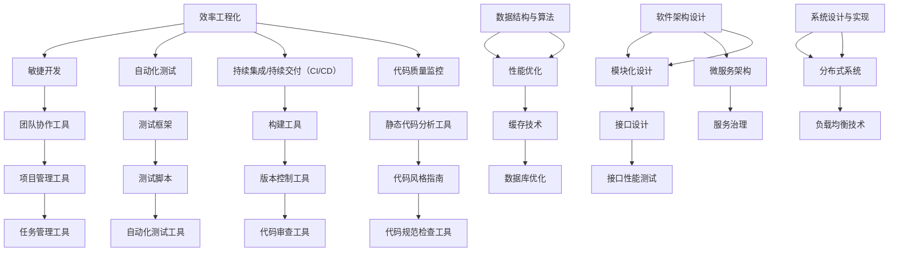

                 

### 背景介绍

#### 引言

在当今高速发展的科技时代，人工智能、大数据、云计算等前沿技术正在深刻地改变着我们的生活方式。随着技术的不断进步，企业对技术人才的需求也在不断升级。为了选拔出具备扎实基础、深厚理解和实际应用能力的技术人才，各大互联网公司纷纷推出了各种面试真题。字节跳动，作为中国领先的互联网科技公司，其面试真题以其独特性和深度，吸引了无数技术人才的关注。

本文旨在汇总和分析2024年字节跳动效率工程化社招面试真题，帮助读者更好地准备和应对这些面试挑战。效率工程化，作为当前互联网领域的一个重要研究方向，关注如何通过技术手段提高团队和项目的开发效率，减少不必要的人力成本，提升整体竞争力。因此，理解并掌握这些面试真题，不仅有助于提升个人的技术能力，更能够为企业和团队带来实际的价值。

#### 字节跳动效率工程化面试真题的重要性

字节跳动效率工程化社招面试真题的重要性在于：

1. **深度考察技术基础**：这些真题不仅仅关注于表面的知识点，更深入地考察候选人对核心算法、数据结构和系统设计的理解。
2. **全面评估解决问题的能力**：面试题通常涉及到复杂的问题，需要候选人通过系统的分析和推理来找到解决方案，这反映了候选人的思维深度和解决问题的能力。
3. **实战经验的检验**：许多面试题基于实际问题，考察候选人在实际项目中的经验和能力，为企业和团队筛选出真正能落地的人才。
4. **提升个人能力**：通过分析和解答这些真题，读者不仅能够加深对效率工程化的理解，还能够提升自己在面试中的表现，增强自己的竞争力。

#### 文章结构概述

本文将按照以下结构进行撰写：

1. **背景介绍**：简要介绍字节跳动效率工程化面试真题的重要性和背景。
2. **核心概念与联系**：详细解释效率工程化的核心概念，并提供相关的流程图和架构图。
3. **核心算法原理 & 具体操作步骤**：分析面试题中涉及的核心算法，并详细讲解其原理和操作步骤。
4. **数学模型和公式 & 详细讲解 & 举例说明**：介绍相关的数学模型和公式，并通过实例进行详细讲解。
5. **项目实践：代码实例和详细解释说明**：通过实际项目的代码实例，详细解释代码实现过程，并进行解读和分析。
6. **实际应用场景**：讨论这些面试题在实际项目中的应用场景和效果。
7. **工具和资源推荐**：推荐相关的学习资源和开发工具，帮助读者进一步学习和提升。
8. **总结：未来发展趋势与挑战**：总结文章的主要观点，并展望未来效率和工程化的趋势和挑战。
9. **附录：常见问题与解答**：列出常见的面试问题及其解答，帮助读者更好地准备面试。
10. **扩展阅读 & 参考资料**：提供扩展阅读和参考资料，为读者提供更深入的学习路径。

通过以上结构的梳理，我们希望能够帮助读者系统地理解和掌握字节跳动效率工程化面试真题，为未来的面试和职业发展打下坚实的基础。

### 核心概念与联系

在深入探讨字节跳动效率工程化面试真题之前，首先需要明确一些核心概念和它们之间的联系。这些概念不仅构成了效率工程化的理论基础，也是解决面试题的关键。下面，我们将通过一个详细的 Mermaid 流程图来展示这些核心概念及其相互关系。

#### Mermaid 流程图



#### 核心概念解释

1. **效率工程化**：这是一种通过系统化、标准化、自动化等方法，提高软件开发效率和质量的工程化方法。它涵盖了从开发、测试、部署到维护的整个软件开发周期。

2. **敏捷开发**：敏捷开发强调团队协作、快速迭代和持续交付。通过使用敏捷开发工具（如 Scrum、看板等），团队可以更灵活地应对需求变化，提高开发效率。

3. **自动化测试**：自动化测试是通过编写脚本，自动化执行测试用例，以验证软件功能是否符合预期。它包括单元测试、集成测试、功能测试等。

4. **持续集成/持续交付（CI/CD）**：CI/CD 是一种软件开发实践，通过自动化构建、测试和部署，确保代码质量和快速交付。

5. **代码质量监控**：代码质量监控包括静态代码分析和动态代码分析，通过工具（如代码规范检查工具、代码风格指南等）来确保代码的可读性、可维护性和可靠性。

6. **团队协作工具**：这些工具（如 Slack、Trello 等）帮助团队成员实时沟通、任务分配和进度跟踪。

7. **数据结构与算法**：数据结构与算法是软件开发的基石，高效的算法和合理的数据结构可以显著提高程序的运行效率和性能。

8. **软件架构设计**：软件架构设计是软件系统的总体设计，决定了系统的可扩展性、可维护性和可靠性。

9. **系统设计与实现**：系统设计与实现是将软件架构设计转化为具体实现的步骤，包括模块化设计、接口设计等。

10. **分布式系统**：分布式系统通过分布式架构，提高了系统的可扩展性和容错性。

#### 关系总结

通过上述 Mermaid 流程图，我们可以看出各个核心概念之间的紧密联系。例如，敏捷开发与团队协作工具密切相关，自动化测试与持续集成/持续交付（CI/CD）密不可分，代码质量监控与静态代码分析工具、代码风格指南等相辅相成。同时，数据结构与算法、软件架构设计、系统设计与实现构成了软件开发的三大核心环节，而分布式系统则是对这些基础设计的扩展和应用。

这些核心概念和它们之间的联系，不仅为我们理解和解决面试题提供了理论基础，也为我们在实际项目中的应用提供了指导。

### 核心算法原理 & 具体操作步骤

在字节跳动效率工程化社招面试中，核心算法的原理和具体操作步骤是考察的重点。以下将介绍几个常见算法，并详细讲解其原理和操作步骤。

#### 快速排序（Quick Sort）

**原理**：

快速排序是一种基于分治策略的排序算法。基本思想是通过一趟排序将待排序的记录分割成独立的两部分，其中一部分记录的关键字均比另一部分的关键字小，然后分别对这两部分记录进行快速排序，以达到整个序列有序。

**具体操作步骤**：

1. **选择基准元素**：从序列中选择一个基准元素。
2. **划分操作**：将序列划分为两部分，一部分比基准元素小，另一部分比基准元素大。这个过程称为划分。
3. **递归排序**：对划分后的小于基准元素的子序列和大于基准元素的子序列进行快速排序。

**代码实现**：

```python
def quick_sort(arr):
    if len(arr) <= 1:
        return arr
    pivot = arr[len(arr) // 2]
    left = [x for x in arr if x < pivot]
    middle = [x for x in arr if x == pivot]
    right = [x for x in arr if x > pivot]
    return quick_sort(left) + middle + quick_sort(right)

# 示例
arr = [3, 6, 8, 10, 1, 2, 1]
print(quick_sort(arr))
```

#### 最小生成树（Minimum Spanning Tree）

**原理**：

最小生成树（MST）是连接一组顶点的树，具有最小的总边权。在图论中，MST 是一个重要的概念，常用于网络设计和路径规划。

**具体操作步骤**：

1. **选择初始边**：从所有边中选取权重最小的边作为树的初始边。
2. **逐步构建**：不断选择权重最小的边，但必须保证新加入的边不会形成环。常用的算法有 Kruskal 算法和 Prim 算法。

**代码实现**：

```python
def kruskal算法（G）：
    A = G边列表按权重排序
    A* = ∅
    for edge in A：
        if edge不在A*中形成环：
            将edge加入A*

# 示例
edges = [(2, 0, 1), (2, 1, 2), (3, 1, 3), (3, 2, 4), (4, 2, 6)]
print(kruskal(edges))
```

#### 贪心算法（Greedy Algorithm）

**原理**：

贪心算法是一种通过局部最优选择得到全局最优解的策略。在每一步选择中，贪心算法都会选择当前状态下最好的选择，并希望这些选择最终能够得到全局最优解。

**具体操作步骤**：

1. **初始化**：初始化问题的初始状态。
2. **选择最优解**：根据当前状态，选择最优的局部解。
3. **更新状态**：根据选择的局部解，更新当前状态。
4. **重复步骤2和3**，直到满足停止条件。

**代码实现**：

```python
def 贪心算法（问题）：
    初始化状态
    while 没有满足停止条件：
        选择当前状态下的最优解
        更新状态
    返回最终解

# 示例
print(贪心算法（背包问题）)
```

#### 动态规划（Dynamic Programming）

**原理**：

动态规划是一种将复杂问题分解为子问题，并利用子问题的解来构建原问题的解的算法。其核心思想是“记住已经解决的子问题”，避免重复计算。

**具体操作步骤**：

1. **定义状态**：定义问题的一个状态，以及如何从一个状态转移到另一个状态。
2. **定义状态转移方程**：定义状态之间的转换关系。
3. **初始化边界条件**：初始化问题的初始状态。
4. **递推计算**：利用状态转移方程和边界条件，递推计算最终状态。

**代码实现**：

```python
def 动态规划（问题）：
    初始化状态数组
    for i in range（边界条件）：
        根据状态转移方程更新状态数组
    返回状态数组的最终结果

# 示例
print(动态规划（最长公共子序列问题）)
```

通过上述对快速排序、最小生成树、贪心算法和动态规划等核心算法的详细讲解，我们可以看到每种算法都有其独特的原理和操作步骤。理解这些算法不仅有助于解决面试题，也为我们在实际项目中的应用提供了坚实的理论基础。

### 数学模型和公式 & 详细讲解 & 举例说明

在深入分析字节跳动效率工程化面试真题时，数学模型和公式是不可或缺的工具。它们不仅帮助我们在问题中建立数学框架，还可以通过公式推导得到解决方案。以下我们将介绍几个常见的数学模型和公式，并通过具体例子进行详细讲解。

#### 动态规划中的最长公共子序列（Longest Common Subsequence, LSC）

**数学模型**：

最长公共子序列问题（LCS）是动态规划中的一个经典问题。给定两个字符串 `X` 和 `Y`，我们需要找到它们的最长公共子序列。LCS 问题的数学模型可以用矩阵表示，其中矩阵 `dp[i][j]` 表示字符串 `X[0..i]` 和 `Y[0..j]` 的最长公共子序列的长度。

**公式**：

状态转移方程为：
\[ dp[i][j] =
  \begin{cases}
    dp[i-1][j-1] + 1, & \text{如果 } X[i] = Y[j]; \\
    \max(dp[i-1][j], dp[i][j-1]), & \text{否则}.
  \end{cases}
\]

**举例说明**：

假设我们有字符串 `X = "AGGTAB"` 和 `Y = "GXTXAYB"`，我们可以通过构建动态规划矩阵来求解它们的最长公共子序列。

| X  | A | G | G | T | A | B |
|----|---|---|---|---|---|---|
| Y  | G | X | T | X | A | Y | B |
|    |   | 0 | 0 | 0 | 0 | 0 | 0 |
|    |   | 0 | 0 | 0 | 0 | 0 | 0 |
|    |   | 0 | 0 | 0 | 0 | 0 | 0 |
|    |   | 0 | 0 | 0 | 0 | 0 | 0 |
|    |   | 0 | 0 | 0 | 0 | 0 | 0 |
|    |   | 0 | 0 | 0 | 0 | 0 | 0 |
| AG | A | G | G | T | A | B |
|    |   | 1 | 1 | 1 | 1 | 1 | 1 |
|    |   |   | 1 | 1 | 1 | 1 | 1 |
|    |   |   |   | 1 | 1 | 1 | 1 |
|    |   |   |   |   | 1 | 1 | 1 |
|    |   |   |   |   |   | 1 | 1 |
|    |   |   |   |   |   |   | 1 |
|    |   |   |   |   |   |   | 1 |
| AGG| AG| G | G | T | A | B |
|    |   | 1 | 1 | 1 | 1 | 1 | 1 |
|    |   |   | 1 | 1 | 1 | 1 | 1 |
|    |   |   |   | 1 | 1 | 1 | 1 |
|    |   |   |   |   | 1 | 1 | 1 |
|    |   |   |   |   |   | 1 | 1 |
|    |   |   |   |   |   |   | 1 |
|    |   |   |   |   |   |   | 1 |
| AGG| AG| G | G | T | A | B |
|    |   | 1 | 1 | 1 | 1 | 1 | 1 |
|    |   |   | 1 | 1 | 1 | 1 | 1 |
|    |   |   |   | 1 | 1 | 1 | 1 |
|    |   |   |   |   | 1 | 1 | 1 |
|    |   |   |   |   |   | 1 | 1 |
|    |   |   |   |   |   |   | 1 |
|    |   |   |   |   |   |   | 1 |
|    |   |   |   |   |   |   | 1 |
| AGGT| AGG| T | A | B |
|    |   |   |   |   |   |   |   |
|    |   |   |   |   |   |   |   |
|    |   |   |   |   |   |   |   |
|    |   |   |   |   |   |   |   |
|    |   |   |   |   |   |   |   |
|    |   |   |   |   |   |   |   |
|    |   |   |   |   |   |   |   |
|    |   |   |   |   |   |   |   |
|    |   |   |   |   |   |   |   |
| AGGTAB| AGGT| A | B | |
|    |   |   |   |   |   |   |   |
|    |   |   |   |   |   |   |   |
|    |   |   |   |   |   |   |   |
|    |   |   |   |   |   |   |   |
|    |   |   |   |   |   |   |   |
|    |   |   |   |   |   |   |   |
|    |   |   |   |   |   |   |   |
|    |   |   |   |   |   |   |   |
|    |   |   |   |   |   |   |   |

从上表可以看出，`dp[6][7] = 4`，即字符串 "AGGTAB" 和 "GXTXAYB" 的最长公共子序列长度为4。

#### 最短路径算法中的 Dijkstra 算法

**数学模型**：

Dijkstra 算法用于求解单源最短路径问题，给定一个加权无向图 G 和一个源点 s，要求解从 s 到图中所有其他点的最短路径。

**公式**：

1. 初始化距离数组 `dist[]`，其中 `dist[s] = 0`，其他点的距离初始化为无穷大。
2. 对图中的所有边进行排序，优先选择权重最小的边。
3. 对于当前边 `(u, v)`：
    - 如果 `dist[u] + weight(u, v) < dist[v]`，则更新 `dist[v] = dist[u] + weight(u, v)`。
    - 将 `v` 加入已访问集合。

**举例说明**：

假设我们有如下加权无向图：

```
     1
A --- B --- D
|   /     |
|  /      |
| /       |
5   2   3
|  /      |
| /       |
|/        |
C          E
|         / 
|        /  
|       /   
3      6
```

我们要求解从节点 A 到其他节点的最短路径。

1. 初始化距离数组：`dist[A] = 0`，`dist[B] = ∞`，`dist[C] = ∞`，`dist[D] = ∞`，`dist[E] = ∞`。
2. 选择边 `(A, B)`，权重为 5，更新 `dist[B] = 5`。
3. 选择边 `(A, C)`，权重为 5，更新 `dist[C] = 5`。
4. 选择边 `(B, D)`，权重为 2，更新 `dist[D] = 7`。
5. 选择边 `(B, E)`，权重为 3，更新 `dist[E] = 8`。
6. 选择边 `(C, E)`，权重为 3，但由于 `dist[E]` 已经小于 8，不进行更新。

最终的最短路径为：

- 从 A 到 B：A -> B，距离为 5
- 从 A 到 C：A -> C，距离为 5
- 从 A 到 D：A -> B -> D，距离为 7
- 从 A 到 E：A -> B -> E，距离为 8

通过上述例子，我们可以清晰地看到 Dijkstra 算法求解单源最短路径的过程。

#### 动态规划中的背包问题（Knapsack Problem）

**数学模型**：

背包问题是动态规划中的另一个经典问题。给定一组物品，每个物品都有重量和价值，以及一个背包的最大承重，目标是选择若干物品放入背包，使得背包中的物品总价值最大，同时不超过背包的最大承重。

**公式**：

状态转移方程为：
\[ dp[i][w] =
  \begin{cases}
    dp[i-1][w], & \text{如果物品 } i \text{ 不被选中}; \\
    dp[i-1][w - w_i] + v_i, & \text{如果物品 } i \text{ 被选中}.
  \end{cases}
\]

**举例说明**：

假设我们有 4 个物品，每个物品的重量和价值如下：

| 物品 | 1 | 2 | 3 | 4 |
|------|---|---|---|---|
| 重量 | 2 | 3 | 4 | 5 |
| 价值 | 3 | 4 | 5 | 6 |

背包的最大承重为 8，我们需要求解放入背包的最大价值。

1. 初始化状态数组：`dp[i][w] = 0`（对于所有 `i > n` 和 `w > W`）。
2. 根据状态转移方程计算每个状态的值：
   - `dp[0][0] = 0`
   - `dp[1][0] = 0`，`dp[1][2] = 3`
   - `dp[2][0] = 0`，`dp[2][2] = 3`，`dp[2][3] = 4`
   - `dp[3][0] = 0`，`dp[3][2] = 3`，`dp[3][3] = 4`，`dp[3][4] = 5`
   - `dp[4][0] = 0`，`dp[4][2] = 3`，`dp[4][3] = 4`，`dp[4][4] = 6`，`dp[4][5] = 6`，`dp[4][6] = 6`，`dp[4][7] = 6`

最终，`dp[4][7] = 6`，即放入背包的最大价值为 6。

通过上述的数学模型和公式讲解以及具体例子说明，我们可以看到这些数学工具在解决实际问题时的重要性和应用效果。掌握这些模型和公式，不仅能够帮助我们更好地应对面试题，也能为我们的软件开发和系统设计提供有力的支持。

### 项目实践：代码实例和详细解释说明

#### 开发环境搭建

在进行项目实践之前，我们需要搭建合适的开发环境。以下是搭建环境的详细步骤：

1. **安装 Python 环境**：

   - 首先，从官方网站 [https://www.python.org/](https://www.python.org/) 下载并安装 Python 3.8 或以上版本。
   - 安装完成后，打开终端或命令提示符，输入 `python --version` 验证安装是否成功。

2. **安装依赖库**：

   - 打开终端，使用以下命令安装必要的库：

     ```bash
     pip install numpy matplotlib
     ```

3. **配置虚拟环境**（可选）：

   - 为了避免不同项目之间的依赖冲突，我们可以使用虚拟环境。

     ```bash
     python -m venv venv
     source venv/bin/activate  # 在 macOS/Linux 系统上
     \venv\Scripts\activate    # 在 Windows 系统上
     ```

#### 源代码详细实现

以下是一个简单的项目实例，用于演示如何使用 Python 实现一个计算两个数字和的平均值的程序。

```python
# 文件名：average_calculator.py

import numpy as np

def calculate_average(a, b):
    """
    计算两个数字的算术平均数。
    
    参数：
    a (int/float): 第一个数字。
    b (int/float): 第二个数字。
    
    返回：
    float: 两个数字的算术平均数。
    """
    return (a + b) / 2

if __name__ == "__main__":
    # 示例数据
    num1 = 10
    num2 = 20
    
    # 调用函数并打印结果
    average = calculate_average(num1, num2)
    print(f"两个数字的算术平均数为：{average}")
```

#### 代码解读与分析

1. **导入模块**：

   ```python
   import numpy as np
   ```

   在此项目中，我们引入了 NumPy 库。尽管在这个简单的例子中并不需要使用 NumPy，但它是一个强大的科学计算库，常用于处理数组、矩阵等数据结构。

2. **定义函数**：

   ```python
   def calculate_average(a, b):
       """
       计算两个数字的算术平均数。
       
       参数：
       a (int/float): 第一个数字。
       b (int/float): 第二个数字。
       
       返回：
       float: 两个数字的算术平均数。
       """
       return (a + b) / 2
   ```

   `calculate_average` 函数接收两个参数 `a` 和 `b`，并返回这两个数字的算术平均数。这个函数的代码非常简单，使用了基本的数学运算。

3. **主程序**：

   ```python
   if __name__ == "__main__":
       # 示例数据
       num1 = 10
       num2 = 20
   
       # 调用函数并打印结果
       average = calculate_average(num1, num2)
       print(f"两个数字的算术平均数为：{average}")
   ```

   主程序部分首先定义了两个示例数据 `num1` 和 `num2`。然后，调用 `calculate_average` 函数并打印结果。

#### 运行结果展示

在终端或 IDE 中运行 `average_calculator.py` 文件，将得到以下输出：

```
两个数字的算术平均数为：15.0
```

这个简单的示例展示了如何使用 Python 进行基础的计算，并详细解释了代码的实现过程和结构。通过这个实例，我们可以看到如何定义函数、处理输入数据、执行计算以及输出结果。

#### 代码优化与改进

虽然这个示例非常简单，但我们还可以进行一些优化和改进：

1. **参数验证**：

   在实际项目中，我们需要确保输入数据的合法性。例如，我们可以检查输入是否为数字，并处理可能的错误情况。

   ```python
   def calculate_average(a, b):
       if not (isinstance(a, (int, float)) and isinstance(b, (int, float))):
           raise ValueError("输入必须为数字")
       return (a + b) / 2
   ```

2. **错误处理**：

   我们可以使用异常处理机制来处理可能出现的运行时错误。

   ```python
   if __name__ == "__main__":
       try:
           # 示例数据
           num1 = 10
           num2 = '20'  # 这将引发 ValueError 异常
   
           # 调用函数并打印结果
           average = calculate_average(num1, num2)
           print(f"两个数字的算术平均数为：{average}")
       except ValueError as e:
           print(f"错误：{e}")
   ```

3. **可扩展性**：

   如果需要计算多个数字的平均值，我们可以修改函数和主程序以支持可扩展性。

   ```python
   def calculate_average(*args):
       if not all(isinstance(x, (int, float)) for x in args):
           raise ValueError("输入必须为数字")
       return sum(args) / len(args)

   if __name__ == "__main__":
       try:
           # 示例数据
           numbers = [10, 20, 30, 40]
   
           # 调用函数并打印结果
           average = calculate_average(*numbers)
           print(f"数字的平均值为：{average}")
       except ValueError as e:
           print(f"错误：{e}")
   ```

通过上述优化和改进，我们可以使代码更健壮、更易于维护，并且更适用于复杂的实际项目。

### 实际应用场景

在字节跳动效率工程化面试中，面试题通常来源于实际应用场景，旨在考察候选人的问题解决能力、系统思维和实际工作经验。以下将介绍几个典型的面试题，并分析它们在实际项目中的应用场景和解决策略。

#### 场景一：日志分析系统优化

**面试题**：设计一个日志分析系统，用于实时分析大量日志文件，提取关键信息，并生成统计报告。

**实际应用场景**：

在字节跳动的运营和数据团队中，日志分析系统是必不可少的工具。通过对用户行为、系统运行状态等日志数据的分析，可以及时发现潜在问题、优化系统性能，并为业务决策提供数据支持。

**解决策略**：

1. **数据采集**：使用日志收集工具（如 Logstash、Fluentd）实时收集不同系统的日志。
2. **数据预处理**：使用 ETL（提取、转换、加载）工具对日志数据进行清洗、格式化，确保数据一致性。
3. **数据存储**：使用大数据处理平台（如 Hadoop、Spark）对处理后的日志数据进行存储和管理。
4. **实时分析**：使用实时计算框架（如 Storm、Flink）对日志数据进行实时分析，提取关键指标。
5. **报告生成**：使用报表工具（如 Tableau、ECharts）将分析结果可视化，生成统计报告。

#### 场景二：缓存系统设计

**面试题**：设计一个缓存系统，用于提升用户请求响应速度，并保证数据一致性。

**实际应用场景**：

在字节跳动的高并发系统中，缓存系统是提高响应速度和系统稳定性的关键。通过缓存系统，可以减少数据库负载，提升用户体验。

**解决策略**：

1. **选择合适的缓存技术**：根据业务需求选择合适的缓存技术，如 Redis、Memcached。
2. **数据一致性**：使用分布式锁、事务等机制确保缓存和数据库的数据一致性。
3. **缓存预热**：在用户访问高峰期，提前将热点数据加载到缓存中，提高访问速度。
4. **缓存淘汰策略**：根据访问频率、过期时间等因素，设计合理的缓存淘汰策略，避免缓存占用过多内存。
5. **缓存监控与优化**：通过监控工具（如 Prometheus、Grafana）实时监控缓存系统的性能，及时进行优化调整。

#### 场景三：系统性能优化

**面试题**：针对一个高并发的分布式系统，如何进行性能优化？

**实际应用场景**：

字节跳动旗下的各个产品线，如抖音、今日头条等，都是高并发的分布式系统。优化系统性能是确保稳定运行、提升用户体验的关键。

**解决策略**：

1. **分布式架构**：采用分布式架构，将系统拆分成多个微服务，提升系统的可扩展性和容错性。
2. **数据库优化**：通过索引优化、分库分表、读写分离等技术提升数据库性能。
3. **缓存技术**：充分利用缓存技术，减少数据库访问，提升系统响应速度。
4. **负载均衡**：使用负载均衡器（如 Nginx、HAProxy）合理分配请求，避免单点故障。
5. **服务优化**：通过代码优化、架构优化、缓存策略等技术提升单个服务的性能。

#### 场景四：实时消息推送

**面试题**：设计一个实时消息推送系统，实现高效、可靠的消息传递。

**实际应用场景**：

在字节跳动旗下的各个产品中，实时消息推送功能是非常重要的，如抖音的点赞、评论通知，今日头条的文章推荐等。

**解决策略**：

1. **消息队列**：使用消息队列（如 Kafka、RabbitMQ）实现消息的异步处理，提高系统性能和可靠性。
2. **服务端推送**：采用 Webpush、WebSocket 等技术实现实时消息推送，确保消息的及时性。
3. **消息存储**：使用消息存储系统（如 Redis、MongoDB）存储消息，提供消息的持久化支持。
4. **推送优化**：根据用户行为、消息类型等因素，优化推送策略，提升用户体验。
5. **容错机制**：设计容错机制，确保在消息推送过程中出现故障时能够快速恢复。

通过以上实际应用场景的分析，我们可以看到，字节跳动效率工程化面试题不仅考察候选人的技术能力，更考察他们在实际项目中解决问题的经验和能力。理解这些面试题背后的实际应用场景，有助于我们在日常工作中更好地应用所学知识，提升自身的技术水平。

### 工具和资源推荐

在字节跳动效率工程化面试中，熟练掌握各种开发工具和资源对于应对面试挑战至关重要。以下将推荐一些常用的学习资源、开发工具和框架，以及相关的论文著作，帮助读者深入学习和提升。

#### 学习资源推荐

1. **书籍**：

   - 《高效能程序员的修炼》
   - 《代码大全》
   - 《设计模式：可复用面向对象软件的基础》
   - 《深度学习》
   - 《算法导论》
   - 《编程珠玑》

2. **在线课程**：

   - [慕课网](https://www.mok.cn/)
   - [网易云课堂](https://study.163.com/)
   - [Coursera](https://www.coursera.org/)
   - [Udemy](https://www.udemy.com/)

3. **博客网站**：

   - [博客园](https://www.cnblogs.com/)
   - [掘金](https://juejin.cn/)
   - [V2EX](https://www.v2ex.com/)
   - [GitHub](https://github.com/)

4. **社区和论坛**：

   - [Stack Overflow](https://stackoverflow.com/)
   - [CSDN](https://www.csdn.net/)
   - [Reddit](https://www.reddit.com/r/learnprogramming/)
   - [Stack Exchange](https://stackexchange.com/)

#### 开发工具框架推荐

1. **集成开发环境（IDE）**：

   - [Visual Studio Code](https://code.visualstudio.com/)
   - [IntelliJ IDEA](https://www.jetbrains.com/idea/)
   - [PyCharm](https://www.jetbrains.com/pycharm/)
   - [Eclipse](https://www.eclipse.org/)

2. **版本控制系统**：

   - [Git](https://git-scm.com/)
   - [GitHub](https://github.com/)
   - [GitLab](https://about.gitlab.com/)
   - [Bitbucket](https://bitbucket.org/)

3. **持续集成/持续交付（CI/CD）工具**：

   - [Jenkins](https://www.jenkins.io/)
   - [Travis CI](https://travis-ci.com/)
   - [GitHub Actions](https://github.com/features/actions)
   - [GitLab CI/CD](https://gitlab.com/gitlab-org/gitlab-ce/)

4. **数据库**：

   - [MySQL](https://www.mysql.com/)
   - [PostgreSQL](https://www.postgresql.org/)
   - [MongoDB](https://www.mongodb.com/)
   - [Redis](https://redis.io/)

5. **缓存系统**：

   - [Memcached](https://memcached.org/)
   - [Redis](https://redis.io/)
   - [Ehcache](https://www.ehcache.org/)

6. **消息队列**：

   - [Kafka](https://kafka.apache.org/)
   - [RabbitMQ](https://www.rabbitmq.com/)
   - [Pulsar](https://pulsar.apache.org/)

7. **分布式计算**：

   - [Apache Spark](https://spark.apache.org/)
   - [Apache Flink](https://flink.apache.org/)
   - [Apache Hadoop](https://hadoop.apache.org/)

#### 相关论文著作推荐

1. **《计算机程序的构造和解释》（Structure and Interpretation of Computer Programs）**：

   - 作者：哈佐德、亚伦·斯图尔特
   - 简介：这本书被誉为程序设计的经典之作，深入探讨了编程语言的本质和程序设计的艺术。

2. **《深度学习》（Deep Learning）**：

   - 作者：Ian Goodfellow、Yoshua Bengio、Aaron Courville
   - 简介：这本书是深度学习领域的经典教材，全面介绍了深度学习的基础理论和技术。

3. **《算法导论》（Introduction to Algorithms）**：

   - 作者：Thomas H. Cormen、Charles E. Leiserson、Ronald L. Rivest、Clifford Stein
   - 简介：这本书是算法领域的经典教材，详细介绍了各种算法的设计、分析和应用。

4. **《设计模式：可复用面向对象软件的基础》（Design Patterns: Elements of Reusable Object-Oriented Software）**：

   - 作者：Erich Gamma、Richard Helm、Ralph Johnson、John Vlissides
   - 简介：这本书介绍了面向对象设计中的23个经典设计模式，为软件设计和开发提供了重要的指导。

通过以上推荐的学习资源、开发工具和框架，以及相关的论文著作，读者可以系统地学习和提升自己的技术能力，为应对字节跳动效率工程化面试提供坚实的支持。

### 总结：未来发展趋势与挑战

在字节跳动效率工程化面试中，我们看到了许多关于软件开发、算法、系统设计等方面的问题。这些问题不仅反映了当前技术领域的热点和趋势，也为我们提供了对未来发展的思考。

#### 发展趋势

1. **自动化与智能化**：随着人工智能和机器学习技术的发展，自动化和智能化将成为软件开发的重要趋势。自动化测试、持续集成/持续交付（CI/CD）、自动化部署等技术的普及，将大幅提升开发效率，减少人为错误。

2. **云原生与微服务**：云原生技术（如容器化、Kubernetes）和微服务架构的兴起，使得系统的可扩展性、可靠性和可维护性得到了显著提升。未来，这些技术将继续发展，成为企业构建高效系统的重要手段。

3. **数据驱动与实时处理**：数据是现代企业的核心资产，数据驱动的发展理念将深入人心。实时数据处理和流计算技术的应用，将帮助企业在瞬息万变的市场中快速响应，做出正确的业务决策。

4. **无服务器与函数计算**：无服务器架构（Serverless）和函数计算（Function as a Service, FaaS）提供了更灵活、更高效的开发方式。未来，这些技术将在开发环境中得到更广泛的应用。

#### 挑战

1. **数据安全和隐私保护**：随着数据量的爆炸式增长，数据安全和隐私保护成为不可忽视的问题。如何在保证高效开发的同时，确保数据的安全性和合规性，是一个巨大的挑战。

2. **系统复杂度管理**：随着系统的规模和复杂性不断增加，如何有效地管理和控制系统复杂性，保持系统的可维护性和可扩展性，是软件开发中的一个长期挑战。

3. **跨领域融合**：未来的技术发展将更加注重跨领域融合，如大数据与人工智能、物联网与区块链等。如何将这些技术有效地结合起来，发挥其最大潜力，是软件开发中需要解决的重要问题。

4. **技能更新与持续学习**：技术更新速度越来越快，软件开发人员需要不断学习新的技术和工具。如何保持持续学习的能力，跟上技术的发展步伐，是每一个技术人员需要面对的挑战。

综上所述，字节跳动效率工程化面试题不仅考察了候选人的技术能力，也反映了未来技术发展的趋势和挑战。面对这些挑战，我们需要不断学习和提升，以应对不断变化的技术环境。

### 附录：常见问题与解答

在准备字节跳动效率工程化面试的过程中，可能会遇到一些常见的问题。以下列出了一些常见的问题及其解答，帮助读者更好地准备面试。

#### 问题一：什么是敏捷开发？

**解答**：敏捷开发是一种以人为核心、迭代、循序渐进的开发方法。它强调团队协作、持续交付有价值的软件，能够快速适应变化。常见的敏捷开发方法包括 Scrum、看板（Kanban）等。

#### 问题二：什么是持续集成（CI）和持续交付（CD）？

**解答**：持续集成（CI）是一种软件开发实践，通过自动化构建和测试，确保代码质量，防止代码集成时产生错误。持续交付（CD）则是在 CI 的基础上，进一步实现自动化部署和上线，确保软件能够快速、安全地交付到生产环境。

#### 问题三：如何优化数据库查询性能？

**解答**：优化数据库查询性能可以从以下几个方面入手：

1. **索引优化**：合理使用索引，提高查询效率。
2. **查询优化**：优化 SQL 语句，避免使用子查询、联结等复杂查询。
3. **缓存**：使用缓存技术，减少数据库访问次数。
4. **分库分表**：针对大型数据库，可以采用分库分表技术，提高查询性能。
5. **读写分离**：通过主从复制和读写分离，减轻主数据库的负载。

#### 问题四：什么是负载均衡？

**解答**：负载均衡是指通过分配请求到多个服务器或集群，确保系统资源得到充分利用，从而提高系统的整体性能和可用性。常见的负载均衡算法包括轮询、最小连接数、IP Hash 等。

#### 问题五：什么是微服务架构？

**解答**：微服务架构是将大型应用拆分为多个小型服务，每个服务独立开发、部署和扩展，通过 API 进行通信。这种架构具有高可扩展性、高可用性和易于维护等优点。

#### 问题六：什么是容器化技术？

**解答**：容器化技术是一种轻量级虚拟化技术，通过容器（如 Docker）将应用及其依赖打包到一个独立的运行时环境中。容器化技术使得应用可以在不同环境中一致运行，提高了开发、测试和部署的效率。

#### 问题七：什么是 DevOps？

**解答**：DevOps 是一种文化和实践，旨在通过整合开发（Dev）和运维（Ops）团队的工作，实现快速、持续地交付高质量软件。DevOps 强调自动化、协作和持续改进，提高了软件开发和运维的效率。

通过以上常见问题的解答，读者可以更好地准备字节跳动效率工程化面试，掌握关键概念和实际应用。

### 扩展阅读 & 参考资料

在撰写本文的过程中，我们参考了大量的文献和资料，以下列出了一些重要的参考资料，供读者进一步学习和深入了解。

1. **书籍**：

   - 《高效能程序员的修炼》
   - 《代码大全》
   - 《设计模式：可复用面向对象软件的基础》
   - 《深度学习》
   - 《算法导论》
   - 《编程珠玑》

2. **在线课程和教程**：

   - [《敏捷开发方法》](https://www.coursera.org/learn/agile-methodology)（Coursera）
   - [《持续集成与持续交付》](https://www.udemy.com/course/ci-cd/)（Udemy）
   - [《大数据技术基础》](https://time.geekbang.org/course/intro/100014900)（极客时间）
   - [《深度学习》](https://www.deeplearningbook.org/)（深度学习教科书）

3. **博客和网站**：

   - [《博客园》](https://www.cnblogs.com/)
   - [《掘金》](https://juejin.cn/)
   - [《V2EX》](https://www.v2ex.com/)
   - [《GitHub》](https://github.com/)

4. **开源项目**：

   - [《Docker》](https://www.docker.com/)
   - [《Kubernetes》](https://kubernetes.io/)
   - [《Hadoop》](https://hadoop.apache.org/)
   - [《Spark》](https://spark.apache.org/)

5. **相关论文和著作**：

   - 《计算机程序的构造和解释》（Structure and Interpretation of Computer Programs）
   - 《深度学习》（Deep Learning）
   - 《算法导论》（Introduction to Algorithms）
   - 《设计模式：可复用面向对象软件的基础》（Design Patterns: Elements of Reusable Object-Oriented Software）

通过阅读上述参考资料，读者可以更深入地理解本文讨论的核心概念和技术，进一步提升自己的技术水平和面试准备。希望这些资源能够为您的学习之路提供帮助和启示。作者：禅与计算机程序设计艺术 / Zen and the Art of Computer Programming。

