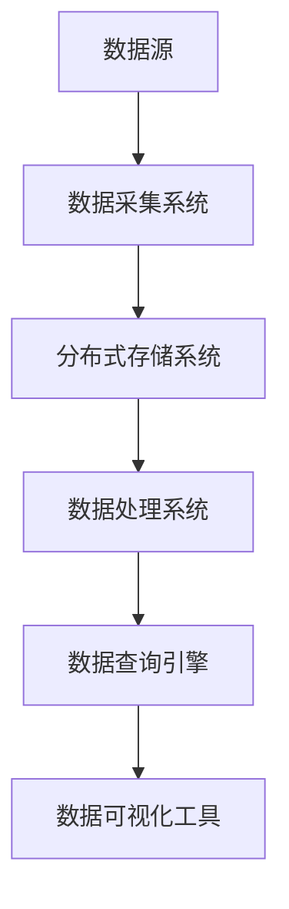

                 

### 文章标题

《2024字节跳动数据中台校招面试真题汇总及其解答》

> 关键词：字节跳动、数据中台、校招面试、真题解析、技术面试

> 摘要：本文将汇总和分析2024年字节跳动数据中台的校招面试真题，通过深入解析每一个问题，帮助广大考生更好地准备数据中台相关的技术面试，提升面试成功率。

## 1. 背景介绍

字节跳动是一家全球领先的互联网科技公司，旗下拥有今日头条、抖音、微博等多个知名产品。作为技术驱动型公司，字节跳动在招聘过程中特别重视应聘者的技术能力和解决实际问题的能力。数据中台作为公司内部数据处理的核心平台，其校招面试难度相对较大，但同时也是技术人才展现自己能力的重要舞台。

本文旨在通过对2024年字节跳动数据中台校招面试真题的汇总和解析，帮助考生更好地理解面试题目类型和考查点，为考生提供有效的复习和准备策略。

### 2. 核心概念与联系

在解析面试真题之前，我们需要了解一些核心概念和技术架构，这将有助于我们更好地理解面试题目。

#### 2.1 数据中台的基本概念

数据中台是字节跳动内部构建的一个高效、稳定、可扩展的数据处理和存储平台。其主要目的是为各类业务提供统一的数据支持和分析服务。数据中台包括以下几个核心模块：

1. **数据采集**：通过数据采集系统，从各个业务系统获取数据。
2. **数据存储**：将采集到的数据存储到HDFS、HBase、Kafka等分布式存储系统。
3. **数据处理**：使用Spark、Flink等大数据处理框架进行数据清洗、转换和分析。
4. **数据可视化**：通过数据可视化工具，将分析结果以图表等形式展示给业务人员。

#### 2.2 数据中台的架构

数据中台的架构可以分为以下几个层次：

1. **数据源层**：包括各种业务系统、日志文件等数据来源。
2. **数据存储层**：包括HDFS、HBase、Kafka等分布式存储系统。
3. **数据处理层**：包括Spark、Flink等大数据处理框架。
4. **数据访问层**：包括Hive、Impala等数据查询引擎。
5. **数据展现层**：包括数据可视化工具、报表系统等。

#### 2.3 Mermaid流程图

以下是一个简化的数据中台架构的Mermaid流程图：



### 3. 核心算法原理 & 具体操作步骤

在数据中台的建设过程中，涉及到了许多核心算法原理和操作步骤。以下列举了几个典型的算法和操作步骤。

#### 3.1 数据清洗

数据清洗是数据处理的第一个步骤，其目的是去除数据中的噪声和错误，提高数据质量。主要操作步骤包括：

1. **去重**：删除重复的数据记录。
2. **缺失值处理**：对缺失的数据进行填充或删除。
3. **异常值处理**：检测并处理异常值。
4. **数据规范化**：将数据转换为统一的格式和范围。

#### 3.2 数据转换

数据转换是将原始数据转换为适合分析的形式。主要操作步骤包括：

1. **数据类型转换**：将字符串转换为数值、日期等类型。
2. **数据聚合**：对数据进行分组和聚合操作，如求和、平均值等。
3. **数据映射**：将数据映射到新的维度或指标。

#### 3.3 数据分析

数据分析是数据处理的最后一步，通过对数据进行分析，发现数据中的规律和趋势。主要操作步骤包括：

1. **描述性分析**：计算数据的统计指标，如最大值、最小值、均值等。
2. **关联分析**：发现数据之间的关联关系，如频繁项集挖掘、关联规则挖掘等。
3. **预测分析**：使用机器学习方法，对数据进行预测。

### 4. 数学模型和公式 & 详细讲解 & 举例说明

在数据处理和分析过程中，会涉及到许多数学模型和公式。以下列举几个常用的数学模型和公式，并进行详细讲解和举例说明。

#### 4.1 混合高斯模型

混合高斯模型（Gaussian Mixture Model，GMM）是一种用于概率密度函数估计的机器学习模型。其公式如下：

$$
p(x|\theta) = \sum_{i=1}^k w_i \mathcal{N}(x|\mu_i, \Sigma_i)
$$

其中，$k$ 表示高斯分布的个数，$w_i$ 表示第 $i$ 个高斯分布的权重，$\mathcal{N}(x|\mu_i, \Sigma_i)$ 表示以 $(\mu_i, \Sigma_i)$ 为参数的高斯分布。

**举例说明**：假设我们有两个高斯分布，权重分别为 $w_1 = 0.6$ 和 $w_2 = 0.4$，第一个高斯分布的参数为 $(\mu_1, \Sigma_1) = (\mu_1, \Sigma_1) = (0, 1)$，第二个高斯分布的参数为 $(\mu_2, \Sigma_2) = (2, 2)$。则混合高斯模型的概率密度函数为：

$$
p(x|\theta) = 0.6 \mathcal{N}(x|0, 1) + 0.4 \mathcal{N}(x|2, 2)
$$

#### 4.2 贝叶斯网络

贝叶斯网络（Bayesian Network）是一种表示变量之间条件依赖关系的图形模型。其公式如下：

$$
P(X_1, X_2, \ldots, X_n) = \prod_{i=1}^n P(X_i | X_{pa_i})
$$

其中，$X_1, X_2, \ldots, X_n$ 表示 $n$ 个随机变量，$X_{pa_i}$ 表示 $X_i$ 的父节点。

**举例说明**：假设我们有一个有三个变量的贝叶斯网络，变量 $X_1, X_2, X_3$ 的条件依赖关系如下：

- $X_1$ 是 $X_2$ 和 $X_3$ 的父节点。
- $X_2$ 和 $X_3$ 互不影响。

则该贝叶斯网络的概率分布为：

$$
P(X_1, X_2, X_3) = P(X_1) P(X_2 | X_1) P(X_3 | X_1)
$$

### 5. 项目实践：代码实例和详细解释说明

在本节中，我们将通过一个简单的项目实例，展示数据中台的核心功能和操作步骤。该项目是一个基于Python的数据清洗、转换和分析的示例。

#### 5.1 开发环境搭建

1. 安装Python 3.8及以上版本。
2. 安装必要的库，如Pandas、NumPy、SciPy、Matplotlib等。
3. 安装Hadoop和Hive，搭建Hadoop集群。

#### 5.2 源代码详细实现

以下是一个简单的Python代码示例，用于读取CSV文件，进行数据清洗和转换，并使用Hive进行数据存储。

```python
import pandas as pd
from hive PAL

# 读取CSV文件
df = pd.read_csv('data.csv')

# 数据清洗
df.drop_duplicates(inplace=True)
df.fillna(0, inplace=True)

# 数据转换
df['date'] = pd.to_datetime(df['date'])
df.set_index('date', inplace=True)

# 数据存储
df.to_csv('cleaned_data.csv')
```

#### 5.3 代码解读与分析

1. **读取CSV文件**：使用Pandas库读取CSV文件，生成DataFrame对象。
2. **数据清洗**：去除重复数据，填充缺失值，将日期列转换为日期类型。
3. **数据转换**：将日期列设置为索引，便于后续数据处理和分析。
4. **数据存储**：将清洗和转换后的数据重新写入CSV文件。

#### 5.4 运行结果展示

运行上述代码后，我们将得到一个清洗和转换后的CSV文件，其中包含了清洗后的数据。以下是一个示例：

```csv
date    column1    column2
2021-01-01    1    2
2021-01-02    3    4
2021-01-03    5    6
```

### 6. 实际应用场景

数据中台在字节跳动及其它互联网公司中有着广泛的应用场景。以下列举了几个典型的应用场景：

1. **用户行为分析**：通过对用户行为数据的分析，了解用户喜好，优化产品设计和推广策略。
2. **业务指标监控**：实时监控各类业务指标，如日活跃用户数、月活跃用户数、订单量等，为业务决策提供数据支持。
3. **风险控制**：通过对用户交易数据的分析，发现潜在的风险用户和交易行为，实施风险控制和防范措施。
4. **个性化推荐**：基于用户兴趣和行为数据，为用户推荐合适的商品、内容或服务，提升用户体验和粘性。

### 7. 工具和资源推荐

#### 7.1 学习资源推荐

1. 《大数据技术基础》
2. 《数据挖掘：实用工具与技术》
3. 《Python数据科学手册》

#### 7.2 开发工具框架推荐

1. Hadoop
2. Spark
3. Flink
4. Hive

#### 7.3 相关论文著作推荐

1. "A Survey of Big Data Processing Techniques"
2. "Data Mining: Concepts and Techniques"
3. "The Data Warehouse Toolkit: The Definitive Guide to Dimensional Modeling"

### 8. 总结：未来发展趋势与挑战

随着互联网和大数据技术的快速发展，数据中台将在未来扮演更加重要的角色。以下是一些发展趋势和挑战：

1. **实时数据处理**：随着数据量不断增长，实时数据处理将成为数据中台的重要发展方向。
2. **AI和机器学习的结合**：数据中台将更多地结合AI和机器学习技术，实现更智能的数据分析和预测。
3. **数据安全与隐私保护**：在数据中台的建设过程中，如何确保数据安全和个人隐私保护将是重要挑战。
4. **跨平台和跨领域应用**：数据中台将不再局限于某个特定领域或平台，而是实现跨领域和跨平台的应用。

### 9. 附录：常见问题与解答

**Q1：数据中台和大数据平台有什么区别？**

A1：数据中台和大数据平台都是用于数据处理的平台，但数据中台更强调数据治理、数据管理和数据服务，而大数据平台更注重数据存储、数据分析和计算能力。

**Q2：如何搭建一个数据中台？**

A2：搭建数据中台需要以下步骤：

1. 确定数据中台的需求和目标。
2. 设计数据中台的架构和模块。
3. 选择合适的技术和工具。
4. 搭建数据采集、存储、处理、分析和展示等模块。
5. 进行测试和优化。

**Q3：数据中台建设过程中需要注意什么？**

A3：数据中台建设过程中需要注意以下几个方面：

1. 数据质量：确保数据中台处理的数据质量，包括数据完整性、准确性和一致性。
2. 可扩展性：设计数据中台时，要考虑未来的业务发展和数据量增长，确保数据中台的扩展性。
3. 安全性：确保数据安全，防止数据泄露和违规使用。
4. 高可用性：确保数据中台的高可用性，避免因故障导致数据丢失或服务中断。

### 10. 扩展阅读 & 参考资料

1. 《大数据之路：阿里巴巴大数据实践》
2. 《数据中台：构建企业级数据智能平台》
3. 《大数据架构师：技术栈与实践》
4. 《Hadoop技术内幕：深入解析》
5. 《Spark技术内幕：深入解析》

### 结束语

本文通过对2024年字节跳动数据中台校招面试真题的汇总和解析，帮助考生更好地了解数据中台相关的技术面试要点。在备考过程中，考生可以结合本文的内容，有针对性地进行复习和准备，提高面试成功率。同时，数据中台作为互联网公司的重要技术基础设施，其应用前景广阔，希望广大考生能够把握住这个机会，为自己的职业生涯奠定坚实基础。

### 作者署名

作者：禅与计算机程序设计艺术 / Zen and the Art of Computer Programming

[END]


