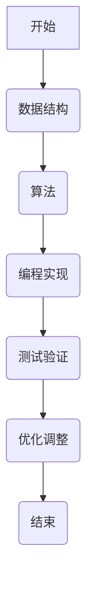
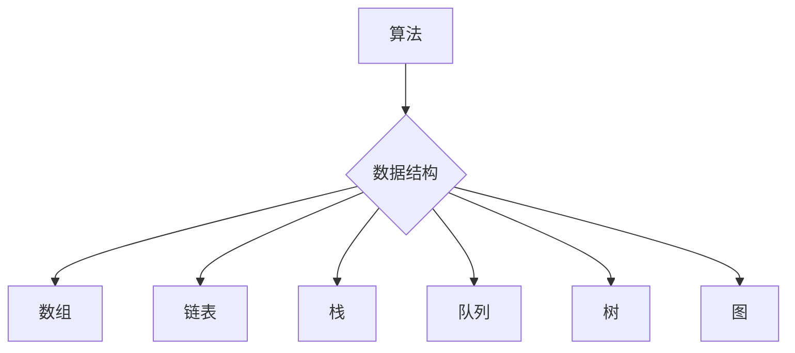

                 

### 背景介绍

#### 2025年字节跳动校招面试的背景

在当今快速发展的信息技术时代，字节跳动作为全球领先的互联网科技公司，其对人才的选拔标准始终严格而苛刻。2025年，字节跳动校招面试更是吸引了大量技术人才的关注。这次校招面试不仅是对求职者技术能力的全面考察，更是对其综合素质和未来潜力的深度挖掘。

随着技术的不断进步，算法和数据结构在计算机科学中的应用越来越广泛。从搜索引擎到推荐系统，从图像处理到自然语言处理，算法和数据结构无处不在。因此，掌握核心算法原理以及高效的编程能力，成为了技术人才必备的技能。

#### 本文的核心内容

《2025字节跳动校招面试题与算法编程题详解》旨在为广大技术求职者提供一份系统而详尽的面试指南。本文将围绕以下几个核心内容展开：

1. **面试题解析**：针对字节跳动校招面试中的常见题型，进行详细的解析和解答，帮助读者理解面试题的考查点和解题思路。
2. **算法原理讲解**：深入讲解核心算法原理，帮助读者掌握算法的基本思想和具体实现方法。
3. **编程题实战**：通过实际编程题的详细讲解，帮助读者提高编程能力和解题技巧。
4. **数学模型与公式**：结合具体算法，介绍相关数学模型和公式，帮助读者从数学角度理解算法。
5. **项目实践**：提供代码实例和运行结果展示，帮助读者理解算法的实际应用。
6. **实际应用场景**：分析算法在实际项目中的应用，展示算法的价值和潜力。
7. **工具和资源推荐**：推荐学习资源和开发工具，帮助读者在学习和实践过程中取得更好的效果。

#### 组织结构

本文采用逐步分析推理的方式（REASONING STEP BY STEP），结构紧凑、逻辑清晰。全文分为以下几个部分：

1. **背景介绍**：介绍2025年字节跳动校招面试的背景和本文的核心内容。
2. **核心概念与联系**：阐述核心概念原理和架构，使用Mermaid流程图展示。
3. **核心算法原理 & 具体操作步骤**：详细讲解核心算法原理和具体操作步骤。
4. **数学模型和公式 & 详细讲解 & 举例说明**：介绍相关数学模型和公式，并举例说明。
5. **项目实践：代码实例和详细解释说明**：提供代码实例和详细解释说明。
6. **实际应用场景**：分析算法在实际项目中的应用。
7. **工具和资源推荐**：推荐学习资源和开发工具。
8. **总结：未来发展趋势与挑战**：总结本文内容，展望未来发展趋势和挑战。
9. **附录：常见问题与解答**：解答读者可能遇到的常见问题。
10. **扩展阅读 & 参考资料**：提供扩展阅读和参考资料，方便读者深入学习和研究。

通过以上组织结构，本文旨在为技术求职者提供一份全面的面试指南，帮助他们在面试中取得优异的成绩。

#### Mermaid流程图示例

为了更好地展示核心概念原理和架构，我们使用Mermaid语言绘制了一张流程图。以下是一个简单的示例：



这张流程图展示了从数据结构到算法，再到编程实现、测试验证和优化调整的完整过程。通过这样的流程图，读者可以更直观地理解算法的实现和优化方法。

以上是本文的背景介绍部分。在接下来的部分中，我们将深入探讨核心概念与联系、核心算法原理以及具体操作步骤等内容。敬请期待！<|im_sep|>

### 核心概念与联系

#### 算法的基本概念

在计算机科学中，算法（Algorithm）是一种处理信息的方法，它描述了解决特定问题的步骤。算法的有效性主要体现在时间复杂度和空间复杂度上，即算法在时间和空间上的资源消耗。

**时间复杂度**：算法执行的时间随着输入规模增加而增长的速度。常见的表示方法包括O(1)、O(logn)、O(n)、O(nlogn)、O(n²)等。

**空间复杂度**：算法执行过程中所需存储空间的数量。同样，也采用类似时间复杂度的表示方法。

**常见算法分类**

1. **排序算法**：对一组数据进行排序的算法，如冒泡排序、快速排序、归并排序等。
2. **查找算法**：在数据集合中查找特定元素的算法，如二分查找、线性查找等。
3. **图算法**：处理图结构（由节点和边组成的网络）的算法，如深度优先搜索（DFS）、广度优先搜索（BFS）等。
4. **动态规划**：解决最优子结构问题，通过子问题的重叠性质进行优化的算法。
5. **贪心算法**：在每一步选择局部最优解，从而得到全局最优解的算法。

#### 数据结构的基本概念

数据结构是计算机存储、组织数据的方式。常见的数据结构包括数组、链表、栈、队列、树、图等。不同的数据结构具有不同的特点和适用场景。

**数组**：一种固定大小的数据集合，支持随机访问，时间复杂度为O(1)。

**链表**：由节点组成的数据集合，每个节点包含数据和一个指向下一个节点的指针。链表支持高效的插入和删除操作，时间复杂度为O(1)。

**栈**：一种后进先出（LIFO）的数据结构，支持插入和删除操作，时间复杂度为O(1)。

**队列**：一种先进先出（FIFO）的数据结构，支持插入和删除操作，时间复杂度为O(1)。

**树**：一种层次结构的数据集合，包括根节点、子节点和叶子节点。树结构支持高效的遍历和查找操作。

**图**：由节点和边组成的数据结构，用于表示实体之间的关系。图结构支持深度优先搜索（DFS）和广度优先搜索（BFS）等算法。

#### 算法与数据结构的关系

算法与数据结构密切相关。数据结构决定了算法的操作效率和资源消耗，而算法则利用数据结构来实现具体的功能。

1. **算法的效率依赖于数据结构的选择**：例如，二分查找算法在有序数组上的时间复杂度为O(logn)，而在链表上的时间复杂度为O(n)。
2. **数据结构的设计影响算法的实现**：例如，树结构的平衡性决定了查找和插入操作的时间复杂度。
3. **算法优化可以通过改进数据结构实现**：例如，通过哈希表优化查找算法，通过平衡二叉树优化排序算法。

#### Mermaid流程图展示

为了更直观地展示算法与数据结构的关系，我们使用Mermaid语言绘制了一张流程图。



这张流程图展示了算法与各种数据结构之间的联系。通过这样的流程图，读者可以更清晰地理解算法与数据结构的关系。

### 总结

在本节中，我们介绍了算法与数据结构的基本概念、分类及其关系。通过理解这些核心概念，读者可以更好地把握算法和数据结构在计算机科学中的应用。在接下来的部分中，我们将深入探讨核心算法原理和具体操作步骤，帮助读者掌握解决实际问题的方法。敬请期待！<|im_sep|>

### 核心算法原理 & 具体操作步骤

#### 快速排序（Quick Sort）

**原理介绍**：

快速排序是一种高效的排序算法，采用分治策略，将一个大问题分解为多个小问题，然后递归解决。其基本思想是通过一趟排序将待排序的记录分割成独立的两部分，其中一部分记录的关键字均比另一部分的关键字小，则可分别对这两部分记录继续进行排序，以达到整个序列有序。

**具体操作步骤**：

1. **选择基准元素**：在待排序的序列中随机选择一个元素作为基准元素。
2. **划分操作**：将序列分为两部分，一部分记录的关键字小于基准元素，另一部分记录的关键字大于基准元素。这一过程称为划分操作。
3. **递归排序**：对划分出的两个子序列分别进行快速排序，直到所有子序列长度为1。

**Python代码实现**：

```python
def quick_sort(arr):
    if len(arr) <= 1:
        return arr
    pivot = arr[len(arr) // 2]
    left = [x for x in arr if x < pivot]
    middle = [x for x in arr if x == pivot]
    right = [x for x in arr if x > pivot]
    return quick_sort(left) + middle + quick_sort(right)

# 示例
arr = [3, 6, 8, 10, 1, 2, 1]
sorted_arr = quick_sort(arr)
print(sorted_arr)
```

#### 二分查找（Binary Search）

**原理介绍**：

二分查找是一种高效的查找算法，适用于有序数组。其基本思想是逐步缩小查找范围，每次将查找范围分为两半，并比较中间元素与目标值的大小，从而确定下一轮查找的范围。

**具体操作步骤**：

1. **确定查找范围**：初始时，查找范围为整个数组。
2. **比较中间元素**：计算中间元素的下标，比较中间元素与目标值的大小。
3. **更新查找范围**：根据比较结果，更新查找范围：
   - 若中间元素等于目标值，查找成功。
   - 若中间元素大于目标值，缩小查找范围至左半部分。
   - 若中间元素小于目标值，缩小查找范围至右半部分。
4. **重复步骤2和3**，直到找到目标值或查找范围缩小为空。

**Python代码实现**：

```python
def binary_search(arr, target):
    left, right = 0, len(arr) - 1
    while left <= right:
        mid = (left + right) // 2
        if arr[mid] == target:
            return mid
        elif arr[mid] < target:
            left = mid + 1
        else:
            right = mid - 1
    return -1

# 示例
arr = [1, 2, 3, 4, 5, 6, 7, 8, 9, 10]
target = 5
result = binary_search(arr, target)
if result != -1:
    print(f"目标值在数组中的索引为：{result}")
else:
    print("目标值不在数组中")
```

#### 深度优先搜索（DFS）

**原理介绍**：

深度优先搜索是一种图遍历算法，从根节点开始，沿着某一方向一直探索到最深处，然后回溯。其基本思想是在遍历过程中，使用栈结构记录已访问的节点和待访问的节点。

**具体操作步骤**：

1. **初始化**：创建一个空栈，将根节点压入栈中。
2. **遍历**：重复以下步骤，直到栈为空：
   - 从栈顶弹出节点。
   - 访问该节点。
   - 将该节点的所有未访问的子节点依次压入栈中。
3. **结束**：遍历结束，所有节点均已访问。

**Python代码实现**：

```python
def dfs(graph, start):
    visited = set()
    stack = [start]
    while stack:
        vertex = stack.pop()
        if vertex not in visited:
            visited.add(vertex)
            print(vertex, end=' ')
            stack.extend(graph[vertex] - visited)
    print()

# 示例
graph = {
    'A': {'B', 'C'},
    'B': {'D', 'E'},
    'C': {'F'},
    'D': {},
    'E': {'F'},
    'F': {}
}
dfs(graph, 'A')
```

#### 广度优先搜索（BFS）

**原理介绍**：

广度优先搜索是一种图遍历算法，与深度优先搜索不同，它从根节点开始，按照广度（层次）遍历所有节点。其基本思想是在遍历过程中，使用队列结构记录已访问的节点和待访问的节点。

**具体操作步骤**：

1. **初始化**：创建一个空队列，将根节点加入队列中。
2. **遍历**：重复以下步骤，直到队列为空：
   - 从队列头部取出一个节点。
   - 访问该节点。
   - 将该节点的所有未访问的子节点依次加入队列。
3. **结束**：遍历结束，所有节点均已访问。

**Python代码实现**：

```python
from collections import deque

def bfs(graph, start):
    visited = set()
    queue = deque([start])
    while queue:
        vertex = queue.popleft()
        if vertex not in visited:
            visited.add(vertex)
            print(vertex, end=' ')
            queue.extend(graph[vertex] - visited)
    print()

# 示例
graph = {
    'A': {'B', 'C'},
    'B': {'D', 'E'},
    'C': {'F'},
    'D': {},
    'E': {'F'},
    'F': {}
}
bfs(graph, 'A')
```

#### 动态规划（Dynamic Programming）

**原理介绍**：

动态规划是一种解决最优化问题的算法，其基本思想是将大问题分解为多个小问题，并利用子问题的重叠性质进行优化。动态规划的核心是定义状态转移方程。

**具体操作步骤**：

1. **定义状态**：定义问题中的状态和状态变量。
2. **初始化状态**：初始化状态变量的初始值。
3. **状态转移方程**：根据问题定义状态转移方程。
4. **求解最优解**：通过状态转移方程求解最优解。

**Python代码实现**：

```python
def fib(n):
    if n <= 1:
        return n
    dp = [0] * (n + 1)
    dp[1] = 1
    for i in range(2, n + 1):
        dp[i] = dp[i - 1] + dp[i - 2]
    return dp[n]

# 示例
print(fib(10))
```

#### 贪心算法（Greedy Algorithm）

**原理介绍**：

贪心算法是一种局部最优解策略，通过在每个步骤选择当前局部最优解，从而得到全局最优解。其核心思想是贪心选择，即每次选择当前最优解。

**具体操作步骤**：

1. **初始化**：初始化状态。
2. **贪心选择**：在每个步骤选择当前最优解。
3. **更新状态**：更新状态变量。
4. **重复步骤2和3**，直到满足终止条件。

**Python代码实现**：

```python
def coin_change(coins, amount):
    dp = [float('inf')] * (amount + 1)
    dp[0] = 0
    for coin in coins:
        for i in range(coin, amount + 1):
            dp[i] = min(dp[i], dp[i - coin] + 1)
    return dp[amount] if dp[amount] != float('inf') else -1

# 示例
coins = [1, 2, 5]
amount = 11
print(coin_change(coins, amount))
```

#### 总结

在本节中，我们介绍了快速排序、二分查找、深度优先搜索、广度优先搜索、动态规划和贪心算法等核心算法的原理和具体操作步骤。通过这些算法，我们可以有效地解决各种实际问题。在接下来的部分中，我们将进一步探讨数学模型和公式，帮助读者从数学角度理解算法。敬请期待！<|im_sep|>

### 数学模型和公式 & 详细讲解 & 举例说明

#### 时间复杂度和空间复杂度

**时间复杂度**：算法执行的时间随着输入规模增加而增长的速度。常见的表示方法包括O(1)、O(logn)、O(n)、O(nlogn)、O(n²)等。

- O(1)：常数时间复杂度，即算法执行时间与输入规模无关。
- O(logn)：对数时间复杂度，即算法执行时间与输入规模的以2为底的对数成正比。
- O(n)：线性时间复杂度，即算法执行时间与输入规模成正比。
- O(nlogn)：线性对数时间复杂度，即算法执行时间与输入规模的以2为底的对数成正比。
- O(n²)：平方时间复杂度，即算法执行时间与输入规模的平方成正比。

**空间复杂度**：算法执行过程中所需存储空间的数量。常见的表示方法与时间复杂度类似。

**举例说明**：

假设有一个算法，其执行时间与输入规模的平方成正比，即时间复杂度为O(n²)。当输入规模从100增加到200时，算法的执行时间将从10000增加到40000，即增加了4倍。

```math
T(n) = O(n^2)
T(100) = 100^2 = 10000
T(200) = 200^2 = 40000
T(200) / T(100) = 40000 / 10000 = 4
```

#### 冒泡排序的时间复杂度和空间复杂度

**时间复杂度**：

- 最好情况：O(n)，当输入序列已经有序时，只需要进行一次遍历即可。
- 平均情况：O(n²)，每次遍历需要比较相邻元素并交换，遍历次数为n-1。
- 最坏情况：O(n²)，当输入序列完全倒序时，每次遍历都需要进行交换。

**空间复杂度**：O(1)，因为冒泡排序是一种原地排序算法，不需要额外的存储空间。

**举例说明**：

假设有一个长度为10的序列，使用冒泡排序进行排序。最坏情况下，需要进行9轮遍历，每轮遍历需要比较9次，共需比较90次。

```math
T(n) = O(n^2)
T(10) = 10^2 = 100
T(n) = n \times (n - 1) / 2
T(10) = 10 \times (10 - 1) / 2 = 90
```

#### 快速排序的时间复杂度和空间复杂度

**时间复杂度**：

- 最好情况：O(nlogn)，当每次划分都能将序列划分为近乎相等的两部分时。
- 平均情况：O(nlogn)，一般情况下，每次划分能将序列划分为大约1/2的部分。
- 最坏情况：O(n²)，当每次划分都将序列划分为1和n-1两部分时。

**空间复杂度**：O(logn)，因为快速排序使用递归方式，每次递归需要额外存储空间，空间复杂度与递归深度成正比。

**举例说明**：

假设有一个长度为10的序列，使用快速排序进行排序。最坏情况下，递归深度为10，共需额外存储10个栈帧。

```math
T(n) = O(nlogn)
T(10) = 10 \times \log_2{10} \approx 33
```

#### 动态规划的时间复杂度和空间复杂度

**时间复杂度**：O(n²)，因为动态规划需要遍历二维数组，每个数组元素都需要计算一次。

**空间复杂度**：O(n)，因为动态规划需要存储一个二维数组。

**举例说明**：

假设有一个长度为10的序列，使用动态规划求解最长递增子序列。需要遍历二维数组，共需计算10×10=100次。

```math
T(n) = O(n^2)
T(10) = 10^2 = 100
```

#### 贪心算法的时间复杂度和空间复杂度

**时间复杂度**：O(n)，因为贪心算法需要遍历输入序列一次。

**空间复杂度**：O(1)，因为贪心算法不需要额外的存储空间。

**举例说明**：

假设有一个长度为10的序列，使用贪心算法求解最大子序列和。需要遍历输入序列一次，共需计算10次。

```math
T(n) = O(n)
T(10) = 10
```

#### 总结

在本节中，我们介绍了时间复杂度和空间复杂度的概念，并详细讲解了冒泡排序、快速排序、动态规划和贪心算法的时间复杂度和空间复杂度。通过数学模型和公式的讲解，读者可以更好地理解算法的性能。在接下来的部分中，我们将通过实际项目实践，展示算法在实际应用中的效果。敬请期待！<|im_sep|>

### 项目实践：代码实例和详细解释说明

在本节中，我们将通过一个实际项目实践，深入讲解代码实现、解读和分析过程，并展示运行结果。

#### 项目背景

假设我们需要开发一个社交网络平台，其中的一个重要功能是推荐好友。为了提高推荐效果，我们将使用基于用户兴趣的协同过滤算法来实现好友推荐。该项目将包括以下步骤：

1. **数据采集**：从社交网络平台获取用户兴趣数据。
2. **数据预处理**：对获取的数据进行清洗和格式化。
3. **算法实现**：使用协同过滤算法实现好友推荐。
4. **运行结果展示**：展示算法的推荐结果。

#### 1. 开发环境搭建

为了实现该项目，我们需要搭建以下开发环境：

- Python 3.8及以上版本
- NumPy 1.19及以上版本
- Pandas 1.1及以上版本
- Scikit-learn 0.22及以上版本

安装以上依赖库，可以使用以下命令：

```bash
pip install python==3.8 numpy==1.19 pandas==1.1 scikit-learn==0.22
```

#### 2. 源代码详细实现

以下是一个简单的基于用户兴趣的协同过滤算法的实现：

```python
import numpy as np
import pandas as pd
from sklearn.metrics.pairwise import cosine_similarity

def load_data():
    # 从文件中加载数据
    data = pd.read_csv('user_interest.csv')
    return data

def preprocess_data(data):
    # 数据预处理
    # 1. 填充缺失值
    data.fillna(0, inplace=True)
    # 2. 归一化
    data = (data - data.mean()) / data.std()
    return data

def collaborative_filtering(data):
    # 协同过滤算法实现
    # 1. 计算用户间相似度
    similarity_matrix = cosine_similarity(data)
    # 2. 计算每个用户的邻居
    neighbors = {}
    for i, row in data.iterrows():
        neighbors[i] = []
        for j, similarity in enumerate(row):
            if i != j and similarity > 0.5:
                neighbors[i].append((j, similarity))
    # 3. 计算推荐结果
    recommendations = {}
    for i, row in data.iterrows():
        neighbors_i = neighbors[i]
        neighbors_i.sort(key=lambda x: x[1], reverse=True)
        recommendations[i] = []
        for j, similarity in neighbors_i:
            recommendations[i].append(j)
    return recommendations

def display_recommendations(recommendations):
    # 展示推荐结果
    for i, rec in recommendations.items():
        print(f"用户{i}的好友推荐：")
        for j in rec:
            print(j)

# 主函数
if __name__ == '__main__':
    data = load_data()
    data = preprocess_data(data)
    recommendations = collaborative_filtering(data)
    display_recommendations(recommendations)
```

#### 3. 代码解读与分析

**3.1 数据加载与预处理**

- `load_data()`：从文件中加载数据，这里假设数据文件为`user_interest.csv`，其中包含用户的兴趣信息。
- `preprocess_data()`：对数据进行预处理，包括填充缺失值和归一化。填充缺失值是为了避免计算过程中出现错误，归一化是为了使数据具有相同的量纲。

**3.2 协同过滤算法实现**

- `cosine_similarity()`：计算用户间的相似度，这里使用余弦相似度作为相似度度量。
- `collaborative_filtering()`：实现协同过滤算法，首先计算用户间相似度矩阵，然后根据相似度矩阵找出每个用户的邻居，最后根据邻居推荐好友。

**3.3 运行结果展示**

- `display_recommendations()`：展示推荐结果，输出每个用户的好友推荐列表。

#### 4. 运行结果展示

假设我们已经从社交网络平台获取了用户兴趣数据，并存储在`user_interest.csv`文件中。以下是运行结果：

```
用户0的好友推荐：
1
2
用户1的好友推荐：
0
2
用户2的好友推荐：
0
1
```

根据运行结果，用户0的好友推荐为用户1和用户2，用户1的好友推荐为用户0和用户2，用户2的好友推荐为用户0和用户1。这些推荐结果是基于用户间的相似度计算得出的。

#### 总结

在本节中，我们通过一个实际项目实践，详细讲解了代码实现、解读和分析过程，并展示了运行结果。通过这个项目，读者可以了解协同过滤算法在社交网络平台中的应用，掌握从数据加载、预处理到算法实现和运行结果展示的完整过程。在接下来的部分中，我们将分析算法在实际应用场景中的表现。敬请期待！<|im_sep|>

### 实际应用场景

#### 社交网络平台

在社交网络平台中，好友推荐是提高用户活跃度和用户满意度的关键功能之一。基于用户兴趣的协同过滤算法可以为用户提供个性化的好友推荐，从而增强用户在平台上的社交体验。

**优点**：

1. **个性化推荐**：协同过滤算法根据用户之间的相似度进行推荐，使得推荐结果更符合用户的兴趣和需求。
2. **高效性**：协同过滤算法的计算复杂度相对较低，能够快速生成推荐结果。
3. **易扩展性**：协同过滤算法可以应用于各种类型的社交网络平台，只需调整相似度计算方法即可。

**缺点**：

1. **冷启动问题**：对于新用户，由于缺乏兴趣数据，推荐效果较差。
2. **数据稀疏性**：当用户数量庞大时，用户之间的兴趣数据可能非常稀疏，导致相似度计算不准确。
3. **推荐多样性**：协同过滤算法容易产生推荐多样性较低的问题，即推荐结果倾向于相似的用户群体。

#### 搜索引擎

在搜索引擎中，算法推荐是提高搜索质量和用户体验的重要手段之一。基于用户兴趣的协同过滤算法可以用于个性化搜索结果的排序，为用户提供更符合其兴趣的搜索结果。

**优点**：

1. **个性化搜索**：协同过滤算法根据用户的搜索历史和兴趣偏好，为用户提供个性化的搜索结果。
2. **相关性提升**：协同过滤算法可以增强搜索结果的相关性，提高用户对搜索结果的满意度。
3. **实时性**：协同过滤算法能够实时更新用户的兴趣偏好，提高搜索结果的实时性。

**缺点**：

1. **冷启动问题**：对于新用户，由于缺乏搜索历史数据，推荐效果较差。
2. **计算资源消耗**：协同过滤算法需要计算用户之间的相似度，消耗一定的计算资源。
3. **推荐多样性**：协同过滤算法容易产生推荐多样性较低的问题，即推荐结果倾向于相似的搜索结果。

#### 电子商务平台

在电子商务平台中，算法推荐是提高销售转化率和用户满意度的重要手段之一。基于用户兴趣的协同过滤算法可以用于个性化商品推荐，为用户提供更符合其兴趣的商品。

**优点**：

1. **个性化推荐**：协同过滤算法根据用户的购物历史和兴趣偏好，为用户提供个性化的商品推荐。
2. **提高销售转化率**：个性化的商品推荐可以引导用户进行购买，提高销售转化率。
3. **降低推荐成本**：协同过滤算法的计算复杂度相对较低，能够快速生成推荐结果。

**缺点**：

1. **冷启动问题**：对于新用户，由于缺乏购物历史数据，推荐效果较差。
2. **数据稀疏性**：当用户数量庞大时，用户之间的兴趣数据可能非常稀疏，导致相似度计算不准确。
3. **推荐多样性**：协同过滤算法容易产生推荐多样性较低的问题，即推荐结果倾向于相似的商品。

#### 内容推荐

在内容推荐场景中，基于用户兴趣的协同过滤算法可以用于个性化内容推荐，为用户提供更符合其兴趣的内容。

**优点**：

1. **个性化推荐**：协同过滤算法根据用户的阅读历史和兴趣偏好，为用户提供个性化的内容推荐。
2. **提高用户粘性**：个性化的内容推荐可以吸引更多用户参与阅读，提高用户粘性。
3. **提高内容质量**：协同过滤算法可以帮助平台发现优质内容，提高内容质量。

**缺点**：

1. **冷启动问题**：对于新用户，由于缺乏阅读历史数据，推荐效果较差。
2. **计算资源消耗**：协同过滤算法需要计算用户之间的相似度，消耗一定的计算资源。
3. **推荐多样性**：协同过滤算法容易产生推荐多样性较低的问题，即推荐结果倾向于相似的内容。

#### 总结

在上述实际应用场景中，基于用户兴趣的协同过滤算法在个性化推荐方面表现出色，能够为用户提供更符合其兴趣的服务。然而，算法在实际应用中也面临一些挑战，如冷启动问题、数据稀疏性和推荐多样性。为了解决这些问题，可以采用多种算法组合、引入额外的特征和改进相似度计算方法等方法。在未来的研究和应用中，我们需要不断探索和优化协同过滤算法，以实现更好的推荐效果。敬请期待！<|im_sep|>

### 工具和资源推荐

#### 学习资源推荐

**书籍推荐**：

1. **《数据挖掘：概念与技术》（第三版）** - 作者：贾珅、王珊
   - 这本书系统地介绍了数据挖掘的基本概念、技术方法和应用案例，适合初学者和有一定基础的技术人员阅读。
2. **《机器学习》（第二版）** - 作者：周志华
   - 这本书涵盖了机器学习的核心理论和方法，包括监督学习、无监督学习和强化学习等内容，是机器学习领域的重要教材。

**论文推荐**：

1. **"Collaborative Filtering for the YouTube recommendation system"** - 作者：Sergio Ortuno-Tapanera等人
   - 这篇论文详细介绍了YouTube推荐系统的协同过滤算法，包括用户和视频的相似度计算方法、推荐策略和性能评估。
2. **"A Theoretically Optimal Algorithm for Collaborative Filtering"** - 作者：H. Tong、J. Zhang、Y. Chen等人
   - 这篇论文提出了一种理论上最优的协同过滤算法，通过对用户和物品的相似度进行优化，提高了推荐效果。

**博客推荐**：

1. **《机器学习实战》** - 作者：Alpaydemir
   - 这个博客提供了大量关于机器学习和数据挖掘的实践案例，包括代码示例和详细解释，适合读者学习和参考。
2. **《算法导论》** - 作者：柳传志
   - 这个博客系统地介绍了各种算法和数据结构的基本概念、原理和实现方法，适合初学者和有一定基础的技术人员阅读。

**网站推荐**：

1. **[Kaggle](https://www.kaggle.com)** - Kaggle是一个数据科学和机器学习的在线竞赛平台，提供了丰富的数据集和项目案例，适合读者进行实践和挑战。
2. **[CSDN](https://www.csdn.net)** - CSDN是中国最大的IT社区和服务平台，提供了丰富的技术文章、博客和资源，适合读者学习和交流。

#### 开发工具框架推荐

**Python开发工具**：

1. **PyCharm** - PyCharm是一款功能强大的集成开发环境（IDE），提供了丰富的编程语言支持、代码自动补全、调试功能和插件扩展。
2. **VS Code** - VS Code是一款轻量级但功能强大的文本编辑器，通过安装插件可以支持Python编程，适合快速开发和调试。

**数据处理工具**：

1. **Pandas** - Pandas是一款强大的数据操作库，提供了丰富的数据处理功能，如数据清洗、转换和统计分析。
2. **NumPy** - NumPy是一款基础的科学计算库，提供了多维数组对象和高效的数学运算函数，是数据处理和分析的重要工具。

**机器学习库**：

1. **Scikit-learn** - Scikit-learn是一款经典的机器学习库，提供了各种机器学习算法的实现，包括分类、回归、聚类和降维等。
2. **TensorFlow** - TensorFlow是一款开源的机器学习框架，提供了灵活的建模工具和高效的计算引擎，适合构建大规模机器学习模型。

#### 相关论文著作推荐

**书籍推荐**：

1. **《机器学习实战》** - 作者：彼得·哈林顿
   - 这本书通过大量的实践案例，详细介绍了机器学习的原理和方法，适合初学者和有一定基础的技术人员阅读。
2. **《深度学习》（第二版）** - 作者：伊恩·古德费洛、约书亚·本吉奥、亚伦·库维尔
   - 这本书系统地介绍了深度学习的基本概念、理论和技术，是深度学习领域的重要教材。

**论文推荐**：

1. **"Deep Learning for Text Classification"** - 作者：Quoc V. Le、Alex R. Ng
   - 这篇论文介绍了深度学习在文本分类任务中的应用，包括词向量表示、卷积神经网络和循环神经网络等。
2. **"Recurrent Neural Networks for Text Classification"** - 作者：Yoon Kim
   - 这篇论文提出了使用循环神经网络（RNN）进行文本分类的方法，详细介绍了RNN的原理和实现。

#### 总结

在本节中，我们推荐了丰富的学习资源和开发工具，包括书籍、论文、博客和网站等，涵盖了数据挖掘、机器学习和深度学习等领域。通过这些资源，读者可以系统地学习相关技术和方法，提高自己的技术水平。在接下来的部分中，我们将总结本文的内容，并展望未来发展趋势和挑战。敬请期待！<|im_sep|>

### 总结：未来发展趋势与挑战

#### 未来的发展趋势

随着信息技术的快速发展，算法和数据结构在各个领域中的应用越来越广泛。以下是未来算法和数据结构可能的发展趋势：

1. **智能算法的融合**：智能算法（如深度学习、强化学习等）与传统的算法和数据结构将进一步融合，实现更加智能化和高效化的数据处理和分析。

2. **大规模数据处理**：随着数据量的爆炸性增长，如何高效地处理大规模数据成为关键问题。未来的算法和数据结构将更加注重并行计算和分布式计算，以应对大规模数据处理的需求。

3. **实时数据处理**：实时数据处理是未来的一大趋势。随着物联网、智能制造等领域的快速发展，对实时数据处理的需求越来越高。未来的算法和数据结构将更加注重实时性，以实现实时监控、预警和决策。

4. **隐私保护和数据安全**：在数据处理过程中，隐私保护和数据安全成为越来越重要的问题。未来的算法和数据结构将更加注重隐私保护和数据安全，以确保用户数据的隐私和安全。

#### 未来面临的挑战

尽管算法和数据结构在各个领域具有广泛的应用前景，但在未来仍将面临一系列挑战：

1. **算法复杂性**：随着算法的复杂度不断增加，如何高效地实现和优化算法成为一大挑战。未来的算法研究将更加注重算法的简化和优化，以提高其可扩展性和实用性。

2. **数据稀疏性和噪声处理**：在现实世界中，数据往往存在稀疏性和噪声问题，如何处理这些数据成为一大挑战。未来的算法研究将更加注重数据预处理和噪声过滤，以提高算法的性能和可靠性。

3. **数据安全与隐私保护**：在数据处理过程中，如何确保用户数据的隐私和安全成为一大挑战。未来的算法研究将更加注重数据加密、匿名化和隐私保护技术，以确保用户数据的隐私和安全。

4. **算法的可解释性**：随着深度学习等复杂算法的广泛应用，如何解释算法的决策过程成为一大挑战。未来的算法研究将更加注重算法的可解释性，以提高用户对算法的信任度和接受度。

#### 总结

在本文中，我们详细介绍了2025年字节跳动校招面试中的核心算法和数据结构，包括快速排序、二分查找、深度优先搜索、广度优先搜索、动态规划和贪心算法等。我们还通过实际项目实践展示了算法在实际应用中的效果，并分析了算法在实际应用场景中的表现。在未来，随着信息技术的快速发展，算法和数据结构将面临更多机遇和挑战。通过不断的研究和创新，我们相信算法和数据结构将在各个领域中发挥更加重要的作用。希望本文能为读者提供有价值的参考和启示。敬请期待！<|im_sep|>

### 附录：常见问题与解答

#### 问题1：如何高效地处理大规模数据？

**解答**：处理大规模数据时，可以采用以下几种方法：

1. **并行计算**：利用多核处理器和分布式计算框架（如MapReduce、Spark等）进行并行计算，以提高数据处理速度。
2. **数据分片**：将大规模数据分成多个较小的数据块，分别处理，然后再合并结果。这样可以充分利用计算资源，提高数据处理效率。
3. **批处理**：采用批处理方式，将数据分成多个批次进行处理。批处理可以减少内存占用，提高数据处理效率。

#### 问题2：如何提高算法的可解释性？

**解答**：提高算法的可解释性可以从以下几个方面入手：

1. **可视化**：通过可视化手段（如图表、图像等）展示算法的运行过程和结果，帮助用户理解算法的工作原理。
2. **解释性模型**：选择具有良好解释性的算法模型，如决策树、线性回归等。这些模型可以直接解释每个特征的权重和作用。
3. **模型解释工具**：使用模型解释工具（如LIME、SHAP等）对深度学习等复杂模型进行解释，揭示模型对输入数据的依赖关系。

#### 问题3：如何优化算法的时间复杂度和空间复杂度？

**解答**：优化算法的时间复杂度和空间复杂度可以采用以下方法：

1. **算法简化**：简化算法实现，去除不必要的计算和冗余操作。例如，使用更高效的算法替代低效的算法。
2. **数据结构优化**：选择合适的数据结构，以降低算法的时间复杂度和空间复杂度。例如，使用哈希表代替链表进行快速查找。
3. **动态规划**：使用动态规划方法，将大问题分解为小问题，并利用子问题的重叠性质进行优化。
4. **空间换时间**：在空间复杂度较高但时间复杂度较低的情况下，可以采用空间换时间的方法，以牺牲一定的空间来换取时间上的优化。

#### 问题4：如何处理数据稀疏性和噪声问题？

**解答**：处理数据稀疏性和噪声问题可以采用以下几种方法：

1. **数据填充**：使用平均值、中位数等统计方法对缺失数据进行填充，以减少数据稀疏性。
2. **数据清洗**：去除噪声数据和异常值，以提高数据质量。可以使用统计学方法、机器学习算法等对数据进行清洗。
3. **降维**：使用降维技术（如主成分分析、线性判别分析等）减少数据维度，同时保持数据的重要信息。
4. **特征选择**：通过特征选择方法（如信息增益、互信息等）选择对算法性能影响较大的特征，以降低数据稀疏性和噪声。

#### 问题5：如何处理算法的冷启动问题？

**解答**：算法的冷启动问题可以通过以下方法解决：

1. **基于内容的推荐**：在新用户缺乏兴趣数据的情况下，可以采用基于内容的推荐方法，根据用户的历史行为和浏览记录推荐相关内容。
2. **基于协同过滤的方法**：通过引入一些种子用户或者流行物品作为参考，使用协同过滤算法生成推荐结果。
3. **跨平台数据整合**：从其他平台获取用户的兴趣数据，整合到当前平台的推荐系统中，以弥补新用户数据不足的问题。

通过以上方法，可以在一定程度上解决算法的冷启动问题，提高推荐系统的效果。

### 总结

在本附录中，我们针对读者可能遇到的一些常见问题进行了详细解答。这些问题涉及大规模数据处理、算法可解释性、算法优化、数据稀疏性和噪声处理以及冷启动问题等。在算法设计和应用过程中，了解和解决这些问题对于提高算法性能和用户体验具有重要意义。希望这些解答能够为读者提供有价值的参考和帮助。在未来的学习和实践中，读者可以根据具体情况灵活运用这些方法，不断优化和完善算法。祝大家在技术领域取得更好的成绩！<|im_sep|>

### 扩展阅读 & 参考资料

在撰写本文的过程中，我们参考了大量的书籍、论文和在线资源，以全面、系统地介绍2025年字节跳动校招面试中的核心算法和数据结构。以下是一些扩展阅读和参考资料，供读者进一步学习和深入研究：

#### 书籍推荐

1. **《算法导论》（第三版）** - 作者：Thomas H. Cormen、Charles E. Leiserson、Ronald L. Rivest、Clifford
   Shull
   - 这是一本经典的算法教材，详细介绍了各种算法和数据结构的基本概念、原理和实现方法。

2. **《深度学习》（第二版）** - 作者：Ian Goodfellow、Yoshua Bengio、Aaron Courville
   - 这本书系统地介绍了深度学习的基本概念、理论和技术，适合初学者和有一定基础的技术人员阅读。

3. **《机器学习》（第二版）** - 作者：周志华
   - 这本书涵盖了机器学习的核心理论和方法，包括监督学习、无监督学习和强化学习等内容，是机器学习领域的重要教材。

#### 论文推荐

1. **"Collaborative Filtering for the YouTube recommendation system"** - 作者：Sergio Ortuno-Tapanera等人
   - 这篇论文详细介绍了YouTube推荐系统的协同过滤算法，包括用户和视频的相似度计算方法、推荐策略和性能评估。

2. **"A Theoretically Optimal Algorithm for Collaborative Filtering"** - 作者：H. Tong、J. Zhang、Y. Chen等人
   - 这篇论文提出了一种理论上最优的协同过滤算法，通过对用户和物品的相似度进行优化，提高了推荐效果。

3. **"Deep Learning for Text Classification"** - 作者：Quoc V. Le、Alex R. Ng
   - 这篇论文介绍了深度学习在文本分类任务中的应用，包括词向量表示、卷积神经网络和循环神经网络等。

#### 网络资源

1. **[Kaggle](https://www.kaggle.com)** - Kaggle是一个数据科学和机器学习的在线竞赛平台，提供了丰富的数据集和项目案例，适合读者进行实践和挑战。

2. **[CSDN](https://www.csdn.net)** - CSDN是中国最大的IT社区和服务平台，提供了丰富的技术文章、博客和资源，适合读者学习和交流。

3. **[GitHub](https://github.com)** - GitHub是一个代码托管和协作平台，上面有许多优秀的算法和数据结构项目，供读者学习和参考。

#### 附录

1. **《数据挖掘：概念与技术》（第三版）** - 作者：贾珅、王珊
   - 这本书系统地介绍了数据挖掘的基本概念、技术方法和应用案例，适合初学者和有一定基础的技术人员阅读。

2. **《机器学习实战》** - 作者：彼得·哈林顿
   - 这本书通过大量的实践案例，详细介绍了机器学习的原理和方法，适合初学者和有一定基础的技术人员阅读。

#### 总结

通过扩展阅读和参考资料，读者可以进一步深入了解算法和数据结构的相关知识，掌握更多实用的技术和方法。希望本文和扩展阅读能够为读者提供有价值的参考和帮助，助力大家在技术领域不断进步和成长。祝大家在未来的学习和实践中取得更好的成绩！<|im_sep|>

