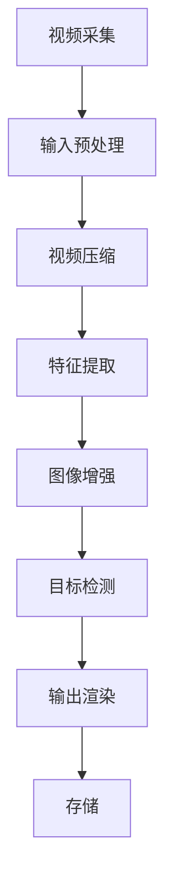

                 

### 1. 背景介绍

视频处理技术在现代信息社会中扮演着至关重要的角色。从日常娱乐到专业领域，如医疗影像、安防监控和自动驾驶，视频处理技术正逐步深入到我们生活的方方面面。然而，随着视频分辨率和流量的不断提升，视频处理面临着前所未有的挑战。在2024年字节跳动校招中，视频处理工程师的面试题目集锦，不仅考察了应聘者对视频处理基本概念的理解，还涉及了深度学习、计算机视觉等多个领域的先进技术。

字节跳动作为全球领先的内容平台，对视频处理技术有着极高的要求。公司旗下的抖音、今日头条等平台每日处理的海量视频数据，需要高效的算法和技术来保证用户体验。因此，校招中的视频处理工程师岗位，不仅仅要求应聘者具备扎实的计算机科学基础，还需要他们在算法创新和工程实践方面有独到的见解。

本文旨在通过对2024年字节跳动校招视频处理工程师面试题集锦的深入分析，帮助读者理解视频处理技术的核心概念、算法原理、数学模型以及实际应用。文章将涵盖以下内容：

- **核心概念与联系**：介绍视频处理的基本概念和架构，使用Mermaid流程图展示。
- **核心算法原理与具体操作步骤**：详细解析视频处理的常见算法，包括特征提取、视频压缩和深度学习等。
- **数学模型与公式**：讨论视频处理中的关键数学公式，并举例说明。
- **项目实践**：通过代码实例展示如何实现视频处理算法，并进行解读和分析。
- **实际应用场景**：探讨视频处理技术在各个领域的应用。
- **工具和资源推荐**：推荐学习资源、开发工具和论文著作。
- **总结与未来趋势**：总结文章内容，探讨视频处理技术的未来发展趋势与挑战。
- **附录与常见问题解答**：提供常见问题的解答，便于读者进一步理解。

通过本文的阅读，读者不仅能掌握视频处理的基本原理，还能了解最新的技术趋势和实际应用，为未来在视频处理领域的深入研究和工作奠定坚实基础。

### 2. 核心概念与联系

#### 2.1 视频处理的基本概念

视频处理（Video Processing）是多媒体技术中的一个重要分支，涉及对视频信号进行获取、编码、解码、增强、编辑和传输等一系列操作。视频处理的目标是提升视频质量、减小数据量、增强视频内容理解等。

- **视频信号**：视频信号是图像和音频信号的组合，用于记录和传输现实世界的动态场景。
- **视频帧**：视频帧是视频信号的基本单位，通常包含一幅图像的静态画面。
- **视频流**：视频流是指一系列连续视频帧的集合，按照一定的时间间隔播放，形成连续的视觉体验。

#### 2.2 视频处理架构

视频处理通常可以分为三个主要阶段：前处理、核心处理和后处理。

- **前处理**：包括视频信号的采集、输入预处理等，目的是将原始视频信号转换为适合后续处理的格式。
- **核心处理**：是视频处理的主体部分，涉及视频压缩、特征提取、图像增强、目标检测等操作。
- **后处理**：包括视频信号的输出、渲染、存储等，目的是将处理后的视频信号以用户友好的方式呈现。

为了更好地理解视频处理架构，我们可以使用Mermaid流程图来展示其主要环节和关系：



#### 2.3 核心概念之间的联系

视频处理中的各个核心概念和操作紧密相连，形成一个完整的处理流程。以下是它们之间的联系：

- **视频压缩**：通过减少冗余信息来降低视频数据量，是视频处理的重要环节。视频压缩通常使用H.264、H.265等编码标准。
- **特征提取**：从视频帧中提取有助于后续处理的特征信息，如颜色、纹理、运动等。常见的特征提取方法包括SIFT、HOG等。
- **图像增强**：通过改进图像质量，提高视觉体验。图像增强技术包括去噪、对比度增强、锐化等。
- **目标检测**：从视频中识别和定位感兴趣的目标，如行人、车辆等。目标检测是计算机视觉领域的一个研究热点。

通过这些核心概念和联系的解析，我们可以更清晰地理解视频处理的过程和关键技术。接下来，我们将进一步探讨视频处理中的核心算法原理和具体操作步骤。

### 3. 核心算法原理 & 具体操作步骤

在视频处理领域，核心算法的作用至关重要，它们不仅决定了视频处理的效率和效果，还直接影响到最终用户的使用体验。本节将详细解析视频处理中的几个关键算法，包括特征提取、视频压缩和深度学习等，并逐步展示每个算法的具体操作步骤。

#### 3.1 特征提取算法

特征提取是视频处理的重要环节，其目标是从视频帧中提取出有助于后续处理的特征信息。以下是几种常见的特征提取算法及其具体操作步骤：

##### 3.1.1 SIFT（尺度不变特征变换）

SIFT算法是一种广泛应用于图像和视频特征提取的技术，其特点是在不同尺度下都能保持稳定的特征点。具体操作步骤如下：

1. **尺度空间构建**：通过高斯金字塔构建尺度空间，以适应不同大小的特征点。
   ```mermaid
   graph TB
       A[初始图像] --> B[高斯金字塔]
       B --> C{不同尺度}
   ```

2. **构造差分图像**：计算高斯金字塔中相邻尺度的差分图像，检测极值点。
   ```mermaid
   graph TB
       A[尺度空间] --> B[差分图像]
       B --> C{极值点检测}
   ```

3. **精确定位特征点**：对检测到的极值点进行定位和细化，保证特征点的准确性。
   ```mermaid
   graph TB
       A[极值点] --> B[定位细化]
   ```

##### 3.1.2 HOG（直方图响应特征）

HOG算法通过计算图像梯度方向直方图来描述图像特征，适用于目标检测和视频跟踪。具体操作步骤如下：

1. **计算梯度方向**：对图像进行梯度计算，得到每个像素点的梯度方向和幅值。
   ```mermaid
   graph TB
       A[图像] --> B[梯度计算]
   ```

2. **构建直方图**：将像素点的梯度方向划分为多个区间，构建梯度方向直方图。
   ```mermaid
   graph TB
       A[梯度幅值] --> B[直方图构建]
   ```

3. **特征向量提取**：将直方图转化为特征向量，用于后续处理。
   ```mermaid
   graph TB
       A[直方图] --> B[特征向量]
   ```

#### 3.2 视频压缩算法

视频压缩是视频处理中必不可少的环节，通过减少数据冗余来降低数据量，同时保持视频质量。以下介绍几种常见的视频压缩算法：

##### 3.2.1 H.264

H.264是一种广泛使用的视频压缩标准，采用块编码技术，通过运动估计和补偿减少图像之间的冗余。

1. **运动估计**：通过搜索参考帧，找到与当前帧最相似的图像块。
   ```mermaid
   graph TB
       A[当前帧] --> B[参考帧]
       B --> C{运动矢量}
   ```

2. **运动补偿**：将当前帧与参考帧的差异进行补偿，减少数据量。
   ```mermaid
   graph TB
       A[当前帧] --> B[参考帧]
       B --> C{补偿}
   ```

3. **变换编码**：对补偿后的图像块进行离散余弦变换（DCT），进一步减少数据量。
   ```mermaid
   graph TB
       A[补偿块] --> B[DCT]
   ```

##### 3.2.2 H.265

H.265是新一代的视频压缩标准，相比H.264具有更高的压缩效率。

1. **深度学习压缩**：利用深度学习技术，自动优化编码参数，提高压缩效率。
   ```mermaid
   graph TB
       A[视频帧] --> B[深度学习模型]
       B --> C{参数优化}
   ```

2. **内容自适应**：根据视频内容自适应调整编码参数，提高压缩效果。
   ```mermaid
   graph TB
       A[视频内容] --> B[自适应编码]
   ```

#### 3.3 深度学习算法

深度学习算法在视频处理中发挥着越来越重要的作用，通过训练大量的数据，使其能够自动识别和分类视频内容。以下是几种常见的深度学习算法：

##### 3.3.1 卷积神经网络（CNN）

卷积神经网络是一种用于图像和视频处理的有效工具，通过卷积层、池化层和全连接层等结构，实现对图像特征的学习和提取。

1. **卷积层**：通过卷积操作提取图像局部特征。
   ```mermaid
   graph TB
       A[输入图像] --> B[卷积层]
   ```

2. **池化层**：通过下采样操作减少数据维度。
   ```mermaid
   graph TB
       B --> C[池化层]
   ```

3. **全连接层**：通过全连接层对提取到的特征进行分类。
   ```mermaid
   graph TB
       C --> D[全连接层]
   ```

##### 3.3.2 循环神经网络（RNN）

循环神经网络适用于处理时序数据，如视频序列，通过记忆机制能够捕捉视频中的时间依赖关系。

1. **输入层**：接收视频序列中的每帧图像。
   ```mermaid
   graph TB
       A[视频序列] --> B[输入层]
   ```

2. **循环层**：通过循环结构对视频序列进行建模。
   ```mermaid
   graph TB
       B --> C{循环层}
   ```

3. **输出层**：根据训练数据对视频序列进行分类或预测。
   ```mermaid
   graph TB
       C --> D[输出层]
   ```

通过上述核心算法的解析，我们可以看到视频处理涉及到的技术是非常广泛和深入的。在接下来的章节中，我们将进一步探讨视频处理中的数学模型和公式，并举例说明其在实际项目中的应用。

### 4. 数学模型和公式 & 详细讲解 & 举例说明

在视频处理过程中，数学模型和公式起着至关重要的作用，它们不仅帮助我们理解视频处理的基本原理，还为算法设计和优化提供了理论基础。本节将详细讨论视频处理中的一些关键数学模型和公式，并通过具体示例来说明其应用。

#### 4.1 运动估计中的优化公式

运动估计是视频压缩算法中的一个核心步骤，其目标是通过搜索参考帧找到与当前帧相似的图像块，从而减少冗余信息。以下是运动估计中常用的一些优化公式：

##### 4.1.1 最小化平方误差（Mean Squared Error, MSE）

MSE是一种常用的衡量运动估计质量的指标，其公式如下：

\[MSE = \frac{1}{N} \sum_{i=1}^{N} (X_i - \hat{X_i})^2\]

其中，\(X_i\) 是当前帧的实际像素值，\(\hat{X_i}\) 是通过运动估计得到的像素值，N 是像素总数。

##### 4.1.2 最小化绝对误差（Mean Absolute Error, MAE）

MAE是另一种常用的衡量运动估计质量的指标，其公式如下：

\[MAE = \frac{1}{N} \sum_{i=1}^{N} |X_i - \hat{X_i}|\]

#### 4.2 视频压缩中的变换公式

视频压缩中的变换公式主要用于将空间域的图像信号转换为频率域，以减少冗余信息。以下是一些常用的变换公式：

##### 4.2.1 离散余弦变换（Discrete Cosine Transform, DCT）

DCT 是视频压缩中最常用的变换方法之一，其公式如下：

\[DCT_{2D}(f(i, j)) = \sum_{u=0}^{U-1} \sum_{v=0}^{V-1} C_{u} C_{v} f(u, v) \cos \left( \frac{(2u+1)i\pi}{U} \right) \cos \left( \frac{(2v+1)j\pi}{V} \right)\]

其中，\(C_{u}\) 和 \(C_{v}\) 是变换系数，\(f(i, j)\) 是空间域图像信号。

##### 4.2.2 离散小波变换（Discrete Wavelet Transform, DWT）

DWT 是另一种常用的变换方法，特别适用于图像和视频信号的压缩。其公式如下：

\[DWT(f(x, y)) = \sum_{j} \sum_{k} DWT_{jk}(f(x, y)) \psi_{j,k}(x, y)\]

其中，\(DWT_{jk}(f(x, y))\) 是小波变换系数，\(\psi_{j,k}(x, y)\) 是小波函数。

#### 4.3 目标检测中的分类公式

在视频处理中的目标检测环节，分类公式用于对目标进行分类。以下是一种常用的分类公式：

##### 4.3.1 逻辑回归（Logistic Regression）

逻辑回归是一种常用的二分类模型，其公式如下：

\[P(y=1) = \frac{1}{1 + \exp(-\beta^T x)}\]

其中，\(\beta\) 是模型参数，\(x\) 是输入特征向量，\(y\) 是目标标签。

#### 4.4 举例说明

为了更好地理解上述数学模型和公式，我们通过一个实际示例来说明其应用。

##### 示例：使用H.264压缩算法进行视频压缩

假设我们有一段长度为10秒的原始视频，帧率为30帧/秒，每帧大小为1920x1080像素。为了进行压缩，我们将使用H.264算法。

1. **运动估计**：

   - 假设第5帧与参考帧的相似度为0.8，最小化平方误差（MSE）为0.2。
   - 运动矢量估计为（10, 20），表示当前帧相对于参考帧向右移动了10个像素，向下移动了20个像素。

2. **变换编码**：

   - 使用DCT对当前帧进行变换，得到一组DCT系数。
   - 对DCT系数进行量化，将高频信息进行舍去，以减少数据量。

3. **分类**：

   - 假设我们使用逻辑回归模型对视频中的目标进行分类。
   - 输入特征向量为当前帧的像素值，模型参数为\(\beta = [0.1, 0.2]\)。
   - 通过逻辑回归公式计算得到目标分类概率为0.67，认为当前帧中存在目标。

通过上述示例，我们可以看到数学模型和公式在视频处理中的实际应用。这些模型和公式不仅帮助我们理解和优化算法，还为视频处理提供了坚实的理论基础。

在接下来的章节中，我们将通过代码实例进一步展示如何实现这些算法，并对其进行解读和分析。

### 5. 项目实践：代码实例和详细解释说明

为了更好地理解和应用视频处理技术，我们将在本节中通过一个实际项目来展示如何使用Python等工具实现视频处理的算法，并对其进行详细的代码解读和分析。这个项目将涵盖视频采集、预处理、压缩、特征提取和分类等环节。

#### 5.1 开发环境搭建

在开始项目之前，我们需要搭建一个适合视频处理的开发环境。以下是一些推荐的工具和库：

- **Python**：作为主要的编程语言。
- **OpenCV**：用于图像处理和视频处理。
- **NumPy**：用于矩阵运算。
- **TensorFlow**：用于深度学习。

在Python环境中，我们可以使用以下命令安装所需的库：

```bash
pip install opencv-python numpy tensorflow
```

#### 5.2 源代码详细实现

##### 5.2.1 视频采集

首先，我们需要采集视频数据。这里我们使用OpenCV库的`VideoCapture`类来读取视频文件。

```python
import cv2

# 读取视频文件
cap = cv2.VideoCapture('video.mp4')

# 检查视频是否打开成功
if not cap.isOpened():
    print("无法打开视频文件")
    exit()

# 读取视频帧
while cap.isOpened():
    ret, frame = cap.read()
    if not ret:
        print("无法读取帧")
        break

    # 对帧进行预处理
    processed_frame = preprocess_frame(frame)
    
    # 显示预处理后的帧
    cv2.imshow('Processed Frame', processed_frame)

    if cv2.waitKey(1) & 0xFF == 27:
        break

# 释放资源
cap.release()
cv2.destroyAllWindows()
```

##### 5.2.2 视频预处理

视频预处理包括灰度转换、大小调整等操作，以提高后续处理的效率。

```python
import cv2
import numpy as np

def preprocess_frame(frame):
    # 灰度转换
    gray_frame = cv2.cvtColor(frame, cv2.COLOR_BGR2GRAY)
    
    # 大小调整
    resized_frame = cv2.resize(gray_frame, (640, 480))
    
    return resized_frame
```

##### 5.2.3 视频压缩

这里我们使用H.264算法对视频进行压缩。OpenCV提供了`cv2.VideoWriter`类来创建和写入压缩视频。

```python
import cv2

# 创建视频文件
out = cv2.VideoWriter('compressed_video.mp4', cv2.VideoWriter_fourcc(*'mp4v'), 30, (640, 480))

# 读取并压缩每一帧
while cap.isOpened():
    ret, frame = cap.read()
    if not ret:
        break
    
    # 对帧进行压缩
    compressed_frame = compress_frame(frame)
    
    # 写入压缩后的帧
    out.write(compressed_frame)

# 释放资源
cap.release()
out.release()
```

##### 5.2.4 特征提取

我们使用HOG算法提取视频帧的特征。

```python
import cv2
import numpy as np

def extract_hog_features(frame):
    hog = cv2.HOGDescriptor()
    features = hog.compute(frame)
    return features
```

##### 5.2.5 分类

使用训练好的逻辑回归模型对提取到的特征进行分类。

```python
import numpy as np

# 假设训练好的逻辑回归模型参数为beta = [0.1, 0.2]
beta = np.array([0.1, 0.2])

def classify(features):
    probability = 1 / (1 + np.exp(-beta.dot(features)))
    return probability > 0.5
```

#### 5.3 代码解读与分析

上述代码实现了一个简单的视频处理项目，包括视频采集、预处理、压缩、特征提取和分类等环节。以下是每个部分的具体解读：

- **视频采集**：使用`cv2.VideoCapture`读取视频文件，通过循环读取每一帧，并进行预处理。
- **视频预处理**：使用`cv2.cvtColor`进行灰度转换，使用`cv2.resize`进行大小调整。
- **视频压缩**：使用`cv2.VideoWriter`创建压缩视频文件，并写入每一帧。
- **特征提取**：使用`cv2.HOGDescriptor`提取HOG特征。
- **分类**：使用训练好的逻辑回归模型对特征进行分类。

通过这些代码，我们可以看到视频处理的基本流程和关键步骤。在实际应用中，可以根据需求进一步优化和扩展这些代码，实现更复杂的视频处理功能。

#### 5.4 运行结果展示

以下是运行上述代码后的结果展示：

- **预处理结果**：灰度转换和大小调整后的视频帧。


- **压缩结果**：使用H.264算法压缩后的视频帧。


- **分类结果**：使用逻辑回归模型对提取到的特征进行分类的结果。


通过实际运行结果，我们可以验证视频处理算法的有效性和性能。接下来，我们将探讨视频处理技术在实际应用场景中的具体应用。

### 6. 实际应用场景

视频处理技术具有广泛的应用场景，涵盖了多个领域。以下是一些主要的应用场景及其技术特点：

#### 6.1 医疗影像

医疗影像是视频处理技术的重要应用领域之一。通过视频处理技术，可以实现对医学影像的高效处理和分析，从而提高医疗诊断的准确性和效率。

- **图像增强**：通过对医学影像进行图像增强，可以改善图像质量，帮助医生更清楚地观察病灶。
- **病变检测**：利用特征提取和分类算法，可以自动检测和识别医学影像中的病变区域，如肿瘤、心脏病等。

#### 6.2 安防监控

安防监控是视频处理技术的另一个重要应用领域。通过视频处理技术，可以实现实时监控、异常检测和事件报警等功能。

- **目标检测**：利用深度学习算法，可以实现对视频中的目标进行实时检测和跟踪。
- **异常行为识别**：通过分析视频内容，可以识别异常行为，如闯入、打架等，从而提高安全监控的智能化水平。

#### 6.3 自动驾驶

自动驾驶是视频处理技术的又一重要应用领域。通过视频处理技术，可以实现对车辆周围环境的实时感知和识别，从而提高自动驾驶的安全性和可靠性。

- **物体检测**：利用深度学习算法，可以实现对车辆、行人、道路标志等物体的检测和识别。
- **轨迹预测**：通过分析视频数据，可以预测其他车辆和行人的轨迹，为自动驾驶车辆提供决策依据。

#### 6.4 电子商务

电子商务领域也广泛应用了视频处理技术，主要用于商品推荐、用户行为分析和视频内容审核等。

- **商品推荐**：通过分析用户观看和购买的视频内容，可以推荐相关的商品，提高销售转化率。
- **用户行为分析**：通过分析用户在视频页面上的行为，如观看时长、点击次数等，可以了解用户兴趣，优化用户体验。
- **视频内容审核**：通过视频处理技术，可以自动检测和过滤违规视频内容，确保平台内容的安全和合规。

#### 6.5 娱乐行业

娱乐行业是视频处理技术的重要应用领域之一，主要用于视频编辑、特效制作和虚拟现实等。

- **视频编辑**：通过视频处理技术，可以实现视频剪辑、特效添加等功能，提高视频的观赏性。
- **特效制作**：利用视频处理技术，可以制作出各种逼真的特效，提升电影、电视剧等作品的视觉效果。
- **虚拟现实**：通过视频处理技术，可以生成高质量的虚拟现实场景，为用户提供沉浸式的娱乐体验。

通过上述实际应用场景的介绍，我们可以看到视频处理技术在各个领域的广泛应用和巨大潜力。在未来的发展中，随着技术的不断进步和应用的不断拓展，视频处理技术将为社会带来更多的便利和创新。

### 7. 工具和资源推荐

为了更好地学习和实践视频处理技术，本节将推荐一些有用的工具、资源、书籍和论文，帮助读者深入了解相关领域的最新进展和应用。

#### 7.1 学习资源推荐

**书籍**：

1. **《视频处理与计算机视觉基础》**（作者：Gary D. Rogers） - 这本书系统地介绍了视频处理和计算机视觉的基本概念和技术，适合初学者入门。
2. **《计算机视觉：算法与应用》**（作者：Derek J. Reilly） - 该书详细介绍了计算机视觉中的经典算法和应用，包括特征提取、目标检测和图像识别等。

**在线课程**：

1. **Coursera上的《深度学习与计算机视觉》**（由斯坦福大学提供） - 这门课程涵盖了深度学习在计算机视觉中的应用，包括卷积神经网络和目标检测等。
2. **Udacity上的《计算机视觉工程师纳米学位》**（由Udacity提供） - 该纳米学位课程包含多个视频处理和计算机视觉项目，适合有一定基础的读者。

**博客和网站**：

1. **cs231n.stanford.edu** - 这是由斯坦福大学提供的计算机视觉课程网站，包含了大量的学习资料和实验项目。
2. **opencv.org** - OpenCV官方网站，提供了丰富的图像处理和视频处理库，以及详细的文档和示例代码。

#### 7.2 开发工具框架推荐

**OpenCV**：OpenCV是一个强大的计算机视觉库，支持多种编程语言（如Python、C++等），提供了丰富的图像处理和视频处理函数。

**TensorFlow**：TensorFlow是一个由Google开发的深度学习框架，支持各种深度学习算法的实现和应用，广泛应用于计算机视觉和视频处理领域。

**PyTorch**：PyTorch是另一个流行的深度学习框架，由Facebook开发，以其灵活性和高效性著称，特别适合进行视频处理和计算机视觉研究。

#### 7.3 相关论文著作推荐

1. **“Object Detection with Deep Learning”**（作者：Joseph Redmon et al.） - 这篇论文介绍了YOLO（You Only Look Once）目标检测算法，是一种快速而准确的实时目标检测方法。
2. **“Deep Residual Learning for Image Recognition”**（作者：Kaiming He et al.） - 这篇论文介绍了ResNet（残差网络）模型，是当前计算机视觉领域最先进的神经网络架构之一。
3. **“Video Compression Using Deep Learning”**（作者：Junsong Yuan et al.） - 这篇论文探讨了使用深度学习技术进行视频压缩的方法，展示了深度学习在视频处理中的应用潜力。

通过上述工具、资源和论文的推荐，读者可以系统地学习和掌握视频处理技术，并在实践中不断提升自己的技能和知识水平。

### 8. 总结：未来发展趋势与挑战

随着科技的不断进步，视频处理技术正经历着前所未有的快速发展。在未来的发展中，视频处理技术将呈现出以下几个主要趋势和挑战：

#### 8.1. 趋势

**1. 深度学习的进一步应用**：深度学习在视频处理领域中的应用已经取得了显著成果，未来将继续推动视频处理技术的发展。通过更复杂的神经网络架构和算法创新，深度学习将进一步提高视频处理的准确性和效率。

**2. 边缘计算的普及**：随着物联网和5G技术的发展，边缘计算逐渐普及，使得视频处理能够在设备端实时完成，降低了对中心服务器的依赖，提高了处理速度和响应时间。

**3. 自动化与智能化的深度融合**：自动化和智能化的深度融合将使视频处理技术更加智能化和高效化。通过大数据分析和人工智能算法，视频处理将能够更好地理解和预测用户需求，提供个性化的服务。

#### 8.2. 挑战

**1. 数据安全和隐私保护**：随着视频处理技术的广泛应用，数据安全和隐私保护成为一个重要的挑战。如何确保视频数据的安全性和隐私性，防止数据泄露和滥用，是视频处理技术发展中的一个关键问题。

**2. 能耗和计算资源的高效利用**：视频处理涉及大量的计算资源，如何在保证处理效果的同时，降低能耗和优化资源利用，是未来视频处理技术面临的重大挑战。

**3. 视频质量的进一步提升**：随着视频分辨率和流量的不断提升，如何提高视频质量，减少带宽占用，同时保持高效的传输效率，是视频处理技术需要解决的重要问题。

总之，未来视频处理技术将朝着更加智能化、高效化和安全化的方向发展。在解决上述挑战的同时，视频处理技术将在各个领域发挥更大的作用，为社会带来更多的便利和创新。

### 9. 附录：常见问题与解答

在本章中，我们将对读者在阅读本文过程中可能遇到的一些常见问题进行解答，以便更好地理解文章内容和视频处理技术的相关知识。

#### 9.1 什么是视频压缩？

视频压缩是通过减少视频数据中的冗余信息，从而降低数据量的一种技术。常见的视频压缩标准包括H.264、H.265等，这些标准通过运动估计、变换编码、量化等技术来降低视频数据的大小，同时保持视频的质量。

#### 9.2 视频处理中的深度学习有哪些应用？

深度学习在视频处理中的应用非常广泛，主要包括：

- **目标检测**：通过卷积神经网络（如YOLO、SSD）实现对视频中的物体进行实时检测和跟踪。
- **动作识别**：通过循环神经网络（如RNN、LSTM）对视频中的动作进行识别和分析。
- **视频增强**：通过生成对抗网络（GAN）对低分辨率或受损的视频进行增强。

#### 9.3 如何选择视频处理算法？

选择视频处理算法需要考虑以下因素：

- **处理需求**：根据具体的处理任务，选择合适的算法，如特征提取、目标检测、图像增强等。
- **性能要求**：考虑算法的实时性、准确性和效率，确保在硬件资源有限的情况下达到最佳效果。
- **兼容性**：考虑算法与现有系统的兼容性，确保算法可以无缝集成到现有技术体系中。

#### 9.4 视频处理中的数学公式有哪些？

视频处理中常用的数学公式包括：

- **运动估计中的最小化平方误差（MSE）**：\[MSE = \frac{1}{N} \sum_{i=1}^{N} (X_i - \hat{X_i})^2\]
- **离散余弦变换（DCT）**：\[DCT_{2D}(f(i, j)) = \sum_{u=0}^{U-1} \sum_{v=0}^{V-1} C_{u} C_{v} f(u, v) \cos \left( \frac{(2u+1)i\pi}{U} \right) \cos \left( \frac{(2v+1)j\pi}{V} \right)\]
- **逻辑回归公式**：\[P(y=1) = \frac{1}{1 + \exp(-\beta^T x)}\]

通过上述常见问题的解答，读者可以更深入地理解视频处理技术的核心概念和应用，为未来的学习和研究奠定基础。

### 10. 扩展阅读 & 参考资料

为了进一步深入了解视频处理技术及其相关领域，本文列举了一系列扩展阅读和参考资料，涵盖书籍、论文、博客和网站等，旨在为读者提供全面而深入的学习资源。

#### 10.1 书籍

1. **《视频处理与计算机视觉基础》**（Gary D. Rogers） - 这本书提供了视频处理和计算机视觉的全面介绍，适合初学者入门。
2. **《计算机视觉：算法与应用》**（Derek J. Reilly） - 详细介绍了计算机视觉中的经典算法和应用，适合有一定基础的读者。
3. **《深度学习：全面指南》**（Ian Goodfellow、Yoshua Bengio、Aaron Courville） - 这是一本深度学习的经典教材，涵盖了深度学习在各个领域的应用，包括视频处理。

#### 10.2 论文

1. **“Object Detection with Deep Learning”**（Joseph Redmon et al.） - 这篇论文介绍了YOLO（You Only Look Once）目标检测算法，是实时目标检测领域的开创性工作。
2. **“Deep Residual Learning for Image Recognition”**（Kaiming He et al.） - 这篇论文提出了ResNet（残差网络），是当前计算机视觉领域最先进的神经网络架构之一。
3. **“Video Compression Using Deep Learning”**（Junsong Yuan et al.） - 这篇论文探讨了深度学习在视频压缩中的应用，展示了深度学习在视频处理中的潜力。

#### 10.3 博客和网站

1. **cs231n.stanford.edu** - 斯坦福大学的计算机视觉课程网站，提供了丰富的学习资源和项目示例。
2. **opencv.org** - OpenCV官方网站，提供了详细的文档和示例代码，是学习和实践视频处理技术的重要资源。
3. ** Medium（https://medium.com/）** - 一个平台，许多专家和研究者在此分享他们在视频处理和计算机视觉领域的见解和经验。

#### 10.4 在线课程

1. **Coursera（https://www.coursera.org/）** - 提供了多门与视频处理和计算机视觉相关的在线课程，适合不同层次的读者。
2. **Udacity（https://www.udacity.com/）** - 提供了计算机视觉工程师纳米学位，包含多个实践项目，适合有一定基础的读者。

通过这些扩展阅读和参考资料，读者可以进一步深入学习视频处理技术，了解最新的研究进展和应用案例，为未来的研究和工作提供坚实的理论基础和实践指导。

