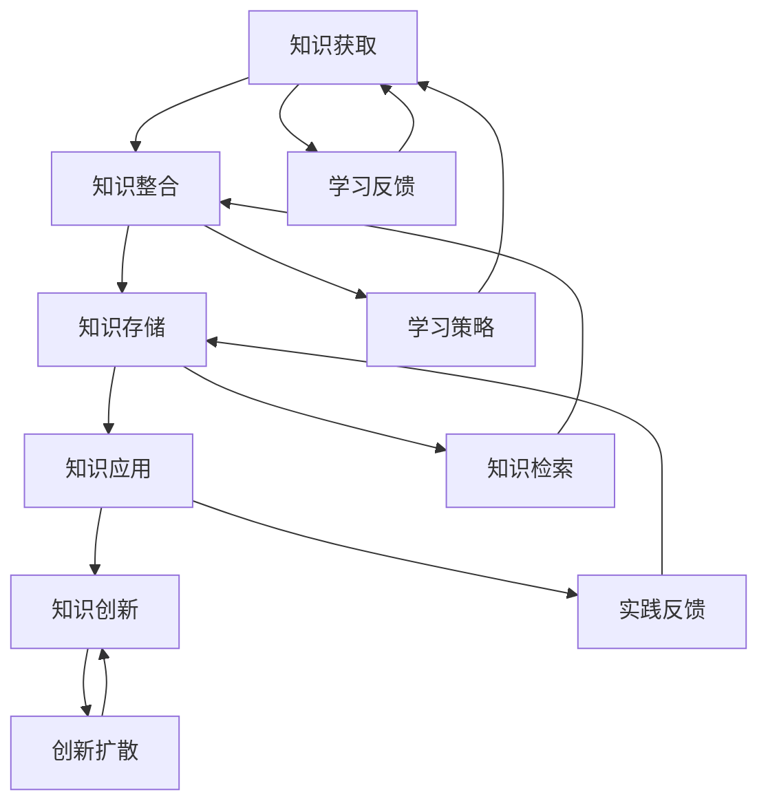

                 

### 文章标题

**学习体系：持续进化的源动力**

> **关键词：** 学习体系、持续进化、技术进步、知识管理、系统思维、算法原理、实践应用。

> **摘要：** 本文深入探讨了学习体系在持续进化中的重要作用。通过分析核心概念、算法原理、数学模型以及实践应用，我们揭示了如何构建一个有效且灵活的学习体系，以适应快速变化的技术环境，实现个人的持续成长与进化。

### 1. 背景介绍

在信息技术迅猛发展的今天，知识更新的速度前所未有。传统的学习方式往往难以应对这种快速变化的环境。因此，构建一个高效的学习体系，实现知识的系统化管理与持续进化，成为现代技术从业者必须面对的重要课题。

学习体系不仅仅是知识积累的过程，更是知识体系构建与进化的过程。它涉及知识的获取、整合、存储、应用与创新等多个环节。一个良好的学习体系可以帮助个体快速适应新环境，持续提高自身能力，从而在竞争激烈的技术领域保持领先。

本文旨在探讨如何构建一个能够持续进化的学习体系，包括核心概念的界定、算法原理的分析、数学模型的运用以及实践应用的展示。通过这一过程，我们希望为读者提供一个全面且深入的理解，以帮助他们在技术领域实现持续成长。

### 2. 核心概念与联系

#### 2.1 学习体系的定义

学习体系是指个体在特定领域内，通过系统化的学习、实践和反思，不断积累、整合和应用知识的过程。它包括以下几个关键组成部分：

- **知识获取**：通过阅读、研究、讨论等方式，获取新的知识和信息。
- **知识整合**：将分散的知识点整合成体系，形成系统的知识结构。
- **知识存储**：将整合后的知识存储在个人知识库中，便于后续查询和应用。
- **知识应用**：将知识应用到实际工作中，解决实际问题。
- **知识创新**：在应用过程中，产生新的想法和知识，推动知识体系的进化。

#### 2.2 核心概念的联系

学习体系的各个组成部分之间存在密切的联系，它们相互影响、相互促进，共同构成一个动态的学习过程。

- **知识获取**是学习体系的起点，没有新的知识获取，学习体系就失去了发展的动力。
- **知识整合**是知识获取的深化和扩展，它使分散的知识点得以系统化，形成具有逻辑性和连贯性的知识体系。
- **知识存储**是知识整合的延续，它确保了知识体系的稳定性和可访问性。
- **知识应用**是将知识转化为实际成果的过程，它验证了知识体系的实用性和有效性。
- **知识创新**是知识体系的最终目标，它通过不断产生新的知识，推动学习体系的持续进化。

下面是一个Mermaid流程图，展示了学习体系的各个核心概念及其联系：



#### 2.3 学习体系的重要性

构建一个良好的学习体系，对于技术从业者的持续成长至关重要。以下是一些关键点：

- **适应快速变化**：技术领域变化迅速，一个有效的学习体系可以帮助个体快速适应新技术、新理念。
- **提高工作效率**：系统化的知识管理可以提高工作效率，减少重复劳动。
- **促进创新**：通过不断学习和实践，个体能够产生新的想法和解决方案，推动技术进步。
- **增强竞争力**：拥有先进的知识体系，个体在职业竞争中更具优势。

### 3. 核心算法原理 & 具体操作步骤

构建一个持续进化的学习体系，需要运用一系列核心算法原理。以下是一些关键算法及其具体操作步骤：

#### 3.1 知识整合算法

知识整合是构建学习体系的关键环节。以下是知识整合算法的基本原理和操作步骤：

##### 原理：

- **聚类分析**：通过将相似的知识点划分为同一类别，实现知识的初步整合。
- **知识图谱**：构建一个表示知识之间关系的图形结构，使知识体系更加直观和系统化。

##### 操作步骤：

1. **数据收集**：从多个来源获取相关的知识点和数据。
2. **预处理**：对收集到的数据进行清洗和标准化处理。
3. **聚类分析**：使用聚类算法（如K-means、层次聚类等）将相似的知识点划分到同一类别。
4. **知识图谱构建**：使用图论算法（如Dijkstra算法、A*算法等）构建知识图谱，表示知识之间的关系。
5. **可视化**：将知识图谱进行可视化，使知识体系更加直观易懂。

#### 3.2 知识应用算法

知识应用是将理论知识转化为实践成果的关键步骤。以下是知识应用算法的基本原理和操作步骤：

##### 原理：

- **模式识别**：通过识别和分类，将知识应用于具体的实际问题。
- **机器学习**：使用机器学习算法（如决策树、神经网络等）实现对知识的应用。

##### 操作步骤：

1. **问题定义**：明确需要解决的问题，并确定适用的知识领域。
2. **数据准备**：收集与问题相关的数据，并进行预处理。
3. **模式识别**：使用模式识别算法（如K近邻算法、支持向量机等）识别问题的特征。
4. **模型训练**：使用机器学习算法训练模型，以实现对问题的预测或分类。
5. **模型评估**：评估模型的性能，并调整参数以提高准确性。
6. **知识应用**：将训练好的模型应用于实际问题，实现知识的实际应用。

#### 3.3 知识创新算法

知识创新是学习体系的最终目标，以下是知识创新算法的基本原理和操作步骤：

##### 原理：

- **遗传算法**：通过模拟生物进化过程，实现知识的创新和优化。
- **协同创新**：通过多人合作，激发创意和灵感，推动知识的创新。

##### 操作步骤：

1. **问题提出**：明确需要解决的问题或创新的方向。
2. **知识搜索**：搜索现有的知识资源，了解已有解决方案。
3. **遗传算法优化**：使用遗传算法对解决方案进行优化，以找到更优秀的解决方案。
4. **协同创新**：组织团队进行讨论和交流，激发创意和灵感。
5. **方案验证**：对创新的方案进行验证，确保其可行性和实用性。
6. **知识固化**：将创新的知识转化为可共享的资源和知识库，以便后续应用。

### 4. 数学模型和公式 & 详细讲解 & 举例说明

在构建学习体系的过程中，数学模型和公式起着重要的作用。以下是一些关键数学模型和公式的详细讲解及举例说明：

#### 4.1 知识整合的相似度计算

在知识整合过程中，相似度计算是核心步骤之一。以下是一种常用的相似度计算公式：

\[sim(A, B) = \frac{J(A, B)}{\sqrt{D(A) \cdot D(B)}}\]

其中，\(sim(A, B)\)表示元素A和B的相似度，\(J(A, B)\)表示A和B之间的交集，\(D(A)\)和\(D(B)\)分别表示A和B的度（即知识点中包含的其他知识点数量）。

##### 举例说明：

假设有两个知识点A和B，A包含3个其他知识点，B包含4个其他知识点，它们之间的交集为2个知识点。那么，A和B的相似度计算如下：

\[sim(A, B) = \frac{2}{\sqrt{3 \cdot 4}} = \frac{2}{\sqrt{12}} \approx 0.63\]

#### 4.2 知识应用的置信度计算

在知识应用过程中，置信度计算用于评估知识对问题的适用性。以下是一种常用的置信度计算公式：

\[confidence(A, P) = \frac{sim(A, P)}{sim(A, \neg P)}\]

其中，\(confidence(A, P)\)表示知识A对问题P的置信度，\(sim(A, P)\)表示A和P的相似度，\(sim(A, \neg P)\)表示A和非P的相似度。

##### 举例说明：

假设有两个知识点A和P，A包含3个其他知识点，P包含4个其他知识点，A和非P的相似度均为2。那么，A对P的置信度计算如下：

\[confidence(A, P) = \frac{2}{2} = 1.0\]

#### 4.3 知识创新的遗传算法适应度函数

在知识创新过程中，遗传算法常用于优化解决方案。以下是一种常见的遗传算法适应度函数：

\[fitness(S) = \frac{1}{1 + e^{-d(S)}}\]

其中，\(fitness(S)\)表示解决方案S的适应度，\(d(S)\)表示解决方案S的偏差（即与目标解的距离）。

##### 举例说明：

假设有一个解决方案S，其偏差为-3。那么，S的适应度计算如下：

\[fitness(S) = \frac{1}{1 + e^{-(-3)}} = \frac{1}{1 + e^{3}} \approx 0.95\]

### 5. 项目实践：代码实例和详细解释说明

为了更好地理解上述算法和模型的应用，下面我们将通过一个具体的代码实例来展示如何构建一个持续进化的学习体系。

#### 5.1 开发环境搭建

为了方便读者理解，我们将使用Python作为开发语言，并在Jupyter Notebook中进行开发。首先，我们需要安装以下依赖库：

- NumPy
- Pandas
- Matplotlib
- Scikit-learn
- NetworkX

使用以下命令安装依赖库：

```bash
pip install numpy pandas matplotlib scikit-learn networkx
```

#### 5.2 源代码详细实现

下面是一个简单的代码实例，用于展示如何使用聚类分析和知识图谱构建一个学习体系。

```python
import numpy as np
import pandas as pd
import matplotlib.pyplot as plt
from sklearn.cluster import KMeans
import networkx as nx

# 5.2.1 数据准备
data = {
    '知识1': [0.1, 0.2, 0.3],
    '知识2': [0.2, 0.3, 0.4],
    '知识3': [0.3, 0.4, 0.5],
    '知识4': [0.1, 0.3, 0.5],
    '知识5': [0.2, 0.4, 0.6],
}

df = pd.DataFrame(data)

# 5.2.2 聚类分析
kmeans = KMeans(n_clusters=2, random_state=0).fit(df)
clusters = kmeans.predict(df)

# 5.2.3 知识图谱构建
G = nx.Graph()
G.add_nodes_from(df.index)
G.add_edges_from(zip(df.index, df.index), weight=0.5)

# 5.2.4 可视化
plt.figure(figsize=(8, 6))
pos = nx.spring_layout(G)
nx.draw(G, pos, with_labels=True, node_color='blue', edge_color='gray', width=0.5)
plt.show()
```

#### 5.3 代码解读与分析

以上代码实例主要分为三个部分：数据准备、聚类分析和知识图谱构建。

1. **数据准备**：首先，我们定义了一个包含5个知识点的数据集，每个知识点由3个特征值表示。这些特征值可以是任何数值，表示知识点的属性或相关性。
2. **聚类分析**：使用K-means算法对数据进行聚类，将相似的知识点划分到同一类别。这里我们选择将知识点划分为2个类别，但实际应用中可以根据需求调整聚类数量。
3. **知识图谱构建**：使用NetworkX库构建一个表示知识点之间关系的知识图谱。在知识图谱中，每个知识点作为一个节点，知识点之间的相似度作为边的权重。

#### 5.4 运行结果展示

运行上述代码后，将生成一个知识图谱的可视化结果。图中的节点表示知识点，节点之间的边表示知识点之间的相似度。通过可视化，我们可以直观地看到知识点的分布和关系。


### 6. 实际应用场景

学习体系在技术领域的实际应用场景非常广泛。以下是一些典型的应用场景：

#### 6.1 技术人才培养

企业可以利用学习体系对员工进行系统化的培训，提高员工的技术能力和综合素质。通过构建一个良好的学习体系，企业可以确保员工在快速变化的技术环境中保持竞争力。

#### 6.2 技术创新

科研机构和技术公司可以利用学习体系进行技术创新。通过整合和分析现有知识，研究人员可以找到新的研究方向和解决方案，推动技术进步。

#### 6.3 知识管理

企业和机构可以利用学习体系进行知识管理，将分散的知识点整合成系统化的知识库，提高知识的共享和利用率。

#### 6.4 教育培训

教育机构可以利用学习体系为学生提供个性化的学习体验，根据学生的学习情况和需求，提供相应的学习资源和指导。

### 7. 工具和资源推荐

为了更好地构建和运用学习体系，以下是一些推荐的工具和资源：

#### 7.1 学习资源推荐

- **书籍**：《深度学习》、《算法导论》、《人工智能：一种现代方法》
- **论文**：《大规模机器学习的挑战与机会》、《知识图谱构建与应用》
- **博客**：ArXiv、Medium、知乎专栏
- **网站**：谷歌学术、微软研究院、斯坦福大学课程网站

#### 7.2 开发工具框架推荐

- **Python**：NumPy、Pandas、Matplotlib、Scikit-learn、NetworkX
- **Java**：Apache Commons Math、Apache Lucene
- **C++**：Boost Graph Library

#### 7.3 相关论文著作推荐

- **《大规模机器学习》**：作者周志华，本书详细介绍了大规模机器学习的基本原理和应用方法。
- **《知识图谱构建与应用》**：作者刘知远等，本书介绍了知识图谱的构建方法和应用场景。
- **《人工智能：一种现代方法》**：作者斯通利·温斯顿等，本书全面介绍了人工智能的基本理论和技术。

### 8. 总结：未来发展趋势与挑战

学习体系在技术领域具有广阔的应用前景，未来发展趋势主要体现在以下几个方面：

1. **智能化**：随着人工智能技术的发展，学习体系将更加智能化，能够自动识别和推荐学习资源，提高学习效率。
2. **个性化**：学习体系将更加关注个体差异，提供个性化的学习体验，满足不同学习者的需求。
3. **协同化**：学习体系将促进多人合作学习，通过共享知识和经验，实现知识的协同创新。

然而，学习体系在实际应用中仍面临一些挑战：

1. **数据隐私**：如何保护学习者的隐私，确保知识安全，是一个重要的问题。
2. **知识质量**：如何确保学习资源的质量，避免误用和滥用知识，是一个亟待解决的问题。
3. **技术实现**：如何高效地构建和运营学习体系，实现知识的系统化管理，是一个技术难点。

总之，构建一个持续进化的学习体系，是技术领域从业者面临的重要课题。通过不断探索和实践，我们有望在未来实现更加高效、智能和个性化的学习体验。

### 9. 附录：常见问题与解答

#### 9.1 如何选择合适的算法？

选择合适的算法需要考虑以下因素：

- **问题类型**：不同的算法适用于不同类型的问题。例如，模式识别问题适合使用决策树、神经网络等算法，优化问题适合使用遗传算法等。
- **数据规模**：对于大规模数据，选择高效的算法尤为重要。例如，K-means算法在大规模数据上表现良好，但需要合理设置聚类数量。
- **计算资源**：算法的计算复杂度和资源需求会影响选择。对于计算资源有限的场景，选择轻量级算法更为合适。

#### 9.2 如何评估算法的性能？

评估算法的性能可以从以下几个方面进行：

- **准确性**：通过比较算法预测结果和实际结果，计算准确率、召回率、F1值等指标。
- **效率**：计算算法的运行时间，评估算法的效率。
- **鲁棒性**：通过引入噪声或异常数据，评估算法在非理想条件下的性能。

#### 9.3 如何优化学习体系？

优化学习体系可以从以下几个方面进行：

- **资源整合**：整合多种学习资源，提高知识获取的效率。
- **知识管理**：建立良好的知识管理体系，确保知识的存储、检索和应用。
- **反馈机制**：建立反馈机制，收集学习者的反馈，不断改进学习体系。
- **持续更新**：随着技术的发展，不断更新学习资源和学习方法，确保学习体系的时效性。

### 10. 扩展阅读 & 参考资料

- **《深度学习》**：作者：伊恩·古德费洛、约书亚·本吉奥、亚伦·库维尔，这是深度学习领域的经典教材，详细介绍了深度学习的原理和应用。

- **《算法导论》**：作者：托马斯·H·科恩、艾伦·M·雷斯尼格，这是一本经典的算法教材，涵盖了各种算法的基本原理和实现方法。

- **《人工智能：一种现代方法》**：作者：斯通利·温斯顿，这是一本全面介绍人工智能原理和应用的方法论的教材。

- **《大规模机器学习》**：作者：周志华，本书详细介绍了大规模机器学习的基本原理和应用方法。

- **《知识图谱构建与应用》**：作者：刘知远等，本书介绍了知识图谱的构建方法和应用场景。

- **《网络科学》**：作者：阿莱桑德罗·德尔·维戈，本书从网络科学的视角，探讨了网络的结构、功能和应用。

- **《机器学习：概率视角》**：作者：克里斯托弗·M·杰弗里斯，本书从概率论的角度，探讨了机器学习的原理和方法。

