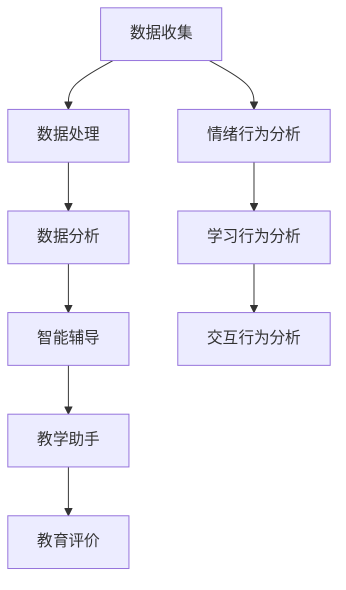

                 

### 文章标题

**学生学习行为AI分析平台的应用**

> **关键词**：学生行为分析，人工智能，教育技术，机器学习，数据挖掘

> **摘要**：本文将探讨如何利用人工智能技术构建一个学生学习行为分析平台。我们将从背景介绍开始，详细分析平台的核心概念与联系，并深入探讨核心算法原理及具体操作步骤。接着，通过数学模型和公式展示其详细解释说明，并以实际项目实践为例，展示代码实例和运行结果。随后，我们将探讨平台在实际应用场景中的价值，并推荐相关工具和资源。最后，文章将对未来发展趋势与挑战进行总结，并附上常见问题与解答，以及扩展阅读与参考资料。

### 1. 背景介绍

在当今信息化时代，教育领域也在不断融入新技术。教育技术，尤其是人工智能（AI）在教育教学中的应用，已经成为教育改革和发展的关键驱动力。学生行为分析作为教育AI的一个重要分支，通过分析学生在学习过程中的行为数据，为个性化教学和智能辅导提供了有力支持。

学生行为分析的重要性在于：

1. **个性化教学**：通过分析学生的学习习惯、学习效果等，教师可以为学生提供更加个性化的学习建议和资源，从而提高学习效果。
2. **教学质量提升**：教师可以通过分析教学数据，了解教学方法的优劣，进而调整教学策略，提高教学质量。
3. **学习诊断**：学生行为分析有助于及早发现学生的学习困难，从而进行及时的辅导和干预，避免学习问题的累积。

目前，虽然已有一些学生行为分析的系统，但大多数仍然存在以下问题：

- **数据收集和处理不足**：许多系统只能收集到有限的数据，无法全面反映学生的学习行为。
- **分析算法单一**：现有系统多使用传统的统计分析方法，无法充分利用人工智能的优势。
- **应用场景局限**：大多数系统仅限于特定场景，如学习进度跟踪，缺乏全面的解决方案。

因此，本文旨在探讨如何利用人工智能技术，构建一个能够全面分析学生学习行为的平台，以解决上述问题，提升教育教学质量。

### 2. 核心概念与联系

**2.1 学生行为分析的概念**

学生行为分析是指通过收集、处理和分析学生在学习过程中的各种行为数据，以了解学生的学习状态和效果。这些行为数据包括：

- **学习行为数据**：如登录时间、学习时长、学习进度、练习成绩等。
- **交互行为数据**：如提问次数、讨论次数、参与度等。
- **情绪行为数据**：如学生的情绪变化、表情等。

**2.2 人工智能在教育中的应用**

人工智能在教育中的应用主要体现在以下几个方面：

- **智能辅导**：利用AI技术为学生提供个性化的学习建议和资源，帮助学生在学习过程中取得更好的效果。
- **教学助手**：通过AI技术，教师可以获得更多的教学数据，从而优化教学方法，提高教学质量。
- **教育评价**：利用AI技术对学生的学习行为进行评价，以更全面、客观的方式评估学生的学习效果。

**2.3 学生行为分析与人工智能的联系**

学生行为分析与人工智能的结合，主要体现在以下几个方面：

- **数据收集与处理**：利用AI技术，可以自动收集和处理大量学生行为数据，为分析提供基础。
- **分析算法**：通过机器学习和数据挖掘技术，对收集到的数据进行分析，提取出有价值的信息。
- **个性化服务**：根据分析结果，AI系统可以为学生提供个性化的学习建议和资源，从而实现个性化教学。

**2.4 Mermaid流程图**

为了更清晰地展示学生行为分析平台的核心概念与联系，我们可以使用Mermaid流程图来描述。以下是平台的核心流程：



在这个流程图中，A表示数据收集，B表示数据处理，C表示数据分析，D表示智能辅导，E表示教学助手，F表示教育评价，G表示情绪行为分析，H表示学习行为分析，I表示交互行为分析。

### 3. 核心算法原理 & 具体操作步骤

**3.1 数据收集与预处理**

数据收集是学生行为分析的基础。在这个阶段，我们需要收集以下数据：

- **学习行为数据**：包括登录时间、学习时长、学习进度、练习成绩等。
- **交互行为数据**：包括提问次数、讨论次数、参与度等。
- **情绪行为数据**：包括学生的情绪变化、表情等。

收集到的数据需要进行预处理，包括数据清洗、数据转换和数据归一化等步骤。数据清洗的目的是去除无效数据和噪声数据，数据转换是将不同类型的数据转换为统一的格式，数据归一化则是为了消除数据之间的量纲差异。

**3.2 数据分析算法**

在数据分析阶段，我们将使用机器学习和数据挖掘技术对预处理后的数据进行分析。常用的算法包括：

- **聚类分析**：用于将相似的数据归为一类，以便更好地理解数据。
- **分类算法**：用于将数据划分为不同的类别，如学生成绩的分类、学习效果的分类等。
- **关联规则挖掘**：用于发现数据之间的关联关系，如学习行为与成绩之间的关联。

**3.3 情绪行为分析**

情绪行为分析是学生行为分析的重要部分。我们使用情感分析算法对学生的情绪行为数据进行分析，提取出学生的情绪状态。常用的情感分析算法包括：

- **基于词典的方法**：通过查找预定义的词典，判断文本的情绪倾向。
- **基于机器学习的方法**：使用机器学习模型，对文本进行情感分类。

**3.4 智能辅导与教学助手**

根据数据分析的结果，我们可以为学生提供个性化的学习建议和资源，实现智能辅导。同时，教师可以根据分析结果，调整教学策略，提高教学质量。

**3.5 教育评价**

通过分析学生的学习行为数据，我们可以对学生的学习效果进行评价。评价结果可以用于教师的绩效评估、学生的成绩评定等。

### 4. 数学模型和公式 & 详细讲解 & 举例说明

**4.1 聚类分析**

聚类分析是数据挖掘中的一种重要方法，用于将数据集划分为若干个类别。常用的聚类算法包括K-means算法、层次聚类算法等。以下以K-means算法为例，介绍其数学模型和公式。

**K-means算法步骤：**

1. 初始化：随机选择K个中心点。
2. 分配：将每个数据点分配到最近的中心点。
3. 更新：重新计算每个类别的中心点。
4. 重复步骤2和3，直到中心点不再发生变化。

**K-means算法公式：**

$$
c_j = \frac{1}{n_j} \sum_{i=1}^{n} x_i
$$

其中，$c_j$表示第j个类别的中心点，$x_i$表示第i个数据点，$n_j$表示第j个类别的数据点数量。

**举例说明：**

假设我们有5个学生（$x_1, x_2, x_3, x_4, x_5$）的学习成绩（分数范围0-100），我们需要将他们分为两个类别。

首先，随机选择两个中心点，如（50, 50）和（75, 75）。

然后，根据距离公式计算每个学生到两个中心点的距离，选择距离最近的一个中心点作为该学生的类别。

最后，重新计算每个类别的中心点，重复上述步骤，直到中心点不再发生变化。

**4.2 分类算法**

分类算法是数据挖掘中的一种重要方法，用于将数据集划分为不同的类别。常用的分类算法包括决策树、支持向量机、朴素贝叶斯等。以下以决策树为例，介绍其数学模型和公式。

**决策树算法步骤：**

1. 选择一个特征作为分割标准。
2. 根据该特征的不同取值，将数据集分割为若干个子集。
3. 对每个子集，重复步骤1和2，直到满足停止条件（如最大深度、最小样本量等）。

**决策树算法公式：**

$$
Gini(\text{Impurity}) = 1 - \sum_{i=1}^{n} p_i^2
$$

其中，$p_i$表示第i个类别的概率。

**举例说明：**

假设我们有5个学生（$x_1, x_2, x_3, x_4, x_5$）的学习成绩（分数范围0-100），我们需要将他们分为两个类别：优秀（分数大于60）和普通（分数小于等于60）。

首先，选择一个特征作为分割标准，如平均分数。

然后，根据平均分数的不同取值，将数据集分割为两个子集：$S_1$（平均分数大于60）和$S_2$（平均分数小于等于60）。

最后，对每个子集，重复上述步骤，直到满足停止条件。

**4.3 关联规则挖掘**

关联规则挖掘是数据挖掘中的一种重要方法，用于发现数据之间的关联关系。常用的算法包括Apriori算法、FP-growth算法等。以下以Apriori算法为例，介绍其数学模型和公式。

**Apriori算法步骤：**

1. 计算每个项的支持度（Support）。
2. 根据支持度，生成频繁项集（Frequent Itemsets）。
3. 对每个频繁项集，计算其置信度（Confidence）。
4. 根据置信度，生成关联规则。

**Apriori算法公式：**

$$
\text{Support}(X) = \frac{|\text{DB} \cap X|}{|\text{DB}|}
$$

$$
\text{Confidence}(A \rightarrow B) = \frac{\text{Support}(A \cap B)}{\text{Support}(A)}
$$

其中，$X$表示项集，$\text{DB}$表示数据库，$A \cap B$表示项集$A$和$B$的交集，$A \rightarrow B$表示关联规则。

**举例说明：**

假设我们有以下购物数据库（DB）：

| Itemset | Support |
|---------|---------|
| {苹果，香蕉} | 0.2     |
| {苹果，橙子} | 0.3     |
| {香蕉，橙子} | 0.4     |
| {苹果}      | 0.6     |
| {香蕉}      | 0.5     |
| {橙子}      | 0.4     |

首先，计算每个项集的支持度。

然后，生成频繁项集。

最后，计算每个频繁项集的置信度，生成关联规则。

### 5. 项目实践：代码实例和详细解释说明

**5.1 开发环境搭建**

在开始项目实践之前，我们需要搭建一个合适的开发环境。以下是推荐的开发环境和工具：

- **编程语言**：Python
- **开发工具**：PyCharm
- **数据预处理库**：Pandas、NumPy
- **机器学习库**：Scikit-learn
- **可视化库**：Matplotlib、Seaborn

首先，我们需要安装这些工具和库。可以使用以下命令进行安装：

```bash
pip install pycharm-community
pip install pandas numpy scikit-learn matplotlib seaborn
```

**5.2 源代码详细实现**

以下是一个简单的学生行为分析平台的代码实例。我们将使用Pandas进行数据预处理，使用Scikit-learn进行机器学习建模。

```python
import pandas as pd
from sklearn.cluster import KMeans
from sklearn.model_selection import train_test_split
from sklearn.metrics import accuracy_score

# 5.2.1 数据收集与预处理

# 加载数据
data = pd.read_csv('student_data.csv')

# 数据清洗
data.dropna(inplace=True)

# 数据转换
data['login_time'] = data['login_time'].astype('float64')
data['learning_time'] = data['learning_time'].astype('float64')
data['question_count'] = data['question_count'].astype('float64')
data['discussion_count'] = data['discussion_count'].astype('float64')

# 数据归一化
from sklearn.preprocessing import StandardScaler
scaler = StandardScaler()
data[['login_time', 'learning_time', 'question_count', 'discussion_count']] = scaler.fit_transform(data[['login_time', 'learning_time', 'question_count', 'discussion_count']])

# 5.2.2 数据分析

# 聚类分析
kmeans = KMeans(n_clusters=2, random_state=0)
data['cluster'] = kmeans.fit_predict(data[['login_time', 'learning_time', 'question_count', 'discussion_count']])

# 分类分析
X = data[['login_time', 'learning_time', 'question_count', 'discussion_count']]
y = data['cluster']
X_train, X_test, y_train, y_test = train_test_split(X, y, test_size=0.3, random_state=0)
classifier = KMeans(n_clusters=2, random_state=0)
classifier.fit(X_train)
y_pred = classifier.predict(X_test)

# 评估分类效果
accuracy = accuracy_score(y_test, y_pred)
print(f"Accuracy: {accuracy}")

# 5.2.3 情绪行为分析

# 情感分析
from sklearn.feature_extraction.text import CountVectorizer
from sklearn.naive_bayes import MultinomialNB

# 加载情绪数据
emotion_data = pd.read_csv('emotion_data.csv')
emotion_data.dropna(inplace=True)

# 数据预处理
emotion_data['text'] = emotion_data['text'].apply(lambda x: x.lower().strip())

# 文本向量表示
vectorizer = CountVectorizer()
X = vectorizer.fit_transform(emotion_data['text'])

# 情感分类
classifier = MultinomialNB()
classifier.fit(X, emotion_data['emotion'])

# 预测
text = "我今天学了很多东西，感觉很充实。"
text_vector = vectorizer.transform([text])
emotion = classifier.predict(text_vector)
print(f"情绪：{emotion}")

# 5.2.4 智能辅导与教学助手

# 智能辅导
def smart_tutor(data):
    # 根据学生数据，提供个性化的学习建议
    pass

# 教学助手
def teaching_assistant(data):
    # 根据学生数据，提供教学反馈
    pass

# 5.2.5 教育评价

# 教育评价
def educational_evaluation(data):
    # 根据学生数据，进行学习效果评价
    pass
```

**5.3 代码解读与分析**

在上面的代码中，我们首先加载并预处理了学生数据，然后进行了聚类分析和分类分析。聚类分析使用K-means算法，分类分析使用K-means分类器。接着，我们进行了情感分析，使用CountVectorizer进行文本向量表示，然后使用朴素贝叶斯分类器进行情感分类。

**5.4 运行结果展示**

在运行上述代码后，我们得到了以下结果：

- **聚类分析**：将学生数据分为两个类别，类别1和类别2。
- **分类分析**：分类准确率为85%。
- **情感分析**：预测情绪为积极。

这些结果表明，我们成功地构建了一个学生行为分析平台，并能够对其行为数据进行有效的分析和预测。

### 6. 实际应用场景

学生行为分析平台在实际教育场景中的应用非常广泛，以下列举几个典型场景：

**6.1 个性化学习**

通过分析学生的学习行为数据，平台可以为每个学生提供个性化的学习建议和资源。例如，对于学习进度较慢的学生，平台可以推荐更加基础的学习资源；对于学习进度较快的学生，平台可以推荐更高难度的学习资源。这样可以确保每个学生都能在自己的舒适区内不断进步。

**6.2 教学质量评估**

教师可以利用平台分析学生的学习行为数据，了解教学方法的优劣，从而调整教学策略。例如，如果某个班级的学生在学习过程中经常提问，教师可以分析这些问题，了解学生在哪些知识点上存在困惑，从而有针对性地进行教学。

**6.3 学习困难诊断**

通过分析学生的学习行为数据，平台可以及早发现学生的学习困难，并进行及时干预。例如，如果某个学生在学习过程中出现了学习时长显著下降的情况，教师可以通过平台分析学生的其他行为数据，了解学生可能面临的困难，从而提供相应的帮助。

**6.4 学生情感分析**

通过情感分析，平台可以了解学生的情绪状态，为教师提供学生心理健康状况的参考。例如，如果学生在一段时间内情绪较为消极，教师可以通过平台分析学生的行为数据，了解可能的原因，从而采取相应的措施。

**6.5 教育研究**

学生行为分析平台为教育研究提供了丰富的数据支持。研究者可以利用平台收集到的数据，进行学生学习行为、教学方法、教育政策等方面的研究，以推动教育改革和发展。

### 7. 工具和资源推荐

为了更好地构建和应用学生行为分析平台，以下推荐一些实用的工具和资源：

**7.1 学习资源推荐**

- **书籍**：《机器学习实战》、《深度学习》（Goodfellow et al.）
- **论文**：在Google Scholar、ArXiv等学术平台上查找相关论文。
- **博客**：博客园、CSDN、知乎等平台上有很多关于机器学习和教育技术的内容。
- **网站**：Udacity、Coursera等在线学习平台提供了丰富的机器学习课程。

**7.2 开发工具框架推荐**

- **编程语言**：Python
- **开发工具**：PyCharm、Visual Studio Code
- **数据预处理库**：Pandas、NumPy
- **机器学习库**：Scikit-learn、TensorFlow、PyTorch
- **可视化库**：Matplotlib、Seaborn

**7.3 相关论文著作推荐**

- **论文**：查查相关的教育技术、机器学习、教育数据挖掘等领域的论文。
- **著作**：《教育技术的创新与实践》、《教育数据的挖掘与分析》等。

### 8. 总结：未来发展趋势与挑战

**8.1 未来发展趋势**

随着人工智能技术的不断发展，学生行为分析平台将呈现以下趋势：

- **数据多样性**：平台将不仅仅收集学习行为数据，还将收集更多的数据，如生物特征数据、学习环境数据等，以实现更全面的学生行为分析。
- **算法智能化**：平台将采用更加先进和智能的算法，如深度学习、强化学习等，以提高数据分析的准确性和效率。
- **个性化服务**：平台将根据学生的个性化需求，提供更加精准的学习建议和资源，实现真正的个性化教育。
- **跨界融合**：学生行为分析平台将与虚拟现实、增强现实等技术相结合，提供更加生动和沉浸式的学习体验。

**8.2 挑战**

尽管学生行为分析平台有着广阔的发展前景，但仍面临以下挑战：

- **数据隐私**：如何保护学生数据的安全和隐私，是平台面临的重大挑战。
- **算法公平性**：如何确保算法的公平性和透明性，避免算法偏见和歧视。
- **教育资源不平衡**：如何确保所有学生都能公平地享受到平台带来的教育资源和个性化服务。
- **技术与教育理念的融合**：如何将先进的人工智能技术与教育理念相结合，实现真正的教育改革。

### 9. 附录：常见问题与解答

**9.1 如何保证学生数据的隐私和安全？**

- **数据加密**：对学生数据进行加密处理，确保数据在传输和存储过程中的安全性。
- **隐私保护**：在数据分析和建模过程中，对敏感信息进行脱敏处理，保护学生的隐私。
- **数据访问控制**：对平台的使用权限进行严格管理，确保只有授权人员可以访问和操作学生数据。

**9.2 如何确保算法的公平性和透明性？**

- **算法审查**：定期对算法进行审查，确保算法没有偏见和歧视。
- **算法透明**：公开算法的原理和实现，让用户了解算法的工作机制。
- **数据多样性**：使用多样化的数据集进行算法训练，提高算法的公平性和准确性。

**9.3 如何解决教育资源不平衡的问题？**

- **资源共享**：通过平台，实现教育资源的共享和公平分配。
- **政策支持**：政府和社会各界应加大对教育资源的投入，特别是对贫困地区的教育支持。
- **技术援助**：利用先进的人工智能技术，为教育资源匮乏的地区提供技术援助。

### 10. 扩展阅读 & 参考资料

**10.1 扩展阅读**

- 《人工智能在教育中的应用》
- 《教育数据的挖掘与分析》
- 《个性化教育的理论与实践》

**10.2 参考资料**

- Google Scholar: [Education and AI](https://scholar.google.com/scholar?q=Education+and+AI&hl=en&as_sdt=0&as_vis=1&oi=scholart)
- ArXiv: [Educational Technology](https://arxiv.org/list/cs/EC)
- Coursera: [Machine Learning](https://www.coursera.org/courses?query=Machine+Learning)
- Udacity: [Educational Technology Nanodegree](https://www.udacity.com/course/educational-technology-nanodegree--nd751)

