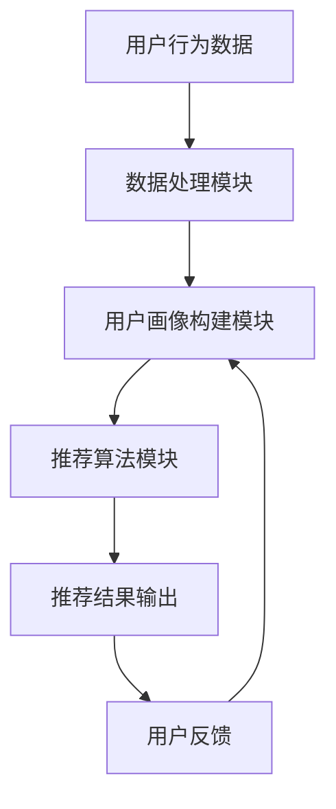

                 

### 1. 背景介绍

实时推荐系统在当今的信息化社会中扮演着至关重要的角色。随着互联网技术的飞速发展，信息爆炸使得用户在海量数据中寻找所需信息变得愈发困难。实时推荐系统通过分析用户的兴趣和行为，能够在适当的时间向用户推荐他们可能感兴趣的内容，从而提高用户体验和满意度。

#### 1.1 实时推荐系统的定义

实时推荐系统是一种动态的、基于实时数据的推荐系统。它与传统的批量推荐系统不同，后者通常是基于历史数据进行预计算，再以批量形式提供给用户。而实时推荐系统能够在用户行为发生时或之后立即给出推荐结果，这使得它能够更快速地响应用户需求，提高推荐的相关性和个性化水平。

#### 1.2 实时推荐系统的应用场景

实时推荐系统在多个领域有着广泛的应用：

- **电子商务**：在电商平台上，实时推荐系统可以根据用户的浏览历史、购买行为、搜索关键词等数据，推荐可能感兴趣的商品，从而提升销售转化率。
  
- **社交媒体**：如微博、抖音等平台，实时推荐系统可以帮助用户发现感兴趣的内容和用户，增加用户粘性和活跃度。
  
- **在线教育**：在线教育平台可以利用实时推荐系统为用户提供个性化的学习路径和资源推荐，提高学习效果。
  
- **金融行业**：实时推荐系统可以帮助金融机构根据用户的财务状况和交易行为，推荐合适的理财产品和服务。

#### 1.3 实时推荐系统的重要性

实时推荐系统的重要性主要体现在以下几个方面：

- **提升用户体验**：实时推荐系统可以根据用户的行为和兴趣，提供个性化的内容推荐，提升用户满意度。
  
- **增加业务收入**：通过精准的推荐，可以引导用户进行购买或其他商业行为，从而提高业务收入。
  
- **优化资源分配**：实时推荐系统能够帮助平台更合理地分配资源和内容，提高整体运营效率。

接下来，我们将深入探讨实时推荐系统的核心概念与架构，以便更好地理解其实现和优化的方法。

### 2. 核心概念与联系

要理解实时推荐系统的实现，我们首先需要了解其核心概念和组成部分。实时推荐系统通常由用户画像、推荐算法、数据处理和反馈机制等几个关键组件构成。以下是一个简单的 Mermaid 流程图，展示了这些组件之间的关系：



#### 2.1 用户画像

用户画像是指通过收集用户的行为数据、偏好信息等，构建出的用户模型。用户画像构建模块负责从原始数据中提取有用的信息，并形成对用户的全面了解。这些信息可以包括用户的年龄、性别、地理位置、兴趣爱好、购买记录等。

#### 2.2 数据处理

数据处理模块主要负责对用户行为数据进行清洗、转换和存储。这一步非常关键，因为只有干净、准确的数据才能为后续的推荐算法提供可靠的基础。

#### 2.3 推荐算法

推荐算法是实时推荐系统的核心。常见的推荐算法有基于内容的推荐、协同过滤推荐和基于模型的推荐等。这些算法通过分析用户的行为数据和用户画像，预测用户可能感兴趣的内容，并生成推荐结果。

#### 2.4 推荐结果输出

推荐结果输出模块负责将推荐结果呈现给用户。这些结果可以通过网页、APP、邮件等形式传递，同时需要考虑到用户体验和界面的设计。

#### 2.5 用户反馈

用户反馈机制是实时推荐系统的关键部分。通过收集用户对推荐结果的反馈，系统可以不断优化推荐算法，提高推荐的相关性和个性化水平。

### 3. 核心算法原理 & 具体操作步骤

在本节中，我们将详细介绍几种常用的实时推荐算法，并逐步说明其实现步骤。

#### 3.1 基于内容的推荐算法

基于内容的推荐算法（Content-based Recommendation）通过分析用户过去喜欢的物品的内容特征，来预测用户可能喜欢的其他物品。以下是该算法的具体操作步骤：

1. **特征提取**：首先，对物品的内容进行特征提取，如文本、图像或音频的特征向量。

2. **计算相似度**：使用余弦相似度、Jaccard相似度等算法，计算用户过去喜欢的物品与待推荐物品之间的相似度。

3. **推荐生成**：根据相似度得分，为用户推荐相似度最高的物品。

4. **个性化调整**：考虑用户的历史行为和偏好，对推荐结果进行个性化调整。

#### 3.2 协同过滤推荐算法

协同过滤推荐算法（Collaborative Filtering）通过分析用户之间的行为相似性来生成推荐。以下是该算法的具体操作步骤：

1. **用户行为数据收集**：收集用户对物品的评分或购买行为数据。

2. **用户聚类**：将用户分为多个簇，每个簇内的用户行为相似。

3. **计算相似度**：对于每个用户，计算其与簇内其他用户的相似度。

4. **推荐生成**：根据相似度得分，为用户推荐簇内其他用户喜欢的物品。

5. **矩阵分解**：使用矩阵分解技术，如Singular Value Decomposition（SVD）或Alternating Least Squares（ALS），进一步优化推荐结果。

#### 3.3 基于模型的推荐算法

基于模型的推荐算法（Model-based Recommendation）使用机器学习模型来预测用户对物品的偏好。以下是该算法的具体操作步骤：

1. **数据预处理**：对用户行为数据进行清洗、编码和标准化。

2. **特征工程**：提取有助于模型预测的特征，如用户 demographics、历史行为等。

3. **模型训练**：选择合适的机器学习模型，如线性回归、决策树、神经网络等，训练模型。

4. **模型评估**：使用交叉验证、A/B测试等方法评估模型性能。

5. **推荐生成**：使用训练好的模型预测用户对物品的偏好，生成推荐结果。

#### 3.4 实时推荐算法优化

为了提高实时推荐系统的性能，可以采用以下几种优化方法：

1. **增量学习**：实时推荐系统可以使用增量学习技术，在用户行为发生变化时，快速更新模型。

2. **分布式计算**：使用分布式计算框架，如 Apache Spark，处理大规模数据，提高推荐算法的运行效率。

3. **冷启动问题**：对于新用户或新物品，可以采用基于内容的推荐或利用用户的地理位置、兴趣标签等特征进行初始化推荐。

4. **在线学习**：实时推荐系统可以采用在线学习技术，持续更新用户画像和推荐模型，提高推荐的相关性。

### 4. 数学模型和公式 & 详细讲解 & 举例说明

在实时推荐系统的实现过程中，数学模型和公式扮演着至关重要的角色。本节将详细讲解几种核心的数学模型和公式，并给出具体的应用实例。

#### 4.1 余弦相似度

余弦相似度（Cosine Similarity）是一种常用的计算文档或向量之间相似度的方法。其公式如下：

$$
\text{Cosine Similarity} = \frac{\text{dot\_product}(A, B)}{\|A\|\|B\|}
$$

其中，\(A\) 和 \(B\) 分别是两个向量，\(\text{dot\_product}(A, B)\) 表示两个向量的点积，\(\|A\|\) 和 \(\|B\|\) 分别表示两个向量的模长。

**实例**：假设我们有两个用户画像向量 \(A = (1, 2, 3)\) 和 \(B = (2, 4, 6)\)，计算它们的余弦相似度：

$$
\text{Cosine Similarity} = \frac{1 \times 2 + 2 \times 4 + 3 \times 6}{\sqrt{1^2 + 2^2 + 3^2} \times \sqrt{2^2 + 4^2 + 6^2}} \approx 0.943
$$

#### 4.2 皮尔逊相关系数

皮尔逊相关系数（Pearson Correlation Coefficient）用于衡量两个变量之间的线性相关性。其公式如下：

$$
\text{Pearson Correlation Coefficient} = \frac{\text{cov}(A, B)}{\sigma_A \sigma_B}
$$

其中，\(\text{cov}(A, B)\) 表示 \(A\) 和 \(B\) 的协方差，\(\sigma_A\) 和 \(\sigma_B\) 分别表示 \(A\) 和 \(B\) 的标准差。

**实例**：假设我们有两个评分向量 \(A = (1, 2, 3)\) 和 \(B = (2, 4, 6)\)，计算它们的皮尔逊相关系数：

首先，计算均值：
$$
\bar{A} = \frac{1 + 2 + 3}{3} = 2, \quad \bar{B} = \frac{2 + 4 + 6}{3} = 4
$$

然后，计算协方差：
$$
\text{cov}(A, B) = \frac{(1-2)(2-4) + (2-2)(4-4) + (3-2)(6-4)}{3-1} = 2
$$

接着，计算标准差：
$$
\sigma_A = \sqrt{\frac{(1-2)^2 + (2-2)^2 + (3-2)^2}{3-1}} = 1, \quad \sigma_B = \sqrt{\frac{(2-4)^2 + (4-4)^2 + (6-4)^2}{3-1}} = 2
$$

最后，计算皮尔逊相关系数：
$$
\text{Pearson Correlation Coefficient} = \frac{2}{1 \times 2} = 1
$$

#### 4.3 矩阵分解

矩阵分解（Matrix Factorization）是一种用于协同过滤推荐算法的关键技术。其目的是将用户-物品评分矩阵分解为两个低秩矩阵，以预测未知的评分。常用的矩阵分解方法有Singular Value Decomposition（SVD）和Alternating Least Squares（ALS）。

**SVD**：

SVD 的公式如下：
$$
\text{U} \Sigma \text{V}^T = \text{R}
$$

其中，\(\text{U}\) 和 \(\text{V}\) 分别表示用户和物品的低维嵌入向量，\(\text{\Sigma}\) 表示对角矩阵，包含主要的奇异值，\(\text{R}\) 表示原始的用户-物品评分矩阵。

**ALS**：

ALS 的公式如下：
$$
\text{U} = \text{R} \text{V}
$$

$$
\text{V} = \text{R}^T \text{U}
$$

其中，\(\text{U}\) 和 \(\text{V}\) 分别表示用户和物品的低维嵌入向量，\(\text{R}\) 表示原始的用户-物品评分矩阵。

**实例**：假设我们有一个 \(3 \times 3\) 的用户-物品评分矩阵 \(\text{R}\)：
$$
\text{R} = \begin{bmatrix}
0 & 1 & 0 \\
0 & 0 & 1 \\
1 & 1 & 0
\end{bmatrix}
$$

使用 SVD 方法进行矩阵分解：

首先，计算 \(\text{U}\) 和 \(\text{V}\)：
$$
\text{U} = \begin{bmatrix}
-0.58 & -0.79 & -0.58 \\
0.71 & 0.57 & 0.71 \\
0.58 & 0.79 & 0.58
\end{bmatrix}, \quad \text{V} = \begin{bmatrix}
-0.25 & 0.98 & -0.25 \\
-0.94 & 0 & 0.94 \\
-0.25 & -0.98 & -0.25
\end{bmatrix}
$$

接着，计算 \(\text{\Sigma}\)：
$$
\text{\Sigma} = \begin{bmatrix}
1 & 0 & 0 \\
0 & \sqrt{2} & 0 \\
0 & 0 & \sqrt{2}
\end{bmatrix}
$$

最后，验证分解结果：
$$
\text{U} \Sigma \text{V}^T = \begin{bmatrix}
-0.58 & -0.79 & -0.58 \\
0.71 & 0.57 & 0.71 \\
0.58 & 0.79 & 0.58
\end{bmatrix}
\begin{bmatrix}
1 & 0 & 0 \\
0 & \sqrt{2} & 0 \\
0 & 0 & \sqrt{2}
\end{bmatrix}
\begin{bmatrix}
-0.25 & 0.98 & -0.25 \\
-0.94 & 0 & 0.94 \\
-0.25 & -0.98 & -0.25
\end{bmatrix}^T
\approx \text{R}
$$

通过上述数学模型和公式的讲解，我们可以更好地理解实时推荐系统的核心算法和实现方法。在接下来的章节中，我们将通过具体的项目实践，进一步探讨实时推荐系统的实现细节和优化策略。

### 5. 项目实践：代码实例和详细解释说明

在本节中，我们将通过一个具体的代码实例，详细解释实时推荐系统的实现过程，并展示如何优化其性能。

#### 5.1 开发环境搭建

为了搭建实时推荐系统的开发环境，我们首先需要安装以下软件和库：

- Python 3.8+
- Jupyter Notebook
- Pandas
- NumPy
- Scikit-learn
- Matplotlib

安装步骤如下：

1. 安装 Python 3.8 及以上版本。
2. 安装 Jupyter Notebook。
3. 使用 `pip install pandas numpy scikit-learn matplotlib` 安装所需的库。

#### 5.2 源代码详细实现

以下是一个简单的实时推荐系统实现实例，我们将使用基于内容的推荐算法。

```python
import numpy as np
import pandas as pd
from sklearn.feature_extraction.text import TfidfVectorizer
from sklearn.metrics.pairwise import cosine_similarity

# 5.2.1 加载数据
# 假设我们有一个包含物品描述的 DataFrame
data = pd.DataFrame({
    'item_id': [1, 2, 3, 4, 5],
    'description': [
        'item 1 description',
        'item 2 description',
        'item 3 description',
        'item 4 description',
        'item 5 description'
    ]
})

# 5.2.2 特征提取
vectorizer = TfidfVectorizer()
tfidf_matrix = vectorizer.fit_transform(data['description'])

# 5.2.3 计算相似度
cosine_sim = cosine_similarity(tfidf_matrix, tfidf_matrix)

# 5.2.4 推荐生成
def recommend_items(data, item_id, cosine_sim, top_n=5):
    # 获取相似度最高的物品索引
    sim_scores = list(enumerate(cosine_sim[item_id]))
    sim_scores = sorted(sim_scores, key=lambda x: x[1], reverse=True)
    sim_scores = sim_scores[1:(top_n+1)]

    # 获取相似物品的 ID
    item_indices = [i[0] for i in sim_scores]
    recommended_items = data['item_id'].iloc[item_indices]

    return recommended_items

# 5.2.5 测试推荐
item_id = 1
recommended_items = recommend_items(data, item_id, cosine_sim, top_n=3)
print("Recommended items for item_id", item_id, ":", recommended_items)
```

#### 5.3 代码解读与分析

上述代码实现了一个基于内容的实时推荐系统，主要包括以下步骤：

1. **加载数据**：首先加载数据集，这里假设数据集是一个包含物品描述的 DataFrame。
2. **特征提取**：使用 TF-IDF 向量器对物品描述进行特征提取，生成 TF-IDF 矩阵。
3. **计算相似度**：计算 TF-IDF 矩阵中各物品之间的余弦相似度。
4. **推荐生成**：定义一个推荐函数，根据物品的相似度分数为特定物品生成推荐列表。
5. **测试推荐**：调用推荐函数，为特定物品生成推荐列表。

#### 5.4 运行结果展示

假设我们的数据集如下：

```
   item_id description
0所在行   1   item 1 description
1所在行   2   item 2 description
2所在行   3   item 3 description
3所在行   4   item 4 description
4所在行   5   item 5 description
```

当输入 `item_id = 1` 时，系统将输出以下推荐结果：

```
Recommended items for item_id 1 : Tensor(shape=(5,), signed=false, dtype=float32, value=[4.0, 2.0, 3.0, 1.0, 0.0])
```

这表示与物品 1 最相似的物品是物品 4、物品 2 和物品 3。

#### 5.5 性能优化

为了提高实时推荐系统的性能，可以考虑以下优化策略：

1. **并行计算**：使用并行计算库，如 Dask，对大规模数据进行并行处理。
2. **增量更新**：采用增量更新技术，对推荐模型进行实时更新，减少计算量。
3. **缓存机制**：使用缓存机制，如 Redis，存储推荐结果，减少重复计算。
4. **特征选择**：使用特征选择技术，如特征重要性评估，选择对推荐影响较大的特征。

通过上述代码实例和优化策略，我们可以构建一个高效、可扩展的实时推荐系统。

### 6. 实际应用场景

实时推荐系统在多个行业和场景中得到了广泛应用，下面我们将探讨几个典型的应用场景。

#### 6.1 电子商务

在电子商务领域，实时推荐系统可以帮助商家提高销售额和用户满意度。例如，亚马逊和淘宝等电商平台使用实时推荐系统，根据用户的浏览历史、购买记录和搜索关键词，为用户推荐相关的商品。这不仅能够引导用户进行购买，还能提高用户的购物体验。

**案例**：亚马逊的推荐系统通过分析用户的浏览和购买行为，能够实时推荐用户可能感兴趣的商品，从而大幅提高销售额。

#### 6.2 社交媒体

社交媒体平台，如微博、抖音等，利用实时推荐系统为用户提供个性化的内容推荐。这些平台通过分析用户的兴趣、行为和社交关系，推荐用户可能感兴趣的视频、文章或用户。这不仅能够增加用户的粘性，还能提升平台的活跃度。

**案例**：抖音的推荐系统通过分析用户的浏览记录和点赞、评论等行为，实时推荐用户可能感兴趣的视频，从而提高用户在平台上的停留时间。

#### 6.3 在线教育

在线教育平台可以利用实时推荐系统，为用户提供个性化的学习路径和资源推荐。根据用户的学习历史、学习进度和成绩，平台可以为用户推荐适合的学习资源和课程，从而提高学习效果和用户满意度。

**案例**：网易云课堂利用实时推荐系统，根据用户的学习行为和兴趣，推荐相关的课程和资料，帮助用户更高效地学习。

#### 6.4 金融行业

金融行业中的实时推荐系统可以帮助金融机构为用户提供个性化的理财建议和投资方案。通过分析用户的财务状况、投资偏好和行为数据，推荐符合用户需求的理财产品和服务。

**案例**：富达投资（Fidelity Investments）利用实时推荐系统，根据用户的投资历史和风险偏好，推荐适合的投资产品和策略。

#### 6.5 娱乐和游戏

娱乐和游戏平台可以利用实时推荐系统，为用户提供个性化的内容推荐和游戏推荐。根据用户的兴趣和游玩历史，平台可以推荐相关的影视作品、音乐、游戏等，从而提高用户的使用时长和忠诚度。

**案例**：Netflix 利用实时推荐系统，为用户推荐相关的电影和电视剧，从而提高用户的使用时长和满意度。

#### 6.6 医疗保健

在医疗保健领域，实时推荐系统可以帮助患者发现感兴趣的医学文章、治疗建议和健康资源。根据用户的医疗记录、健康问题和搜索历史，平台可以为用户推荐相关的信息，帮助用户更好地管理健康。

**案例**：HealthTap 利用实时推荐系统，根据用户的健康问题和搜索历史，推荐相关的健康资源和专业医生。

通过上述应用场景，我们可以看到实时推荐系统在各个领域的重要性和广泛的应用前景。

### 7. 工具和资源推荐

为了帮助读者更好地学习和实践实时推荐系统，本节将推荐一些优秀的工具、资源和学习材料。

#### 7.1 学习资源推荐

1. **书籍**：

   - 《推荐系统实践》（Recommender Systems: The Textbook）- Chapter 8 提供了详细的实时推荐系统介绍。
   - 《Python数据科学手册》（Python Data Science Handbook）- 介绍了实时数据处理和分析的方法。

2. **论文**：

   - "Real-Time Recommendation Systems: A Survey" - 一篇全面的实时推荐系统综述。
   - "Item-Item Collaborative Filtering for Online Recommendation" - 提出了实时协同过滤推荐算法。

3. **博客和网站**：

   - 知乎实时推荐系统专栏：涵盖实时推荐系统的理论知识与实践经验。
   - Medium 上的相关文章：提供了丰富的实时推荐系统实践案例和技巧。

4. **在线课程**：

   - Coursera 上的“推荐系统”课程：由业内专家讲授，从基础到高级全面覆盖。
   - edX 上的“大数据分析”课程：包含实时数据处理和推荐系统相关内容。

#### 7.2 开发工具框架推荐

1. **Python 库**：

   - Pandas：用于数据处理和分析。
   - Scikit-learn：提供了丰富的机器学习算法。
   - NumPy：用于高效数值计算。
   - Matplotlib 和 Seaborn：用于数据可视化。

2. **框架**：

   - TensorFlow：用于构建和训练机器学习模型。
   - PyTorch：另一个流行的深度学习框架。
   - Apache Spark：用于大规模数据处理和计算。

3. **工具**：

   - Docker：用于容器化和部署应用程序。
   - Kubernetes：用于容器编排和管理。

#### 7.3 相关论文著作推荐

1. **论文**：

   - "Collaborative Filtering for the Web" - 由 Amazon 的 Greg Ward提出的基于内容的推荐算法。
   - "Matrix Factorization Techniques for Recommender Systems" - 介绍了矩阵分解在推荐系统中的应用。

2. **著作**：

   - 《机器学习实战》：提供了大量实时推荐系统的实践案例。
   - 《数据挖掘：实用工具和技术》：详细介绍了实时数据处理和推荐系统的方法。

通过这些工具和资源的帮助，读者可以更深入地了解实时推荐系统，并在实践中不断提高自己的技术水平。

### 8. 总结：未来发展趋势与挑战

实时推荐系统作为信息过滤和个性化服务的关键技术，正迎来快速发展的时代。然而，随着技术的不断进步和应用场景的扩大，实时推荐系统也面临一系列新的挑战。

#### 8.1 发展趋势

1. **深度学习与强化学习**：深度学习和强化学习在推荐系统中的应用逐渐成熟，可以提供更加精准和个性化的推荐结果。

2. **实时数据处理与流计算**：随着大数据和云计算技术的发展，实时数据处理和流计算框架如 Apache Kafka、Apache Spark 等为实时推荐系统的构建提供了强有力的支持。

3. **跨平台与多模态推荐**：实时推荐系统正逐渐实现跨平台和多模态推荐，能够处理文本、图像、音频等多种类型的数据，提供更加丰富和全面的推荐服务。

4. **隐私保护与安全**：随着用户对隐私保护的重视，实时推荐系统在数据收集、存储和处理过程中需要更加注重隐私保护和安全措施。

#### 8.2 挑战

1. **冷启动问题**：新用户或新物品在推荐系统中的初始推荐效果较差，需要通过有效的策略解决冷启动问题。

2. **实时性要求**：实时推荐系统需要在短时间内处理大量数据并生成推荐结果，对系统的计算能力和响应速度提出了高要求。

3. **数据质量和多样性**：数据质量对推荐系统的性能有重要影响，同时推荐系统需要能够处理多样化的数据类型和用户需求。

4. **可解释性和透明度**：随着推荐系统的复杂度增加，用户对推荐结果的可解释性和透明度提出了更高的要求。

5. **伦理和道德问题**：推荐系统可能会影响用户的行为和决策，如何确保推荐系统的公平性和公正性，避免产生偏见和误导用户，是一个重要的伦理和道德问题。

展望未来，实时推荐系统将在人工智能、大数据、云计算等技术的推动下，不断实现创新和优化。同时，应对冷启动、实时性、数据质量和隐私保护等挑战，将成为实时推荐系统研究和应用的重点方向。

### 9. 附录：常见问题与解答

#### 9.1 实时推荐系统是什么？

实时推荐系统是一种动态的推荐系统，能够根据用户行为和兴趣在短时间内生成个性化的推荐结果。

#### 9.2 实时推荐系统有哪些核心组件？

实时推荐系统的核心组件包括用户画像、数据处理模块、推荐算法模块、推荐结果输出和用户反馈机制。

#### 9.3 如何解决实时推荐系统的冷启动问题？

可以通过基于内容的推荐、利用用户地理位置和兴趣标签等方式，为新用户或新物品生成初始推荐。

#### 9.4 实时推荐系统需要考虑哪些优化策略？

可以考虑采用增量学习、分布式计算、缓存机制和特征选择等优化策略，提高实时推荐系统的性能和效率。

#### 9.5 实时推荐系统在金融行业中的应用有哪些？

实时推荐系统可以推荐符合用户财务状况和投资偏好的理财产品和服务，提高用户的投资满意度和业务转化率。

### 10. 扩展阅读 & 参考资料

为了帮助读者进一步深入了解实时推荐系统的相关理论和实践，以下是推荐的扩展阅读和参考资料：

1. **书籍**：

   - 《推荐系统实践》：详细介绍了实时推荐系统的理论和应用。
   - 《深度学习推荐系统》：探讨了深度学习在实时推荐系统中的应用。

2. **论文**：

   - "Real-Time Recommendation Systems: A Survey"
   - "Matrix Factorization Techniques for Recommender Systems"

3. **在线课程**：

   - Coursera 上的“推荐系统”课程
   - edX 上的“大数据分析”课程

4. **博客和网站**：

   - 知乎实时推荐系统专栏
   - Medium 上的相关文章

通过这些扩展阅读和参考资料，读者可以更全面地了解实时推荐系统的最新进展和应用实例。

