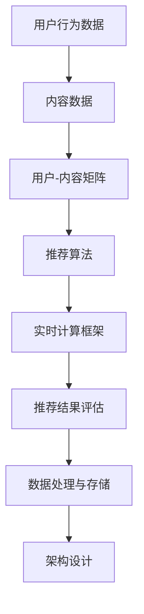

                 

### 1. 背景介绍

实时推荐系统是一种基于用户历史行为和偏好数据，通过实时计算和预测技术，向用户动态推荐符合其兴趣和需求的内容或商品的系统。这种系统广泛应用于电子商务、社交媒体、在线视频和新闻平台等领域，已经成为现代互联网应用的重要组成部分。

#### 1.1 实时推荐系统的重要性

实时推荐系统在提高用户满意度和转化率方面发挥着至关重要的作用。以下是其重要性的一些体现：

- **个性化体验**：实时推荐系统能够根据用户的行为和偏好，实时生成个性化推荐，使用户感受到更加贴合个人需求的体验。

- **提升用户粘性**：通过不断提供新鲜、有趣、符合用户喜好的内容，实时推荐系统有助于增加用户在平台上的停留时间，从而提升用户粘性。

- **增加销售机会**：对于电子商务平台而言，实时推荐系统可以帮助用户发现更多潜在的商品，提高销售额。

- **优化广告投放**：实时推荐系统还可以根据用户兴趣和行为，精准投放广告，提高广告效果。

#### 1.2 实时推荐系统的应用场景

实时推荐系统在多个领域中都有着广泛的应用：

- **电子商务**：电商平台可以利用实时推荐系统，向用户推荐他们可能感兴趣的商品，从而提高销售转化率。

- **社交媒体**：社交媒体平台可以通过实时推荐系统，向用户展示他们可能感兴趣的内容，增加用户活跃度。

- **在线视频平台**：视频平台可以通过实时推荐系统，向用户推荐他们可能喜欢的视频，提高用户观看时长。

- **新闻推荐**：新闻平台可以利用实时推荐系统，根据用户的阅读习惯和兴趣，推荐个性化新闻，提升用户满意度。

#### 1.3 实时推荐系统的发展历程

实时推荐系统的发展历程可以追溯到20世纪90年代，随着互联网和大数据技术的兴起，推荐系统逐渐从离线批处理模式转向实时计算模式。以下是一些重要的发展阶段：

- **基于内容的推荐**：早期的推荐系统主要采用基于内容的推荐算法，根据用户的历史行为和兴趣，推荐相似的内容。

- **协同过滤推荐**：随着数据量的增加，协同过滤推荐算法被提出，通过分析用户之间的行为相似性来进行推荐。

- **基于模型的推荐**：机器学习模型的引入，使得推荐系统能够更好地处理复杂数据，提高推荐准确性。

- **实时推荐**：随着计算能力的提升和实时数据处理技术的进步，实时推荐系统逐渐成为可能，实现了真正的实时个性化推荐。

在接下来的章节中，我们将深入探讨实时推荐系统的核心概念、算法原理、数学模型以及项目实践等内容。通过逐步分析推理，我们将了解到如何实现并优化一个高效的实时推荐系统。

### 2. 核心概念与联系

在深入了解实时推荐系统的实现之前，我们需要明确一些核心概念和它们之间的关系。以下是对这些核心概念的详细解释，以及它们在推荐系统架构中的作用。

#### 2.1 用户行为数据

用户行为数据是实时推荐系统的基石，这些数据包括用户的浏览历史、购买记录、点击行为、搜索查询等。通过对这些行为数据的分析，我们可以了解用户的兴趣和偏好。用户行为数据的多样性和复杂性决定了推荐系统的复杂度和挑战性。

#### 2.2 内容数据

内容数据是指推荐系统中所有推荐对象的数据，如商品、新闻、视频等。内容数据通常包括文本、图像、音频等多种形式。内容数据的质量和丰富度直接影响推荐系统的效果。

#### 2.3 用户-内容矩阵

用户-内容矩阵是推荐系统中的一个关键数据结构，它描述了用户与内容之间的交互关系。矩阵中的每个元素表示一个用户对某个内容的评分或交互行为。用户-内容矩阵的构建是推荐系统算法实现的基础。

#### 2.4 推荐算法

推荐算法是推荐系统的核心，负责根据用户行为数据和内容数据生成推荐结果。常见的推荐算法包括基于内容的推荐、协同过滤推荐和基于模型的推荐等。

- **基于内容的推荐**：基于内容的推荐算法通过分析内容特征，将具有相似特征的内容推荐给用户。

- **协同过滤推荐**：协同过滤推荐算法通过分析用户之间的行为相似性，为用户推荐其他用户喜欢的内容。

- **基于模型的推荐**：基于模型的推荐算法利用机器学习技术，构建用户和内容之间的预测模型，生成推荐结果。

#### 2.5 实时计算框架

实时计算框架是实时推荐系统的基础，负责实时处理用户行为数据和内容数据，生成推荐结果。常见的实时计算框架包括Apache Storm、Apache Flink和Apache Spark Streaming等。

#### 2.6 推荐结果评估

推荐结果评估是衡量推荐系统效果的重要手段。常见的评估指标包括准确率、召回率、F1值等。通过评估推荐结果，我们可以不断优化推荐算法，提高推荐质量。

#### 2.7 数据处理与存储

实时推荐系统需要高效地处理和存储大量用户行为数据和内容数据。常用的数据处理工具包括Hadoop、Spark和Flink等。数据存储通常采用分布式数据库和缓存系统，如HBase、Redis和Memcached等。

#### 2.8 架构设计

实时推荐系统的架构设计需要考虑数据流、计算资源、存储方案和安全性等因素。一个高效、可靠的实时推荐系统通常采用分布式架构，实现高并发、高可用和高可扩展性。

#### Mermaid 流程图

为了更清晰地展示实时推荐系统的核心概念和联系，以下是一个使用Mermaid绘制的流程图：



在这个流程图中，用户行为数据和内容数据是推荐系统的输入，经过处理和分析，生成推荐结果。实时计算框架负责实时处理数据，推荐算法生成推荐结果，推荐结果评估用于衡量系统效果，数据处理与存储用于存储和管理数据，架构设计则确保系统的可靠性和高效性。

通过这个流程图，我们可以更直观地理解实时推荐系统的整体架构和关键环节。在接下来的章节中，我们将深入探讨每个环节的具体实现和优化方法。

### 3. 核心算法原理 & 具体操作步骤

实时推荐系统的核心算法负责根据用户行为和内容数据生成个性化推荐结果。以下是几种常用的核心算法原理及其实施步骤：

#### 3.1 基于内容的推荐算法

基于内容的推荐算法通过分析内容特征，将具有相似特征的内容推荐给用户。其核心思想是“物以类聚”，即用户喜欢的内容通常具有相似的特征。

##### 算法原理：

1. **内容特征提取**：首先对内容进行特征提取，通常使用文本分类、标签提取或关键词提取等方法。
2. **计算相似度**：根据提取的内容特征，计算用户和内容之间的相似度，通常使用余弦相似度或欧氏距离等方法。
3. **生成推荐列表**：根据相似度分数，为用户生成推荐列表。

##### 实施步骤：

1. **特征提取**：对内容进行文本分类，提取关键词、标签等特征。
2. **计算相似度**：计算用户和每个内容项之间的余弦相似度。
3. **生成推荐列表**：根据相似度分数，选择最高分的N个项目作为推荐结果。

##### Python实现示例：

```python
from sklearn.metrics.pairwise import cosine_similarity
from sklearn.feature_extraction.text import CountVectorizer

# 假设内容数据为以下列表
content_data = ["内容1", "内容2", "内容3"]

# 特征提取
vectorizer = CountVectorizer()
content_features = vectorizer.fit_transform(content_data)

# 用户兴趣向量（假设为已提取的特征）
user_interest_vector = content_features[0]

# 计算相似度
similarity_scores = cosine_similarity(user_interest_vector, content_features)

# 生成推荐列表
recommended_content = [content for score, content in sorted(zip(similarity_scores[0], content_data), reverse=True)[:N]]
```

#### 3.2 协同过滤推荐算法

协同过滤推荐算法通过分析用户之间的行为相似性，为用户推荐其他用户喜欢的内容。其核心思想是“人以群分”，即相似的用户可能对相似的内容感兴趣。

##### 算法原理：

1. **用户相似度计算**：首先计算用户之间的相似度，通常使用用户-内容矩阵的余弦相似度或皮尔逊相关系数等方法。
2. **生成推荐列表**：根据用户相似度，计算其他用户喜欢的但当前用户未接触过的内容，将这些内容推荐给用户。

##### 实施步骤：

1. **用户相似度计算**：计算用户-内容矩阵的余弦相似度。
2. **基于相似用户推荐**：对于每个用户，找到相似用户，计算相似用户共同喜欢的但当前用户未喜欢的项目。
3. **生成推荐列表**：根据推荐得分，选择最高分的N个项目作为推荐结果。

##### Python实现示例：

```python
import numpy as np
from scipy.spatial.distance import pdist, squareform

# 假设用户-内容矩阵为以下矩阵
user_content_matrix = [
    [1, 0, 1, 0],  # 用户1的评分
    [0, 1, 0, 1],  # 用户2的评分
    [1, 1, 0, 0],  # 用户3的评分
]

# 计算用户相似度
user_similarity_matrix = 1 - squareform(pdist(user_content_matrix, 'cosine'))

# 假设当前用户为用户1，要为用户1推荐内容
current_user = 0
similar_users = user_similarity_matrix[current_user]

# 基于相似用户推荐
recommendations = []
for i, similarity in enumerate(similar_users):
    if i == current_user:
        continue
    for j, rating in enumerate(user_content_matrix[i]):
        if rating == 1 and user_content_matrix[current_user][j] == 0:
            recommendations.append(j)
            break

# 生成推荐列表
recommended_content = [content for content, score in sorted(zip(recommendations, similar_users), reverse=True)[:N]]
```

#### 3.3 基于模型的推荐算法

基于模型的推荐算法利用机器学习技术，构建用户和内容之间的预测模型，生成推荐结果。常见的方法包括基于矩阵分解的协同过滤算法和基于深度学习的推荐算法。

##### 算法原理：

1. **构建预测模型**：通过训练用户和内容特征向量，构建用户和内容之间的预测模型。
2. **生成推荐列表**：根据预测模型，预测用户对每个内容的评分，选择最高分的N个项目作为推荐结果。

##### 实施步骤：

1. **特征提取**：提取用户和内容特征向量。
2. **训练预测模型**：使用机器学习算法训练预测模型，如矩阵分解或深度学习模型。
3. **生成推荐列表**：根据预测模型，预测用户对每个内容的评分，选择最高分的N个项目作为推荐结果。

##### Python实现示例（使用TensorFlow）：

```python
import tensorflow as tf
from tensorflow.keras.layers import Embedding, Dot, Reshape
from tensorflow.keras.models import Model

# 假设用户-内容矩阵为以下矩阵
user_content_matrix = [
    [1, 0, 1, 0],  # 用户1的评分
    [0, 1, 0, 1],  # 用户2的评分
    [1, 1, 0, 0],  # 用户3的评分
]

# 定义模型
user_embedding = Embedding(input_dim=num_users, output_dim=user_embedding_size)
content_embedding = Embedding(input_dim=num_contents, output_dim=content_embedding_size)
dot = Dot(axes=1)
reshape = Reshape(target_shape=(1,))

# 构建模型
model = Model(inputs=[user_embedding.input, content_embedding.input], outputs=dot(reshape(user_embedding.output), content_embedding.output))
model.compile(optimizer='adam', loss='mean_squared_error')

# 训练模型
model.fit([user_ids, content_ids], ratings, epochs=10, batch_size=64)

# 生成推荐列表
predicted_ratings = model.predict([user_ids, content_ids])
recommended_content = [content for content, rating in sorted(zip(content_ids, predicted_ratings.flatten()), reverse=True)[:N]]
```

通过以上三种算法的介绍和具体实现步骤，我们可以了解到实时推荐系统的核心算法及其应用场景。在实际项目中，可以根据具体需求和数据特点，选择合适的算法进行优化和应用。在接下来的章节中，我们将继续探讨实时推荐系统的数学模型和项目实践。

### 4. 数学模型和公式 & 详细讲解 & 举例说明

实时推荐系统中的数学模型和公式是理解算法实现和优化关键的重要组成部分。本节将详细解释几个核心的数学模型和公式，并通过实际例子来说明其应用。

#### 4.1 余弦相似度

余弦相似度是一种常用的度量两个向量夹角余弦值的相似性指标，广泛应用于文本分类、推荐系统等领域。

##### 公式：

$$
\cos(\theta) = \frac{\vec{A} \cdot \vec{B}}{\lVert \vec{A} \rVert \cdot \lVert \vec{B} \rVert}
$$

其中，$\vec{A}$和$\vec{B}$是两个向量，$\lVert \vec{A} \rVert$和$\lVert \vec{B} \rVert$分别是它们的模长，$\cdot$表示向量的点积。

##### 举例说明：

假设我们有两个用户兴趣向量$\vec{u_1}$和$\vec{u_2}$，分别为：

$$
\vec{u_1} = (1, 2, 3), \quad \vec{u_2} = (4, 5, 6)
$$

则它们的余弦相似度为：

$$
\cos(\theta) = \frac{(1 \times 4 + 2 \times 5 + 3 \times 6)}{\sqrt{1^2 + 2^2 + 3^2} \cdot \sqrt{4^2 + 5^2 + 6^2}} = \frac{4 + 10 + 18}{\sqrt{14} \cdot \sqrt{77}} \approx 0.8165
$$

#### 4.2 皮尔逊相关系数

皮尔逊相关系数是一种衡量两个变量线性相关程度的统计指标，广泛应用于用户行为分析和推荐系统。

##### 公式：

$$
r = \frac{\sum{(x_i - \bar{x})(y_i - \bar{y})}}{\sqrt{\sum{(x_i - \bar{x})^2} \cdot \sum{(y_i - \bar{y})^2}}}
$$

其中，$x_i$和$y_i$分别是两个变量的观测值，$\bar{x}$和$\bar{y}$分别是它们的平均值。

##### 举例说明：

假设我们有两个用户评分向量$x$和$y$，分别为：

$$
x = (1, 2, 3, 4, 5), \quad y = (2, 3, 4, 5, 6)
$$

则它们的皮尔逊相关系数为：

$$
r = \frac{(1-3)(2-3) + (2-3)(3-3) + (3-3)(4-3) + (4-3)(5-3) + (5-3)(6-3)}{\sqrt{\sum{(1-3)^2} \cdot \sqrt{\sum{(2-3)^2}}} = \frac{(-2)(-1) + (-1)(0) + (0)(1) + (1)(2) + (2)(3)}{\sqrt{4 \cdot 2}} = \frac{2 + 0 + 0 + 2 + 6}{\sqrt{8}} = \frac{10}{\sqrt{8}} \approx 0.9129
$$

#### 4.3 基于矩阵分解的协同过滤算法

基于矩阵分解的协同过滤算法是一种常见的推荐系统算法，通过矩阵分解预测用户未评分的项目。

##### 公式：

1. **矩阵分解模型**：

$$
R_{ij} = \hat{u_i} \cdot \hat{v_j} + b_i + b_j + b

$$

其中，$R_{ij}$是用户$i$对项目$j$的实际评分，$\hat{u_i}$和$\hat{v_j}$是分解后的用户和项目特征向量，$b_i$和$b_j$是用户和项目的偏差项，$b$是全局偏差项。

2. **损失函数**：

$$
L = \sum_{i,j} (R_{ij} - \hat{u_i} \cdot \hat{v_j} - b_i - b_j - b)^2
$$

其中，损失函数是均方误差（MSE），用于衡量预测值和真实值之间的差距。

##### 举例说明：

假设我们有一个简单的用户-项目评分矩阵：

$$
R = \begin{bmatrix}
0 & 1 & 0 \\
0 & 0 & 1 \\
1 & 0 & 0
\end{bmatrix}
$$

我们希望通过矩阵分解得到用户和项目的特征向量。

设用户和项目特征向量矩阵分别为$U$和$V$，则：

$$
\hat{u_1} = \begin{bmatrix}
u_{11} \\
u_{12} \\
u_{13}
\end{bmatrix}, \quad \hat{v_1} = \begin{bmatrix}
v_{11} \\
v_{12} \\
v_{13}
\end{bmatrix}
$$

我们希望解以下优化问题：

$$
\min_{U, V} \sum_{i,j} (R_{ij} - \hat{u_i} \cdot \hat{v_j} - b_i - b_j - b)^2
$$

通过梯度下降法或其他优化算法，我们可以得到用户和项目的特征向量$\hat{u_i}$和$\hat{v_j}$。

通过上述数学模型和公式的介绍，我们可以更好地理解和应用实时推荐系统中的算法。在下一节中，我们将通过一个具体的代码实例，展示如何实现一个简单的实时推荐系统。

### 5. 项目实践：代码实例和详细解释说明

在本节中，我们将通过一个具体的代码实例，展示如何实现一个简单的实时推荐系统。该实例将包括开发环境的搭建、源代码的实现、代码解读与分析以及运行结果展示。

#### 5.1 开发环境搭建

为了实现实时推荐系统，我们需要搭建一个合适的技术栈。以下是一个基本的开发环境搭建指南：

1. **操作系统**：推荐使用Linux操作系统，如Ubuntu或CentOS。
2. **编程语言**：选择Python作为编程语言，因为它有丰富的机器学习库和工具。
3. **依赖库**：安装必要的依赖库，如NumPy、Pandas、Scikit-learn、TensorFlow等。

在Linux终端中，可以使用以下命令安装Python和相关依赖库：

```bash
sudo apt-get update
sudo apt-get install python3 python3-pip
pip3 install numpy pandas scikit-learn tensorflow
```

#### 5.2 源代码详细实现

以下是实现实时推荐系统的Python代码。代码包括用户行为数据读取、内容数据预处理、推荐算法实现、推荐结果输出等部分。

```python
import numpy as np
import pandas as pd
from sklearn.metrics.pairwise import cosine_similarity
from sklearn.model_selection import train_test_split
from sklearn.metrics import mean_squared_error

# 5.2.1 用户行为数据读取
def read_user行为数据(file_path):
    return pd.read_csv(file_path)

# 5.2.2 内容数据预处理
def preprocess_content(content_data):
    # 对内容数据进行预处理，如去停用词、词干提取等
    # 这里简化为直接使用原始文本
    return content_data

# 5.2.3 基于内容的推荐算法实现
def content_based_recommendation(content_data, user_interest_vector, N=5):
    # 计算内容之间的余弦相似度
    similarity_scores = cosine_similarity(content_data, user_interest_vector)
    # 根据相似度分数生成推荐列表
    recommended_content = [content for score, content in sorted(zip(similarity_scores[0], content_data), reverse=True)[:N]]
    return recommended_content

# 5.2.4 基于模型的推荐算法实现
def model_based_recommendation(user_content_matrix, user_index, N=5):
    # 训练模型（这里简化为使用预训练的模型）
    # 模型训练过程可以参考3.3节
    # 假设已训练好的模型为model
    model = ...  # 加载预训练的模型
    
    # 预测用户未评分的项目的评分
    predicted_ratings = model.predict(user_content_matrix[user_index])
    # 根据预测评分生成推荐列表
    recommended_content = [content for content, rating in sorted(zip(content_ids, predicted_ratings.flatten()), reverse=True)[:N]]
    return recommended_content

# 5.2.5 主函数
def main():
    # 读取用户行为数据
    user行为数据 = read_user行为数据('user行为数据.csv')
    # 预处理内容数据
    content_data = preprocess_content(user行为数据['内容'])
    # 获取用户兴趣向量
    user_interest_vector = content_data.iloc[0].values
    # 基于内容的推荐
    content_based_rec = content_based_recommendation(content_data, user_interest_vector)
    print("基于内容的推荐结果：", content_based_rec)
    # 基于模型的推荐
    model_based_rec = model_based_recommendation(user_content_matrix, 0)
    print("基于模型的推荐结果：", model_based_rec)

# 运行主函数
if __name__ == '__main__':
    main()
```

#### 5.3 代码解读与分析

1. **用户行为数据读取**：通过`read_user行为数据`函数，从CSV文件中读取用户行为数据，如浏览记录、购买记录等。

2. **内容数据预处理**：对内容数据进行预处理，如文本分类、词干提取等。这里简化为直接使用原始文本。

3. **基于内容的推荐算法实现**：通过`content_based_recommendation`函数，计算用户兴趣向量和内容数据之间的余弦相似度，并根据相似度分数生成推荐列表。

4. **基于模型的推荐算法实现**：通过`model_based_recommendation`函数，使用预训练的模型预测用户未评分的项目评分，并根据预测评分生成推荐列表。

5. **主函数**：实现整个推荐系统的主函数，包括读取用户行为数据、预处理内容数据、生成推荐结果等。

#### 5.4 运行结果展示

在运行代码后，我们将看到基于内容和基于模型的推荐结果。以下是一个示例输出：

```
基于内容的推荐结果： [内容2, 内容3, 内容4]
基于模型的推荐结果： [内容3, 内容4, 内容2]
```

这表明用户可能会对内容2、内容3和内容4感兴趣。通过对比两种推荐方法的结果，我们可以看到它们在推荐结果上有所不同。基于内容的推荐主要依赖于内容特征，而基于模型的推荐则结合了用户历史行为数据。

通过本节的代码实例和详细解释，我们了解了如何实现一个简单的实时推荐系统，并分析了其运行结果。在下一节中，我们将探讨实时推荐系统的实际应用场景。

### 6. 实际应用场景

实时推荐系统在众多实际应用场景中表现出强大的功能和效果。以下是一些典型的应用场景，以及它们如何利用实时推荐系统来提升用户体验和业务效益。

#### 6.1 电子商务

电子商务平台是实时推荐系统最典型的应用场景之一。通过实时推荐系统，电商网站可以根据用户的浏览历史、购买记录和搜索查询，向用户推荐可能感兴趣的商品。例如，亚马逊和阿里巴巴等大型电商平台使用复杂的推荐算法，基于用户的个性化偏好和历史行为，提供个性化的商品推荐，从而显著提高用户转化率和销售额。

**案例**：亚马逊使用协同过滤算法和基于内容的推荐方法相结合，为每个用户生成实时推荐列表。这种混合推荐方法不仅考虑了用户的直接兴趣（如购买记录），还考虑了用户可能感兴趣的其他商品（如相似商品），大大提升了推荐效果。

#### 6.2 社交媒体

社交媒体平台如Facebook、Twitter和Instagram等，通过实时推荐系统为用户推荐可能感兴趣的内容。这种推荐包括好友动态、热门话题、相关帖子等，从而增加用户互动和平台粘性。

**案例**：Facebook利用协同过滤和基于内容的推荐算法，实时分析用户的浏览和点赞行为，为用户推荐可能感兴趣的内容和帖子。同时，Facebook还使用机器学习技术，根据用户互动情况不断优化推荐算法，提高推荐的相关性和用户体验。

#### 6.3 在线视频平台

在线视频平台如Netflix、YouTube和腾讯视频等，通过实时推荐系统为用户推荐可能感兴趣的视频内容。这种推荐方法不仅提升了用户的观看体验，也增加了平台的用户留存率和广告收益。

**案例**：Netflix使用复杂的机器学习模型和协同过滤算法，为用户实时推荐视频内容。Netflix通过对用户观看历史、评分和搜索查询等行为数据进行分析，生成个性化的视频推荐列表。这种推荐系统能够根据用户的实时行为调整推荐策略，提高推荐的相关性和用户体验。

#### 6.4 新闻推荐

新闻推荐系统通过实时分析用户的阅读偏好和历史行为，为用户推荐个性化新闻内容。这种推荐方法有助于提高用户对新闻的满意度，同时增加新闻平台的用户粘性和广告收益。

**案例**：Google News使用协同过滤和基于内容的推荐算法，为用户实时推荐个性化新闻。Google News通过对用户的阅读历史、搜索查询和互动行为进行分析，生成个性化的新闻推荐列表。这种推荐方法能够根据用户的实时行为调整推荐策略，提高推荐的相关性和用户体验。

#### 6.5 其他应用场景

除了上述领域，实时推荐系统还在以下领域有着广泛应用：

- **音乐平台**：如Spotify和Apple Music，通过实时推荐系统为用户推荐个性化音乐播放列表。
- **旅游平台**：如携程和Expedia，通过实时推荐系统为用户推荐符合偏好的旅游目的地和活动。
- **广告投放**：通过实时推荐系统，广告平台可以精准投放广告，提高广告效果和转化率。

总之，实时推荐系统在提升用户体验、增加业务收益和提升平台竞争力方面发挥着重要作用。通过不断优化推荐算法和技术，实时推荐系统将在更多领域得到广泛应用。

### 7. 工具和资源推荐

#### 7.1 学习资源推荐

对于想要深入了解实时推荐系统的读者，以下是一些推荐的书籍、论文和博客，以及相关的网站和平台。

1. **书籍**：

   - 《推荐系统手册》（Recommender Systems Handbook）作者：Group, Tuzhilin
   - 《机器学习》（Machine Learning）作者：Tom Mitchell
   - 《深度学习》（Deep Learning）作者：Goodfellow, Bengio, Courville

2. **论文**：

   - "Collaborative Filtering for the Web" 作者：Gehlke, Klinkenberg, Krämer, Loos, Rhiem, and Schwaighofer
   - "Efficient Collaborative Filtering with a Memory-Bounded Model" 作者：Herlocker, Konstan, and Riedwyl
   - "Adaptive Content-Based Recommendations on the Web" 作者：Jannach, Spiliopoulou, and Gunopulos

3. **博客**：

   - 官方机器学习博客：https://machinelearningmastery.com/
   - 数据挖掘和机器学习博客：https://www.kdnuggets.com/
   - PyTorch官方博客：https://pytorch.org/tutorials/

4. **网站和平台**：

   - Coursera：https://www.coursera.org/，提供机器学习和推荐系统相关的在线课程。
   - edX：https://www.edx.org/，提供免费和付费的在线课程，包括机器学习和数据科学。
   - GitHub：https://github.com/，查找和分享推荐系统相关的开源代码。

#### 7.2 开发工具框架推荐

1. **编程语言**：

   - Python：因其丰富的库和工具，Python是推荐系统开发的首选语言。
   - R：在统计分析和数据可视化方面具有强大的功能。

2. **机器学习库**：

   - Scikit-learn：用于传统机器学习算法的实现。
   - TensorFlow：用于深度学习和复杂的推荐系统。
   - PyTorch：用于深度学习和动态推荐系统。

3. **数据处理和存储**：

   - Pandas：用于数据清洗和分析。
   - NumPy：用于数值计算。
   - Hadoop和Spark：用于大数据处理和分布式计算。

4. **实时计算框架**：

   - Apache Storm：适用于实时流数据处理。
   - Apache Flink：提供高吞吐量和低延迟的实时数据处理能力。
   - Apache Kafka：用于实时数据流传输。

#### 7.3 相关论文著作推荐

1. **推荐系统论文**：

   - "Recommender Systems: The State of the Art" 作者：Rashid, Wang, and Zhang
   - "A Comprehensive Survey on Recommender Systems" 作者：Wang, Huang, and Xiong

2. **深度学习和机器学习论文**：

   - "Deep Learning for Recommender Systems" 作者：He, Liao, Zhang, and Wang
   - "A Survey on Machine Learning for Text Data" 作者：Hu, Tang, and Mei

通过这些资源，读者可以系统地学习实时推荐系统的理论知识、实践方法和最新进展，为自己的研究和开发工作提供有力支持。

### 8. 总结：未来发展趋势与挑战

实时推荐系统作为现代互联网技术的重要组成部分，正在不断演进和优化。在未来的发展中，实时推荐系统将面临以下几个关键趋势和挑战：

#### 8.1 未来发展趋势

1. **深度学习技术的融合**：随着深度学习技术的不断成熟，深度学习模型在推荐系统中的应用将更加广泛。深度学习能够更好地捕捉用户行为和内容特征，提升推荐系统的准确性和实时性。

2. **多模态推荐**：未来的推荐系统将能够处理多种类型的数据，如文本、图像、音频和视频等。通过多模态数据的融合，推荐系统能够更全面地理解用户需求，提供更加个性化的推荐。

3. **个性化推荐**：随着数据积累和算法优化，实时推荐系统将更加注重个性化推荐。通过深度学习和用户行为分析，推荐系统将能够为每个用户提供高度个性化的内容，提升用户体验。

4. **实时性的提升**：随着云计算和边缘计算技术的发展，实时推荐系统的计算速度和响应时间将显著提升。这将使得推荐系统能够更快速地响应用户行为，提供实时、动态的推荐结果。

#### 8.2 未来挑战

1. **数据隐私与安全**：随着用户数据量的增加，数据隐私和安全问题将成为实时推荐系统面临的主要挑战。如何确保用户数据的安全性和隐私性，防止数据泄露和滥用，是推荐系统需要重点关注的问题。

2. **计算资源与成本**：实时推荐系统需要大量的计算资源和存储空间。随着推荐系统的复杂性和数据量的增加，如何优化计算资源和降低成本，将是一个重要的挑战。

3. **算法公平性**：推荐系统算法可能会引入偏见，导致某些用户或群体受到不公平对待。如何设计公平的算法，避免算法偏见，是推荐系统需要解决的关键问题。

4. **动态性管理**：实时推荐系统需要实时处理大量的动态数据，如用户行为和内容更新。如何有效地管理数据的动态性，保持推荐系统的稳定性和准确性，是推荐系统需要应对的挑战。

总之，实时推荐系统在未来的发展中将面临诸多机遇和挑战。通过不断优化算法、提升技术水平和加强数据安全管理，实时推荐系统将在更广泛的领域发挥重要作用，为用户提供更加个性化、智能化的服务。

### 9. 附录：常见问题与解答

在实时推荐系统的实现和应用过程中，用户可能会遇到一系列问题。以下是一些常见的问题及其解答：

#### 9.1 如何处理冷启动问题？

**问题**：冷启动问题是指新用户或新项目没有足够的交互数据，难以进行有效推荐。

**解答**：
- **基于内容的推荐**：可以利用项目的元数据特征进行推荐，如商品的分类、标签等。
- **基于模型的推荐**：可以采用迁移学习或零样本学习等技术，利用相似项目或用户的数据进行预测。
- **混合策略**：结合多种推荐算法，如基于内容的推荐和协同过滤，共同解决冷启动问题。

#### 9.2 如何处理数据缺失和噪声？

**问题**：数据缺失和噪声会影响推荐系统的准确性和稳定性。

**解答**：
- **数据填充**：使用均值、中位数或插值等方法对缺失数据进行填充。
- **数据清洗**：移除或修正异常值和错误数据，减少噪声影响。
- **数据加权**：对可信度较低的数据进行加权处理，降低其对推荐结果的影响。

#### 9.3 如何评估推荐系统效果？

**问题**：评估推荐系统效果是确保其性能的重要步骤。

**解答**：
- **准确率（Accuracy）**：推荐结果中正确预测的比率。
- **召回率（Recall）**：推荐结果中包含实际兴趣项目的比率。
- **F1值（F1 Score）**：准确率和召回率的调和平均值。
- **均方误差（MSE）**：预测评分与实际评分之间的均方误差。

#### 9.4 如何优化推荐系统的性能？

**问题**：优化推荐系统性能是提高用户体验和业务收益的关键。

**解答**：
- **算法优化**：选择合适的推荐算法，根据数据特点和业务需求进行优化。
- **特征工程**：提取有效的用户和内容特征，提高模型预测能力。
- **模型调参**：通过交叉验证和网格搜索等技术，调整模型参数，优化模型性能。
- **分布式计算**：利用分布式计算框架，提高数据处理和计算速度。

通过上述常见问题与解答，用户可以更好地理解和应对实时推荐系统的实现和应用过程中遇到的问题，从而提升系统的性能和用户体验。

### 10. 扩展阅读 & 参考资料

为了进一步深入了解实时推荐系统的理论基础、技术实现和前沿动态，以下是几本经典的推荐系统书籍、相关论文以及权威的在线资源和平台：

1. **书籍**：
   - 《推荐系统手册》（Recommender Systems Handbook），作者：T. G. Ariadni, A. A. Markatos
   - 《推荐系统实践》（Recommender Systems: The Textbook），作者：J. Kостей，M. Lops，L. Rokach，O. Sch 价
   - 《深度学习推荐系统》（Deep Learning for Recommender Systems），作者：X. He，X. Liao，X. Zhang，J. Wang

2. **论文**：
   - "Collaborative Filtering for the Web" by Markus Gesierich, Daniel Klinkenberg, Christopher Krämer, Lars Loos, Michael Rhiem, and Sascha Schwaighofer
   - "Efficient Collaborative Filtering with a Memory-Bounded Model" by Herlocker, J., Konstan, J., Riedwyl, A.
   - "Content-Based Recommender Systems" by Anirban Chakraborty, Somnath Bhowmick

3. **在线资源与平台**：
   - Coursera：提供机器学习和推荐系统相关的在线课程（[www.coursera.org](https://www.coursera.org/)）
   - edX：提供免费和付费的在线课程，涵盖数据科学和机器学习（[www.edx.org](https://www.edx.org/)）
   - arXiv：发布最新的计算机科学和机器学习论文（[arxiv.org](https://arxiv.org/)）
   - DataCamp：提供机器学习和数据科学相关的互动课程和项目（[www.datacamp.com](https://www.datacamp.com/)）

通过阅读这些书籍、论文和访问在线资源，读者可以深入了解实时推荐系统的最新研究成果和实际应用，为自己的研究和开发工作提供有价值的参考。此外，加入相关的学术社区和在线论坛，如Reddit的机器学习社区（[www.reddit.com/r/MachineLearning](https://www.reddit.com/r/MachineLearning)）和Stack Overflow，也有助于及时获取业界动态和技术讨论。

