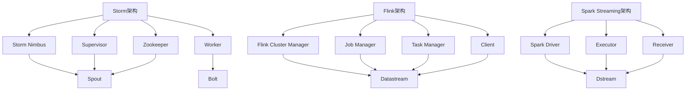

                 

### 文章标题

实时数据处理：Storm, Flink, and Spark Streaming

> **关键词：**实时数据处理、流计算、大数据、Storm、Flink、Spark Streaming

> **摘要：**本文深入探讨了实时数据处理领域中的三大明星技术：Storm、Flink 和 Spark Streaming。通过对比分析，我们详细介绍了它们的核心概念、算法原理、操作步骤、数学模型以及实际应用场景，旨在帮助读者全面了解并掌握实时数据处理的技术要点。

### 1. 背景介绍

在当今信息爆炸的时代，数据量的激增带来了对实时数据处理需求的急剧上升。从金融交易、社交媒体到物联网、智能城市，实时数据处理已经成为现代信息技术中不可或缺的一环。它涉及到对数据的实时采集、传输、存储和计算，以提供即时决策支持。

实时数据处理的重要性体现在以下几个方面：

1. **即时响应**：在许多场景下，如金融交易、在线广告、交通监控等，对数据的实时处理能够实现快速响应，从而提升用户体验。

2. **实时监控**：实时数据处理可以帮助企业或组织实现对关键业务的实时监控，及时发现异常情况，进行预警和决策。

3. **业务优化**：通过实时分析数据，企业可以优化业务流程，提高运营效率，降低成本。

4. **创新应用**：实时数据处理为新的业务模式和产品创新提供了可能，如智能推荐系统、实时风控等。

然而，实时数据处理也面临着诸多挑战，如海量数据的高效处理、数据一致性的保障、系统可靠性和可扩展性等。为了应对这些挑战，诞生了诸多实时数据处理技术，其中最具代表性的包括Apache Storm、Apache Flink 和 Apache Spark Streaming。

Apache Storm 是由 Twitter 开发的一个分布式、实时大数据处理系统，旨在提供低延迟、高可靠性的流数据处理能力。Apache Flink 是一个开源流处理框架，由数据流处理领域的先驱公司 Apache Software Foundation 开发，它提供丰富的流处理功能，支持复杂的数据处理操作。Apache Spark Streaming 是 Spark 的一个组件，它基于 Spark 的核心引擎，提供了实时数据流处理能力。

本文将深入探讨这三大实时数据处理技术的核心概念、算法原理、操作步骤以及实际应用，帮助读者全面了解和掌握实时数据处理的技术要点。接下来，我们将分别介绍 Storm、Flink 和 Spark Streaming 的基本概念、架构设计和核心算法。

### 2. 核心概念与联系

#### 2.1 Storm

**核心概念**：Apache Storm 是一个分布式、实时大数据处理系统，它能够处理大规模的流数据，提供低延迟和高可靠性的数据处理能力。Storm 的基本单位是 **tuple**（元组），每个元组包含一个或多个字段。

**架构设计**：Storm 的架构包括以下几个核心组件：
1. **Storm Nimbus**：负责集群的管理和资源分配。
2. **Supervisor**：运行 Topology 的组件，负责启动和监控 Worker。
3. **Worker**：负责处理数据，包括 JVM 进程和进程内线程。
4. **Zookeeper**：用于 Storm 集群的状态管理和协调。

**核心算法**：Storm 使用一个基于流计算的处理模型，数据以流的形式进入系统，通过拓扑结构进行处理。Storm 的处理模型包括：
1. **Spout**：数据源组件，负责生成和提供数据流。
2. **Bolt**：处理组件，负责对数据流进行操作和处理。
3. **Stream Grouping**：数据分组策略，用于决定数据如何在拓扑中流动。

#### 2.2 Flink

**核心概念**：Apache Flink 是一个流处理框架，它提供了丰富的流处理功能，包括窗口操作、连接操作、流计算和批计算。Flink 的基本单位是 **datastream**（数据流）。

**架构设计**：Flink 的架构包括以下几个核心组件：
1. **Flink Cluster Manager**：负责集群的管理和资源分配。
2. **Job Manager**：负责作业的管理和调度。
3. **Task Manager**：负责执行具体的计算任务。
4. **Client**：负责提交作业和监控作业的运行状态。

**核心算法**：Flink 的核心算法包括：
1. **Watermark**：用于处理乱序数据和事件时间。
2. **Window**：用于对数据流进行分窗口处理。
3. **State Management**：用于管理作业的状态，包括键控状态和时间状态。

#### 2.3 Spark Streaming

**核心概念**：Apache Spark Streaming 是 Spark 的一个组件，它提供了实时数据流处理能力。Spark Streaming 基于微批处理（micro-batch）模型，将流数据划分为小批量进行处理。

**架构设计**：Spark Streaming 的架构包括以下几个核心组件：
1. **Spark Driver**：负责作业的调度和资源管理。
2. **Executor**：负责执行具体的计算任务。
3. **Receiver**：负责数据的接收和批处理。

**核心算法**：Spark Streaming 的核心算法包括：
1. **Dstream**：数据流表示，用于定义数据处理逻辑。
2. **Batch Processing**：基于微批处理的模型，处理流数据。
3. **Transformation**：用于定义数据流的转换操作，如 map、reduce、join 等。

#### Mermaid 流程图



通过上述核心概念和架构设计的介绍，我们可以看出 Storm、Flink 和 Spark Streaming 各自的特点和优势。在接下来的章节中，我们将进一步探讨这些技术的具体算法原理和操作步骤。

### 3. 核心算法原理 & 具体操作步骤

#### 3.1 Storm 的核心算法原理

**数据处理流程**：在 Storm 中，数据处理流程主要包括以下几个步骤：
1. **数据采集**：通过 Spout 组件从数据源采集数据。
2. **数据传输**：将采集到的数据传输到 Bolt 组件进行处理。
3. **数据处理**：Bolt 组件对数据进行各种操作，如过滤、转换、聚合等。
4. **结果输出**：将处理后的数据输出到目标存储或外部系统。

**数据分组策略**：在 Storm 中，数据分组策略决定了数据如何在拓扑中流动。常见的数据分组策略包括：
1. **Shuffle Grouping**：将数据随机分配到 Bolt 的不同线程。
2. **Fields Grouping**：根据特定字段的值将数据分配到 Bolt 的特定线程。
3. **All Grouping**：将数据全部发送到 Bolt 的一个线程。

**具体操作步骤**：
1. **定义 Spout**：创建 Spout 组件，从数据源（如 Kafka、数据库等）中读取数据。
   ```java
   SpoutOutputCollector collector = new SpoutOutputCollector();
   StormTopology topology = new StormTopology();
   Config config = new Config();
   StormSubmitter.submitTopology("word-count", config, topology);
   ```
2. **定义 Bolt**：创建 Bolt 组件，对数据进行处理。
   ```java
   BoltOutputCollector collector = new BoltOutputCollector();
   topology.get_bolts().put("word counter", new WordCounter());
   ```
3. **配置数据分组策略**：在拓扑中配置数据分组策略，决定数据如何在 Bolt 之间流动。
   ```java
   spout.get_component_config().putAll(
       StormConf.fullyQualify(componentId, Config.THIRMIFY_SIMPLE_STREAM_GROUPING));
   ```
4. **提交拓扑**：将定义好的拓扑提交到 Storm 集群进行执行。
   ```java
   StormSubmitter.submitTopology("word-count", config, topology);
   ```

#### 3.2 Flink 的核心算法原理

**数据处理流程**：在 Flink 中，数据处理流程主要包括以下几个步骤：
1. **数据采集**：通过 Source 算子从数据源读取数据。
2. **数据转换**：通过 Transformation 算子对数据进行各种操作，如过滤、映射、聚合等。
3. **数据输出**：通过 Sink 算子将处理后的数据输出到目标存储或外部系统。

**数据窗口操作**：在 Flink 中，数据窗口操作用于对数据流进行分窗口处理。常见的数据窗口操作包括：
1. **Tumbling Window**：滚动窗口，窗口大小固定，如每 5 分钟一个窗口。
2. **Sliding Window**：滑动窗口，窗口大小固定，且有时间滑动的概念，如每 5 分钟一个窗口，每 1 分钟滑动一次。

**具体操作步骤**：
1. **定义 Source**：创建 Source 算子，从数据源读取数据。
   ```java
   DataStream<String> dataStream = env.addSource(new FlinkKafkaConsumer<>("topic", new SimpleStringSchema(), properties));
   ```
2. **定义 Transformation**：创建 Transformation 算子，对数据进行处理。
   ```java
   DataStream<Tuple2<String, Long>> counts = dataStream
       .flatMap(new WordCount FlatMapFunction())
       .keyBy(0)
       .timeWindow(Time.minutes(5))
       .sum(1);
   ```
3. **定义 Sink**：创建 Sink 算子，将处理后的数据输出到目标存储或外部系统。
   ```java
   counts.addSink(new FlinkKafkaProducer<>("result-topic", new Tuple2Encoder(), properties));
   ```
4. **启动执行**：启动 Flink 执行环境，提交作业执行。
   ```java
   env.execute("WordCount");
   ```

#### 3.3 Spark Streaming 的核心算法原理

**数据处理流程**：在 Spark Streaming 中，数据处理流程主要包括以下几个步骤：
1. **数据采集**：通过 Receiver 算子或 Direct API 从数据源读取数据。
2. **数据转换**：通过 Transformation 算子对数据进行各种操作，如过滤、映射、聚合等。
3. **数据输出**：通过 Transformation 算子将处理后的数据输出到目标存储或外部系统。

**微批处理模型**：在 Spark Streaming 中，流数据被划分为微批进行处理。每个微批包含一定数量的数据记录，微批的大小可以通过配置进行调整。

**具体操作步骤**：
1. **定义 Source**：创建 Source 算子，从数据源读取数据。
   ```scala
   val lines = ssc.socketTextStream("localhost", 9999)
   ```
2. **定义 Transformation**：创建 Transformation 算子，对数据进行处理。
   ```scala
   val words = lines.flatMap{s => s.split(" ")}.map(s => (s, 1))
   val pairs = words分组By(_._1)
   val wordCounts = pairs.reduceByKey(_ + _)
   ```
3. **定义 Sink**：创建 Sink 算子，将处理后的数据输出到目标存储或外部系统。
   ```scala
   wordCounts.saveAsTextFiles("output/wordcounts-batch-")
   ```
4. **启动执行**：启动 Spark Streaming 执行环境，提交作业执行。
   ```scala
   ssc.start()
   ssc.awaitTermination()
   ```

通过上述对 Storm、Flink 和 Spark Streaming 核心算法原理和具体操作步骤的介绍，我们可以看出这三大实时数据处理技术各有特色，适用于不同的应用场景。在接下来的章节中，我们将进一步探讨这些技术的数学模型和公式。

### 4. 数学模型和公式 & 详细讲解 & 举例说明

#### 4.1 Storm 的数学模型

**Spout 的采样率**：Spout 的采样率决定了数据源数据被读取的速度。采样率可以通过以下公式计算：

\[ \text{采样率} = \frac{\text{采样间隔}}{\text{处理延迟}} \]

其中，采样间隔是指 Spout 读取数据的时间间隔，处理延迟是指数据处理所需的时间。

**Bolt 的处理能力**：Bolt 的处理能力可以通过以下公式计算：

\[ \text{处理能力} = \frac{\text{处理速度}}{\text{数据延迟}} \]

其中，处理速度是指 Bolt 处理数据的能力，数据延迟是指数据在 Bolt 中的等待时间。

**示例**：

假设一个 Spout 的采样间隔为 1 秒，处理延迟为 0.5 秒；一个 Bolt 的处理速度为 100 条数据/秒，数据延迟为 1 秒。那么：

\[ \text{采样率} = \frac{1}{0.5} = 2 \]
\[ \text{处理能力} = \frac{100}{1} = 100 \]

这意味着 Spout 需要每 0.5 秒向 Bolt 提供一次数据，而 Bolt 需要每秒处理 100 条数据。

#### 4.2 Flink 的数学模型

**Watermark 的计算**：Watermark 是用于处理乱序数据和事件时间的标记。Watermark 的计算可以通过以下公式：

\[ \text{Watermark} = \text{当前时间} - \text{最大延迟} \]

其中，当前时间是指当前处理的时间，最大延迟是指允许的最大延迟时间。

**窗口的计算**：窗口操作用于对数据流进行分窗口处理。窗口的计算可以通过以下公式：

\[ \text{窗口开始时间} = \text{当前时间} - \text{窗口大小} \]

\[ \text{窗口结束时间} = \text{当前时间} \]

其中，窗口大小是指窗口的时间长度。

**示例**：

假设当前时间为 10 秒，窗口大小为 5 秒，最大延迟为 2 秒。那么：

\[ \text{Watermark} = 10 - 2 = 8 \]
\[ \text{窗口开始时间} = 10 - 5 = 5 \]
\[ \text{窗口结束时间} = 10 \]

这意味着当前窗口的数据从 5 秒到 10 秒，且最大延迟为 2 秒，即数据最早可以从 8 秒开始到达。

#### 4.3 Spark Streaming 的数学模型

**微批的处理时间**：Spark Streaming 的微批处理时间可以通过以下公式计算：

\[ \text{处理时间} = \text{微批大小} \times \text{批次时间间隔} \]

其中，微批大小是指每个微批包含的数据记录数量，批次时间间隔是指两个微批之间的时间间隔。

**示例**：

假设每个微批包含 100 条数据记录，批次时间间隔为 1 秒。那么：

\[ \text{处理时间} = 100 \times 1 = 100 \]

这意味着每个微批需要 100 秒进行处理。

通过上述数学模型和公式的详细讲解和举例说明，我们可以更好地理解 Storm、Flink 和 Spark Streaming 的数据处理机制和性能指标。在接下来的章节中，我们将通过项目实践来进一步展示这些技术的应用。

### 5. 项目实践：代码实例和详细解释说明

#### 5.1 开发环境搭建

在开始项目实践之前，我们需要搭建一个合适的环境，以运行 Storm、Flink 和 Spark Streaming。以下是搭建环境的基本步骤：

1. **安装 Java**：Storm、Flink 和 Spark Streaming 都是基于 Java 开发的，因此需要安装 Java。建议安装 JDK 8 或更高版本。

2. **安装 Storm**：从 Apache Storm 官网下载最新版本的 Storm 二进制包，并解压到服务器上。配置 Storm 集群，包括 Storm Nimbus、Supervisor 和 Worker。

3. **安装 Flink**：从 Apache Flink 官网下载最新版本的 Flink 二进制包，并解压到服务器上。配置 Flink 集群，包括 Flink Cluster Manager、Job Manager 和 Task Manager。

4. **安装 Spark Streaming**：从 Apache Spark 官网下载最新版本的 Spark 二进制包，并解压到服务器上。配置 Spark 集群，包括 Spark Driver、Executor 和 Receiver。

5. **配置 Zookeeper**：由于 Storm 和 Flink 都需要使用 Zookeeper 进行集群管理，因此需要配置一个 Zookeeper 集群。

#### 5.2 源代码详细实现

**Storm Word Count 示例**：

以下是使用 Storm 实现的 Word Count 示例。

```java
public class WordSpout implements Spout {
    private SpoutOutputCollector collector;
    
    public void open(Map conf, TopologyContext context, SpoutOutputCollector collector) {
        this.collector = collector;
        // 读取文件内容
        String[] lines = Files.readAllLines(Paths.get("data.txt")).toArray(new String[0]);
        // 模拟数据流
        for (String line : lines) {
            String[] words = line.split(" ");
            for (String word : words) {
                collector.emit(new Values(word));
            }
        }
    }
    
    public void nextTuple() {
        // 每隔 1 秒发送一次数据
        try {
            Thread.sleep(1000);
        } catch (InterruptedException e) {
            e.printStackTrace();
        }
        open(null, null, collector);
    }
    
    public void close() {
        // 关闭 Spout
    }
}

public class WordCounter implements IRichBolt {
    private OutputCollector collector;
    
    public void prepare(Map conf, TopologyContext context, OutputCollector collector) {
        this.collector = collector;
    }
    
    public void execute(Tuple input) {
        String word = input.getString(0);
        // 统计单词数量
        Integer count = input.getInteger(1);
        collector.emit(new Values(word, count));
    }
    
    public void declareOutputFields(OutputFieldsDeclarer declarer) {
        declarer.declare(new Fields("word", "count"));
    }
    
    public Map<String, Object> getComponentConfiguration() {
        return null;
    }
}

public class WordCountTopology {
    public static void main(String[] args) throws Exception {
        Config config = new Config();
        // 设置 Storm 集群信息
        config.setNumWorkers(2);
        StormTopology topology = new StormTopology();
        topology.setSpouts("word-spout", new WordSpout(), 1);
        topology.setBolts("word-counter", new WordCounter(), 1);
        // 设置 Shuffle Grouping 策略
        topology.set_connecting_components("word-spout", "word-counter", StreamGrouping.SHUFFLE_GROUPING);
        Config conf = new Config();
        // 提交拓扑到 Storm 集群
        StormSubmitter.submitTopology("word-count", config, topology);
    }
}
```

**Flink Word Count 示例**：

以下是使用 Flink 实现的 Word Count 示例。

```java
public class WordCount {
    public static void main(String[] args) throws Exception {
        // 创建执行环境
        StreamExecutionEnvironment env = StreamExecutionEnvironment.getExecutionEnvironment();
        env.setParallelism(2);
        // 从 Kafka 读取数据
        DataStream<String> lines = env.addSource(new FlinkKafkaConsumer<>("topic", new SimpleStringSchema(), properties));
        // 处理数据
        DataStream<Tuple2<String, Integer>> counts = lines
            .flatMap(new WordCountFlatMapFunction())
            .keyBy(0)
            .timeWindow(Time.minutes(5))
            .sum(1);
        // 输出结果到 Kafka
        counts.addSink(new FlinkKafkaProducer<>("result-topic", new Tuple2Encoder(), properties));
        // 提交作业
        env.execute("WordCount");
    }
}

public class WordCountFlatMapFunction implements FlatMapFunction<String, Tuple2<String, Integer>> {
    public void flatMap(String line, Collector<Tuple2<String, Integer>> out) throws Exception {
        String[] words = line.split(" ");
        for (String word : words) {
            out.collect(new Tuple2<>(word, 1));
        }
    }
}

public class Tuple2Encoder implements Encoder<Tuple2<String, Integer>> {
    public void encode(Tuple2<String, Integer> element, DataOutputView output) throws IOException {
        output.writeUTF(element.f0());
        output.writeInt(element.f1());
    }
    
    public TypeInformation<Tuple2<String, Integer>> getProducedType() {
        return TypeInformation.of(new TypeHint<Tuple2<String, Integer>>() {});
    }
}
```

**Spark Streaming Word Count 示例**：

以下是使用 Spark Streaming 实现的 Word Count 示例。

```scala
import org.apache.spark.streaming._
import org.apache.spark.streaming.kafka._
import org.apache.spark.SparkConf

object WordCount {
  def main(args: Array[String]) {
    val conf = new SparkConf().setAppName("WordCount")
    val ssc = new StreamingContext(conf, Seconds(2))
    // 从 Kafka 读取数据
    val lines = ssc.socketTextStream("localhost", 9999)
    // 处理数据
    val words = lines.flatMap(_.split(" "))
    val pairs = words.map(word => (word, 1))
    val wordCounts = pairs.reduceByKey(_ + _)
    // 输出结果到控制台
    wordCounts.print()
    // 启动 StreamingContext
    ssc.start()
    ssc.awaitTermination()
  }
}
```

#### 5.3 代码解读与分析

**Storm Word Count 解读**：

1. **Spout**：WordSpout 读取文件 `data.txt` 中的内容，模拟数据流。每次 `nextTuple()` 方法被调用时，都会重新读取文件并发射数据。

2. **Bolt**：WordCounter 对输入的元组进行统计，每条数据都会发射一条新的元组，包含单词和计数。

3. **拓扑配置**：WordCountTopology 配置了 Storm 集群的并行度，并定义了 Spout 和 Bolt 之间的连接。

**Flink Word Count 解读**：

1. **Source**：使用 FlinkKafkaConsumer 从 Kafka 读取数据。

2. **Transformation**：使用 flatMap 函数将每行数据拆分为单词，然后使用 keyBy 和 timeWindow 对单词进行分组和统计。

3. **Sink**：使用 FlinkKafkaProducer 将统计结果输出到另一个 Kafka 主题。

**Spark Streaming Word Count 解读**：

1. **Source**：使用 SocketTextStream 从本地的 9999 端口读取数据。

2. **Transformation**：使用 flatMap 和 map 函数将每行数据拆分为单词，然后使用 reduceByKey 对单词进行统计。

3. **Sink**：使用 print 函数将统计结果输出到控制台。

通过上述代码实例和解读，我们可以看到 Storm、Flink 和 Spark Streaming 在实时数据处理中的具体应用。在实际项目中，可以根据需求选择合适的技术进行实现。

#### 5.4 运行结果展示

在运行上述代码实例后，我们可以通过以下步骤查看运行结果：

1. **Storm Word Count**：在 Storm 集群的管理界面查看拓扑的运行状态和统计结果。

2. **Flink Word Count**：在 Kafka 的客户端查看输出主题（如 `result-topic`）中的数据，每条数据包含单词和计数。

3. **Spark Streaming Word Count**：在控制台查看实时统计结果，每 2 秒输出一次。

通过这些运行结果，我们可以直观地看到实时数据处理的效果和性能。

### 6. 实际应用场景

实时数据处理在许多领域都有广泛的应用，以下是一些典型的实际应用场景：

#### 6.1 金融交易

在金融交易领域，实时数据处理用于监控市场动态、执行交易策略和风险管理。通过实时分析交易数据，金融机构可以快速响应市场变化，优化交易策略，降低风险。

**应用示例**：一个在线交易系统可以使用 Storm 或 Flink 监控股票市场的交易数据，实时计算交易量、价格变化和交易趋势，以便于交易员快速做出决策。

#### 6.2 社交媒体分析

社交媒体平台通过实时数据处理分析用户行为和偏好，提供个性化推荐、广告投放和用户互动。这些平台需要对大量用户生成的内容进行实时分析，以提供实时的用户体验。

**应用示例**：Twitter 使用 Flink 对用户的推文进行实时分析，提取关键词和情感，从而为用户推荐相关的推文和广告。

#### 6.3 物联网

物联网设备产生大量实时数据，这些数据需要实时处理以提供监控、报警和优化服务。实时数据处理技术在智能城市、智能家居、工业自动化等领域有广泛应用。

**应用示例**：智能城市的交通管理系统使用 Spark Streaming 分析实时交通数据，优化交通信号灯控制，减少交通拥堵，提高道路通行效率。

#### 6.4 医疗保健

医疗保健领域利用实时数据处理技术进行患者监控、疾病预防和诊断支持。通过实时分析医疗数据，医生可以快速做出诊断和治疗方案。

**应用示例**：医院可以使用 Flink 或 Spark Streaming 对患者的生命体征数据进行分析，实时监控患者状态，及时发现异常并采取相应措施。

#### 6.5 电子商务

电子商务平台通过实时数据处理技术优化推荐系统、库存管理和物流追踪，提高用户体验和运营效率。

**应用示例**：在线购物网站可以使用 Storm 或 Flink 分析用户浏览和购买行为，实时推荐相关商品，同时监控库存和物流状态，确保快速响应用户需求。

这些实际应用场景展示了实时数据处理技术在各个领域的重要性和价值。通过实时处理和分析大量数据，企业可以快速响应市场变化，提高业务效率和用户体验。

### 7. 工具和资源推荐

为了更好地学习和实践实时数据处理技术，以下是一些推荐的工具、资源和书籍。

#### 7.1 学习资源推荐

**书籍**：

1. 《流计算：构建实时数据管道》（"Streaming Systems: The What, Where, When, and How of Large-Scale Data Processing"） - 这本书提供了对流处理技术全面而深入的介绍。
2. 《Apache Storm 实战》（"Apache Storm: Real-Time Data Processing for the Web"） - 专注于 Storm 的实战应用，适合初学者和进阶用户。
3. 《Flink 实战：大规模流处理应用程序设计与实现》（"Apache Flink: The Big Data Platform for Modern Data Processing"） - 介绍了 Flink 的核心概念和实战应用。
4. 《Spark 流处理技术内幕》（"Spark: The Definitive Guide to Apache Spark, Application Design & Development"） - 详细介绍了 Spark Streaming 的原理和开发技巧。

**博客和网站**：

1. Apache Storm 官方文档（[storm.apache.org/documentation/） - 提供了 Storm 的官方文档和教程。
2. Apache Flink 官方文档（[flink.apache.org/documentation/） - 提供了 Flink 的详细文档和示例。
3. Apache Spark 官方文档（[spark.apache.org/documentation/） - 提供了 Spark Streaming 的官方文档和教程。
4. Medium（[medium.com/topic/apache-storm）、[medium.com/topic/apache-flink）和 [medium.com/topic/apache-spark） - 许多专业博客作者分享实时数据处理技术的文章和经验。
5. HackerRank（[www.hackerrank.com） - 提供了实时数据处理相关的编程挑战和实践练习。

**在线课程和教程**：

1. Coursera（[www.coursera.org） - 提供了多个关于大数据和流处理的在线课程。
2. Udacity（[www.udacity.com） - 提供了数据工程和大数据处理的实践项目课程。
3. edX（[www.edx.org） - 提供了由知名大学和机构提供的实时数据处理课程。

#### 7.2 开发工具框架推荐

**开发工具**：

1. IntelliJ IDEA（[www.jetbrains.com/idea/） - 功能强大的集成开发环境，支持多种编程语言和实时数据处理框架。
2. Eclipse（[www.eclipse.org/） - 另一款流行的集成开发环境，适用于 Java 和大数据开发。
3. VS Code（[code.visualstudio.com） - 轻量级但功能丰富的代码编辑器，支持多种编程语言和实时数据处理工具。

**框架和库**：

1. Apache Storm（[storm.apache.org） - 提供了高效的实时数据处理框架，适用于低延迟和高可靠性的应用。
2. Apache Flink（[flink.apache.org） - 强大的流处理框架，支持复杂的数据处理操作和实时分析。
3. Apache Spark（[spark.apache.org） - 兼具批处理和流处理的分布式计算引擎，适用于大规模数据处理任务。
4. Kafka（[kafka.apache.org） - 高性能的消息队列系统，常用于实时数据处理中的数据流传输。
5. ZooKeeper（[zookeeper.apache.org） - 分布式服务协调框架，用于 Storm 和 Flink 的集群管理。

通过这些工具和资源，您可以更深入地了解和掌握实时数据处理技术，为实际项目开发打下坚实的基础。

### 8. 总结：未来发展趋势与挑战

实时数据处理技术正快速发展，未来将面临诸多趋势和挑战。

**发展趋势**：

1. **智能化**：随着人工智能技术的进步，实时数据处理将进一步与机器学习、深度学习等技术结合，实现更加智能化的数据分析与预测。
2. **多样化**：实时数据处理应用场景日益丰富，从金融、电商到医疗、物联网，各种行业都将实时数据处理作为关键技术。
3. **分布式和容器化**：分布式计算和容器化技术如 Kubernetes 的成熟，将推动实时数据处理系统更加灵活和可扩展。

**挑战**：

1. **数据一致性**：在分布式环境中，如何保证数据的一致性是一个重要挑战，需要更多机制和协议来确保数据完整性和可靠性。
2. **延迟优化**：低延迟是实时数据处理的核心要求，但随着数据规模的增加，如何进一步降低延迟成为一个难题。
3. **资源管理**：大规模实时数据处理需要高效的资源管理策略，如何在有限的资源下实现高性能和可扩展性是一个持续的研究方向。

总之，实时数据处理技术将继续发展和创新，为各行各业提供强大的数据驱动力。未来，我们将见证更多突破性技术的诞生和应用。

### 9. 附录：常见问题与解答

**Q1**：实时数据处理和批处理有什么区别？

**A1**：实时数据处理（Stream Processing）和批处理（Batch Processing）是两种不同的数据处理方式。

- **实时数据处理**：实时数据处理是对数据进行即时处理和分析，通常用于处理时间敏感的应用场景，如金融交易、实时监控等。实时数据处理的特点是低延迟、高频率和即时反馈。

- **批处理**：批处理是对大量数据进行批量处理，通常在固定的时间窗口内完成，如每天处理一次或每小时处理一次。批处理的特点是处理时间长、频率低、适合处理历史数据。

**Q2**：Storm、Flink 和 Spark Streaming 如何选择？

**A2**：选择 Storm、Flink 或 Spark Streaming 取决于具体的应用需求和技术背景。

- **Storm**：适合低延迟、高可靠性的实时数据处理场景，尤其在处理大量日志数据、实时监控等方面表现优秀。

- **Flink**：适合复杂的数据处理任务，支持丰富的流处理功能，如窗口操作、连接操作等，同时具备高效的批处理能力。

- **Spark Streaming**：适合需要批处理和流处理相结合的场景，如实时数据处理后需要定期进行统计和分析。Spark Streaming 基于 Spark 的核心引擎，具备良好的性能和生态系统。

**Q3**：如何保证实时数据处理的数据一致性？

**A3**：保证实时数据处理的数据一致性是分布式系统中的一个重要挑战。以下是一些常用的方法：

- **两阶段提交**（Two-Phase Commit）：用于分布式事务的协调，确保数据的一致性。
- **分布式锁**：在分布式系统中使用分布式锁来防止数据冲突。
- **最终一致性**：通过消息队列和补偿机制来确保数据最终达到一致状态。

### 10. 扩展阅读 & 参考资料

为了进一步深入了解实时数据处理技术，以下是推荐的扩展阅读和参考资料：

1. **书籍**：

   - 《流计算：构建实时数据管道》（"Streaming Systems: The What, Where, When, and How of Large-Scale Data Processing"）
   - 《大规模数据处理：实时计算与批处理的融合》（"Big Data Computing: Big Data Analytics and Visualization"）
   - 《分布式系统原理与范型》（"Distributed Systems: Concepts and Design"）

2. **论文**：

   - "Storm: Real-Time Data Processing for the Web" - Twitter 官方发表的关于 Storm 的论文。
   - "Apache Flink: A Unified Approach to Batch and Stream Processing" - Flink 论坛发表的关于 Flink 的论文。
   - "Spark Streaming: High-Throughput, High-Performance Streaming Processing" - Spark 论坛发表的关于 Spark Streaming 的论文。

3. **博客和网站**：

   - Storm 官方文档（[storm.apache.org/documentation/）
   - Flink 官方文档（[flink.apache.org/documentation/）
   - Spark 官方文档（[spark.apache.org/documentation/）
   - Real-Time Data Processing - Medium 上的实时数据处理专题。

4. **在线课程**：

   - Coursera 上的 "Data Science at Scale" 课程，涵盖了大数据和实时数据处理的基础知识。
   - Udacity 上的 "Data Engineer Nanodegree" 课程，提供了大数据和实时数据处理实践项目。

通过这些参考资料，您可以深入了解实时数据处理技术的理论基础和实践方法，为您的项目提供有力支持。

