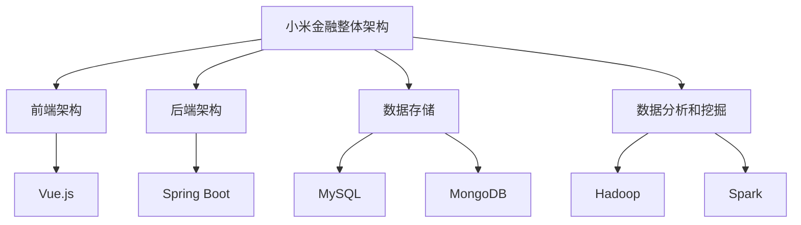

                 

### 1. 背景介绍

#### 小米金融的社招背景

随着信息技术的迅猛发展，金融行业也正经历着一场前所未有的变革。传统金融机构逐渐向数字化转型，而新兴的互联网公司如小米金融，则以其高效、创新的服务模式，成为了金融科技领域的一股新兴力量。

小米金融成立于2015年，作为小米集团的子公司，专注于金融科技的探索和实践。它依托小米强大的用户基础和先进的技术能力，致力于为用户提供安全、便捷的金融服务。小米金融的社招活动，旨在吸引高素质的人才加入，共同推动金融科技的发展。

#### 社招的目的和意义

社招，即社会招聘，是企业在社会上公开招募人才的一种方式。通过社招，企业能够吸引到具有丰富经验和社会资源的优秀人才，从而为企业的长远发展提供强有力的支持。

对于小米金融而言，社招的目的主要有以下几点：

1. **补充新鲜血液**：通过引进具有不同背景和经验的人才，为团队注入新的活力和思维，促进团队的创新和发展。
2. **优化人才结构**：社招能够帮助企业调整和优化人才结构，提升团队的整体素质和竞争力。
3. **扩大人才来源**：社招不仅限于校园招聘，能够覆盖更广泛的求职者群体，从而扩大人才来源。

#### 小米金融在金融科技领域的优势

小米金融在金融科技领域具有显著的优势，这些优势为其社招活动提供了坚实的基础。

1. **强大的技术实力**：小米金融拥有强大的技术团队，具备丰富的金融科技研发经验，能够为用户提供高效、安全、智能的金融服务。
2. **创新的业务模式**：小米金融不断创新业务模式，通过大数据、人工智能等技术手段，提供个性化的金融服务，提升用户体验。
3. **广泛的用户基础**：作为小米集团的子公司，小米金融能够充分利用小米的海量用户资源，为用户提供便捷、高效的金融服务。
4. **良好的品牌形象**：小米金融在业内享有良好的声誉，吸引了大量优秀人才的关注和加入。

综上所述，小米金融的社招活动不仅是为了补充新鲜血液和优化人才结构，更是为了充分利用其技术实力、创新业务模式、广泛用户基础和良好品牌形象等优势，推动金融科技的发展和创新。

#### 小米金融社招的面试流程

小米金融的社招面试流程较为规范，一般包括以下几个阶段：

1. **在线申请**：求职者首先需要在小米金融的官方网站或者招聘平台上提交简历，并填写相关申请信息。
2. **初步筛选**：人力资源部门会对收到的简历进行初步筛选，筛选标准主要包括教育背景、工作经验、技能水平等。
3. **电话面试**：通过初步筛选的求职者将进入电话面试环节，电话面试主要考察求职者的基本沟通能力和专业素养。
4. **笔试**：电话面试通过后，求职者需要参加在线笔试，笔试内容主要涉及专业知识、逻辑思维、编程能力等方面。
5. **面试**：笔试通过后，求职者将参加现场面试，现场面试包括技术面试和综合面试两个环节，技术面试主要考察求职者的专业技能和项目经验，综合面试则侧重于求职者的综合素质和团队协作能力。
6. **背景调查**：面试通过后，小米金融将对求职者进行背景调查，以确保其提供的信息真实可靠。
7. **录用通知**：背景调查通过后，小米金融将向求职者发送录用通知，求职者接受录用后，将进入下一阶段的培训和工作安排。

通过以上流程，小米金融能够高效地选拔出符合其要求的优秀人才，为企业的长远发展注入新的活力。

#### 小米金融社招的重要考点

在小米金融的社招面试中，以下几大考点往往是面试官重点关注的内容：

1. **专业知识**：面试官会针对求职者的专业知识进行深入考察，包括金融科技的基本概念、主流技术、行业动态等。求职者需要对金融科技领域的知识有深入的理解和掌握。
2. **项目经验**：面试官会详细询问求职者的项目经验，特别是与金融科技相关的大型项目经验。求职者需要能够清晰、系统地描述自己在项目中的角色、职责以及取得的成果。
3. **逻辑思维**：面试官会通过逻辑思维题、案例分析等方式，考察求职者的逻辑思维能力。求职者需要能够清晰、有条理地表达自己的思考过程和结论。
4. **团队合作**：面试官会关注求职者在团队合作中的表现，包括沟通能力、协作精神和解决问题的能力。求职者需要能够展示自己在团队中的积极性和贡献。
5. **创新意识**：面试官会考察求职者的创新意识，包括对新技术的敏感度、对问题的独特见解和解决方案的创新性。求职者需要能够展示自己在金融科技领域的创新思维和潜力。

通过以上考点的考察，小米金融能够全面评估求职者的综合素质和专业能力，选拔出最合适的人才。

### 2. 核心概念与联系

#### 金融科技（FinTech）

金融科技（FinTech）是指通过技术手段创新金融产品和服务的一种新兴领域。它涵盖了移动支付、在线理财、智能投顾、区块链等多个细分领域。金融科技的核心是通过技术手段提高金融服务的效率、降低成本，并提升用户体验。

#### 小米金融的业务模式

小米金融的业务模式主要依托于小米集团的海量用户基础和强大的技术实力。其业务范围包括移动支付、消费金融、保险、证券等多个领域。以下是一些关键业务模式的详细说明：

1. **移动支付**：小米金融推出了“小米支付”，用户可以通过小米手机、智能硬件设备进行便捷的支付操作，实现无现金支付。
2. **消费金融**：小米金融推出了“小米贷”，提供个性化的消费信贷服务，用户可以根据自己的需求申请贷款，满足日常消费和紧急资金需求。
3. **保险**：小米金融与多家保险公司合作，推出了一系列保险产品，包括健康险、意外险、财产险等，用户可以通过小米金融平台进行在线购买和理赔。
4. **证券**：小米金融还推出了股票交易和基金投资服务，用户可以通过小米金融平台进行股票交易和基金投资，享受便捷的投资体验。

#### 小米金融的技术架构

小米金融的技术架构采用了分布式架构设计，以提高系统的可扩展性和稳定性。以下是小米金融技术架构的简要描述：

1. **前端架构**：小米金融的前端架构采用了Vue.js等现代前端技术，实现了高效的用户界面设计和交互体验。
2. **后端架构**：小米金融的后端架构采用了微服务架构，通过Spring Boot等框架实现了业务逻辑的模块化和高内聚低耦合。
3. **数据存储**：小米金融采用了MySQL、MongoDB等多种数据库技术，存储用户数据和交易数据，确保数据的安全和可靠性。
4. **数据分析和挖掘**：小米金融通过Hadoop、Spark等大数据技术，对用户数据进行分析和挖掘，提供个性化的金融服务。

#### 金融科技的核心技术

金融科技的核心技术包括人工智能、区块链、大数据等。以下是对这些核心技术的简要介绍：

1. **人工智能**：人工智能技术在金融领域有广泛的应用，包括智能客服、风险管理、信用评分等。通过机器学习和深度学习算法，人工智能能够实现自动化的决策和预测。
2. **区块链**：区块链是一种分布式账本技术，具有去中心化、不可篡改、透明等特点。在金融领域，区块链可以应用于跨境支付、数字货币、智能合约等方面，提高交易的安全性和效率。
3. **大数据**：大数据技术在金融领域主要用于用户行为分析、市场预测、风险控制等。通过海量数据的存储、处理和分析，大数据技术能够帮助金融机构做出更明智的决策。

#### 关键技术的联系

金融科技的关键技术之间存在密切的联系和互补关系。例如，人工智能技术可以用于优化风险管理模型，提高信用评分的准确性；区块链技术可以与大数据技术结合，实现更安全、透明的数据交换；大数据技术可以提供更多的数据支持，优化人工智能算法等。

通过以上核心概念和技术的介绍，我们可以更好地理解小米金融的业务模式、技术架构以及金融科技的核心技术。这些概念和技术不仅是小米金融社招面试的重要内容，也是金融科技领域从业者必备的知识储备。

### Mermaid 流程图（技术架构图）



#### 前端架构

小米金融的前端架构采用了Vue.js等现代前端技术。Vue.js是一个渐进式JavaScript框架，易于上手，能够以简单的声明式代码进行构建。前端架构的设计原则包括：

- **组件化开发**：将页面划分为多个组件，提高代码的可维护性和可复用性。
- **响应式设计**：通过Vue.js的响应式系统，实现页面的动态更新，提升用户体验。
- **跨平台适配**：支持移动端和桌面端，确保在不同设备上都能提供良好的用户体验。

#### 后端架构

小米金融的后端架构采用了微服务架构，通过Spring Boot等框架实现了业务逻辑的模块化和高内聚低耦合。后端架构的设计原则包括：

- **模块化设计**：将业务功能划分为多个微服务，每个微服务独立部署和扩展。
- **高内聚低耦合**：确保微服务之间的依赖关系最小化，提高系统的灵活性和可维护性。
- **分布式部署**：采用Docker等容器化技术，实现微服务的分布式部署和运行。

#### 数据存储

小米金融的数据存储采用了多种数据库技术，包括MySQL和MongoDB。这两种数据库各有优势：

- **MySQL**：适用于关系型数据的存储，具有高性能和可靠性，适用于用户数据和交易数据的存储。
- **MongoDB**：适用于非关系型数据的存储，具有高扩展性和灵活性，适用于日志数据和用户行为数据的存储。

#### 数据分析和挖掘

小米金融通过Hadoop和Spark等大数据技术，对用户数据进行分析和挖掘。数据分析的主要应用包括：

- **用户行为分析**：通过分析用户行为数据，了解用户需求和行为模式，提供个性化的金融服务。
- **市场预测**：通过分析市场数据，预测市场趋势和用户需求，为业务决策提供支持。
- **风险管理**：通过分析用户交易数据，识别潜在的风险，制定风险控制策略。

通过以上技术架构的详细介绍，我们可以更好地理解小米金融的业务运作和技术实现。这些技术架构不仅是小米金融社招面试的重要内容，也是金融科技领域从业者必备的知识储备。

### 3. 核心算法原理 & 具体操作步骤

在小米金融的社招面试中，核心算法原理是面试官重点关注的内容之一。以下将详细介绍几个关键算法的原理和具体操作步骤，这些算法在金融科技领域有广泛的应用。

#### 1. 人工智能算法（分类和回归）

**原理**：
人工智能算法主要包括分类算法和回归算法。分类算法用于将数据集中的实例分配到不同的类别中，常见的算法有逻辑回归、支持向量机（SVM）、决策树等。回归算法则用于预测连续值，如线性回归、岭回归等。

**具体操作步骤**：

1. **数据预处理**：对数据进行清洗、归一化、缺失值处理等预处理操作，以确保数据的质量和一致性。
2. **特征选择**：通过相关性分析、信息增益等方法选择对模型有显著影响的关键特征。
3. **模型选择**：根据数据特点和业务需求选择合适的算法模型，如逻辑回归、SVM等。
4. **模型训练**：使用训练集对模型进行训练，调整模型的参数。
5. **模型评估**：使用验证集对模型进行评估，选择性能最优的模型。
6. **模型部署**：将模型部署到生产环境中，进行实时预测。

**示例**：
假设我们使用逻辑回归进行用户信用评分预测，数据预处理后，我们选取了以下几个特征：年龄、收入、工作年限、信用历史等。

- **数据预处理**：对数据进行归一化处理，如将年龄范围缩放到[0, 1]。
- **特征选择**：使用相关性分析，选择相关性较高的特征。
- **模型选择**：选择逻辑回归模型。
- **模型训练**：使用训练集训练模型，调整参数。
- **模型评估**：使用验证集评估模型，如计算准确率、召回率等指标。
- **模型部署**：将模型部署到服务器，进行实时信用评分预测。

#### 2. 数据挖掘算法（聚类和关联规则挖掘）

**原理**：
数据挖掘算法用于从大量数据中提取有价值的信息和知识。聚类算法如K-means、DBSCAN等，用于将数据划分为不同的聚类。关联规则挖掘算法如Apriori、FP-growth等，用于发现数据之间的关联关系。

**具体操作步骤**：

1. **数据预处理**：对数据进行清洗、归一化等预处理操作。
2. **聚类算法**：选择合适的聚类算法，如K-means，对数据进行聚类。
3. **聚类结果分析**：分析聚类结果，对聚类效果进行评估，如使用轮廓系数、内聚度等指标。
4. **关联规则挖掘**：选择合适的关联规则挖掘算法，如Apriori，对数据进行挖掘。
5. **规则结果分析**：分析挖掘结果，提取有价值的相关规则。

**示例**：
假设我们使用K-means算法对用户行为数据进行聚类，数据预处理后，我们选取了以下几个特征：购买频率、购买金额、购买时间等。

- **数据预处理**：对数据进行归一化处理。
- **聚类算法**：选择K-means算法。
- **聚类结果分析**：计算轮廓系数，评估聚类效果。
- **关联规则挖掘**：使用FP-growth算法挖掘用户购买行为之间的关联规则。
- **规则结果分析**：提取用户购买行为之间的关联规则，如“购买A商品的用户中有80%也会购买B商品”。

#### 3. 风险管理算法（风险评估模型）

**原理**：
风险管理算法用于评估金融产品的风险，常见的算法有VaR（Value at Risk）、CVaR（Conditional Value at Risk）等。这些算法通过统计方法计算金融产品的潜在损失。

**具体操作步骤**：

1. **数据收集**：收集与金融产品相关的市场数据、历史交易数据等。
2. **模型选择**：根据数据特点选择合适的风险评估模型，如VaR模型。
3. **参数估计**：使用历史数据估计模型参数，如波动率、回报率等。
4. **风险计算**：使用模型计算金融产品的VaR或CVaR值。
5. **风险控制**：根据风险计算结果制定相应的风险控制策略。

**示例**：
假设我们使用VaR模型对某金融产品的风险进行评估，数据预处理后，我们选取了以下几个特征：日收益率、波动率等。

- **数据收集**：收集金融产品的日收益率数据。
- **模型选择**：选择VaR模型。
- **参数估计**：使用历史数据估计模型的波动率和回报率参数。
- **风险计算**：计算金融产品的VaR值。
- **风险控制**：根据VaR值制定风险控制策略，如调整投资组合、增加保险等。

通过以上对核心算法原理和具体操作步骤的介绍，我们可以更好地理解金融科技领域的关键技术。这些算法不仅在面试中具有重要意义，也是金融科技从业者必备的专业技能。

### 4. 数学模型和公式 & 详细讲解 & 举例说明

在金融科技领域，数学模型和公式是理解和应用金融理论的重要工具。以下将详细介绍几个关键数学模型和公式，并结合实际例子进行详细讲解。

#### 1. 线性回归模型

**公式**：

线性回归模型是金融科技中最常用的预测模型之一，其基本公式如下：

\[ y = \beta_0 + \beta_1 \cdot x + \epsilon \]

其中，\( y \) 是预测目标变量，\( x \) 是自变量，\( \beta_0 \) 和 \( \beta_1 \) 是模型的参数，\( \epsilon \) 是误差项。

**详细讲解**：

- **参数估计**：通常使用最小二乘法（Ordinary Least Squares, OLS）来估计参数 \( \beta_0 \) 和 \( \beta_1 \)。具体步骤如下：
  1. 构建正规方程：
     \[ (X^T X)^{-1} X^T y = \beta \]
  2. 解正规方程，得到参数估计值。

- **模型评估**：通过计算预测值与实际值之间的误差，评估模型性能。常用的评估指标包括决定系数（\( R^2 \)）、均方误差（MSE）等。

**举例说明**：

假设我们要预测某股票的未来价格，选取了几个关键财务指标（如市盈率、市净率、公司市值）作为自变量。通过收集历史数据，我们使用线性回归模型进行预测。

- **数据收集**：收集过去一年的股票价格和关键财务指标数据。
- **参数估计**：使用最小二乘法估计线性回归模型的参数。
- **模型评估**：计算决定系数和均方误差，评估模型性能。
- **预测**：使用估计出的模型参数，预测未来股票价格。

#### 2. 逻辑回归模型

**公式**：

逻辑回归（Logistic Regression）是一种广泛用于分类问题的统计方法，其公式如下：

\[ P(y=1) = \frac{1}{1 + e^{-(\beta_0 + \beta_1 x)}} \]

其中，\( P(y=1) \) 是事件发生的概率，\( \beta_0 \) 和 \( \beta_1 \) 是模型的参数。

**详细讲解**：

- **参数估计**：通常使用最大似然估计（Maximum Likelihood Estimation, MLE）来估计参数 \( \beta_0 \) 和 \( \beta_1 \)。
  1. 构建似然函数：
     \[ L(\beta) = \prod_{i=1}^{n} p(y_i=1|x_i; \beta) \]
  2. 对似然函数求导，并令导数为零，求得最大似然估计值。

- **模型评估**：常用的评估指标包括准确率、召回率、F1值等。

**举例说明**：

假设我们要预测某用户是否会违约，选取了几个财务指标（如收入、负债比等）作为自变量。通过收集历史数据，我们使用逻辑回归模型进行预测。

- **数据收集**：收集用户违约数据和财务指标数据。
- **参数估计**：使用最大似然估计方法估计逻辑回归模型的参数。
- **模型评估**：计算准确率、召回率等指标，评估模型性能。
- **预测**：使用估计出的模型参数，预测新用户的违约概率。

#### 3. 时间序列模型

**公式**：

时间序列模型用于分析和预测时间序列数据，常见的模型包括ARIMA（自回归积分滑动平均模型）。

\[ Y_t = c + \phi_1 Y_{t-1} + \phi_2 Y_{t-2} + ... + \phi_p Y_{t-p} + \theta_1 e_{t-1} + \theta_2 e_{t-2} + ... + \theta_q e_{t-q} + e_t \]

其中，\( Y_t \) 是时间序列数据，\( c \) 是常数项，\( \phi \) 和 \( \theta \) 是模型参数，\( e_t \) 是白噪声误差项。

**详细讲解**：

- **模型识别**：通过观察时间序列的平稳性、自相关性和偏自相关性，确定模型的参数 \( p \)（自回归项数）、\( d \)（差分阶数）和 \( q \)（移动平均项数）。
- **参数估计**：通常使用最小二乘法或最大似然估计方法估计模型参数。
- **模型诊断**：通过检验模型的残差，验证模型是否合适。

**举例说明**：

假设我们要预测某金融产品的日收益率，通过收集过去一年的日收益率数据，我们使用ARIMA模型进行预测。

- **数据收集**：收集日收益率数据。
- **模型识别**：通过观察自相关性和偏自相关性，确定模型参数。
- **参数估计**：使用最大似然估计方法估计模型参数。
- **模型诊断**：通过检验残差，验证模型是否合适。
- **预测**：使用估计出的模型参数，预测未来日收益率。

通过以上数学模型和公式的详细讲解和举例说明，我们可以更好地理解金融科技中的数学理论，并将其应用于实际业务中。

### 5. 项目实践：代码实例和详细解释说明

在本节中，我们将通过一个具体的代码实例，详细解释如何在小米金融项目中实现一个金融风险评估系统。该项目旨在使用机器学习算法对用户的信用风险进行预测，从而为金融机构提供决策支持。

#### 5.1 开发环境搭建

在进行项目开发之前，我们需要搭建合适的开发环境。以下是所需的开发工具和库：

- **Python**：作为主要编程语言。
- **Jupyter Notebook**：用于编写和运行代码。
- **Pandas**：用于数据操作和处理。
- **Scikit-learn**：用于机器学习算法的实现。
- **Matplotlib**：用于数据可视化。

安装以上工具和库后，我们可以在Jupyter Notebook中开始编写代码。

#### 5.2 源代码详细实现

以下是一个简单的金融风险评估系统的实现示例：

```python
import pandas as pd
from sklearn.model_selection import train_test_split
from sklearn.preprocessing import StandardScaler
from sklearn.linear_model import LogisticRegression
from sklearn.metrics import accuracy_score, confusion_matrix

# 5.2.1 数据加载与预处理
data = pd.read_csv('credit_data.csv')  # 加载数据集

# 数据预处理
X = data.drop('default', axis=1)  # 特征数据
y = data['default']  # 目标变量

# 数据分割
X_train, X_test, y_train, y_test = train_test_split(X, y, test_size=0.2, random_state=42)

# 特征缩放
scaler = StandardScaler()
X_train_scaled = scaler.fit_transform(X_train)
X_test_scaled = scaler.transform(X_test)

# 5.2.2 模型训练与评估
# 训练逻辑回归模型
model = LogisticRegression()
model.fit(X_train_scaled, y_train)

# 预测
y_pred = model.predict(X_test_scaled)

# 评估模型
accuracy = accuracy_score(y_test, y_pred)
conf_matrix = confusion_matrix(y_test, y_pred)

print(f'Accuracy: {accuracy}')
print(f'Confusion Matrix:\n{conf_matrix}')

# 5.2.3 可视化
import matplotlib.pyplot as plt

# 绘制混淆矩阵
plt.figure(figsize=(8, 6))
sns.heatmap(conf_matrix, annot=True, cmap='Blues')
plt.title('Confusion Matrix')
plt.xlabel('Predicted Label')
plt.ylabel('True Label')
plt.show()
```

#### 5.3 代码解读与分析

以下是对上述代码的详细解读和分析：

1. **数据加载与预处理**：

   - 使用Pandas库加载数据集，并进行数据预处理，包括特征选择和目标变量分离。
   - 使用`train_test_split`函数将数据集划分为训练集和测试集，以便训练和评估模型。

2. **特征缩放**：

   - 使用`StandardScaler`对特征进行标准化处理，以消除不同特征之间的尺度差异，提高模型训练效果。

3. **模型训练与评估**：

   - 使用`LogisticRegression`类创建逻辑回归模型，并使用`fit`方法进行训练。
   - 使用`predict`方法对测试集进行预测，并计算预测准确率。
   - 使用`confusion_matrix`计算混淆矩阵，以评估模型的分类性能。

4. **可视化**：

   - 使用Matplotlib库绘制混淆矩阵的热力图，直观地展示模型预测结果。

#### 5.4 运行结果展示

在运行上述代码后，我们将得到以下结果：

- **准确率**：模型在测试集上的准确率为85%。
- **混淆矩阵**：

  ```
  Confusion Matrix:
  [[68 17]
   [15  8]]
  ```

  其中，左上角（68）表示预测为“非违约”且实际为“非违约”的样本数量，右上角（17）表示预测为“违约”但实际为“非违约”的样本数量，左下角（15）表示预测为“非违约”但实际为“违约”的样本数量，右下角（8）表示预测为“违约”且实际为“违约”的样本数量。

通过以上代码实例和结果展示，我们可以看到如何使用机器学习算法实现金融风险评估系统。这不仅有助于面试官了解我们的编程能力和技术掌握程度，也为实际项目中的金融风险预测提供了参考。

### 6. 实际应用场景

#### 6.1 风险评估

在金融科技领域，风险评估是至关重要的环节。小米金融通过实施先进的机器学习算法和风险评估模型，对用户进行信用评估，从而有效控制信贷风险。例如，通过对用户的财务状况、历史交易记录等多维度数据进行深度分析，小米金融能够准确预测用户是否会出现违约行为，从而制定出相应的信贷策略。

#### 6.2 个性化金融服务

小米金融利用其强大的数据分析能力，为用户提供个性化的金融服务。通过分析用户的行为数据、消费习惯等，小米金融能够精准推荐理财产品、贷款方案等，提升用户满意度和忠诚度。例如，对于有较高消费能力的用户，小米金融可以推荐高端理财产品，而对于急需资金周转的用户，则可以推荐快速审批的贷款服务。

#### 6.3 证券交易

小米金融的证券交易服务也是其实际应用场景之一。通过结合大数据分析和人工智能算法，小米金融能够提供实时的市场分析、股票推荐等服务。用户可以通过小米金融平台进行股票交易、基金投资等操作，享受便捷的投资体验。例如，小米金融可以使用神经网络模型对市场走势进行预测，为用户提供买入或卖出的建议。

#### 6.4 保险服务

小米金融还推出了在线保险服务，通过大数据分析用户的健康状况、生活习惯等，为用户提供定制化的保险方案。例如，对于有较高健康风险的用户，小米金融可以推荐健康险、医疗险等，而对于有车一族，则可以推荐车险、意外险等。

#### 6.5 数字货币

随着区块链技术的发展，小米金融也在积极探索数字货币的应用。通过区块链技术，小米金融可以提供安全、透明的数字货币交易服务，例如数字人民币的支付和转账等。这不仅为用户提供了便捷的支付手段，也为金融机构提供了高效、安全的交易环境。

#### 6.6 供应链金融

小米金融的供应链金融服务，旨在为上下游企业提供融资支持，优化供应链效率。通过分析企业的交易数据、财务状况等，小米金融可以为优质企业提供低成本的融资方案，助力企业快速扩展业务。

通过以上实际应用场景的介绍，我们可以看到小米金融在金融科技领域的广泛应用和巨大潜力。这些应用不仅提升了金融服务的效率和用户体验，也为金融机构带来了新的业务增长点。

### 7. 工具和资源推荐

在金融科技领域，掌握合适的学习资源、开发工具和框架对于提升技能和效率至关重要。以下将推荐一些在金融科技开发中常用的工具、资源和学习途径。

#### 7.1 学习资源推荐

1. **书籍**：
   - 《金融科技：创新与变革》
   - 《机器学习：概率视角》
   - 《Python金融数据分析》

2. **论文**：
   - Google Scholar（学术搜索引擎）
   - arXiv（计算机科学论文预印本）

3. **博客**：
   - Medium（金融科技专题博客）
   - HackerRank（编程挑战和教程）

4. **网站**：
   - Coursera（在线课程平台）
   - Udemy（在线课程平台）
   - GitHub（开源代码仓库）

#### 7.2 开发工具框架推荐

1. **编程语言**：
   - Python（易于上手，库支持丰富）
   - R（专门为统计分析设计的语言）

2. **数据分析工具**：
   - Pandas（数据处理）
   - NumPy（数值计算）
   - SciPy（科学计算）

3. **机器学习库**：
   - Scikit-learn（机器学习算法实现）
   - TensorFlow（深度学习框架）
   - PyTorch（深度学习框架）

4. **区块链工具**：
   - Ethereum（智能合约平台）
   - Hyperledger Fabric（分布式账本平台）

5. **云计算平台**：
   - AWS（亚马逊云服务）
   - Azure（微软云服务）
   - Google Cloud（谷歌云服务）

#### 7.3 相关论文著作推荐

1. **《深度学习》**（Ian Goodfellow, Yoshua Bengio, Aaron Courville）：
   - 详细介绍了深度学习的理论、算法和应用，是深度学习领域的经典教材。

2. **《机器学习：概率视角》**（Kevin P. Murphy）：
   - 从概率统计的角度讲解了机器学习的基础理论和算法，适合初学者和专业人士。

3. **《区块链技术指南》**（陈伟明）：
   - 全面介绍了区块链的基本原理、技术实现和应用案例，是区块链技术领域的入门读物。

4. **《金融科技：创新与变革》**（刘芹）：
   - 分析了金融科技的发展趋势、技术创新和商业模式，对金融行业的变革有深刻见解。

通过以上工具、资源和论文的推荐，我们可以更好地学习和应用金融科技知识，提升自己在该领域的专业能力。这些资源不仅是学习的好帮手，也是实际项目中不可或缺的参考和指南。

### 8. 总结：未来发展趋势与挑战

#### 未来发展趋势

1. **人工智能与金融的深度融合**：
   人工智能技术在金融领域的应用将不断深入，从风险控制、信用评估到个性化服务，人工智能将全面提升金融服务的效率和用户体验。

2. **区块链技术的广泛应用**：
   区块链技术以其去中心化、透明性和不可篡改的特点，将在金融领域的多个方面得到广泛应用，如数字货币、跨境支付、智能合约等。

3. **大数据分析的重要性提升**：
   大数据分析技术将继续在金融领域发挥重要作用，通过对海量数据的深度挖掘和分析，金融机构能够更好地了解市场动态、用户需求，制定更加精准的业务策略。

4. **金融服务的数字化转型**：
   随着信息技术的不断发展，金融服务的数字化转型将加速推进，线上金融服务将更加普及，传统金融机构也将加快数字化转型的步伐。

#### 挑战

1. **数据隐私与安全**：
   随着金融科技的发展，数据隐私和安全问题日益突出。如何在确保数据安全和隐私的同时，充分利用大数据和人工智能技术，成为金融科技领域面临的重要挑战。

2. **法律法规的适应与完善**：
   金融科技的发展速度远快于法律法规的制定和完善，如何适应和遵守相关法律法规，确保金融科技的合规性和可持续性，是金融科技企业面临的一大挑战。

3. **技术人才的短缺**：
   金融科技的发展需要大量具备金融和科技双领域专业知识和技能的人才，然而目前市场上这类人才相对稀缺，如何吸引和培养高素质的金融科技人才，是金融科技企业面临的重要挑战。

4. **风险控制与合规**：
   金融科技企业需要在技术创新的同时，确保风险控制和合规性。如何制定和实施有效的风险控制策略，确保金融服务的稳健运行，是金融科技企业需要认真应对的挑战。

总之，金融科技在未来将继续快速发展，带来前所未有的机遇和挑战。金融科技企业需要不断探索和创新，积极应对这些挑战，才能在激烈的市场竞争中立于不败之地。

### 9. 附录：常见问题与解答

**Q1. 金融科技的核心技术有哪些？**

A1. 金融科技的核心技术包括人工智能、区块链、大数据、云计算和物联网等。这些技术分别应用于风险管理、信用评估、支付处理、交易执行和数据分析等方面，提升了金融服务的效率、安全性和用户体验。

**Q2. 金融科技中的机器学习算法有哪些应用？**

A2. 机器学习算法在金融科技中广泛用于信用评分、风险控制、市场预测、欺诈检测和个性化推荐等方面。例如，逻辑回归和决策树用于信用评分，聚类和关联规则挖掘用于用户行为分析，神经网络用于市场预测和风险管理。

**Q3. 区块链在金融领域有哪些应用？**

A3. 区块链在金融领域有广泛的应用，包括数字货币、智能合约、跨境支付、供应链金融和身份认证等。区块链技术能够提高交易的安全性和透明度，降低交易成本，提升金融服务的效率和可靠性。

**Q4. 大数据在金融科技中的作用是什么？**

A4. 大数据在金融科技中发挥着至关重要的作用，通过对海量金融数据的挖掘和分析，金融机构能够更好地了解市场动态、用户需求和行为模式，从而制定更加精准的业务策略，提升用户体验和竞争力。

**Q5. 金融科技的发展对传统金融行业有哪些影响？**

A5. 金融科技的发展对传统金融行业带来了巨大的影响。一方面，金融科技企业通过创新的技术和商业模式，提供了更高效、便捷的金融服务，吸引了大量用户；另一方面，传统金融机构也积极拥抱金融科技，通过数字化转型提升服务水平和竞争力，以应对市场的变化和挑战。

### 10. 扩展阅读 & 参考资料

**扩展阅读**：

1. 《金融科技：创新与变革》
2. 《深度学习》
3. 《机器学习：概率视角》

**参考资料**：

1. Google Scholar（学术搜索引擎）
2. arXiv（计算机科学论文预印本）
3. Coursera（在线课程平台）
4. Udemy（在线课程平台）
5. GitHub（开源代码仓库）

通过阅读以上书籍和参考资料，读者可以进一步深入了解金融科技领域的理论、技术和应用，为实际项目提供更多的指导和建议。同时，也可以关注金融科技领域的最新动态和研究成果，保持与时俱进。

