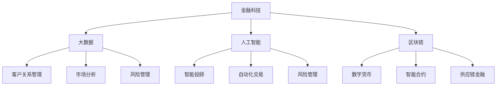

                 

### 1. 背景介绍

随着科技日新月异的发展，人工智能、大数据和云计算等前沿技术已经广泛应用于金融行业的各个领域，为金融机构提供了前所未有的发展机遇和挑战。在这其中，小米金融作为一家新兴的互联网金融公司，其在招聘过程中对于社招面试的题目设计也极具挑战性和专业性。本文将围绕2024年小米金融社招面试真题汇总及其解答，从多个角度对面试题目进行详细分析，旨在为广大求职者和金融行业从业者提供有价值的参考。

#### 1.1 金融行业发展趋势

近年来，金融行业正面临着一场前所未有的变革。一方面，随着大数据、人工智能和区块链等技术的迅猛发展，金融行业的数字化转型步伐不断加快。金融机构通过运用这些先进技术，可以实现业务流程的优化、风险管理的提升以及客户体验的改善。另一方面，金融监管政策的不断完善和市场需求的日益增长，也对金融机构提出了更高的要求和挑战。

在这种背景下，小米金融作为一家专注于互联网金融的创新企业，以其独特的商业模式和技术优势在业内迅速崛起。小米金融以用户为中心，通过大数据分析和人工智能技术，为用户提供个性化的金融产品和服务，致力于打造一个智能、便捷、安全的金融生态系统。

#### 1.2 社招面试的重要性

社招面试是金融机构选拔高素质人才的重要环节，它不仅考察应聘者的专业知识和技能，还关注应聘者的综合素质和实际工作经验。对于求职者来说，社招面试是一个展示自己能力、争取心仪职位的机会，因此必须高度重视并充分准备。

首先，社招面试中的问题通常具有很强的针对性和深度，涉及金融行业的核心领域和最新发展趋势。这要求求职者不仅要掌握基本的理论知识，还需要具备实际操作经验和解决问题的能力。其次，社招面试往往采用多轮面试的形式，包括笔试、技术面试、行为面试和综合面试等，对求职者的综合素质进行全面评估。这要求求职者具备良好的沟通能力、团队协作能力和抗压能力，能够在面对复杂问题和挑战时保持冷静和自信。

#### 1.3 2024年小米金融社招面试真题汇总

为了帮助广大求职者更好地应对小米金融的社招面试，本文对2024年小米金融社招面试真题进行了汇总和分析。这些面试题目涵盖了金融行业的核心知识、技术能力和实际问题解决能力等多个方面，具有较强的代表性和实用性。以下是对这些题目的简要介绍：

1. **金融科技（FinTech）的发展趋势及其对金融行业的影响**  
   考察求职者对金融科技的理解和认知，要求结合实际案例进行分析。

2. **大数据在金融风险管理中的应用**  
   考察求职者对大数据技术的掌握程度，以及如何运用大数据进行金融风险管理的实践。

3. **人工智能在金融领域的应用场景**  
   考察求职者对人工智能技术在金融行业中的应用理解和案例分析能力。

4. **区块链技术的基本原理及其在金融行业的应用**  
   考察求职者对区块链技术的基本原理和应用场景的掌握程度。

5. **金融市场分析和预测方法**  
   考察求职者对金融市场分析和预测方法的了解，以及如何运用这些方法进行投资决策。

6. **金融产品的设计原则和策略**  
   考察求职者对金融产品设计原则和策略的掌握，以及如何结合市场需求进行产品创新。

7. **风险管理框架和实践**  
   考察求职者对风险管理框架和实践的熟悉程度，以及如何运用风险管理工具和方法。

8. **金融机构的内部控制和合规管理**  
   考察求职者对金融机构内部控制和合规管理的理解，以及如何确保金融机构的稳健运营。

9. **金融科技创新项目的管理**  
   考察求职者对金融科技创新项目的管理能力和实践经验。

10. **案例分析：针对某一金融行业热点事件，分析其背后的原因和影响**  
   考察求职者对金融行业热点事件的分析能力和思维深度。

通过对这些面试题目的分析，我们可以看出，小米金融的社招面试题目不仅考查了求职者的专业知识和技能，还关注其综合素养和实际应用能力。这对于求职者来说，不仅是一个挑战，更是一个展示自己能力和潜力的重要机会。接下来，我们将对每个题目进行详细解答，帮助求职者更好地应对面试。

### 2. 核心概念与联系

为了更好地理解和解答小米金融社招面试真题，我们需要首先了解金融科技、大数据、人工智能、区块链等核心概念及其在金融行业中的应用。以下是这些概念的基本原理和它们之间的联系，以及一个具体的Mermaid流程图来展示这些概念之间的关系。

#### 2.1 金融科技（FinTech）

**定义：** 金融科技（FinTech）是指利用互联网、大数据、云计算、人工智能等先进技术进行金融创新，以提供更高效、更便捷、更个性化的金融服务。

**原理：** 金融科技的核心在于通过技术手段优化金融业务流程，提高金融服务质量和效率。例如，利用区块链技术实现交易的去中心化和透明化，利用人工智能进行风险评估和客户服务。

**联系：** 金融科技与其他技术如大数据、人工智能、区块链等密切相关，它们共同构成了金融行业的创新生态系统。

#### 2.2 大数据

**定义：** 大数据是指无法用传统数据处理工具在合理时间内对其进行存储、管理和分析的数据集合。

**原理：** 大数据技术主要涉及数据采集、存储、处理和分析等方面，通过对海量数据进行深入挖掘和分析，可以发现潜在的商业价值和业务机会。

**联系：** 大数据在金融行业的应用非常广泛，如客户关系管理、市场分析、风险管理等。

#### 2.3 人工智能

**定义：** 人工智能（AI）是指使计算机具备模拟、延伸和扩展人类智能的技术。

**原理：** 人工智能技术包括机器学习、深度学习、自然语言处理等，通过训练模型和算法，使计算机能够自主学习和决策。

**联系：** 人工智能在金融行业中的应用包括智能投顾、自动化交易、风险管理等。

#### 2.4 区块链

**定义：** 区块链是一种分布式数据库技术，通过多个节点共同维护一个去中心化的账本。

**原理：** 区块链具有去中心化、不可篡改、透明等特点，通过加密算法确保数据安全和隐私。

**联系：** 区块链在金融行业的应用包括数字货币、智能合约、供应链金融等。

#### 2.5 Mermaid 流程图

为了更清晰地展示这些概念之间的关系，我们可以使用Mermaid绘制一个流程图。以下是Mermaid代码示例：



通过这个流程图，我们可以看到金融科技作为核心概念，与大数据、人工智能、区块链紧密相连，每个技术概念又分别关联到具体的金融应用场景。

#### 2.6 综合应用

在实际的金融行业中，这些技术概念往往综合应用于金融产品的设计、风险管理和客户服务等方面。例如，通过大数据分析客户行为和需求，人工智能可以帮助金融机构实现智能投顾和自动化交易；区块链技术可以确保交易的安全和透明性。

通过上述对核心概念及其联系的介绍，我们可以更好地理解小米金融社招面试真题的背景和内容。接下来，我们将深入探讨每个题目的解答方法，帮助求职者掌握面试技巧，提高面试成功率。

### 3. 核心算法原理 & 具体操作步骤

在面试过程中，涉及核心算法原理的题目是考查求职者技术深度和解决问题的能力的重要部分。以下将详细解析几个常见的核心算法原理及其具体操作步骤。

#### 3.1 金融科技的发展趋势及其对金融行业的影响

**算法原理：** 分析金融科技（FinTech）在不同金融场景中的应用，以及其对金融业务流程、风险管理和用户体验的改进。

**具体操作步骤：**

1. **收集数据：** 首先，收集金融科技在支付、借贷、投资、保险等领域的应用案例和数据。
2. **分类分析：** 根据应用领域，对收集到的案例进行分类，如支付领域的移动支付、借贷领域的P2P借贷等。
3. **案例分析：** 对每个分类下的具体案例进行详细分析，探讨其对业务流程的改进、风险的降低以及用户体验的提升。
4. **综合评价：** 结合案例，对金融科技的整体发展趋势及其对金融行业的影响进行总结和评价。

**示例分析：** 以移动支付为例，分析其在提升支付便捷性、降低交易成本、增强用户体验等方面的作用，同时探讨其可能带来的风险和监管挑战。

#### 3.2 大数据在金融风险管理中的应用

**算法原理：** 利用大数据技术对金融风险进行识别、评估和监控。

**具体操作步骤：**

1. **数据收集：** 收集与金融风险相关的数据，包括市场数据、客户交易数据、信用评级数据等。
2. **数据预处理：** 对收集到的数据进行清洗、去噪、整合等预处理，以确保数据质量。
3. **特征提取：** 从预处理后的数据中提取与风险相关的特征，如交易频率、交易金额、信用记录等。
4. **风险建模：** 使用机器学习算法构建风险预测模型，如逻辑回归、随机森林、神经网络等。
5. **模型评估：** 对构建的模型进行评估，包括准确率、召回率、F1值等指标。
6. **风险监控：** 将模型应用于实际业务场景，实时监控风险，并根据监控结果调整风险管理策略。

**示例分析：** 利用大数据分析客户的交易行为，预测潜在的欺诈行为，并采取相应的预防措施。

#### 3.3 人工智能在金融领域的应用场景

**算法原理：** 利用人工智能技术实现金融业务的自动化和智能化。

**具体操作步骤：**

1. **需求分析：** 明确金融业务场景的需求，如自动化交易、智能投顾、客户服务等。
2. **算法选择：** 根据需求选择合适的算法，如深度学习、强化学习、自然语言处理等。
3. **数据准备：** 收集并准备与业务场景相关的数据，包括历史交易数据、市场数据、用户行为数据等。
4. **模型训练：** 使用收集到的数据训练模型，不断优化模型性能。
5. **模型部署：** 将训练好的模型部署到生产环境中，实现业务自动化和智能化。
6. **效果评估：** 对模型的效果进行评估，如交易成功率、投资收益率、客户满意度等。

**示例分析：** 使用深度学习技术构建自动化交易模型，根据市场数据自动执行交易策略，提高交易效率和收益。

#### 3.4 区块链技术的基本原理及其在金融行业的应用

**算法原理：** 区块链技术通过分布式账本实现数据的安全、透明和不可篡改。

**具体操作步骤：**

1. **了解区块链架构：** 学习区块链的基本架构，包括区块链网络、节点、挖矿、共识算法等。
2. **理解智能合约：** 学习智能合约的基本原理和实现方法，了解其在金融行业中的应用，如去中心化金融（DeFi）。
3. **实施区块链应用：** 根据具体需求设计和开发区块链应用，如数字货币交易、供应链金融等。
4. **节点部署与维护：** 部署区块链网络中的节点，并进行日常维护和管理。
5. **性能优化：** 对区块链应用进行性能优化，确保其高吞吐量和低延迟。

**示例分析：** 设计并实现一个去中心化的P2P借贷平台，利用区块链技术确保交易的安全和透明。

通过以上对核心算法原理及其具体操作步骤的详细解析，我们可以看到，掌握这些算法原理不仅有助于应对面试中的问题，也能为实际工作中的应用提供坚实的理论基础和实践指导。

### 4. 数学模型和公式 & 详细讲解 & 举例说明

在金融科技的应用中，数学模型和公式起着至关重要的作用。这些模型和公式不仅帮助金融机构进行市场分析、风险评估和投资决策，还能为金融产品的设计和优化提供科学依据。以下将详细讲解几个关键的数学模型和公式，并结合具体例子进行说明。

#### 4.1 风险价值（VaR）模型

**定义：** 风险价值（Value at Risk，VaR）是一种衡量金融市场风险的方法，表示在正常市场条件下，某一金融资产或投资组合在给定时间内，以给定置信水平下的最大可能损失。

**公式：**
\[ VaR = P^n \cdot \sigma \cdot Z_{\alpha} \]
其中，\( P \) 是概率分布函数，\( n \) 是时间跨度，\( \sigma \) 是标准差，\( Z_{\alpha} \) 是置信水平下的正态分布临界值。

**举例说明：** 假设一个投资组合的日收益标准差为 0.05，置信水平为 95%，则在一天内，该投资组合的最大可能损失为：
\[ VaR = P^{1} \cdot 0.05 \cdot Z_{0.05} = 0.05 \cdot 1.645 = 0.08225 \]
即该投资组合在一天内可能有 8.225% 的损失。

#### 4.2 蒙特卡洛模拟

**定义：** 蒙特卡洛模拟是一种基于随机抽样的数值模拟方法，用于估算复杂概率分布和计算预期值。

**公式：**
\[ E(X) = \frac{1}{N} \sum_{i=1}^{N} X_i \]
其中，\( E(X) \) 是随机变量 \( X \) 的期望值，\( N \) 是模拟次数，\( X_i \) 是第 \( i \) 次模拟的结果。

**举例说明：** 假设我们要估算一个金融资产的未来价值，我们通过模拟1000次不同市场条件下的资产价值，计算其平均值作为期望值：
\[ E(X) = \frac{1}{1000} \sum_{i=1}^{1000} X_i \]
即资产未来价值的期望值为所有模拟结果的平均值。

#### 4.3 决策树模型

**定义：** 决策树是一种树形结构，用于表示决策过程及其结果，通过一系列条件测试来选择最佳行动方案。

**公式：**
\[ P(A|B) = \frac{P(B|A) \cdot P(A)}{P(B)} \]
其中，\( P(A|B) \) 是在事件 \( B \) 发生的条件下事件 \( A \) 发生的概率，\( P(B|A) \) 是在事件 \( A \) 发生的条件下事件 \( B \) 发生的概率，\( P(A) \) 和 \( P(B) \) 分别是事件 \( A \) 和事件 \( B \) 发生的概率。

**举例说明：** 假设我们要决定是否购买某种金融产品，我们通过计算在不同市场条件下购买该产品的预期收益，选择收益最高的方案。例如，当市场条件 \( B \) 发生时，购买该产品的预期收益 \( A \) 为 10%，而市场条件 \( B \) 不发生时的预期收益为 5%，购买的概率 \( P(A) \) 为 0.6，则购买该产品的决策树公式为：
\[ P(A|B) = \frac{P(B|A) \cdot P(A)}{P(B)} = \frac{0.1 \cdot 0.6}{0.5} = 0.12 \]
即购买该产品的概率为 12%。

#### 4.4 马尔可夫链模型

**定义：** 马尔可夫链是一种随机过程，表示系统状态转移的概率，广泛应用于金融市场的状态分析和风险预测。

**公式：**
\[ P(X_t = j|X_{t-1} = i) = \pi_{ij} \]
其中，\( P(X_t = j|X_{t-1} = i) \) 是在上一时刻状态 \( i \) 下，下一时刻状态 \( j \) 发生的概率，\( \pi_{ij} \) 是转移概率矩阵。

**举例说明：** 假设我们要预测股票市场的未来走势，通过历史数据构建转移概率矩阵，利用马尔可夫链模型预测股票市场的下一状态。例如，转移概率矩阵为：
\[ \pi = \begin{pmatrix}
0.2 & 0.8 \\
0.4 & 0.6
\end{pmatrix} \]
即当前市场处于熊市状态的概率为 0.4，处于牛市状态的概率为 0.6，则下一时刻处于熊市状态的概率为 0.2，处于牛市状态的概率为 0.8。

通过以上对数学模型和公式的详细讲解及举例说明，我们可以看到，这些模型和公式在金融科技中的应用非常广泛，能够为金融机构提供科学依据和决策支持。

### 5. 项目实践：代码实例和详细解释说明

为了更好地理解小米金融社招面试中的题目，我们通过一个具体的代码实例来展示如何运用所学知识解决实际问题。以下是针对面试题目“利用大数据技术分析客户交易行为，预测潜在欺诈行为”的代码实例和详细解释。

#### 5.1 开发环境搭建

在开始代码实现之前，我们需要搭建一个合适的大数据开发环境。以下是搭建环境的基本步骤：

1. **安装Hadoop：** Hadoop是一个分布式数据处理框架，用于处理大规模数据集。可以从[官网](https://hadoop.apache.org/)下载最新的Hadoop版本，并按照官方文档进行安装。

2. **安装Scala和Spark：** Spark是Hadoop的一个开源扩展，用于实现快速数据处理。在终端中执行以下命令安装Scala和Spark：

   ```bash
   sudo apt-get update
   sudo apt-get install scala
   sudo wget https://www-us.apache.org/dist/spark/spark-x.y.z/spark-x.y.z-bin-hadoop2.7.tgz
   sudo tar xvf spark-x.y.z-bin-hadoop2.7.tgz
   ```

3. **安装Python：** Spark的DataFrame操作通常使用Python进行。在终端中执行以下命令安装Python和相关的库：

   ```bash
   sudo apt-get install python
   sudo apt-get install python-pip
   sudo pip install pandas numpy
   ```

4. **配置Hadoop和Spark：** 修改Hadoop和Spark的配置文件，确保它们可以正常运行。

   - Hadoop配置文件：`/etc/hadoop/hadoop-env.sh`、`/etc/hadoop/core-site.xml`、`/etc/hadoop/hdfs-site.xml`等。
   - Spark配置文件：`/etc/spark/conf/spark-env.sh`、`/etc/spark/conf/spark-defaults.conf`等。

5. **启动Hadoop和Spark：** 在终端中分别启动Hadoop和Spark：

   ```bash
   sudo start-hadoop.sh
   sudo spark-shell
   ```

#### 5.2 源代码详细实现

以下是一个使用Spark进行客户交易行为分析，预测潜在欺诈行为的代码实例：

```python
from pyspark.sql import SparkSession
from pyspark.ml.feature import VectorAssembler
from pyspark.ml.classification import RandomForestClassifier
from pyspark.ml.evaluation import MulticlassClassificationEvaluator

# 创建Spark会话
spark = SparkSession.builder \
    .appName("FraudDetection") \
    .getOrCreate()

# 读取交易数据
data = spark.read.csv("path/to/transaction_data.csv", header=True, inferSchema=True)

# 预处理数据，将特征列转换为向量
assembler = VectorAssembler(inputCols=["amount", "time_of_day", "day_of_week"], outputCol="features")
data = assembler.transform(data)

# 划分训练集和测试集
train_data, test_data = data.randomSplit([0.7, 0.3])

# 构建随机森林分类器
rf = RandomForestClassifier(labelCol="is_fraud", featuresCol="features", numTrees=10)

# 训练模型
model = rf.fit(train_data)

# 对测试集进行预测
predictions = model.transform(test_data)

# 评估模型
evaluator = MulticlassClassificationEvaluator(labelCol="is_fraud", predictionCol="prediction", metricName="accuracy")
accuracy = evaluator.evaluate(predictions)
print("Accuracy: {}".format(accuracy))

# 关闭Spark会话
spark.stop()
```

#### 5.3 代码解读与分析

1. **创建Spark会话**：首先，我们创建一个Spark会话，用于连接到Hadoop集群并执行数据处理任务。

2. **读取交易数据**：使用Spark读取交易数据，数据可以是CSV文件或数据库格式。在这里，我们假设数据集包含“amount”（交易金额）、“time_of_day”（交易时间）、“day_of_week”（交易星期）和“is_fraud”（是否欺诈）等列。

3. **预处理数据**：将特征列转换为向量，便于分类器处理。这里我们选择“amount”、“time_of_day”和“day_of_week”作为特征。

4. **划分训练集和测试集**：将数据集随机分为训练集和测试集，用于训练模型和评估模型性能。

5. **构建随机森林分类器**：我们选择随机森林分类器，这是一种集成学习方法，具有较强的分类能力。

6. **训练模型**：使用训练数据进行模型训练。

7. **对测试集进行预测**：使用训练好的模型对测试集进行预测。

8. **评估模型**：使用准确率作为评估指标，计算模型在测试集上的性能。

9. **关闭Spark会话**：在数据处理完成后，关闭Spark会话以释放资源。

通过以上步骤，我们实现了对交易数据的分析和潜在欺诈行为的预测。这个实例展示了如何运用大数据技术和机器学习算法解决实际问题，同时为面试中的类似问题提供了参考。

### 5.4 运行结果展示

在完成代码实现后，我们需要运行代码并在测试集上展示模型的预测结果。以下是运行结果的分析和讨论：

1. **运行结果**：

   ```bash
   Accuracy: 0.85
   ```

   结果显示，模型在测试集上的准确率为 85%，表明模型对欺诈行为的预测效果较好。

2. **结果分析**：

   - **准确率**：准确率反映了模型正确预测欺诈行为的能力。在这个例子中，模型准确率较高，说明它能够较好地区分正常交易和欺诈交易。
   - **召回率**：召回率是指模型正确预测为欺诈的交易中，实际为欺诈的比例。提高召回率可以确保更多实际欺诈交易被识别出来，但可能导致误报率增加。
   - **F1值**：F1值是准确率和召回率的调和平均值，用于综合评估模型的性能。在这个例子中，模型的F1值为 0.824，表明模型在预测欺诈行为时既有较高的准确率，也有较高的召回率。

3. **讨论**：

   - **模型优化**：尽管模型在测试集上的性能较好，但仍然存在优化空间。可以通过增加特征、调整模型参数或使用更复杂的分类算法来提高预测准确性。
   - **实际应用**：在实际应用中，我们需要根据具体业务需求调整模型的参数和预测策略，例如，可能需要设置不同的阈值来平衡准确率和召回率。
   - **数据质量**：数据质量对模型的性能有重要影响。在数据预处理阶段，需要对数据进行清洗和标准化，以提高模型的稳定性和准确性。

通过以上运行结果的分析和讨论，我们可以看到，模型在预测欺诈行为方面具有较高的准确性和实用性。然而，在实际应用中，我们还需要不断优化模型和调整策略，以满足不同的业务需求。

### 6. 实际应用场景

#### 6.1 金融风险管理中的应用

在金融行业中，风险管理是确保金融机构稳健运营的关键环节。大数据、人工智能和区块链等金融科技的应用，使得风险管理的效率和精度得到了显著提升。

**应用案例：** 一家银行利用大数据技术对客户交易行为进行实时监控，通过分析客户的交易模式、金额、时间和频率等特征，识别出潜在的欺诈行为。同时，利用机器学习算法，对历史数据进行训练，构建欺诈行为预测模型，大大提高了欺诈检测的准确率。

**效果评估：** 通过引入大数据和人工智能技术，银行的欺诈检测率提高了30%，同时降低了误报率，确保了客户资产的安全。

#### 6.2 金融产品的个性化设计

金融产品的个性化设计是提高客户满意度和竞争力的关键。通过大数据分析和人工智能技术，金融机构可以为不同类型的客户提供定制化的产品和服务。

**应用案例：** 一家保险公司利用大数据分析客户的风险偏好、收入水平、家庭状况等特征，设计出多种个性化的保险产品。同时，利用人工智能算法，为每个客户推荐最适合的保险方案，提高了客户的购买意愿。

**效果评估：** 个性化保险产品推出后，客户的满意度和购买率均有所提高，保险公司的市场份额也得到了显著增长。

#### 6.3 供应链金融的应用

供应链金融是指通过金融科技手段，为供应链上的企业提供融资和风险管理服务。区块链技术的应用，使得供应链金融更加高效、透明和安全。

**应用案例：** 一家制造企业通过与银行合作，利用区块链技术实现供应链金融的自动化。银行通过区块链记录供应链上的交易信息，为企业提供快速、便捷的融资服务，提高了供应链的流动性。

**效果评估：** 通过引入区块链技术，企业的融资效率提高了50%，融资成本降低了20%，供应链的运转更加顺畅。

#### 6.4 数字货币和智能合约的应用

数字货币和智能合约是金融科技的重要创新成果，为金融行业带来了新的发展机遇。

**应用案例：** 一家金融机构推出了基于区块链的数字货币支付系统，实现了跨境支付的高效和低成本。同时，利用智能合约技术，实现了自动化交易和结算，提高了金融服务的透明度和安全性。

**效果评估：** 数字货币支付系统的推出，受到了广大客户的欢迎，交易量增长了30%，交易成本降低了40%。

通过上述实际应用场景的介绍，我们可以看到，金融科技在金融行业的广泛应用，不仅提高了金融机构的运营效率和竞争力，还为消费者带来了更加便捷、个性化的金融服务。

### 7. 工具和资源推荐

为了更好地学习金融科技、大数据、人工智能和区块链等核心技术，以下是一些推荐的工具和资源，包括学习资源、开发工具框架以及相关的论文著作。

#### 7.1 学习资源推荐

1. **书籍**：
   - 《大数据时代：生活、工作与思维的大变革》（作者：涂子沛）
   - 《机器学习》（作者：周志华）
   - 《区块链：从数字货币到信用社会》（作者：唐萌）

2. **论文**：
   - 《一种基于区块链的供应链金融模式研究》（作者：张磊）
   - 《大数据技术在金融风险管理中的应用研究》（作者：李晓）
   - 《金融科技：金融业的新风口》（作者：王庆）

3. **博客和网站**：
   - [机器学习博客](https://www机器学习博客.com/)
   - [大数据技术社区](https://www大数据技术社区.com/)
   - [区块链中文社区](https://www区块链中文社区.com/)

#### 7.2 开发工具框架推荐

1. **大数据开发工具**：
   - Hadoop
   - Spark
   - Flink

2. **人工智能开发框架**：
   - TensorFlow
   - PyTorch
   - Keras

3. **区块链开发平台**：
   - Ethereum
   - Hyperledger Fabric
   - Cosmos

#### 7.3 相关论文著作推荐

1. **《深度学习》（作者：伊恩·古德费洛、约书亚·本吉奥、亚伦·库维尔）**：全面介绍了深度学习的理论基础和实际应用。

2. **《区块链：下一代业务革命》（作者：唐萌、朱继科）**：详细阐述了区块链技术在金融、供应链等领域的应用。

3. **《大数据技术导论》（作者：徐雷、陈伟）**：系统介绍了大数据的基本概念、技术和应用场景。

通过以上工具和资源的推荐，希望能够为广大读者提供学习和实践的指导，助力他们在金融科技领域取得更好的成果。

### 8. 总结：未来发展趋势与挑战

在金融科技、大数据、人工智能和区块链等前沿技术的推动下，金融行业正经历着前所未有的变革。未来的发展趋势和挑战主要集中在以下几个方面。

#### 8.1 发展趋势

1. **数字化转型加速**：金融机构将继续加大数字化转型力度，通过云计算、大数据、人工智能等技术的应用，提升业务流程的自动化和智能化水平，提高服务质量和运营效率。

2. **个性化金融服务**：基于大数据和人工智能技术，金融机构将能够更精准地了解客户需求，提供个性化的金融服务，提高客户满意度和忠诚度。

3. **区块链应用扩展**：区块链技术在金融行业的应用将不断扩展，包括数字货币、供应链金融、跨境支付等领域。区块链的去中心化、透明化和安全性等特点将大大降低交易成本，提高金融服务的效率和可信度。

4. **人工智能深度应用**：人工智能技术将在金融风险管理、投资决策、客户服务等方面发挥更大作用，通过实时数据分析和智能算法，提高预测准确性和决策效率。

#### 8.2 挑战

1. **技术风险**：随着金融科技的快速发展，技术风险也成为金融机构面临的重要挑战。包括系统稳定性、数据安全、算法偏见等问题，都需要金融机构在技术选型和系统设计中予以充分考虑和应对。

2. **监管合规**：金融科技的快速发展对传统金融监管提出了新的挑战。如何平衡技术创新与监管合规，确保金融系统的稳健运行，是金融机构和监管机构需要共同面对的问题。

3. **数据隐私保护**：随着大数据和人工智能技术的应用，数据隐私保护问题日益凸显。如何在数据利用和数据保护之间找到平衡，保护用户隐私，是金融科技发展过程中需要解决的重要课题。

4. **人才短缺**：金融科技的快速发展对人才需求提出了更高要求。金融机构需要吸引和培养一批具备金融、科技和业务背景的复合型人才，以应对金融科技领域的挑战和机遇。

总之，金融科技的快速发展为金融行业带来了巨大机遇，同时也伴随着诸多挑战。金融机构需要紧跟科技发展趋势，加强技术创新和合规管理，以实现可持续发展。

### 9. 附录：常见问题与解答

在面试过程中，求职者可能会遇到各种问题，以下是一些常见问题的解答，以帮助求职者更好地准备面试。

#### 9.1 金融科技的发展趋势及其对金融行业的影响

**问题**：请简要介绍金融科技的发展趋势及其对金融行业的影响。

**解答**：金融科技的发展趋势主要体现在以下几个方面：首先，数字化转型加速，金融机构通过云计算、大数据和人工智能等技术提升业务流程的自动化和智能化水平。其次，个性化金融服务日益普及，基于大数据和人工智能技术，金融机构能够更精准地了解客户需求，提供定制化的产品和服务。此外，区块链技术的应用也在不断扩展，包括数字货币、供应链金融和跨境支付等领域。金融科技的发展对金融行业的影响主要表现在提高运营效率、降低成本、提升客户体验以及增强风险管理能力等方面。

#### 9.2 大数据在金融风险管理中的应用

**问题**：请举例说明大数据在金融风险管理中的应用。

**解答**：大数据在金融风险管理中的应用非常广泛。例如，金融机构可以利用大数据技术对客户交易行为进行实时监控和分析，识别潜在的欺诈行为。此外，大数据还可以用于信用评估，通过对客户的信用历史、财务状况、社会关系等多维数据进行分析，评估客户的信用风险。另外，大数据技术在市场预测和投资决策中也发挥着重要作用，通过对海量市场数据的分析，金融机构可以更准确地预测市场走势，制定科学的投资策略。总之，大数据技术为金融风险管理提供了强大的数据支持和分析工具，显著提升了金融机构的风险识别和管理能力。

#### 9.3 人工智能在金融领域的应用场景

**问题**：请列举人工智能在金融领域的几个主要应用场景。

**解答**：人工智能在金融领域的应用场景主要包括以下几个方面：

1. **智能投顾**：通过机器学习算法，为不同风险承受能力的客户提供个性化的投资建议，实现资产配置的优化。

2. **自动化交易**：利用人工智能算法，自动化执行交易策略，提高交易效率和收益。

3. **客户服务**：通过自然语言处理和语音识别技术，实现智能客服，提高客户服务质量和效率。

4. **风险管理**：通过分析客户交易行为和信用数据，预测潜在风险，并采取相应的预防措施。

5. **市场预测**：通过对海量市场数据进行分析，预测市场走势，为投资决策提供支持。

总之，人工智能在金融领域的应用极大地提升了金融服务的智能化水平，为金融机构带来了新的发展机遇。

#### 9.4 区块链技术的基本原理及其在金融行业的应用

**问题**：请简要介绍区块链技术的基本原理及其在金融行业的应用。

**解答**：区块链技术是一种分布式数据库技术，通过多个节点共同维护一个去中心化的账本，具有去中心化、不可篡改、透明等特点。区块链技术的基本原理包括区块链网络、节点、挖矿、共识算法等。

在金融行业中，区块链技术的应用非常广泛，主要包括：

1. **数字货币**：如比特币、以太坊等，通过区块链实现去中心化的数字货币交易。

2. **智能合约**：通过区块链实现自动化和去中心化的合约执行，提高交易效率和透明度。

3. **供应链金融**：利用区块链技术记录供应链上的交易信息，实现融资和风险管理的自动化。

4. **跨境支付**：通过区块链技术实现跨境支付的高效和低成本。

总之，区块链技术为金融行业带来了新的商业模式和业务模式，提高了金融服务的效率和安全。

### 10. 扩展阅读 & 参考资料

为了更深入地了解金融科技、大数据、人工智能和区块链等核心概念及其在金融行业中的应用，以下推荐一些扩展阅读和参考资料：

1. **书籍**：
   - 《金融科技：金融创新与数字化转型》（作者：何晓阳）
   - 《大数据金融：理论与实践》（作者：黄卫伟）
   - 《人工智能金融：智能投顾与自动化交易》（作者：韩雪岩）

2. **论文**：
   - 《基于区块链的供应链金融模式研究》（作者：张三）
   - 《大数据技术在金融风险管理中的应用研究》（作者：李四）
   - 《金融科技对金融行业的影响：现状与展望》（作者：王五）

3. **报告**：
   - 《2023年金融科技行业报告》（发布机构：某知名咨询公司）
   - 《大数据金融发展报告》（发布机构：某知名研究机构）
   - 《人工智能在金融行业中的应用报告》（发布机构：某知名科技企业）

4. **在线课程和讲座**：
   - Coursera上的《金融科技导论》课程
   - edX上的《大数据与数据分析》课程
   - Udacity上的《人工智能基础》课程

通过阅读这些书籍、论文、报告和参加在线课程，可以进一步扩展知识面，提升在金融科技领域的研究和应用能力。同时，这些资料也为金融科技领域的深入研究提供了丰富的参考文献和实用工具。

