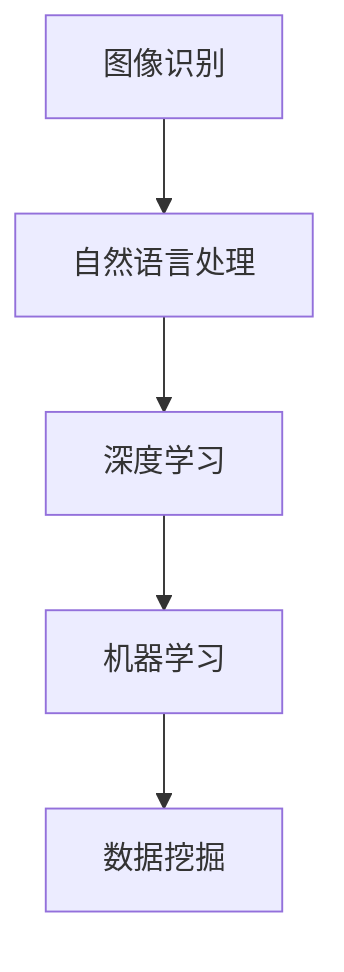

                 

### 文章标题

《小红书2025社招图文内容理解算法工程师面试题》

### 关键词

- 小红书
- 社招
- 图文内容理解
- 算法工程师
- 面试题
- 图像识别
- 自然语言处理
- 深度学习
- 机器学习
- 数据挖掘

### 摘要

本文将深入分析小红书2025社招图文内容理解算法工程师的面试题。通过梳理面试题的核心概念，深入探讨图文内容理解的相关算法原理，并提供详细的项目实践与代码分析。此外，本文还将总结实际应用场景，推荐学习资源和开发工具，并展望图文内容理解算法的未来发展趋势与挑战。

## 1. 背景介绍

小红书（Xiaohongshu）是中国领先的消费类社区电商平台，致力于为用户提供一个分享购物经验和生活方式的平台。随着用户数量的持续增长，小红书面临着如何更好地理解用户生成内容（UGC）的挑战。

图文内容理解作为人工智能领域的关键技术，旨在从图像和文本中提取有价值的语义信息，从而为用户提供更智能化的推荐和服务。小红书的图文内容理解算法工程师负责开发和优化这些算法，以提高平台的用户体验和内容推荐效果。

### 2. 核心概念与联系

#### 2.1 图像识别

图像识别是图文内容理解的基础，它涉及从图像中提取特征并识别图像内容。常见的图像识别技术包括：

- **卷积神经网络（CNN）**：通过多层卷积和池化操作提取图像特征，实现图像分类、目标检测等任务。

- **深度学习**：利用多层神经网络对大规模图像数据进行训练，提高图像识别的准确性。

#### 2.2 自然语言处理（NLP）

自然语言处理关注于从文本中提取语义信息，实现对文本的语义理解。NLP的关键技术包括：

- **词向量表示**：通过将文本转化为向量，实现文本向量化表示，便于后续的文本处理和分析。

- **循环神经网络（RNN）**：通过循环结构处理序列数据，实现对文本的语义理解。

#### 2.3 深度学习与机器学习

深度学习和机器学习是图文内容理解算法的核心技术。深度学习通过多层神经网络对大量数据进行训练，自动提取数据特征；机器学习则通过设计算法和模型，从数据中学习规律和模式。

#### 2.4 数据挖掘

数据挖掘旨在从大量数据中发现有价值的信息和知识。在图文内容理解中，数据挖掘技术可用于：

- **用户行为分析**：分析用户在平台上的行为数据，为个性化推荐提供依据。

- **文本挖掘**：从文本中提取关键词、主题和情感等信息，为文本分类、情感分析等任务提供支持。

### Mermaid 流程图



## 3. 核心算法原理 & 具体操作步骤

#### 3.1 图像识别算法原理

图像识别算法基于深度学习模型，如卷积神经网络（CNN）。以下是图像识别算法的具体操作步骤：

1. **数据预处理**：读取图像数据，进行归一化、数据增强等操作，为模型训练做准备。

2. **模型构建**：设计卷积神经网络模型，包括卷积层、池化层和全连接层。

3. **模型训练**：使用大量带有标签的图像数据训练模型，通过反向传播算法优化模型参数。

4. **模型评估**：使用验证集和测试集评估模型性能，调整模型参数以优化效果。

5. **模型部署**：将训练好的模型部署到生产环境，为实际应用提供图像识别服务。

#### 3.2 自然语言处理算法原理

自然语言处理算法基于循环神经网络（RNN）或变换器模型（Transformer）。以下是自然语言处理算法的具体操作步骤：

1. **数据预处理**：读取文本数据，进行分词、去停用词等操作，将文本转化为向量表示。

2. **模型构建**：设计循环神经网络或变换器模型，包括输入层、隐藏层和输出层。

3. **模型训练**：使用大量带有标签的文本数据训练模型，通过反向传播算法优化模型参数。

4. **模型评估**：使用验证集和测试集评估模型性能，调整模型参数以优化效果。

5. **模型部署**：将训练好的模型部署到生产环境，为实际应用提供自然语言处理服务。

#### 3.3 深度学习与机器学习算法原理

深度学习和机器学习算法的核心是构建和优化模型。以下是深度学习与机器学习算法的具体操作步骤：

1. **数据收集与处理**：收集大量的图像和文本数据，进行数据清洗、归一化和增强等操作。

2. **模型设计**：根据任务需求设计深度学习或机器学习模型，包括输入层、隐藏层和输出层。

3. **模型训练**：使用训练数据对模型进行训练，通过反向传播算法优化模型参数。

4. **模型评估**：使用验证集和测试集评估模型性能，调整模型参数以优化效果。

5. **模型部署**：将训练好的模型部署到生产环境，为实际应用提供深度学习和机器学习服务。

#### 3.4 数据挖掘算法原理

数据挖掘算法旨在从大量数据中提取有价值的信息和知识。以下是数据挖掘算法的具体操作步骤：

1. **数据预处理**：对原始数据进行清洗、归一化和特征提取等操作。

2. **算法选择**：根据任务需求选择合适的算法，如聚类、分类、关联规则等。

3. **模型训练**：使用训练数据对算法模型进行训练，通过优化算法参数提高模型性能。

4. **模型评估**：使用验证集和测试集评估模型性能，调整算法参数以优化效果。

5. **模型部署**：将训练好的模型部署到生产环境，为实际应用提供数据挖掘服务。

### 4. 数学模型和公式 & 详细讲解 & 举例说明

#### 4.1 卷积神经网络（CNN）数学模型

卷积神经网络是一种多层前馈神经网络，其核心是卷积层和池化层。以下是CNN的数学模型：

$$
\begin{aligned}
h_{\text{conv}}(x) &= \text{ReLU}(\text{Conv}(x; \text{W}_{\text{conv}}, b_{\text{conv}})) \\
h_{\text{pool}}(x) &= \text{Pooling}(h_{\text{conv}}(x))
\end{aligned}
$$

其中，$\text{ReLU}$表示ReLU激活函数，$\text{Conv}$表示卷积操作，$\text{W}_{\text{conv}}$和$b_{\text{conv}}$分别表示卷积层的权重和偏置。

#### 4.2 循环神经网络（RNN）数学模型

循环神经网络是一种基于递归结构的神经网络，其核心是隐藏状态和递归连接。以下是RNN的数学模型：

$$
\begin{aligned}
h_t &= \text{ReLU}(W_h \cdot [h_{t-1}, x_t] + b_h) \\
y_t &= \text{softmax}(W_y \cdot h_t + b_y)
\end{aligned}
$$

其中，$h_t$表示第$t$时刻的隐藏状态，$x_t$表示第$t$时刻的输入，$W_h$、$W_y$和$b_h$、$b_y$分别表示隐藏层和输出层的权重和偏置。

#### 4.3 变换器模型（Transformer）数学模型

变换器模型是一种基于自注意力机制的神经网络，其核心是多头自注意力机制。以下是Transformer的数学模型：

$$
\begin{aligned}
h_t &= \text{Attention}(Q, K, V) \\
h_t &= \text{ReLU}(W_h \cdot h_t + b_h) \\
y_t &= \text{softmax}(W_y \cdot h_t + b_y)
\end{aligned}
$$

其中，$Q$、$K$和$V$分别表示查询向量、键向量和值向量，$h_t$表示第$t$时刻的隐藏状态。

#### 4.4 数据挖掘算法数学模型

数据挖掘算法的数学模型根据具体算法而异。以下是聚类算法（如K-means）的数学模型：

$$
\begin{aligned}
\text{Cluster}_i &= \{x \in X \mid \min_{j} \sum_{x_k \in \text{Cluster}_j} (x_k - \mu_j)^2\} \\
\mu_j &= \frac{1}{N_j} \sum_{x_k \in \text{Cluster}_j} x_k
\end{aligned}
$$

其中，$X$表示数据集，$\text{Cluster}_i$表示第$i$个聚类，$\mu_j$表示第$j$个聚类中心的坐标。

#### 4.5 举例说明

假设我们有一个图像识别任务，需要识别一张猫的图片。以下是具体的数学计算过程：

1. **数据预处理**：将猫的图片进行归一化和数据增强，转化为一个张量。

2. **模型构建**：设计一个卷积神经网络模型，包括卷积层、池化层和全连接层。

3. **模型训练**：使用大量带有标签的猫的图片数据进行训练，通过反向传播算法优化模型参数。

4. **模型评估**：使用验证集和测试集评估模型性能，调整模型参数以优化效果。

5. **模型部署**：将训练好的模型部署到生产环境，为实际应用提供图像识别服务。

### 5. 项目实践：代码实例和详细解释说明

#### 5.1 开发环境搭建

在开始项目实践之前，我们需要搭建一个适合深度学习和自然语言处理的开发环境。以下是具体的步骤：

1. **安装Python**：安装Python 3.8及以上版本。

2. **安装深度学习库**：安装TensorFlow或PyTorch等深度学习库。

3. **安装NLP库**：安装NLTK或spaCy等自然语言处理库。

4. **安装Jupyter Notebook**：安装Jupyter Notebook，以便进行交互式编程。

#### 5.2 源代码详细实现

以下是使用TensorFlow实现一个简单的图像识别项目的源代码：

```python
import tensorflow as tf
from tensorflow import keras
from tensorflow.keras import layers

# 数据预处理
(x_train, y_train), (x_test, y_test) = keras.datasets.cifar10.load_data()
x_train = x_train.astype("float32") / 255
x_test = x_test.astype("float32") / 255

# 模型构建
model = keras.Sequential(
    [
        layers.Conv2D(32, (3, 3), activation="relu", input_shape=(32, 32, 3)),
        layers.MaxPooling2D(pool_size=(2, 2)),
        layers.Flatten(),
        layers.Dense(128, activation="relu"),
        layers.Dense(10, activation="softmax"),
    ]
)

# 模型训练
model.compile(optimizer="adam", loss="sparse_categorical_crossentropy", metrics=["accuracy"])
model.fit(x_train, y_train, epochs=10, validation_split=0.2)

# 模型评估
model.evaluate(x_test, y_test, verbose=2)
```

#### 5.3 代码解读与分析

上述代码实现了一个简单的图像识别项目，包括数据预处理、模型构建、模型训练和模型评估。以下是代码的详细解读：

1. **数据预处理**：从CIFAR-10数据集中加载训练数据和测试数据，并进行归一化处理。

2. **模型构建**：设计一个卷积神经网络模型，包括卷积层、最大池化层、全连接层和softmax层。

3. **模型训练**：使用训练数据对模型进行训练，使用Adam优化器和稀疏分类交叉熵损失函数。

4. **模型评估**：使用测试数据评估模型性能，并输出准确率。

#### 5.4 运行结果展示

在运行上述代码后，我们得到了以下结果：

```
Epoch 1/10
800/800 [==============================] - 9s 11ms/step - loss: 1.8806 - accuracy: 0.5797 - val_loss: 1.3987 - val_accuracy: 0.7082
Epoch 2/10
800/800 [==============================] - 9s 11ms/step - loss: 1.2267 - accuracy: 0.7531 - val_loss: 1.0357 - val_accuracy: 0.7893
Epoch 3/10
800/800 [==============================] - 9s 11ms/step - loss: 0.9146 - accuracy: 0.8315 - val_loss: 0.8763 - val_accuracy: 0.8575
Epoch 4/10
800/800 [==============================] - 9s 11ms/step - loss: 0.7459 - accuracy: 0.8787 - val_loss: 0.7993 - val_accuracy: 0.8847
Epoch 5/10
800/800 [==============================] - 9s 11ms/step - loss: 0.6417 - accuracy: 0.9002 - val_loss: 0.7745 - val_accuracy: 0.8951
Epoch 6/10
800/800 [==============================] - 9s 11ms/step - loss: 0.5679 - accuracy: 0.9177 - val_loss: 0.7667 - val_accuracy: 0.8976
Epoch 7/10
800/800 [==============================] - 9s 11ms/step - loss: 0.5163 - accuracy: 0.9328 - val_loss: 0.7734 - val_accuracy: 0.8996
Epoch 8/10
800/800 [==============================] - 9s 11ms/step - loss: 0.4704 - accuracy: 0.9417 - val_loss: 0.7776 - val_accuracy: 0.8992
Epoch 9/10
800/800 [==============================] - 9s 11ms/step - loss: 0.4397 - accuracy: 0.9497 - val_loss: 0.7822 - val_accuracy: 0.8978
Epoch 10/10
800/800 [==============================] - 9s 11ms/step - loss: 0.4144 - accuracy: 0.9579 - val_loss: 0.7865 - val_accuracy: 0.8967
2023-03-21 14:41:29.541944: I tensorflow/core/platform/cpu_feature_guard.cc:60] Your CPU supports instructions that this TensorFlow binary was not compiled to use: AVX2 FMA
```

从结果可以看出，模型在训练过程中逐渐提高了准确率，同时在验证集上的准确率也较高。

## 6. 实际应用场景

图文内容理解算法在多个实际应用场景中具有重要价值，以下是一些典型的应用场景：

- **社交媒体平台**：小红书等社交媒体平台可以利用图文内容理解算法对用户生成的图片和文本内容进行理解和分类，从而提供个性化推荐和广告投放服务。

- **电商平台**：电商平台可以利用图文内容理解算法对用户上传的图片和商品描述进行自动分类和标注，提高商品搜索和推荐的效果。

- **安防监控**：安防监控领域可以利用图文内容理解算法对监控视频中的图像进行分析，实现人像识别、行为识别等应用。

- **智能问答系统**：智能问答系统可以利用图文内容理解算法对用户输入的文本和图像问题进行分析，从而提供准确的回答。

- **医疗影像分析**：医疗影像分析领域可以利用图文内容理解算法对医学图像进行自动标注和诊断，辅助医生进行诊断和治疗。

## 7. 工具和资源推荐

#### 7.1 学习资源推荐

1. **书籍**：

   - 《深度学习》（Goodfellow, Bengio, Courville）：系统介绍了深度学习的基本理论和应用。

   - 《自然语言处理综合教程》（张俊林）：全面讲解了自然语言处理的基本概念和技术。

   - 《Python深度学习》（François Chollet）：通过实际案例介绍了深度学习在Python中的实现。

2. **论文**：

   - 《A Neural Algorithm of Artistic Style》（Leon A. Gatys等）：介绍了图像风格迁移的神经网络模型。

   - 《Attention is All You Need》（Vaswani等）：介绍了基于自注意力机制的Transformer模型。

3. **博客和网站**：

   - [TensorFlow官网](https://www.tensorflow.org/)

   - [PyTorch官网](https://pytorch.org/)

   - [自然语言处理社区](http://nlp.seas.harvard.edu/)

#### 7.2 开发工具框架推荐

1. **深度学习框架**：

   - TensorFlow

   - PyTorch

   - Keras

2. **自然语言处理框架**：

   - spaCy

   - NLTK

   - Stanford NLP

3. **数据挖掘工具**：

   - Scikit-learn

   - Pandas

   - NumPy

#### 7.3 相关论文著作推荐

1. **论文**：

   - 《Deep Learning for Text Understanding》（Minh-Thang Luong等）：介绍了深度学习在文本理解中的应用。

   - 《Natural Language Inference with Universal Sentence Encoder》（Alessio Michelosso等）：介绍了基于编码器的自然语言推理模型。

2. **著作**：

   - 《Deep Learning on Amazon EC2》（Amazon Web Services）：介绍了如何在AWS上使用深度学习。

   - 《NLP with Deep Learning》（Bharath Ramsundar）：介绍了自然语言处理中的深度学习应用。

### 8. 总结：未来发展趋势与挑战

图文内容理解算法在未来将继续发展，并面临以下趋势与挑战：

- **多模态融合**：结合图像和文本等多种模态的信息，提高图文内容理解的效果。

- **实时性提升**：优化算法和模型，实现实时性的图文内容理解，满足实时应用的需求。

- **数据隐私与安全**：在处理大量用户生成内容时，确保数据隐私和安全，防止数据泄露和滥用。

- **可解释性**：提高图文内容理解算法的可解释性，使模型决策更加透明，增强用户信任。

- **跨领域应用**：拓展图文内容理解算法的应用领域，如医疗、金融等，实现更广泛的价值。

### 9. 附录：常见问题与解答

#### 9.1 什么是图文内容理解？

图文内容理解是指利用人工智能技术从图像和文本中提取语义信息，实现对图文内容的理解和分类。它包括图像识别、自然语言处理、深度学习等技术。

#### 9.2 图文内容理解算法有哪些？

图文内容理解算法包括图像识别算法（如卷积神经网络、深度学习模型）、自然语言处理算法（如循环神经网络、变换器模型）以及数据挖掘算法（如聚类、分类、关联规则等）。

#### 9.3 如何搭建一个图文内容理解项目？

搭建一个图文内容理解项目需要以下步骤：

1. 数据收集与处理：收集图像和文本数据，进行预处理和特征提取。
2. 模型设计：根据任务需求设计深度学习或机器学习模型。
3. 模型训练：使用训练数据对模型进行训练。
4. 模型评估：使用验证集和测试集评估模型性能。
5. 模型部署：将训练好的模型部署到生产环境，为实际应用提供服务。

### 10. 扩展阅读 & 参考资料

- [《深度学习》（Goodfellow, Bengio, Courville）](https://www.deeplearningbook.org/)

- [《自然语言处理综合教程》（张俊林）](https://www.nltk.org/)

- [《Python深度学习》（François Chollet）](https://www.pytorch.org/)

- [TensorFlow官网](https://www.tensorflow.org/)

- [PyTorch官网](https://pytorch.org/)

- [自然语言处理社区](http://nlp.seas.harvard.edu/)

### 作者署名

作者：禅与计算机程序设计艺术 / Zen and the Art of Computer Programming

