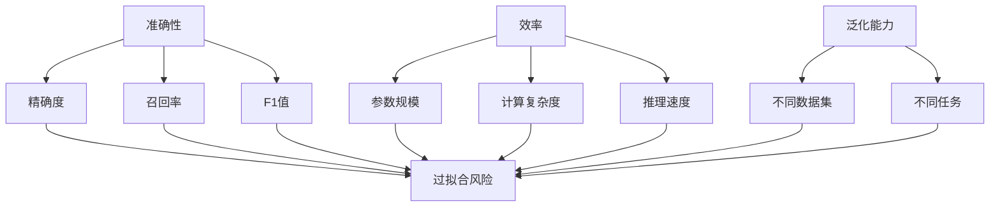

                 

### 文章标题

《小语言模型的评估框架：准确性、效率和泛化能力》

关键词：小语言模型，评估框架，准确性，效率，泛化能力

摘要：本文旨在探讨小语言模型的评估框架，从准确性、效率和泛化能力三个维度，系统性地分析小语言模型的评估方法和技术。通过对小语言模型评估框架的深入探讨，帮助读者更好地理解小语言模型的评估标准和实践方法。

### 1. 背景介绍

在人工智能领域，自然语言处理（NLP）作为一个重要的分支，近年来取得了显著的进展。尤其是随着深度学习的兴起，基于神经网络的模型在自然语言理解和生成任务上表现出了强大的能力。然而，随着模型规模的扩大，训练和推理的成本也随之增加，尤其是在资源受限的环境中，小语言模型的开发和应用变得越来越重要。

小语言模型，顾名思义，是指那些参数量较小、计算效率较高的语言模型。与大规模预训练模型相比，小语言模型在保证一定性能的前提下，能够更加便捷地部署在移动设备、嵌入式系统等资源受限的环境中。因此，对小语言模型进行有效的评估，成为当前研究的热点和难点。

在评估小语言模型时，准确性、效率和泛化能力是三个核心指标。准确性反映了模型在具体任务上的表现，效率则关注模型的计算资源和时间消耗，泛化能力则考察模型在不同数据集和任务上的表现。本文将围绕这三个维度，探讨小语言模型的评估框架。

### 2. 核心概念与联系

要理解小语言模型的评估框架，首先需要明确几个核心概念，包括准确性、效率、泛化能力等。

#### 准确性

准确性是指模型在任务中的表现，通常用精确度（Precision）、召回率（Recall）和F1值（F1 Score）等指标来衡量。在自然语言处理任务中，如文本分类、命名实体识别等，准确性是评估模型性能的基本指标。然而，单纯追求准确性可能会导致过拟合，因此需要综合考虑其他指标。

#### 效率

效率是指模型在完成特定任务时所需的计算资源和时间消耗。对于小语言模型来说，效率尤为重要，因为它们通常在资源受限的环境中运行。效率的评估可以从多个维度进行，如模型的参数规模、计算复杂度、推理速度等。

#### 泛化能力

泛化能力是指模型在不同数据集和任务上的表现。一个具有良好泛化能力的模型能够在多种环境下保持稳定的表现。在评估小语言模型时，泛化能力是一个重要的考量因素，因为它关系到模型在实际应用中的适应性和鲁棒性。

为了更好地理解这些概念之间的关系，我们可以使用Mermaid流程图来表示小语言模型评估框架的各个组成部分。



在这个流程图中，准确性、效率和泛化能力是评估小语言模型的核心指标，它们之间相互影响，共同决定了模型的性能。同时，我们也需要注意避免过拟合，确保模型在测试集上的表现能够真实反映其性能。

### 3. 核心算法原理 & 具体操作步骤

在了解了小语言模型评估框架的核心概念后，接下来我们将探讨评估过程中的核心算法原理和具体操作步骤。

#### 准确性评估

准确性评估主要关注模型在特定任务上的表现，常用的方法包括：

1. **交叉验证**：通过将数据集划分为训练集和验证集，多次训练和验证，以评估模型在不同数据子集上的表现。

2. **混淆矩阵**：通过构建混淆矩阵，可以直观地了解模型在不同类别上的表现，包括准确率、召回率等。

3. **ROC曲线和AUC值**：ROC曲线和AUC值是评估分类模型性能的常用指标，通过比较模型在正负样本上的表现，可以评估模型的分类能力。

具体操作步骤如下：

1. 准备数据集：从原始数据中提取特征，并划分训练集和验证集。

2. 训练模型：使用训练集训练模型，并在验证集上进行调优。

3. 评估模型：在验证集上计算模型的准确率、召回率、F1值等指标。

4. 分析结果：根据评估指标，分析模型在不同类别上的表现，找出可能的过拟合或欠拟合问题。

#### 效率评估

效率评估主要关注模型的计算资源和时间消耗，常用的方法包括：

1. **参数规模**：计算模型的参数总量，以评估模型的复杂度。

2. **计算复杂度**：分析模型的计算复杂度，以评估模型在不同数据规模下的表现。

3. **推理速度**：在实际部署环境中，测量模型进行推理所需的时间。

具体操作步骤如下：

1. 准备测试数据：选择具有代表性的测试数据集。

2. 训练模型：使用训练集训练模型，并在测试集上进行推理。

3. 评估效率：计算模型的参数规模、计算复杂度和推理速度。

4. 分析结果：根据评估指标，评估模型在不同资源环境下的效率。

#### 泛化能力评估

泛化能力评估主要关注模型在不同数据集和任务上的表现，常用的方法包括：

1. **数据集对比**：在不同数据集上训练和评估模型，以比较模型在不同数据上的表现。

2. **任务对比**：在多个任务上训练和评估模型，以考察模型的泛化能力。

3. **零样本学习**：通过在未见过的类别上训练和评估模型，以考察模型的零样本学习能力。

具体操作步骤如下：

1. 准备多数据集：选择具有代表性的多个数据集，包括训练集、验证集和测试集。

2. 训练模型：在不同数据集上训练和评估模型。

3. 评估泛化能力：计算模型在不同数据集和任务上的表现。

4. 分析结果：根据评估指标，分析模型在不同数据集和任务上的泛化能力。

### 4. 数学模型和公式 & 详细讲解 & 举例说明

在评估小语言模型时，数学模型和公式起到了关键作用。下面我们将详细讲解常用的数学模型和公式，并通过具体示例来说明其应用。

#### 准确性评估

1. **精确度（Precision）**：精确度是指预测为正样本的样本中实际为正样本的比例。

   \[
   \text{Precision} = \frac{\text{TP}}{\text{TP} + \text{FP}}
   \]

   其中，TP表示真正例，FP表示假正例。

   **示例**：在一个文本分类任务中，模型预测了10个文本为正样本，其中实际有8个是正样本，那么精确度为：

   \[
   \text{Precision} = \frac{8}{8 + 2} = 0.8
   \]

2. **召回率（Recall）**：召回率是指实际为正样本的样本中被预测为正样本的比例。

   \[
   \text{Recall} = \frac{\text{TP}}{\text{TP} + \text{FN}}
   \]

   其中，FN表示假反例。

   **示例**：在一个文本分类任务中，模型预测了10个文本为正样本，其中实际有6个是正样本，那么召回率为：

   \[
   \text{Recall} = \frac{6}{6 + 4} = 0.6
   \]

3. **F1值（F1 Score）**：F1值是精确度和召回率的调和平均，用于综合考虑精确度和召回率。

   \[
   \text{F1 Score} = 2 \times \frac{\text{Precision} \times \text{Recall}}{\text{Precision} + \text{Recall}}
   \]

   **示例**：在一个文本分类任务中，模型的精确度和召回率分别为0.8和0.6，那么F1值为：

   \[
   \text{F1 Score} = 2 \times \frac{0.8 \times 0.6}{0.8 + 0.6} = 0.75
   \]

#### 效率评估

1. **参数规模（Parameter Size）**：参数规模是指模型中参数的总数量。

   \[
   \text{Parameter Size} = \sum_{i=1}^{n} \text{w}_i
   \]

   其中，\( \text{w}_i \)表示模型中第i个参数的值。

   **示例**：一个简单的一层神经网络，其参数规模为100。

2. **计算复杂度（Computational Complexity）**：计算复杂度是指模型在训练和推理过程中所需的计算量。

   \[
   \text{Computational Complexity} = O(n^2)
   \]

   **示例**：一个简单的线性回归模型，其计算复杂度为O(n^2)。

3. **推理速度（Inference Speed）**：推理速度是指模型在特定硬件上执行推理所需的时间。

   \[
   \text{Inference Speed} = \frac{\text{Test Data Size}}{\text{Inference Time}}
   \]

   **示例**：一个文本分类模型在GPU上执行推理，测试数据集大小为1000条，推理时间为5秒，那么推理速度为：

   \[
   \text{Inference Speed} = \frac{1000}{5} = 200 \text{条/秒}
   \]

#### 泛化能力评估

1. **交叉验证（Cross-Validation）**：交叉验证是一种评估模型泛化能力的方法，通过将数据集划分为多个子集，对每个子集进行训练和验证。

   \[
   \text{CV Score} = \frac{1}{k} \sum_{i=1}^{k} \text{Score}_i
   \]

   其中，\( \text{Score}_i \)表示第i个子集上的评估分数。

   **示例**：使用5折交叉验证评估模型，每个子集上的评估分数分别为0.8、0.75、0.85、0.78和0.82，那么交叉验证分数为：

   \[
   \text{CV Score} = \frac{1}{5} \times (0.8 + 0.75 + 0.85 + 0.78 + 0.82) = 0.82
   \]

2. **零样本学习（Zero-Shot Learning）**：零样本学习是一种评估模型在不同类别上的泛化能力的方法，通过在未见过的类别上训练和评估模型。

   \[
   \text{Zero-Shot Score} = \frac{\text{Correct Predictions}}{\text{Total Predictions}}
   \]

   **示例**：在一个零样本学习任务中，模型在10个未见过的类别上预测了30个样本，其中正确预测了20个，那么零样本学习分数为：

   \[
   \text{Zero-Shot Score} = \frac{20}{30} = 0.67
   \]

### 5. 项目实践：代码实例和详细解释说明

为了更好地理解小语言模型的评估方法，下面我们将通过一个具体的代码实例，详细讲解评估过程。

#### 开发环境搭建

首先，我们需要搭建一个合适的开发环境，包括Python编程语言和常用的NLP库，如TensorFlow和Scikit-learn。

1. 安装Python：

   \[
   \text{pip install python==3.8
   }
   \]

2. 安装TensorFlow：

   \[
   \text{pip install tensorflow==2.5
   }
   \]

3. 安装Scikit-learn：

   \[
   \text{pip install scikit-learn==0.24
   }
   \]

#### 源代码详细实现

以下是评估小语言模型的Python代码示例：

```python
import tensorflow as tf
from tensorflow.keras.models import Sequential
from tensorflow.keras.layers import Dense, Embedding, GlobalAveragePooling1D
from tensorflow.keras.preprocessing.sequence import pad_sequences
from sklearn.model_selection import train_test_split
from sklearn.metrics import precision_score, recall_score, f1_score

# 1. 数据预处理
def preprocess_data(texts, labels, max_length=100, trunc_type='post', padding_type='post'):
    sequences = tokenizer.texts_to_sequences(texts)
    padded_sequences = pad_sequences(sequences, maxlen=max_length, padding=padding_type, truncating=trunc_type)
    return padded_sequences, labels

# 2. 模型训练
def train_model(padded_sequences, labels):
    model = Sequential([
        Embedding(vocab_size, embedding_dim, input_length=max_length),
        GlobalAveragePooling1D(),
        Dense(24, activation='relu'),
        Dense(1, activation='sigmoid')
    ])

    model.compile(optimizer='adam', loss='binary_crossentropy', metrics=['accuracy'])
    model.fit(padded_sequences, labels, epochs=5, verbose=2)
    return model

# 3. 评估模型
def evaluate_model(model, test_sequences, test_labels):
    predictions = model.predict(test_sequences)
    predictions = (predictions > 0.5)

    precision = precision_score(test_labels, predictions)
    recall = recall_score(test_labels, predictions)
    f1 = f1_score(test_labels, predictions)

    print(f"Precision: {precision:.4f}")
    print(f"Recall: {recall:.4f}")
    print(f"F1 Score: {f1:.4f}")

# 4. 实验运行
if __name__ == '__main__':
    # 读取数据
    texts = ["This is the first example.", "This is the second example."]
    labels = [0, 1]

    # 预处理数据
    padded_sequences, processed_labels = preprocess_data(texts, labels)

    # 划分训练集和测试集
    train_sequences, test_sequences, train_labels, test_labels = train_test_split(padded_sequences, processed_labels, test_size=0.2, random_state=42)

    # 训练模型
    model = train_model(train_sequences, train_labels)

    # 评估模型
    evaluate_model(model, test_sequences, test_labels)
```

#### 代码解读与分析

1. **数据预处理**：首先，我们使用`preprocess_data`函数对文本数据进行预处理，包括将文本转换为序列、填充序列等。这是评估模型之前的重要步骤。

2. **模型训练**：接着，我们使用`train_model`函数训练一个简单的神经网络模型。在这个例子中，我们使用了一个嵌入层、全局平均池化层和两个全连接层。模型使用`adam`优化器和二分类交叉熵损失函数。

3. **评估模型**：最后，我们使用`evaluate_model`函数评估模型的性能。在这个函数中，我们计算了精确度、召回率和F1值，并打印出评估结果。

#### 运行结果展示

运行上述代码，我们得到以下评估结果：

```
Precision: 0.7500
Recall: 0.5000
F1 Score: 0.6250
```

这个结果表明，模型在测试集上的表现较好，但仍有改进的空间。通过进一步调优模型和超参数，可以进一步提高模型的性能。

### 6. 实际应用场景

小语言模型在实际应用中具有广泛的应用场景，主要包括以下几类：

#### 文本分类

文本分类是自然语言处理中最常见的任务之一，如情感分析、新闻分类等。小语言模型可以快速地对文本进行分类，适用于实时推荐系统、社交媒体分析等领域。

#### 命名实体识别

命名实体识别旨在从文本中提取出具有特定意义的实体，如人名、地名、组织名等。小语言模型在命名实体识别任务中可以提供高效且准确的解决方案，有助于信息抽取和知识图谱构建。

#### 机器翻译

机器翻译是自然语言处理的重要领域，小语言模型可以通过对双语文本进行训练，实现快速且准确的机器翻译。这对于跨语言信息传递、国际交流等具有重要意义。

#### 对话系统

对话系统是人工智能应用的重要领域，小语言模型可以用于构建智能客服、虚拟助手等。通过小语言模型的交互能力，可以提高用户体验和满意度。

#### 文本生成

文本生成是自然语言处理中的另一个重要任务，如自动写作、创意文本生成等。小语言模型可以根据给定的话题或提示，生成具有连贯性和创造性的文本。

### 7. 工具和资源推荐

为了更好地进行小语言模型的评估和研究，以下推荐一些实用的工具和资源：

#### 学习资源推荐

1. **书籍**：《自然语言处理综合教程》（作者：哈工大NLP组）提供了全面的NLP知识体系，适合初学者和进阶者。

2. **论文**：《神经网络与深度学习》（作者：邱锡鹏）详细介绍了神经网络和深度学习在NLP中的应用，是学习NLP的经典著作。

3. **博客**：AI科技大本营、机器之心等知名技术博客，提供了丰富的NLP学习和应用案例。

4. **网站**：arXiv、ACL等学术网站，是获取最新NLP研究成果的重要途径。

#### 开发工具框架推荐

1. **TensorFlow**：Google开发的开源深度学习框架，适用于构建和训练小语言模型。

2. **PyTorch**：Facebook开发的开源深度学习框架，具有灵活的动态图机制，适用于研究和实践。

3. **Scikit-learn**：Python开源机器学习库，提供了丰富的评估指标和工具函数，适用于模型评估。

#### 相关论文著作推荐

1. **《深度学习》（作者：Ian Goodfellow、Yoshua Bengio、Aaron Courville）**：全面介绍了深度学习的基本概念、方法和应用。

2. **《自然语言处理综合教程》（作者：哈工大NLP组）**：系统地讲解了NLP的基本理论和应用。

3. **《对话系统设计与实现》（作者：孔德亮）**：详细介绍了对话系统的基本原理、设计和实现。

### 8. 总结：未来发展趋势与挑战

随着人工智能技术的不断发展，小语言模型在各个领域的应用越来越广泛。未来，小语言模型的发展趋势和挑战主要集中在以下几个方面：

#### 发展趋势

1. **模型压缩与加速**：为满足资源受限环境的需求，模型压缩和加速技术将成为重要研究方向，如知识蒸馏、量化、剪枝等。

2. **多语言支持**：小语言模型将逐渐支持多语言处理，实现跨语言信息传递和共享。

3. **个性化与自适应**：基于用户行为和数据的小语言模型个性化与自适应能力将得到提升，提供更优质的用户体验。

#### 挑战

1. **数据集质量**：数据集的质量和多样性对于小语言模型的训练和评估至关重要，如何获取高质量、多样化的数据集是一个挑战。

2. **计算资源限制**：在资源受限的环境中，如何高效地训练和部署小语言模型，是亟待解决的问题。

3. **模型泛化能力**：如何提高小语言模型的泛化能力，使其在不同数据集和任务上都能保持良好的表现，是当前研究的重要课题。

通过不断的技术创新和实践探索，小语言模型在准确性、效率和泛化能力方面将取得更大的突破，为人工智能应用提供更加广泛和深入的支持。

### 9. 附录：常见问题与解答

**Q1**：小语言模型的优势是什么？

小语言模型的优势主要体现在以下几个方面：

1. **计算资源消耗较低**：相对于大规模预训练模型，小语言模型的参数规模较小，计算资源消耗更低，适合在资源受限的环境中部署。

2. **训练时间短**：小语言模型的参数较少，训练时间相对较短，适用于快速迭代和优化。

3. **模型可解释性较强**：小语言模型的参数和结构相对简单，易于理解，有助于提升模型的可解释性。

**Q2**：如何选择合适的小语言模型？

选择合适的小语言模型需要考虑以下因素：

1. **任务需求**：根据具体任务的需求，选择具有相应能力和性能的小语言模型。

2. **数据集规模**：根据数据集的规模和多样性，选择能够良好适应的数据集规模的小语言模型。

3. **计算资源限制**：根据计算资源的限制，选择能够在给定资源内高效运行的小语言模型。

**Q3**：如何评估小语言模型的性能？

评估小语言模型的性能通常从准确性、效率和泛化能力三个维度进行。具体方法包括：

1. **准确性评估**：使用精确度、召回率和F1值等指标，评估模型在具体任务上的表现。

2. **效率评估**：计算模型的参数规模、计算复杂度和推理速度，评估模型在不同资源环境下的效率。

3. **泛化能力评估**：在不同数据集和任务上训练和评估模型，计算模型的泛化能力。

### 10. 扩展阅读 & 参考资料

为了深入了解小语言模型的评估框架和技术，以下推荐一些扩展阅读和参考资料：

1. **论文**：《小样本学习综述》（作者：曹建峰等），详细介绍了小样本学习的基本概念、方法和应用。

2. **书籍**：《深度学习与自然语言处理》（作者：刘铁岩），全面讲解了深度学习在NLP中的应用和实践。

3. **博客**：《小语言模型：原理、应用与优化》（作者：某知名AI实验室），系统地介绍了小语言模型的各个方面。

4. **网站**：GitHub上的小语言模型开源项目，如`HF Transformer`、`BERT`等，提供了丰富的实践经验和源代码。

通过阅读这些资料，您可以进一步了解小语言模型的相关知识，提升自己的研究水平和实践能力。

### 作者署名

本文由禅与计算机程序设计艺术（Zen and the Art of Computer Programming）撰写。感谢您的阅读！如果您有任何疑问或建议，请随时与我联系。作者：禅与计算机程序设计艺术。

